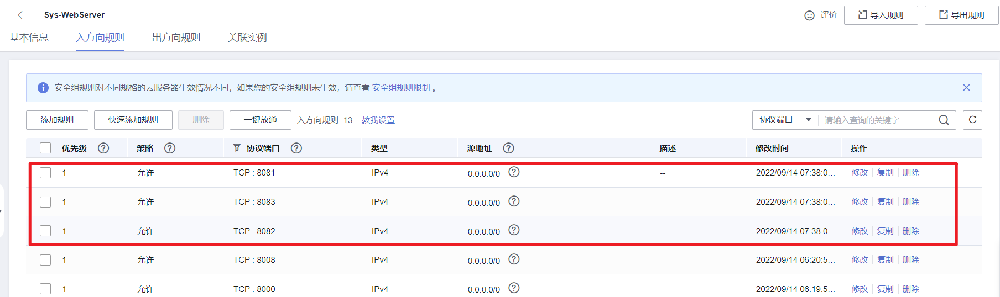

## Dockerfile镜像制作

docker/podman中， 镜像是容器的基础，每次执行docker run的时候都会指定哪个基本镜像作为容器运行的基础。我们之前的docker的操作都是使用来自dockerhub提供的官方镜像，直接使用这些镜像只能满足一定的基本需求，当基础镜像无法满足我们的业务需求时，就得使用Dockerfile自己定制这些镜像了。

Dockerfile是提供开发者用于定制自定义镜像的配置文件。所以我们需要掌握Dockerfile文件的基本语法。

```
镜像的定制就类似小时候学画画的水彩画一样，水彩画是一层一层的涂抹上去的，而镜像的定制则是编写定制每一层所添加的配置、文件等命令信息。如果可以把每一层修改、安装、构建、操作的命令都写入到一个脚本，用脚本来构建、定制镜像，这个脚本就是Dockerfile。

Dockerfile 是一个文本文件，其内包含了一条条用于自定义镜像的指令(Instruction)，这些指令每一条就构建一层，因此每一条指令的内容，就是告诉docker该如何构建每一层的镜像内容。
注意：每一层指令执行结束以后就会隔离打开一层。所以Dockerfile中的命令层级如果越多，则构建生成的镜像就越大，也就越臃肿，所以我们应该在学习完Dockerfile的语法以后，尽量采用最少的指令来定制镜像。
```

### 基本指令


#### FROM参数

一般写在Dockerfile的首行，指定基础镜像，一个Dockerfile中只有一个FROM

```dockerfile
FROM elasticsearch # 制作base image(基础镜像)，尽量使用官方的image作为base image
FROM centos:8 # 以centos为基础镜像，进行二次构建镜像
FROM ubuntu:20.04 # 带有tag的基础镜像
```

#### LABEL参数

等价于MAINTAINER，用于设置当前dockerfile镜像的作者相关信息。

```dockerfile
FROM elasticsearch 

LABEL version="1.0.0"     # 容器元信息，帮助信息，Metadata，类似于代码注释
LABEL maintainer="649641514@qq.com"
```

#### RUN参数

RUN参数是一个万能指令，用于指定镜像内部执行系统命令， 对于复杂的RUN命令，避免不必要的分层，多条命令用反斜线换行，或者使用`&&` 组合成一条命令！

```dockerfile
RUN apt update && apt install -y vim \
         Python-dev  && # 反斜线表示命令没有结束，仅仅换行
        /bin/bash -c "source $HOME/.bashrc;echo $HOME"
```


#### WORKDIR参数

设置镜像启动以后的容器默认工作目录，相当于linux的cd命令

```dockerfile
WORKDIR /ect # 相当于linux的cd命令，改变目录，尽量使用绝对路径！！！不要用RUN cd
WORKDIR /home/demo # 如果没有就自动创建
RUN pwd       # 打印结果应该是/home/demo
```

#### ADD参数

复制解压，把宿主机的一个文件，添加到容器空间内，相当于 docker的cp

```dockerfile
ADD /opt/django/manage.py /opt/  # 把宿主机的/opt/django/manage.py放到容器空间内的/opt/目录下
ADD /opt/python3.8.12.tar.gz /opt/  # ADD的解压文件作用，将宿主机的/opt/下的python3.6.tar.gz解压到容器内的/opt/目录下
```

#### COPY参数

拷贝指令，功能与ADD类似，但是没有解压过程，只有单纯复制，也相当于 docker的cp。

将宿主机的文件, 拷贝到容器内，但是没有解压缩的命令，尽量使用COPY,不要使用ADD

```dockerfile
COPY /opt/django/manage.py /opt/ # 把宿主机的/opt/django/manage.py放到容器空间内的/opt/目录下
```

> 注意：ADD与COPY的区别：
>
> 1. 如果不是复制压缩包到容器内部，优先使用COPY命令
> 2. ADD除了COPY功能还有解压功能
> 3. 添加远程网络文件/目录使用RUN curl或RUN wget

#### ENV参数

设置docker容器内部的系统环境变量，相当于 `docker -e`

```dockerfile
ENV MYSQL_VERSION 5.6 # 设置一个mysql常量,这个${MYSQL_VERSION}类似于全局常量
RUN yum install -y mysql-server="${MYSQL_VERSION}"  # 如果版本号有变更，则只需要改这个常量就可以了
```

#### CMD参数

Dockerfile的结尾运行命令，类似RUN ，但是参数值是一个数组/列表，使用中括号括起来。

```dockerfile
CMD ["sh", "run.sh"]
```

使用 Dockerfile之前，先切换成国内docker镜像源

```bash
mkdir -p /etc/docker
sudo vim /etc/docker/daemon.json


{
    "registry-mirrors" : [
        "https://registry.docker-cn.com",
        "https://docker.mirrors.ustc.edu.cn",
        "http://hub-mirror.c.163.com",
        "https://cr.console.aliyun.com/"
    ]
}
```


### 使用Dockerfile封装Django镜像

在/home下建立了docker目录，在这个目录下准备好要构建镜像的文件和源码包。

```bash
mkdir /home/docker && cd /home/docker
# 创建镜像制作配置文件，
touch Dockerfile
# 创建一个shell脚本，用于后面启动django项目的。
touch run.sh
# docker官方提供的ubuntu镜像，里面源地址过时了，所以我们提供一个新的到容器内部
touch sources.list
sudo cp /etc/apt/sources.list ./
vim sources.list
```

sources.list，代码：

```nginx
deb http://repo.huaweicloud.com/ubuntu/ focal main restricted
deb http://repo.huaweicloud.com/ubuntu/ focal-updates main restricted
deb http://repo.huaweicloud.com/ubuntu/ focal universe
deb http://repo.huaweicloud.com/ubuntu/ focal-updates universe
deb http://repo.huaweicloud.com/ubuntu/ focal multiverse
deb http://repo.huaweicloud.com/ubuntu/ focal-updates multiverse
deb http://repo.huaweicloud.com/ubuntu/ focal-backports main restricted universe multiverse
deb http://repo.huaweicloud.com/ubuntu focal-security main restricted
deb http://repo.huaweicloud.com/ubuntu focal-security universe
deb http://repo.huaweicloud.com/ubuntu focal-security multiverse
```

下载一个django-3.2.5的源码包

```
wget -O Django-3.2.5.tar.gz https://gitee.com/mirrors/django/repository/archive/3.2.5?format=tar.gz
```

编写Dockerfile构建镜像的配置文件

```bash
vim Dockerfile
```

```dockerfile
FROM ubuntu:20.04

LABEL version="3.2.5"
LABEL maintainer="649641514@qq.com"

ADD Django-3.2.5.tar.gz /opt/
COPY sources.list  /etc/apt/sources.list

RUN apt update &&  apt install -y python3 python3-pip

WORKDIR /opt/
RUN mv django-3.2.5 django

WORKDIR /opt/django
RUN python3 setup.py install

WORKDIR /opt
RUN django-admin.py startproject djdemo
COPY run.sh /opt/djdemo/run.sh

WORKDIR /opt/djdemo
RUN sed -i "s/ALLOWED_HOSTS = \[\]/ALLOWED_HOSTS = \['\*'\]/g" /opt/djdemo/djdemo/settings.py &&  chmod 755 run.sh

EXPOSE 8000
CMD ["/bin/sh","run.sh"]
```

注意：Dockerfile中不能出现命令以外的任何注释。以下是注释版本：

```dockerfile
# 指定当前定制镜像的基础镜像以及版本号
FROM ubuntu:20.04
# 指定镜像的描述信息[版本号、作者]
LABEL version="1.0.0"
LABEL maintainer="649641514@qq.com"

# 从镜像外复制并解压到镜像内部
ADD Django-3.2.5.tar.gz /opt/
# 设置当前定制镜像的镜像源
COPY /etc/apt/sources.list  /etc/apt/sources.list
# 运行终端命令，安装python3以及相关工具包
RUN apt update &&  apt install -y python3 python3-pip
# 切换工作目录
WORKDIR /opt/
# 改目录名
RUN mv django-3.2.5 django
# 切换工作目录
WORKDIR /opt/django
# 安装django框架
RUN python3 setup.py install
# 切换工作目录
WORKDIR /opt
# 创建一个django项目
RUN django-admin.py startproject djdemo
# 从镜像外界复制一个run.sh启动脚本到django项目根目录下
COPY run.sh /opt/djdemo/run.sh

# 切换工作目录
WORKDIR /opt/djdemo
# 替换django配置文件settings.py的ALLOWED_HOSTS配置项，允许客户端通过任何地址访问django项目并设置django的启动脚本的权限为755
RUN sed -i "s/ALLOWED_HOSTS = \[\]/ALLOWED_HOSTS = \['\*'\]/g" /opt/djdemo/djdemo/settings.py && chmod 755 run.sh
# 开放镜像的端口8000
EXPOSE 8000
# CMD就是RUN，用于在结尾执行终端命令
CMD ["/bin/sh","run.sh"]
```


编写run.sh

```bash
vim run.sh
```

```
python3 manage.py runserver 0.0.0.0:8000
```

Docker构建镜像

```bash
# docker build -t 镜像名:镜像版本 Dockerfile所在路径
sudo docker build -t djdemo:3.2.5 .
docker images
```

构建完成后，可以看到生成一个新镜像。

此时后台启动镜像，并把容器8000端口映射到物理机的8008端口。

```
docker run -d -p 8008:8000 --name=django1 djdemo:3.2.5
```

注意：在云服务器上找到安全组，并在入方向，开放上述的端口，例如：8008。


## Docker-Compose容器编排

### 基本介绍

使用一个Dockerfile模板文件，可以很方便的定义一个适合自己使用的自定义镜像。但在工作中经常会碰到需要多个容器相互配合来完成某项任务或运行某个项目的情况。例如要运行一个django项目，除了django容器本身，往往还需要再加上后端的数据库服务容器，甚至还包括负载均衡容器等，此时我们就需要使用到Docker-Compose了。

> 注意：
>
> Docker-Compose仅仅用于批量操作docker容器不能用于podman的，对于podman的容器批量操作则需要安装podman-compose来批量操作。
>
> 当然，podman-compose和docker-compose的使用和语法是一样的。

Docker-Compose项目是Docker官方的开源项目，负责实现对Docker容器集群的快速编排。Docker-Compose项目由Python编写，调用Docker服务提供的API来对容器进行管理和编排。因此只要所操作的平台支持Docker API，就可以在其上利用Docker-Compose来进行Docker容器的编排和管理。


Docker-Compose将所管理的Docker容器分为三层，分别是工程（project），服务（service）以及容器（container）。

Docker-Compose允许我们开发者通过一个单独的docker-compose.yml配置文件（YAML 格式）来定义一组相关联的docker容器为一个工程（project）。一个工程至少有一个服务，一个服务下至少有一个容器。

Docker-Compose运行指定目录下的所有关联文件组成一个工程（工程名默认为当前目录名）。一个工程当中可包含多个服务，每个服务中可以定义Docker容器运行的镜像，参数，环境依赖等信息。

Docker-Compose的工程配置文件默认为docker-compose.yml，也可以通过-f 参数来指定成其他的配置文件名。


### 安装与卸载

安装环境查看

```bash
uname -a
lsb_release -a  # CentOS： yum install redhat-lsb
```

安装地址：https://docs.docker.com/compose/install/

发布地址：https://github.com/docker/compose/releases

```bash
# 下载docker-compose的python二进制执行脚本程序
sudo curl -L "https://github.com/docker/compose/releases/download/v2.10.2/docker-compose-$(uname -s)-$(uname -m)" -o /usr/local/bin/docker-compose
# 给当前docker-compose脚本程序增加执行权限
sudo chmod +x /usr/local/bin/docker-compose
# 生成一个硬连接，作为全局命令
sudo ln -s /usr/local/bin/docker-compose /usr/bin/docker-compose
```

查看安装的版本

```bash
docker-compose version
```

卸载

```
sudo rm /usr/local/bin/docker-compose
sudo rm /usr/bin/docker-compose
```

 

### 常用命令

基本命令格式

```
docker-compose [-f <arg>...] [options] [COMMAND] [ARGS...]
```

命令选项如下

```bash
-f --file FILE指定Compose模板文件，默认为当前目录下docker-compose.yml
# -p --project-name NAME 指定项目名称，默认使用当前所在目录为项目名
# --verbose  输出更多调试信息
# -v，-version 打印版本并退出
# --log-level LEVEL 定义日志等级(DEBUG, INFO, WARNING, ERROR, CRITICAL)
```


####  　`docker-compose up`

根据容器编排配置文件docker-compose.yml，进行编排和启动容器。相当于`docker run`的增强版。

```bash
docker-compose up [options] [--scale SERVICE=NUM...] [SERVICE...]
选项包括：
  -f 指定compose模板文件名
  -d 在系统守护进程的方式批量运行服务容器
    
# 常用写法：
# docker-compose up  # 以占据终端的方式批量启动docker-compose.yml中配置的所有容器
# docker-compose up -d   # 以系统守护进程的方式批量启动docker-compose.yml中配置的所有容器，不会占据终端
# docker-compose -f docker-compose.yaml up -d
```


#### `docker-compose down`

停止运行并删除docker-compose.yml配置的容器、网络、卷。相当于 `docker stop` 与 `docker rm`的组合

```bash
docker-compose down [options]
选项包括：
  -f 指定compose模板文件名
  
# 常用写法：
# docker-compose down
# docker-compose -f docker-compose.yml down
```


#### `docker-compose logs`

列出当前工程项目中运行容器过程中的运行日志。相当于`docker logs `

```bash
docker-compose logs [options] [SERVICE...]
选项包括：
  -f 跟踪日志输出

# 常用写法：
docker-compose logs    # 查看整个docker-compose.yml配置中所有的容器的运行日志，不占据终端
docker-compose logs -f  # 监控整个docker-compose.yml配置中所有的容器的运行日志，占据终端
```


#### docker-compose stop

停止运行docker-compose.yml配置的容器，可以通过docker-compose start 再次启动

```bash
docker-compose stop [options] [SERVICE...]
选项包括：
  -f 指定compose模板文件名
  
# 常用写法：
# docker-compose stop
# docker-compose -f docker-compose.yml stop
```


####  docker-compose start

启动运行docker-compose.yml配置的容器，可以通过docker-compose stop 关闭运行。

```
docker-compose start [SERVICE...]
选项包括：
  -f 指定compose模板文件名
  
# 常用写法：
# docker-compose stop
# docker-compose -f docker-compose.yml stop
```


#### docker-compose ps

列出当前工程项目中的所有服务容器

```
docker-compose  ps [options] [SERVICE...]
```


#### docker-compose bulid

```
docker-compose build [options] [--build-arg key=val...] [SERVICE...]
构建（重新构建）项目中的服务容器。
选项包括：
–compress 通过gzip压缩构建上下环境
–force-rm 删除构建过程中的临时容器
–no-cache 构建镜像过程中不使用缓存
–pull 始终尝试通过拉取操作来获取更新版本的镜像
-m, –memory MEM为构建的容器设置内存大小
–build-arg key=val为服务设置build-time变量
服务容器一旦构建后，将会带上一个标记名。可以随时在项目目录下运行docker-compose build来重新构建服务
```


#### docker-compose pull

```
docker-compose pull [options] [SERVICE...]
拉取服务依赖的镜像。
选项包括：
–ignore-pull-failures，忽略拉取镜像过程中的错误
–parallel，多个镜像同时拉取
–quiet，拉取镜像过程中不打印进度信息
docker-compose pull
拉取服务依赖的镜像
```


#### docker-compose restart

```
docker-compose restart [options] [SERVICE...]
重启项目中的服务。
选项包括：
-t, –timeout TIMEOUT，指定重启前停止容器的超时（默认为10秒）
docker-compose restart
重启项目中的服务
```


#### docker-compose rm

```
docker-compose rm [options] [SERVICE...]
删除所有（停止状态的）服务容器。
选项包括：
–f, –force，强制直接删除，包括非停止状态的容器
-v，删除容器所挂载的数据卷
docker-compose rm
删除所有（停止状态的）服务容器。推荐先执行docker-compose stop命令来停止容器。
```


#### docker-compose run

```
docker-compose run [options] [-v VOLUME...] [-p PORT...] [-e KEY=VAL...] SERVICE [COMMAND] [ARGS...]
在指定服务上执行一个命令。
docker-compose run ubuntu ping www.baidu.com
在指定容器上执行一个ping命令。
```


#### docker-compose scale

```
docker-compose scale web=3 db=2
设置指定服务运行的容器个数。通过service=num的参数来设置数量
```


#### docker-compose pause

```
docker-compose pause [SERVICE...]
暂停一个服务容器
```

#### docker-compose uppause

```
docker-compose unpause [SERVICE...]
恢复处于暂停状态中的服务。
```


#### docker-compose kill

```
docker-compose kill [options] [SERVICE...]
通过发送SIGKILL信号来强制停止服务容器。
支持通过-s参数来指定发送的信号，例如通过如下指令发送SIGINT信号：
docker-compose kill -s SIGINT
```


#### docker-compose config

```
docker-compose config [options]
验证并查看compose文件配置。
选项包括：
–resolve-image-digests 将镜像标签标记为摘要
-q, –quiet 只验证配置，不输出。 当配置正确时，不输出任何内容，当文件配置错误，输出错误信息
–services 打印服务名，一行一个
–volumes 打印数据卷名，一行一个
```


#### docker-compose create

```
docker-compose create [options] [SERVICE...]
为服务创建容器。
选项包括：
–force-recreate：重新创建容器，即使配置和镜像没有改变，不兼容–no-recreate参数
–no-recreate：如果容器已经存在，不需要重新创建，不兼容–force-recreate参数
–no-build：不创建镜像，即使缺失
–build：创建容器前　　，生成镜像
```


#### docker-compose exec

```
docker-compose exec [options] SERVICE COMMAND [ARGS...]
选项包括：
-d 分离模式，后台运行命令。
–privileged 获取特权。
–user USER 指定运行的用户。
-T 禁用分配TTY，默认docker-compose exec分配TTY。
–index=index，当一个服务拥有多个容器时，可通过该参数登陆到该服务下的任何服务，例如：docker-compose exec –index=1 web /bin/bash ，web服务中包含多个容器
```


#### docker-compose port

```
docker-compose port [options] SERVICE PRIVATE_PORT
显示某个容器端口所映射的公共端口。
选项包括：
–protocol=proto，指定端口协议，TCP（默认值）或者UDP
–index=index，如果同意服务存在多个容器，指定命令对象容器的序号（默认为1）
```


#### docker-compose push

```
docker-compose push [options] [SERVICE...]
推送服务端的镜像。
选项包括：
–ignore-push-failures 忽略推送镜像过程中的错误
```


### 模板配置入门

Compose模板文件是一个定义服务、网络和逻辑卷的YAML文件。Compose模板文件默认路径是当前目录下的docker-compose.yml，可以使用.yml或.yaml作为文件扩展名。
Docker-Compose标准模板文件应该包含version、services、networks 三大部分，最关键的是services和networks两个部分。networks是可选参数。

例如，我们要一次性启动3个ubuntu容器运行各自不同的配置下。

```bash
mkdir -p /home/compose && cd /home/compose
vim docker-compose.yml
```

docker-compose.yml，代码：

```yaml
version: "3.8"
services:
  ubuntu1:
    image: ubuntu:20.04
    container_name: "ubuntu1"
    networks:
      - dev

  ubuntu2:
    image: ubuntu:20.04
    container_name: "ubuntu2"
    networks:
      - dev
      - pro

  ubuntu3:
    image: ubuntu:20.04
    container_name: "ubuntu3"
    networks:
      - pro

networks:
  dev:
    driver: bridge
  pro:
    driver: bridge
```

docker-compose.yml，注释版本，代码：

```python
# 目前我们使用的基本都是Version3版本，最新版本是3.9。
version: "3.8"
    
# 声明接下来开始配置服务容器
services:
  # 服务名，开发者自定义的，
  ubuntu1:
    # image 当前服务容器的基本依赖镜像，如果本地没有该镜像，则会自动从官网pull拉取
    # image 也可以是自己本地基于Dockerfile编译后产生的定制镜像，但是必须是已经build编译好的
    # 如希望在docker-compose up启动容器服务时自动编译Dockerfile，则必须增加配置项build指定Dockerfile
    # 文件的所在路径，如果不指定，则可能出现从官网拉取镜像失败的情况，build配置项写法如下:
    # build: .
    # 如使用了build配置项时还声明了image配置项，则基于build所在的Dockerfile编译的镜像名为image指定名字。
    # build: .
    # image: djdemo:1.0.0
    image: ubuntu:20.04
    # container_name 指定当前服务容器启动以后的容器名
    container_name: "ubuntu1"
   	# networks 指定网络，可以分配容器在一个或多个网络，如果不指定，则默认分配在docker的default网络中
    networks:
      - dev

  ubuntu2:
    image: ubuntu:20.04
    container_name: "ubuntu2"
    networks:
      - dev
      - pro

  ubuntu3:
    image: ubuntu:20.04
    container_name: "ubuntu3"
    networks:
      - pro

# 网络配置
networks:
  # 指定网络名称，相当于网卡名
  dev:
    # driver 网卡驱动：bridge 桥接模式，网卡驱动有三种模式：bridge、host、none
    # 查看网络：docker network ls
    driver: bridge
  pro:
    driver: bridge
```

完成上面的配置以后，可以通过以下命令，批量创建ubuntu容器。

```bash
# 切换目录
cd /home/compose
# 批量启动容器
docker-compose up
# 查看当前目录下的docker-compose.yml配置的容器
docker-compose ps
# 删除docker-compose.yml配置的容器
docker-compose down

docker-compose up -d
docker-compose ps
docker-compose down
```


#### 配置项说明

##### image

image是指定服务的镜像名称或镜像ID。如果镜像在本地不存在，Compose将会尝试拉取镜像。

注意：如果镜像有版本号，则镜像名和版本号之间不能出现空格！否则报错！！！

```yaml
services:
  ubuntu1:
    image: ubuntu:20.04
```


##### build

服务除了可以基于指定的基础镜像，还可以基于一份Dockerfile的自定义镜像，在使用docker-compose up启动时执行docker容器的构建任务，构建标签是build，可以指定Dockerfile所在文件夹的路径。Compose将会利用Docker自动构建镜像，然后使用镜像启动服务容器。

```yaml
services:
    web:
        build: /home/docker  # 指定Dockerfile文件的路径，如果与docker-compose.yml在同一个目录，则可以使用 . 表示当前目录
```

也可以是相对路径，只要上下文确定就可以读取到Dockerfile。

```yaml
services:
    web:
        build: ../docker
```

设定上下文根目录，然后以该目录为准指定Dockerfile。

```yaml
services:
  web:
    build:
      context: ../docker
      dockerfile: Dockerfile
```

build都是一个目录，如果要指定Dockerfile文件需要在build标签的子级标签中使用dockerfile标签指定。
如果同时指定image和build两个标签，那么Compose会构建镜像并且把镜像命名为image值指定的名字。

```yaml
services:
  web:
    image: djdemo:1.0.0
    build:
      context: /home/docker
      dockerfile: Dockerfile
```

```python
context选项可以是Dockerfile的文件路径，也可以是到链接到git仓库的url，当提供的值是相对路径时，被解析为相对于撰写文件的路径，此目录也是发送到Docker守护进程的context
dockerfile选项可以指定context对应目录下的Dockerfile文件来构建，必须指定构建路径
```


##### command

使用command可以覆盖容器启动后默认执行的命令。相当于 `docker`命令的末尾参数。

compose的command会覆盖Dockerfile里面的CMD的值。

```yaml
command: shell命令
```


##### container_name

Compose的容器名称格式是：<项目名称><服务名称><序号>，相当于 `docker [选项] --name`
可以自定义项目名称、服务名称，但如果想完全控制容器的命名，可以使用标签指定：

```yaml
container_name: app
```


##### restart

指定容器是否在操作系统重启以后，docker启动以后，是否容器也自动重启。相当于 `docker --restart=always`

```yaml
restart: always
```


##### environment

指定服务容器中的环境变量，可以多个环境变量，每个环境变量就一个成员，相当于 `docker -e`

```yaml
version: '3.7'
services:
  mysql:
    image: mysql:8.0.26
    restart: always
    container_name: mysql
    networks:
      - mysql
    environment:
      - "MYSQL_ROOT_PASSWORD=root"
      - "MYSQL_USER=luffycity"
      - "MYSQL_PASSWORD=luffycity"
      - "MYSQL_DATABASE=luffycity"
      - "TZ=Asia/Shanghai"
```


##### depends_on

在使用Compose时，最大的好处就是少打启动命令，但一般项目中多个容器的启动，顺序是有要求的，如果直接从上到下启动容器，必然会因为容器依赖问题而启动失败。例如在没启动数据库容器的时候启动应用容器，应用容器会因为找不到数据库而退出。depends_on标签用于解决容器的依赖、启动先后顺序的问题

```yaml
version: '3.7'
services:
  django:
    build: .
    depends_on:
      - mysql
      - redis
  redis:
    image: redis:6.0
  mysql:
    image: mysql:8.0.26
```

上述YAML文件定义的容器会先启动redis和db两个服务，最后才启动django服务。


##### ports

ports用于映射端口的标签。
使用HOST:CONTAINER格式或者只是指定容器的端口，宿主机会随机映射端口。相当于`docker -p`

```yaml
ports:
 - "3000"  # 等价于 "3000:3000"
 - "8000:8000"
 - "49100:22"
```

当使用HOST:CONTAINER格式来映射端口时，如果使用的容器端口小于60可能会得到错误得结果，因为YAML将会解析xx:yy这种数字格式为60进制。所以建议采用字符串格式。


##### volumes

挂载一个目录或者一个已存在的数据卷容器，可以直接使用 [HOST:CONTAINER]格式，或者使用[HOST:CONTAINER:ro]格式，后者对于容器来说，数据卷是只读的，可以有效保护宿主机的文件系统。
Compose的数据卷指定路径可以是相对路径，使用 . 或者 .. 来指定相对目录。

相当于 docker run 终端命令选项-v参数

数据卷的格式可以是下面多种形式

```yaml
volumes:
  # 只是指定一个路径，Docker 会自动在创建一个数据卷（这个路径是容器内部的）。
  # 相当于 /var/lib/mysql:/var/lib/mysql
  - /var/lib/mysql
  # 使用绝对路径挂载数据卷
  - /opt/data:/var/lib/mysql
  # 以 Compose 配置文件为中心的相对路径作为数据卷挂载到容器。
  - ./cache:/tmp/cache
  # 使用用户的相对路径（~/ 表示的目录是 /home/<用户目录>/ 或者 /root/）。
  - ~/configs:/etc/configs/:ro
  # 已经存在的命名的数据卷。
  - datavolume:/var/lib/mysql
```

如果不使用宿主机的路径，可以指定一个volume_driver。

`volume_driver: mydriver`

##### volumes_from

从另一个服务或容器挂载其数据卷：

```yaml
volumes_from:
   - service_name   
     - container_name
```


##### dns

自定义DNS服务器。可以是一个值，也可以是一个列表。

```yaml
dns：8.8.8.8
dns：
    - 8.8.8.8   
      - 9.9.9.9
```


##### expose

暴露端口，但不映射到宿主机，只允许能被连接的服务访问。仅可以指定内部端口为参数，如下所示：

```yaml
expose:
    - "3000"
    - "8000"
```


##### links

链接到其它服务中的容器。使用服务名称（同时作为别名），或者“服务名称:服务别名”（如 SERVICE:ALIAS），例如：

```yaml
links:
    - db
    - db:database
    - redis
```


##### net

设置网络模式。

```yaml
net: "bridge"
net: "none"
net: "host"
```


### 模板配置编写案例

在开发中，我们的前端项目经常需要提供给外界浏览服务，所以往往我们会使用nginx这样的web服务器来提供前端文件给外界访问。所以我们创建并切换到/home/website目录，创建docker-compose.yml，并编写配置多个nginx容器批量启动。

```bash
mkdir /home/website && cd /home/website 
vim docker-compose.yml
```

配置代码：

```yaml
version: "3.8"
services:
  web1:
    image: nginx:1.21.4
    container_name: "web1"
    ports:
      - "8081:80"
    networks:
      - dev

  web2:
    image: nginx:1.21.4
    container_name: "web2"
    ports:
      - "8082:80"
    networks:
      - dev
      - pro

  web3:
    image: nginx:1.21.4
    container_name: "web3"
    ports:
      - "8083:80"
    networks:
      - pro

networks:
  dev:
    driver: bridge
  pro:
    driver: bridge
```


#### 启动服务容器

使用docker-compose批量启动容器

```bash
# docker-compose up      # 阻塞运行
docker-compose up -d     # 后台运行
```


#### 服务访问

开放安全组端口以后，可以通过浏览器访问web1，web2，web3。

```
http://114.115.200.1:8081/
http://114.115.200.1:8082/
http://114.115.200.1:8083/
```

注意IP要换成自己的，同时，注意添加安全组的入方向规则的端口。

