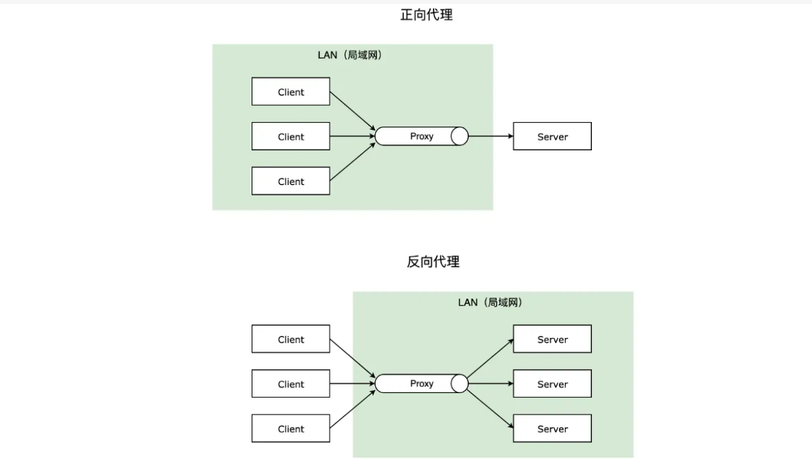

## Nginx

### 基本介绍

nginx是一个开源免费的，高性能，高并发的web服务和代理服务软件。它是俄罗斯人lgor sysoev(伊戈尔·塞索耶夫)在2000开发的，在2004年将源代码开源出来供全球使用。
nginx比传统的web服务器apache性能改进了许多，nginx占用的系统资源更少，支持更高的并发连接，有更高的访问效率。
nginx不但是一个优秀的web服务软件，还可以作为**反向代理**，**负载均衡**，以及**缓存服务**使用。
安装更为简单，方便，灵活，具有强大的生态，因为使用的开发者非常多，很多人都给nginx开发了各种应用场景的插件。




优势

```
1. 支持高并发，能支持几万并发连接
2. 资源消耗少，在3万并发连接下开启10个nginx线程消耗的内存不到200M
3. 可以做http反向代理和负载均衡
4. 支持异步网络io，epoll事件模型
5. 是目前最优秀的静态网页web服务器，最优秀静态资源web服务器
```


### nginx配置文件解析

nginx.conf，代码：


nginx.conf，核心配置文件

```bash
# nginx运行的用户身份，一般要么注释掉，要么就把nobody改成www或者nginx
# user  nobody;

# 工作进程数 (如果是双核4线程，可以设置为4，一般建议跟CPU的逻辑核数量一致)
worker_processes auto;

# 单个进程最大可打开文件数，因为nginx经常用于提供静态文件访问支持，所以往往运营时间长了就会出现单个进程打开文件超标，所以要设置。
worker_rlimit_nofile 65535;

# 错误日志配置，如果不配置，则错误日志保存在安装路径下
# error_log  logs/error.log;
# error_log  logs/error.log  notice;
# error_log  logs/error.log  info;

# 进程标识符
# pid        logs/nginx.pid;


events {
    worker_connections 102400; 
    # 最大可以调整到100000以上，nginx的最大并发连接数 = worker_processes * worker_connections

    # use epoll;
    # 设置nginx使用的IO多路复用的事件模型，默认不设置即可，nginx会采用当前系统最优的事件模型 
    # linux建议epoll，FreeBSD建议采用kqueue，window下不指定，采用select。
}

# nginx作为httpweb服务器的相关配置，站点配置server必须填写在http选项中。
http {
    # 导入mime.types模块，让nginx能够识别各种各样的文件资源
    include       mime.types;
    # nginx默认识别的mime.types，默认采用二进制数据格式。
    default_type  application/octet-stream;

    # 设置客户端访问nginx的访问日志格式
    log_format  main  '$remote_addr - $remote_user [$time_local] "$request" '
                      '$status $body_bytes_sent "$http_referer" '
                      '"$http_user_agent" "$http_x_forwarded_for"';
    # 开启访问日志
    access_log  logs/access.log  main;

    # Nginx在进行数据传输，会调用sendfile()函数， Linux 2.0+ 以后的推出的一个系统调用。
    # 对比一般的数据的网络传输sendfile会有更少的切换和更少的数据拷贝。
    sendfile        on;
    tcp_nopush     on;
    
    # 客户端保持连接时间
    #keepalive_timeout  0;
    keepalive_timeout  65;

    # 开启网络传输的数据gzip压缩[会额外消耗一定的cpu资源，但是会节约大量的出口带宽来提高访问速度，gzip压缩算法的使用会带来一定的安全隐患，不建议压缩图片和大文件]
    gzip  on;
    #低于1kb的资源不压缩 
    gzip_min_length 1k;
    
    # 设置压缩级别，级别范围：1~9，数字越大压缩率越高，同时消耗cpu资源也越多，建议设置在5左右。 
    gzip_comp_level 5;
    # 指定压缩哪些MIME类型的静态资源，多个空格隔开。不建议压缩图片，视频等二进制文件
    gzip_types text/plain application/javascript application/x-javascript text/javascript text/xml text/css;
    # web站点的虚拟主机，类似python的虚拟环境，这里的配置，会让nginx自动提供一个站点给外界访问
    # nginx可以通过设置多个server配置项，提供多个站点的访问支持
    # 一个server就代表一个站点，也可以理解为一个服务端的源，源是通过端口、地址、协议进行区分。
    server {
        # 站点的访问端口，要允许外界访问，还需要设置防火墙
        listen       80;
        # 站点的访问域名地址
        server_name  www.luffycity.dabanyu.com;

        #charset koi8-r;

        #access_log  logs/host.access.log  main;
        # 地址模式匹配，location后面的是访问url路径，相当于django的正则路由一样，
        # 地址匹配成功以后，则会调用当前花括号的配置信息
        location / {
            # root 表示当前站点所在目录
            root   html;
	    # index 指定默认首页
            index  main.html main.htm;
        }
	location /admin {
            # http代理
            proxy_pass http://localhost:81/main.html;
        }
        
        error_page  404              /404.html;

        # redirect server error pages to the static page /50x.html
        #
        error_page   500 502 503 504  /50x.html;
        location = /50x.html {
            root   html;
        }

        # proxy the PHP scripts to Apache listening on 127.0.0.1:80
        #
        #location ~ \.php$ {
        #    proxy_pass   http://127.0.0.1;
        #}

        # pass the PHP scripts to FastCGI server listening on 127.0.0.1:9000
        #
        #location ~ \.php$ {
        #    root           html;
        #    fastcgi_pass   127.0.0.1:9000;
        #    fastcgi_index  index.php;
        #    fastcgi_param  SCRIPT_FILENAME  /scripts$fastcgi_script_name;
        #    include        fastcgi_params;
        #}

        # deny access to .htaccess files, if Apache's document root
        # concurs with nginx's one
        #
        #location ~ /\.ht {
        #    deny  all;
        #}
    }


    # another virtual host using mix of IP-, name-, and port-based configuration
    #
    #server {
    #    listen       8000;
    #    listen       somename:8080;
    #    server_name  somename  alias  another.alias;

    #    location / {
    #        root   html;
    #        index  index.html index.htm;
    #    }
    #}


    # HTTPS server
    #
    #server {
    #    listen       443 ssl;
    #    server_name  localhost;

    #    ssl_certificate      cert.pem;
    #    ssl_certificate_key  cert.key;

    #    ssl_session_cache    shared:SSL:1m;
    #    ssl_session_timeout  5m;

    #    ssl_ciphers  HIGH:!aNULL:!MD5;
    #    ssl_prefer_server_ciphers  on;

    #    location / {
    #        root   html;
    #        index  index.html index.htm;
    #    }
    #}

}
```

