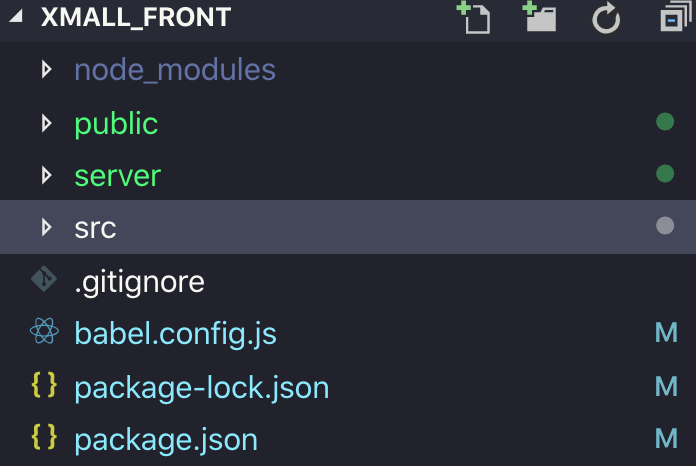
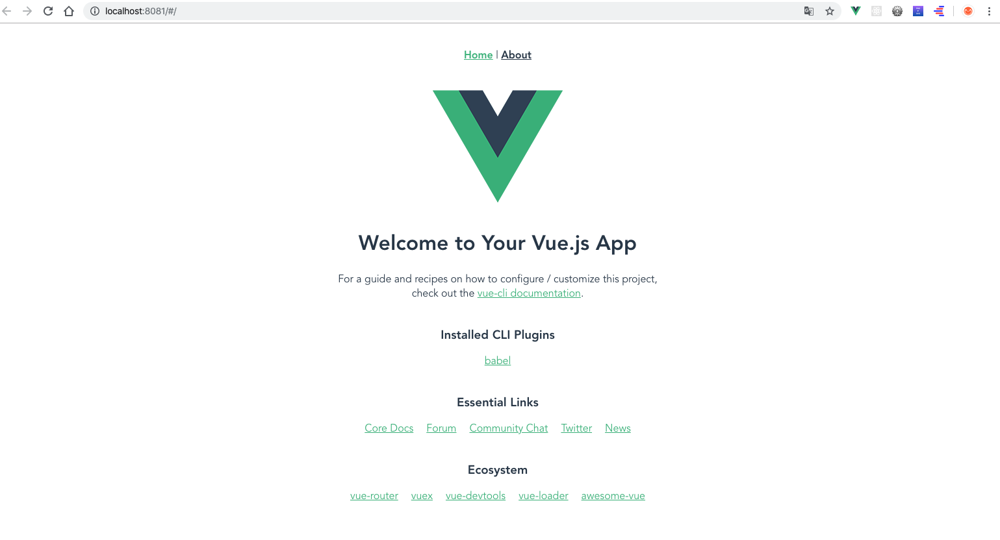
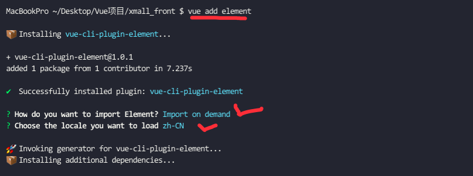
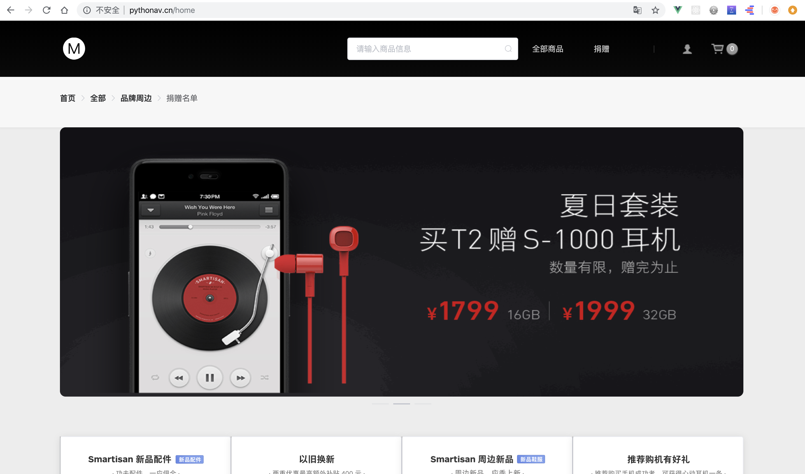

[TOC]

### 课程目标

- 运用vue+vue-router+vuex+element-ui搭建网站
- 对项目进行需求分析和模块划分以及功能划分
- 实现首页+全部+品牌周边页面渲染
- 查看商品详情页制作、商品排序以及分页功能实现
- 使用token+jwt实现网站用户登录退出 (后台)
- 使用meta元信息实现路由权限控制
- 实现加入购物车、图片懒加载功能
- 实现数据持久化存储用户数据和购物车数据
- 项目优化以及如何打包上线整个流程

### 项目初始化

- `vue create xmall_front`

- 项目目录如下

  

- 

```js
cd xmall_front
npm run server
//访问https://localhost:8080
```

效果如下：



### 安装依赖

- 安装sass:`npm install -D sass-loader node-sass` 

- 安装element-ui第三方组件库：`vue add element `



- 安装图片懒加载插件：`npm i vue-lazyload -S`
- 安装请求库：`npm i axios -S`

### 路由配置

```js
import Vue from 'vue'
import VueRouter from 'vue-router'

// 解决路由命名冲突的方法
const routerPush = VueRouter.prototype.push
VueRouter.prototype.push = function push(location) {
  return routerPush.call(this, location).catch(error => error)
}

// 异步组件加载
const Index = () => import('@/views/Index');
const Login = () => import('@/views/Login');
const Home = () => import('@/views/Home');
const Goods = () => import('@/views/Goods');
const Thanks = () => import('@/views/Thanks');
const GoodsDetail = () => import('@/views/GoodsDetail');
const User = () => import('@/views/User');
// import Index from '@/views/Index'
// import Login from '@/views/Login'
// import Home from '@/views/Home'
// import Goods from '@/views/Goods'
// import Thanks from '@/views/Thanks'
// import GoodsDetail from '@/views/GoodsDetail'
// import User from '@/views/User';
Vue.use(VueRouter)

const routes = [

  {
    path: "/",
    redirect: '/home',
    name: 'home',
    component: Index,
    children: [
      {
        path: "home",
        component: Home
      },
      {
        path: "goods",
        component: Goods
      },
      {
        path: "thanks",
        component: Thanks
      },
      {
        path: 'goodsDetail',
        name: 'goodsDetail',
        component: GoodsDetail
      }
    ]
  },
  {
    path: '/login',
    name: "login",
    component: Login
  },
  {
    path:'/user',
    name:'user',
    component:User,
    meta:{
      // 需要守卫
      auth:true
    }
  }
 
  
]

const router = new VueRouter({
  mode: 'history',
  routes
})

export default router

```


### 组件模板样例

/components/Shelf.vue

```vue
<template>
  <div class="gray-box">
    <div class="title">
        <h2>{{title}}</h2>
    </div>
    <div>
        <!-- 具名插槽 -->
        <slot name='content'></slot>
    </div>
  </div>
</template>

<script>
export default {
    props:['title']
};
</script>

<style lang="scss" scoped>
.gray-box {
  position: relative;
  margin-bottom: 30px;
  overflow: hidden;
  background: #fff;
  border-radius: 8px;
  border: 1px solid #dcdcdc;
  border-color: rgba(0, 0, 0, 0.14);
  box-shadow: 0 3px 8px -6px rgba(0, 0, 0, 0.1);
  .title {
    padding-left: 30px;
    position: relative;
    z-index: 10;
    height: 60px;
    padding: 0 10px 0 24px;
    border-bottom: 1px solid #d4d4d4;
    border-radius: 8px 8px 0 0;
    box-shadow: rgba(0, 0, 0, 0.06) 0 1px 7px;
    background: #f3f3f3;
    background: -webkit-linear-gradient(#fbfbfb, #ececec);
    background: linear-gradient(#fbfbfb, #ececec);
    line-height: 60px;
    font-size: 18px;
    color: #333;
    display: flex;
    justify-content: space-between;
    align-items: center;
    h2 {
      font-size: 18px;
      font-weight: 400;
      color: #626262;
      display: inline-block;
    }
  }
}
</style>
```

/components/MallGoods.vue

```css
<template>
  <el-row class="good-item">
    <el-col>
      <el-card :body-style="{padding: 0}">
        <div class="good-img">
          <a>
            
          </a>
        </div>
        <h6 class="good-title">商品标题</h6>
        <h3 class="sub-title ellipsis">子标题</h3>
        <div class="good-price pr">
          <div class="ds pa">
            <a href>
              <el-button type="default" size="medium">查看详情</el-button>
            </a>
            <a href>
              <el-button type="primary" size="medium">加入购物车</el-button>
            </a>
          </div>
          <p>
            <span style="font-size:14px">¥</span>
            20.00
          </p>
        </div>
      </el-card>
    </el-col>
  </el-row>
</template>
<style lang="scss" scoped>
.good-img {
  display: flex;
  justify-content: center;
  a {
    display: block;
    img {
      margin: 50px auto 10px;
      width: 206px;
      height: 206px;
      display: block;
    }
  }
}
.good-price {
  margin: 15px 0;
  height: 30px;
  text-align: center;
  line-height: 30px;
  color: #d44d44;
  font-family: Arial;
  font-size: 18px;
  font-weight: 700;
  display: flex;
  justify-content: space-around;
  padding-bottom: 60px;
  a {
    margin-right: 5px;
  }
  .ds {
    display: none;
  }
}
.good-price:hover .ds {
  display: block;
}
.good-title {
  line-height: 1.2;
  font-size: 16px;
  color: #424242;
  margin: 0 auto;
  padding: 0 14px;
  text-align: center;
  overflow: hidden;
}
h3 {
  text-align: center;
  line-height: 1.2;
  font-size: 12px;
  color: #d0d0d0;
  padding: 10px;
}
.good-item {
  background: #fff;
  width: 25%;
  transition: all 0.5s;
  height: 410px;
  &:hover {
    transform: translateY(-3px);
    box-shadow: 1px 1px 20px #999;
    .good-price p {
      display: none;
    }
    .ds {
      display: flex;
    }
  }
}
.el-card {
  border: none;
}
</style>
```

/components/Shelf.vue

```vue
<template>
  <el-input-number v-model="num" @change="handleChange" :min="1" :max="10" label="描述文字"></el-input-number>
</template>

<script>
export default {
  data() {
    return {
      num: 1
    };
  },
  methods: {
    handleChange(value) {
      this.$emit('handleValue',value)
    }
  }
};
</script>

<style lang="scss" scoped>
</style>
```


/Goods/index.vue

```vue
<template>
  <div class="goods">
    <div class="nav">
      <div class="w">
        <a>标题</a>
        <div class="price-interval">
          <input type="number" class="input" placeholder="价格" v-model="min">
          <span style="margin: 0 5px">-</span>
          <input type="number" placeholder="价格" v-model="max">
          <el-button type="primary" size="small" style="margin-left: 10px;">确定</el-button>
        </div>
      </div>
    </div>
    <div>
      <div class="goods-box w">
        所有商品
      </div>
      <div class="w">
        分页
      </div>
    </div>
  </div>
</template>

<script>

export default {
  data() {
    return {
      max: "",
      min: "",
    };
  },
};
</script>

<style lang="scss" scoped>
@import "../../assets/style/mixin";
@import "../../assets/style/theme";

.nav {
  height: 60px;
  line-height: 60px;
  > div {
    display: flex;
    align-items: center;
    a {
      padding: 0 30px 0 0;
      height: 100%;
      @extend %block-center;
      font-size: 12px;
      color: #999;
      &.active {
        color: #5683ea;
      }
      &:hover {
        color: #5683ea;
      }
    }
    input {
      @include wh(80px, 30px);
      border: 1px solid #ccc;
    }
    input + input {
      margin-left: 10px;
    }
  }
  .price-interval {
    padding: 0 15px;
    @extend %block-center;
    input[type="number"] {
      border: 1px solid #ccc;
      text-align: center;
      background: none;
      border-radius: 5px;
    }
  }
}

.goods-box {
  overflow: hidden;
  > div {
    float: left;
    border: 1px solid #efefef;
  }
}

.no-info {
  padding: 100px 0;
  text-align: center;
  font-size: 30px;
  display: flex;
  flex-direction: column;
  .no-data {
    align-self: center;
  }
}

.img-item {
  display: flex;
  flex-direction: column;
}

.el-pagination {
  align-self: flex-end;
  margin: 3vw 10vw 2vw;
}

.section {
  padding-top: 8vw;
  margin-bottom: -5vw;
  width: 1218px;
  align-self: center;
}

.recommend {
  display: flex;
  > div {
    flex: 1;
    width: 25%;
  }
}
</style>
```

/GoodsDetails/index.vue

``` vue
<template>
  <div class="w store-content">
    <div class="gray-box">
      <div class="gallery-wrapper">
        <div class="gallery">
          <div class="thumbnail">
            <ul>
              <li>
                
              </li>
            </ul>
          </div>
          <div class="thumb">
            <div class="big">
              
            </div>
          </div>
        </div>
      </div>
      <!--右边-->
      <div class="banner">
        <div class="sku-custom-title">
          <h4>{{product.productName}}</h4>
          <h6>
            <span>{{product.subTitle}}</span>
            <span class="price">
              <em>¥</em>
              <i>{{product.salePrice.toFixed(2)}}</i>
            </span>
          </h6>
        </div>
        <div class="num">
          <span class="params-name">数量</span>
          <BuyNum @handlerValue="productNum"></BuyNum>
        </div>
        <div class="buy">
          <el-button
            type="primary"
          >加入购物车</el-button>
          <el-button type="danger">现在购买</el-button>
        </div>
      </div>
    </div>
    <!--产品信息-->
    <div class="item-info">
      
    </div>
  </div>
</template>

<script>
export default {
  name: "goodsDetails",
  
};
</script>

<style lang="scss" scoped>
@import "../../assets/style/mixin";

.store-content {
  clear: both;
  width: 1220px;
  min-height: 600px;
  padding: 0 0 25px;
  margin: 0 auto;
}

.gray-box {
  display: flex;
  padding: 60px;
  margin: 20px 0;
  .gallery-wrapper {
    .gallery {
      display: flex;
      width: 540px;
      .thumbnail {
        li:first-child {
          margin-top: 0px;
        }
        li {
          @include wh(80px);
          margin-top: 10px;
          padding: 12px;
          border: 1px solid #f0f0f0;
          border: 1px solid rgba(0, 0, 0, 0.06);
          border-radius: 5px;
          cursor: pointer;
          &.on {
            padding: 10px;
            border: 3px solid #ccc;
            border: 3px solid rgba(0, 0, 0, 0.2);
          }
          img {
            display: block;
            @include wh(100%);
          }
        }
      }
      .thumb {
        .big {
          margin-left: 20px;
        }
        img {
          display: block;
          @include wh(440px);
        }
      }
    }
  }
  // 右边
  .banner {
    width: 450px;
    margin-left: 10px;
    h4 {
      font-size: 24px;
      line-height: 1.25;
      color: #000;
      margin-bottom: 13px;
    }
    h6 {
      font-size: 14px;
      line-height: 1.5;
      color: #bdbdbd;
      display: flex;
      align-items: center;
      justify-content: space-between;
    }
    .sku-custom-title {
      overflow: hidden;
      padding: 8px 8px 18px 10px;
      position: relative;
    }
    .params-name {
      padding-right: 20px;
      font-size: 14px;
      color: #8d8d8d;
      line-height: 36px;
    }
    .num {
      padding: 29px 0 8px 10px;
      border-top: 1px solid #ebebeb;
      display: flex;
      align-items: center;
    }
    .buy {
      position: relative;
      border-top: 1px solid #ebebeb;
      padding: 30px 0 0 10px;
    }
  }
}

.item-info {
  .gray-box {
    padding: 0;
    display: block;
  }
  .img-item {
    width: 1220px;
    // padding: 1vw;
    text-align: center;
    img {
      width: 100%;
      height: auto;
      display: block;
    }
  }
}

.no-info {
  padding: 200px 0;
  text-align: center;
  font-size: 30px;
}

.price {
  display: block;
  color: #d44d44;
  font-weight: 700;
  font-size: 16px;
  line-height: 20px;
  text-align: right;
  i {
    padding-left: 2px;
    font-size: 24px;
  }
}
</style>
```

/User/index.vue

```vue
<template>
   <div class="layout-container">
    <m-header>
      <div slot="nav"></div>
    </m-header>
    <div class="w">
      <div class="content">
     
        
      </div>
    </div>


  </div>
</template>

<script>
import MHeader from '@/common/MHeader'
    export default {
        components: {
            MHeader,
        },
    }
</script>

<style lang="scss" scoped>
@import "../../assets/style/mixin";

  .w {
    padding-top: 40px;
  }

  .content {
    display: flex;
    height: 100%;
  }

  .account-sidebar {
    width: 210px;
    border-radius: 6px;
    .avatar {
      padding-top: 20px;
      border-radius: 10px;
      text-align: center;
      img {
        width: 168px;
        height: 168px;
      }
      h5 {
        font-size: 18px;
        line-height: 48px;
        font-weight: 700;
      }
    }
    .account-nav {
      padding-top: 15px;
      li {
        position: relative;
        height: 48px;
        border-top: 1px solid #EBEBEB;
        line-height: 48px;
        &:hover {
          a {
            position: relative;
            z-index: 1;
            height: 50px;
            background-color: #98AFEE;
            line-height: 50px;
            color: #FFF;
          }

        }
        a {
          display: block;
        }
        &.current {
          a {
            position: relative;
            z-index: 1;
            height: 50px;
            background-color: #98AFEE;
            line-height: 50px;
            color: #FFF;
          }
        }

      }
    }
  }

  .account-content {
    margin-left: 20px;
    flex: 1;
  }
</style>
```

/Login/inde.vue

```vue
<template>
  <div class="login">
    <div class="box">
      <span>使用账号 登录官网</span>
      <el-form
        :model="ruleForm"
        status-icon
        :rules="rules"
        ref="ruleForm"
        label-width="100px"
        class="demo-ruleForm"
      >
        <el-form-item label="账号" prop="user">
          <el-input type="text" v-model="ruleForm.user" autocomplete="off" placeholder="请输入账号"></el-input>
        </el-form-item>
        <el-form-item label="密码" prop="pass">
          <el-input type="password" v-model="ruleForm.pass" autocomplete="off" placeholder="请输入密码"></el-input>
        </el-form-item>
        <div class="geetest"></div>
        <el-form-item>
          <el-button type="primary" @click="submitForm('ruleForm')">登录</el-button>
          <el-button>返回</el-button>
        </el-form-item>
      </el-form>
    </div>
  </div>
</template>

<script>

export default {
  
};
</script>

<style lang="scss" scoped>
.login {
  position: relative;
  overflow: visible;
  background: #ededed;
  .box {
    width: 450px;
    border: 1px solid #dadada;
    border-radius: 10px;
    position: absolute;
    top: 200px;
    left: 50%;
    padding: 50px 50px 50px 10px;
    margin-left: -225px;
    box-shadow: 0 9px 30px -6px rgba(0, 0, 0, 0.2),
      0 18px 20px -10px rgba(0, 0, 0, 0.04),
      0 18px 20px -10px rgba(0, 0, 0, 0.04),
      0 10px 20px -10px rgba(0, 0, 0, 0.04);
    text-align: center;
    form {
      margin-top: 30px;
    }
    span {
      color: #333;
      font-weight: 400;
    }
  }
}
</style>
```

/utils/storage.js

```js
/**
 * 
 * @param {key} name 
 * @param {value} content 
 */
export const setStore = (name, content) => {
    if (!name) return;
    if (typeof content !== 'string') {
        content = JSON.stringify(content);
    }
    window.localStorage.setItem(name, content);
}
export const getStore = name => {
    if(!name)  return;
    return window.localStorage.getItem(name)
}
export const removeStore = name =>{
    if(!name) return  
    window.localStorage.removeItem(name)
}
```

### 仓库存储vuex

```js
import Vue from 'vue'
import Vuex from 'vuex'

Vue.use(Vuex)
import { setStore, getStore } from '@/utils/storage'

export default new Vuex.Store({
  state: {
    login: false,//是否登录
    userInfo: null,//用户信息
    cartList: [],//加入购物车商品
    showCart: false
  },
  mutations: {
    // 网页初始化时从本地缓存获取购物车数据
    INITBUYCART(state) {
      let initCart = getStore('buyCart');
      if (initCart) {
        state.cartList = JSON.parse(initCart)

      }
    },
    SHOWCART(state, { showCart }) {
      state.showCart = showCart;
    },
    ISLOGIN(state, info) {
      state.userInfo = info;
      state.login = true;
      setStore('userInfo', info);
    },
    ADDCART(state, { productId, salePrice, productName, productImageBig, productNum = 1 }) {
      let cart = state.cartList;
      let goods = {
        productId,
        salePrice,
        productName,
        productImageBig
      }
      let falg = true;
      if (cart.length) {
        cart.forEach(item => {
          if (item.productId === productId) {
            if (item.productNum >= 0) {
              falg = false;
              item.productNum += productNum;
            }
          }
        })
      }
      if (!cart.length || falg) {
        goods.productNum = productNum;
        cart.push(goods);
      }
      state.cartList = cart;
      setStore('buyCart', cart);
    }

  },
  actions: {
  },
  modules: {
  }
})
```

### 接口配置

请同学们自行封装对应的模块

### 上线部署

www.pyhonav.cn

阿里云买台服务器

**登录服务器**

`用户名：ssh root@123.206.16.61`

`密码：xxxx`

------

**安装node二进制文件**

`cd /tmp/`

`wget https://nodejs.org/download/release/v10.15.3/node-v10.15.3-linux-x64.tar.xz `

**解压node**

`xz -d node-v10.15.3-linux-x64.tar.xz ` :去除掉.xz后缀

`tar -xf node-v10.15.3-linux-x64.tar `

**配置环境变量**

```js
ln -s /opt/node-v10.15.3-linux-x64/bin/node  /usr/local/sbin/ 
ln -s /opt/node-v10.15.3-linux-x64/bin/npm  /usr/local/sbin/
```

**安装pm2进程管理工具**

```js
npm install pm2 -g
```


**部署Node后端**

- `git pull https://www.github.com/xiaomage/server`

  - 模拟本地文件上传到服务器
  - 本地终端运行：`scp ./server.zip root@123.206.16.61:/tmp`
  - 服务器终端运行：`unzip server.zip && cd server && npm install && pm2 start app.js`

  

**部署Vue前端项目**

前端打包文件：

```js
npm run build
```

- 本地终端运行：`scp ./dist.zip root@123.206.16.61:/tmp`

- 服务器终端运行：`unzip dist.zip`

**部署nginx**

找到nginx的安装目录

```js
//以我的服务器为例：nginx目录
cd /opt/ngx112/conf 
vim nginx.conf

//修改配置文件如下
 server {
        listen       80; //端口号
        server_name  www.pythonav.cn; //域名
        location / {
                 try_files $uri $uri/ /index.html;  #匹配所有的路由
                 root /tmp/dist; //填写前端的根目录
            index  index.html index.htm;
        }
    }
```

输入nginx的启动命令

```
nginx 第一次输入是启动
nginx -s reload  #平滑重启，重新读取配置文件，不重启进程
nginx -s stop
```

访问http://www.pythonav.cn 查看xmall商城项目



