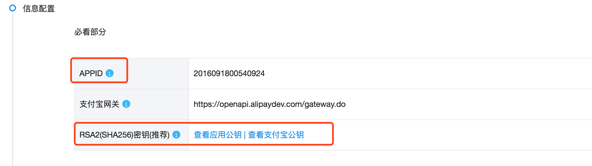
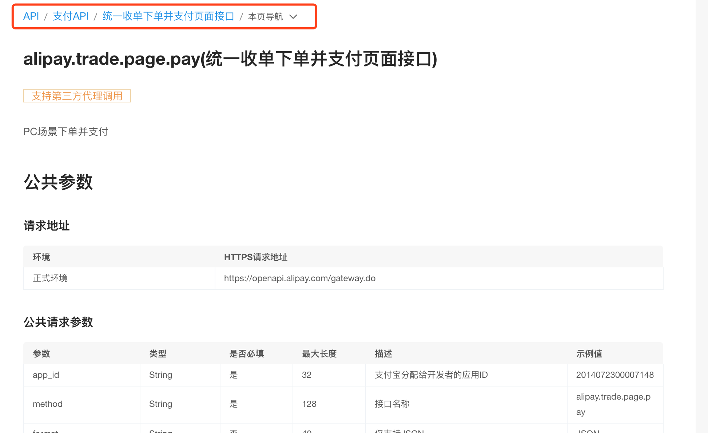
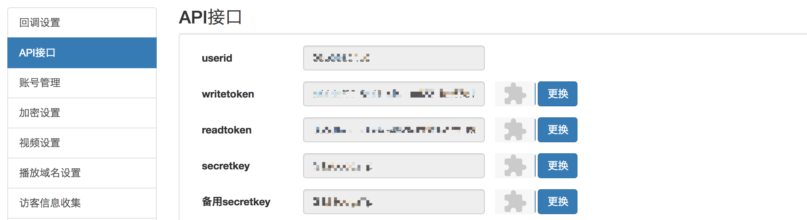

项目课件

课件地址

https://www.cnblogs.com/GGGG-XXXX/articles/9907408.html


我们之前学习过了Vue也学习过了DRF，现在开始我们要开始写前后端分离的项目了~~~

写前后端分离的项目之前，还有两个知识点给大家补充一下~~

-   [跨域](https://www.cnblogs.com/GGGG-XXXX/articles/9893381.html)
-   [ContentType组件](https://www.cnblogs.com/GGGG-XXXX/articles/9697458.html)
-   [课程模块](https://www.cnblogs.com/GGGG-XXXX/articles/9913643.html)
-   [登录认证模块](https://www.cnblogs.com/GGGG-XXXX/articles/9922552.html)
-   [Redis](https://www.cnblogs.com/GGGG-XXXX/articles/9289135.html)
-   [购物模块之购物车](https://www.cnblogs.com/GGGG-XXXX/articles/9932334.html)
-   [购物模块之结算中心](https://www.cnblogs.com/GGGG-XXXX/articles/10103162.html)
-   购物模块之支付中心
-   三方服务之微信模板消息推送
-   [三方服务之支付宝支付](https://www.cnblogs.com/GGGG-XXXX/articles/10123471.html)
-   [三方服务之保利威视频播放](https://www.cnblogs.com/GGGG-XXXX/articles/10131342.html)
-   三方服务之滑动验证码


# [跨域](https://www.cnblogs.com/GGGG-XXXX/articles/9893381.html)

## CORS跨域请求

CORS即Cross Origin Resource Sharing 跨域资源共享，

那么跨域请求还分为两种，一种叫简单请求，一种是复杂请求~~

### 简单请求

HTTP方法是下列方法之一

　　HEAD， GET，POST

HTTP头信息不超出以下几种字段

　　Accept， Accept-Language， Content-Language， Last-Event-ID

　　Content-Type只能是下列类型中的一个

　　　　application/x-www-from-urlencoded

　　　　multipart/form-data

　　　　text/plain

任何一个不满足上述要求的请求，即会被认为是复杂请求~~

复杂请求会先发出一个预请求，我们也叫预检，OPTIONS请求~~

### 浏览器的同源策略

跨域是因为浏览器的同源策略导致的，也就是说浏览器会阻止非同源的请求~

那什么是非同源呢即域名不同，端口不同,协议不同都属于非同源的~~~

浏览器只阻止表单以及ajax请求，并不会阻止src请求，所以我们的cnd，图片等src请求都可以发~~

### 解决跨域

#### JSONP

jsonp的实现原理是根据浏览器不阻止src请求入手~来实现的~~


JsonP实现的后端代码

```
class Test(APIView):

    def get(self, request):
        callback = request.query_params.get("callback", "")
        ret = callback + "(" + "'success'" + ")"
        return HttpResponse(ret)
```

[](javascript:void(0);)


JsonP测试前端代码

```
<button id="btn_one">点击我向JsonP1发送请求</button>
<script>
    // 测试发送请求失败 跨域不能得到数据
    $('#btn_one').click(function () {
        $.ajax({
            url: "http://127.0.0.1:8000/jsonp1",
            type: "get",
            success: function (response) {
                console.log(response)
            }
        })
    });
    
    function handlerResponse(response) {
        alert(response)
    };
    
    window.onload = function () {
        $("#btn_one").click(function () {
            let script_ele = document.createElement("script");
            script_ele.src = "http://127.0.0.1:8000/jsonp1?callback=handlerResponse";
            document.body.insertBefore(script_ele, document.body.firstChild);
        })
    }


</script>
```

[](javascript:void(0);)

JsonP解决跨域只能发送get请求，并且实现起来需要前后端交互比较多。

#### 添加响应头


中间件加响应头

```
from django.utils.deprecation import MiddlewareMixin


class MyCors(MiddlewareMixin):
    def process_response(self, request, response):
        response["Access-Control-Allow-Origin"] = "*"
        if request.method == "OPTIONS":
            response["Access-Control-Allow-Headers"] = "Content-Type"
            response["Access-Control-Allow-Methods"] = "DELETE, PUT, POST"
        return response
```


# [Django ContentType组件](https://www.cnblogs.com/GGGG-XXXX/articles/9697458.html)

### 需求

现在我们有这样一个需求~我们的商城里有很多的商品~~节日要来了~我们要搞活动~~

那么我们就要设计优惠券~~优惠券都有什么类型呢~~满减的~折扣的~立减的~~

我们对应着我们活动类型~对我们的某类商品设计优惠券~~比如~~

家电是一类商品~~食物是一类商品~那么我们可以设计家电折扣优惠券~~以及食物满减优惠券等~

那么我们看表结构怎么设计~~

```python
# by gaoxin
from django.db import models
 
 
class Appliance(models.Model):
    """
    家用电器表
    id name
    1   冰箱
    2   电视
    3   洗衣机
    """
    name = models.CharField(max_length=64)
 
 
class Food(models.Model):
    """
    食物表
    id name
    1  面包
    2  牛奶
    """
    name = models.CharField(max_length=32)
 
 
class Fruit(models.Model):
    """
    水果表
    id  name
    1   苹果
    2   香蕉
    """
    name = models.CharField(max_length=32)
 
 
class Coupon(models.Model):
    """
    优惠券表
    id  name    appliance_id    food_id     fruit_id
    1   通用优惠券   null            null        null
    2   冰箱折扣券   1               null        null
    3   电视折扣券   2               null        null
    4   苹果满减卷   null            null        1
    我每增加一张表就要多增加一个字段
    """
    name = models.CharField(max_length=32)
    appliance = models.ForeignKey(to="Appliance", null=True, blank=True)
    food = models.ForeignKey(to="Food", null=True, blank=True)
    fruit = models.ForeignKey(to="Fruit", null=True, blank=True)<br># 实际上我们商品的种类会特别的多，导致我们这张表外键越来越多
    
    
```

遇到这种一张表要跟多张表进行外键关联的时候~我们Django提供了ContentType组件~

### ContentType组件

ContentType是Django的内置的一个应用，可以追踪项目中所有的APP和model的对应关系，并记录在ContentType表中。

当我们的项目做数据迁移后，会有很多django自带的表，其中就有django_content_type表，我们可以去看下~~~

 

ContentType组件应用：

　　-- 在model中定义ForeignKey字段，并关联到ContentType表，通常这个字段命名为content-type

　　-- 在model中定义PositiveIntergerField字段, 用来存储关联表中的主键，通常我们用object_id

　　-- 在model中定义GenericForeignKey字段，传入上面两个字段的名字

　　-- 方便反向查询可以定义GenericRelation字段

代码如下：

　　

```python
# by gaoxin
from django.db import models
from django.contrib.contenttypes.models import ContentType
from django.contrib.contenttypes.fields import GenericForeignKey, GenericRelation
 
 
class Appliance(models.Model):
    """
    家用电器表
    id name
    1   冰箱
    2   电视
    3   洗衣机
    """
    name = models.CharField(max_length=64)
    coupons = GenericRelation(to="Coupon")
 
 
class Food(models.Model):
    """
    食物表
    id name
    1  面包
    2  牛奶
    """
    name = models.CharField(max_length=32)
 
 
class Fruit(models.Model):
    """
    水果表
    id  name
    1   苹果
    2   香蕉
    """
    name = models.CharField(max_length=32)
 
 
class Coupon(models.Model):
    """
    优惠券表
    id  name    appliance_id    food_id     fruit_id
    1   通用优惠券   null            null        null
    2   冰箱折扣券   1               null        null
    3   电视折扣券   2               null        null
    4   苹果满减卷   null            null        1
    我每增加一张表就要多增加一个字段
    """
    name = models.CharField(max_length=32)
    # appliance = models.ForeignKey(to="Appliance", null=True, blank=True)
    # food = models.ForeignKey(to="Food", null=True, blank=True)
    # fruit = models.ForeignKey(to="Fruit", null=True, blank=True)
    # 第一步
    content_type = models.ForeignKey(to=ContentType)
    # 第二步
    object_id = models.PositiveIntegerField()
    # 第三步
    content_object = GenericForeignKey('content_type', 'object_id')　　
```

数据迁移后~添加数据~我们看下增删改查的操作~~

基本的使用~

```python
from django.http import HttpResponse
from rest_framework.views import APIView
from rest_framework.response import Response
from django.contrib.contenttypes.models import ContentType
from .models import Appliance, Coupon
 
# Create your views here.
 
 
class Test(APIView):
 
    def get(self, request):
        # 通过ContentType获得表名
        content = ContentType.objects.filter(app_label="app01", model="appliance").first()
        # 获得表model对象 相当于models.Applicance
        model_class = content.model_class()
        ret = model_class.objects.all()
 
        # 为海尔冰箱创建一条优惠记录
        ice_box = Appliance.objects.filter(id=1).first()
        Coupon.objects.create(name="海尔冰箱折扣券", content_object=ice_box)
 
        # 查询优惠券id=1绑定了哪个商品
        coupon_obj = Coupon.objects.filter(id=1).first()
        goods_obj = coupon_obj.content_object
        print(goods_obj.name)
 
        # 查询海尔冰箱的所有优惠券 id=1
        # 我们定义了反向查询
        results = ice_box.coupons.all()
        print(results[0].name)
 
        # 如果没定义反向查询
        content = ContentType.objects.filter(app_label="app01", model="appliance").first()
        result = Coupon.objects.filter(content_type=content, object_id=1).all()
        print(result[0].name)
        return HttpResponse(ret)

```

　　


# [项目课程模块](https://www.cnblogs.com/GGGG-XXXX/articles/9913643.html)

## 课程模块

我们要开始写课程模块了~~课程模块都有哪些功能呢~~

我们的课程模块，包括了免费课程以及专题课程两个方向~~

主要是课程的展示，点击课程进入课程详细页面~~

课程详细页面展示，课程的概述，课程的价格策略，课程章节，评价以及常见问题~~

以及一些周边的字段~~~这是主线路~~

### 根据功能设计表结构

对照着对标路飞网站，我们可以先讨论下表结构~~

我们初步能够确定下来12张表~~


课程模块表结构

```python
from django.db import models
from django.contrib.contenttypes.fields import GenericForeignKey, GenericRelation
from django.contrib.contenttypes.models import ContentType

# Create your models here.
__all__ = ["Category", "Course", "CourseDetail", "Teacher", "DegreeCourse", "CourseChapter",
           "CourseSection", "PricePolicy", "OftenAskedQuestion", "Comment", "Account", "CourseOutline"]


class Category(models.Model):
    """课程分类表"""
    title = models.CharField(max_length=32, unique=True, verbose_name="课程的分类")

    def __str__(self):
        return self.title

    class Meta:
        verbose_name = "01-课程分类表"
        db_table = verbose_name
        verbose_name_plural = verbose_name


class Course(models.Model):
    """课程表"""
    title = models.CharField(max_length=128, unique=True, verbose_name="课程的名称")
    course_img = models.ImageField(upload_to="course/%Y-%m", verbose_name='课程的图片')
    category = models.ForeignKey(to="Category", verbose_name="课程的分类")
    COURSE_TYPE_CHOICES = ((0, "付费"), (1, "vip专享"), (2, "学位课程"))
    course_type = models.SmallIntegerField(choices=COURSE_TYPE_CHOICES)
    degree_course = models.ForeignKey(to="DegreeCourse", blank=True, null=True, help_text="如果是学位课程，必须关联学位表")

    brief = models.CharField(verbose_name="课程简介", max_length=1024)
    level_choices = ((0, '初级'), (1, '中级'), (2, '高级'))
    level = models.SmallIntegerField(choices=level_choices, default=1)
    status_choices = ((0, '上线'), (1, '下线'), (2, '预上线'))
    status = models.SmallIntegerField(choices=status_choices, default=0)
    pub_date = models.DateField(verbose_name="发布日期", blank=True, null=True)
    order = models.IntegerField("课程顺序", help_text="从上一个课程数字往后排")
    study_num = models.IntegerField(verbose_name="学习人数", help_text="只要有人买课程，订单表加入数据的同时给这个字段+1")

    # order_details = GenericRelation("OrderDetail", related_query_name="course")
    # coupon = GenericRelation("Coupon")
    # 只用于反向查询不生成字段
    price_policy = GenericRelation("PricePolicy")
    often_ask_questions = GenericRelation("OftenAskedQuestion")
    course_comments = GenericRelation("Comment")

    def save(self, *args, **kwargs):
        if self.course_type == 2:
            if not self.degree_course:
                raise ValueError("学位课必须关联学位课程表")
        super(Course, self).save(*args, **kwargs)

    def __str__(self):
        return self.title

    class Meta:
        verbose_name = "02-课程表"
        db_table = verbose_name
        verbose_name_plural = verbose_name


class CourseDetail(models.Model):
    """课程详细表"""
    course = models.OneToOneField(to="Course")
    hours = models.IntegerField(verbose_name="课时", default=7)
    course_slogan = models.CharField(max_length=125, blank=True, null=True, verbose_name="课程口号")
    video_brief_link = models.CharField(max_length=255, blank=True, null=True)
    summary = models.TextField(max_length=2048, verbose_name="课程概述")
    why_study = models.TextField(verbose_name="为什么学习这门课程")
    what_to_study_brief = models.TextField(verbose_name="我将学到哪些内容")
    career_improvement = models.TextField(verbose_name="此项目如何有助于我的职业生涯")
    prerequisite = models.TextField(verbose_name="课程先修要求", max_length=1024)
    recommend_courses = models.ManyToManyField("Course", related_name="recommend_by", blank=True)
    teachers = models.ManyToManyField("Teacher", verbose_name="课程讲师")

    def __str__(self):
        return self.course.title

    class Meta:
        verbose_name = "03-课程详细表"
        db_table = verbose_name
        verbose_name_plural = verbose_name


class Teacher(models.Model):
    """讲师表"""
    name = models.CharField(max_length=32, verbose_name="讲师名字")
    brief = models.TextField(max_length=1024, verbose_name="讲师介绍")

    def __str__(self):
        return self.name

    class Meta:
        verbose_name = "04-教师表"
        db_table = verbose_name
        verbose_name_plural = verbose_name


class DegreeCourse(models.Model):
    """
    字段大体跟课程表相同，哪些不同根据业务逻辑去区分
    """
    title = models.CharField(max_length=32, verbose_name="学位课程名字")

    def __str__(self):
        return self.title

    class Meta:
        verbose_name = "05-学位课程表"
        db_table = verbose_name
        verbose_name_plural = verbose_name


class CourseChapter(models.Model):
    """课程章节表"""
    course = models.ForeignKey(to="Course", related_name="course_chapters")
    chapter = models.SmallIntegerField(default=1, verbose_name="第几章")
    title = models.CharField(max_length=32, verbose_name="课程章节名称")

    def __str__(self):
        return self.title

    class Meta:
        verbose_name = "06-课程章节表"
        db_table = verbose_name
        verbose_name_plural = verbose_name
        unique_together = ("course", "chapter")


class CourseSection(models.Model):
    """课时表"""
    chapter = models.ForeignKey(to="CourseChapter", related_name="course_sections")
    title = models.CharField(max_length=32, verbose_name="课时")
    section_order = models.SmallIntegerField(verbose_name="课时排序", help_text="建议每个课时之间空1至2个值，以备后续插入课时")
    section_type_choices = ((0, '文档'), (1, '练习'), (2, '视频'))
    free_trail = models.BooleanField("是否可试看", default=False)
    section_type = models.SmallIntegerField(default=2, choices=section_type_choices)
    section_link = models.CharField(max_length=255, blank=True, null=True, help_text="若是video，填vid,若是文档，填link")

    def course_chapter(self):
        return self.chapter.chapter

    def course_name(self):
        return self.chapter.course.title

    def __str__(self):
        return "%s-%s" % (self.chapter, self.title)

    class Meta:
        verbose_name = "07-课程课时表"
        db_table = verbose_name
        verbose_name_plural = verbose_name
        unique_together = ('chapter', 'section_link')


class PricePolicy(models.Model):
    """价格策略表"""
    content_type = models.ForeignKey(ContentType)  # 关联course or degree_course
    object_id = models.PositiveIntegerField()
    content_object = GenericForeignKey('content_type', 'object_id')

    valid_period_choices = ((1, '1天'), (3, '3天'),
                            (7, '1周'), (14, '2周'),
                            (30, '1个月'),
                            (60, '2个月'),
                            (90, '3个月'),
                            (120, '4个月'),
                            (180, '6个月'), (210, '12个月'),
                            (540, '18个月'), (720, '24个月'),
                            (722, '24个月'), (723, '24个月'),
                            )
    valid_period = models.SmallIntegerField(choices=valid_period_choices)
    price = models.FloatField()

    def __str__(self):
        return "%s(%s)%s" % (self.content_object, self.get_valid_period_display(), self.price)

    class Meta:
        verbose_name = "08-价格策略表"
        db_table = verbose_name
        verbose_name_plural = verbose_name
        unique_together = ("content_type", 'object_id', "valid_period")


class OftenAskedQuestion(models.Model):
    """常见问题"""
    content_type = models.ForeignKey(ContentType)  # 关联course or degree_course
    object_id = models.PositiveIntegerField()
    content_object = GenericForeignKey('content_type', 'object_id')

    question = models.CharField(max_length=255)
    answer = models.TextField(max_length=1024)

    def __str__(self):
        return "%s-%s" % (self.content_object, self.question)

    class Meta:
        verbose_name = "09-常见问题表"
        db_table = verbose_name
        verbose_name_plural = verbose_name
        unique_together = ('content_type', 'object_id', 'question')


class Comment(models.Model):
    """通用的评论表"""
    content_type = models.ForeignKey(ContentType, blank=True, null=True)
    object_id = models.PositiveIntegerField(blank=True, null=True)
    content_object = GenericForeignKey('content_type', 'object_id')

    content = models.TextField(max_length=1024, verbose_name="评论内容")
    account = models.ForeignKey("Account", verbose_name="会员名")
    date = models.DateTimeField(auto_now_add=True)

    def __str__(self):
        return self.content

    class Meta:
        verbose_name = "10-评价表"
        db_table = verbose_name
        verbose_name_plural = verbose_name


class Account(models.Model):
    username = models.CharField(max_length=32, verbose_name="用户姓名")
    # head_img = models.CharField(max_length=256, default='/static/frontend/head_portrait/logo@2x.png',
    #                             verbose_name="个人头像")

    def __str__(self):
        return self.username

    class Meta:
        verbose_name = "11-用户表"
        db_table = verbose_name
        verbose_name_plural = verbose_name


class CourseOutline(models.Model):
    """课程大纲"""
    course_detail = models.ForeignKey(to="CourseDetail", related_name="course_outline")
    title = models.CharField(max_length=128)
    order = models.PositiveSmallIntegerField(default=1)
    # 前端显示顺序

    content = models.TextField("内容", max_length=2048)

    def __str__(self):
        return "%s" % self.title

    class Meta:
        verbose_name = "12-课程大纲表"
        db_table = verbose_name
        verbose_name_plural = verbose_name
        unique_together = ('course_detail', 'title')
```


### 接口的编写

我们表结构定下来以后，可以根据业务场景看需要哪些接口~~~

对于我们课程这个模块，所有的功能都是展示，基于数据展示的，我们通常称为数据接口~~

这种接口对于我们来说是最简单的~~因为我们只是从数据库拿数据~然后进行展示~~

我们来看下都需要哪些接口~~~

　　-- 课程页面 有课程所有分类这个接口

　　-- 课程页面 有展示课程的接口

　　-- 点击课程进入课程详情页面，详情页面的数据接口~~

　　-- 详情页面下的子路由对应子组件的数据接口

　　　　-- 课程章节课时

　　　　-- 课程的评论

　　　　-- 课程的常见问题

这些所有的数据接口~~套路都是读取数据库，序列化数据，返回~~~

那主要就是用DRF的序列化组件~~那我们从路由~然后序列化组件~然后看视图~~


urls.py

```python
# by gaoxin
from django.conf.urls import url, include
from .views import CourseListView, CourseCategoryView, CourseDetailView, CourseChapterView
from .views import CourseCommentView, OftenAskedQuestionView

# 在项目路由下做了一层分发
# url(r'^api/course/', include("course.urls")),
urlpatterns = [
    url(r"^$", CourseListView.as_view()),
    url(r"^category$", CourseCategoryView.as_view()),
    url(r"^detail/(?P<pk>\d+)$", CourseDetailView.as_view()),
    url(r"^(?P<pk>\d+)/chapters$", CourseChapterView.as_view()),
    url(r"^(?P<pk>\d+)/comment$", CourseCommentView.as_view()),
    url(r"^(?P<pk>\d+)/often-asked-question$", OftenAskedQuestionView.as_view()),
]
```


serializers.py

```
# by gaoxin
from rest_framework import serializers
from .models import Course, Category, CourseDetail, CourseChapter, Comment, OftenAskedQuestion


class CourseSerializer(serializers.ModelSerializer):
    level = serializers.CharField(source="get_level_display")
    price_policy = serializers.SerializerMethodField()

    def get_price_policy(self, obj):
        price_obj = obj.price_policy.all().order_by("price").first()
        return price_obj.price

    class Meta:
        model = Course
        fields = ["id", "title", "brief", "course_img", "study_num", "level", "price_policy"]


class CourseCategorySerializer(serializers.ModelSerializer):
    class Meta:
        model = Category
        fields = ["id", "title"]


class CourseDetailSerializer(serializers.ModelSerializer):
    level = serializers.CharField(source="course.get_level_display")
    study_num = serializers.IntegerField(source="course.study_num")
    price_policy = serializers.SerializerMethodField()
    course_outline = serializers.SerializerMethodField()
    recommend_courses = serializers.SerializerMethodField()
    teachers = serializers.SerializerMethodField()

    def get_teachers(self, obj):
        return [{"id":item.id, "name": item.name} for item in obj.teachers.all()]

    def get_recommend_courses(self, obj):
        return [{"id": item.id, "title": item.title} for item in obj.recommend_courses.all()]

    def get_course_outline(self, obj):
        outlines = obj.course_outline.all().order_by("order")
        return [{"title":outline.title, "content": outline.content} for outline in outlines]

    def get_price_policy(self, obj):
        return [{"id": price_obj.id, "valid_price_display": price_obj.get_valid_period_display(), "price": price_obj.price} for price_obj in obj.course.price_policy.all()]

    class Meta:
        model = CourseDetail
        fields = ["id", "summary", "hours", "level", "study_num", "price_policy", "why_study",
                  "what_to_study_brief", "course_outline", "career_improvement", "prerequisite",
                  "recommend_courses", "teachers"]


class CourseChapterSerializer(serializers.ModelSerializer):
    sections = serializers.SerializerMethodField()

    def get_sections(self, obj):
        sections = obj.course_sections.all().order_by("section_order")
        return [{"id": section.id, "title": section.title, "free_trail": section.free_trail} for section in sections]

    class Meta:
        model = CourseChapter
        fields = ["id", "title", "sections"]


class CourseCommentSerializer(serializers.ModelSerializer):
    account = serializers.CharField(source="account.username")

    class Meta:
        model = Comment
        fields = ["id", "account", "content", "date"]


class OftenAskQuestionSerializer(serializers.ModelSerializer):

    class Meta:
        model = OftenAskedQuestion
        fields = ["id", "question", "answer"]
```


Views.py

```
class CourseCategoryView(APIView):
    """课程分类接口"""

    def get(self, request):
        queryset = Category.objects.all()
        ser_obj = CourseCategorySerializer(queryset, many=True)
        return Response(ser_obj.data)


class CourseListView(APIView):
    """查看所有免费课程的接口"""
    def get(self, request):
        category_id = request.query_params.get("category", 0)
        if category_id == 0:
            # 证明没有分类，可以拿所有的课程数据
            queryset = Course.objects.all().order_by("order")
        else:
            queryset = Course.objects.filter(category_id=category_id).order_by("order")
        ser_obj = CourseSerializer(queryset, many=True)
        return Response(ser_obj.data)


class CourseDetailView(APIView):
    """课程详情页面"""
    def get(self, request, pk):
        course_detail_obj = CourseDetail.objects.filter(course__id=pk).first()
        if course_detail_obj:
            ser_obj = CourseDetailSerializer(course_detail_obj)
            return Response(ser_obj.data)
        else:
            return Response({"code": "1001", "msg": "查询的课程不存在"})


class CourseChapterView(APIView):
    """课程章节接口"""
    def get(self, request, pk):
        # 首先我们要清楚数据结构
        # 我们要的是[章节一：{课时，课时2}]
        queryset = CourseChapter.objects.filter(course_id=pk).order_by("chapter")
        ser_obj = CourseChapterSerializer(queryset, many=True)
        return Response(ser_obj.data)


class CourseCommentView(APIView):
    def get(self, request, pk):
        queryset = Course.objects.filter(pk=pk).first().course_comments.all()
        ser_obj = CourseCommentSerializer(queryset, many=True)
        return Response(ser_obj.data)


class OftenAskedQuestionView(APIView):
    def get(self, request, pk):
        queryset = Course.objects.filter(pk=pk).first().often_ask_questions.all()
        ser_obj = OftenAskQuestionSerializer(queryset, many=True)
        return Response(ser_obj.data)
```


我们的课程的视图还可以重写编写一下~~利用我们之前学的视图的封装的那些类~~


升级版视图的示例

```
class CourseCategoryView(generics.ListAPIView):
    queryset = Category.objects.all()
    serializer_class = CourseCategorySerializer
    """课程分类接口"""

    # def get(self, request):
    #     queryset = Category.objects.all()
    #     ser_obj = CourseCategorySerializer(queryset, many=True)
    #     return Response(ser_obj.data)


class CourseChapterView(generics.RetrieveAPIView):
    queryset = CourseChapter.objects.all()
    serializer_class = CourseChapterSerializer
    # 指定过滤的类 用排序的过滤类
    filter_backends = (filters.OrderingFilter,)
    # 排序的字段
    ordering = ("chapter",)

    # def get(self, request, pk):
    #     # 首先我们要清楚数据结构
    #     # 我们要的是[章节一：{课时，课时2}]
    #     queryset = CourseChapter.objects.filter(course_id=pk).order_by("chapter")
    #     ser_obj = CourseChapterSerializer(queryset, many=True)
    #     return Response(ser_obj.data)
```


我们可以根据上面的更改的视图的示例~~来更改我们所有的视图~~小伙伴们~自己动起手来吧~~

我们课程这个模块下的数据接口我们就介绍这些~~

我们这里涉及课程图片~~用我们Django的mediaURL~~

### Django的MEDIA配置


```
# settings.py

STATIC_URL = '/static/'
# Media配置
MEDIA_URL = "media/"
MEDIA_ROOT = os.path.join(BASE_DIR, "media")
```


```
# urls.py

from django.conf.urls import url, include
from django.contrib import admin
from django.views.static import serve
from new_luffy import settings


urlpatterns = [
    url(r'^admin/', admin.site.urls),
    url(r'^api/course/', include("course.urls")),

    # media路径配置
    url(r'media/(?P<path>.*)$', serve, {'document_root': settings.MEDIA_ROOT})
]
```


这样我们上传的图片~数据库存的是路径地址我们前端向后端的media路径发送请求~~

拿到我们想要的图片，视频等资源~~


# [登录认证模块](https://www.cnblogs.com/GGGG-XXXX/articles/9922552.html)

### 认证

任何的项目都需要认证，用户输入了用户名和密码，验证通过，代表用户登录成功~~~

那HTTP请求是无状态的，下次这个用户再请求，我们是不可能识别这个用户是否登录的~~

所以我们就要有自己的方式来实现这个认证，也就是说~用户登录成功以后~~~我们给他们

生成一个随机字符串~~以后这个用户再请求~~都要携带这个随机字符串~~

我们就可以根据这个字符串进行判断这个用户是否登录~~~~

那么大家想一个问题~~就是我们给登录的用户生成的随机字符串放在哪里呢~~~

我们放哪里都可以~~目的是前端发送请求的时候带过来就可以了~~~

以前的cookie，session是我们的一种解决方案~~我们讲认证的时候也用过token的这种解决方案~~

### TOKEN

用户登录成功后，生成一个随机字符串token给前端返回~~~

那么前端以后都携带这个token来访问~~这样我们只需要鉴别这个token~来做认证~~

前端如果发送请求~把token放在请求头中~~我们看下我们的认证要怎么写~~

在写认证之前，我们先把登录注册功能写了~~~

 models.py 扩展之前功能模块的用户表

```
# 我们要拓展之前课程模块下的用户表
class Account(models.Model):
    username = models.CharField(max_length=32, verbose_name="用户姓名", unique=True)
    password = models.CharField(max_length=32, verbose_name="用户密码")
    # head_img = models.CharField(max_length=256, default='/static/frontend/head_portrait/logo@2x.png',
    #                             verbose_name="个人头像")
    token = models.UUIDField(null=True, blank=True)

    def __str__(self):
        return self.username

    class Meta:
        verbose_name = "11-用户表"
        db_table = verbose_name
        verbose_name_plural = verbose_name


```


 views.py 编写登录注册视图

```python
# 创建两个视图 一个注册的 一个登录的
from django.shortcuts import render
from rest_framework.views import APIView
from rest_framework.response import Response
from utils.base_response import BaseResponse
from .serializers import UserSerializer
from course.models import Account
import uuid
# Create your views here.


class UserView(APIView):

    # 注册用户
    def post(self, request):
        res = BaseResponse()
        ser_obj = UserSerializer(data=request.data)
        if ser_obj.is_valid():
            ser_obj.save()
            res.data = ser_obj.validated_data
        else:
            res.code = 1010
            res.data = ser_obj.errors
        return Response(res.dict)


class LoginView(APIView):

    # 登录视图
    def post(self, request):
        res = BaseResponse()
        # 这里要获取我们的用户名密码 进行验证是否有这个用户
        # 而且我们这个密码前端一定是密文传过来 我们通过密文对比进行验证
        username = request.data.get("username", "")
        password = request.data.get("password", "")
        user_obj_queryset = Account.objects.filter(username=username, password=password)
        if not user_obj_queryset:
            res.code = 1003
            res.error = "用户名或密码错误"
        try:
            token = uuid.uuid4()
            user_obj_queryset.update(token=token)
            res.data = token
        except Exception as e:
            res.code = 1004
            res.error = "生成token失败"
        return Response(res.dict)


```


 utils.base_response.py

```
# 给前端返回时候用的基础的Response类
class BaseResponse(object):

    def __init__(self):
        self.code = 1000
        self.error = None
        self.data = None

    @property
    def dict(self):
        return self.__dict__


```


 serializers.py 注册序列化器

```
# by gaoxin
from rest_framework import serializers
from course.models import Account
import hashlib

# 我们测试的时候用的重写create方法
# 真正开发前端传过来的就是加密后的密文密码
class UserSerializer(serializers.ModelSerializer):
    class Meta:
        model = Account
        fields = "__all__"

    def create(self, validated_data):
        password = validated_data["password"]
        password_salt = password + "luffy_password"
        md5_str = hashlib.md5(password_salt.encode()).hexdigest()
        user_obj = Account.objects.create(username=validated_data["username"], password=md5_str)
        return user_obj


```


我们的登录注册写完后~~开始写认证~~

 utils.auth.py

```python
# by gaoxin
from rest_framework.authentication import BaseAuthentication
from rest_framework.exceptions import AuthenticationFailed
from course.models import Account
# django 提供的拿时间的接口 提供的是根据django配置的时区拿到的当前时间
from django.utils.timezone import now


class MyAuth(BaseAuthentication):
    def authenticate(self, request):
        if request.method == "OPTIONS":
            return None
        # print(request.META)
        token = request.META.get("HTTP_AUTHENTICATION", "")
        print(token)
        if not token:
            raise AuthenticationFailed({"code": 1021, "error": "缺少token"})
        user_obj = Account.objects.filter(token=token).first()
        if not user_obj:
            raise AuthenticationFailed({"code": 1020, "error": "无效的token"})
        else:
            old_time = user_obj.create_token_time
            if (now() - old_time).days > 7:
                raise AuthenticationFailed({"code": 1020, "error": "无效的token"})
            return user_obj, token


```


 views.py 测试用的视图

```
# 查看购物车是需要登录后才可以
# 所有这是一个需要认证的接口
class ShoppingCarView(APIView):
    authentication_classes = [MyAuth, ]
    # 展示购物车数据
    def get(self, request, *args, **kwargs):
        print(request.user)
        return Response("test")


```

我们基于请求头的token认证就完成了~~~ 


# [Redis 以及 Python操作Redis](https://www.cnblogs.com/GGGG-XXXX/articles/9289135.html)

## Redis

　　Redis是完全开源免费的，遵守BSD协议，是一个高性能的key-value数据库。

　　Redis有以下特点：

　　　　-- Redis支持数据的持久化，可以将内存中的数据保存在磁盘中，重启的时候可以再次加载进行使用。

　　　　-- Redis支持五种数据类型。

　　　　-- Redis支持数据库备份。

　　Redis的优势：

　　　　-- Redis性能极高，读的速度是110000次/s，写的速度是81000次/s。

　　　　-- Redis丰富的数据类型，String,Lists,Hashes,Sets以及Ordered Sets。

　　　　-- Redis的所有操作都是原子性的，意思就是要么成功执行，要么完全失败不执行，多个操作支持事物。即MULTI和EXEC指令包起来。

　　　　-- Redis有丰富的特性，支持publish/subscribe，通知，key过期等等特性。

　　Redis 配置

　　　　-- 可以通过redis-cli 进入交互模式，使用config命令查看或设置配置项。也可以进入配置文件用vim编辑器进行修改。


```
# 获取所有配置项
reids 127.0.0.1:6379> config get *
# 获取单个配置项
redis 127.0.0.1:6379> config get loglevel
# 编辑配置
redis 127.0.0.1:6379> config set loglevel "notice"
```


　　Redis 数据类型

　　   -- String 字符串 

　　　　　　-- redis的string可以包含任何数据，包括图片以及序列化的对象，一个键最大能存储512MB。

　　   -- Hash 哈希

　　   -- redis的hash是一个String类型的key和value的映射表，hash特别适合存储对象，类比python字典。

　　  -- List 列表

　　    -- redis的list是简单的字符串列表，按照插入顺序排序，可以从两端进行添加，类似于双向链表，列表还可以进行阻塞。

　　  -- Set 集合

　　 -- redis的set是字符串类型的无序且不重复集合。集合是通过哈希表实现的，所以添加，删除，查找的时间复杂度都是O(1)。

　　 -- Zset 有序集合

　　 -- redis的zset和set一样，不同的是每个元素都会关联一个double类型的分数，redis正是通过对分数的排序对集合进行有序存储。

### Python 操作Redis

　　-- 下载 pip install redis

　　-- 连接

　　　　Redis提供两个类Redis和StrictRedis用于实现Redis的命令，StrictRedis用于实现大部分官方的命令，并使用官方的语法和命令，

　　　　Redis是StrictRedis的子类，用于向后兼容旧版本的redis-py。

　　　　Redis连接实例是线程安全的，可以直接将redis连接实例设置为一个全局变量，直接使用。

　　　　如果需要另一个Redis实例（or Redis数据库）时，就需要重新创建redis连接实例来获取一个新的连接

　　　　连接redis，加上decode_responses=True，写入的键值对中的value为str类型，不加这个参数写入的则为字节类型。

```
import redis

res = redis.Redis(host="localhost", port=6379, password="", decode_responses=True)
res.set("gaoxin", 18)
print(type(res.get("gaoxin"))) # <class 'str'>

```

#### Python Redis 连接池

　　使用connection pool来管理对一个redis server的所有连接，避免每次建立、释放连接的开销。

　　默认，每个Redis实例都会维护一个自己的连接池。可以直接建立一个连接池，

　　然后作为参数传给Redis实例，这样就可以实现多个Redis实例共享一个连接池。

```
pool = redis.ConnectionPool(host="localhost", port=6379, password="", decode_responses=True)
res = redis.Redis(connection_pool=pool)
res.set("haha", 18)
print(res.get("haha"))
```

### Redis的基本命令

#### Redis的命令 String


```
set(name, value, ex=None, px=None, nx=False, xx=False)

　　在Redis中设置值，默认，不存在则创建，存在则修改
　　　　参数：
　　　　ex，过期时间（秒）过期后值None
　　　　px，过期时间（毫秒）
　　　　nx，如果设置为True，则只有name不存在时，当前set操作才执行
　　　　xx，如果设置为True，则只有name存在时，当前set操作才执行

　　　　注：ex,px,nx,xx可以跟在命令后面 eg: setnx 表示只能创建 hash命令一样适用

　　get(key)  获取key的值

　　mset(*args, **kwargs)  批量设置值

　　mget(key, *args)

　　.....请走入官方文档.....

Redis命令之String
```


#### Redis的命令 hash


```
hset(name, key, value)  增加单个 不存在则创建

　　hget(name, key)  获取单个

　　hmset(name, mapping)  批量增加 mapping为字典

　　hgetall(name) 获取name对应hash的所有键值

　　hlen(name)  获取name对应的hash中键值对的个数

　　hkeys(name)  获取name对应的hash中所有的key的值

　　hvals(name)  获取name对应的hash中所有的value的值

　　hexists(name, key)  检查name对应的hash是否存在当前传入的key

　　hdel(name,*keys)   将name对应的hash中指定key的键值对删除

　　hscan_iter(name, match=None, count=None)
　　　　利用yield封装hscan创建生成器，实现分批去redis中获取数据
　　　　参数：
　　　　match，匹配指定key，默认None 表示所有的key
　　　　count，每次分片最少获取个数，默认None表示采用Redis的默认分片个数

Redis命令之Hash
```


#### Redis的命令 list


```
lpush(name,values)  在name对应的list中左边添加元素 没有就新建

　　llen(name) 获取name对应的列表长度

　　lrang(name, index1, index2)　按照index切片取出name对应列表里值

　　lpushx(name, value)  只能添加不能新建

　　linsert(name, where, refvalue, value))  

　　　　在name对应的列表的某一个值前或后插入一个新值
　　　　参数：
　　　　name，redis的name
　　　　where，BEFORE或AFTER
　　　　refvalue，标杆值，即：在它前后插入数据
　　　　value，要插入的数据 

　　lset(name, index, value)  给指定索引修改值

　　lrem(name, value, num)

　　　　在name对应的list中删除指定的值
　　　　参数：
　　　　name，redis的name
　　　　value，要删除的值
　　　　num， num=0，删除列表中所有的指定值；
　　　　num=2,从前到后，删除2个； num=1,从前到后，删除左边第1个
　　　　num=-2,从后向前，删除2个

　　lindex(name, index)  在name对应的列表中根据索引获取列表元素

Redis命令之List
```


　

剩下的集合以及有序集合的命令 请移步官方文档~~~~

### redis的发布订阅者模式

redis的发布和订阅者模式就像是广播发消息是一样的，我们来测试下发布以及订阅者模式~


```
# by gaoxin
import redis

r = redis.Redis(host="127.0.0.1", password="", decode_responses=True)

# 第一步 生成一个订阅者对象
pubsub = r.pubsub()
# 第二步 订阅一个消息 实际上就是监听这个键
pubsub.subscribe("gaoxin")

# 第三步 死循环一直等待监听结果
while True:
    print("working~~~")
    msg = pubsub.parse_response()
    print(msg)

redis订阅者
```


```
# by gaoxin
import redis

r = redis.Redis(host="127.0.0.1", password="", decode_responses=True)

r.publish("gaoxin", "hahaha")

redis发布者
```


### Django Redis

　　pip install django-redis

　　参考django-redis 的文档 以及源码里看封装的一些方法


# [购物车模块](https://www.cnblogs.com/GGGG-XXXX/articles/9932334.html)

### 购物车中心

用户点击价格策略加入购物车，个人中心可以查看自己所有购物车中数据~~

在购物车中可以删除课程，还可以更新购物车中课程的价格策略~~~

所以接口应该有四种请求方式， get，post，patch，delete~~

我们在做这个功能之前，首先要讨论我们购物车中数据存在哪~~~为什么要这么存~~

因为购物车是属于中间状态数据~~而且很多时候需要过期时间~~所以我们选择redis~~

读取速度快~并且redis可以做持久化~~支持的数据类型也比较多~~

然后我们需要讨论~我们存redis~~存什么样的数据结构~对于我们实现需求来说更加方便~

下面看代码中存入redis中的数据结构是什# by gaoxin

```python
from rest_framework.views import APIView
from rest_framework.response import Response
from utils.authentication import MyAuth
from utils.redis_pool import pool
from utils.base_response import BaseResponse
from course.models import Course
import redis
import json


"""
购物车
redis 的数据结构设计
redis = {
    shopping_car_<user_id>_<course_id>: {
        "id": course.id, 带用户id是为了用户查看购物车的时候需要
        "title": course.name,
        "img": str(course.course_img),
        "policy_dict": {
            policy_id:{
                "period": item.valid_period, 价格策略
                "period_display": item.get_valid_period_display(), 价格策略中文
                "price":  item.price, 价格
            },
            policy_id2:{
                ....
            }
        },
        "default_policy": policy_id ,选择的价格策略id
    }
        
        
}
"""
REDIS_CONN = redis.Redis(connection_pool=pool)
SHOPPING_CAR_KEY = "shopping_car_%s_%s"


class ShoppingCarView(APIView):
    """
    购物车接口
    1010 代表成功
    1011 课程不存在
    1012 价格策略不存在
    1013 获取购物车失败
    1014 删除的购物车数据不存在
    """
    authentication_classes = [MyAuth, ]

    # 展示购物车数据
    def get(self, request, *args, **kwargs):
        res = BaseResponse()
        # 1 从redis获取购物车数据
        try:
            user_id = request.user.pk
            shopping_car_key = SHOPPING_CAR_KEY % (user_id, "*")
            # 用scan_iter方法获取用户购物车的所有key
            all_keys = REDIS_CONN.scan_iter(shopping_car_key)
            ret = []
            # 循环得到所有想要的数据
            for key in all_keys:print(REDIS_CONN.hgetall(key))
                ret.append(REDIS_CONN.hgetall(key))
            res.data = ret
        except Exception as e:
            res.code = 1013
            res.error = "获取购物车失败"
        return Response(res.dict)

    # 给购物车增加商品
    # 传过来的数据 有 课程ID 以及价格策略ID
    def post(self, request, *args, **kwargs):
        res = BaseResponse()
        try:
            # 1 获取用户提交的课程ID以及价格策略ID
            course_id = request.data.get("course_id", "")
            price_policy_id = request.data.get("price_policy_id", "")
            user_id = request.user.pk
            # 2 检查用户传过来的数据是否合法
            # 2.1  查看课程ID是否存在
            course_obj = Course.objects.filter(pk=course_id).first()
            if not course_obj:
                res.code = 1011
                res.error = "课程对象不存在"
            # 2.2  查看价格策略是否合法
            #  获取该课程的所有价格策略
            price_policy_queryset = course_obj.price_policy.all()
            price_policy_dict = {}
            for price_policy in price_policy_queryset:
                price_policy_dict[price_policy.pk] = {
                    "price": price_policy.price,
                    "valid_period": price_policy.valid_period,
                    "valid_period_text": price_policy.get_valid_period_display(),
                }
            if price_policy_id not in price_policy_dict:
                res.code = 1012
                res.error = "课程的价格策略不存在"

            # 3 用户数据合法 得到用户的购物车key
            shopping_car_key = SHOPPING_CAR_KEY % (user_id, course_id)
            # 4 构建购物车数据
            course_info = {
                    "id": course_id,
                    "title": course_obj.title,
                    "img_src": str(course_obj.course_img),
                    "default_policy": price_policy_id,
                    "price_policy_dict": json.dumps(price_policy_dict)
            }
            # 5 写入redis hmset这个方法有值就更新  没值就新建 解决了用户重复点一个商品的问题
            REDIS_CONN.hmset(shopping_car_key, course_info)

            res.data = "加入购物车成功"
        except Exception as e:
            print(e)
            res.code = 1010
            res.error = "加入购物车失败"
        return Response(res.dict)

    # 删除购物车数据
    # 传过来的数据 {course_ids: [1,2]}
    def delete(self, request, *args, **kwargs):
        res = BaseResponse()
        # 1 验证数据合法性 课程ID是否在购物车里
        try:
            for course_id in request.data["course_ids"]:
                shopping_car_key = SHOPPING_CAR_KEY % (request.user.pk, course_id)
                if not REDIS_CONN.exists(shopping_car_key):
                    res.code = 1014
                    res.error = "课程不存在购物车"
            # 2 数据合法 删除redis购物车里的数据
                REDIS_CONN.delete(shopping_car_key)
        except Exception as e:
            res.code = 1015
            res.error = "删除购物车失败"
        return Response(res.dict)

    # 更新购物车里的课程的价格策略
    # 传过来的数据 有 course_id 以及 price_policy_id
    def patch(self, request, *args, **kwargs):
        res = BaseResponse()
        # 1 验证数据的合法性 course_id 以及 policy_id
        try:
            course_id = request.data["course_id"]
            policy_id = request.data["price_policy_id"]
            # 判断redis购物车里是否有course_id
            shopping_car_key = SHOPPING_CAR_KEY % (request.user.pk, course_id)
            if not REDIS_CONN.exists(shopping_car_key):
                res.code = 1014
                res.error = "课程不存在购物车"
            # 判断policy_id 是否合法
            price_policy_dict = json.loads(REDIS_CONN.hget(shopping_car_key, "price_policy_dict"))
            if str(policy_id) not in price_policy_dict:
                res.code = 1015
                res.error = "价格策略不合法"
            # 2 更改购物车里的数据
            REDIS_CONN.hset(shopping_car_key, "default_policy", policy_id)
        except Exception as e:
            print(e)
            res.code = 1016
            res.error = "更新购物车失败"
        return Response(res.dict)
```


# [结算中心模块](https://www.cnblogs.com/GGGG-XXXX/articles/10103162.html)

结算中心要开始选择优惠券了~~

表结构如下~~

 models.py

```python
from django.db import models
from django.contrib.contenttypes.models import ContentType
from django.contrib.contenttypes.fields import GenericForeignKey
from course.models import Account

# Create your models here.
__all__ = ["Coupon", "CouponRecord", "Order", "OrderDetail", "TransactionRecord"]


class Coupon(models.Model):
    """优惠券生成规则"""
    name = models.CharField(max_length=64, verbose_name="活动名称")
    brief = models.TextField(blank=True, null=True, verbose_name="优惠券介绍")
    coupon_type_choices = ((0, '通用券'), (1, '满减券'), (2, '折扣券'))
    coupon_type = models.SmallIntegerField(choices=coupon_type_choices, default=0, verbose_name="券类型")

    money_equivalent_value = models.IntegerField(verbose_name="等值货币", null=True, blank=True)
    off_percent = models.PositiveSmallIntegerField("折扣百分比", help_text="只针对折扣券，例7.9折，写79", blank=True, null=True)
    minimum_consume = models.PositiveIntegerField("最低消费", default=0, help_text="仅在满减券时填写此字段", null=True, blank=True)

    content_type = models.ForeignKey(ContentType, blank=True, null=True)
    object_id = models.PositiveIntegerField("绑定课程", blank=True, null=True, help_text="可以把优惠券跟课程绑定")
    # 不绑定代表全局优惠券
    content_object = GenericForeignKey('content_type', 'object_id')

    open_date = models.DateField("优惠券领取开始时间")
    close_date = models.DateField("优惠券领取结束时间")
    valid_begin_date = models.DateField(verbose_name="有效期开始时间", blank=True, null=True)
    valid_end_date = models.DateField(verbose_name="有效结束时间", blank=True, null=True)
    coupon_valid_days = models.PositiveIntegerField(verbose_name="优惠券有效期（天）", blank=True, null=True,
                                                    help_text="自券被领时开始算起")
    date = models.DateTimeField(auto_now_add=True)

    class Meta:
        verbose_name_plural = "13. 优惠券生成规则记录"
        db_table = verbose_name_plural
        verbose_name = verbose_name_plural

    def __str__(self):
        return "%s(%s)" % (self.get_coupon_type_display(), self.name)

    def save(self, *args, **kwargs):
        if not self.coupon_valid_days or (self.valid_begin_date and self.valid_end_date):
            if self.valid_begin_date and self.valid_end_date:
                if self.valid_end_date <= self.valid_begin_date:
                    raise ValueError("valid_end_date 有效期结束日期必须晚于 valid_begin_date ")
            if self.coupon_valid_days == 0:
                raise ValueError("coupon_valid_days 有效期不能为0")
        if self.close_date < self.open_date:
            raise ValueError("close_date 优惠券领取结束时间必须晚于 open_date优惠券领取开始时间 ")

        super(Coupon, self).save(*args, **kwargs)


class CouponRecord(models.Model):
    """优惠券发放、消费纪录"""
    coupon = models.ForeignKey("Coupon")
    number = models.CharField(max_length=64, unique=True, verbose_name="用户优惠券记录的流水号")
    account = models.ForeignKey(to=Account, verbose_name="拥有者")
    status_choices = ((0, '未使用'), (1, '已使用'), (2, '已过期'))
    status = models.SmallIntegerField(choices=status_choices, default=0)
    get_time = models.DateTimeField(verbose_name="领取时间", help_text="用户领取时间")
    used_time = models.DateTimeField(blank=True, null=True, verbose_name="使用时间")
    order = models.ForeignKey("Order", blank=True, null=True, verbose_name="关联订单")  # 一个订单可以有多个优惠券

    class Meta:
        verbose_name_plural = "14. 用户优惠券领取使用记录表"
        db_table = verbose_name_plural
        verbose_name = verbose_name_plural

    def __str__(self):
        return '%s-%s-%s' % (self.account, self.number, self.status)


class Order(models.Model):
    """订单"""
    payment_type_choices = ((0, '微信'), (1, '支付宝'), (2, '优惠码'), (3, '贝里'))
    payment_type = models.SmallIntegerField(choices=payment_type_choices)

    payment_number = models.CharField(max_length=128, verbose_name="支付第3方订单号", null=True, blank=True)
    order_number = models.CharField(max_length=128, verbose_name="订单号", unique=True)  # 考虑到订单合并支付的问题
    account = models.ForeignKey(to=Account)
    actual_amount = models.FloatField(verbose_name="实付金额")

    status_choices = ((0, '交易成功'), (1, '待支付'), (2, '退费申请中'), (3, '已退费'), (4, '主动取消'), (5, '超时取消'))
    status = models.SmallIntegerField(choices=status_choices, verbose_name="状态")
    date = models.DateTimeField(auto_now_add=True, verbose_name="订单生成时间")
    pay_time = models.DateTimeField(blank=True, null=True, verbose_name="付款时间")
    cancel_time = models.DateTimeField(blank=True, null=True, verbose_name="订单取消时间")

    class Meta:
        verbose_name_plural = "15. 订单表"
        db_table = verbose_name_plural
        verbose_name = verbose_name_plural

    def __str__(self):
        return "%s" % self.order_number


class OrderDetail(models.Model):
    """订单详情"""
    order = models.ForeignKey("Order")

    content_type = models.ForeignKey(ContentType)  # 可关联普通课程或学位
    object_id = models.PositiveIntegerField()
    content_object = GenericForeignKey('content_type', 'object_id')

    original_price = models.FloatField("课程原价")
    price = models.FloatField("折后价格")
    valid_period_display = models.CharField("有效期显示", max_length=32)  # 在订单页显示
    valid_period = models.PositiveIntegerField("有效期(days)")  # 课程有效期
    memo = models.CharField(max_length=255, blank=True, null=True, verbose_name="备忘录")

    def __str__(self):
        return "%s - %s - %s" % (self.order, self.content_type, self.price)

    class Meta:
        verbose_name_plural = "16. 订单详细"
        db_table = verbose_name_plural
        verbose_name = verbose_name_plural
        unique_together = ("order", 'content_type', 'object_id')


class TransactionRecord(models.Model):
    """贝里交易纪录"""
    account = models.ForeignKey(to=Account)
    amount = models.IntegerField("金额")
    balance = models.IntegerField("账户余额")
    transaction_type_choices = ((0, '收入'), (1, '支出'), (2, '退款'), (3, "提现"))  # 2 为了处理 订单过期未支付时，锁定期贝里的回退
    transaction_type = models.SmallIntegerField(choices=transaction_type_choices)
    transaction_number = models.CharField(unique=True, verbose_name="流水号", max_length=128)
    date = models.DateTimeField(auto_now_add=True)
    memo = models.CharField(max_length=128, blank=True, null=True, verbose_name="备忘录")

    class Meta:
        verbose_name_plural = "17. 贝里交易记录"
        db_table = verbose_name_plural
        verbose_name = verbose_name_plural

    def __str__(self):
        return "%s" % self.transaction_number

models.py
```


视图代码如下~~

```python
# by gaoxin
from rest_framework.views import APIView
from rest_framework.response import Response
from utils.base_response import BaseResponse
from utils.redis_pool import pool
from django.utils.timezone import now
import redis
from utils.authentication import MyAuth
from .shop import SHOPPING_CAR_KEY
from pay.models import CouponRecord
from django.contrib.contenttypes.models import ContentType
import json
"""
结算中心
在购物车里选择了商品以及价格策略点击结算 才进入结算中心
在结算中心用户可以选择优惠券
传过来的数据 [course_id, course_id]
根据用户id 以及商品id 构建一个存入redis的key
SETTLEMENT_KEY = "settlement_%s_%s"
接下来构建结算中心数据结构
redis = {
    settlement_用户id_课程id: {
        "id": course.id, 带用户id是为了用户查看购物车的时候需要
        "title": course.name,
        "img": str(course.course_img),
        "period_display": item.get_valid_period_display(), 价格策略中文
        "price":  item.price, 价格
        "course_coupons": {
            course_coupon_id: {...}
        } 
        用户选中的优惠券id 在更新请求 也就是用户选了优惠券的时候更改
        前端默认优惠券可以是不选的 根据业务决定
        default_coupon_id: 1
    }
    global_coupon_用户id: {
         global_coupon_id: {....},
         # 在用户进入结算中心选择优惠券的时候 也就是更新请求的时候更改 
         default_global_coupon_id: 1   
    }
}

"""

SETTLEMENT_KEY = "settlement_%s_%s"
GLOBAL_COUPON_KEY = "global_coupon_%s"
REDIS_CONN = redis.Redis(connection_pool=pool)


class SettlementView(APIView):
    """
    code为1020开始的都是结算中心的错误
    1021 获取课程id失败
    """
    authentication_classes = [MyAuth, ]

    # 进入结算中心 也就是用户查看自己的未支付订单
    def get(self, request, *args, **kwargs):
        res = BaseResponse()
        try:
            # 1 从redis结算中心获取数据并展示
            # 根据用户id  得到 settlement_id_userid_*
            user_id = request.user.pk
            settlement_key = SETTLEMENT_KEY % (user_id, "*")
            # scan_iter 得到所有的key
            all_settlement_keys = REDIS_CONN.scan_iter(settlement_key)
            global_coupon_key = GLOBAL_COUPON_KEY % user_id
            # 2 循环遍历得到所有信息
            settlement_list = []
            for key in all_settlement_keys:
                settlement_info = REDIS_CONN.hgetall(key)
                settlement_list.append(settlement_info)
            global_coupon_info = REDIS_CONN.hgetall(global_coupon_key)
            res.data = {"settlement_list": settlement_list, "global_coupon_info": global_coupon_info}
        except Exception as e:
            res.code = 1024
            res.error = "获取结算中心失败"
        return Response(res.dict)

    # 把商品添加到结算中心 用户传过来的数据是 【course_id,course_id】
    def post(self, request, *args, **kwargs):
        res = BaseResponse()
        # 1 获取前端传过来的数据以及用户id
        try:
            course_list = request.data.get("course_list", "")
            if not course_list:
                res.code = 1021
                res.error = "获取课程id失败"
                return Response(res.dict)
            user_id = request.user.pk
            # 2 检查数据的合法性 查看课程id 是否在购物车中
            for course_id in course_list:
                # course_id = int(course_id)
                shopping_car_key = SHOPPING_CAR_KEY % (user_id, course_id)
                if not REDIS_CONN.exists(shopping_car_key):
                    res.code = 1022
                    res.error = "结算的课程id不合法"
                    return Response(res.dict)
                # 3 从购物车中获取课程的信息 并构建成结算中心的数据格式放入redis
                # 3.1 先从redis中拿购物车中的数据
                course_info = REDIS_CONN.hgetall(shopping_car_key)
                # 3.2 获取用户所有符合条件优惠券
                # 注意优惠券的使用期限以及状态
                now_time = now()
                # course_table_id = ContentType.objects.filter(app_label="course", model="course").first().pk
                user_all_coupons = CouponRecord.objects.filter(
                    account_id=user_id,
                    status=0,
                    coupon__valid_begin_date__lte=now_time,
                    coupon__valid_end_date__gte=now_time,
                    # content_type_id=course_table_id,
                    # object_id=course_id
                ).all()
                # 3.2 构建数据结构
                course_coupons = {}
                global_coupons = {}
                for coupon_record in user_all_coupons:
                    # 证明这个优惠券是绑定课程的优惠券
                    coupon = coupon_record.coupon
                    if coupon.object_id == course_id:
                        course_coupons[coupon.id] = {
                            "name": coupon.name,
                            "coupon_type": coupon.get_coupon_type_display(),
                            "money_equivalent_value": coupon.money_equivalent_value,
                            "off_percent": coupon.off_percent,
                            "minimum_consume": coupon.minimum_consume,
                            "object_id": coupon.object_id,
                        }
                    elseif coupon.object_id == "":
                        global_coupons[coupon.id] = {
                            "name": coupon.name,
                            "coupon_type": coupon.get_coupon_type_display(),
                            "money_equivalent_value": coupon.money_equivalent_value,
                            "off_percent": coupon.off_percent,
                            "minimum_consume": coupon.minimum_consume,
                            "object_id": coupon.object_id,
                        }
                # print(json.loads(course_info["price_policy_dict"]))
                price_policy_dict = json.loads(course_info["price_policy_dict"])
                default_policy_id = course_info["default_policy"]
                price = price_policy_dict[default_policy_id]["price"]
                print(price)
                period_display = price_policy_dict[default_policy_id]["valid_period_text"]
                print(period_display)
                settlement_info = {
                    "id": course_info["id"],
                    "title": course_info["title"],
                    "img_src": course_info["img_src"],
                    "price": price,
                    "period_display": period_display,
                    "course_coupons": json.dumps(course_coupons, ensure_ascii=False),
                }
                # 3.3 准备构建结算中心的key
                settlement_key = SETTLEMENT_KEY % (user_id, course_id)
                global_coupon_key = GLOBAL_COUPON_KEY % user_id
                # # 3.4 写入redis
                REDIS_CONN.hmset(settlement_key, settlement_info)
                print(global_coupons)
                if global_coupons:
                    REDIS_CONN.hmset(global_coupon_key, global_coupons)
                # # 4 加入结算中心成功 清除用户购物车中的相应课程的数据
                REDIS_CONN.delete(shopping_car_key)
                res.data = "加入结算中心成功"
        except Exception as e:
            print(e)
            res.code = 1020
            res.error = "结算失败"
        return Response(res.dict)

    # 用户在结算中心的时候更改优惠券
    # 用户在选择优惠券的时候前端传过来course_id 以及coupon_id
    # 如果选的是全局优惠券 就传 global_coupon_id
    def patch(self, request, *args, **kwargs):
        res = BaseResponse()
        try:
            # 1 获取前端传过来的数据
            course_id = request.data.get("course_id", "")
            coupon_id = request.data.get("coupon_id", "")
            global_coupon_id = request.data.get("global_coupon_id", "")
            user_id = request.user.pk
            # 2 校验数据的合法性
            # 2.2 校验course_id是否合法
            settlement_key = SETTLEMENT_KEY % (user_id, course_id)
            if not REDIS_CONN.exists(settlement_key):
                res.code = 1027
                res.error = "课程id不合法"
                return Response(res.dict)
            # 2.3 校验coupon_id 是否合法
            course_info = REDIS_CONN.hgetall(settlement_key)
            course_coupon_dict = json.loads(course_info["course_coupons"])
            if coupon_id not in course_coupon_dict:
                res.code = 1028
                res.error = "课程的优惠券不合法"
                return Response(res.dict)
            # 2.4 校验global_coupon_id是否合法 如果合法把默认的全局优惠信息放入redis
            if global_coupon_id:
                global_coupon_key = GLOBAL_COUPON_KEY % user_id
                if not REDIS_CONN.exists(global_coupon_key):
                    res.code = 1029
                    res.error = "全局优惠券不合法"
                    return Response(res.dict)
                REDIS_CONN.hset(global_coupon_key, "default_coupon_id", global_coupon_id)
            # 3 给数据里加入默认选择的课程优惠券
            REDIS_CONN.hset(settlement_key, "default_course_coupon_id", coupon_id)
            res.data = "修改优惠券成功"
        except Exception as e:
            res.code = 1026
            res.error = "更改优惠券失败"
        return Response(res.dict)
```


# [支付宝的支付](https://www.cnblogs.com/GGGG-XXXX/articles/10123471.html)

## AliPay

阿里的支付也就是支付宝，官网以及出了Python的SDK了~所以小伙伴们先下载~~

pip install alipay-sdk-python

支付宝沙箱环境的地址 https://openhome.alipay.com/platform/appDaily.htm?tab=info

#### 第一步 访问沙箱环境地址，注册一个商家账户



按照他要求的方式生成商户的公钥和私钥~把公钥放入网站~私钥自己留着签名用~~

下面是商户信息以及卖家信息~下载一个支付宝的沙箱环境~

然后按照下面的账号和密码登录和支付~~只支持安卓的~


 

####  第二步 阅读文档 找到一个适合自己的API



仔细阅读文档~按照文档的参数要求去向接口发请求~~

#### 第三步 代码实例

```
from django.conf.urls import url
from django.contrib import admin
from demo.views import AliPayView, PayHandlerView

urlpatterns = [
    url(r'^admin/', admin.site.urls),
    url(r'^pay$', AliPayView.as_view()),
    url(r'^alipay_handler', PayHandlerView.as_view()),
]
```


```
from django.shortcuts import render, redirect
from django.http import HttpResponse
from rest_framework.views import APIView
from rest_framework.response import Response
from alipay.aop.api.DefaultAlipayClient import DefaultAlipayClient
from alipay.aop.api.AlipayClientConfig import AlipayClientConfig
from alipay.aop.api.domain.AlipayTradePrecreateModel import AlipayTradePrecreateModel
from alipay.aop.api.request. AlipayTradePrecreateRequest import AlipayTradePrecreateRequest
from alipay.aop.api.domain.AlipayTradePagePayModel import AlipayTradePagePayModel
from alipay.aop.api.request.AlipayTradePagePayRequest import AlipayTradePagePayRequest
import time

# Create your views here.
# 沙箱环境地址：https://openhome.alipay.com/platform/appDaily.htm?tab=info

# "https://openapi.alipaydev.com/gateway.do", APP_ID, APP_PRIVATE_KEY, "json", CHARSET, ALIPAY_PUBLIC_KEY, "RSA2"


def ali_pay():
    # 为阿里支付实例化一个配置信息对象
    alipay_config = AlipayClientConfig(sandbox_debug=True)
    # 初始化各种配置信息
    # 阿里提供服务的接口
    alipay_config.server_url = "https://openapi.alipaydev.com/gateway.do"
    # 申请的沙箱环境的app_id
    alipay_config.app_id = "2016091800540924"
    # 商户的私钥
    with open("keys/app_private_key.txt") as f:
        alipay_config.app_private_key = f.read()
    # 阿里的公钥
    with open("keys/alipay_public_key.txt") as f:
        alipay_config.alipay_public_key = f.read()
    # 实例化一个支付对象并返回
    alipay_client = DefaultAlipayClient(alipay_client_config=alipay_config)
    return alipay_client


class AliPayView(APIView):
    def get(self, request):
        return render(request, "pay.html")

    # 生成支付宝自带页面的API
    def post(self, request):
        # 得到阿里支付的实例化对象
        client = ali_pay()
        # 为API生成一个模板对象 初始化参数用的
        model = AlipayTradePagePayModel()
        # 订单号
        model.out_trade_no = "pay" + str(time.time())
        # 金额
        model.total_amount = 8888
        # 商品标题
        model.subject = "测试"
        # 商品详细内容
        model.body = "支付宝测试"
        # 销售产品码，与支付宝签约的产品码名称
        model.product_code = "FAST_INSTANT_TRADE_PAY"
        # 实例化一个请求对象
        request = AlipayTradePagePayRequest(biz_model=model)
        # get请求 用户支付成功后返回的页面请求地址
        request.return_url = "http://140.143.63.45:8000/alipay_handler"
        # post请求 用户支付成功通知商户的请求地址
        request.notify_url = "http://140.143.63.45:8000/alipay_handler"
        # 利用阿里支付对象发一个获得页面的请求 参数是request
        response = client.page_execute(request, http_method="GET")
        return redirect(response)


class PayHandlerView(APIView):

    def get(self, request):
        # return_url的回调地址
        print(request.data)
        # 用户支付成功之后回到哪
        return HttpResponse("return_url测试")

    def post(self, request):
        print(request.data)
        # 用户支付成功 在这里修改订单状态以及优惠券贝里等等情况
        return HttpResponse("notify_url")
```


我们的回调url的测试要放在公网IP上~所以测试的时候放入自己服务器~~


# [保利威视频播放](https://www.cnblogs.com/GGGG-XXXX/articles/10131342.html)

## 保利威视频播放

首先上线播放视频容易出的问题就是下载，以及盗录的问题，保利威视提供的API能够帮助我们解决这个问题~

解决下载的问题就是通过加密视频的形式，解决盗录是通过跑马灯的形式来实现的，那么我们来看下文档~到底要怎么做~~

### 注册账号，上传视频等

注册一个保利威的账号得到user_id以及secretKey




网站上还有上传以及视频设置等功能~~

### 加密以及跑马灯功能的实现

！！！！首先大家注意一定要仔细阅读文档~~特别是下面PHP代码的例子~~类比着实现~~

个人认为保利威文档写的不太清晰~一定要细心~~~~

#### 播放加密视频的流程

1--播放加密视频需要在保利威视频播放器里加一个playsafe的参数

2--playsafe参数的值是token 也可以是一个function 这个function有两个参数

　　一个是vid 一个是next 这个next方法必须被执行~ next(token) 而且要把token当做参数

3-- 那这个token到底是什么呢？

　　这个token需要我们像保利威的接口发POST请求获取~

　　接口地址是 https://hls.videocc.net/service/v1/token ~文档中有~

　　发送POST请求带的参数是文档要求的~

　　如果携带的参数对~这个接口会给我们返回验证通过的token~

　　我们把token放入播放器的playsafe就可以播放了~~

#### 播放跑马灯视频

播放跑马灯视频要求先必须用新的播放器~也就是引入新的js~

还有要在视频设置里配置一个回调的url~~

1--使用新的播放器去播放视频的时候，如果视频是授权跑马灯的，

　　保利威会默认向你提供的回调接口发送GET请求~

2-- GET请求会携带一些参数，需要我们这个接口返回文档要求的信息~~

3-- 按照文档的实例来编写接口~成功后就可以播放视频~并且携带跑马灯~


```html
<!DOCTYPE html>
<html lang="en">

<head>
    <meta charset="UTF-8">
    <meta http-equiv="X-UA-Compatible" content="IE=edge">
    <meta name="viewport" content="width=device-width, initial-scale=1">
    <title>Title</title>
    <script src="https://cdn.jsdelivr.net/npm/vue/dist/vue.js"></script>
    <script src='https://player.polyv.net/script/polyvplayer.min.js'></script>
    <script src="https://cdn.bootcss.com/axios/0.19.0-beta.1/axios.js"></script>

</head>
<body>

<div id="player"></div>


<script>
    var player = polyvObject('#player').videoPlayer({
                wrap: '#player',
                width: 800,
                height: 533,
                forceH5:true ,
                vid: '03b56854c0e149a81c1d6258be4d64c2_0',
                // vid: '03b56854c063c2132bd7de277de36e74_0',
                code: 'myRandomCodeValue',
               // 向后端发送请求获取加密的token
                playsafe: function (vid, next) {
                    console.log(vid);
                    axios.request({
                        url: "http://127.0.0.1:8002/api/course/polyv",
                        method: "POST",
                        data: {
                            vid: vid
                        }
                    }).then(function (data) {
                        console.log(data)
                        next(data.data)
                    })

                }
              });
</script>

</body>
</html>    

前端代码
```


```python
# by gaoxin


import json
import time
import requests
import hashlib

from django.conf import settings


class PolyvVideo(object):

    USER_ID = settings.VIDEO_CONFIG["POLYV"]["USER_ID"]

    SECRET_KEY = settings.VIDEO_CONFIG["POLYV"]["SECRET_KEY"]

    def get_verify_data(self, vid, remote_addr, uid=None, username="", extra_params="HTML5"):
        """获取加密视频播放数据

        Parameters
        ----------
        vid : string
            视频 `vid`

        remote_addr: dict
            请求地址

        uid: string
            用户UID

        username: int
            用户username

        extra_params: string

            扩展参数

        Returns
        -------
        string
        """
        time_stamp = int(time.time() * 1000)

        # 加密数据
        sign_data = {
            "userId": self.USER_ID,
            "videoId": vid,
            "ts": time_stamp,
            "viewerIp": remote_addr,
            "viewerId": uid,
            "viewerName": username,
            "extraParams": extra_params
        }
        # 数据排序
        ordered_data = sorted(
            (
                (k, v if not isinstance(v, dict) else json.dumps(v, separators=(',', ':')))
                for k, v in sign_data.items()
            )
        )
        # 拼接加密数据
        sign_string = "{}{}{}".format(
            self.SECRET_KEY,
            "".join(["{}{}".format(item[0], item[1]) for item in ordered_data]),
            self.SECRET_KEY,
        )
        # 取大写的MD5值
        sign_data.update({"sign": self.generate_md5_num(sign_string).upper()})

        # 请求可以播放视频的凭证
        res = requests.post(
            url="https://hls.videocc.net/service/v1/token",
            headers={
                "Content-type": "application/x-www-form-urlencoded"
            },
            data=sign_data
        ).json()

        data = {} if isinstance(res, str) else res.get("data", {})

        return {
            "token": data.get("token"),
            # "sign": self.generate_md5_num("{}{}{}".format(self.SECRET_KEY, vid, time_stamp)),
            # "time_stamp": time_stamp
        }

    def generate_md5_num(self, value):
        return hashlib.md5(value.encode()).hexdigest()

    def get_play_key(self, vid, username, code, status, t):
        """获取授权跑马灯播放 `key`

        Parameters
        ----------
        vid : string
            视频 `vid`

        username: dict
            响应跑马灯展示

        code: string
            自定义参数

        status: int

            是否可播放,  1、可播放 2、禁播

        t: string

            时间戳

        Returns
        -------
        string
        """
        return self.generate_md5_num("vid={}&secretkey={}&username={}&code={}&status={}&t={}".format(
            vid, self.SECRET_KEY, username, code, status, t
        )).lower()

    @staticmethod
    def get_resp(status, username, sign, msg="授权暂未通过"):
        res_str = {
            "status": status,
            "username": username,
            "sign": sign,
            "msg": msg,
            "fontSize": "18",
            "fontColor": "0xFF0000",
            "speed": "50",
            "filter": "on",
            "setting": "2",
            "alpha": "0.7",
            "filterAlpha": "1",
            "filterColor": "0x3914AF",
            "blurX": "2",
            "blurY": "2",
            "tweenTime": "1",
            "interval": "3",
            "lifeTime": "3",
            "strength": "4",
            "show": "on"
        }
        return res_str


polyv_video = PolyvVideo()

polyv.py
```


```python
// 项目下的urls.py
urlpatterns = [
    url(r'^admin/', admin.site.urls),
    # 课程模块的路由分发
    url(r'^api/course/', include("course.urls")),
    url(r'^crossdomain.xml', test_bolyv),
]

// courseAPP下的urls.py
# by gaoxin
from django.conf.urls import url, include
from .views import CourseListView, CourseCategoryView, CourseDetailView, CourseChapterView
from .views import CourseCommentView, OftenAskedQuestionView, polyv_demo
from .video_view import PolyvView


# 在项目路由下做了一层分发
# url(r'^api/course/', include("course.urls")),
urlpatterns = [
    url(r"^$", CourseListView.as_view()),
    url(r"^category$", CourseCategoryView.as_view()),
    url(r"^detail/(?P<pk>\d+)$", CourseDetailView.as_view()),
    url(r"^(?P<pk>\d+)/chapters$", CourseChapterView.as_view()),
    url(r"^(?P<pk>\d+)/comment$", CourseCommentView.as_view()),
    url(r"^(?P<pk>\d+)/often-asked-question$", OftenAskedQuestionView.as_view()),
    # 获取加密数据播放视频post请求
    # 获取授权跑马灯回调的get接口
    url(r"^polyv$", PolyvView.as_view())
]

urls.py
```


```python
# by gaoxin
from django.shortcuts import render
from rest_framework.views import APIView
from rest_framework.response import Response
from django.http import HttpResponse
from utils.polyv import polyv_video
from utils.authentication import MyAuth
import json


class PolyvView(APIView):

    def post(self, request):
        vid = request.data.get("vid")
        remote_addr = request.META.get("REMOTE_ADDR")
        user_id = 1
        user_name = "gaoxin"
        verify_data = polyv_video.get_verify_data(vid, remote_addr, user_id, user_name)
        return Response(verify_data["token"])

    def get(self, request, *args, **kwargs):
        vid = request.query_params.get("vid", "")
        code = request.query_params.get("code", "")
        t = request.query_params.get("t", "")
        callback = request.query_params.get("callback", "")
        user_name = "gaoxin"
        status = 1
        # username, code, status, t
        sign = polyv_video.get_play_key(vid, user_name, code, status, t)
        print(sign)
        res_str = polyv_video.get_resp(int(status), user_name, sign)
        res_str = json.dumps(res_str, ensure_ascii=False)
        if callback != "":
            ret = callback + "(" + res_str + ")"
        else:
            ret = res_str
        print(ret)
        return HttpResponse(ret)


# 解决跨域
def test_bolyv(request):
    return render(request, "bolyv_test.html")

views.py
```

跨域的html文件

```html
<cross-domain-policy>
<allow-access-from domain="*.polyv.net"/>
</cross-domain-policy>
```

！！！！ 不能用Response 只能用HttpResponse

！！！！以及代码中哪些字符串加密成sign
