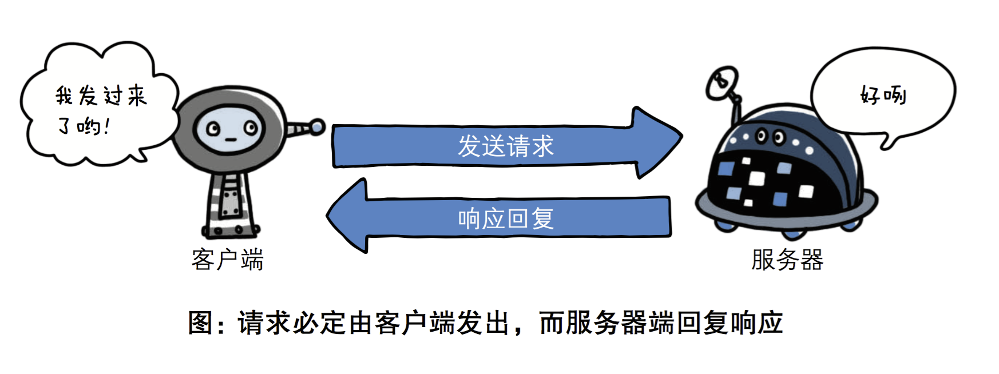
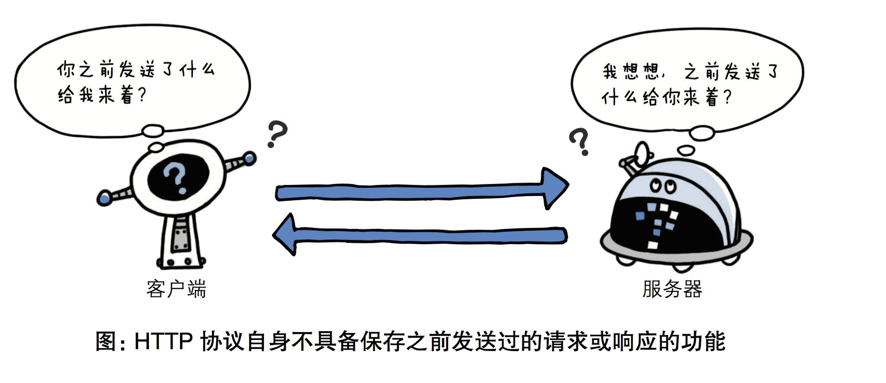
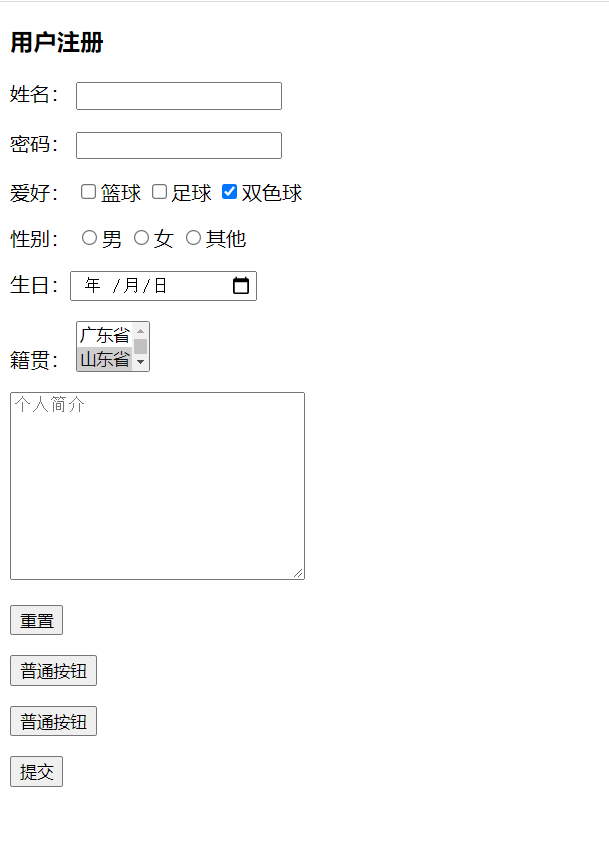
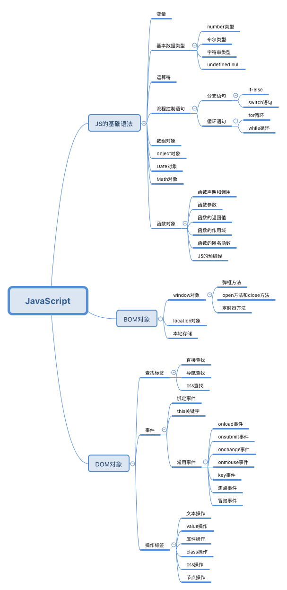
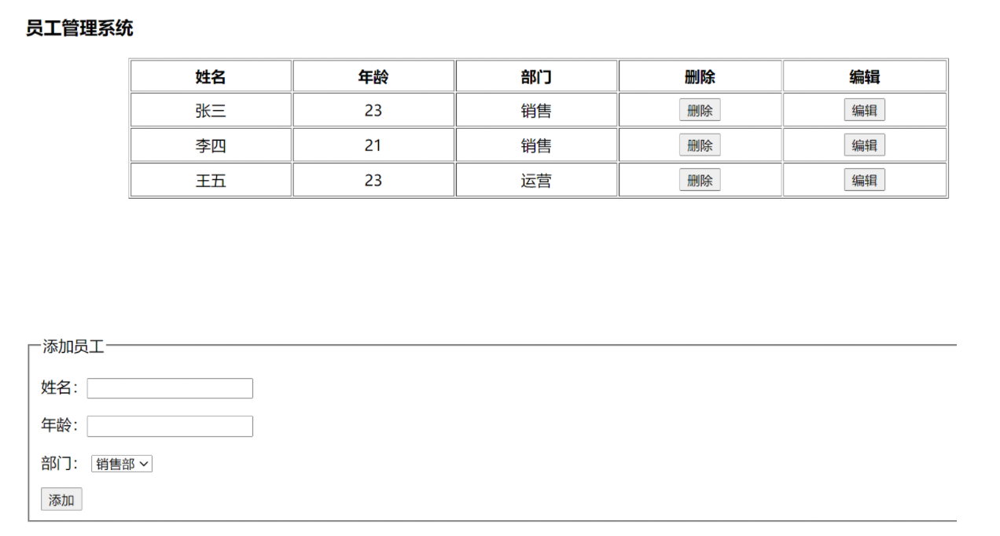

# 前言

### 1.1、CS架构和BS架构

web网页，我们都不陌生，相信大家都有使用web浏览上网的。那么，学习制作网页前，我们需要清晰哪些概念，准备哪些工具呢？接下来，我们要先了解下。在日常生活中，我们都会上网，或聊天、或阅读、或购物等，浏览很多的网站，而网站就是由网页组成。在互联网中，软件系统体系分两大结构：

* CS模式

C/S 就是Client/Server 的缩写，是客户端和服务器架构。早期的软件系统多数是C/S结构的设计标准。 例如，用户要听歌，会去下载一个酷狗的软件，打开酷狗去听歌；用户要看视频，会去下载一个优酷视频播放器，去播放视屏。用户要聊天，会去下载一个微信或者QQ；用户要玩游戏，会去下载一个游戏客户端回来玩....

* BS模式

B/S 就是Browser/Server的缩写，是浏览器和服务器架构。B/C是随着Internet技术的兴起，对C/S结构的变化或者改进的结构。本质上B/S还是属于C/S结构范围，也就是B/S包含在C/S中，是特殊的C/S架构。浏览器就是B/S结构最主要的客户端，网站也是B/S结构的软件。

例如：用户想要听歌，会去打开一个百度音乐的网址；用户要去看视频会去打开优酷的网址；用户要聊天，会去打开一个微信网页版的地址；用户要去玩游戏，会去打开一个游戏页面的网址。

C/S结构下，客户机子必须要下载专门的软件 才可以享受到服务端的服务。而B/S结构下，客户机上只要安装一个浏览器（Browser）就可以在任何地方进行操作而不用安装任何专门的软件，只要能上网的电脑就能享受到服务器提供的服务，客户端能实现零安装、零维护。

### 1.2、网页构成

World Wide Web Consortium，简称“W3C”，中文翻译为万维网联盟，又称W3C理事会。1994年10月在[麻省理工学院](http://baike.baidu.com/view/1935.htm)计算机科学实验室成立，建立者是万维网的发明者蒂姆·伯纳斯·李。万维网联盟是Web技术领域最具权威和影响力的国际中立性技术标准机构，创建和发展了W3C标准，致力于维护和发展 web 规范。W3C 标准是网页开发的核心标准。那么什么是W3C标准呢？

 W3C标准不是某一个标准，而是一系列标准的集合。网页主要由三部分组成：

* 结构（Structure）

* 表现（Presentation）

* 行为（Behavior）

对应的W3C标准也分成了三个方面：结构化标准语言主要包括XHTML和XML，表现标准语言主要包括CSS，行为标准主要包括对象模型（如W3C DOM）、ECMA[Script等。这些标准大部分由W3C起草和发布，也有一些是其他标准组织制订的标准，比如ECMA（European Computer Manufacturers Association）的ECMAScript标准。

前端基础总共分为三部分：`html`、`css`和`js`。


 那么了解了开发网页的标准以后，我们接下来开始正式的学习网页开发吧。

# day25  HTML

## 1.web开发

### 1.1、最简单的web应用程序

```python 
import socket

sock=socket.socket()
sock.bind(("127.0.0.1",8800))
sock.listen(5)

while 1:
    print("server is working...")
    conn,addr=sock.accept()
    recv_data=conn.recv(1024)
    conn.send(b"HTTP/1.1 200 OK\r\n\r\nwelcome to web world!")
    conn.close()

sock.close()
```

### 1.2、HTTP协议

#### 1.2.1 、简介

HTTP协议是Hyper Text Transfer Protocol（超文本传输协议）的缩写,是用于万维网（WWW:World Wide Web ）服务器与本地浏览器之间传输超文本的传送协议。HTTP是一个属于应用层的面向对象的协议，由于其简捷、快速的方式，适用于分布式超媒体信息系统。它于1990年提出，经过几年的使用与发展，得到不断地完善和扩展。HTTP协议工作于客户端-服务端架构为上。浏览器作为HTTP客户端通过URL向HTTP服务端即WEB服务器发送所有请求。Web服务器根据接收到的请求后，向客户端发送响应信息。


#### 1.2.2、 http协议特性

(1) 基于TCP/IP协议

http协议是基于TCP/IP协议之上的应用层协议。

(2) 基于请求－响应模式

HTTP协议规定,请求从客户端发出,最后服务器端响应该请求并 返回。换句话说,肯定是先从客户端开始建立通信的,服务器端在没有 接收到请求之前不会发送响应



(3) 无状态保存

HTTP是一种不保存状态,即无状态(stateless)协议。HTTP协议 自身不对请求和响应之间的通信状态进行保存。也就是说在HTTP这个 级别,协议对于发送过的请求或响应都不做持久化处理。

使用HTTP协议,每当有新的请求发送时,就会有对应的新响应产 生。协议本身并不保留之前一切的请求或响应报文的信息。这是为了更快地处理大量事务,确保协议的可伸缩性,而特意把HTTP协议设计成 如此简单的。

可是,随着Web的不断发展,因无状态而导致业务处理变得棘手 的情况增多了。比如,用户登录到一家购物网站,即使他跳转到该站的 其他页面后,也需要能继续保持登录状态。针对这个实例,网站为了能 够掌握是谁送出的请求,需要保存用户的状态。HTTP/1.1虽然是无状态协议,但为了实现期望的保持状态功能, 于是引入了Cookie技术。有了Cookie再用HTTP协议通信,就可以管 理状态了。有关Cookie的详细内容稍后讲解。



(4) 无连接

无连接的含义是限制每次连接只处理一个请求。服务器处理完客户的请求，并收到客户的应答后，即断开连接。采用这种方式可以节省传输时间。

#### 1.3.3、http请求协议与响应协议

http协议包含由浏览器发送数据到服务器需要遵循的请求协议与服务器发送数据到浏览器需要遵循的请求协议。用于HTTP协议交互的信被为HTTP报文。请求端(客户端)的HTTP报文 做请求报文,响应端(服务器端)的 做响应报文。HTTP报文本身是由多行数据构成的字文本。

(1) 请求协议


> 请求方式: get与post请求
>
> - GET提交的数据会放在URL之后，以?分割URL和传输数据，参数之间以&相连，如EditBook?name=test1&id=123456. POST方法是把提交的数据放在HTTP包的请求体中.
> - GET提交的数据大小有限制（因为浏览器对URL的长度有限制），而POST方法提交的数据没有限制

(2) 响应协议

#### 

响应状态码：状态码的职责是当客户端向服务器端发送请求时, 返回的请求结果。借助状态码,用户可以知道服务器端是正常理了请求,还是出现了 错误。


## 2.HTML概述

了解了web相关基本概念以后，我们开始正式接触网页开发，网页开发的基础是HTML，所以，本章内容主要分两部分，一是介绍HTML的相关概念、发展历史，二是 创建HTML网页文档和认识HTML的基本结构。我们学会如何新建一个 HTML 页面和熟记HTML文档的基本结构和主要标签。

> * HTML，即超文本标记语言（HyperText Markup Language ]），由SGML (标准通用标记语言) 发展而来，也叫web页面。扩展名是 .html 或是 .htm 。
>
> * HTML，是一种用来制作网页的标准标记语言。超文本，指的就是超出普通文本范畴的文档，可以包含文本、图片、视频、音频、链接等元素。
>
> * HTML 不是一种编程语言，而是一种写给网页浏览器、具有描述性的标记语言。

自1990年以来HTML就一直被用作WWW（World Wide Web的缩写，也可简写WEB，中文叫做万维网）的信息表示语言，使用HTML语言描述的文件，需要通过网页浏览器显示出效果。用户在访问网页时，是把服务器的HTML文档**下载** 到本地客户设备中，然后通过本地客户设备的浏览器将文档按顺序解释渲染成对应的网页效果。

网页本身是一种文本文件，通过在文本文件中添加各种各样的标记标签，可以告诉[浏览器](http://baike.baidu.com/view/7718.htm)如何显示标记中的代表的内容，如：HTML中有的标签可以告诉浏览器要把字体放大，就像word一样，也有的标签可以告诉浏览器显示指定的图片，还有的标签可以告诉浏览器把内容居中或者倾斜等等。

每一个HTML标签代表的意义都不一样。同样，他们在浏览器中表现出来的外观也是不一样的。

## 3.HTML标准结构

```html
<!DOCTYPE html>
<html lang="en">
<head>
    <meta charset="UTF-8">
    <title>Title</title>
</head>
<body>

</body>
</html>

```

> 1、`<!DOCTYPE html>` 告诉浏览器使用什么样的`html`或者`xhtml`来解析`html`文档
>
> 2、`<html></html>`是文档的开始标记和结束标记。此元素告诉浏览器其自身是一个 `HTML `文档，在它们之间是文档的头部`<head>`和主体`<body>`。	
>
> 3、`<head></head>`元素出现在文档的开头部分。`<head>与</head>`之间的内容不会在浏览器的文档窗口显示，但是其间的元素有特殊重要的意义。
>
> 4、`<title></title>`定义网页标题，在浏览器标题栏显示。
>
> 5、`<body></body>`之间的文本是可见的网页主体内容
>
> 6、`<meta charset="UTF-8"> `  声明编码方式用`utf8`

## 4.标签的语法

```html
<标签名 属性1=“属性值1” 属性2=“属性值2”……>内容部分</标签名>
<标签名 属性1=“属性值1” 属性2=“属性值2”…… />
```

> 1、HTML标签是由尖括号包围的特定关键词
>
> 2、标签分为闭合和自闭合两种标签
>
> 3、HTML不区分大小写
>
> 4、标签可以有若干个属性,也可以不带属性,比如<head>就不带任何属性
>
> 5、标签可以嵌套,但是不可以交叉嵌套
>
> 6、在很早以前HTML4的时候，HTML的标签是大写的，但在后面的发展中，人们发现HTML仍然存在很多不足，标签不区分大小写和标签可以胡乱嵌套都在其中，于是1998 年语法更为完的XML（ The Extensible Markup Lanxguage 可扩展标记语言 ）成为推荐标准，意在替代HTML。和HTML一样，XML同样来源于SGML，但当时已有成千上万的站点，因此直接使用XML作为网页开发技术根本就不可能。因此，后面W3C就在HTML4.0的基础上，参照XML的语法规则对HTML进行扩展，形成了XHTML （ The Extensible HyperText Markup Language ，可扩展超文本标记语言 ）的1.0版本。所以，XHTML是实现 HTML 到 XML的 过渡。

## 5.基本标签

* 标题标签

```html
<h1>标题1</h1>
<h2>标题2</h2>
<h3>标题3</h3>
<h4>标题4</h4>
<h5>标题5</h5>
<h6>标题6</h6>
```

* 段落标签

```html
<p>大家好，我是段落1。</p>
<p>大家好，我是段落2。</p>
<p>大家好，我是段落3。</p>
```

* 换行标签

```html
<p>大家好，我是段落标签p。我按了enter一下
换行了</p>

<p>大家好，我是段落标签p。我按了enter一下<br/> 换行了</p>
```

* 文本格式化标签

HTML提供了一系列的用于格式化文本的标签，可以让我们输出不同外观的元素，比如粗体和斜体字。如果需要在网页中，需要让某些文本内容展示的效果丰富点，可以使用以下的标签来进行格式化。

```html
<b>定义粗体文本</b><br />
<strong>定义粗体文本方式2</strong><br />
<em>定义斜体字</em><br />
<i>定义斜体字方式2</i><br />
<del>定义删除文本</del><br />
```

* 特殊符号

```html
&reg; &nbsp; &copy;
```

> 标签大致可分为两类
>
> *  块级标签(block)  -- 独占一行 
> *  内联标签(inline)  -- 按文本内容占位

* div和span标签

````html
<div>只是一个块级元素，并无实际的意义。主要通过CSS样式为其赋予不同的表现.
<span>表示了内联行(行内元素),并无实际的意义,主要通过CSS样式为其赋予不同的表现
````


块级元素与行内元素的区别所谓块元素，是以另起一行开始渲染的元素，行内元素则不需另起一行。如果单独在网页中插入这两个元素，不会对页面产生任何的影响。这两个元素是专门为定义CSS样式而生的。

## 6.超链接标签

### 6.1、超链接基本使用

超链接是浏览者和服务器的交互的主要手段，也叫超级链接或a链接，是网页中指向一个目标的连接关系，这个目标可以是网页、网页中的具体位置、图片、邮件地址、文件、应用程序等。

超链接是网页中最重要的元素之一。一个网站的各个网页就是通过超链接关联起来的，用户通过点击超链接可以从一个网页跳转到另一个网页。

几乎可以在所有的网页中找到链接。点击链接可以从一张页面跳转到另一张页面。例如,在阅读某个网站时，遇到一个不认识的英文，你只要在这个单词上单击一下，即可跳转到它的翻译页面中，看完单词的解释后点一下返回按钮，又可继续阅读，这就是超链接的常见用途。还有经常到购物网站中去，我们都是在百度搜索，然后点击对应的搜索项进入到对应的购物网站的，这也是超链接的作用。超链接的属性：

| 属性   | 值                                                           | 描述                                                         |
| ------ | ------------------------------------------------------------ | ------------------------------------------------------------ |
| href   | 网络链接 [ 例如: http://www.baidu.com ]     本地链接 [ 例如：F:\html\index.html ] | 规定链接的跳转目标                                           |
| title  | <a href="http://www.baidu.com" title="国内最著名的搜索引擎网站">百度</a> | 链接的提示信息                                               |
| target | _blank [ 在新建窗口中打开网页 ]                                                                                       _self  [ 默认值，覆盖自身窗口打开网页 ]                                                                                  _parent [ 在父级框架中打开网页 ]                                                                                                           _top  [ 在顶级框架中打开网页 ] framename [  在指定的框架中打开网页] | 与前面四项固定值不同，framename是泛指，并不是这个值，这点将在后面框架部分内容中详细介绍，这里可以暂时先略过 |

> 1、href是超链接最重要的属性，规定了用户点击链接以后的跳转目标，这个目标可以是 网络连接，也可以是本地连接。
>
> 2、网络链接指的是依靠网络来进行关联的地址，一般在地址前面是以 http://或者https://这样开头的，如果没有网络，则用户点击了超链接也无法访问对应的目标。
>
> 3、本地链接指的是本地计算机的地址，一般在地址前面是以 file:///开头或直接以 C:/、D:/、E:/开头的，不需要经过网络。
>
> 4、如果href的值留空，则默认是跳转到当前页面，也就是刷新当前页面。

### 6.2、锚点

锚点( anchor )是超链接的一种应用，也叫命名锚记，锚点可以像一个定位器一样，可以实现页面内的链接跳转，运用相当普遍。例如，我们有一个网页，由于内容太多，导致页面很长，而且里面的内容，可以分为N个部分。这样的话，我们就可以在网页的顶部设置一些锚点，这样便可以方便浏览者点击相应的锚点，到达本页内相应的位置，而不必在一个很长的网页里自行寻找。又例如，我们页面中，有个链接需要跳转到另一个页面的中间或者脚部去，这时候也可以运用上锚点技术来解决这个问题。

```html
<!DOCTYPE HTML>
<html lang="en-US">
  <head>
    <title>锚点的使用</title>
  </head>
  <body>
  <a href="#i1">第一章</a>
  <a href="#i2">第二章</a>
  <a href="#i3">第三章</a>

   <div id="i1">
      <p>第一章内容</p>
  </div>
   <div id="i2">
      <p>第二章内容</p>
  </div>
  <div id="i3">
     <p> 第三章内容</p>
  </div>
  </body>
</html>
```

## 7.img标签

在HTML中，图像由标签定义的，它可以用来加载图片到html网页中显示。网页开发过程中，有三种图片格式被广泛应用到web里，分别是 jpg、png、gif。

img标签的属性：

```go
/*
src属性：
    指定图像的URL地址，是英文source的简写，表示引入资源。
    src的值可以是本地计算机存储的图片的地址，也可以是网络上外部网站的图片的地址。
    如果src的值不正确，那么浏览器就无法正确的图片，而是显示一张裂图。
alt属性：指定图像无法显示时的替换文本。
width属性： 指定引入图片的显示宽度。
height属性：指定引入图片的显示高度。
border属性：指定引入图片的边框宽度，默认为0。
title属性：悬浮图片上的提示文字
*/
```

点击图片跳转可以配合a标签使用

```html
<a></a>
```

## 8.列表标签

```html
  <ul type="square">
      <li>item1</li>
      <li>item2</li>
      <li>item3</li>
  </ul>

  <ol start="100">
      <li>item1</li>
      <li>item2</li>
      <li>item3</li>
  </ol>
```

## 9.表格标签

### 9.1、table结构

在HTML中使用table来定义表格。网页的表格和办公软件里面的xls一样，都是有行有列的。HTML使用tr标签定义行，使用td标签定义列。

语法：

```html
<table border="1">
  <tr>
    <td>单元格的内容</td>
    ……
  </tr>
  ……
</table>

```

> 1、`<table>`和`</table>`表示一个表格的开始和结束。一组`<table>...</table>`表示一个表格。
>
> 2、border用于设置整个表格的边框宽度，默认为0，表示不显示边框。
>
> 3、`<tr>`和`</tr>`表示表格中的一行的开始和结束。一组`<tr>...</tr>`，一个表格可以有多行。通过计算table标签中包含多少对tr子标签即可知道一个表格有多少行。
>
> 4、`<td>`和`</td>`表示表格中的一个单元格的开始和结束。通过计算一个tr里面包含了多少对td自标签即可知道一个表格有多少列，多少的单元格了。

### 9.2、table属性

| 属性                                                         | 值                             | 描述                               |
| ------------------------------------------------------------ | ------------------------------ | ---------------------------------- |
| [width](http://www.w3school.com.cn/tags/att_table_width.asp) | px、%                          | 规定表格的宽度。                   |
| height                                                       | px、%                          | 规定表格的高度。                   |
| [align](http://www.w3school.com.cn/tags/att_table_align.asp) | left、center、right            | 规定表格相对周围元素的对齐方式。   |
| [bgcolor](http://www.w3school.com.cn/tags/att_table_bgcolor.asp) | rgb(x,x,x)、#xxxxxx、colorname | 规定表格的背景颜色。               |
| background                                                   | url                            | 规定表格的背景图片。               |
| [border](http://www.w3school.com.cn/tags/att_table_border.asp) | px                             | 规定表格边框的宽度。               |
| [cellpadding](http://www.w3school.com.cn/tags/att_table_cellpadding.asp) | px、%                          | 规定单元格边框与其内容之间的空白。 |
| [cellspacing](http://www.w3school.com.cn/tags/att_table_cellspacing.asp) | px、%                          | 规定单元格之间的空隙。             |

### 9.3、td属性

表格中除了行元素以外，还有单元格，单元格的属性和行的属性类似。td和th都是单元格。

| 属性                                                         | 值                             | 描述                           |
| ------------------------------------------------------------ | ------------------------------ | ------------------------------ |
| height                                                       | px、%                          | 规定单元格的高度。             |
| width                                                        | px、%                          | 规定单元格的宽度。             |
| [align](http://www.w3school.com.cn/tags/att_table_align.asp) | left、center、right            | 规定单元格内容的对齐方式。     |
| valign                                                       | top、middle、bottom            | 规定单元格内容的垂直对齐方式。 |
| [bgcolor](http://www.w3school.com.cn/tags/att_table_bgcolor.asp) | rgb(x,x,x)、#xxxxxx、colorname | 规定单元格的背景颜色。         |
| background                                                   | url                            | 规定单元格的背景图片。         |
| rowspan                                                      | number                         | 规定单元格合并的行数           |
| colspan                                                      | number                         | 规定单元格合并的列数           |

## 10.表单标签

表单主要是用来收集客户端提供的相关信息，提供了用户数据录入的方式，有多选、单选、单行文本、下拉列表等输入框，便于网站管理员收集用户的数据，是Web浏览器和Web服务器之间实现信息交流和数据传递的桥梁.

表单被form标签包含，内部使用不同的表单元素来呈现不同的方式来供用户输入或选择。当用户输入好数据后，就可以把表单数据提交到服务器端。

一个表单元素有三个基本组成部分：

* 表单标签，包含了表单处理程序所在的URL以及数据提交到服务器的方法等表单信息。 

* 表单域，包含了文本框、密码框、隐藏域、多行文本框、复选框、单选框、下拉选择框和文件上传框等表单控件。

* 表单按钮，包括提交按钮、复位按钮和一般按钮，用于将数据传送到服务器上的CGI脚本或者取消输入，还可以用表单按钮来控制其他定义了处理脚本的处理工作。

在HTML中创建表单用form标签。每个表单都可以包含一到多个表单域或按钮。form标签属性：

| 属性    | 值                                                           | 描述                          |
| ------- | ------------------------------------------------------------ | ----------------------------- |
| action  | 访问服务器地址                                               | 服务器端表单处理程序的URL地址 |
| method  | post、get[默认值]                                            | 表单数据的提交方法            |
| target  | 参考超链接的target属性                                       | 表单数据提交时URL的打开方式   |
| enctype | application/x-www-form-urlencoded[默认值]    multipart/form-data [用于文件上传]                                                        text/plain [用于纯文本数据发送] | 表单提交数据时的编码方式      |

```html
  <h3>用户注册</h3>

  <form action="http://127.0.0.1:8800" method="get">
       <p><label for="user">姓名</label>： <input type="text" name="user" id="user"></p>
       <p>密码： <input type="password" name="pwd"></p>
       <p>爱好：
           <input type="checkbox" name="hobby" value="basketball">篮球
           <input type="checkbox" name="hobby" value="football">足球
           <input type="checkbox" name="hobby" value="shuangseqiu" checked>双色球
       </p>
       <p>性别：
           <input type="radio" name="gender" value="men">男
           <input type="radio" name="gender" value="female">女
           <input type="radio" name="gender" value="qita">其他
       </p>
      <p>生日：<input type="date" name="birth"></p>
      
      <p>籍贯：
          <select name="province" id="" multiple size="2">
              <option value="">广东省</option>
              <option value="" selected>山东省</option>
              <option value="">河北省</option>
          </select>
      </p>
      <p>
          <textarea name="" id="" cols="30" rows="10" placeholder="个人简介"></textarea>
      </p>

      <div>
          <p><input type="reset" value="重置"></p>
          <p><input type="button" value="普通按钮"></p>
          <p><button>普通按钮</button></p>
          <p><input type="submit" value="提交"></p>
      </div>

  </form>

```



## 11、总结

今天我们学习了HTML标签元素尤其是form表单标签的使用和属性以及基于HTTP协议实现web通信流程，这一点是需要重点理解掌握的。

# day26 CSS


CSS就是Cascading Style Sheet的缩写，中文译作“层叠样式表”或者是“级联样式表”，是用于控制网页外观处理并允许将网页的表现与内容分离的一种标记性语言，CSS不需要编译,可以直接由浏览器执行(属于浏览器解释型语言)，是Web网页开发技术的重要组成部分。

那么接下来，继续看下，使用CSS有什么好处吧。

*  使用CSS样式可以有效地对页面进行布局，更加灵活多样。

*  使用CSS样式可以对页面字体、颜色、背景和其他效果实现精确控制，同时对它们的修改和控制变得更加快捷，更加强大。

*  站点中所有的网页风格都使用一个CSS文件进行统一控制，达到一改全改。还可以快速切换主题，我们可以把HTML比作是骨架，CSS是衣服。同一个HTML骨架结构，不同CSS样式，所得到的美化布局效果不同。

* CSS可以支持多种设备,比如手机,PDA,打印机,电视机,游戏机等。

* CSS可以将网页的表现与结构分离，使页面载入得更快,更利于维护，这也是我们的最终目的。

CSS基本语法:


> CSS的基本语法由选择器、属性、属性的值组成，如果选择符有多个属性，由分号隔开。
>
> 注意，这里的代码都是英文格式，例如花括号、冒号和分号。

## 1、CSS的引入方式

CSS样式有三种不同的使用方式，分别是行内样式，嵌入样式以及链接式。我们需要根据不同的场合不同的需求来使用不同的样式。

* 行内样式

行内样式，就是写在元素的style属性中的样式，这种样式仅限于元素内部起作用。当个别元素需要应用特殊样式时就可以使用内联样式。但不推荐大量使用内联样式，因为那样不利于后期维护。

```html
<div style="color: white;background-color: #369;text-align: center">行内设置</div>
```

* 嵌入式

嵌入式，是把CSS样式写在HTML文档内部head标签中的style标签里。浏览器加载HTML的同时就已经加载了CSS样式了。当单个文档需要特殊，单独的样式时，可以使用内部样式表。

```html
<!DOCTYPE HTML>
<html lang="en-US">
  <head>
     <title>title</title>
      <meta charset="utf8">

      <style>
          div{
              color: white;
              background-color: #369;
              text-align: center
          }
      </style>
  </head>
  <body>
  
  <div> 嵌入式</div>

  </body>
</html>
```

* 链接式

链接式，就是把CSS样式写在HTML文档的外部，一个后缀为 .css 的外部样式表中，然后使用时在head标签中，使用link标签的href属性引入文件即可。当CSS样式需要应用在很多页面时，外部样式表是最理想的选择。在使用外部样式表的情况下，我们可以通过改变一个文件来改变这所有页面的外观。

common.css

````css
div{
      color: white;
      background-color: #369;
      text-align: center
}
````

html文件

```html
<!DOCTYPE HTML>
<html lang="en-US">
  <head>
     <title>title</title>
      <meta charset="utf8">

      <link rel="stylesheet" href="common.css">
  </head>
  <body>

  <div>链接式</div>
  
  </body>
</html>
```

## 2、CSS的选择器

### 3.2.1、基本选择器


```html
<!DOCTYPE html>
<html lang="en">
<head>
    <meta charset="UTF-8">
    <title>Title</title>

    <style>
           #i1{
               color: red;
           }
           .c1{
               color: red;
           }
           .c2{
               font-size: 32px;
           }

    </style>


</head>
<body>

<div id="i1">item1</div>
<div id="i2">item2</div>
<div id="i3">item3</div>

<div class="c1 c2">item4</div>
<div class="c1">item5</div>
<div class="c1">item6</div>

</body>
</html>
```

### 3.2.2、组合选择器

* 后代子代选择器

```html
<!DOCTYPE html>
<html lang="en">
<head>
    <meta charset="UTF-8">
    <title>Title</title>


    <style>
        /*后代选择器*/
        .c1 .c2{
            color: red;
        }

        /*子代选择器*/
        .c3 .c5{
            color: red;
        }

        .c3 > .c5{
            color: red;
        }

        .c3 .c4 .c5{
            color: red;
        }
        
    </style>


</head>
<body>

<!--后代选择器-->
<div class="c1">
    <div class="c2">item1</div>
</div>
<div class="c2">item2</div>

<!--子代选择器-->
<div class="c3">
    <div class="c4">
        <div class="c5">item3</div>
    </div>
     <div class="c5">item4</div>
</div>

</body>
</html>
```

* 与或选择器

```html
<!DOCTYPE html>
<html lang="en">
<head>
    <meta charset="UTF-8">
    <title>Title</title>

    <style>
        /*与选择器*/
        p.c1{
            color: red;
        }
         /*或选择器*/
        p.c1,#i1{
            color: red;
        }


    </style>


</head>
<body>

<!--与选择器-->
<div class="c1">item1</div>
<p class="c1">item2</p>
<div>item3</div>
<p id="i1">item4</p>


</body>
</html>
```

* 兄弟选择器

```html
<!DOCTYPE html>
<html lang="en">
<head>
    <meta charset="UTF-8">
    <title>Title</title>

    <style>
        /*毗邻选择器*/
       #i1 + div.c1{
           color: red;
       }

       #i1 + div.c2{
           color: red;
       }

        /*兄弟选择器*/
        #i1 ~ div.c2{
           color: red;
        }
        #i1 ~ div{
           color: red;
        }


    </style>


</head>
<body>
    
<p id="i1">item0</p>
<div class="c1">item1</div>
<div class="c2">item2</div>
<div class="c3">item3</div>
<div class="c4">item4</div>


</body>
</html>
```

### 3.3.3、属性选择器

```css
E[att]          匹配所有具有att属性的E元素，不考虑它的值。（注意：E在此处可以省略。
                比如“[cheacked]”。以下同。）   p[title] { color:#f00; }
                
E[att=val]      匹配所有att属性等于“val”的E元素   div[class=”error”] { color:#f00; }
 
E[att~=val]     匹配所有att属性具有多个空格分隔的值、其中一个值等于“val”的E元素
                td[class~=”name”] { color:#f00; }
 
E[attr^=val]    匹配属性值以指定值开头的每个元素                    
                div[class^="test"]{background:#ffff00;}
 
E[attr$=val]    匹配属性值以指定值结尾的每个元素    div[class$="test"]{background:#ffff00;}
 
E[attr*=val]    匹配属性值中包含指定值的每个元素    div[class*="test"]{background:#ffff00;}
```

```html
<!DOCTYPE html>
<html lang="en">
<head>
    <meta charset="UTF-8">
    <title>Title</title>

    <style>
        /*属性选择器*/
        [type="text"]{
            border: 1px solid red;
        }

        [index]{
            font-size: 32px;
            font-style: italic;
        }

        [href*="png"]{
            color: red;
        }

    </style>


</head>
<body>


<input type="text">
<input type="password">

<div index="1">1</div>
<div index="2">2</div>
<div index="3">3</div>

<ul>
    <li><a href="1.png">item1</a></li>
    <li><a href="2.jpg">item2</a></li>
    <li><a href="3.jpg">item3</a></li>
    <li><a href="4.png">item4</a></li>
    <li><a href="5.gif">item5</a></li>
</ul>

</body>
</html>
```

### 3.3.4、伪类选择器

* anchor伪类：专用于控制链接的显示效果

| [:link](https://www.w3school.com.cn/cssref/selector_link.asp) | a:link    | 选择所有未被访问的链接。     |
| ------------------------------------------------------------ | --------- | ---------------------------- |
| [:visited](https://www.w3school.com.cn/cssref/selector_visited.asp) | a:visited | 选择所有已被访问的链接。     |
| [:active](https://www.w3school.com.cn/cssref/selector_active.asp) | a:active  | 选择活动链接。               |
| [:hover](https://www.w3school.com.cn/cssref/selector_hover.asp) | a:hover   | 选择鼠标指针位于其上的链接。 |

```html

    <style>
           a:link{
               color: red;
           }
           a:visited{
               color: coral;
           }
           a:hover{
               color: blue;
           }
           a:active{
               color: rebeccapurple;
           }

    </style>

```

* before after伪类 

before/after伪类相当于在元素内部插入两个额外的标签，其最适合也是最推荐的应用就是`图形生成`。在一些精致的UI实现上，可以简化HTML代码，提高可读性和可维护性。

| [:first-child](https://www.w3school.com.cn/cssref/selector_first-child.asp) | p:first-child | 选择属于父元素的第一个子元素的每个 <p> 元素。 |
| ------------------------------------------------------------ | ------------- | --------------------------------------------- |
| [:last-child](https://www.w3school.com.cn/cssref/selector_last-child.asp) | p:last-child  | 选择属于其父元素最后一个子元素每个 <p> 元素。 |
| [:before](https://www.w3school.com.cn/cssref/selector_before.asp) | p:before      | 在每个 <p> 元素的内容之前插入内容。           |
| [:after](https://www.w3school.com.cn/cssref/selector_after.asp) | p:after       | 在每个 <p> 元素的内容之后插入内容。           |

```html
<!DOCTYPE html>
<html lang="en">
<head>
    <meta charset="UTF-8">
    <title>Title</title>

    <style>

        .c1 p:first-child{
            color: red;
        }

        .c1 div:last-child{
            color: red;
        }

        p#i1:after{
            content:"hello";
            color:red;
            display: block;
        }

    </style>


</head>
<body>

<div class="c1">
    <p>item1</p>
    <p>item1</p>
    <div>item1</div>
    <p>item1</p>
</div>

<p id="i1">p标签</p>

</body>
</html>
```

### 3.3.5、样式继承

CSS的样式表继承指的是，特定的CSS属性向下传递到子孙元素。总的来说，一个HTML文档就是一个家族，然后html元素有两个子元素，相当于它的儿子，分别是head和body，然后body和head各自还会有自己的儿子，最终形成了一张以下的家族谱。


在上图中，可以看到，body的子元素有三个，h1、p和ul，ul也有几个子元素，p也有1个子元素，那么li和a就都是body的后代元素。有时可能我们在body里面设置了一些属性，结果，body下面所有的后代元素都可能享受到，这就是样式继承。就像一句俗语一样，“龙生龙，凤生凤，老鼠的儿子会打洞”。样式继承，可以给我们的网页布局带来很多的便利，让我们的代码变得更加简洁，但是，如果不了解，或者使用不当，也有可能会给我们带来很多不必要的麻烦。

因此，如果了解了哪些样式是会继承到后代元素的，那么就可以避免这些问题的发生了。

| 文本相关属性       |                     |                 |              |
| ------------------ | ------------------- | --------------- | ------------ |
| font-family        | font-size           | letter-spacing  | line-height  |
| font-style         | font-variant        | text-align      | text-indent  |
| font-weight        | font                | text-transform  | word-spacing |
| color              | direction           |                 |              |
| 列表相关属性       |                     |                 |              |
| list-style-image   | list-style-position | list-style-type | list-style   |
| 表格和其他相关属性 |                     |                 |              |
| border-collapse    | border-spacing      | caption-side    | empty-cells  |
| cursor             |                     |                 |              |

### 3.3.6、选择器优先级

* 继承

继承是CSS的一个主要特征，它是依赖于祖先-后代的关系的。继承是一种机制，它允许样式不仅可以应用于某个特定的元素，还可以应用于它的后代。例如一个BODY定义了的颜色值也会应用到段落的文本中。

```
body{color:red;}    <p>helloyuan</p>
```

这段文字都继承了由body {color:red;}样式定义的颜色。然而CSS继承性的权重是非常低的，是比普通元素的权重还要低的0。

```
p{color:green}
```

发现只需要给加个颜色值就能覆盖掉它继承的样式颜色。由此可见：任何显示申明的规则都可以覆盖其继承样式。 此外，继承是CSS重要的一部分，我们甚至不用去考虑它为什么能够这样，但CSS继承也是有限制的。有一些属性不能被继承，如：border, margin, padding, background等。

* 优先级

  所谓CSS优先级，即是指CSS样式在浏览器中被解析的先后顺序。样式表中的特殊性描述了不同规则的相对权重。

```css
/*
!important > 行内样式>ID选择器 > 类选择器 > 标签 > 通配符 > 继承 > 浏览器默认属性

1 内联样式表的权值最高               style=""           1000；

2 统计选择符中的ID属性个数。         #id                100

3 统计选择符中的CLASS属性个数。      .class             10

4 统计选择符中的HTML标签名个数。     标签名              1

按这些规则将数字符串逐位相加，就得到最终的权重，然后在比较取舍时按照从左到右的顺序逐位比较。
*/
```

```html
<!DOCTYPE html>
<html lang="en">
<head>
    <meta charset="UTF-8">
    <title>Title</title>

    <style>
            .c1{
                color: red;
            }
            #i1{
                color: coral;
            }
            div{
                color: greenyellow;
            }

            /*.c2 .c3 .c4 span{*/
            /*    color: orange;*/
            /*}*/

            .c2 .c4 span{
                color: blue;
            }

            .c2 .c3 .c5{
                color: rebeccapurple;
            }

            .c2 .c4 .c5{
                color: darkcyan;
            }

    </style>

</head>
<body>


<div class="c1" id="i1">item1</div>


<div class="c2">
    <div class="c3">
        <div class="c4">
            <span class="c5">item2</span>
        </div>
    </div>
</div>


</body>
</html>
```

> 1、有!important声明的规则高于一切。
>
> 2、如果!important声明冲突，则比较优先权。
>
> 3、如果优先权一样，则按照在源码中出现的顺序决定，后来者居上。
>
> 4、由继承而得到的样式没有specificity的计算，它低于一切其它规则(比如全局选择符*定义的规则)。
>
> 5、用数字表示只是说明思想，一万个class也不如一个id权值高

## 3、CSS的属性操作

### 3.3.1、文本属性

* font-style（字体样式风格）

```go
/*
属性值：
normal：设置字体样式为正体。默认值。 
italic：设置字体样式为斜体。这是选择字体库中的斜体字。
oblique：设置字体样式为斜体。人为的使文字倾斜，而不是去使用字体库的斜体字。
*/
```

* font-weight（字体粗细）

```go
/*
属性值：
normal：设置字体为正常字体。相当于数字值400
bold：设置字体为粗体。相当于数字值700。
bolder：设置字体为比父级元素字体更粗的字体。
lighter：设置字体为比父级元素字体更细的字体。
number：用数字表示字体粗细。从小到大，越来约粗，取值范围：100、200、300、400、500、600、700、800、900。
注意：
font-weight的常用值有两个normal和bold，其他的值在浏览器中的支持并不好。
*/
```

* font-size（字体大小）

```go
/*
font-size的值有很多，有xx-small、x-small、small、medium、large、x-large、xx-large、smaller和larger，也可以设置值为具体的数值加上对应的计算单位来表示字体的大小。字体单位有像素（ px ）、字符（ em，默认1em等于16px，2em等于32px，根据不同浏览器的默认字体大小而决定 ）、百分比（ % ），磅[点]（ pt ）。
字体不指定大小时，主流浏览器默认是15像素到16像素。旧版本的谷歌浏览器，字体最小只能设置成12像素，新版已经修复。*/
```

* font-family（字体族）

```go
/*
font-family可以指定元素使用的字体系列或字体族。当我们使用font-family指定字体族的时候，可以指定多种字体,作为候补。指定多个字体的时候，需要使用逗号隔开。
如果css中没有声明当前内容使用的字体族的时候，默认：
	中文：  宋体 [ win7以后默认是 微软雅黑 ]
	英文：  Arial
*/
```

* color（字体颜色）

```go
// 可以使用color来表示字体的颜色，颜色值最常用的有三种形式，英文单词，十六进制，RGB十进制。更高级的有 RGBA、HSL、HSLA，不过低版本的浏览器并不支持。
```

````
 <style>
        .c1{
            color: red;
        }
        .c1{
            color: #369;
        }
        .c1{
            color: RGB(0,0,255);
        }
</style>

````

> 另外要注意，使用十六进制表示颜色值的时候，如果字符的格式类似于“AAAAAA”的这种，六个字符一样的；又或者是“AABBCC”，这种，一二，三四，五六 位置上的数字一样的，我们可以使用简写来表达。

* text-align（文本对齐方式）

```go
/*
text-align属性可以设置文本内容的水平对齐方式。属性值常用的有
左对齐left、居中对齐center、右对齐right。justify 实现两端对齐文本效果。
*/
```

* line-height（字体行高）

```go
// 字体行高即字体最底端与字体内部顶端之间的距离。值可以是normal、px、number、%。
```


> 行高 = 字体大小 + 上半行距 + 下半行距

* vertical-align

vertical-align 属性设置元素的垂直对齐方式。

```html
<span>yuan</span>
```

* text-decoration

```go
// 使用text-decoration可以设置文本内容的装饰线条，正常的文本是没有线条的，常用的值有none，underline，overline，line-through四种。
```

### 3.3.2、背景属性

* background-color（背景颜色）

页面的背景颜色有四种属性值表示，分别是transparent（透明），RGB十进制颜色表示，十六进制颜色表示和颜色单词表示。

属性使用：

```go
/*
background-color: transparent;   // 透明 
background-color: rgb(255,0,0); //  红色背景 
background-color: #ff0000;  //  红色背景
background-color: red;    // 红色背景 
*/
```

* background-image（背景图片）

background-image可以引入一张图片作为元素的背景图像。默认情况下，background-image放置在元素的左上角，并在垂直和水平方向重复平铺。

语法：

```go
// background-image: url('图片地址')
```

> 当同时定义了背景颜色和背景图像时，背景图像覆盖在背景颜色之上。 所以当背景图片没有被加载到，或者不能完全铺满元素时，就会显示背景颜色。

* background-repeat（背景平铺方式）

CSS中，当使用图像作为背景了以后，都是默认把整个页面平铺满的，但是有时候在很多场合下面，页面并不需要这种默认的效果，而可能需要背景图像只显示一次，或者只按照指定方式进行平铺的时候，可以使用background-repeat来进行设置。

background-repeat专门用于设置背景图像的平铺方式，一般有四个值，默认是repeat（平铺），no-repeat（不平铺），repeat-x（X轴平铺），repeat-y（Y轴平铺）。

*  background-position（背景定位）

CSS中支持元素对背景图像的定位摆放功能，就是利用background-position属性来实现，以页面中元素的左上角为原点（0，0），把元素的内部区域当成一个坐标轴（上边框为X轴，越往左X的值越大，左边框为Y轴，越往下Y轴的值就越大，反之亦然），然后计算出背景图片的左上角与圆点的距离（x轴和y轴的距离），然后把背景图片放入到指定的位置上，对背景图片的位置进行精确的控制和摆放。

​	background-position的值分成两个，使用空格隔开，前面一个是背景图片左上角的x轴坐标，后面一个是背景图片左上角的y轴坐标。两个值都可以是正、负值。

语法：

```go
// background-position: x轴坐标 y轴坐标
```

> 背景定位的值除了是具体的数值以外，还可以是左（left）、中（center）、右（right）

* background（背景样式缩写）

和字体属性一样，多个不同背景样式属性也是可以同时缩写的，不过不需要像字体那样按照一定的顺序，背景样式的缩写属性的顺序是不固定的，可以任意编排。

语法：

```go
// background: 背景颜色  背景图片  背景平铺方式  背景定位;
```

### 3.3.3、边框属性

* border-style（边框风格）

定义边框的风格，值可以有

```go
/*
none：没有边框，当border的值为none的时候，系统将会忽略[border-color]
hidden：隐藏边框，低版本浏览器不支持。
dotted：点状边框。
dashed：虚线边框。
solid：实线边框。
double：双实线边框，两条单线与其间隔的和等于border-width值。
*/
```

border-style的值可以缩写的：

```go
/*
只有一个值的时候表示同时控制上下左右的边框风格。
只有两个值的时候表示分别控制上下、左右的边框风格。
有三个值的时候表示分别控制上、左右、下的边框风格。
有四个只的时候表示分别控制上、右、下、左的边框风格。
*/
```

border-style还可以单独指定不同方向：

```go
/*
border-top-style		设置上边的边框风格
border-bottom-style	     设置下边的边框风格
border-left-style		设置左边的边框风格
border-right-style		设置右边的边框风格
*/
```

* border-width（边框宽度）

使用border-width可以定义边框的厚度，值可以是medium，thin，thick和指定数值的宽度。 同时，border-width也可以进行缩写：

```go
/*
只有一个值的时候表示同时控制上下左右的边框宽度。
只有两个值的时候表示分别控制上下、左右的边框宽度。
有三个值的时候表示分别控制上、左右、下的边框宽度。
有四个只的时候表示分别控制上、右、下、左的边框宽度。
*/
```

border-width也可以单独指定不同方向：

```go
/*
border-top-width		设置上边的边框宽度
border-bottom-width	    设置下边的边框宽度
border-left-width		设置左边的边框宽度
border-right-width		设置右边的边框宽度
*/
```

* border-color（边框颜色）

定义边框的颜色，值表示的方式可以是十六进制，RGB十进制和单词表示法。

 同上，border-color的缩写：

```go
/*
只有一个值的时候表示同时控制上下左右的边框颜色。
只有两个值的时候表示分别控制上下、左右的边框颜色。
有三个值的时候表示分别控制上、左右、下的边框颜色。
有四个只的时候表示分别控制上、右、下、左的边框颜色。
*/
```

border-color也可以单独指定不同方向：

```css
/*
border-top-color		设置上边的边框颜色
border-bottom-color	设置下边的边框颜色
border-left-color		设置左边的边框颜色
border-right-color		设置右边的边框颜色
*/
```

* 边框样式缩写

还可以把边框风格，边框宽度，边框颜色进行组合在一起，进行缩写：语法：

```go
// border: 边框宽度 边框样式 边框颜色;
```

> 注意，border的缩写值可以不按照顺序来进行书写。这样的缩写可以同时控制4个方向的边框样式。	

### 3.3.4、列表属性

CSS中提供了一些列表属性可以用来：

​	(1)、设置不同的列表项标记为有序列表

​	(2)、设置不同的列表项标记为无序列表

​	(3)、设置列表项标记为图像

* list-style-type（系统提供的列表项目符号）

* list-style-image（自定义的列表项目符号）

```css
 li { list-style-image:url('qq.gif'); }
```

### 3.3.5、dispaly属性

display可以指定元素的显示模式，它可以把行内元素修改成块状元素，也可以把别的模式的元素改成行内元素。diisplay常用的值有四个。

语法：

```css
/*
display: block;		 	// 声明当前元素的显示模式为块状元素
display: inline;		// 声明当前元素的显示模式为行内元素
display: inline-block; 	 // 声明当前元素的显示模式为行内块状元素
display: none;			// 声明当前元素的显示模式为隐藏 
*/
```

### 3.3.6、盒子模型（重点）

盒模型是CSS的核心知识点之一，它指定元素如何显示以及如何相互交互。HTML页面上的每个元素都可以看成一个个方盒子，这些盒子由元素的content（内容）、padding（内边距）、border（边框）、margin（外边距）组成。


* padding（内边距及其缩写）

内边距，也叫“内补白”，表示页面中元素的边框与内容的距离。内边距的值不能是负值，相当于table标签的cellpadding属性。

内边距可以设置多个值：

```go
/*
当padding只有一个值的时候表示同时控制上下左右的内边距。
当padding只有两个值的时候表示分别控制上下、左右的内边距。
当padding有三个值的时候表示分别控制上、左右、下的内边距。
当padding有四个只的时候表示分别控制上、右、下、左的内边距。
*/
```

内边距也可以进行单独设置：

```css
/*
padding-top 			设置上边的外边距
padding -bottom 		设置下边的外边距
padding -left			设置左边的外边距
padding -right			设置右边的外边距
*/
```

*  margin（外边距及其缩写）

外边距，也叫“外补白”，表示页面中元素与元素之间的距离。外边距越大，两者的距离就越远，反之，如果外边距越小，则元素之间的距离就越近，外边距的值可以是正数，也可以是负值。

margin也可以像padding一样设置多个值和单独方向设置，用法一样。

> 1、在网页的开发过程中，需要让一个元素相对于父级元素作水平居中时，可以借助margin的特性来实现。
>
> ​      使用margin让元素自身居中：  margin: 0 auto;
>
> 2、浏览器的默认边距清零

```html
<!DOCTYPE html>
<html lang="en">
<head>
    <meta charset="UTF-8">
    <title>Title</title>
    <style>
       .c1{
           width: 100%;
           height: 600px;
           border: 1px solid red;

       }

       .c2{
           width: 50%;
           height: 40px;
           background-color: rebeccapurple;
           margin: 10px auto;
       }
    </style>
</head>
<body>

<div class="c1">
    <div class="c2"></div>
    <div class="c2"></div>
</div>
</body>
</html>
```

边距案例：

```html
<!DOCTYPE HTML>
<html lang="en-US">
  <head>
        <meta charset="utf8">
        <style>

            *{
                margin: 0;
                padding: 0;
            }

            .c1{
                width: 80%;

                margin: 100px auto;

            }

            .c1 .J_categoryList{
                list-style: none;

            }
            .c1 .J_categoryList li{
                display: inline-block;
                margin: 10px;

            }
            .c1 .J_categoryList li a{
                font-size: 16px;
                color: #333;
                padding: 20px;
                border: 1px solid rebeccapurple;
                text-decoration: none;
            }

        </style>
  </head>
  <body>
<div class="c1">
      <ul class="J_categoryList">
          <li><a href=""><span>红米</span></a></li>
          <li><a href=""><span>电视</span></a></li>
          <li><a href=""><span>笔记本</span></a></li>
          <li><a href=""><span>家电</span></a></li>
          <li><a href=""><span>小米手机</span></a></li>
      </ul>
</div>
  </body>
</html>
```

### 3.3.7、float属性（重点）

* 流动布局

流动模型（Flow），即文档流，浏览器打开HTML网页时，从上往下，从左往右，逐一加载。

在正常情况下，HTML元素都会根据文档流来分布网页内容的。

文档流有2大特征：

① 块状元素会随着浏览器读取文档的顺序，自上而下垂直分布，一行一个的形式占据页面位置。

② 行内元素会随着浏览器区队文档的顺序，从左往右水平分布，一行多个的形式占据页面位置。行内元素摆放满一行以后才会到下一行继续排列。

```html
<!DOCTYPE HTML>
<html lang="en-US">
  <head>
    <title></title>
    <style>
    div{ border: 1px solid #f00; margin: 4px; }
    .d3{ width: 100px; }
    </style>
  </head>
  <body>
    <div>d1</div>
    <div>d2</div>
    <div class="d3">
      <span>span1</span>
      <a>a1</a>
      <a>a2</a>
      <span>span2</span>
    </div>
  </body>
</html>
```

* 浮动模型

要学习浮动模型的布局模式，就要了解CSS提供的浮动属性（float）。浮动属性是网页布局中最常用的属性之一，通过浮动属性不但可以很好的实现页面布局，而且还可以依靠它来制作导航栏等页面功能。

简单浮动：

```html
<!DOCTYPE HTML>
<html lang="en-US">
  <head>
    <title>简单浮动</title>
    <style>

        .c1{
            width: 200px;
            height: 200px;
            background-color: indianred;
            float: left;
        }

        .c2{
            width: 300px;
            height: 200px;
            background-color: orange;
            float: left;

        }

        .c3{
            width: 400px;
            height: 200px;
            background-color: lightblue;
            float: left;
        }
        

    </style>
  </head>
  <body>

   <div class="c1"></div>
   <div class="c2"></div>
   <div class="c3"></div>

  </body>
</html>
```

* 字围效果

```html
<!DOCTYPE HTML>
<html lang="en-US">
  <head>
    <title>字围效果</title>
    <style>

        .c1{
            width: 200px;
            height: 200px;
            background-color: indianred;

        }

        .c2{
            width: 300px;
            height: 200px;
            background-color: orange;
            float: left;

        }

        .c3{
            width: 400px;
            height: 400px;
            background-color: lightblue;

        }
        
    </style>
  </head>
  <body>

   <div class="c1">111</div>
   <div class="c2">222</div>
   <div class="c3">333</div>>

  </body>
</html>
```

案例：

```html
<!DOCTYPE HTML>
<html lang="en-US">
  <head>
    <title>字围案例</title>
    <meta charset="utf8">
    <style>

        .c1{
            width: 500px;
        }

        img{
            float: left;
            width: 300px;
            height: 200px;
        }

      
    </style>
  </head>
  <body>
    <div class="c1">
           
           <span class="text">
           </span>
    </div>

  </body>
</html>
```

> 当一个元素被设置浮动后，将具有以下特性：
>
> 1. 任何申明为float 的元素都会自动被设置为一个行内块状元素，具有行内块状元素的特性。 
> 2. 假如某个元素A是浮动的，如果A元素上一个元素也是浮动的，那么A元素会跟随在上一个元素的后边(如果一行放不下这两个元素，那么A元素会被挤到下一行)；如果A元素上一个元素是标准流中的元素，那么A的相对垂直位置不会改变，也就是说A的顶部总是和上一个元素的底部对齐。
> 3. 在标准浏览器中如果浮动元素a脱离了文档流，那么排在浮动元素a后的元素将会往回排列占据浮动元素a本来所处的位置，使页面布局产生变化。
> 4. 如果水平方向上没有足够的空间容纳浮动元素，则转向下一行。
> 5. 字围效果：文字内容会围绕在浮动元素周围。
> 6. 浮动元素只能浮动至左侧或者右侧。
> 7. 浮动元素只能影响排在其后面元素的布局，却无法影响出现在浮动元素之前的元素。

*  **清除浮动**

网页布局中，最常用的布局便是浮动模型。但是浮动了以后就会破坏原有的文档流，使页面产生不必要的改动，所以我们一般在浮动了以后，达到目的了，就紧接着清除浮动。

在主流浏览器（如Firefox）下，如果没有设置height，元素的高度默认为auto，且其内容中有浮动元素时，在这种情况下元素的高度不能自动伸长以适应内容的高度，使得内容溢出到容器外面而影响（甚至破坏）布局的情况，叫“浮动溢出”，为了防止这个现象的出现而进行的CSS处理操作，CSS里面叫“清除浮动”。

```html
<!DOCTYPE HTML>
<html lang="en-US">
  <head>
    <title></title>
    <meta charset="utf8">
    <style>

        .box{
            border: 1px solid red;
        }

        .c1{
            width: 200px;
            height: 200px;
            background-color: #336699;
            float: left;
        }

         .c2{
            width: 200px;
            height: 200px;
            background-color: orange;
            float: right;
        }

         .footer{
             width: 100%;
             height: 60px;
             background-color: yellowgreen;

         }
    </style>
  </head>
  <body>
    <div class="box">
        <div class="c1"></div>
        <div class="c2"></div>
    </div>
   <div class="footer"></div>

  </body>
</html>
```


clear是css中专用于清除浮动的，常用的属性值有以下几个：

| 值    | 描述                             |
| ----- | -------------------------------- |
| left  | 在左侧不允许浮动元素。           |
| right | 在右侧不允许浮动元素。           |
| both  | 在左右两侧均不允许浮动元素。     |
| none  | 默认值。允许浮动元素出现在两侧。 |

```html
<!DOCTYPE HTML>
<html lang="en-US">
  <head>
    <title>简单浮动</title>
    <style>

        .c1{
            width: 200px;
            height: 200px;
            background-color: indianred;
            float: left;
            /*float: right;*/
        }

        .c2{
            width: 300px;
            height: 200px;
            background-color: orange;
            float: left;
            clear: left;
            /*clear: both;*/
        }

        .c3{
            width: 400px;
            height: 200px;
            background-color: lightblue;
            float: left;

        }

    </style>
  </head>
  <body>

   <div class="c1"></div>
   <div class="c2"></div>
   <div class="c3"></div>

  </body>
</html>
```

清除浮动解决父级塌陷问题：

````css
  .clearfix:after {                         /*在类名为“clearfix”的元素内最后面加入内容*/
            content: ".";                    /*内容为“.”就是一个英文的句号而已。也可以不写。*/
            display: block;                  /*加入的这个元素转换为块级元素。*/
            clear: both;                     /*清除左右两边浮动。*/
            visibility: hidden;              /*可见度设为隐藏。注意它和display:none;是有区别的。*/
                                              /* visibility:hidden;仍然占据空间，只是看不到而已；*/
            line-height: 0;                  /*行高为0；*/
            height: 0;                       /*高度为0；*/
            font-size:0;                     /*字体大小为0；*/
        }
 

整段代码就相当于在浮动元素后面跟了个宽高为0的空div，然后设定它clear:both来达到清除浮动的效果。
之所以用它，是因为，你不必在html文件中写入大量无意义的空标签，又能清除浮动。
<div class="head clearfix"></div>


````

> 此外，还给父元素加上溢出隐藏属性（overflow: hidden;）来进行清除浮动。

### 3.3.8、position属性

就像photoshop中的图层功能会把一整张图片分层一个个图层一样，网页布局中的每一个元素也可以看成是一个个类似图层的层模型。层布局模型就是把网页中的每一个元素看成是一层一层的，然后通过定位属性position对元素进行定位摆放，最终实现网页的布局。

定位属性position有4个值，分别是静态定位（static）、相对定位（relative）、绝对定位（absolute）和固定定位（fixed）。默认就是static。所以我们略过。

元素设置了定位以后，还要依靠4个方位属性来进行定位摆放。

方位属性：

```css
/*
top：让元素相对于指定目标的顶部偏移指定的距离。
  例如： top：10px; 表示距离顶部10像素

right：让元素相对于指定目标的右边偏移指定的距离。
  例如： right：10px; 表示距离顶部10像素

bottom：让元素相对于指定目标的底部偏移指定的距离。
  例如： bottom：10px; 表示距离顶部10像素

left：让元素相对于指定目标的左边偏移指定的距离。
  例如： left：10px; 表示距离顶部10像素
*/
```

* 相对定位（relative）

相对定位就是在正常文档流中，元素相对于自身位置使用left、right、top、bottom属性进行定位偏移。

```css
      .c1{
            width: 200px;
            height: 200px;
            background-color: indianred;

        }

        .c2{
            width: 200px;
            height: 200px;
            background-color: orange;
            position: relative;
            left: 200px;
            top: 200px;


        }

        .c3{
            width: 200px;
            height: 200px;
            background-color: lightblue;


        }
```

* 绝对定位（absolute）

绝对定位就是将元素脱离文档流，然后使用left、right、top、bottom属性相对于其最接近的一个具有定位属性的父级元素进行绝对定位，如果不存在这样的父级元素，则默认是相对于body元素进行绝对定位。

轮播图案例：

```html
<!DOCTYPE HTML>
<html lang="en-US">
  <head>
        <meta charset="utf8">
        <style>

            *{
                margin: 0;
                padding: 0;
            }

            .lunbo{
                width: 590px;
                height: 470px;
                border: 1px solid rebeccapurple;
                margin: 100px auto;
                position: relative;
            }

            .lunbo ul{
                list-style: none;
            }

            .lunbo .img li{
                position: absolute;
                top: 0;
                left: 0;
            }

            .lunbo .btn li{

                font-size: 25px;
                width: 40px;
                height: 40px;
                background-color: gray;
                text-align: center;
                line-height: 40px;
                border-bottom-right-radius: 50%;
                border-top-right-radius: 50%;
                color: white;

                position: absolute;
                top: 50%;
                margin-top: -20px;

            }

            .lunbo .left_btn{
                left: 0;
            }

            .lunbo .right_btn{
                right: 0;
            }
        </style>
  </head>
  <body>


  <div class="lunbo">
      <ul class="img">
          <li><a href=""></a></li>
          <li><a href=""></a></li>
          <li><a href=""></a></li>
          <li><a href=""></a></li>
          <li><a href=""></a></li>
      </ul>
      <ul class="btn">
          <li class="left_btn"> < </li>
          <li class="right_btn"> > </li>
      </ul>
  </div>
  </body>
</html>
```

* 固定定位（fixed）

固定定位与绝对定位有点相似，但是固定定位是使用left、right、top、bottom属性相对于整个浏览器的窗口进行定位，而不再相对于某个HTML页面元素了，所以当元素使用了固定定位以后，就算页面的滚动条滚动了，固定定位的元素也不会变化位置。也就是说固定定位是相对于窗口的定位，不受文档流的影响了。

```html
<!DOCTYPE HTML>
<html lang="en-US">
  <head>
      <meta charset="utf8">
    <style>

        body{
            margin: 0;
        }

        .c1{
            width: 100%;
            height: 2000px;
            background-color: lightgray;
        }

        .c2{
            width: 200px;
            height: 60px;
            background-color: yellowgreen;
            text-align: center;
            line-height: 60px;
            position: fixed;
            right: 20px;
            bottom: 20px;
        }
        
    </style>
  </head>
  <body>

   <div class="c1"></div>
   <div class="c2">返回顶部</div>

  </body>
</html>
```

## 4、总结

学习css选择器以及属性设置，尤其是盒子模型，浮动，定位等属性的掌握。


## 5、作业

**小米官网页面设计**


# day27  JavaScript(1)

## 1、JavaScript 的历史

### 1.1、JavaScript 的历史

JavaScript 因为互联网而生，紧随着浏览器的出现而问世。回顾它的历史，就要从浏览器的历史讲起。

1990年底，欧洲核能研究组织（CERN）科学家Tim Berners-Lee，在全世界最大的电脑网络——互联网的基础上，发明了万维网（World Wide Web），从此可以在网上浏览网页文件。最早的网页只能在操作系统的终端里浏览，也就是说只能使用命令行操作，网页都是在字符窗口中显示，这当然非常不方便。

1992年底，美国国家超级电脑应用中心（NCSA）开始开发一个独立的浏览器，叫做Mosaic。这是人类历史上第一个浏览器，从此网页可以在图形界面的窗口浏览。

1994年10月，NCSA的一个主要程序员Marc Andreessen联合风险投资家Jim Clark，成立了Mosaic通信公司（Mosaic Communications），不久后改名为Netscape。这家公司的方向，就是在Mosaic的基础上，开发面向普通用户的新一代的浏览器Netscape Navigator。

1994年12月，Navigator发布了1.0版，市场份额一举超过90%。

Netscape 公司很快发现，Navigator浏览器需要一种可以嵌入网页的脚本语言，用来控制浏览器行为。当时，网速很慢而且上网费很贵，有些操作不宜在服务器端完成。比如，如果用户忘记填写“用户名”，就点了“发送”按钮，到服务器再发现这一点就有点太晚了，最好能在用户发出数据之前，就告诉用户“请填写用户名”。这就需要在网页中嵌入小程序，让浏览器检查每一栏是否都填写了。

管理层对这种浏览器脚本语言的设想是：功能不需要太强，语法较为简单，容易学习和部署。那一年，正逢Sun公司的Java语言问世，市场推广活动非常成功。Netscape公司决定与Sun公司合作，浏览器支持嵌入Java小程序（后来称为Java applet）。但是，浏览器脚本语言是否就选用Java，则存在争论。后来，还是决定不使用Java，因为网页小程序不需要Java这么“重”的语法。但是，同时也决定脚本语言的语法要接近Java，并且可以支持Java程序。这些设想直接排除了使用现存语言，比如Perl、Python和TCL。

1995年，Netscape公司雇佣了程序员Brendan Eich开发这种网页脚本语言。Brendan Eich有很强的函数式编程背景，希望以Scheme语言（函数式语言鼻祖LISP语言的一种方言）为蓝本，实现这种新语言。

1995年5月，Brendan Eich只用了10天，就设计完成了这种语言的第一版。为了保持简单，这种脚本语言缺少一些关键的功能，比如块级作用域、模块、子类型（subtyping）等等，但是可以利用现有功能找出解决办法。这种功能的不足，直接导致了后来JavaScript的一个显著特点：对于其他语言，你需要学习语言的各种功能，而对于JavaScript，你常常需要学习各种解决问题的模式。而且由于来源多样，从一开始就注定，JavaScript的编程风格是函数式编程和面向对象编程的一种混合体。

Netscape 公司的这种浏览器脚本语言，最初名字叫做 Mocha，1995年9月改为LiveScript。12月，Netscape公司与Sun公司（Java语言的发明者和所有者）达成协议，后者允许将这种语言叫做JavaScript。这样一来，Netscape公司可以借助Java语言的声势，而Sun公司则将自己的影响力扩展到了浏览器。

之所以起这个名字，并不是因为JavaScript本身与Java语言有多么深的关系（事实上，两者关系并不深），而是因为Netscape公司已经决定，使用Java语言开发网络应用程序，JavaScript可以像胶水一样，将各个部分连接起来。当然，后来的历史是Java语言的浏览器插件失败了，JavaScript反而发扬光大。

1995年12月4日，Netscape 公司与 Sun 公司联合发布了 JavaScript 语言。当时的意图是将 JavaScript 作为 Java 的补充，用来操作网页。

1996年3月，Navigator 2.0 浏览器正式内置了 JavaScript 脚本语言。

### 1.2、JavaScript与ECMAScript的关系

1996年8月，微软模仿JavaScript开发了一种相近的语言，取名为JScript（JavaScript是Netscape的注册商标，微软不能用），首先内置于IE 3.0。Netscape公司面临丧失浏览器脚本语言的主导权的局面。

1996年11月，Netscape公司决定将JavaScript提交给国际标准化组织ECMA（European Computer Manufacturers Association），希望JavaScript能够成为国际标准，以此抵抗微软。ECMA的39号技术委员会（Technical Committee 39）负责制定和审核这个标准，成员由业内的大公司派出的工程师组成，目前共25个人。该委员会定期开会，所有的邮件讨论和会议记录，都是公开的。

1997年7月，ECMA组织发布262号标准文件（ECMA-262）的第一版，规定了浏览器脚本语言的标准，并将这种语言称为ECMAScript。这个版本就是ECMAScript 1.0版。之所以不叫JavaScript，一方面是由于商标的关系，Java是Sun公司的商标，根据一份授权协议，只有Netscape公司可以合法地使用JavaScript这个名字，且JavaScript已经被Netscape公司注册为商标，另一方面也是想体现这门语言的制定者是ECMA，不是Netscape，这样有利于保证这门语言的开放性和中立性。因此，ECMAScript和JavaScript的关系是，前者是后者的规格，后者是前者的一种实现。在日常场合，这两个词是可以互换的。

ECMAScript只用来标准化JavaScript这种语言的基本语法结构，与部署环境相关的标准都由其他标准规定，比如DOM的标准就是由W3C组织（World Wide Web Consortium）制定的。

> 一个完整的JavaScript包含三个部分：ECMAScript（标准语法），DOM以及BOM！

ECMA-262标准后来也被另一个国际标准化组织ISO（International Organization for Standardization）批准，标准号是ISO-16262。

### 1.3、JavaScript与Java的关系

JavaScript和Java是两种不一样的语言，但是它们之间存在联系。

JavaScript的基本语法和对象体系，是模仿Java而设计的。但是，JavaScript没有采用Java的静态类型。正是因为JavaScript与Java有很大的相似性，所以这门语言才从一开始的LiveScript改名为JavaScript。基本上，JavaScript这个名字的原意是“很像Java的脚本语言”。

在JavaScript语言中，函数是一种独立的数据类型，以及采用基于原型对象（prototype）的继承链。这是它与Java语法最大的两点区别。JavaScript语法要比Java自由得多。

另外，Java语言需要编译，而JavaScript语言则是运行时由解释器直接执行。

总之，JavaScript的原始设计目标是一种小型的、简单的动态语言，与Java有足够的相似性，使得使用者（尤其是Java程序员）可以快速上手。

### 1.4、JavaScript的版本

1997年7月，ECMAScript 1.0发布。

1998年6月，ECMAScript 2.0版发布。

1999年12月，ECMAScript 3.0版发布，成为JavaScript的通行标准，得到了广泛支持。

2007年10月，ECMAScript 4.0版草案发布，对3.0版做了大幅升级，预计次年8月发布正式版本。草案发布后，由于4.0版的目标过于激进，各方对于是否通过这个标准，发生了严重分歧。以Yahoo、Microsoft、Google为首的大公司，反对JavaScript的大幅升级，主张小幅改动；以JavaScript创造者Brendan Eich为首的Mozilla公司，则坚持当前的草案。

2008年7月，由于对于下一个版本应该包括哪些功能，各方分歧太大，争论过于激进，ECMA开会决定，中止ECMAScript 4.0的开发（即废除了这个版本），将其中涉及现有功能改善的一小部分，发布为ECMAScript 3.1，而将其他激进的设想扩大范围，放入以后的版本，由于会议的气氛，该版本的项目代号起名为Harmony（和谐）。会后不久，ECMAScript 3.1就改名为ECMAScript 5。

2009年12月，ECMAScript 5.0版正式发布。Harmony项目则一分为二，一些较为可行的设想定名为JavaScript.next继续开发，后来演变成ECMAScript 6；一些不是很成熟的设想，则被视为JavaScript.next.next，在更远的将来再考虑推出。TC39的总体考虑是，ECMAScript 5与ECMAScript 3基本保持兼容，较大的语法修正和新功能加入，将由JavaScript.next完成。当时，JavaScript.next指的是ECMAScript 6。第六版发布以后，将指ECMAScript 7。TC39预计，ECMAScript 5会在2013年的年中成为JavaScript开发的主流标准，并在此后五年中一直保持这个位置。

2011年6月，ECMAscript 5.1版发布，并且成为ISO国际标准（ISO/IEC 16262:2011）。到了2012年底，所有主要浏览器都支持ECMAScript 5.1版的全部功能。

2013年3月，ECMAScript 6草案冻结，不再添加新功能。新的功能设想将被放到ECMAScript 7。

2013年12月，ECMAScript 6草案发布。然后是12个月的讨论期，听取各方反馈。

2015年6月，ECMAScript 6正式发布，并且更名为“ECMAScript 2015”。这是因为TC39委员会计划，以后每年发布一个ECMAScirpt的版本，下一个版本在2016年发布，称为“ECMAScript 2016”。

除了ECMAScript的版本，很长一段时间中，Netscape公司（以及继承它的Mozilla基金会）在内部依然使用自己的版本号。这导致了JavaScript有自己不同于ECMAScript的版本号。1996年3月，Navigator 2.0内置了JavaScript 1.0。JavaScript 1.1版对应ECMAScript 1.0，但是直到JavaScript 1.4版才完全兼容ECMAScript 1.0。JavaScript 1.5版完全兼容ECMAScript 3.0。目前的JavaScript 1.8版完全兼容ECMAScript 5。

[参考链接](https://javascript.ruanyifeng.com/introduction/history.html)

## 2、JS的引入方式

```html
1 直接编写
    <script>
        console.log('hello yuan')
    </script>
2 导入文件
    <script src="hello.js"></script>
```

## 3、ECMAScript基本语法

js是一门弱类型的编程语言,属于基于对象和基于原型的脚本语言.

* 变量

```js
格式:
	    // 方式1 先声明再赋值
	    var 变量名;   // 声明的变量如果没有进行赋值,或者没有被定义的变量,值默认是undefined
      变量名 = 变量值;
	    // 方式2 声明并赋值
      var 变量名 = 变量值;
      // 方式3 一行可以声明多个变量.并且可以是不同类型
      var name="yuan", age=20, job="lecturer";
     
```

> 1、声明变量时 可以不用var. 如果不用var 那么它是全局变量
>
> 2、变量命名,首字符只能是字母,下划线,$美元符 三选一，余下的字符可以是下划线、美元符号或任何字母或数字字符且区分大小写

*  注释

```js
// 单行注释

 /*
   多行注释
 */
```

* 语句分隔符

```js
var a = 1   // 分号和换行符作为语句分隔符号
var b = 2;
console.log(a,b)
```

## 4、ECMAScript 基本数据类型


### 4.4.1、数字类型

JavaScript 没有整型和浮点型，只有一种数字类型，即number类型。

```js
var x = 10;
var y = 3.14;
console.log(x,typeof x);  // 10 "number"
console.log(y,typeof y);  // 3.14 "number"
```

### 4.4.2、字符串

字符串创建(两种方式)

* 变量 = “字符串”
* 字串对象名称 = new String (字符串)

```js
var str1="hello world";
var str1= new String("hello word");
```

```js

// 字符串对象的操作
var str = "hello"; // 这就是字符串对象
console.log(str);

// 字符串对象内置属性
// length 计算字符串的长度
console.log( str.length );

// 字符串对象内置方法
// toUpperCase();  字母大写转换
// toLowerCase();  字母小写转换

console.log( str.toUpperCase() );
console.log( str.toLowerCase() );

// indexOf 获取指定字符在字符串中第一次出现的索引位置
// 字符串也有下标,也可以使用中括号来提取字符串的指定字符
console.log(str[1]); // e
console.log( str.indexOf("e") ); // 1

// 切片,当前方法支持使用负数代表倒数下标
// slice(开始下标)   从开始位置切到最后
// slice(开始下标,结束下标)  从开始下标切到指定位置之前
var str = "helloworld";
var ret = str.slice(3,6); // 开区间,不包含结束下标的内容
console.log(ret); // low
var ret = str.slice(5);
console.log(ret); // world
var ret = str.slice(2,-1);
console.log(ret); // lloworl
var ret = str.slice(-4,-1);
console.log(ret); // orl
var ret = str.slice(-1,-4);
console.log(ret); // orl

// split   正则分割,经常用于把字符串转换成数组
var str = "广东-深圳-南山";
var ret = str.split("-");
console.log( ret );

// substr  截取
var str = "hello world";
var ret = str.substr(0,3);
console.log(ret); // hel

// trim    移除字符串首尾空白
var password = "    ge llo   ";
var ret = password.trim();
console.log(password.length); // 13
console.log(ret.length);  // 6

```

### 4.4.3、布尔值

> 1、Boolean类型仅有两个值：true和false，也代表1和0，实际运算中true=1,false=0
> 2、布尔值也可以看作on/off、yes/no、1/0对应true/false;
> 3、Boolean值主要用于JavaScript的控制语句

```js
console.log(true);
console.log(false);
console.log(typeof true);
console.log(true === 1);
console.log(true == 1);
console.log(true + 1);
console.log(false + 1);
```

### 4.4.4、空值（Undefined和Null）

* undefined类型

undefined类型只有一个值，即 undefined。

（1）当声明的变量未初始化时，该变量的默认值是 undefined。

（2）当函数无明确返回值时，返回的也是值 undefined;

* null类型

另一种只有一个值的类型是 null，它只有一个专用值 null，即它的字面量。值 undefined 实际上是从值 null 派生来的，因此 ECMAScript 把它们定义为相等的。

尽管这两个值相等，但它们的含义不同。undefined 是声明了变量但未对其初始化时赋予该变量的值，null 则用于表示尚未存在的对象。如果函数或方法要返回的是对象，那么找不到该对象时，返回的通常是 null。

### 4.4.5、类型转换

js中,类型转换有2种.一种就是强制转换,一种就是自动转换.

> 因为js是一门弱类型的脚本语言,所以变量会在运算符的运行要求,有时候根据运算符的要求,进行自动转换的.

* 强制转换

```js
// 1. 转换数据为数值类型
// parseInt     把数据转换成整数
// parseFloat   把数据转换成小数
// Number       把数据转换成数值
var box1 = "一共100件"; // 转换会失败
var box1 = "100件";     // 转换会成功
var ret = parseInt(box1);
console.log(box1);
console.log(ret);
//
var box2 = "3.14";
console.log(parseFloat(box2) ); // 3.14
//
var box3 = "3.14";   // 使用Number转换的数据里面必须是纯数字!!!!否则都会转换失败
// var box3 = "3.1.4";  // 转换失败!
console.log( Number(box3) );

// 对于转换数值,如果转换失败的话,则结果为 NaN ,是 Not a Number ,但是NaN的类型也是number类型

// 2. 转换数据为字符串
// 变量.toString()
// String(数据)
var box4 = 3.14;
var ret = box4.toString();
console.log(ret);
//
ret = String(box4);
console.log(ret);

// 3. 转换数据成布尔类型
// Boolean()

var box5 = "";
console.log( Boolean(box5) ); // false
var box6 = -1;
console.log( Boolean(box6) ); // true
var box7 = 0;
console.log( Boolean(box7) ); // false;
var box8 = "false";
console.log( Boolean(box8) ); // true
var box9 = [];
console.log( Boolean(box9) ); // true
var box10 = {};
console.log( Boolean(box10) ); // true
var box11 = "0";
console.log( Boolean(box11) ); // true
var box12 = null;
console.log( Boolean(box12) ); // false
var box13 = undefined;
console.log( Boolean(box13) ); // false
```

* 自动转换

```js
// 所谓的自动转换,其实弱类型中的变量会根据当前代码的需要,进行类型的自动隐式转化
var box1 = 1 + true;
// true 转换成数值,是1, false转换成数值,是0
console.log(box1); // 2

var box2 = 1 + "200";
console.log(box2); // 1200 原因是,程序中+的含义有2种,第一: 两边数值相加, 第二: 两边字符串拼接.但是在js中运算符的优先级中, 字符串拼接的优先级要高于数值的加减乘除,所以解析器优先使用了+号作为了字符串的拼接符号了,因为程序就需要+号两边都是字符串才能完成运算操作,因此1变成字符串最终的结果就是 "1" +"200"

var box3 = 1 - "200";
console.log(box3); // -199;因为-号中表示的就是左边的数值减去右边的数值,因此程序就会要求"200"是数值,因此内部偷偷的转换了一下
```

### 4.4.6、原始值和引用值

根据数据类型不同，有的变量储存在栈中，有的储存在堆中。具体区别如下：

原始变量及他们的值储存在栈中，当把一个原始变量传递给另一个原始变量时，是把一个栈房间的东西复制到另一个栈房间，且这两个原始变量互不影响。

引用值是把 引用变量的名称储存在栈中，但是把其实际对象储存在堆中，且存在一个指针由变量名指向储存在堆中的实际对象，当把引用对象传递给另一个变量时，复制的其实是指向实际对象的指针， 此时 两者指向的 是同一个数据，若通过方法改变其中一个变量的值，则访问另一个变量时，其值也会随之加以改变；但若不是通过方法 而是通过 重新赋值 此时 相当于 重新开了一个房间 该值的原指针改变 ，则另外一个 值不会随他的改变而改变。

```js
// 初始值类型
var a = "yuan";
var b = a;
a = "alvin";
console.log(a);//alvin
console.log(b);//yuan

// 对象类型
var arr1=[1,2];
arr2 = arr1;
arr1.push(3);
console.log(arr1)// [1,2,3]
console.log(arr2);//[1,2,3]

arr1=[4,5];
console.log(arr1);//[4,5]
console.log(arr2);//[1,2,3]
```

## 5、运算符

* 运算符

```js
/*
//算术运算符
   +   数值相加
   -   数值相减
   *   数值相乘
   /   数值相除
   %   数值求余
   **  数值求幂
   a++ 数值后自增1   a=a+1
   ++a 数值前自增1   a=a+1
   b-- 数值后自减1   b=b-1
   --b 数值前自减1   b=b-1
   
//赋值运算符
   =
   +=
   -=
   *=
   /=
   %=
   **=

//比较运算符,比较的结果要么是true, 要么是false
	>   大于
	<   小于
	>=  大于或者等于
	<=  小于或者等于
	!=  不等于[计算数值]
	==  等于[计算]

  !== 不全等[不仅判断数值,还会判断类型是否一致]
	=== 全等[不仅判断数值,还会判断类型是否一致]

//逻辑运算符
  &&   并且  and    两边的运算结果为true,最终结果才是true
  ||   或者  or     两边的运算结果为false,最终结果才是false
  !    非    not    运算符的结果如果是true,则最终结果是false ,反之亦然.
 
  //逻辑运算符进阶用法:
     1. 实现短路
        var a = false || 2      >>> a = 2
        var a = true && "hehe"  >>>  a = "hehe"
     
     2. 快速布尔化[把数据快速转换成布尔类型]
        var a = 100
        !!a  >>> true

//条件运算符[三目运算符]
	 条件?true:false
	 例如:
	      var age = 12;
        var ret = age>=18?"成年":"未成年"; // 相当于 python中的"成年" if age >= 18 else "未成年"
        console.log(ret);
 */
```

## 6、流程控制语句

编程语言的流程控制分为三种：

- 顺序结构(从上向下顺序执行)
- 分支结构
- 循环结构

之前我们学习的方式就是顺序执行，即代码的执行从上到下，一行行分别执行。

例如：

```js

console.log("星期一");
console.log("星期二");
console.log("星期三");

```

### 4.6.1、分支结构

* if 分支语句

```js
 if(条件){
     // 条件为true时,执行的代码
   }
   
   if(条件){
     // 条件为true时,执行的代码
   }else{
     // 条件为false时,执行的代码
   }
   
   if(条件1){
     // 条件1为true时,执行的代码
   }else if(条件2){
     // 条件2为true时,执行的代码
   
   }....
   
   }else{
     // 上述条件都不成立的时候,执行的代码
   }
```

* switch语句

```js
switch(条件){
      case 结果1:
           满足条件执行的结果是结果1时,执行这里的代码..
           break;
      case 结果2:
      	   满足条件执行的结果是结果2时,执行这里的代码..
      	   break;
      .....
      default:
           条件和上述所有结果都不相等时,则执行这里的代码
   }
```

> 1、switch比if else更为简洁
>
> 2、执行效率更高。switch…case会生成一个跳转表来指示实际的case分支的地址，而这个跳转表的索引号与switch变量的值是相等的。从而，switch…case不用像if…else那样遍历条件分支直到命中条件，而只需访问对应索引号的表项从而到达定位分支的目的。
>
> 3、到底使用哪一个选择语句，代码环境有关，如果是范围取值，则使用if else语句更为快捷；如果是确定取值，则使用switch是更优方案。

### 4.6.2、循环语句

* while循环

```js
   while(循环的条件){
      // 循环条件为true的时候,会执行这里的代码
   }
  
```

循环案例：

```js
 var count = 0
 while (count<10){
     console.log(count);
     count++;
 }
```

* for循环

```js
   
   // 循环三要素
   for(1.声明循环的开始; 2.条件; 4. 循环的计数){
      // 3. 循环条件为true的时候,会执行这里的代码
   }
   
   for(循环的成员下标 in 被循环的数据){
      // 当被循环的数据一直没有执行到最后下标,都会不断执行这里的代码
   }   
```

循环案例：

```js
// 方式1
for (var i = 0;i<10;i++){
	console.log(i)
}

// 方式2
var arr = [111,222,333]
for (var i in arr){
    console.log(i,arr[i])
}

```

* 退出循环（break和continue）

```js
 for (var i = 0;i<100;i++){
           if (i===88){
               continue  // 退出当次循环
               // break  // 退出当前整个循环
           }
           console.log(i)
       }
```

> 作业：
>
> （1）计算1+2+3+...+100=？
>
> （2）求20的阶乘值

## 7、数组对象

* 创建数组

```js
创建方式1:
var arrname = [元素0,元素1,….];          // var arr=[1,2,3];

创建方式2:
var arrname = new Array(元素0,元素1,….); // var test=new Array(100,"a",true);
```

* 数组方法

```js
var arr = ["A","B","C","D"];
// 内置属性
console.log( arr.length );
// 获取指定下标的成员
// console.log( arr[3] ); // D
console.log( arr[arr.length-1] ); // 最后一个成员

// (1) pop()  出栈,删除最后一个成员作为返回值
var arr = [1,2,3,4,5];
var ret = arr.pop();
console.log(arr); // [1, 2, 3, 4]
console.log(ret); // 5


// (2) push() 入栈,给数组后面追加成员
var arr = [1,2,3,4,5];
arr.push("a");
console.log(arr); // [1, 2, 3, 4, 5, "a"]


// (3) shift是将数组的第一个元素删除
var arr = [1,2,3,4,5];
arr.shift()
console.log(arr); // [2, 3, 4, 5]

// (4) unshift是将value值插入到数组的开始
var arr = [1,2,3,4,5];
arr.unshift("yuan")
console.log(arr); // ["yuan",1,2, 3, 4, 5]


// (5) reverse() 反转排列
var arr = [1,2,3,4,5];
arr.reverse();
console.log(arr); // [5, 4, 3, 2, 1]

// (6) slice(开始下标,结束下标)  切片,开区间


// (7) sort() 排序
var arr = [3,4,1,2,5,10];
console.log( arr ); // [3, 4, 1, 2, 5, 10]
arr.sort();
//
// // 这是字符的排序,不是数值的排序
console.log(arr);   //  [1, 10, 2, 3, 4, 5]

// 数值升序
var arr = [3,4,1,2,5,10];
arr.sort(function(a,b){
    return a-b;
});
console.log(arr);  // [1, 2, 3, 4, 5, 10]

// 数值降序
var arr = [3,4,1,2,5,10];
arr.sort(function(a,b){
    return b-a;
});
console.log(arr); // [10, 5, 4, 3, 2, 1]

// (8) splice(操作位置的下标,删除操作的成员长度,"替换或者添加的成员1","替换或者添加的成员2")  添加/删除指定的成员   "万能函数"
var arr1 = [1,2,3];
arr1.splice(1,1);
console.log(arr1); // 删除指定的1个成员  [1, 3]

var arr2 = ["a","b","c","d"];
arr2.splice(2,0,"w","x","w"); // 添加
console.log(arr2); // ["a", "b", "w", "x", "w", "c", "d"]

var arr3 = ["a","b","c"];
arr3.splice(1,1,"w");
console.log(arr3); // ["a", "w", "c"]

// (9) concat() 把2个或者多个数组合并
var arr1 = [1,2,3];
var arr2 = [4,5,7];
var ret = arr1.concat(arr2);
console.log( ret );


// (10) join()  把数组的每一个成员按照指定的符号进行拼接成字符串
var str = "广东-深圳-南山";
var arr = str.split("-");
console.log( arr ); // ["广东", "深圳", "南山"];

var arr1 = ["广东", "深圳", "南山"];
var str1 = arr1.join("-");
console.log( str1 ); // 广东-深圳-南山


// (11) find()  高阶函数, 返回符合条件的第一个成员
var arr = [4,6,5,7];
var func = (num)=>{
    if(num%2===0){
        return num;
    }
};
var ret = arr.find(func);
console.log( ret ); // 4

// (12)  filter() 高阶函数, 对数组的每一个成员进行过滤,返回符合条件的结果
var arr = [4,6,5,7];
function func(num){  // 也可以使用匿名函数或者箭头函数
    if(num%2===0){
        return num;
    }
}
var ret = arr.filter(func);  // 所有的函数名都可以作为参数传递到另一个函数中被执行
console.log( ret );

// (13) map() 对数组的每一个成员进行处理,返回处理后的每一个成员
var arr = [1,2,3,4,5];
var ret = arr.map((num)=>{
    return num**3;
});
console.log( ret  ); // [1, 8, 27, 64, 125]

// (14) 其它方法
// includes   查询指定数据是否在数组中存在!
// indexOf()  查询指定数据在数组中第一次出现的位置
// isArray()  判断变量的值是否是数组
       
```

* 遍历数组

```js
 var arr = [12,23,34]
 for (var i in arr){
       console.log(i,arr[i])
 }
```

## 8、Object对象

### 8.1、object对象的基本操作

 Object 的实例不具备多少功能，但对于在应用程序中存储和传输数据而言，它们确实是非常理想的选择。
`创建 Object 实例的方式有两种。`

```js
var person = new Object();
person.name = "alvin";
person.age = 18;
```

`另一种方式是使用对象字面量表示法。`对象字面量是对象定义的一种简写形式，目的在于简化创建包含大量属性的对象的过程。下面这个例子就使用了对象字面量语法定义了与前面那个例子中相同的person 对象：

```js
var person = {
                name : "alvin",
                age : 18
             }; 
```

* object可以通过. 和 []来访问。

```js
console.log(person["age"]);
console.log(person.age)
```

* object可以通过for循环遍历

```js
 for (var attr in person){
           console.log(attr,person[attr]);
      }
```

### 8.2、json序列化和反序列化

`JSON`：JavaScript 对象表示法（JavaScript Object Notation），是一种轻量级的数据交换格式。易于人阅读和编写。

```js
# json是一种数据格式, 语法一般是{}或者[]包含起来
# 内部成员以英文逗号隔开,最后一个成员不能使用逗号!
# 可以是键值对,也可以是列表成员
# json中的成员如果是键值对,则键名必须是字符串.而json中的字符串必须使用双引号圈起来
# json数据也可以保存到文件中,一般以".json"结尾.
# 前端项目中,一般使用json作为配置文件.

{
   "name": "xiaoming",
	 "age":12
}

[1,2,3,4]

{
   "name": "xiaoming",
	 "age":22,
   "sex": true,
   "son": {
      "name":"xiaohuihui",
      "age": 2
   },
   "lve": ["篮球","唱","跳"]
}
```

js中也支持序列化和反序列化的方法：

```js
<!DOCTYPE html>
<html lang="en">
<head>
    <meta charset="UTF-8">
    <title>Title</title>
</head>
<body>
<script>
    // js对象,因为这种声明的对象格式很像json,所以也叫json对象
    var data = {
        name: "xiaoming",
        age: 22,
        say: function(){
            alert(123);
        }
    };

    // 把json对象转换成json字符串
    var ret = JSON.stringify(data);
    console.log(ret ); // {"name":"xiaoming","age":22}

    // 把json字符串转换成json对象
    var str = `{"name":"xiaoming","age":22}`;
    var ret = JSON.parse(str);
    console.log(ret);
</script>
</body>
</html>
```

## 9、Date对象

* 创建Date对象

```js
//方法1：不指定参数
var nowd1=new Date();
console.log(nowd1.toLocaleString( ));
//方法2：参数为日期字符串
var d2=new Date("2004/3/20 11:12");
console.log(d2.toLocaleString( ));
var d3=new Date("04/03/20 11:12");
console.log(d3.toLocaleString( ));
//方法3：参数为毫秒数
var d4=new Date(5000);
console.log(d4.toLocaleString( ));
console.log(d4.toUTCString());
//方法4：参数为年月日小时分钟秒毫秒
var d5=new Date(2004,2,20,11,12,0,300);
console.log(d5.toLocaleString( ));//毫秒并不直接显示
```

* 获取时间信息

```java
获取日期和时间
getDate()                 获取日
getDay ()                 获取星期
getMonth ()               获取月（0-11）
getFullYear ()            获取完整年份
getYear ()                获取年
getHours ()               获取小时
getMinutes ()             获取分钟
getSeconds ()             获取秒
getMilliseconds ()        获取毫秒
getTime ()                返回累计毫秒数(从1970/1/1午夜)
```

* 日期和时间的转换

```java
日期和时间的转换:
// 返回国际标准时间字符串
toUTCString()
// 返回本地格式时间字符串
toLocalString()
// 返回累计毫秒数(从1970/1/1午夜到本地时间)
Date.parse(x)
// 返回累计毫秒数(从1970/1/1午夜到国际时间)
Date.UTC(x)

```

练习：以`2021年03月2日 14:1:43 星期二`格式化输出当前时间

```js
 function getCurrentDate(){
            //1. 创建Date对象
            var date = new Date(); //没有填入任何参数那么就是当前时间
            //2. 获得当前年份
            var year = date.getFullYear();
            //3. 获得当前月份 js中月份是从0到11.
            var month = date.getMonth()+1;
            //4. 获得当前日
            var day = date.getDate();
            //5. 获得当前小时
            var hour = date.getHours();
            //6. 获得当前分钟
            var min = date.getMinutes();
            //7. 获得当前秒
            var sec = date.getSeconds();
            //8. 获得当前星期
            var week = date.getDay(); //没有getWeek
            // 2014年06月18日 15:40:30 星期三
            return year+"年"+changeNum(month)+"月"+day+"日 "+hour+":"+min+":"+sec+" "+parseWeek(week);
        }

//解决 自动补齐成两位数字的方法
function changeNum(num){
    if(num < 10){
        return "0"+num;
    }else{
        return num;
    }
}
//将数字 0~6 转换成 星期日到星期六
function parseWeek(week){
    var arr = ["星期日","星期一","星期二","星期三","星期四","星期五","星期六"];
    //             0      1      2      3 .............
    return arr[week];
}

console.log(getCurrentDate());
```

## 10、Math对象

```js
 //  Number对象的内置方法
 //  toFixed(x) 保留小数位
 var num = 100.3;
 var ret = num.toFixed(2);
 console.log(num);  // 100.3
 console.log(ret);  // 100.30

// Math对象的内置方法
// abs(x)  返回数值的绝对值
// var num = -10;
console.log( Math.abs(num) ); // 10

// ceil(x)  向上取整
var num = 10.3;
console.log( Math.ceil(num) ); // 11

// floor(x) 向下取整
var num = 10.3;
console.log( Math.floor(num) ); // 10

// max(x,y,z,...,n)
console.log( Math.max(3,56,3) ); // 56
// min(x,y,z,...,n)

// pow(x,y)
console.log(Math.pow(3, 2)); // 相等于 3**2
console.log( 3**2 ); // 使用这个,上面废弃

// random()  生成0-1随机数
console.log( Math.random() );

// 生成0-10之间的数值
console.log( Math.random() * 10 );

// round(x) 四舍五入
// 生成0-10之间的整数
console.log( Math.round( Math.random() * 10 ) );
```

* 练习：获取1-100的随机整数，包括1和100

```js
var num=Math.random();
num=num*100;
num=Math.round(num);
console.log(num)
```

## 11、Function 对象

函数在程序中代表的就是一段具有功能性的代码，可以让我们的程序编程更加具有结构性和提升程序的复用性,也能让代码变得更加灵活强大

### 11.1、声明函数

```js
// 函数的定义方式1
function 函数名 (参数){
    函数体;
    return 返回值;
}
功能说明：
    可以使用变量、常量或表达式作为函数调用的参数
    函数由关键字function定义
    函数名的定义规则与标识符一致，大小写是敏感的
    返回值必须使用return
    
//  函数的定义方式2
    
用 Function 类直接创建函数的语法如下：
var 函数名 = new Function("参数1","参数n","function_body");

虽然由于字符串的关系，第二种形式写起来有些困难，但有助于理解函数只不过是一种引用类型，它们的行为与用 Function 类明确创建的函数行为是相同的。    
   
```

### 11.2、函数调用

```js
    //f(); --->OK
    function f(){
        console.log("hello")

    }
    f() //----->OK

```

>
>不同于python，js代码在运行时，会分为两大部分———预编译 和 执行阶段。
>
>- 预编译：会先检测代码的语法错误，进行变量、函数的声明。
>- 执行阶段：变量的赋值、函数的调用等，都属于执行阶段。

### 11.3、函数参数

（1） 参数基本使用

```js
// 位置参数
function add(a,b){
    console.log(a);
    console.log(b);
}
add(1,2)
add(1,2,3)
add(1)

// 默认参数
function stu_info(name,gender="male"){
    console.log("姓名："+name+" 性别："+gender)
}

stu_info("yuan")
```

（2）函数中的arguments对象

```js
function add(a,b){

        console.log(a+b);//3
        console.log(arguments.length);//2
        console.log(arguments);//[1,2]

    }
add(1,2)

// arguments的应用1 
function add2(){
    var result=0;
    for (var num in arguments){
        result+=arguments[num]
    }
    console.log(result)

}

add2(1,2,3,4,5)

// arguments的应用2

function f(a,b,c){
    if (arguments.length!=3){
        throw new Error("function f called with "+arguments.length+" arguments,but it just need 3 arguments")
    }
    else {
        alert("success!")
    }
}

f(1,2,3,4,5)

```

### 11.4、函数返回值

在函数体内，使用 return 语句可以设置函数的返回值。一旦执行 return 语句，将停止函数的运行，并运算和返回 return 后面的表达式的值。如果函数不包含 return 语句，则执行完函数体内每条语句后，返回 undefined 值。

```js
function add(x,y) {
          return x+y
      }

var ret = add(2,5);
console.log(ret)
```

> 1、在函数体内可以包含多条 return 语句，但是仅能执行一条 return 语句
>
> 2、函数的参数没有限制，但是返回值只能是一个；如果要输出多个值，可以通过数组或对象进行设计。

### 11.5、匿名函数

匿名函数，即没有变量名的函数。在实际开发中使用的频率非常高！也是学好JS的重点。

```js
      // 匿名函数赋值变量
       var foo = function () {
           console.log("这是一个匿名函数！")
       };

      // 匿名函数的自执行
      (function (x,y) {
           console.log(x+y);
       })(2,3)


     // 匿名函数作为一个高阶函数使用
     function bar() {

        return function () {
            console.log("inner函数！")
        }
    }

    bar()()
        
```

> 使用匿名函数表达式时，函数的调用语句，必须放在函数声明语句之后！

### 11.6、函数作用域

作用域是JavaScript最重要的概念之一，想要学好JavaScript就需要理解JavaScript作用域和作用域链的工作原理。

任何程序设计语言都有作用域的概念，简单的说，作用域就是变量可访问范围，即作用域控制着变量与函数的可见性和生命周期。在JavaScript中，变量的作用域有全局作用域和局部作用域两种。

```js
// 局部变量,是在函数内部声明,它的生命周期在当前函数被调用的时候, 当函数调用完毕以后,则内存中自动销毁当前变量
// 全局变量,是在函数外部声明,它的生命周期在当前文件中被声明以后就保存在内存中,直到当前文件执行完毕以后,才会被内存销毁掉
```

首先熟悉下var

```js
    var name = "yuan"; // 声明一个全局变量 name并赋值”yuan“
    name = "张三";  // 对已经存在的变量name重新赋值 ”张三“
    console.log(name);

    age = 18   // 之前不存在age变量，这里等同于var age = 19 即声明全局变量age并赋值为18

    var  gender = "male"
    var  gender = "female" // 原内存释放与新内存开辟，指针指向新开辟的内存
    console.log(gender)
```

  作用域案例：

```js
 var num = 10; // 在函数外部声明的变量, 全局变量
    function func(){
        // num = 20; // 函数内部直接使用变量,则默认调用了全局的变量,
        //var num = 20; // 函数内部使用var 或者 let声明的变量则是局部变量
                  // 函数内部直接使用变量,则默认调用了全局的变量,
                  // 使用变量的时候,解释器会在当前花括号范围值搜索是否有关键字var 或者 let 声明了变量,如果没有,则一层一层往外查找最近的声明
                  // 如果最终查找不到,则直接报错! 变量名 is not define!
        console.log("函数内部num：",num)
    }
func();
console.log("全局num：",num);
```

### 11.7、JS的预编译

js运行三个阶段：

1. 语法分析
2. 预编译
3. 解释执行

语法分析就是JS引擎去检查你的代码是否有语法错误，解释执行就是执行你的代码。最重要最需要理解的就是第二个环节预编译，简单理解就是在内存中开辟一些空间，存放一些变量与函数 。

预编译可分为全局预编译和局部预编译。

> 1. 在js脚本加载之后，会先通篇检查是否存在低级错误；
> 2. 在语法检测完之后，便进行全局预编译；
> 3. 在全局预编译之后，就解释一行，执行一行；
> 4. 当执行到函数调用那一行前一刻，会先进行函数预编译，再往下执行。

**全局预编译的3个步骤：**

1. 创建GO对象（Global Object）全局对象，即window对象。
2. 找变量声明，将变量名作为GO属性名，值为undefined
3. 查找函数声明，作为GO属性，值赋予函数体

**局部预编译的4个步骤：**

1. 创建AO对象（Activation Object）执行期上下文。
2. 找形参和变量**声明**，将变量和形参名作为AO属性名，值为undefined
3. 将实参值和形参统一。
4. 在函数体里面找函数声明，值赋予函数体。

> GO对象是全局预编译，所以它优先于AO对象所创建和执行

案例分析：

```js 
  <script>
        var a = 10;
        console.log(a);

        function foo(a) {
          console.log(a);
          var a = 100;
          console.log(a);
          function a() {}
          console.log(a);
          var b = function(){};
          console.log(b);
          function d() {}
        }
        var c = function (){
        console.log("匿名函数C");
        };
        console.log(c);
        foo(20);

  </script>

```

##### 全局预编译

```js

    GO/window = {
        a: undefined,
        c: undefined，
        foo: function(a) {
            console.log(a);
            var a = 123;
            console.log(a);
            function a() {}
            console.log(a);
            var b = function() {}
            console.log(b);
            function d() {}
        }
    }
```

##### 解释执行代码（直到执行调用函数foo(20)语句）

````
GO/window = {
        a: 10,
        c: function (){
            console.log("I at C function");
        }
        test: function(a) {
            console.log(a);
            var a = 123;
            console.log(a);
            function a() {}
            console.log(a);
            var b = function() {}
            console.log(b);
            function d() {}
        }
    }
````

##### 调用函数foo(20)前发生布局预编译

```js
// 局部预编译前两步：
AO = {
        a:undefined,
        b:undefined,
    }

// 局部预编译第三步：
AO = {
            a:20,
            b:undefined,
        }
// 局部预编译第四步：
AO = {
        a:function a() {},
        b:undefined
        d:function d() {}
    }
```

预编译总结：

1. 函数声明整体提升-(具体点说，无论函数调用和声明的位置是前是后，系统总会把函数声明移到调用前面）
2. 变量 声明提升-(具体点说，无论变量调用和声明的位置是前是后，系统总会把声明移到调用前，注意仅仅只是声明，所以值是undefined）

面试题：

```js

var num3 = 10;
function func3(){
    console.log(num3); 
    var num3 = 20;       
}
func3();
console.log(num3); 


 /*

        // 全局编译

        GO{
           num3:undefined,
           func3: function (){
            console.log(num3);
            var num3 = 20;
        }

        // 全局执行
        var num3 = 10;
        GO{
           num3:10,
           func3: function (){
            console.log(num3);
            var num3 = 20;
        }


        // 局部编译
        func3.AO{
           num3:undefined,
        }


        // 局部执行

        func3.AO{
           num3:20,
        }

        // 全局执行

        GO.num3 = 10
        }

*/
```

# day28 JavaScript(2)

## 1、BOM对象

BOM:Broswer object model,即浏览器提供我们开发者在javascript用于操作浏览器的对象。

### 4.13.1、window对象

* 窗口方法

```js
// BOM  Browser object model 浏览器对象模型

// js中最大的一个对象.整个浏览器窗口出现的所有东西都是window对象的内容.
console.log( window );

// alert()  弹出一个警告框
window.alert("hello");

//confirm  弹出一个确认框,点击确认,返回true, 点击取消,返回false
var ret = confirm("您确认要删除当前文件么?");
console.log( ret  );

// 弹出一个消息输入框,当点击确认以后,则返回可以接收到用户在输入框填写的内容.如果点击取消,则返回null
var ret = prompt("请输入一个内容","默认值");
console.log( ret );

// close() 关闭当前浏览器窗口
window.close();

//打开一个新的浏览器窗口
window.open("http://www.baidu.com","_blank","width=800px,height=500px,left=200px,top=200px";
            
```

* 定时方法

setInterval() 方法会不停地调用函数，直到 clearInterval() 被调用或窗口被关闭。由 setInterval() 返回的 ID 值可用作 clearInterval() 方法的参数。而setTimeout是在指定的毫秒数后调用code一次。

```js

// 设置循环定时器
var ID = window.setInterval(code,millisec)   // 每millisec毫秒执行一次code
// 取消循环定时器
window.clearInterval(ID);

// 设置单次定时器
var ID = window.setTimeout(code,millisec) // millisec毫秒后执行code一次
// 取消单次定时器
window.clearTimeout(ID);

```

其中，code为要调用的函数或要执行的代码串。millisec周期性执行或调用 code 之间的时间间隔，以毫秒计。

显示时间案例：

```html
<!DOCTYPE html>
<html lang="en">
<head>
    <meta charset="UTF-8">
    <title>Title</title>
</head>
<body>

<input id="ID1" type="text" >
<button onclick="begin()">开始</button>
<button onclick="end()">停止</button>

<script>
    function showTime(){
           var nowd2=new Date().toLocaleString();
           var temp=document.getElementById("ID1");
           temp.value=nowd2;

    }
    var ID;
    function begin(){
        if (ID==undefined){
             showTime();
             ID=setInterval(showTime,1000);
        }
    }
    function end(){
        clearInterval(ID);
        ID=undefined;
    }

</script>

</body>
</html>
```

### 4.13.2、Location ( 地址栏)对象

```html
<!DOCTYPE html>
<html lang="en">
<head>
    <meta charset="UTF-8">
    <title>Title</title>
</head>
<body>
<button onclick="func1()">查看Location对象</button>
<button onclick="func2()">跳转到百度</button>
<button onclick="func3()">F5</button>
<script>
    function func1(){
        console.log( location );
    }
    // 地址栏对象控制和操作地址栏
    // 所谓的地址就是当前页面所在地址
    // 地址结构:
    // 协议://域名:端口/路径/文件名?查询字符串#锚点
    console.log( `协议=>${location.protocol}` );
    console.log( `端口=>${location.port}` );
    console.log( `域名=>${location.hostname}` );
    console.log( `域名:端口=>${location.host}` );
    console.log( `路径=>${location.pathname}` );
    console.log( `查询字符串=>${location.search}` );
    console.log(`完整的地址信息=>${location.href}`);

    function func2(){
        // location.href="http://www.baidu.com"; // 页面跳转
        location.assign("http://www.baidu.com"); // 页面跳转
    }

    function func3(){
        location.reload(); // 刷新页面
    }
</script>
</body>
</html>
```

### 4.13.3、本地存储对象

使用存储对象的过程中, 对象数据会根据域名端口进行保存的,所以 js不能获取当前页面以外其他域名端口保存到本地的数据。也就是说,我们存储对象获取数据只能是自己当前端口或者域名下曾经设置过的数据,一旦端口或者域名改变,则无法获取原来的数据。

```js
localStorage    本地永久存储
  localStorage.setItem("变量名","变量值");   保存一个数据到存储对象
  localStorage.变量名 = 变量值               保存一个数据到存储对象

  localStorage.getItem("变量名")   获取存储对象中保存的指定变量对应的数据
  localStorage.变量名              获取存储对象中保存的指定变量对应的数据

  localStorage.removeItem("变量名")   从存储对象中删除一个指定变量对应的数据
  localStorage.clear()               从存储对象中删除所有数据

sessionStorage  本地会话存储
  sessionStorage.setItem("变量名","变量值");   保存一个数据到存储对象
  sessionStorage.变量名 = 变量值               保存一个数据到存储对象

  sessionStorage.getItem("变量名")   获取存储对象中保存的指定变量对应的数据
  sessionStorage.变量名              获取存储对象中保存的指定变量对应的数据

  sessionStorage.removeItem("变量名")   从存储对象中删除一个指定变量对应的数据
  sessionStorage.clear()               从存储对象中删除所有数据
```

练习：

```html
<!DOCTYPE html>
<html lang="en">
<head>
    <meta charset="UTF-8">
    <title>Title</title>
</head>
<body>
<button onclick="func1()">设置一个数据</button>
<button onclick="func2()">查看一个数据</button>
<script>
    function func1(){
        localStorage.setItem("name","yuan");
    }

    function func2(){
        var ret = localStorage.getItem("name");
        console.log(ret);
    }
</script>
</body>
</html>
```

> localStorage和sessionStorage的区别：
>
> 1、localStorage和sessionStorage一样都是用来存储客户端临时信息的对象。
>
> 2、他们均只能存储字符串类型的对象（虽然规范中可以存储其他原生类型的对象，但是目前为止没有浏览器对其进行实现）。
>
> 3、localStorage生命周期是永久，这意味着除非用户显示在浏览器提供的UI上清除localStorage信息，否则这些信息将永远存在。sessionStorage生命周期为当前窗口或标签页，一旦窗口或标签页被永久关闭了，那么所有通过sessionStorage存储的数据也就被清空了。
>
> 4、不同浏览器无法共享localStorage或sessionStorage中的信息。相同浏览器的不同页面间可以共享相同的 localStorage（页面属于相同域名和端口），但是不同页面或标签页间无法共享sessionStorage的信息。这里需要注意的是，页面及标 签页仅指顶级窗口，如果一个标签页包含多个iframe标签且他们属于同源页面，那么他们之间是可以共享sessionStorage的。

## 2、DOM对象(JS核心)

DOM  document Object Model 文档对象模型

```js
// 整个html文档,会保存一个文档对象document
// console.log( document ); // 获取当前文档的对象
```

### 2.1、查找标签

* 直接查找标签

```js
document.getElementsByTagName("标签名")
document.getElementById("id值")
document.getElementsByClassName("类名")
```

> 1、方法的返回值是dom对象还是数组
>
> 2、document对象可以是任意dom对象，将查询范围限制在当前dom对象

* 导航查找标签

```js
elementNode.parentElement           // 父节点标签元素
elementNode.children                // 所有子标签
elementNode.firstElementChild       // 第一个子标签元素
elementNode.lastElementChild        // 最后一个子标签元素
elementNode.nextElementSibling     // 下一个兄弟标签元素
elementNode.previousElementSibling  // 上一个兄弟标签元素
```

* CSS选择器查找

```JS
document.querySelector("css选择器")  //根据css选择符来获取查找到的第一个元素，返回标签对象（dom对象）
document.querySelectorAll("css选择器"); // 根据css选择符来获取查找到的所有元素,返回数组
```

```html
<!DOCTYPE html>
<html lang="en">
<head>
    <meta charset="UTF-8">
    <title>Title</title>
</head>
<body>


<div id="i1">DIV1</div>

<div class="c1">DIV</div>
<div class="c1">DIV</div>
<div class="c1">DIV</div>


<div class="outer">
    <div class="c1">item</div>
</div>


<div class="c2">
    <div class="c3">
        <ul class="c4">
            <li class="c5" id="i2">111</li>
            <li>222</li>
            <li>333</li>
        </ul>
    </div>
</div>

<script>

   // 直接查找

   var ele = document.getElementById("i1");  // ele就是一个dom对象
   console.log(ele);

   var eles = document.getElementsByClassName("c1"); // eles是一个数组 [dom1,dom2,...]
   console.log(eles);

   var eles2 = document.getElementsByTagName("div"); // eles2是一个数组 [dom1,dom2,...]
   console.log(eles2);

   var outer = document.getElementsByClassName("outer")[0];
   var te = outer.getElementsByClassName("c1");
   console.log(te);

   // 导航查找

    var c5 = document.getElementsByClassName("c5")[0];
    console.log(c5);  // c5是一个DOM对象

    console.log(c5.parentElement.lastElementChild);  // 返回值是dom对象
    console.log(c5.parentElement.children);  // 返回值是dom对象数组
    console.log(c5.nextElementSibling.nextElementSibling);
    console.log(c5.parentElement.children);

    // css选择器

    var dom = document.querySelector(".c2 .c3 .c5");
    console.log(":::",dom);

    var doms = document.querySelectorAll("ul li");
    console.log(":::",doms);
    
</script>

</body>
</html>
```

### 2.2、绑定事件

* 静态绑定 ：直接把事件写在标签元素中。

```html


<div id="div" onclick="foo(this)">click</div>

<script>
    function foo(self){           // 形参不能是this;
        console.log("foo函数");
        console.log(self);   
    }
</script>


```

* 动态绑定：在js中通过代码获取元素对象,然后给这个对象进行后续绑定。

```html


<p id="i1">试一试!</p>

<script>

    var ele=document.getElementById("i1");

    ele.onclick=function(){
        console.log("ok");
        console.log(this);    // this直接用
    };

</script>
```

> 一个元素本身可以绑定多个不同的事件, 但是如果多次绑定同一个事件,则后面的事件代码会覆盖前面的事件代码

多个标签绑定事件

```html
<ul>
    <li>111</li>
    <li>222</li>
    <li>333</li>
    <li>444</li>
    <li>555</li>
</ul>


<script>

    var eles = document.querySelectorAll("ul li");
    for(var i=0;i<eles.length;i++){
        eles[i].onclick = function (){
            console.log(this.innerHTML)
            // console.log(eles[i].innerHTML)  // 结果？
        }
    }

</script>
```

### 2.3、操作标签

```html
<标签名 属性1=“属性值1” 属性2=“属性值2”……>文本</标签名>
```

* **文本操作**

```html
<div class="c1"><span>click</span></div>

<script>

    var ele =document.querySelector(".c1");

    ele.onclick = function (){
        // 查看标签文本
        console.log(this.innerHTML)
        console.log(this.innerText)
    }

    ele.ondblclick = function (){
        // 设置标签文本
        this.innerHTML = "<a href='#'>yuan</a>"
        //this.innerText = "<a href='#'>yuan</a>"
    }

</script>
```

* **value操作**

像input标签，select标签以及textarea标签是没有文本的，但是显示内容由value属性决定

```html
    <input type="text" id="i1" value="yuan">
    <textarea name="" id="i2" cols="30" rows="10">123</textarea>
    <select  id="i3">
        <option value="hebei">河北省</option>
        <option value="hubei">湖北省</option>
        <option value="guangdong">广东省</option>
    </select>

<script>

    // input标签
    var ele1 =document.getElementById("i1");
    console.log(ele1.value);
    ele1.onmouseover = function (){
        this.value = "alvin"
    }

    // textarea标签
    var ele2 =document.getElementById("i2");
    console.log(ele2.value);
    ele2.onmouseover = function (){
        this.innerText = "welcome to JS world！"
        this.value = "welcome to JS world！"
    }
    // select标签
    var ele3 =document.getElementById("i3");
    console.log(ele3.value);
    ele3.value= "hubei"

</script>
```

* **css样式操作**

```html
<p id="i1">Hello world!</p>

<script>
    var ele = document.getElementById("i1");
    ele.onclick = function (){
        this.style.color = "red"
    }
</script>
```

**属性操作**

```
elementNode.setAttribute("属性名","属性值")    
elementNode.getAttribute("属性名")       
elementNode.removeAttribute("属性名");
```

> 并不是所有属性都可以像value那样操作。

* class属性操作**

```js
elementNode.className
elementNode.classList.add
elementNode.classList.remove
```

案例：tab切换


```html
<!DOCTYPE html>
<html lang="en">
<head>
    <meta charset="UTF-8">
    <title>Title</title>

    <style>
        *{
            margin: 0;
            padding: 0;
        }

        .tab{
            width: 800px;
            height: 300px;
            /*border: 1px solid red;*/
            margin: 200px auto;
        }

        .tab ul{
            list-style: none;
        }

        .tab-title{
            background-color: #f7f7f7;
            border: 1px solid #eee;
            border-bottom: 1px solid #e4393c;
        }

        .tab .tab-title li{
            display: inline-block;
            padding: 10px 25px;
            font-size: 14px;
        }

        li.current {
            background-color: #e4393c;
            color: #fff;
            cursor: default;
        }

        .hide{
            display: none;
        }


    </style>
</head>
<body>


<div class="tab">
    <ul class="tab-title">
        <li class="current" index="0">商品介绍</li>
        <li class="" index="1">规格与包装</li>
        <li class="" index="2">售后保障</li>
        <li class="" index="3">商品评价</li>
    </ul>

    <ul class="tab-content">
        <li>商品介绍...</li>
        <li class="hide">规格与包装...</li>
        <li class="hide">售后保障...</li>
        <li class="hide">商品评价...</li>
    </ul>
</div>


<script>
     var titles = document.querySelectorAll(".tab-title li");
     var contents = document.querySelectorAll(".tab-content li");
     
     for (var i = 0;i<titles.length;i++){
         
         titles[i].onclick = function () {
             // (1) 触发事件标签拥有current样式
             for (var j = 0;j<titles.length;j++){
                 titles[j].classList.remove("current")
             }

             console.log(this);
             this.classList.add("current");

             // (2) 显示点击title对应的详情内容
             var index = this.getAttribute("index");
             // console.log(this.getAttribute("index"));
             // console.log(contents[index]);


             for (var z = 0;z<contents.length;z++){
                 contents[z].classList.add("hide");
             }

             contents[index].classList.remove("hide");
             
         }
         
     } 

</script>

</body>
</html>
```

* **节点操作**

```js
// 创建节点：
document.createElement("标签名")
// 插入节点
somenode.appendChild(newnode)             // 追加一个子节点（作为最后的子节点）
somenode.insertBefore(newnode,某个节点)   // 把增加的节点放到某个节点的前边
// 删除节点
somenode.removeChild()：获得要删除的元素，通过父元素调用删除
//替换节点
somenode.replaceChild(newnode, 某个节点);
```

案例：

```html
<!DOCTYPE html>
<html lang="en">
<head>
    <meta charset="UTF-8">
    <title>Title</title>
</head>
<body>


<button class="add_btn">添加节点</button>
<button class="del_btn">删除节点</button>
<button class="replace_btn">替换节点</button>
<div class="c1">
    <h3>hello JS!</h3>
    <h3 class="c2">hello world</h3>
</div>


<script>

    var add_btn = document.querySelector(".add_btn");
    var del_btn = document.querySelector(".del_btn");
    var replace_btn = document.querySelector(".replace_btn");

    var c1 = document.querySelector(".c1");
    var c2 = document.querySelector(".c2");
    
    add_btn.onclick = function () {
        // 创建节点

        var ele = document.createElement("img");  // 
        ele.src = "https://img2.baidu.com/it/u=1613029778,1507777131&fm=26&fmt=auto&gp=0.jpg"
        console.log(ele);


        // 添加节点
        // c1.appendChild(ele);

        c1.insertBefore(ele, c2)

    };


    del_btn.onclick = function () {
        // 删除子节点
        c1.removeChild(c2);
    };


    replace_btn.onclick = function () {

        // 创建替换节点

        var ele = document.createElement("img");  // 
        ele.src = "https://img2.baidu.com/it/u=1613029778,1507777131&fm=26&fmt=auto&gp=0.jpg"
        console.log(ele);

        // 替换节点
        c1.replaceChild(ele, c2);

    }
</script>

</body>
</html>
```

### 2.4、常用事件

* **onload事件**

```html
<!DOCTYPE html>
<html lang="en">
<head>
    <meta charset="UTF-8">
    <title>Title</title>


    <script>
       window.onload = function (){
            ele = document.getElementById("i1")
            console.log(ele.innerHTML);
       }
    </script>
    
</head>
<body>

<div id="i1">yuan</div>

</body>
</html>
```

* **onsubmit事件**

```html
<!DOCTYPE html>
<html lang="en">
<head>
    <meta charset="UTF-8">
    <title>Title</title>

</head>
<body>

<form action="" id="i1">
     用户名：<input type="text">
     密码：  <input type="password">
    <input type="submit">
</form>


<script>

     var ele = document.getElementById("i1");
     var user = document.querySelector("#i1 [type=text]")
     var pwd = document.querySelector("#i1 [type=password]")
     ele.onsubmit = function (e){
           console.log(user.value);
           console.log(pwd.value);

            return false;    // 终止事件执行
           // e.preventDefault() // 阻止元素默认行为
     }

</script>
</body>
</html>
```

* **onchange事件**

```html
<!DOCTYPE html>
<html lang="en">
<head>
    <meta charset="UTF-8">
    <title>Title</title>

</head>
<body>

<select name="provonce" id="s1">
    <option value="hebei">请选择省份</option>
    <option value="hubei">湖北省</option>
    <option value="hunan">湖南省</option>
    <option value="hebei">河北省</option>
</select>

<select name="provonce" id="s2">
    <option value="hebei">请选择城市</option>

</select>

<script>

   var  data={"hunan":["长沙","岳阳","张家界"],"hubei":["武汉","襄阳","荆州"],"hebei":["石家庄","保定","张家口"]};
   console.log(data);
   var ele =  document.getElementById("s1");
   var ele2 =  document.getElementById("s2");
   ele.onchange=function () {
       console.log(this.value);
       var citys = data[this.value];
       console.log(citys);
       // 清空操作
       ele2.options.length=1;
       // 创建标签
       for (var i=0;i<citys.length;i++){
           var option =  document.createElement("option"); // </option></option>
           option.innerHTML=citys[i];
           ele2.appendChild(option)
       }
   }

</script>


</body>
</html>
```

* onmouse事件

```html
<!DOCTYPE html>
<html lang="en">
<head>
    <meta charset="UTF-8">
    <title>Title</title>
    <style>
        #container{
            width: 300px;
        }
        #title{
            cursor: pointer;
            background: #ccc;
        }
       #list{
           display: none;
           background:#fff;
       }

        #list div{
            line-height: 50px;
        }
        #list  .item1{
            background-color: green;
        }

         #list  .item2{
            background-color: rebeccapurple;
        }

         #list  .item3{
            background-color: lemonchiffon;
        }


    </style>
</head>
<body>
<div id="container">
        <div id="title">使用了mouseout事件↓</div>
        <div id="list">
                <div class="item1">第一行</div>
                <div class="item2">第二行</div>
                <div class="item3">第三行</div>
        </div>
</div>
<script>

// 1.不论鼠标指针离开被选元素还是任何子元素，都会触发 mouseout 事件。

// 2.只有在鼠标指针离开被选元素时，才会触发 mouseleave 事件。

   var container=document.getElementById("container");
   var title=document.getElementById("title");
   var list=document.getElementById("list");
   title.onmouseover=function(){
       list.style.display="block";
   };

   container.onmouseleave=function(){  // 改为onmouseout试一下
       list.style.display="none";
   };

/*

因为mouseout事件是会冒泡的，也就是onmouseout事件可能被同时绑定到了container的子元素title和list
上，所以鼠标移出每个子元素时也都会触发我们的list.style.display="none";

*/
</script>
</body>
</html>
```

* onkey事件

```html
<input type="text" id="t1"/>

<script type="text/javascript">

    var ele=document.getElementById("t1");

     ele.onkeydown=function(e){
        console.log("onkeydown",e.key)
    };

     ele.onkeyup=function(e){
        console.log("onkeyup",e.key)
    };
</script>
```

* onblur和onfocus事件

```html
<input type="text" class="c1">


<script>

    var ele = document.querySelector(".c1");

    // 获取焦点事件
    ele.onfocus = function () {
        console.log("in")
    };

    // 失去焦点事件
    ele.onblur = function () {
        console.log("out")
    }

</script>
```

* 冒泡事件

```html
<div class="c1">
    <div class="c2"></div>
</div>


<script>

    var ele1 = document.querySelector(".c1");
    ele1.onclick = function () {
        alert("c1区域")
    };

    var ele2 = document.querySelector(".c2");
    ele2.onclick = function (event) {
        alert("c2区域");
        
        // 如何阻止事件冒泡
        event.stopPropagation();
    }

</script>
```

## 3、总结与作业

* 总结



* 作业



```html
<!DOCTYPE html>
<html lang="en">
<head>
    <meta charset="UTF-8">
    <title>Title</title>

    <style>
        .box {
            width: 80%;
            height: 270px;
            margin: 20px auto;
        }

        .box td{
            width: 180px;
            text-align: center;
        }

        .box input{

            padding: 5px 5px;
            height: 20px;
        }
    </style>
</head>
<body>

<h3>员工管理系统</h3>

<div class="box">
    <table border="1" cellpadding="5px" >
        <thead>
        <tr>
            <th>姓名</th>
            <th>年龄</th>
            <th>部门</th>
            <th>删除</th>
            <th>编辑</th>
        </tr>
        </thead>

        <tbody class="tbody">
        <tr>
            <td>张三</td>
            <td>23</td>
            <td>销售</td>
            <td>
                <button onclick="del_tr(this)">删除</button>
            </td>
            <td>
                <button onclick="edit_tr(this)">编辑</button>
            </td>
        </tr>
        <tr>
            <td>李四</td>
            <td>21</td>
            <td>销售</td>
            <td>
                <button onclick="del_tr(this)">删除</button>
            </td>
            <td>
                <button onclick="edit_tr(this)">编辑</button>
            </td>
        </tr>
        <tr>
            <td>王五</td>
            <td>23</td>
            <td>运营</td>
            <td>
                <button onclick="del_tr(this)">删除</button>
            </td>
            <td>
                <button onclick="edit_tr(this)">编辑</button>
            </td>
        </tr>
        </tbody>
    </table>
</div>


<fieldset class="add-box">
    <legend>添加员工</legend>
    <p>姓名：<input type="text" class="name"></p>
    <p>年龄：<input type="text" class="age"></p>
    <p>部门：
        <select name="" id="i1">
            <option value="销售">销售部</option>
            <option value="运营">运营部</option>
            <option value="财务">财务部</option>
        </select>
    </p>
    <button class="add">添加</button>
</fieldset>


<script>

    var add = document.querySelector(".add");
    var tbody = document.querySelector(".tbody");
    add.onclick = function () {

        var inputs = document.querySelectorAll(".add-box input");
        var tr = document.createElement("tr");
        for (var i = 0; i < inputs.length; i++) {
            var td = document.createElement("td"); // <td></td>
            td.innerHTML = inputs[i].value;
            tr.appendChild(td);
            // 清空
            inputs[i].value = ""
        }

        var s = document.querySelector("#i1");
        td = document.createElement("td");
        td.innerHTML = s.value;
        tr.appendChild(td);


        // 添加删除按钮
        var button = document.createElement("button");
        button.innerHTML = "删除";
        button.setAttribute("onclick", "del_tr(this)");
        td = document.createElement("td");
        td.appendChild(button);
        tr.appendChild(td);
        // 添加编辑按钮
        button = document.createElement("button");
        button.innerHTML = "编辑";
        button.setAttribute("onclick", "edit_tr(this)");
        td = document.createElement("td");
        td.appendChild(button);
        tr.appendChild(td);


        tbody.appendChild(tr);
    };

    function del_tr(self) {
        var tr = self.parentElement.parentElement;
        tbody.removeChild(tr);
    }
    
    function edit_tr(self) {
        self.innerHTML = "保存";
        self.setAttribute("onclick","save(this)");


        console.log(self.parentElement.parentElement.children);
        var children_td = self.parentElement.parentElement.children;

        for(var i=0;i<children_td.length-2;i++){

            var inp = document.createElement("input");
            inp.setAttribute("type","text");
            // inp.value = children_td[i].innerHTML;
            inp.setAttribute("value",children_td[i].innerHTML);
            console.log("::",inp);
            children_td[i].innerHTML = "";
            children_td[i].appendChild(inp);
        }

    }

    function save(self) {
        self.innerHTML = "编辑";
        self.setAttribute("onclick","edit_tr(this)");
        var children_td = self.parentElement.parentElement.children;
        for(var i=0;i<children_td.length-2;i++){
            children_td[i].innerHTML = children_td[i].firstElementChild.value
        }
    }

</script>

</body>
</html>
```

# day29 jQuery

## 1、jQuery介绍

* jQuery是什么

jQuery是一个快速、简洁的JavaScript框架，是继Prototype之后又一个优秀的JavaScript代码库（*或JavaScript框架*）。jQuery设计的宗旨是“write Less，Do More”，即倡导写更少的代码，做更多的事情。它封装JavaScript常用的功能代码，提供一种简便的JavaScript设计模式，优化HTML文档操作、事件处理、动画设计和Ajax交互。

jQuery的核心特性可以总结为：具有独特的链式语法和短小清晰的多功能接口；具有高效灵活的css选择器，并且可对CSS选择器进行扩展；拥有便捷的插件扩展机制和丰富的插件。jQuery兼容各种主流浏览器，如IE 6.0+、FF 1.5+、Safari 2.0+、Opera 9.0+等

* jQuery的版本

目前在市场上, 1.x , 2.x, 3.x 功能的完善在1.x, 2.x的时候是属于删除旧代码,去除对于旧的浏览器兼容代码。3.x的时候增加es的新特性以及调整核心代码的结构

* jQuery的引入

根本上jquery就是一个写好的js文件,所以想要使用jQuery的语法必须先引入到本地

```html
<script src="https://cdn.bootcdn.net/ajax/libs/jquery/3.5.1/jquery.js"></script>
```

* jQuery对象和dom对象的关系

```html
<!DOCTYPE html>
<html lang="en">
<head>
    <meta charset="UTF-8">
    <title>Title</title>
<!--    远程导入-->
    <!--    <script src="https://cdn.bootcdn.net/ajax/libs/jquery/3.6.0/jquery.js"></script>-->
<!--本地导入-->
    <script src="jquery3.6.js"></script>

</head>
<body>

<ul class="c1">
    <li>123</li>
    <li>234</li>
    <li>345</li>
</ul>

<script>

       // $(".c1 li").css("color","red");
       console.log($(".c1 li"));   // dom集合对象  [dom1,dom2,...]

       // 如何将jQury对象转换为Dom对象
       console.log($(".c1 li")[1].innerHTML);

       // 如何将Dom对象转换为jQuery对象;
       var ele = document.querySelector(".c1 li");
       // console.log(ele);
       // ele.style.color = "red";
      $(ele).css("color","orange")  // [ele]

</script>
</body>
</html>
```

## 2、jQuery的选择器

### 2.1、直接查找

* 基本选择器 

```go
/*
#id         # id选择符 
element     # 元素选择符
.class      # claw43ss选择符  
selector1, selector2, selectorN   # 同时获取多个元素的选择符 
 
$("#id")   
$(".class")  
$("element")  
$(".class,p,div")
*/
```

* 组合选择器  

```js
/*
  ancestor descendant  // 包含选择符 
  parent > child       // 父子选择符 
  prev + next          // 下一个兄弟选择符 
  prev ~ siblings      // 兄弟选择符 

$(".outer div")  
$(".outer>div")  
$(".outer+div")  
$(".outer~div")
*/
```

* 属性选择器

```js
/*
[attribute=value]    // 获取拥有指定数据attribute,并且置为value的元素 
$('[type="checked"]')  
$('[class*="xxx"]')  
*/
```

* 表单选择器

```js
/*
$("[type='text']")----->$(":text")         注意只适用于input标签  : $("input:checked")
同样适用表单的以下属性
:enabled
:disabled
:checked
:selected
*/
```

* 筛选器

```js
/*

  // 筛选器
  :first               //  从已经获取的元素集合中提取第一个元素
  :even                //  从已经获取的元素集合中提取下标为偶数的元素 
  :odd                 //  从已经获取的元素集合中提取下标为奇数的元素
  :eq(index)           //  从已经获取的元素集合中提取指定下标index对应的元素
  :gt(index)           //  从已经获取的元素集合中提取下标大于index对应的元素
  :last                //  从已经获取的元素集合中提取最后一个元素
  :lt(index)           //  从已经获取的元素集合中提取下标小于index对应的元素
  :first-child         //  从已经获取的所有元素中提取他们的第一个子元素
  :last-child          //  从已经获取的所有元素中提取他们的最后一个子元素
  :nth-child           //  从已经获取的所有元素中提取他们的指定下标的子元素
  // 筛选器方法
  $().first()          //  从已经获取的元素集合中提取第一个元素
  $().last()           //  从已经获取的元素集合中提取最后一个元素
  $().eq()             //  从已经获取的元素集合中提取指定下标index对应的元素

  */
```

### 2.2、导航查找

```js
/* 
// 查找子代标签：         
 $("div").children(".test")     
 $("div").find(".test")  
                               
 // 向下查找兄弟标签 
$(".test").next()               
$(".test").nextAll()     
$(".test").nextUntil() 
                           
// 向上查找兄弟标签  
$("div").prev()                  
$("div").prevAll()       
$("div").prevUntil() 

// 查找所有兄弟标签  
$("div").siblings()  
              
// 查找父标签：         
$(".test").parent()              
$(".test").parents()     
$(".test").parentUntil() 

*/
```

## 3、jQuery的绑定事件

```js
/*
三种用法:
  1. on 和 off
  	 // 绑定事件
  	 $().on("事件名",匿名函数)
  	 
  	 // 解绑事件,给指定元素解除事件的绑定
  	 $().off("事件名")
  
  2. 直接通过事件名来进行调用
  	 $().事件名(匿名函数)
  	
  3. 组合事件,模拟事件
  	 $().ready(匿名函数)   // 入口函数
  	 $().hover(mouseover, mouseout)   // 是onmouseover和 onmouseout的组合
  	 $().trigger(事件名)  // 用于让js自动触发指定元素身上已经绑定的事件
  	 
*/
```

案例1：绑定取消事件

```html
<p>限制每次一个按钮只能投票3次</p>
<button id="zan">点下赞(<span>10</span>)</button>
<script>
    let zan = 0;
    $("#zan").click(function(){
        $("#zan span").text(function(){
            zan++;
            let ret = parseInt($(this).text())+1;
            if(zan >= 3){
                $("#zan").off("click"); // 事件解绑
            }
            return ret;
        });
    })

</script>
```

案例2：模拟事件触发

```html
<!DOCTYPE html>
<html lang="en">
<head>
    <meta charset="UTF-8">
    <title>Title</title>
    <script src="js/jquery-1.11.0.js"></script>
    <style>
    input[type=file]{
        display: none;
    }
    .upload{
        width: 180px;
        height: 44px;
        border-radius: 5px;
        color: #fff;
        text-align: center;
        line-height: 44px;
        background-color: #000000;
        border: none;
        outline: none;
        cursor: pointer;
    }
    </style>
</head>
<body>
    <input type="file" name="avatar">
    <button class="upload">上传文件</button>
    <script>
    $(".upload").on("click", function(){
       $("input[type=file]").trigger("click"); // 模拟事件的触发
    });
    </script>
</body>
</html>
```

## 4、jQuery的操作标签

* 文本操作

```js
/*
$("选择符").html()     // 读取指定元素的内容,如果$()函数获取了有多个元素,则提取第一个元素
$("选择符").html(内容) // 修改内容,如果$()函数获取了多个元素, 则批量修改内容

$("选择符").text()     // 效果同上,但是获取的内容是纯文本,不包含html代码
$("选择符").text(内容)  // 效果同上,但是修改的内容中如果有html文本,在直接转成实体字符,而不是html代码
*/
```

* value操作

```
$().val()
```

```html
<!DOCTYPE html>
<html lang="en">
<head>
    <meta charset="UTF-8">
    <title>Title</title>

    <script src="jquery3.6.js"></script>
    <script>

    $(function () {


        $("#i1").blur(function () {

            // 获取jquery对象的value属性值
            console.log(this.value);
            console.log($(this).val());

            // 设置value属性值
            $(this).val("hello world")

        });
        

        $("#i3").change(function () {
            console.log(this.value);
            console.log($(this).val());

            $(this).val("guangdong");

        });

        console.log($("#i2").val());
        console.log($("#i2").val("hello pig!"))

    })

    </script>
</head>
<body>


<input type="text" id="i1">

<select  id="i3">
    <option value="hebei">河北省</option>
    <option value="hubei">湖北省</option>
    <option value="guangdong">广东省</option>
</select>

<p> <textarea name="" id="i2" cols="30" rows="10">123</textarea></p>


</body>
</html>
```

* 属性操作

```java
/*
//读取属性值
	$("选择符").attr("属性名");   // 获取非表单元素的属性值,只会提取第一个元素的属性值
	$("选择符").prop("属性名");   // 表单元素的属性,只会提取第一个元素的属性值

//操作属性
  $("选择符").attr("属性名","属性值");  // 修改非表单元素的属性值,如果元素有多个,则全部修改
  $("选择符").prop("属性名","属性值");  // 修改表单元素的属性值,如果元素有多个,则全部修改
  
  $("选择符").attr({'属性名1':'属性值1','属性名2':'属性值2',.....})
  $("选择符").prop({'属性名1':'属性值1','属性名2':'属性值2',.....})
*/
```

```html
<!DOCTYPE html>
<html lang="en">
<head>
    <meta charset="UTF-8">
    <title>Title</title>

    <script src="jquery3.6.js"></script>
   
</head>
<body>

<button class="select_all">全选</button>
<button class="cancel">取消</button>
<button class="reverse">反选</button>
<hr>
<table border="1">
    <tr>
        <td>选择</td>
        <td>姓名</td>
        <td>年龄</td>
    </tr>
    
    <tr>
        <td><input type="checkbox"></td>
        <td>张三</td>
        <td>23</td>
    </tr>
    <tr>
        <td><input type="checkbox"></td>
        <td>李四</td>
        <td>23</td>
    </tr>
    <tr>
        <td><input type="checkbox"></td>
        <td>王五</td>
        <td>23</td>
    </tr>
</table>

<script>
    
    $(".select_all").click(function () {
        $("table input:checkbox").prop("checked",true);

    });
    $(".cancel").click(function () {
       $("table input:checkbox").prop("checked",false);
    });

    $(".reverse").click(function () {
       $("table input:checkbox").each(function () {
           $(this).prop("checked",!$(this).prop("checked"))

       })

   });

</script>

</body>
</html>
```

* css样式操作

```js
/*
获取样式
$().css("样式属性");   // 获取元素的指定样式属性的值,如果有多个元素,只得到第一个元素的值

操作样式
$().css("样式属性","样式值").css("样式属性","样式值");
$().css({"样式属性1":"样式值1","样式属性2":"样式值2",....})

$().css("样式属性":function(){
  
  // 其他代码操作 
  return "样式值";
});
*/
```

* class 属性操作

```js
$().addClass("class1  class2 ... ...")   // 给获取到的所有元素添加指定class样式
$().removeClass() // 给获取到的所有元素删除指定class样式
$().toggleClass() // 给获取到的所有元素进行判断,如果拥有指定class样式的则删除,如果没有指定样式则添加
```

tab切换案例jQuery版本：

```html
<!DOCTYPE html>
<html lang="en">
<head>
    <meta charset="UTF-8">
    <title>Title</title>

    <style>

        *{
            margin: 0;
            padding: 0;
        }

        .tab{
            width: 800px;
            height: 300px;
            /*border: 1px solid rebeccapurple;*/
            margin: 200px auto;
        }

        .tab ul{
            list-style: none;
        }

        .tab ul li{
            display: inline-block;
        }

        .tab_title {
            background-color: #f7f7f7;
            border: 1px solid #eee;
            border-bottom: 1px solid #e4393c;
        }

        .tab .tab_title li{
            padding: 10px 25px;
            font-size: 14px;
        }

        .tab .tab_title li.current{
            background-color: #e4393c;
            color: #fff;
            cursor: default;
        }

        .tab_con li.hide{
            display: none;
        }

    </style>

    <script src="https://cdn.bootcdn.net/ajax/libs/jquery/3.5.1/jquery.js"></script>
</head>
<body>

<div class="tab">
    <ul class="tab_title">
        <li class="current">商品介绍</li>
        <li>规格与包装</li>
        <li>售后保障</li>
        <li>商品评论</li>
    </ul>

    <ul class="tab_con">
        <li>商品介绍...</li>
        <li class="hide">规格与包装...</li>
        <li class="hide">售后保障...</li>
        <li class="hide">商品评论...</li>
    </ul>
</div>

<script>


    // jQuery

    $(".tab_title li").click(function (){
           // current样式
           $(this).addClass("current").siblings().removeClass('current');
           // hide样式
           $(".tab_con li").eq($(this).index()).removeClass("hide").siblings().addClass("hide")
    })

</script>

</body>
</html>
```

* 节点操作

```js
/*
//创建一个jquery标签对象
    $("<p>")

//内部插入

    $("").append(content|fn)      // $("p").append("<b>Hello</b>");
    $("").appendTo(content)       // $("p").appendTo("div");
    $("").prepend(content|fn)     // $("p").prepend("<b>Hello</b>");
    $("").prependTo(content)      // $("p").prependTo("#foo");

//外部插入

    $("").after(content|fn)       // ("p").after("<b>Hello</b>");
    $("").before(content|fn)      // $("p").before("<b>Hello</b>");
    $("").insertAfter(content)    // $("p").insertAfter("#foo");
    $("").insertBefore(content)   // $("p").insertBefore("#foo");

//替换
    $("").replaceWith(content|fn) // $("p").replaceWith("<b>Paragraph. </b>");

//删除

    $("").empty()
    $("").remove([expr])

//复制
    $("").clone([Even[,deepEven]])
*/
```

案例1：

```html
<!DOCTYPE html>
<html lang="en">
<head>
    <meta charset="UTF-8">
    <title>Title</title>
    <script src="jquery3.6.js"></script>
</head>
<body>


<button class="add_btn">添加节点</button>
<button class="del_btn">删除节点</button>
<button class="replace_btn">替换节点</button>
<div class="c1">
    <h3>hello JS!</h3>
    <h3 class="c2">hello world</h3>

</div>


<script>
     
    $(".add_btn").click(function () {
        // 创建jquery对象

        // var $img = $("");
        // $img.attr("src","https://img1.baidu.com/it/u=3210260546,3888404253&fm=26&fmt=auto&gp=0.jpg")

        // 节点添加

        // $(".c1").append($img);
        // $img.appendTo(".c1")

        // $(".c1").prepend($img);
        // $(".c2").before($img);
        // 支持字符串操作
        $(".c1").append("")


    });


    $(".del_btn").click(function () {

          $(".c2").remove();
          // $(".c2").empty();

    });


    $(".replace_btn").click(function () {
        // alert(123);
        // var $img = $("");
        // $img.attr("src","https://img1.baidu.com/it/u=3210260546,3888404253&fm=26&fmt=auto&gp=0.jpg")
        // $(".c2").replaceWith($img);
        $(".c2").replaceWith("");

    })
    
</script>

</body>
</html>
```

案例2：clone案例

```html
<div class="outer">
    <div class="item">
        <input type="button" value="+" class="add">
        <input type="text">
    </div>

</div>

<script src="https://cdn.bootcdn.net/ajax/libs/jquery/3.5.1/jquery.js"></script>
<script>

   $(".add").click(function () {

       var $clone=$(this).parent().clone()
       $clone.children(".add").attr({"value":"-","class":"rem"})
       $(".outer").append($clone);
   });

    $('.rem').click(function () {
        $(this).parent().remove()
    });

    // 事件委派
    $(".outer").on("click",".item .rem",function () {
        $(this).parent().remove()
    })


</script>
```

* css尺寸

```js
/*
$("").height([val|fn])
$("").width([val|fn])
$("").innerHeight()
$("").innerWidth()
$("").outerHeight([soptions])
$("").outerWidth([options])
*/
```

* css位置

```js
/*
$("").offset([coordinates])  // 获取匹配元素在当前视口的相对偏移。
$("").position()             // 获取匹配元素相对父元素的偏移，position()函数无法用于设置操作。
$("").scrollTop([val])       // 获取匹配元素相对滚动条顶部的偏移。
*/
```

案例1：返回顶部

```html
<!DOCTYPE html>
<html lang="en">
<head>
    <meta charset="UTF-8">
    <title>Title</title>
    <style>
        *{
            margin: 0;
        }
        .content{
            height: 2000px;
            background-color: lightgray;
        }

        .return_top{
            width: 120px;
            height: 50px;
            background-color: lightseagreen;
            color: white;
            text-align: center;
            line-height: 50px;

            position: fixed;
            bottom: 20px;
            right: 20px;
        }

        .hide{
            display: none;
        }
    </style>

    <script src="jquery3.6.js"></script>
</head>
<body>


<div class="content">
    <h3>文章...</h3>
</div>

<div class="return_top hide">返回顶部</div>


<script>

    console.log($(window).scrollTop());
    $(".return_top").click(function () {

        $(window).scrollTop(0)
        
    });

    $(window).scroll(function () {
        console.log($(this).scrollTop());
        var v =$(this).scrollTop();
        if (v > 100){
            $(".return_top").removeClass("hide");
        }else {
            $(".return_top").addClass("hide");
        }

    })
</script>


</body>
</html>
```

案例2：位置偏移

```html
<!DOCTYPE html>
<html lang="en">
<head>
    <meta charset="UTF-8">
    <title>Title</title>
    <style>
        *{
            margin: 0;
            padding: 0;
        }
        .box{
            width: 200px;
            height: 200px;
            background-color: orange;

        }

        .parent_box{
             width: 800px;
             height: 500px;
             margin: 200px auto;
             border: 1px solid rebeccapurple;
        }
    </style>
</head>
<body>

<button class="btn1">offset</button>
<div class="parent_box">
    <div class="box"></div>
</div>


<script src="https://cdn.bootcdn.net/ajax/libs/jquery/3.5.1/jquery.js"></script>
<script>

    var $offset=$(".box").offset();
    var $left=$offset.left;
    var $top=$offset.top;

    console.log("$offset","top:"+$top+" left:"+$left)

    var $position=$(".box").position();
    var $left=$position.left;
    var $top=$position.top;

    console.log("$position","top:"+$top+" left:"+$left);


    $(".btn1").click(function () {
        $(".box").offset({left:50,top:50})
    });


</script>


</body>
</html>
```

## 5、jQuery的动画

### 5.1、基本方法

```js
/*
//基本
	show([s,[e],[fn]])   显示元素
	hide([s,[e],[fn]])   隐藏元素

//滑动
	slideDown([s],[e],[fn])  向下滑动 
	slideUp([s,[e],[fn]])    向上滑动

//淡入淡出
	fadeIn([s],[e],[fn])     淡入
	fadeOut([s],[e],[fn])    淡出
	fadeTo([[s],opacity,[e],[fn]])  让元素的透明度调整到指定数值

//自定义
	animate(p,[s],[e],[fn])   自定义动画 
	stop([c],[j])             暂停上一个动画效果,开始当前触发的动画效果
	
*/
```

案例：

```html
<!DOCTYPE html>
<html lang="en">
<head>
    <meta charset="UTF-8">
    <title>Title</title>

    <style>


        .c1{
            width: 250px;
            height: 250px;
            background-color: black;
        }

        .hide{
            display: none;
        }
    </style>

    <script src="jquery3.6.js"></script>
</head>
<body>


<p>
    <button class="show01">显示</button>
    <button class="hide01">隐藏</button>
</p>
<p>
    <button class="show02">显示</button>
    <button class="hide02">隐藏</button>
</p>
<p>
    <button class="show03">显示</button>
    <button class="hide03">隐藏</button>
</p>

<p>
    <button class="show04">显示</button>
    <button class="hide04">隐藏</button>
</p>
<hr>

<div class="c1"></div>


<script>
    // 自己实现的隐藏与显示

    $(".show01").click(function () {
        $(".c1").removeClass("hide")
    });
    $(".hide01").click(function () {
        $(".c1").addClass("hide")
    });

    // (1) show与hide方法

    $(".show02").click(function () {

        $(".c1").show(1000,function () {
            alert("显示成功")
        });

    });
    $(".hide02").click(function () {

        $(".c1").hide(1000,function () {
            alert("隐藏成功")
        })

    });

     // (2) slideDown与slideUp

     $(".show03").click(function () {

        $(".c1").slideDown(1000,function () {
            alert("显示成功")
        });

     });
     $(".hide03").click(function () {

        $(".c1").slideUp(1000,function () {
            alert("隐藏成功")
        })

    });

      // (3) fadeIn与fadeOut

     $(".show04").click(function () {

        $(".c1").fadeIn(1000,function () {
            alert("显示成功")
        });

     });
     $(".hide04").click(function () {

        $(".c1").fadeOut(1000,function () {
            alert("隐藏成功")
        })

    });
</script>

</body>
</html>
```

### 5.2、自定义动画

```js
$(".box").animate(动画最终效果,动画完成的时间,动画完成以后的回调函数)
```

```js
 $(".animate").click(function () {

        $(".c1").animate({
            "border-radius":"50%",
            "top":340,
            "left":200
        },1000,function () {
            $(".c1").animate({
                "border-radius":"0",
                "top":240,
                "left":120
            },1000,function () {

                $(".animate").trigger("click")
            })
        })
        
    })

```

## 6、扩展方法 (插件机制)

* jQuery.extend(object)

```html
扩展jQuery对象本身。

用来在jQuery命名空间上增加新函数。 

在jQuery命名空间上增加两个函数:


<script>
    jQuery.extend({
      min: function(a, b) { return a < b ? a : b; },
      max: function(a, b) { return a > b ? a : b; }
});

    jQuery.min(2,3); // => 2
    jQuery.max(4,5); // => 5
</script>

```

* jQuery.fn.extend(object)

```html
扩展 jQuery 元素集来提供新的方法（通常用来制作插件）

增加两个插件方法：

<body>

<input type="checkbox">
<input type="checkbox">
<input type="checkbox">

<script src="jquery.min.js"></script>
<script>
    jQuery.fn.extend({
      check: function() {
         $(this).attr("checked",true);
      },
      uncheck: function() {
         $(this).attr("checked",false);
      }
    });

    $(":checkbox").check()
</script>

</body>
```

## 7、BootStrap


Bootstrap是Twitter推出的一个用于前端开发的开源工具包。它由Twitter的设计师Mark Otto和Jacob Thornton合作开发，是一个CSS/HTML框架。目前，Bootstrap最新版本为4.4。 注意，Bootstrap有三个大版本分别是 v2、v3和v4，我们这里学习最常用的v3。

使用Bootstrap的好处：

​     Bootstrap简单灵活，可用于架构流行的用户界面，具有 友好的学习曲线，卓越的兼容性，响应式设计，12列栅格系统，样式向导文档，自定义JQuery插件，完整的类库，基于Less等特性。

下载

* bootstap英文官方: https://getbootstrap.com/

* bootstrap中文官网：http://www.bootcss.com/

* 下载地址: http://v3.bootcss.com/getting-started/#download

> 注意： Bootstrap提供了三种不同的方式供我们下载，我们不需要使用Bootstrap的源码 和 sass项目，只需要下载生产环境的Bootstrap即可。

## 8、今日作业

* （1）表格增删改查


* （2）轮播图


