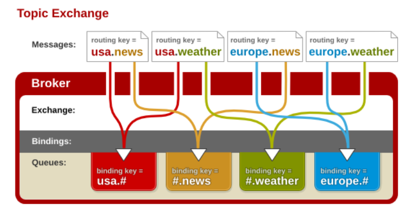
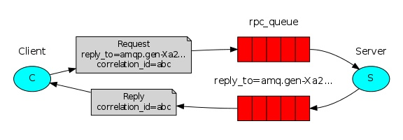

# **一 什么是**消息队列（MQ）

MQ全称为Message Queue 消息队列（MQ）是一种应用程序对应用程序的通信方法。MQ是消费-生产者模型的一个典型的代表，一端往消息队列中不断写入消息，而另一端则可以读取队列中的消息。这样发布者和使用者都不用知道对方的存在。

```
'''
生产者消费者模式是通过一个容器来解决生产者和消费者的强耦合问题。生产者和消费者彼此之间不直接通讯，而通过阻塞队列来进行通讯，
所以生产者生产完数据之后不用等待消费者处理，直接扔给阻塞队列，消费者不找生产者要数据，
而是直接从阻塞队列里取，阻塞队列就相当于一个缓冲区，平衡了生产者和消费者的处理能力。
'''
```

我们先不管消息(Message)这个词，来看看队列(Queue)。这一看，队列大家应该都熟悉吧。

>   队列是一种先进先出的数据结构。

什么是消息队列？

 消息队列可以简单理解为：把要传输的数据放在队列中。

什么是消息队列？

**二、为什么要用消息队列？**

消息队列中间件是分布式系统中重要的组件，主要解决应用解耦，异步消息，流量削锋等问题，实现高性能，高可用，可伸缩和最终一致性架构。目前使用较多的消息队列有ActiveMQ，RabbitMQ，ZeroMQ，Kafka，MetaMQ，RocketMQ。

接下来利用一个外卖系统的消息推送给大家解释下MQ的意义。


# 三 RabbitMQ

RabbitMQ 是一个由 Erlang 语言开发的 AMQP 的开源实现。

rabbitMQ是一款基于AMQP协议的消息中间件，它能够在应用之间提供可靠的消息传输。在易用性，扩展性，高可用性上表现优秀。使用消息中间件利于应用之间的解耦，生产者（客户端）无需知道消费者（服务端）的存在。而且两端可以使用不同的语言编写，大大提供了灵活性。


[中文文档](https://www.rabbitmq.com/tutorials/tutorial-one-python.html)

## 3.1 rabbitmq的安装

略

## 3.2 rabbitMQ工作模型

### 3.2.1 简单模式

```python
### 生产者


import pika

connection = pika.BlockingConnection(pika.ConnectionParameters('localhost'))
channel = connection.channel()

channel.queue_declare(queue='hello')

channel.basic_publish(exchange='',
                      routing_key='hello',
                      body='Hello World!')

print(" [x] Sent 'Hello World!'")

### 消费者

import pika

connection = pika.BlockingConnection(pika.ConnectionParameters('localhost'))
channel = connection.channel()

channel.queue_declare(queue='hello')

def callback(ch, method, properties, body):
    print(" [x] Received %r" % body)


channel.basic_consume(queue='hello',
                      auto_ack=True,
                      on_message_callback=callback)


print(' [*] Waiting for messages. To exit press CTRL+C')
channel.start_consuming()
```

### 3.2.2 参数

**应答参数**

```python
auto_ack=False
ch.basic_ack(delivery_tag=method.delivery_tag)
```

**持久化参数**

```python
#声明queue
channel.queue_declare(queue='hello2', durable=True)  # 若声明过，则换一个名字
 
channel.basic_publish(exchange='',
                      routing_key='hello2',
                      body='Hello World!',
                      properties=pika.BasicProperties(
                          delivery_mode=2,  # make message persistent
                          )
                      )
```

**分发参数**

有两个消费者同时监听一个的队列。其中一个线程sleep2秒，另一个消费者线程sleep1秒，但是处理的消息是一样多。这种方式叫轮询分发（round-robin）不管谁忙，都不会多给消息，总是你一个我一个。想要做到公平分发（fair dispatch），必须关闭自动应答ack，改成手动应答。使用basicQos(perfetch=1)限制每次只发送不超过1条消息到同一个消费者，消费者必须手动反馈告知队列，才会发送下一个。

```
channel.basic_qos(prefetch_count=1)

```

### 3.2.3 交换机模式（exchange）

#### **交换机之发布订阅**


发布订阅和简单的消息队列区别在于，发布订阅会将消息发送给所有的订阅者，而消息队列中的数据被消费一次便消失。所以，RabbitMQ实现发布和订阅时，会为每一个订阅者创建一个队列，而发布者发布消息时，会将消息放置在所有相关队列中。


```
# 生产者
import pika

connection = pika.BlockingConnection(pika.ConnectionParameters(
        host='localhost'))
channel = connection.channel()

channel.exchange_declare(exchange='logs',
                         exchange_type='fanout')

message = "info: Hello World!"
channel.basic_publish(exchange='logs',
                      routing_key='',
                      body=message)
print(" [x] Sent %r" % message)
connection.close()

# 消费者
import pika

connection = pika.BlockingConnection(pika.ConnectionParameters(host='localhost'))
channel = connection.channel()

channel.exchange_declare(exchange='logs',
                         exchange_type='fanout')

result = channel.queue_declare("",exclusive=True)
queue_name = result.method.queue

channel.queue_bind(exchange='logs',
                   queue=queue_name)

print(' [*] Waiting for logs. To exit press CTRL+C')

def callback(ch, method, properties, body):
    print(" [x] %r" % body)


channel.basic_consume(queue=queue_name,
                      auto_ack=True,
                      on_message_callback=callback)

channel.start_consuming()
```


#### **交换机之关键字**


```python
# 生产者
import pika

connection = pika.BlockingConnection(pika.ConnectionParameters(
        host='localhost'))
channel = connection.channel()

channel.exchange_declare(exchange='logs2',
                         exchange_type='direct')

message = "info: Hello Yuan!"
channel.basic_publish(exchange='logs2',
                      routing_key='info',
                      body=message)
print(" [x] Sent %r" % message)
connection.close()

# 消费者

import pika
import sys

connection = pika.BlockingConnection(pika.ConnectionParameters(
        host='localhost'))
channel = connection.channel()

channel.exchange_declare(exchange='logs2',
                         exchange_type='direct')

result = channel.queue_declare("",exclusive=True)
queue_name = result.method.queue


severities = sys.argv[1:]
if not severities:
    sys.stderr.write("Usage: %s [info] [warning] [error]\n" % sys.argv[0])
    sys.exit(1)

for severity in severities:
    channel.queue_bind(exchange='logs2',
                       queue=queue_name,
                       routing_key=severity)

print(' [*] Waiting for logs. To exit press CTRL+C')

def callback(ch, method, properties, body):
    print(" [x] %r" % body)


channel.basic_consume(queue=queue_name,
                      auto_ack=True,
                      on_message_callback=callback)

channel.start_consuming()
```


#### **交换机之通配符**

通配符交换机”与之前的路由模式相比，它将信息的传输类型的key更加细化，以“key1.key2.keyN....”的模式来指定信息传输的key的大类型和大类型下面的小类型，让消费者可以更加精细的确认自己想要获取的信息类型。而在消费者一段，不用精确的指定具体到哪一个大类型下的小类型的key，而是可以使用类似正则表达式(但与正则表达式规则完全不同)的通配符在指定一定范围或符合某一个字符串匹配规则的key，来获取想要的信息。

“通配符交换机”（Topic Exchange）将路由键和某模式进行匹配。此时队列需要绑定在一个模式上。符号“#”匹配一个或多个词，符号“*”仅匹配一个词。因此“audit.#”能够匹配到“audit.irs.corporate”，但是“audit.*”只会匹配到“audit.irs”。（这里与我们一般的正则表达式的“*”和“#”刚好相反，这里我们需要注意一下。）
下面是一个解释通配符模式交换机工作的一个样例

上面的交换机制类似于一个国际新闻讯息网站的机制。


```python
# 生产者
import pika

connection = pika.BlockingConnection(pika.ConnectionParameters(
        host='localhost'))
channel = connection.channel()

channel.exchange_declare(exchange='logs3',
                         exchange_type='topic')

message = "info: Hello ERU!"
channel.basic_publish(exchange='logs3',
                      routing_key='europe.weather',
                      body=message)
print(" [x] Sent %r" % message)
connection.close()

# 消费者

import pika
import sys

connection = pika.BlockingConnection(pika.ConnectionParameters(
        host='localhost'))
channel = connection.channel()

channel.exchange_declare(exchange='logs3',
                         exchange_type='topic')

result = channel.queue_declare("",exclusive=True)
queue_name = result.method.queue


channel.queue_bind(exchange='logs3',
                   queue=queue_name,
                   routing_key="#.news")

print(' [*] Waiting for logs. To exit press CTRL+C')

def callback(ch, method, properties, body):
    print(" [x] %r" % body)


channel.basic_consume(queue=queue_name,
                      auto_ack=True,
                      on_message_callback=callback)

channel.start_consuming()
```


# 四 基于rabbitmq的RPC实现

## 4.1、关于RPC

[RPC博客](https://www.cnblogs.com/pyedu/p/12196027.html)

## 4.2、**rpc的实现**

****

 

 

如图我们可以看出生产端client向消费端server请求处理数据，他会经历如下几次来完成交互。

-   **1**.生产端 生成rpc_queue队列，这个队列负责帮消费者 接收数据并把消息发给消费端。

-   **2**.生产端 生成另外一个随机队列，这个队列是发给消费端，消费这个用这个队列把处理好的数据发送给生产端。

-   **3**.生产端 生成一组唯一字符串UUID，发送给消费者，消费者会把这串字符作为验证在发给生产者。

-   **4**.当消费端处理完数据，发给生产端，时会把处理数据与UUID一起通过随机生产的队列发回给生产端。

-   **5**.生产端，会使用while循环 不断检测是否有数据，并以这种形式来实现阻塞等待数据，来监听消费端。

-   **6**.生产端获取数据调用回调函数，回调函数判断本机的UUID与消费端发回UID是否匹配，由于消费端，可能有多个，且处理时间不等所以需要判断，判断成功赋值数据，while循环就会捕获到，完成交互。

#### **client**


```
import pika
import uuid
import time

# 斐波那契数列 前两个数相加依次排列
class FibonacciRpcClient(object):
    def __init__(self):
        # 赋值变量，一个循环值
        self.response = None
        # 链接远程
        self.connection = pika.BlockingConnection(pika.ConnectionParameters(
                host='localhost'))
        self.channel = self.connection.channel()

        # 生成随机queue
        result = self.channel.queue_declare("",exclusive=True)
        # 随机取queue名字，发给消费端
        self.callback_queue = result.method.queue

        # self.on_response 回调函数:只要收到消息就调用这个函数。
        # 声明收到消息后就 收queue=self.callback_queue内的消息


        self.channel.basic_consume(queue=self.callback_queue,
                                   auto_ack=True,
                              on_message_callback=self.on_response)

    # 收到消息就调用
    # ch 管道内存对象地址
    # method 消息发给哪个queue
    # body数据对象
    def on_response(self, ch, method, props, body):
        # 判断本机生成的ID 与 生产端发过来的ID是否相等
        if self.corr_id == props.correlation_id:
            # 将body值 赋值给self.response
            self.response = body

    def call(self, n):


        #　随机一次唯一的字符串
        self.corr_id = str(uuid.uuid4())

        # routing_key='rpc_queue' 发一个消息到rpc_queue内
        self.channel.basic_publish(exchange='',
                                   routing_key='rpc_queue',
                                   properties=pika.BasicProperties(

                                         # 执行命令之后结果返回给self.callaback_queue这个队列中
                                         reply_to = self.callback_queue,
                                         # 生成UUID 发送给消费端
                                         correlation_id = self.corr_id,
                                         ),
                                   # 发的消息，必须传入字符串，不能传数字
                                   body=str(n))
        # 没有数据就循环收
        while self.response is None:
            # 非阻塞版的start_consuming()
            # 没有消息不阻塞
            self.connection.process_data_events()
            print("no msg...")
            time.sleep(0.5)
        return int(self.response)

#　实例化
fibonacci_rpc = FibonacciRpcClient()


response = fibonacci_rpc.call(50)
print(" [.] Got %r" % response)
```


#### server


```
#_*_coding:utf-8_*_
import pika
import time
# 链接socket
connection = pika.BlockingConnection(pika.ConnectionParameters(
        host='localhost'))
channel = connection.channel()

# 生成rpc queue
channel.queue_declare(queue='rpc_queue')

#　斐波那契数列
def fib(n):
    if n == 0:
        return 0
    elif n == 1:
        return 1
    else:
        return fib(n-1) + fib(n-2)


# 收到消息就调用
# ch 管道内存对象地址
# method 消息发给哪个queue
# props 返回给消费的返回参数
# body数据对象
def on_request(ch, method, props, body):
    n = int(body)

    print(" [.] fib(%s)" % n)
    # 调用斐波那契函数 传入结果
    response = fib(n)

    ch.basic_publish(exchange='',
                     # 生产端随机生成的queue
                     routing_key=props.reply_to,
                     # 获取UUID唯一 字符串数值
                     properties=pika.BasicProperties(correlation_id = \
                                                   props.correlation_id),
                     # 消息返回给生产端
                     body=str(response))
    # 确保任务完成
    # ch.basic_ack(delivery_tag = method.delivery_tag)

# rpc_queue收到消息:调用on_request回调函数
# queue='rpc_queue'从rpc内收
channel.basic_consume(queue="rpc_queue",
                      auto_ack=True,
                      on_message_callback=on_request)
print(" [x] Awaiting RPC requests")
channel.start_consuming()
```


 