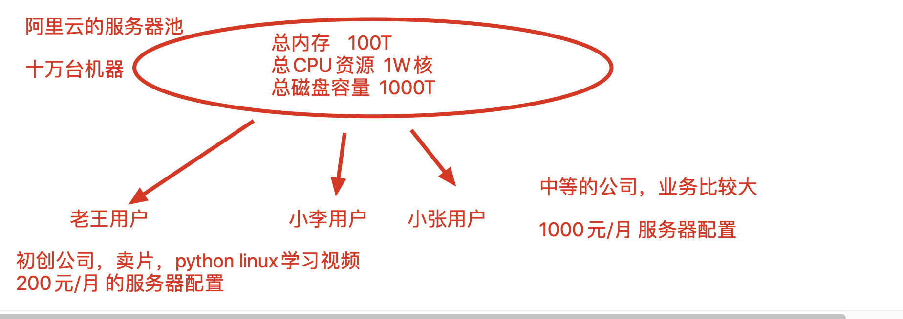
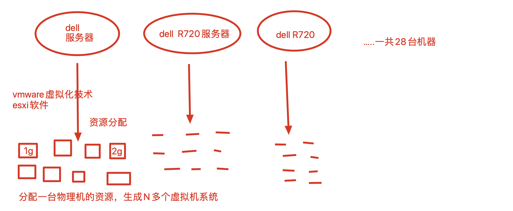
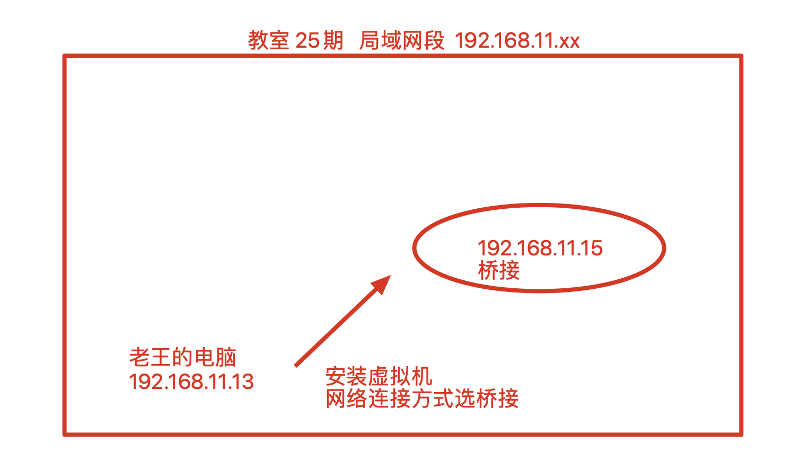
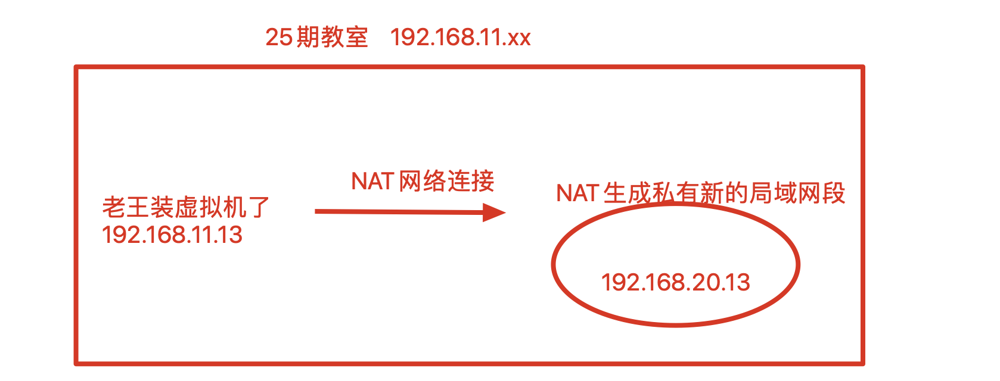
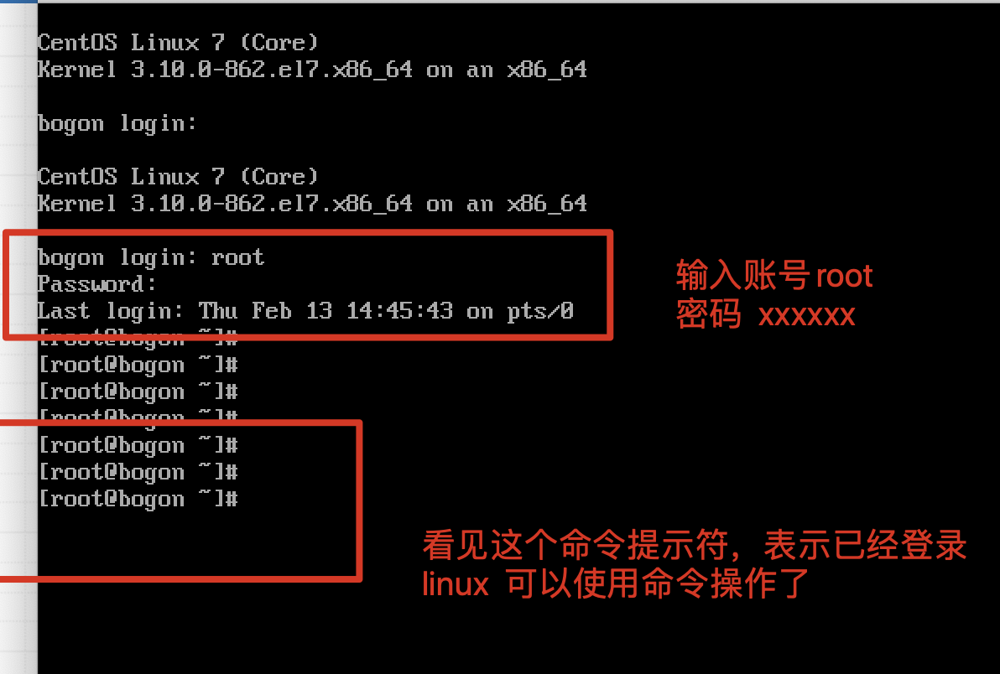
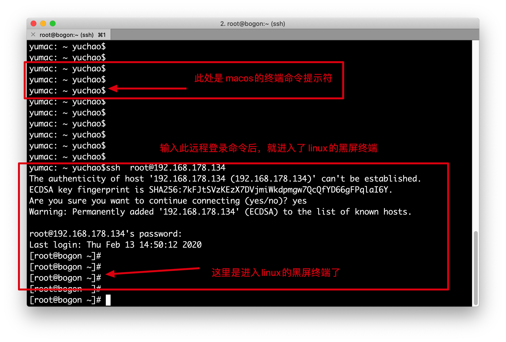
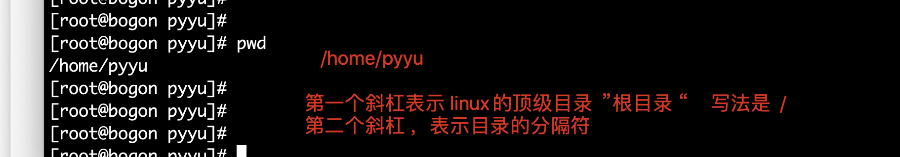
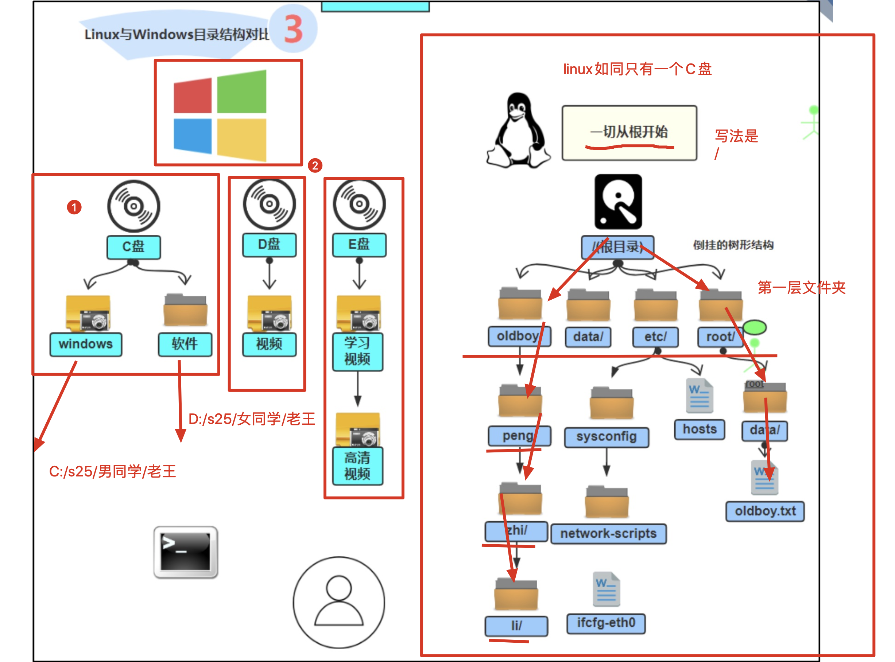

测试工程师（小姑娘），找出程序bug的人，和开发相爱相杀

- 找出一个bug，+100元，开发-100元
- 功能测试，页面点点点
- 自动化测试，测试技能+python脚本

- 运维工程师，背锅侠，服务器有任何问题，找运维
  - 运维开发，linux技能+python开发，写一个运维平台（CMDB管理服务器资产的平台）
- UI设计（小姐姐）
- 安全，系统安全，网络安全
- 实施工程师，技术支持的，（suse德国linux系统，人天服务，8k/月打折，浦发银行，上海交行，移动，电信，一个运维去现场维护一天，9k/天）
- 前端小姐姐(nodejs 服务端开发)
- DBA，数据库管理员，专业维护mysql，oracle的
- 后端开发大神（python开发）
  - Crm 后台开发 ,面向的用户是什么样的群体？,企业内部，面对员工的（管理员工数据的平台）
- 爬虫开发（python）
- IDC运维（专门在机房，照顾服务器的）
- helpdesk(桌面运维，专业维护公司IT资产，打印机，笔记本维修，重装系统，装驱动)


对于初创型的小公司，陌陌公司刚起步，交友，用户量很少，网站并发数也很低

开发架构不能太复杂，必须招来一个专业的运维，并且可能会影响开发进度，开发难度 

选择网站的黄金架构LNMP

（Linux+Nginx+Mysql+PHP/Perl/Python）

### Linux运维人员的核心职责

- 网站数据不能丢，学习mysql的主从复制，MHA高可用容灾技术

  - Redis（缓存性数据库，新浪的微博评论，点赞，都存储在redis中）
  - redis内存性数据库，断电丢失，重启进程数据丢失
    - redis的主从复制（一主一备用服务器）
    - redis数据持久化来做(将内存数据库写入到磁盘上)
    - redis哨兵（等待后续揭晓..）

- 网站7*24小时运转

  - 搭建监控系统，开发监控平台
  - 出了问题，立即打电话，发邮件，发微信，告诉运维，起来修电脑！

- 提升用户体验，访问速度要快

  - 运维对于网站架构的优化

    

windows,mysql(突然嗝屁)

## Linux就是一个操作系统而已

centos系统，您真硬核呀...

ubunt系统

你又一个window电脑，让你再安装一个操作系统去学习，你会用什么安装方案？

- 虚拟机（非常好用）
  - 
- 双系统（windows+linxu）
- 干掉windows，单独安装linux（支持图形化）


1.买一台硬件服务器，必须得有一个机器

（开发你得考虑，程序在机器上运行，消耗的内存，cpu等资源，IO吞吐量是否正常）

2.在这个机器上安装操作系统


告诉我，你的笔记本外观有什么？

- 屏幕，显示屏，输出设备
- 键盘，输入设备，用于数据输入的
- 触摸板，输入设备
- 各种借口，电源接口，USB借口
- touch bar，使用的mac触摸屏
- 光驱，安装操作系统，读取DVD资料的
- 摄像头
- 音箱

笔记本的内部有什么？（对于系统速度的提升，优化都是扯淡，花钱就能解决所有的问题，先从硬件角度考虑）

- 硬盘，数据存储的，（SATA类型的机械硬盘，和SSD固态硬盘，对于数据的IO，哪个快？SSD胜出）
- 主板，将各种硬件设备，组装在一起的，以及BIOS主板系统的安装
- 内存条


一个纯python后台的应用，odoo，写的一平台，性能测试预计有5W的并发

由于新业务来到，并发超过5W了，后台吃撑不住了，出现大量的500报错

单纯的用uwsgi+odoo，运行的后台

- 在网站前面挂一个中间层，nginx（负载均衡，动静态请求分发，支持大并发的一个软件）

- 服务器内存使用量以及达到  80%以上

  - 扩大服务器内存16*2=32GB ，网站处理后台，立马正常了

  - 为什么资源消耗这么多？

    - 内存泄漏，with open 自动关闭文件句柄 ，释放内存

    - 用户请求- >  后台 -> 人脸识别登录功能，数据发给了百度的API -> 后台响应，识别是否通过 

    - 照片数据放在一个变量当中

    - 在代码的结尾，没有人在使用这个变量了，

    - pic=' '  将变量等于了一个空字符串 ，内存泄漏立马被解决了，照片数据被python自动gc回收了

      


常见的状态码，status code有哪些

- 404   40x系列，客户端的请求报错，请求的url可能不存在，或者过期了
- 302  30x系列，客户端的请求重定向，www.pythonav.cn 更换域名了，跳转到新域名www.pythonav.com
  - 浏览器的URL是会发生变化的
- 503 50x 系列，指的是服务端代码出错，服务端处理请求出问题了
- 200  20x系列，请求正确的被响应了
- 100 100x


## 服务器

服务器是在网络中对外提供服务的，一个超强性能的计算机（更稳定，更安全，安装linux系统）

区别在于数据的安全性。


## 云计算的概念

1.你们家中所用的水资源、电力资源，煤气资源，从哪来的?

我们百姓都是花钱，从水厂，电厂，煤气厂，按量购买的资源 

水厂、电厂等，将所有的水利资源，电力资源，集中到了一起，进行按量贩卖


计算机角度：

阿里，腾讯，华为等公司，购买了大量的实体服务器，组成了一个超大的计算机资源池，然后按量贩卖

在阿里云的后台，50元/月 购买  1G1核  50G磁盘的服务器 




对于初创型公司（路飞学城）：

8台阿里云

本金比较少，购买云服务器即可，（数据并不安全，你的数据都掌握在别人的手里）


对于中等规模公司，马蜂窝，知乎等：

购买自己的硬件服务器（服务器价格也不低），需要运行在零度、无尘、无湿度的一个环境（防止服务器发热，防止短路，静电）

中等公司会把自己的服务器，托管在一个专业的机房中心（世纪互联，有自己的园区，专门打造服务器运行环境的）外面的公司，就得花钱租赁机器托管的位置


大型公司，BAT，苹果公司，特别有钱

云上贵州，买了一块地，打造了一个数据中心(苹果公司的服务器都在这了)


uptime命令 ，检查服务器运行了多久 ，3700 days 

```
一个公司的技术栈架构

外企，500强的外企

收费版的技术栈：
java +  oralce + jquery +  svn + mencached + redhat(收费版的linux，考rhce rhca资格证书)

省钱的技术栈，开源的技术栈:
java + python + jquery  + git + redis  + centos (免费版的redhat)

服务器环境是 
dell 28台硬件服务器，dell poweredger  R720型号 
通过vmware  esxi虚拟化技术，创建出了260+个数的linux系统 


windows  +  vmware  workstation(个人学习版，性能较弱，N多个虚拟机)
```




云服务器(阿里云，腾讯云)

自然灾害，云服务器

物理服务器（自己购买一台实体的计算机，安装linux系统）

## 机房托管

服务器是按照厚度收管理费的，机器厚度 以U为单位 


知道什么是服务器之后，就得开始学习什么是Linux了


## 走进Linux的大门

机器就是一堆冷冰冰的硬件

需要安装操作系统之后，才有灵魂

python操作linux的模块是什么？

os模块

subprocess 

## shell壳的作用

老王学习python，在cmd里面写入了一段代码  print("隔壁的小孩长得越来越像我...")

↓

交给python翻译官 

解释成机器码

↓

机器认识这一段话的作用，开始执行，然后 输出给用户


-----

用户在命令行敲下 ls  cd   mkdir  这些linux的命令，计算机也是不认识的

↓

shell(linux下的bash脚本语言的解释器，翻译官)

↓

翻译给机器，去执行


## 开源的意义

闭源的缺点

1.危险性

王小贝开发出了一个crm系统，收费的闭源软件，卖给我用，50元/月 

长久的人天服务，持续的要对这个项目进行优化

小贝在源码中嵌入了time.sleep(2.8)

可能在源码中，嵌入恶意代码，远程发送给他自己的机器  


2.如果小贝突然不做程序了 ，crm没人可维护了，我是不是可能会造成重大损失。。


开源特点

1.透明性 ，你在github下载django源代码 ，全世界那么多人都在用，能够发现更多的问题

2.开源程序，是由诸多程序员共同维护 

3.程序的优质性更高 

Linus  是坐着的姓名，这人不单开发了操作系统，git也是他开发的

linux 是系统的名字

## linux发行版介绍

发行版是什么意思？

手机，就是一个名词

各个厂家，针对手机做了定制，开发出了 华为手机，苹果手机，oppo手机


linux也是一个操作系统的吗名词，

各家公司针对linux源码做了一些定时，开发出了不同版本的linux系统


1.redhat红帽子系统，收费，全世界用的最多的系统

2.centos,全世界用的第二多的服务端操作系统，和redhat用法一模一样，名字不一样而已，免费

3.ubuntu用在个人电脑，开发环境使用，以及物联网领域

4.suse，德国linux，数据安全性很强

## 学习安装linux系统

1.准备好vmware软件，根据博客，或是视频学习安装流程


【网络连接方式】

桥接 ，好比所有人都在25期教室，公用这个教室的局域网段  192.168.11.0~192.168.11.255 

教室内有60个同学，插上了网线，所有人都是 192.168.11.x 系列的ip，自动分配一个

虚拟机选择桥接之后，就好比教室又来了一个同学，插上线了网线，公用宿主机网段的ip



60个人都装了一个虚拟机，用的是桥接  60*3 =180 个

都选择桥接，可能会遇见什么问题，就是ip不够用了，可能会造成ip冲突

虚拟机选择桥接，可以在局域网内的其他同学通信

【NAT】

网络地址转换，基于你宿主机的网卡，在机器内部生成一个私有的局域网



虚拟机选择NAT的话，只能和自己的私有局域网段通信了，以及和宿主机通信，和教室内的其他同学，就无法通信了

【仅主机模式】

单机模式，虚拟机只能和宿主机通信，没什么用

## 图形化软件界面

图形化是linux安装了名为 gnonne的软件

进入到linux界面后，可以输入 ifconfig命令查看网络ip地址

```
1.登录系统后，需要切换root超级用户，否则权限很低
su  -  root  #需要输入root密码 

如果不能用，输入， 
yum install  net-tools -y  #安装软件包 net-tools  

2.此时你应该就可以输入ifconfig命令了
```

##切换图形化和纯黑屏的命令

```
ctrl  + alt + f1~f7   代表linux默认的7个终端

f1 是图形化 其他是纯黑屏 

这些我们几乎用不上，我们都是用远程连接的方式操作
```



## 远程连接linux

对于服务器而言，我们不会直接去触碰机器，而是通过网络连接

```
1.确保你的服务器，正确的获取到了ip地址
ifconfig #查看到讲师的机器ip是  192.168.178.134

2.安装远程连接工具 
windows点的同学，安装xshell 或者 secureCRT  或者
这2个软件其实也就是封装了  ssh命令而已

用macos的同学，直接使用ssh命令即可
ssh root@192.168.178.134  


```





ip地址，标识了计算机在网络中的地址信息


123.206.16.61  这是一个公网的ip地址段，全世界都可以访问的


192.168.178.134  这是一个局域网的地址段，只有局域网内可以访问 


127.0.0.1  ，本地回环地址，用于测试机器内部间通信的一个ip，只能自己和自己玩的地址

 django程序启动在  127.0.0.1:8000  


0.0.0.0  这个地址，表示注册绑定一台机器，所有的ip地址 


由于一台服务器可能存在多个网卡，比如

linux机器 的2个ip

网卡1：192.168.178.134

网卡2：193.168.178.140   

此时我启动django，   python3  manage.py runserver  

默认启动在 127.0.0.1:8000  windows机器能访问到吗？  答案是不能

----

那我启动在    python3  manage.py runserver    192.168.178.134:8000 

 windows怎么访问？直接访问192.168.178.134:8000地址即可

这样启动，192.168.178.140用户就无法访问到django了

---

所以在服务器上启动项目，一般都直接使用0.0.0.0地址，能够同时注册在

网卡1：192.168.178.134

网卡2：193.168.178.140  

这2个ip上，

如此启动*python3 manage.py runserver 0.0.0.0:8000*

用户访问 192.168.178.134:8000

或者

193.168.178.140:8000 都可以了


port端口的概念，常见端口是？

一个端口对应一个服务

8080 ------自定义用的端口

3306--- mysql默认端口

80  --- http默认端口

443  ---https默认端口

6379 --- redis默认端口

22  -----  用于远程连接服务器用的端口 22


```
服务器端口 ----------银行的窗口

银行的 1号窗口---取钱
2号窗口----办理贷款
3号窗口---存款


```


## linux命令提示符

linux命令语法如下


```
 [root@bogon ~]# ls  /tmp  #这个命令表示，我要查看  /tmp 这个目录下的内容 

#第二个简单的命令

#rm 命令      -f  参数（强制性删除）     /tmp/oldboy.txt  
rm -f   /tmp/oldboy.txt  

```

简单的命令 敲打

```
[root@bogon ~]# cd       /home   #目录切换，切换到 /home文件夹下 
[root@bogon home]#pwd   #我在哪 ，能够输出当前所在的绝对路径 
[root@bogon home]# pwd
/home
[root@bogon home]# whoami  #我是谁 
root

[root@bogon pyyu]# pwd  
/home/pyyu  #linux的路径写法，如此
```


## linux的文件系统 目录结构





windows的目录

```
windows的目录结构，是反斜杠的目录分隔符
是 
C:\
D:\
E:\

这种多个盘符的形式，可能存在多个目录顶点
```

linux的目录

```
只有一个 根目录  

/

例如 
/home   # 根目录下有一个home文件夹
/s25    #根目录下有一个s25文件夹

#根目录下有2个同级的文件夹，男同学和女同学
/s25/男同学/小明.txt
/s25/女同学   


```


## 文件目录增删改查操作

linux命令的语法

```
命令   可选参数     你要操作的对象
```


修改linux支持文件的命令

```
export LC_ALL=zh_CN.UTF-8   #设置linux一个全局的中文变量
```


增

```
1.创建一个普通文本文件 语法是 touch    文件名 
[root@bogon tmp]# touch     music.txt

2.创建一个隐藏的文件，创建一个隐藏的 singer.txt
touch    .singer.txt   #创建隐藏文件 

3.创建一个文件夹，名字叫做s25
[root@bogon tmp]# mkdir     s25

4.创建一个递归的文件夹，如 /s25/男同学    /s25/女同学 
mkdir  -p   /s25/男同学     /s25/女同学    # -p参数是 创建文件夹及其父文件夹

5.创建一个递归的文件夹 ，如 /s25new/男同学   /s25new/女同学
mkdir  -p   /s25new/{男同学,女同学}  #创建一个/s25文件夹，且创建2个平级的文件夹


```

删

```
rm命令，是remove的缩写，删除文件或是文件夹
#语法是 
rm     文件/文件夹  #删除文件/文件夹 

比如 
rm    test.txt #删除文件，默认有让用户确认删除的提示
rm  -f  test.txt  #强制删除文件，不需要提示确认
rm  -r   文件夹名  #递归删除文件夹，及其内部的文件

#提问，如何强制性删除 文件夹 ，以及其内部的资料

#这是一个危险的命令！！！！请理解后慎用！！！
#这是一个危险的命令！！！！请理解后慎用！！！
#这是一个危险的命令！！！！请理解后慎用！！！

rm   -rf   /*   #叫做删库到跑路，准备被打死吧。。。。万万不得敲。。。。
rm   -rf   /*   #叫做删库到跑路，准备被打死吧。。。。万万不得敲。。。。

rm    -rf   ./*  #强制性删除当前目录下的所有内容 

```

改

```
cd  /home   #切换到 /home目录下
ls  .   #查看相对的home目录下有什么内容

```

查

```
#查询当前目录下的内容   ls命令 
ls命令，就是list的缩写 
[root@bogon /]# ls   .
bin   dev  home  lib64  mnt  proc  run   srv  tmp  var
boot  etc  lib   media  opt  root  sbin  sys  usr


#查看文件夹中所有内容，以及隐藏的文件，在linux下，以.开头的文件，是隐藏的，默认直接看不到
[root@bogon tmp]# ls   -a  firefox_pyyu/   
```


### 几个特殊的目录

````
.   代表当前的目录     

..  代表上一级的目录     #比如  cd ..  进入上一级目录 

~    代表当前登录用户的家目录，root用户就是/root   pyyu用户就是 /home/pyyu 

-    代表上一次的工作目录  

````

## 绝对路径，相对路径

```
绝对路径：只要是从根目录开始的写法，就是绝对路径

相对路径：非从根目录开始的写法，就是相对路径

#在/home目录下创建 s25文件夹，绝对，相对路径的写法

1.相对路径，以你当前的位置为相对，创建
比如我此时在 /tmp目录下，我的上一级就是  /  ，因此可以这么写
[root@bogon tmp]# mkdir     ../home/s25

2.绝对路径的写法，一般是绝不会错的，无需考虑你当前所在的位置，直接敲绝对路径即可
 mkdir    /home/s25

```


