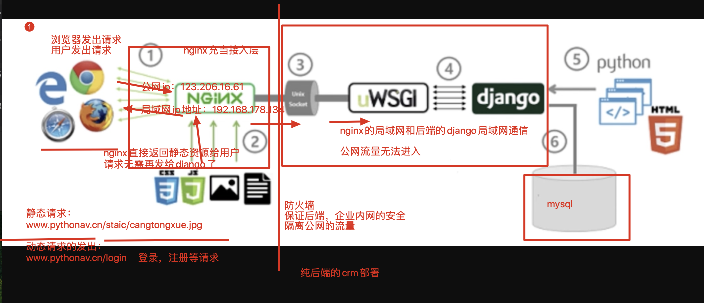
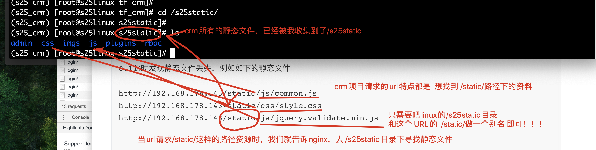
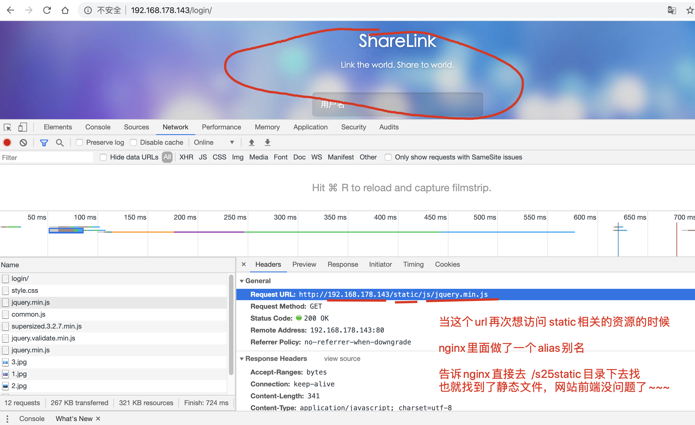
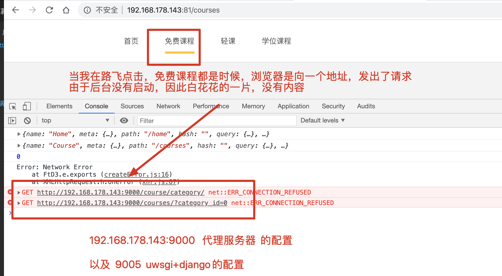
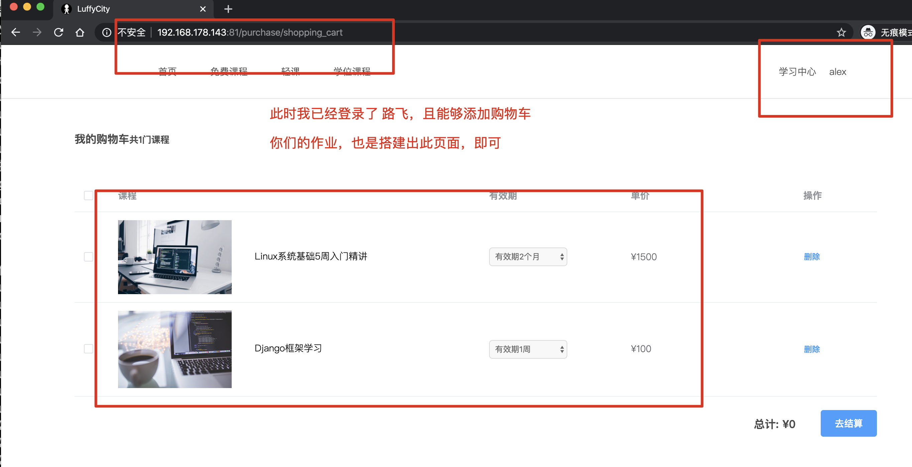

## 今日内容

对于python web后端而言，linux学习阶段，部署是最锻炼你操作，以及对linux系统的熟悉程度的

###crm纯后端部署 

supervisor+nginx+uwsgi+django+virtualenv+mariadb

#### crm部署流程笔记

```
crm是通过模板语言进行和前端通信的 ，前端代码写在后端中
{{static.el}}
```




```
如何停止supervisor以及uwsgi
1.必须得先停止supervisor才可以停止uwsgi
pkill -9 supervisor

2.杀死uwsgi
pkill -9 uwsgi


kill命令，是基于pid杀死进程，如 kill  5888

pkill命令， 是基于进程的名字 杀死进程    pkill uwsgi  
```


crm部署的史上最详细的流程部署笔记

```
#先从后端搞起  uwsgi+crm进行项目运行
老师电脑的环境变量
PATH="/opt/python369/bin:/opt/tngx232/sbin:/usr/local/sbin:/usr/local/bin:/usr/sbin:/usr/bin:"


1.先创建虚拟环境，用于运行crm
(s25_crm) [root@s25linux s25crm]#

2.上传代码到linux中，调试项目是否能够运行
pip3 install -i https://pypi.douban.com/simple django==1.11.25
pip3 install -i https://pypi.douban.com/simple pymysql
pip3 install -i https://pypi.douban.com/simple django-multiselectfield

3.在调试好crm的模块依赖，以及mariadb数据库的安装，以及数据导入之后（数据导入出错了，基本事sql文件的问题，单独找我）,crm调试可以正确运行了

4.在线上，是使用uwsgi结合uwsgi.ini配置文件，启动crm的，因此 ，启动方式如下
pip3 install -i https://pypi.douban.com/simple  uwsgi  #安装uwsgi

#今日的线上部署，uwsgi.ini需要修改的地方是，添加如下参数，关闭http参数
#今日的线上部署，uwsgi.ini需要修改的地方是，添加如下参数，关闭http参数
#今日的线上部署，uwsgi.ini需要修改的地方是，添加如下参数，关闭http参数

        # 这里的socket参数，是用于和nginx结合部署的unix-socket参数，这里临时先暂
        停使用
        # 使用此协议运行后台，就无法通过浏览器访问了，协议不一样
        socket          = 0.0.0.0:8000
        #  线上不会用http参数，因为对后端是不安全的，使用socket参数是安全的连接>，用nginx反向代理去访问
        # 后端程序是运行在防火墙内部，外网是无法直接访问的
        # 临时使用http参数，便于我们用浏览器调试访问
        #http =  0.0.0.0:8000

5.使用supervisor启动uwsgi进程，需要修改supervisord.conf配置文件了，看好文件的名字！！！！

vim /etc/supervisord.conf #修改如下参数
[program:again_s25crm]
command=/s25crm/s25_crm/bin/uwsgi --ini  /s25crm/tf_crm/uwsgi.ini
autostart=true       ; 在supervisord启动的时候也自动启动
startsecs=10         ; 启动10秒后没有异常退出，就表示进程正常启动了，默认为1秒
autorestart=true     ; 程序退出后自动重启,可选值：[unexpected,true,false]，默认为unexpected，表示进程意外杀死后才重启
stopasgroup=true     ;默认为false,进程被杀死时，是否向这个进程组发送stop信号，包括子进程
killasgroup=true     ;默认为false，向进程组发送kill信号，包括子进程

6.检查后台的状态，以及启动命令

【但凡supervisor这里无法正常启动，立即去检查 supervisord.conf里面定义的任务参数是否正确】

(s25_crm) [root@s25linux tf_crm]# supervisord -c /etc/supervisord.conf
Unlinking stale socket /tmp/supervisor.sock

(s25_crm) [root@s25linux tf_crm]# supervisorctl -c /etc/supervisord.conf
again_s25crm                     STARTING
supervisor>
supervisor>
supervisor> status
again_s25crm                     STARTING
supervisor> status
again_s25crm                     RUNNING   pid 64285, uptime 0:00:13

7.此时配置好nginx.conf就完事了，修改如下，配置nginx，请求转发给后台即可
    server {
        listen       80;
        server_name  localhost;
        #这是一个局部的变量，只对当前这个server{}代码块生效，编码设置为utf-8

        charset utf-8;
        error_page  404  /40x.html;
        # 这里的locaiton 路径匹配，如果你写的是root参数，就是一个web站点功能
        # 基于uwsgi协议的一个高性能的反向代理转发，新的参数
        location / {
        #当请求发送给  192.168.178.140:80的时候
        #通过uwsgi_pass把请求转发给后端的uwsgi服务器
        uwsgi_pass   0.0.0.0:8000;
        #这个参数，是固定的，是添加一些转发请求头内容
        include uwsgi_params;
        }

}

8.重启nginx
nginx -s reload


8.1  此时发现静态文件丢失，例如如下的静态文件

http://192.168.178.143/static/js/common.js
http://192.168.178.143/static/css/style.css
http://192.168.178.143/static/js/jquery.validate.min.js


9.还得配置nginx接收所有的django静态文件，修改命令如下
第一步：修改django的配置文件，收集所有的静态文件，放入一个统一管理的目录
vim settings.py  #添加如下内容
STATIC_ROOT='/s25static/'   #作用是定义一个统一管理的目录，收集所有crm的静态文件

第二步：用命令收集静态文件
python3 manage.py collectstiac

10.通过nginx去找到如下的静态文件即可
# 修改nginx.conf配置 location 同级添加一个 
location /static {
alias /s25static/;
}
---------------
nginx -s reload  


```


nginx找到crm的静态文件原理图



### 今天的第一大任务

- 使用supervisor启动crm，uwsgi+django
- 用nginx反向代理请求给crm，并且处理好静态文件，能够登录项目检查数据，完成如下页面
- 


### 路飞前后端分离部署

vue+nginx+uwsgi+django+mariadb+redis

```
vue打包之后，生成了dist静态文件夹 ，前端的静态文件，都在这里了，静态文件，都是丢给nginx直接去返回即可

vue的dist静态文件，运行之后，能够立即看到路飞的首页内容了，此时还没有和后端的数据交互


当你在前端的单页面应用中，点击课程列表，向后台发送 ajax请求，提交post

vue请求课程列表的post请求，应该是发给谁去处理的？   答案是 DRF后台去处理的

注意在线上部署的架构图流程中，，django后台，是躲在了防火墙之后的，只能通过nginx反向代理去访问...


```

路飞前后端分离部署的 示意图，需要理解下


###前后端分离部署的详细笔记流程

从前端搞起？还是后端搞起？

#### 从前端搞起

我是在配置node的环境，用于 npm run build  对前端的vue代码，进行打包，这个还记得吗？？

```
1.获取前端vue的项目代码
(s25_crm) [root@s25linux s25luffy]# wget https://files.cnblogs.com/files/pyyu/07-luffy_project_01.zip

2.解压缩代码，进行编译打包vue的代码，注意要配置nodejs环境
unzip 07-luffy_project_01.zip

3.配置nodejs环境，下载nodejs源码包
这里特殊的是，老师给的这个地址，是node的二进制源码包，是已经编译完成了的node解释器
直接解压缩，配置PATH即可，无需再编译了
wget https://nodejs.org/download/release/v8.6.0/node-v8.6.0-linux-x64.tar.gz
tar -zxvf  node-v8.6.0-linux-x64.tar.gz

添加node的环境变量，如下
vim /etc/profile 
PATH="/opt/python369/bin:/opt/tngx232/sbin:/usr/local/sbin:/usr/local/bin:/usr/sbin:/usr/bin:/s25luffy/node-v8.6.0-linux-x64/bin"

4.重新读取/etc/profile，加载node的环境，查看是否正常
source /etc/profile 
[root@s25linux ~]# node -v
v8.6.0
[root@s25linux ~]# npm -v
5.3.0

5.进入vue的代码目录下，修改数据提交地址，这一步非常重要!!!!!!!!!
// 这里是 vue页面运行之后，出发js的数据提交动作，向某个地址，发出了请求，这个地址对吗？？？
// 为什么不对呢？是因为，vue向当前机器的本地，去发送请求了，是错的！！！！
// 应该向后台服务器 去发送请求！！！
// 那么，我应该发给谁呢？？？
// 我应该 发给  刚才和大家聊的  9000端口，还是  9005端口呢？？
// 没问题，这里的数据提交地址，应该发给 代理服务器，也就是  9000端口，然后再通过9000端口，转发给uwsgi，也就是9005端口

批量修改的命令如下
sed命令，是用于文本内容处理的 强大命令，可以直接替换文件中的内容
比如notapad++的全局替换 功能

#sed命令   -i参数 是 把替换结果写入到文件
#  's/127.0.0.1:8000/192.168.178.143:9000/g'     
#  s是替换指令  /你要替换的内容/替换之后的内容/    g  是 全局替换，global的意思

[root@s25linux 07-luffy_project_01]# sed   -i  's/127.0.0.1:8000/192.168.178.143:9000/g'  src/restful/api.js

6.明确vue的数据提交地址，正确修改之后，开始安装node的依赖

就好比 python项目要运行，需要安装pip3模块一样
node项目要运行，也需要npm install  package.json  #安装模块呀。。。。
#我敲打的这个命令，是更换npm的源的含义，加速下载
#  --registry https://registry.npm.taobao.org 这是临时更换淘宝源的含义。。。
#   结尾什么都不跟上，默认是安装当前路径的 package.json文件

[root@s25linux 07-luffy_project_01]# npm --registry https://registry.npm.taobao.org install

7.安装完node的模块之后，开始编译vue
npm run build 

8.此时应该会生成了dist文件夹，直接丢给nginx去返回页面即可，由于学习阶段，80端口已经给crm项目用了，因此路飞换成81端口 

9.修改nginx.conf，添加一个server{}虚拟主机，返回路飞的页面

vim nginx.conf 

#添加第二个虚拟主机 ，给路飞使用
server {
listen 81;
server_name  _;
location  /  {
#直接返回vue的打包内容即可
root   /s25luffy/07-luffy_project_01/dist;
index  index.html;
}
```

看到路飞首页内容如下


路飞的前端配置结束，马上配置后端


### 路飞DRF后端部署笔记



```
1.获取drf项目代码，本地上传，git克隆
wget  https://files.cnblogs.com/files/pyyu/luffy_boy.zip

2.解压缩项目代码，之后，安装依赖，使用虚拟环境管理不同的项目
virtualenv --python=python3  s25_luffy
[root@s25linux luffy_boy]# source s25_luffy/bin/activate
(s25_luffy) [root@s25linux luffy_boy]#

3.解决路飞后台代码，所需的依赖，下载requirements.txt文件即可
(s25_luffy) [root@s25linux luffy_boy]# cat requirements.txt

certifi==2018.11.29
chardet==3.0.4
crypto==1.4.1
Django==2.1.4
django-redis==4.10.0
django-rest-framework==0.1.0
djangorestframework==3.9.0
idna==2.8
Naked==0.1.31
pycrypto==2.6.1
pytz==2018.7
PyYAML==3.13
redis==3.0.1
requests==2.21.0
shellescape==3.4.1
urllib3==1.24.1
uWSGI==2.0.17.1


4.安装路飞的依赖文件
(s25_luffy) [root@s25linux luffy_boy]# pip3 install  -i https://pypi.douban.com/simple -r requirements.txt

5.测试路飞代码是否能够运行
python3 manage.py runserver 0.0.0.0:8080

6.测试通过之后，配置uwsgi.ini，启动路飞后端，老师的uwsig.ini内容如下
###########################
(s25_luffy) [root@s25linux luffy_boy]# cat uwsgi.ini

[uwsgi]
# Django-related settings
# the base directory (full path)
#  填写crm项目的第一层绝对路径
chdir           = /s25luffy/luffy_boy
# Django's wsgi file
# 填写crm项目第二层的相对路径，找到第二层目录下的wsgi.py
# 这里填写的不是路径，是以上一个参数为相对，找到第二层项目目录下的wsgi.py文件
module          = luffy_boy.wsgi
# the virtualenv (full path)
# 填写虚拟环境解释器的第一层工作目录
home            = /s25luffy/luffy_boy/s25_luffy
# process-related settings
# master
master          = true
# maximum number of worker processes
# 代表定义uwsgi运行的多进程数量，官网给出的优化建议是 2*cpu核数+1 ，单核的cpu填写几?
# 如果是单进程，十万个请求，都丢给一个进程去处理
# 3个工作进程，十万个请求，就分给了3个进程去分摊处理
processes       = 3

# the socket (use the full path to be safe
# 这里的socket参数，是用于和nginx结合部署的unix-socket参数，这里临时先暂停使用
# 使用此协议运行后台，就无法通过浏览器访问了，协议不一样
socket          = 0.0.0.0:9005
#  线上不会用http参数，因为对后端是不安全的，使用socket参数是安全的连接，用nginx反向代理去访问
# 后端程序是运行在防火墙内部，外网是无法直接访问的
# 临时使用http参数，便于我们用浏览器调试访问
#http =  0.0.0.0:8000

# ... with appropriate permissions - may be needed
# chmod-socket    = 664
# clear environment on exit
vacuum          = true

########################################
7.此时给supervisor再添加一个任务，用于管理路飞 
vim  /etc/supervisord.conf

在最下面，添加如下
[program:s25_luffy]
command=/s25luffy/luffy_boy/s25_luffy/bin/uwsgi  --ini   /s25luffy/luffy_boy/uwsgi.ini
autostart=true
startsecs=10
autorestart=true
stopasgroup=true
killasgroup=true

8.此时重启supervisord进程，把新的任务，管理路飞也加进去
先杀死所有的supervisor进程吧
pkill -9 supervisor #杀死supervisor进程，用于重启
pkill -9 uwsgi   	#杀死crm的进程，用于待会重启


9.此时检查2个任务的状态
(s25_luffy) [root@s25linux luffy_boy]# supervisorctl -c /etc/supervisord.conf
again_s25crm                     STARTING
s25_luffy                        STARTING
supervisor>
supervisor>
supervisor> status
again_s25crm                     STARTING
s25_luffy                        STARTING
supervisor> status
again_s25crm                     RUNNING   pid 69415, uptime 0:00:13
s25_luffy                        RUNNING   pid 69414, uptime 0:00:13

10.此时发现还差一个代理服务器的配置，修改nginx.conf如下

#再添加一个虚拟主机，作用是给路飞后台的反向代理使用
server {
#这里应该填写9000的代理服务器端口
listen 9000;
server_name  _;
# nginx的9000代理服务器，接收到任意请求之后，直接转发给后端的uwsgi
location / {
  uwsgi_pass   0.0.0.0:9005;
  include  uwsgi_params;
}
}

11.重启nginx
nginx -s reload


12.登录路飞的账密
alex
alex3714

13.添加python和linux的课程，加入购物车，查看个人中心的购物车，发现还缺少redis数据库的运行

14.安装redis且启动 
yum install  redis -y   
systemctl start redis  

15.
```

### 此时已经启动了2个项目

今天作业，展示出如下2个页面

测试访问crm是否正常


测试访问路飞是否正常




### 今日作业

通过用supervisor管理2个项目

-----

1.使用supervisor启动crm项目，完成nginx+crm的部署

访问192.168.178.140 能够登录crm，使用系统

```
截图展示，supervisor管理crm进程

截图展示，浏览器访问crm系统，查看数据
```

2.使用supervisor部署路飞学城前后端分离项目，能够登录网站，查看课程列表，添加购物车等操作

```
截图展示，supervisor管理路飞进程

截图展示路飞的购物车页面，有数据即可
```


