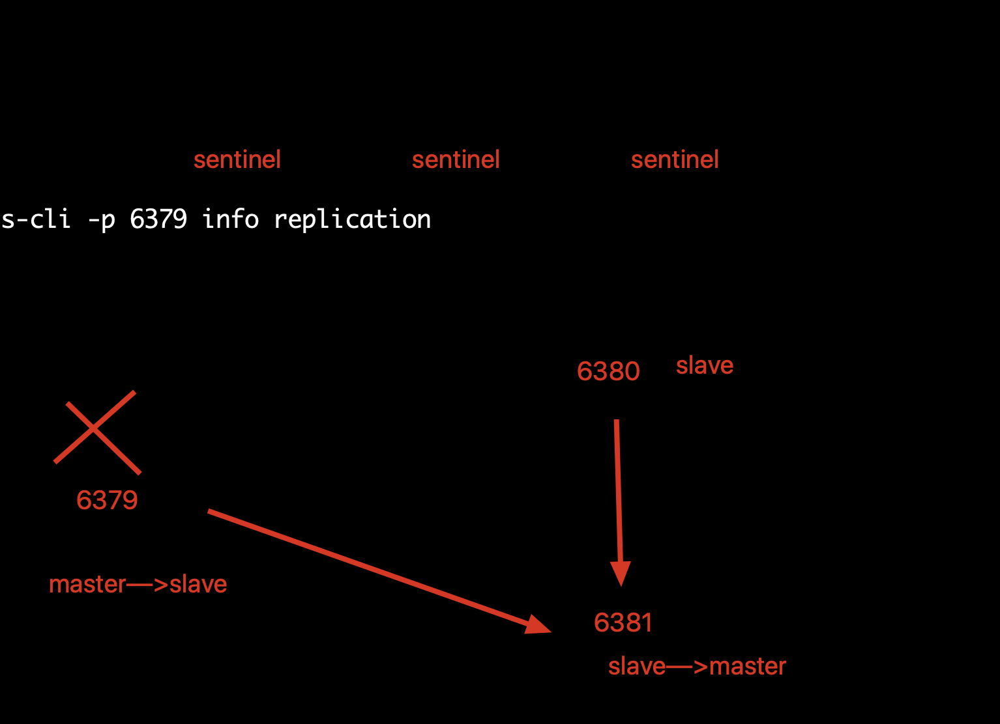
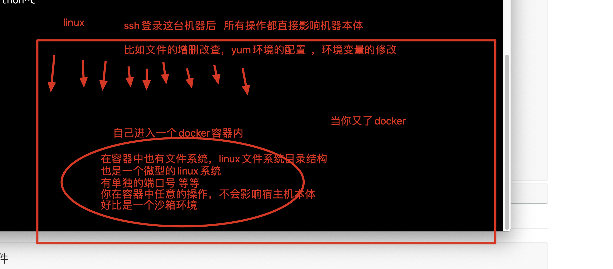
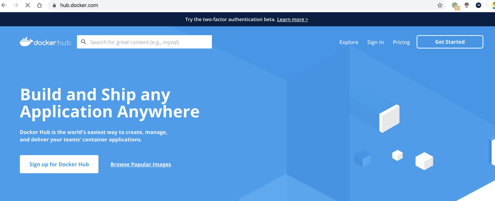
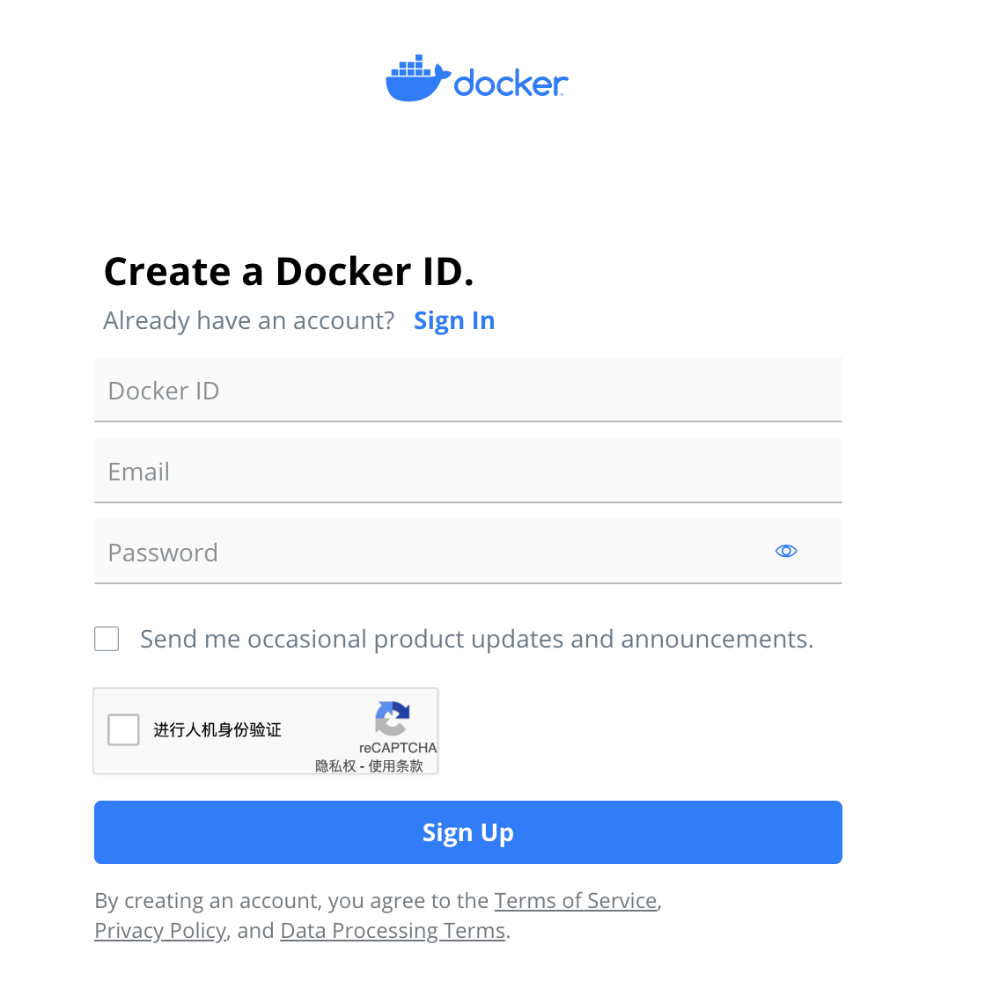

## 上节课补充

昨天的作业完成情况并不好，近10个同学没交

有几个同学码云的评论，仅仅完成了1-2道题

它不仅仅是个作业，也是一个任务，执行力是一个人很重要的表现....

不忘初心、方得始终！

### redis-sentinel

```
1.准备3个redis节点，1主2从的redis集群

redis支持多实例-------基于多个配置文件，运行处多个redis相互独立的进程
s25-redis-6379.conf    -----主

port 6379
daemonize yes
logfile "6379.log"
dbfilename "dump-6379.rdb"
dir "/var/redis/data/" 


s25-redis-6380.conf------从1
port 6380
daemonize yes
logfile "6380.log"
dbfilename "dump-6380.rdb"
dir "/var/redis/data/" 
slaveof 127.0.0.1 6379


s25-redis-6381.conf-----从2
port 6381
daemonize yes
logfile "6381.log"
dbfilename "dump-6381.rdb"
dir "/var/redis/data/" 
slaveof 127.0.0.1 6379

#查看3个配置文件，准备分别启动该进程
[root@s25linux s25sentinel]# ls
s25-redis-6379.conf  s25-redis-6380.conf  s25-redis-6381.conf

#分别启动3个进程后，检查进程情况 
[root@s25linux s25sentinel]# redis-server s25-redis-6379.conf
[root@s25linux s25sentinel]# redis-server s25-redis-6380.conf
[root@s25linux s25sentinel]# redis-server s25-redis-6381.conf
[root@s25linux s25sentinel]# ps -ef|grep redis
root      20413      1  0 08:45 ?        00:00:00 redis-server *:6379
root      20417      1  0 08:45 ?        00:00:00 redis-server *:6380
root      20422      1  0 08:45 ?        00:00:00 redis-server *:6381

#确认3个库的主从关系
[root@s25linux s25sentinel]# redis-cli -p 6379 info  replication
# Replication
role:master
connected_slaves:2
slave0:ip=127.0.0.1,port=6380,state=online,offset=183,lag=1
slave1:ip=127.0.0.1,port=6381,state=online,offset=183,lag=1
```

1主2从的环境搭建好了，准备招来3个值班的也就是，redis的哨兵

```
1.分别准备3个哨兵的配置文件，修改如下，三个哨兵的配置文件，仅仅是端口号的不同

vim s25-sentinel-26379.conf 

port 26379  
dir /var/redis/data/
logfile "26379.log"

// 当前Sentinel节点监控 192.168.119.10:6379 这个主节点
// 2代表判断主节点失败至少需要2个Sentinel节点节点同意
// mymaster是主节点的别名
sentinel monitor s25msredis 127.0.0.1 6379 2

//每个Sentinel节点都要定期PING命令来判断Redis数据节点和其余Sentinel节点是否可达，如果超过30000毫秒30s且没有回复，则判定不可达
sentinel down-after-milliseconds s25msredis 30000

//当Sentinel节点集合对主节点故障判定达成一致时，Sentinel领导者节点会做故障转移操作，选出新的主节点，
原来的从节点会向新的主节点发起复制操作，限制每次向新的主节点发起复制操作的从节点个数为1
sentinel parallel-syncs s25msredis 1

//故障转移超时时间为180000毫秒
sentinel failover-timeout s25msredis 180000
daemonize yes 


s25-sentinel-26380.conf 
port 26380
dir /var/redis/data/
logfile "26380.log"
sentinel monitor s25msredis 127.0.0.1 6379 2
sentinel down-after-milliseconds s25msredis 30000

sentinel parallel-syncs s25msredis 1

sentinel failover-timeout s25msredis 180000
daemonize yes


s25-sentinel-26381.conf 
port 26381
dir /var/redis/data/
logfile "26381.log"
sentinel monitor s25msredis 127.0.0.1 6379 2
sentinel down-after-milliseconds s25msredis 30000

sentinel parallel-syncs s25msredis 1

sentinel failover-timeout s25msredis 180000
daemonize yes


#分别启动3个哨兵进程，以及查看进程信息
[root@s25linux s25sentinel]# redis-sentinel s25-sentinel-26379.conf
[root@s25linux s25sentinel]# redis-sentinel s25-sentinel-26380.conf
[root@s25linux s25sentinel]# redis-sentinel s25-sentinel-26381.conf
[root@s25linux s25sentinel]# ps -ef|grep redis
root      20413      1  0 08:45 ?        00:00:00 redis-server *:6379
root      20417      1  0 08:45 ?        00:00:00 redis-server *:6380
root      20422      1  0 08:45 ?        00:00:00 redis-server *:6381
root      20614      1  0 08:55 ?        00:00:00 redis-sentinel *:26379 [sentinel]
root      20618      1  0 08:55 ?        00:00:00 redis-sentinel *:26380 [sentinel]
root      20622      1  0 08:55 ?        00:00:00 redis-sentinel *:26381 [sentinel]

#检查redis哨兵的配置文件，以及哨兵的状态
[root@s25linux s25sentinel]# redis-cli -p 26379 info sentinel
# Sentinel
sentinel_masters:1
sentinel_tilt:0
sentinel_running_scripts:0
sentinel_scripts_queue_length:0
sentinel_simulate_failure_flags:0
master0:name=s25msredis,status=ok,address=127.0.0.1:6379,slaves=2,sentinels=3
```

在哨兵搭建好了之后，模拟干掉主库，然后等待主从的一个自动化切换

```
1.检查6379的进程，杀死后，哨兵能够自动的，进行投票选举，剩下来的一个slave为新的master，然后重新分配主从关系

2.故障的修复，修复6379这个redis数据库，且检查它的一个复制关系
6379数据库会重新假如到主从复制，且变为一个新的从库

3.如果你想恢复他们的主从关系，全部kill掉，重新启动，默认就会以配置文件分配主从关系了
```



## redis-cluster搭建


```
1.准备好6匹马儿，也就是6个redis节点，也就是6个配置文件，redis集群节点最少是使用6个
这6个配置文件，仅仅是端口号的不同而已
这6个配置文件，仅仅是端口号的不同而已
这6个配置文件，仅仅是端口号的不同而已
s25-redis-7000.conf

port 7000
daemonize yes
dir "/opt/redis/data"
logfile "7000.log"
dbfilename "dump-7000.rdb"
cluster-enabled yes   #开启集群模式
cluster-config-file nodes-7000.conf　　#集群内部的配置文件
cluster-require-full-coverage no　　#redis cluster需要16384个slot都正常的时候才能对外提供服务，换句话说，只要任何一个slot异常那么整个cluster不对外提供服务。 因此生产环境一般为no

s25-redis-7001.conf
s25-redis-7002.conf
s25-redis-7003.conf
s25-redis-7004.conf
s25-redis-7005.conf


#生成数据文件夹  
mkdir -p  "/opt/redis/data"

#分别启动6个redis节点，且检查进程
[root@s25linux s25rediscluster]# redis-server s25-redis-7000.conf
[root@s25linux s25rediscluster]# redis-server s25-redis-7001.conf
[root@s25linux s25rediscluster]# redis-server s25-redis-7002.conf
[root@s25linux s25rediscluster]# redis-server s25-redis-7003.conf
[root@s25linux s25rediscluster]# redis-server s25-redis-7004.conf
[root@s25linux s25rediscluster]# redis-server s25-redis-7005.conf


#此时你尝试着写入数据，看一看是否能写进去，不能写入数据
我们仅仅是启动了6个redis节点，准备好了6匹马儿，马儿身上的框还没分配，你想
```

此时准备好ruby的环境，用于一键创建redis集群，给马儿分配框，给redis节点分配slot槽位，用于写入数据

```
1.直接yum安装ruby解释器ruby和python一样是一个解释性编程语言，日本大神开发的

ruby=====python    gem====pip3   gem是ruby的包管理工具
ruby=====python    gem====pip3   gem是ruby的包管理工具

yum install ruby -y 

2.检查ruby和gem的环境
[root@s25linux s25rediscluster]# ruby -v
ruby 2.0.0p648 (2015-12-16) [x86_64-linux]

[root@s25linux s25rediscluster]# gem -v
2.0.14.1


3.下载ruby操作redis的模块，用于创建集群
wget http://rubygems.org/downloads/redis-3.3.0.gem


4.用gem安装此模块,ruby就可以操作redis数据库了
gem install -l redis-3.3.0.gem   #就如同python的 pip3 install xxxx，不难理解


5.搜索ruby创建redis集群的脚本
redis-trib.rb 如何知道它的绝对路径？
which 是搜索PATH环境变量中的命令的绝对路径！
find 才是搜索系统上的文件路径！！

find / -name "redis-trib.rb"  #默认会在redis数据库的编译安装路径下


6.一键创建集群，且自动分配槽位，可以写入数据了
redis-trib.rb create --replicas 1 127.0.0.1:7000 127.0.0.1:7001 127.0.0.1:7002 127.0.0.1:7003 127.0.0.1:7004 127.0.0.1:7005

7.进入集群写入数据，查看数据重定向


```

以上由于redis版本过低，且redis官网无法打开，下载新版redis，实验只能终止

## docker学习

老师博客地址 https://www.cnblogs.com/pyyu/tag/docker/

本地开发环境--快速开发新功能---django2---等等新的模块

测试环境---测试代码

预生产环境---和线上服务器环境一模一样

线上环境服务器---部署代码


整个环境部署的问题，非常棘手，因此引入了容器技术，唰的一下，全部解决了


## 解决环境迁移的难题

1.利用虚拟机的模板克隆功能，将整个机器的环境复制一份，再丢给第二个机器去使用

2.最好是使用docker去部署环境




## docker的生命周期概念

- 镜像，是一个系统的只读模板，例如一个微型的centos系统镜像
- 容器，容器进程，应用程序以后封装在容器中去运行，相互隔离
- 仓库，存储镜像的一个仓库地址，便于和他人共享镜像文件的一个地方

```
基于镜像运行处容器
基于一个镜像，可以运行处N多个容器实例

以python的面向对象去理解的话

docker的镜像---------理解为python的 class
docker的容器-------理解为class的实例化对象

class  Stu():
	 def __init__(self):
	 			self.age=18
	 			self.height=180
	 			self.weight=280

老王=Stu()
小李=Stu()
小张=Stu()

问，老王，小李，小张之间有什么相同性吗？ 这3个对象，都有相同的Init里面的实例化属性 

基于如上的概念理解，基于同一个镜像文件，运行出的容器实例，其容器内的环境，也是一模一样的！理解一下


```

### 安装docker，使用docker

```
使用阿里云的yum源，可以直接安装docker软件，阿里云的docker软件版本可能较低，如果要下载新的，去docker官网找

1.yum install docker -y 

2.配置docker的镜像加速器，加速系统镜像的下载，默认是去国外下载，比较慢
能够加速下载你所需要的各种镜像，来自如如下提供的2个镜像站点
比如你想快速的使用tornado模块去开发一些东西
-编译安装python3
-安装tornado模块及依赖关系
-加上你的代码才能够运行 

当你有了docker技术
docker search  tornado  #直接搜索和tornado有关的镜像，是其他人制作好的镜像
docker pull tornado  #直接下载该镜像，和代码结合使用，docker解决了，省去了你配置环境的一些步骤


vim /etc/docker/daemon.json  #修改docker的配置文件，修改docker镜像的下载地址，在国内下载比较快
{
  "registry-mirrors": [
    "https://dockerhub.azk8s.cn",
    "https://hub-mirror.c.163.com"
  ]
}

3.重启docker，运行docker
systemctl restart docker 

4.获取一个centos的基础镜像，docker的系统镜像，非常小， centos只有200M左右
docker pull centos
```

## 学习docker容器、镜像的增删改查命令

## 增

```
1.从dockerhub 仓库中获取docker的镜像，从github获取代码一个道理
docker  pull centos  #去docker仓库中寻找centos系统镜像
docker  pull  ubuntu  #获取ubuntu镜像

2.获取一个hello-world进程
docker  pull hello-world

3.获取一个ubuntu镜像
docker pull ubuntu  

4.搜索相关的镜像
docker search  python3 

#比如你想用nginx，又不想修改宿主机的一个软件环境，直接用docker安装
docker search  nginx 
docker pull nginx
docker run nginx  #nginx服务器就能够运行在容器中，然后和宿主机有一个端口映射，就可以访问了
```

## 删

```
1.删除本地镜像文件
docker rmi   镜像id
docker rmi  fce  #删除镜像id的前3位即可，必须要先删除有相关依赖的容器进程记录

2.删除容器记录的命令
docker rm   容器id前3位 

3.批量清空无用的docker容器记录，容器记录非常容易创建docke run  
#批量删除挂掉的容器记录
docker rm  `docker ps -aq`  #  把docker容器记录的id号，保存在反引号中，丢给docker rm实现批量删除

4.批量删除镜像
docker rmi `docker iamges -aq`

5.批量停止容器
docker stop `docker ps -aq`
docker start 容器id #启动暂停的容器
docker stop 容器id  #暂停一个容器
docker restart 容器id  #重启容器
```

## 改

```
1.运行第一个docker的容器实例，运行镜像文件，产生容器进程
docker run   镜像文件的名字即可
docker run  centos  #运行centos基础镜像，如果docker容器中没有在后台运行的进程，容器会直接挂掉
#如果你发现你的容器没有启动成功，说明容器内部出错了，程序没有运行

2.运行一个hello world容器进程
docker run hello-world

3.docker run指令还有一个功能是，当镜像不存在的时候，会自动去下载该进程
此时老师的电脑，本地没有hello-world镜像了
docker run hello-world   #有2个功能，下载镜像，执行镜像

4.交互式的运行一个存活的docker容器，centos

# -it参数  -i 是交互式的命令操作   -t开启一个终端   /bin/bash 指定shell解释器
# 容器空间内，有自己的文件系统 
docker run -it  centos  /bin/bash 	#运行centos镜像，且进入容器内
[root@s25linux ~]# docker run  -it  centos  /bin/bash		#进入容器后，容器空间内是以容器id命名的
[root@fc760671d074 /]#

5.运行出一个活着的容器，在后台不断执行程序的容器
#  docker run  运行镜像文件
#  -d 是让容器后台运行
#  -c 指定一段shell代码

# 运行centos镜像，生成容器实例，且有一段shell代码，在后台不断运行，死循环打印一句话，每秒钟打印一次
docker run -d centos /bin/sh -c "while true;do echo s25的靓仔们辛苦了学习linux; sleep 1;done"

6.运行docker容器，且指定名字，便于管理
docker run --name "指定容器的运行名字“    -d centos /bin/sh -c "while true;do echo s25的靓仔们辛苦了学习linux; sleep 1;done"

7.进入一个正在运行的容器空间，进入一个线上正在运行的容器程序，修改其内部的资料
docker exec -it  容器id   /bin/bash  

8.如何进入容器空间内，修改容器内的环境，以及代码等内容，修改软件等操作，且提交镜像，发送给其他人
8.1 进入容器空间内，安装一个vim或是python3等步骤
docker run -it centos /bin/bash
yum install vim -y 

8.2  安装好vim后，退出容器空间
exit

8.3 提交该容器，生成新的镜像文件
docker commit  5b28d8c88794  s25-centos-vim

9.导出你的docker镜像，可以发送给同事，或是其他人使用
docker save  镜像id   >   镜像的压缩文件
#官方文档解释的是，docker save用的是tar命令压缩，应该是没有其他压缩格式的
[root@s25linux ~]# docker save  45d7f887125d   >   /opt/s25-centos-vim.tar.gz
#你可以删掉本地的镜像，然后重新导入该压缩文件，模拟发送给同事的操作

10.如何进行docker镜像导入 
比如小李运维同志，他收到了该docker镜像压缩文件，在他的机器上导入该进项
docker  load   <   /opt/s25-centos-vim.tar.gz
首次导入该进项的时候，发现丢失了镜像tag标签，重新赋予一个即可
docker tag  45d7f887125d  s25-new-centos-vim

11.如何在docker内，运行一个python web的程序，需要用到端口映射知识~~~~
#  -d 后台运行 
# -P  大写的P参数，作用是随机的端口映射
# training/webapp 是镜像的名字，默认没有会去在线下载
# python app.py   代表启动容器后，让容器执行的命令是它
# 因此这个命令作用是，启动一个webapp镜像，且在容器中执行 python app.py  
# -p 6000:5000  访问宿主机的6000，就是访问容器的5000了
docker run --name "s25webdocker"  -d -p 6000:5000 training/webapp python app.py  

12.进入该webapp的容器，查看里面的内容
docker exec -it  容器id   /bin/bash  #进入容器内，可以进行相应的修改操作
docker restart  容器id  #重启该容器，重新读取代码，即可生效


```

对于后端开发的程序员，只需要掌握Docker的容器，镜像，仓库的增删改查命令即可


## 查

```
1.查看本地机器，所有的镜像文件内容
docker  images 

2.查看docker正在运行的进程
docker ps 

3.查看所有运行，以及挂掉的容器进程
docker ps -a  

4.查看容器内的运行日志
docker logs  容器id
docker logs -f  容器id   #实时刷新容器内的日志，例如检测nginx等日志信息

5.查看容器内的端口转发情况
docker port  容器id  #查看容器的端口转发
[root@s25linux ~]# docker port 615  
5000/tcp -> 0.0.0.0:6000


```


### dockerfile

手写一个dockerfile，运行出python的应用

腾讯课堂的极速版讲课，我会发给你们一个课堂的连接，即可观看~~~~休息20分钟 

4：30继续开讲

愿意听就好~~谢谢，休息一会

细水长流，有任何linux的疑问，都可以来问我，互相学习，进步

##dockerfile常用指令学习

```
# FROM 指令表示，告诉该dockerfile以哪个镜像为基础
# 比如你的技术老大，要求你们程序运行在ubuntu中
# FROM  ubuntu
# FROM  centos
FROM scratch #制作base image 基础镜像，尽量使用官方的image作为base image
FROM centos #使用base image
FROM ubuntu:14.04 #带有tag的base image

#LABEL标签，定义变量，定义坐着信息等
LABEL version=“1.0” #容器元信息，帮助信息，Metadata，类似于代码注释
LABEL maintainer=“yc_uuu@163.com"

#RUN是一个完成指令，你可以用它在docker中执行任意的命令
# RUN就是告诉容器要做哪些配置

# 用RUN指令告诉dockerfile他该去做什么事
RUN mkdir  /s25牛批
RUN cd  /s25牛批
RUN cd
RUN pwd  #会输出什么？ 因此在容器中会输出，用户家目录


#对于复杂的RUN命令，避免无用的分层，多条命令用反斜线换行，合成一条命令！
# 要修改centos基础镜像的环境问题
RUN yum update && yum install -y vim \
    Python-dev #反斜线换行
RUN /bin/bash -c "source $HOME/.bashrc;echo $HOME”


WORKDIR /root #相当于linux的cd命令，改变目录，尽量使用绝对路径！！！不要用RUN cd
WORKDIR /test #如果没有就自动创建
WORKDIR demo #再进入demo文件夹
RUN pwd     #打印结果应该是/test/demo

#案例
WORKDIR /s25很棒
WORKDIR  我们要说goodbay了
RUN  pwd  #会输出什么？ /s25很棒/我们要说goodbay了  此时进入了2层目录


# ADD指令用于添加宿主机的文件，放入到容器空间内 
# 宿主机有自己的文件系统，文件夹，文件，目录等
# 容器内也有一套自己的文件系统，独立的文件信息
# 把宿主机的代码，拷贝到容器内
# ADD还有解压缩的功能，这是一个坑，需要注意
ADD and COPY 
ADD hello.txt /opt  #吧宿主机的hello.txt 拷贝到容器内的/opt目录下 
ADD test.tar.gz /opt    /opt/test  
RUN tar -zxvf test.tar.gz  #直接报错，文件不存在 ，因为上一步，ADD指令已经对tar.gz压缩包解压缩了


WORKDIR /root
ADD hello test/  #进入/root/ 添加hello可执行命令到test目录下，也就是/root/test/hello 一个绝对路径
COPY hello test/  #等同于上述ADD效果

# dockerfile，用于从宿主机拷贝文件，到容器内有2个指令一个ADD，一个COPY，COPY仅仅就是拷贝，尽量用它
ADD与COPY
   - 优先使用COPY命令
    -ADD除了COPY功能还有解压功能

#添加远程文件/目录使用curl或wget

ENV #环境变量，尽可能使用ENV增加可维护性
ENV MYSQL_VERSION 8.0 
RUN yum install -y mysql-server=“${MYSQL_VERSION}” 


RUN yum install -y mysql-server=“${MYSQL_VERSION}” 
RUN yum install -y mysql-server=“${MYSQL_VERSION}” 
RUN yum install -y mysql-server=“${MYSQL_VERSION}” 
RUN yum install -y mysql-server=“${MYSQL_VERSION}” 
RUN yum install -y mysql-server=“${MYSQL_VERSION}” 
RUN yum install -y mysql-server=“${MYSQL_VERSION}” 


```

### dockfile实战，写一个flask容器脚本

构建镜像的步骤

```
1.准备好一个flask代码，检查需要哪些依赖步骤
[root@s25linux s25docker]# cat s25_flask.py

from flask import Flask
app=Flask(__name__)
@app.route('/')
def hello():
    return "linux就即将结束了，祝大家，找到好工作，有linux问题呢，尽量和我来沟通，互相学习"
if __name__=="__main__":
    app.run(host='0.0.0.0',port=8080)
    
2.在宿主机环境检查如何能够运行该脚本
发现需要安装flask模块
pip3 install -i https://pypi.douban.com/simple flask

3.编写dockerfile脚本，注意名字必须是 大写Dockerfile

touch Dockerfile ，写入如下的内容

FROM python    #指定镜像，dockerhub提供好的python镜像，已经安装好了python3，很好用
RUN pip3 install -i https://pypi.douban.com/simple flask  #在容器内安装flask模块  
ADD  s25_flask.py    /opt	#把宿主机的代码，拷贝到容器的/opt目录下
WORKDIR  /opt		#容器内进行目录切换
EXPOSE 8080		#打开容器的8080端口，用于和宿主机进行映射
CMD ["python3","s25_flask.py"]  	#在容器启动后，内部自动执行的命令是什么 


4.检查准备的脚本代码，以及Dockerfile文件
[root@s25linux s25docker]# ls
Dockerfile  s25_flask.py


5.构建该dockerfile，生成镜像 
[root@s25linux s25docker]# docker build .

6.检查docker的镜像，是否生成
docker images 
#可以修改一下镜像的标签
[root@s25linux s25docker]# docker tag  a66  s25-flask

7.运行该镜像文件，查看是否能够运行容器内的flask
docker run  -d  -p  8000:8080  a66    

8.访问宿主机端口，查看容器内的应用
curl  127.0.0.1:8000

9.可以修改容器内的代码，重启容器
docker exec -it  88a5  /bin/bash  
修改容器内的代码
sed  -i "s/linux就即将结束了，祝大家，找到好工作，有linux问题呢，尽量和我来沟通，互相学习/linux课程结束，再回！朋友们/"  s25_flask.py

10.重启容器
docker restart 88a

11.再次访问容器内应用，查看更新的代码内容
curl  127.0.0.1:8000
```


### dockerhub仓库

dockerhub仓库就是和github一样的概念

github---托管程序员的代码

dockerhub----托管程序员编写的docker镜像





```
1.docker提供了一个类似于github的仓库dockerhub,
网址https://hub.docker.com/需要注册使用

2.注册docker id后，在linux中登录dockerhub，会提示让你输入账号密码，正确登录之后，本台机器就和dockerhub绑定账号了，你的镜像推送，就能够推送到，该账户的dockerhub中

docker login


2.1准备镜像推送
注意要保证image的tag是dockerhub账户名，如果镜像名字不对，需要改一下tag

docker tag 镜像id  dockerhub的账号/centos-vim
语法是：  docker tag   仓库名   yuchao163/仓库名


3.推送docker image到dockerhub，好比你准备git push 推送代码一样
docker push dockerhub账号/centos-vim

4.在dockerhub中检查镜像,查看个人账户中的镜像文件
https://hub.docker.com/

5.删除本地镜像，测试下载pull 镜像文件
docker pull yuchao163/centos-vim 


```


##yaml配置文件

你用过哪些格式的配置文件？

不同的配置文件，遵循的语法也不一样

- json------
- Conf----nginx.conf ,my.cnf
- ini ------uwsgi.ini
- Xml----xml格式的配置文件
- yaml----新式配置文件，用在docker、salt、k8s等配置文件中,遵循python的缩进语法

yaml

```
语法规则
    大小写敏感
    使用缩进表示层级关系   
    缩进时禁止tab键，只能空格
    缩进的空格数不重要，相同层级的元素左侧对其即可
    # 表示注释行
yaml支持的数据结构
    对象： 键值对，也称作映射 mapping 哈希hashes  字典 dict    冒号表示 key: value   key冒号后必须有
    数组： 一组按次序排列的值，又称为序列sequence  列表list     短横线  - list1
    纯量： 单个不可再分的值
    
    
    对象：键值对

python

```

python的字典套字典，数据结构表示如下

```
{
	"s25":{
			"男同学":["宝元","太白","马jj"],
			"女同学":["景女神","alex"]
	}
}
```

如何用yaml表示上述数据结构呢？

在线yaml解析

https://www.bejson.com/validators/yaml_editor/

```
"s25":
  "男同学":
     - "宝元"
     - "太白"
     - "马jj"
  "女同学":
       - "景女神"
       - "alex"
```


