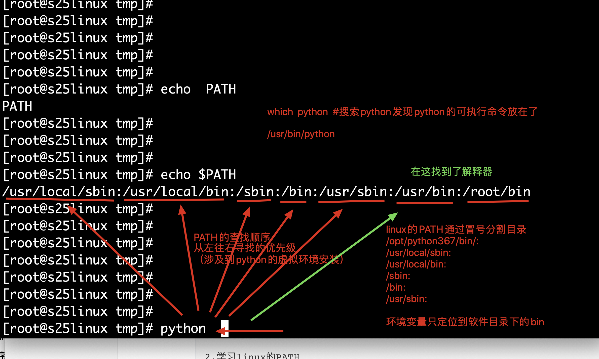
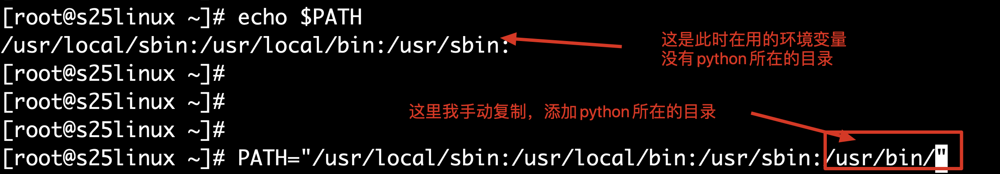
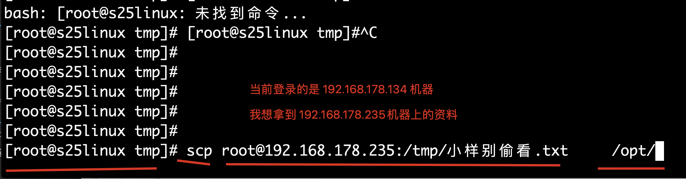

## 每日上课前的操作

1.打开vmware workstation软件

2.开启centos虚拟机，查看动态ip地址（今日分配到的ip地址）

今日ip：192.168.178.134

3.使用xshell远程连接上 centos系统

```
ssh   root@192.168.178.134  
```

4.准备开始学习新命令操作

## 如果开机没有ip怎么办

埋下伏笔。。。

是需要修改网卡配置文件的(还没学vim 文本编辑器命令)

获取ip的步骤 如下

```
1.vim编辑网卡配置文件，修改如下参数
[root@s25linux tmp]# cd  /etc/sysconfig/network-scripts/
vim修改此文件，找到如下参数，改为yes
ONBOOT="yes"

2.确保vmware 正确选择了 桥接 或是NAT，且已经连接上了

3. 命令重启网络设置

systemctl stop NetworkManager #关闭无线网络服务
systemctl restart network   	#重启有线网服务 
#这2个命令执行都没有任何提示，表示正确的重启了网络配置

4.此时查看ip地址是否存在了

ip addr show 
```


## Linux常用命令

### mkdir

```
mkdir 感谢老铁的花花      感谢老铁送上的飞机

mkdir -p 斗鱼/lol    虎牙/王者农药
```

### tree

树的意思，以树状图显示文件目录的层级结构

```
#确保你的机器可以上网 ，yum如同pip一样，自动的安装东西，解决依赖
# pip  是给python安装模块的工具
# yum  是给linux安装系统软件的工具
yum    install    tree     -y  # -y默认yes同意安装  

[root@s25linux tmp]# mkdir -p   a/b     c/d

[root@s25linux tmp]# tree
```

### 查看linux命令的帮助信息

```
1.用man手册，linux提供的帮助文档
man  ls
man  cp
man  mkdir   

2.命令加上 --help参数，查看简短帮助信息
mkdir --help
rm  --help

3.在线的搜索一些命令查询网站
http://linux.51yip.com/

4.在线询问人工智能---超哥
...
```

### echo命令

echo命令如同python的print一样，能够输出字符串到屏幕给用户看

案例

```
[root@s25linux tmp]# echo  "感谢老铁送上的奥力给"
感谢老铁送上的奥力给


#linux在命令行的变量赋值，是临时生效的
#输出变量的值
#定义变量，中间有空格
name="感谢老铁送上的飞机"   
#输出变量的值 

[root@s25linux tmp]# echo   $name
感谢老铁送上的飞机
```

### PATH变量

PATH就是定义一些常用的软件可执行命令的目录，放入系统中，可以快捷的查询，而不需要每次都输入绝对路径

```
1.为什么系统能够直接找到python解释器？
[root@s25linux tmp]# which python  #输出命令所在的绝对路径
/bin/python

2.学习linux的PATH，
[root@s25linux tmp]# echo $PATH
/usr/local/sbin:/usr/local/bin:/sbin:/bin:/usr/sbin:/usr/bin:/root/bin

注意，PATH的路径，是有先后顺序的，从左往右，读取的
3.如果编译安装了一个python3，装在了 /opt/python36/目录下，怎么添加PATH？

#这个变量赋值的代码，就是添加python3到环境变量中了
PATH="/opt/python36/bin/:/usr/local/sbin:/usr/local/bin:/sbin:/bin:/usr/sbin:/usr/bin:"

4.由于上述变量赋值的操作，只是临时生效，我们想永久的更改PATH的值，还得修改/etc/profile 

vim  /etc/profile #打开文件，在文件末尾，添加PATH值的修改
PATH="/opt/python36/bin/:/usr/local/sbin:/usr/local/bin:/sbin:/bin:/usr/sbin:/usr/bin:"

```

###PATH的寻找原理图






## 修改linux的全局配置文件

```
1.名字叫做 /etc/profile，里面是shell脚本语言

2.编辑这个文件，写入你想永久生效的变量和值，系统每次开机都会读取这个文件，让其生效

vim  /etc/profile 
写入如下内容
###这是自定义的变量，每次开机都能够读取了，第一条是设置系统中文的变量
export LC_ALL=zh_CN.UTF-8  #打开注释，系统支持中文
#export LC_ALL=en_US.UTF-8  #打开注释，系统就支持英文了

```

## linux单引号和双引号的区别

```
单引号中的内容，仅仅就是个字符串了，不识别任何其他的特殊符号

双引号中的内容，能够识别特殊符号，以及变量

[root@s25linux ~]# echo '$name'
$name

[root@s25linux ~]# echo "$name"
我们是穿越在银河的火箭队
```

## vim编辑器的用法

最基本的编辑器 

windows

- 记事本
- sublime
- notapad++
- ....


linux

- vi   等同于记事本，很难用，没有语法颜色提示灯
- vim，等同于Notepad++,有颜色高亮，支持安装第三方插件，语法补全等等高级编辑器


### vim使用流程

```
1. vim  需要单独安装的

yum instal  vim  -y  #  安装 

2.vim打开一个不存在的文件，默认会创建此文件

#用vim写一个python脚本，
#vim的使用流程
第一步：vim  first.py  ，此时会进入命令模式，按下字母 i，进入编辑模式
第二步：想要退出编辑模式，按下键盘的esc，回到命令模式
第三部：此时输入 shfit+冒号，输入一个英文的冒号，进入底线命令模式 
第四步：输入 :wq!  ，write写入内容，quit退出vim  ！ 强制性的操作
:wq!  强制保存写入退出vim
:q!  强制不保存内容，直接退出

3.此时可以查看一下文件内容

[root@s25linux tmp]# cat first.py
#!coding:utf-8
print ("你看这个灯，它又大又量")


4.如何执行这个脚本？
python  fisr.py  #即可执行脚本文件了

```

## cat命令

cat 猫，用这个只猫瞄一眼  文件的内容 

```
cat 文件名  

[root@s25linux tmp]# cat  first.py
print ("你看这个灯，它又大又量")

#读取内容，且显示行号
cat  -n  文件名 

#利用cat写入文件内容，写一首诗
[root@s25linux tmp]# cat >> second.py << EOF
> #!coding:utf-8
> print("爱的魔力转圈圈")
> EOF
[root@s25linux tmp]#
[root@s25linux tmp]#
[root@s25linux tmp]#
[root@s25linux tmp]#
[root@s25linux tmp]# cat second.py
#!coding:utf-8
print("爱的魔力转圈圈")

```

## linux的重定向符号

```
>    #重定向输出覆盖符  ，如同 python的 with open 中的  w模式 
>>	 #重定向输出 追加符  ，如同 a模式 

<    #重定向写入覆盖符，用的很少，用在数据导入等操作中,mysql数据导入 
<<  #用在cat命令中，很少见 
```

案例

```
1.echo输出一个字符串，内容不在屏幕上打印，写入到一个文件中
[root@s25linux tmp]# echo "左手跟我一起画个龙"  >  迪斯科.txt
[root@s25linux tmp]# echo "左手跟我一起画个龙"  >  迪斯科.txt
[root@s25linux tmp]# echo "左手跟我一起画个龙"  >  迪斯科.txt
[root@s25linux tmp]# echo "左手跟我一起画个龙"  >  迪斯科.txt
[root@s25linux tmp]# echo "左手跟我一起画个龙"  >  迪斯科.txt
[root@s25linux tmp]#
[root@s25linux tmp]#
[root@s25linux tmp]# cat -n  迪斯科.txt
     1	左手跟我一起画个龙
     
2.追加写入文件内容
[root@s25linux tmp]# echo "右手和我划一道彩虹"  >>  迪斯科.txt


```

## cp命令

拷贝 

```
#对于配置文件的修改，或者是代码文件的修改，防止突然写错了，复制一份
#复制文件
[root@s25linux tmp]# cp  木兰诗.txt     新_木兰诗.txt

#复制文件夹，复制文件夹需要添加 -r 递归复制参数
[root@s25linux tmp]# cp  -r  a   new_a


```

## mv命令

mv命令可以 移动文件 ，文件夹的路径

mv命令也能够进行  重命名

```
1.重命名的功能
语法是
mv  旧文件名      新文件名  
[root@s25linux tmp]# mv  木兰诗.txt      new_木兰诗.txt

2.移动位置 
语法

mv  你要移动的文件或是文件夹       移动之后的目录名(如果文件夹存在，则移动，不存在是改名)

案例
mv   test.txt      b   #移动 test.txt文件  到 b文件夹下（b文件夹得存在）
```

## alias别名命令

为什么rm命令默认会有一个让用户确认删除的动作呢？

```
解答是因为 rm 的-i参数作用

alias  #直接输入可以查看当前系统的别名 

案例
1.给系统添加一个别名
当你敲下start就是在执行后面的长串命令，很方便 
alias start="python3  /home/mysite/manager.py runserver  0.0.0.0:8000"
```

## find命令

可以用于搜索机器上所有的资料，按照文件名字搜索，linux一切皆文件

```
语法
find   你要从哪找    -type 你要的文件类型是什么 -size  你要的文件内容多大  -name  你要的内容名字是什么
-type  f  是找普通文本文件 
-type  d  是找 文件夹 类型 

-name  是指定文件的名字内容 


#在系统上 全局搜索，所有的.txt文件

find  /    -name  "*.txt"

#指定在etc目录下，进行局部搜索，一个网卡配置文件，网卡名字是以ifcfg开头的 ，文本类型文件
find   /etc   -type  f   -name   "ifcfg*"


```

案例2

```
1.准备好测试的数据，在/tmp目录下
mkdir  /tmp/python{1..5}  #在/tmp目录下 创建 出 python1  ptyhon2 ... python5 
touch  /tmp/python_{a..d}  #在/tmp目录下创建出 python_a   ptyhon_b ..  python_d  几个文件

2.查看准备好的测试文件 
[root@s25linux tmp]# ls
python1  python3  python5   python_b  python_d
python2  python4  python_a  python_c

3.在/tmp目录下联系find命令


4.找出/tmp目录下所有的pyton相关内容
[root@s25linux tmp]# find  .   -name "python*"
./python1
./python2
./python3
./python4
./python5
./python_a
./python_b
./python_c
./python_d

5.找出/tmp 下所有的python相关的文件
[root@s25linux tmp]# find  .   -type f    -name "python*"
./python_a
./python_b
./python_c
./python_d

6.反之找出所有的文件夹
find  . -type d  -name "python*"

7.全局搜索，超过10M大小的 txt文本
[root@s25linux tmp]# find  /  -size +10M  -name "*.txt"
/tmp/python2.txt
/tmp/python3.txt
```

## 查看文件，文件夹大小

```
ls -lh  # -h参数，是显示文件单位，以kb  mb gb大小为单位   -l是列表形式，列出文件夹中详细信息


```

## linux的管道符命令


```
1.例如过滤服务器上的进程信息

2.例如过滤服务器上的端口状态信息

```

## grep命令

grep是linux强大的三剑客之一，从文本中，过滤有用信息的命令

```
1.语法
grep "你想过滤的字符串"   需要过滤的文件  #用法一

准备一个测试的文件test.txt
[root@s25linux tmp]# cat test.txt


跟着我左右右手一个慢动作


#左右右手慢动作重播


一个大西瓜，送给你，也不送给他

ALLOW_HOSTS=[]


2.过滤文件中的相关内容
#找出文件中含有 "大" 字的行，且显示此内容，在哪一行
grep -n "大"   test.txt   # -n 参数是显示行号

#忽略大小写，找出ALLOW_HOSTS=[]参数是否被修改
grep -i "al"  test.txt 

#过滤出此文件非空白行，如何操作？
拆解如下
找出所有的空白行 
[root@s25linux tmp]# grep "^$"   test.txt   #  "^$"  以空开头，以空结尾，因此是空白行
# -v 参数是 翻转过滤结果 ，找出 空白行以外的内容
[root@s25linux tmp]# grep -v   "^$"   test.txt


#过滤掉注释行，和空白行 ，如何操作？
[root@s25linux tmp]# grep -v  "^#"   test.txt | grep -v "^$"
跟着我左右右手一个慢动作
一个大西瓜，送给你，也不送给他
ALLOW_HOSTS=[]


```

案例2

```
cat  文件   |   grep   "你想要的内容"   #用法二

1.找出linux的用户信息文件，中 有关pyyu的行信息  /etc/passwd

[root@s25linux tmp]# cat /etc/passwd  |  grep  "pyyu"
pyyu:x:1000:1000:pyyu:/home/pyyu:/bin/bash 
```

## head、tail命令

```
head和tail都是能够读取文件内容的
语法是 

head  文件名  #默认从文件的前10行看

head  /etc/passwd  #默认看前10行
head -3  /etc/passwd  #查看文件的前3行

tail  文件名 #默认从文件的后10行看
tail -2  /etc/passwd   #查看文件的后2行


tail命令的 实时监控用法 ，可以用于检测线上的日志文件，检测用户的请求信息

tail -f  文件名  #实时刷新文件内容 

tail -f /tmp/test.txt  #能够检测文件内容的变化 


```

###如何查看文件的，中间20行-30行的内容，今天的作业练习 


## scp命令

在2台linux机器(macos)之间，通过网络安全的传输文件，文件夹

```
scp命令 语法是    
```

环境准备，准备2台linux机器

确保两台机器能够通信

机器1：192.168.178.134

机器2：192.168.178.235  

```
案例1：
我登录的是 机器1

需求1：将机器1的/tmp/好嗨哦.txt  发送到 机器2的/tmp目录下 
[root@s25linux tmp]# scp  /tmp/好嗨哦.txt root@192.168.178.235:/tmp/

需求2：把机器2的/tmp目录下的资料 给拿到本地的/opt目录下
scp  你想要的内容   内容发送到哪里 
scp  root@192.168.178.235:/tmp/小样别偷看.txt     /opt/

```



```
情况2，我登录的是 机器2

【把别人的资料拿来】
案例1：我想拿到机器1的/opt/test.txt  拿到机器2的/tmp目录下
scp  我想要的内容    内容存放的地点

scp  root@192.168.178.134:/opt/test.txt      /tmp/

【把自己的资料发给别人】
案例2：我想把本地的/home/fisrst.py  发送给机器1的/home目录下
scp   /home/first.py    账号@机器1:/home/
scp /home/first.py   root@192.168.178.134:/home/  

#如果发送的是整个文件夹，就得加上 -r  递归的拷贝参数
[root@s25linux tmp]# scp  -r  ./lol    root@192.168.178.235:/tmp/

#用通配符发送多个文件
[root@s25linux tmp]# scp -r  ./*  root@192.168.178.235:/tmp/134bak/
```

## lrzsz工具

用于windows(基于xshell工具)和linux之间互相传递文件

```
1.安装此工具
yum install  lrzsz -y  

2.安装好lrzsz之后，就存在了2个命令   一个是 rz  一个是sz
rz  #直接输入rz命令，能够蹦出一个弹窗，接收windows的资料

sz  文件  #发送linux的一个文件，发给 windows某个位置，也是出现一个弹窗


```

## du命令

```
用法
du 【参数】【文件或目录】
-s 显示总计
-h 以k，M,G为单位显示，可读性强
```

案例

```
统计/var/log/文件夹大小 
du -sh  /var/log/  

#显示当前目录下 所有文件的大小
[root@s25linux tmp]# du  -h ./*
```

## vim命令的用法


```
1.  vim  文件名   # 此时进入命令模式，你敲击键盘的动作都会被识别是一个vim的命令 ，比如 a,i,o  进入插入模式

2.但凡进入插入模式之后，敲击键盘的动作就会被识别为是 普通的字符串了

3.按下esc退出编辑模式之后，又进入命令模式了

4.输入 :wq!  保存vim的写入内容，然后退出vim，结束操作
```

```
在命令模式下，常用的指令 

$  快速移动到行尾
0  快速移动到光标的行首
x  删除光标所在的字符
g  移动到文件的第一行
G  移动到文件的最后一行 

/string    你要从文件开头寻找的内容，例如 /to   找出文件中所有的to字符，按下n键，跳转到下一个匹配的字符

?string     从文件的第行，向上搜索字符串信息   

%   找到括号的另一半 

yy   复制光标当前行 
3yy   复制光标后3行 
p    打印yy所复制的内容 
dd   删除光标所在行
4dd  删除光标向下的4行内容
dG   删除光标当前行，到行尾的所有内容
u  就是撤销上一次的动作 

如何快速的复制，打印生成多行内容 
例如 按下  9999yy  就是 复制  9999行，然后按下p打印，就能够快速的复制N多行了...


底线命令模式下
:wq!
:q!  不保存退出
:数字   快速的定位到某一行
:set nu   显示vim的行号 
```

## top命令

windows的任务管理器见过吧

能够显示 动态的进程信息

cpu、内存，网络，磁盘io等使用情况 ，也就是一个资源管理器

那么linux的资源管理器 就是top命令

```
第一行 (uptime)
系统时间 主机运行时间 用户连接数(who) 系统1，5，15分钟的平均负载

第二行:进程信息
进程总数 正在运行的进程数 睡眠的进程数 停止的进程数 僵尸进程数

第三行:cpu信息
1.5 us：用户空间所占CPU百分比
0.9 sy：内核空间占用CPU百分比
0.0 ni：用户进程空间内改变过优先级的进程占用CPU百分比
97.5 id：空闲CPU百分比
0.2 wa：等待输入输出的CPU时间百分比
0.0 hi：硬件CPU中断占用百分比
0.0 si：软中断占用百分比
0.0 st：虚拟机占用百分比

第四行：内存信息（与第五行的信息类似与free命令）
total：物理内存总量
used：已使用的内存总量
free：空闲的内存总量（free+used=total）
buffers：用作内核缓存的内存量

第五行：swap信息
total：交换分区总量
used：已使用的交换分区总量
free：空闲交换区总量
cached Mem：缓冲的交换区总量，内存中的内容被换出到交换区，然后又被换入到内存，但是使用过的交换区没有被覆盖，交换区的这些内容已存在于内存中的交换区的大小，相应的内存再次被换出时可不必再对交换区写入。
```

## ps命令

用于查看linux进程信息的命令 

```
语法就是 
ps  -ef    # -ef，是一个组合参数，-e  -f 的缩写，默认显示linux所有的进程信息，以及pid，时间，进程名等信息 

#过滤系统有关vim的进程 
[root@s25linux ~]# ps -ef |  grep  "vim"
root      24277   7379  0 16:09 pts/1    00:00:00 vim ps是怎么用的.txt
```

```
1.一个django运行后，如何验证django是否运行了，它会产生些什么内容？
能够产生日志，检测到用户的请求，说明django运行了
查看端口情况，django会占用一个端口 
产生一个python相关的进程信息 


```

## kill命令

杀死进程的命令

```
kill   进程的id号

如果遇见卡死的进程，杀不掉，就发送 -9  强制的信号 

kill -9  pid
```

## netstat命令

查看linux的网络端口情况 

```
语法如下
常用的参数组合  -t -n -u -l -p    

[root@s25linux tmp]# netstat -tunlp   #显示机器所有的tcp、udp的所有端口连接情况

#例如验证服务器80端口是否存在
netstat  -tunlp  |  grep  80

#过滤3306端口是否存在 
netstat -tunlp |grep 3306


#过滤ssh服务是否正常
[root@s25linux tmp]# netstat -tunlp  |   grep   ssh
tcp        0      0 0.0.0.0:22              0.0.0.0:*               LISTEN      1147/sshd
tcp6       0      0 :::22                   :::*                    LISTEN      1147/sshd


#有些公司为了保护服务器安全，更改了默认的远程连接端口
# ssh端口 26674    ip 是  123.206.16.61   账号是 xiaohu   密码是 xiaohu666

#我怎么登陆服务器呢？用如下的命令去连接服务器 
ssh  -p  26674    xiaohu@123.206.16.61  


ssh  -p 22 root@192.168.178.134
root@192.168.178.134's password:
```


grep是支持正则表达式的


下周一见~~~周末 愉快


