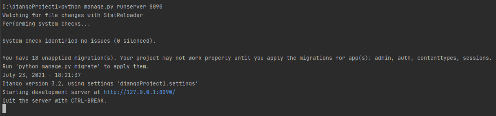
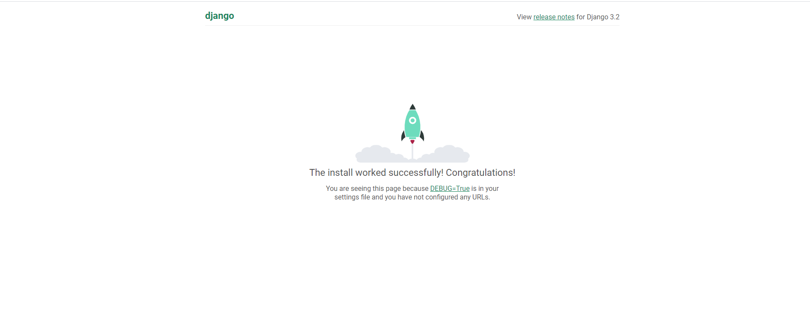
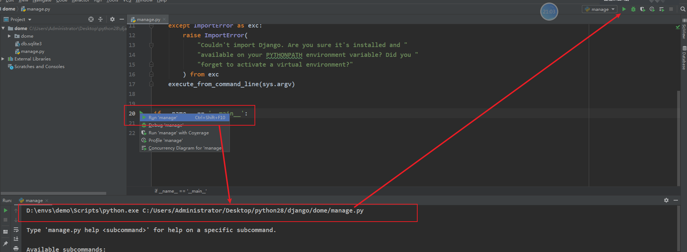
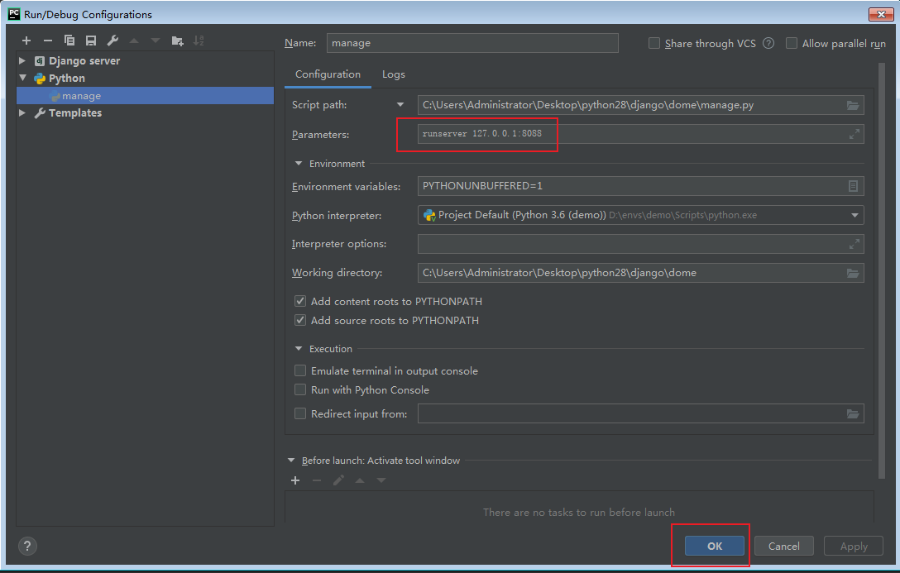
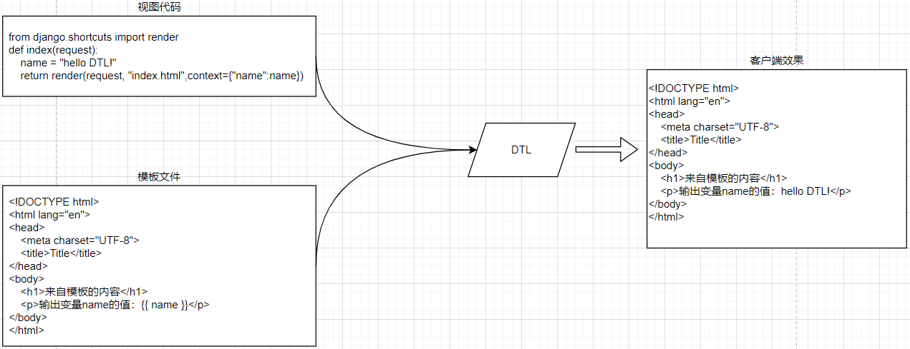
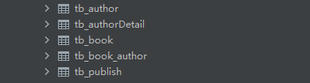
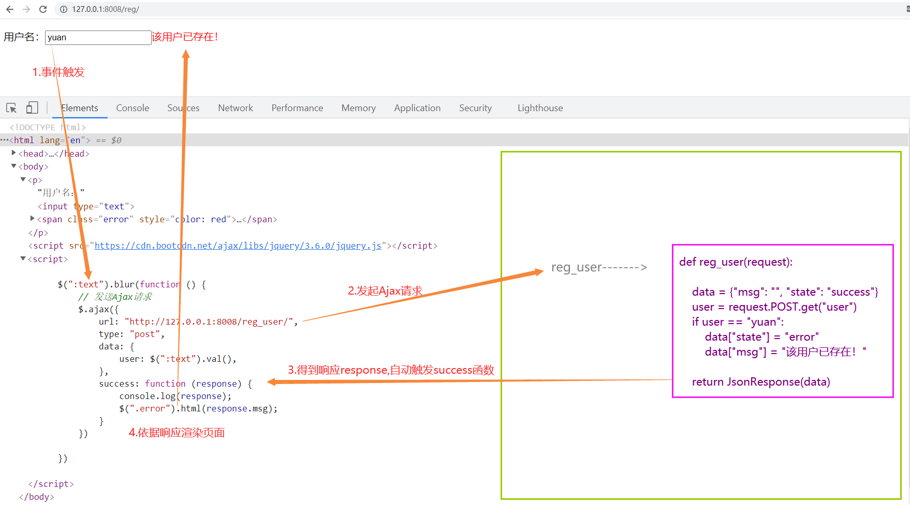
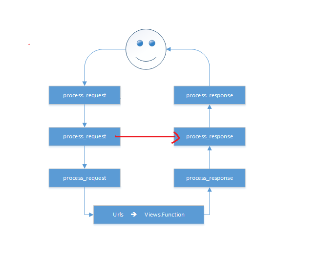
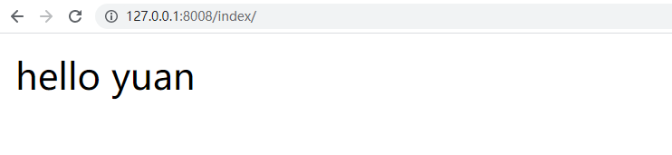
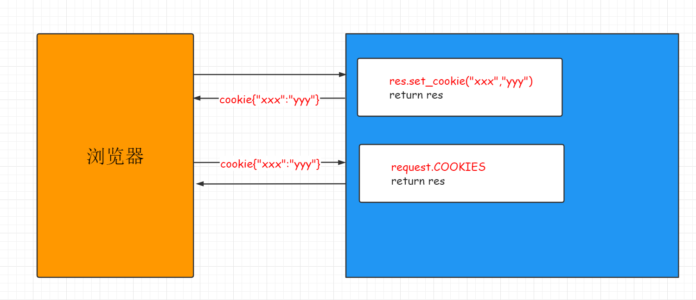

# Django3.2课件

# 一、Django环境安装

## 1.1、Django下载

Python下有许多款不同的 Web 框架。Django是重量级选手中最有代表性的一位。许多成功的网站和APP都基于Django。Django 是一个开放源代码的 Web 应用框架，由 Python 写成。Django 遵守 BSD 版权，初次发布于 2005 年 7 月, 并于 2008 年 9 月发布了第一个正式版本 1.0 。Django 采用了 MVT 的软件设计模式，即模型（Model），视图（View）和模板（Template）。


目前我们学习和使用的版本是3.2LTS版本

| `1 2 3 4 5 6 7 8 9 ` | `目前开源软件发布一般会有2个不同的分支版本: 1. 普通发行版本:                  经常用于一些新功能,新特性,但是维护周期短,不稳定. 2. 长线支持版本[LongTerm Supper]: 维护周期长,稳定  软件版本格式: 大版本.小版本.修订号 大版本一般是项目内容/软件的核心架构发生改动, 以前的代码已经不适用于新的版本 小版本一般是功能的删减, 删一个功能,小版本+1, 减一个功能,小版本+1 修订号一般就是原来的代码出现了bug, 会针对bug代码进行修复, 此时就会增加修订号的数值 ` |
| -------------------- | ------------------------------------------------------------ |
|                      |                                                              |


官网: `http://www.djangoproject.com`

文档:`https://docs.djangoproject.com/zh-hans/3.2/`

在本地安装

| `1 2 ` | `pip install django pip install django==3.2 ` |
| ------ | --------------------------------------------- |
|        |                                               |

| `1 2 3 4 5 6 ` | `pip源:    https://pypi.douban.com/simple/  豆瓣源    https://pypi.tuna.tsinghua.edu.cn/simple   清华源         使用格式:    pip install django -i https://pypi.douban.com/simple/ ` |
| -------------- | ------------------------------------------------------------ |
|                |                                                              |

当然在以后开发或者学习中,我们肯定都会遇到在一台开发机子中,运行多个项目的情况,有时候还会出现每个项目的python解析器或者依赖包的版本有差异.

## 1.2、MTV模型


这个MVT模式并非django首创，在其他的语言里面也有类似的设计模式MVC，甚至可以说django里面的MVT事实上是借鉴了MVC模式衍生出来的。

>   M，Model，模型，是一个类或者函数，里面的代码就是用于完成操作数据库的。
>
>   V，View，视图，里面的代码就是用于展示给客户端的页面效果。可以是一个具有特殊语法的HTML文件，也可以是一个数据结构。
>
>   C，Controller，控制器，是一个类或者函数，里面的代码就是用于项目功能逻辑的，一般用于调用模型来获取数据，获取到的数据通过调用视图文件返回给客户端。

# 二、创建django项目并运行

创建虚拟环境并在虚拟环境中下载安装django包

| `1 2 3 ` | `pip install django==3.2 -i https://pypi.douban.com/simple/ cd ~/Desktop django-admin startproject demo ` |
| -------- | ------------------------------------------------------------ |
|          |                                                              |

完成了以后,直接直接下pycharm下面的终端terminal中使用命令运行django

| `1 ` | `python manage.py runserver 8090 ` |
| ---- | ---------------------------------- |
|      |                                    |



在浏览器中访问显示的地址`http://127.0.0.1:8090`.效果如下则表示正确安装了.



当然如果每次运行项目都要在终端下输入命令的话,很麻烦,这时候我们可以借助pycharm直接自动运行这段命令.当然,这个需要我们在pycharm配置一下的.

****

(小三角形)

可以在runserver 参数后配置修改django监听的端口和IP地址,当然,只能是127.0.0.1对应的其他地址.不能是任意IP.否则无法运行或访问!!



## 2.1、目录结构

| `1 2 3 4 5 6 7 ` | `│─ manage.py    # 终端脚本命令,提供了一系列用于生成文件或者目录的命令,也叫脚手架 └─ dome/        # 主应用开发目录,保存了项目中的所有开发人员编写的代码, 目录是生成项目时指定的    │- asgi.py      # django3.0以后新增的，用于让django运行在异步编程模式的一个web应用对象    │- settings.py  # 默认开发配置文件    │- urls.py      # 路由列表目录,用于绑定视图和url的映射关系    │- wsgi.py      # wsgi就是项目运行在wsgi服务器时的入口文件,相当于manage.py    └- __init__.py ` |
| ---------------- | ------------------------------------------------------------ |
|                  |                                                              |

## 2.2、快速使用django

在django中要提供数据展示给用户,我们需要完成3个步骤.

>   需求：利用Django实现一个查看当前时间的web页面。
>
>   基于MTV模型，设计步骤如下：
>
>   -   step1：在urls.py中设计url与视图的映射关系。
>   -   step2：创建子应用，在views.py中构建视图函数。
>   -   step3：将变量嵌入到模板中返回客户端。

#### （1）创建子应用

| `1 ` | `python manage.py startapp 子应用名称 ` |
| ---- | --------------------------------------- |
|      |                                         |

>   子应用的名称将来会作为目录名而存在,所以不能出现特殊符号,不能出现中文等多字节的字符.

#### （2） 绑定路由

`demo/urls.py`代码:

| `1 2 3 4 5 6 7 8 ` | `from django.contrib import admin from django.urls import path from home.views import index urlpatterns = [    path('admin/', admin.site.urls),    path("timer", timer), ] ` |
| ------------------ | ------------------------------------------------------------ |
|                    |                                                              |

#### （3）在子应用的视图文件中编写视图函数

`home/view.py`,代码:

| ` 1 2 3 4 5 6 7 8 9 10 ` | `from django.shortcuts import render,HttpResponse # Create your views here. import datetime def timer(request):        now=datetime.datetime.now().strftime("%Y-%m-%d %X")    #return HttpResponse(now)    return render(request,"timer.html",{"now":now}) ` |
| ------------------------ | ------------------------------------------------------------ |
|                          |                                                              |

#### （4）在templates中构建模板：timer.html:

| ` 1 2 3 4 5 6 7 8 9 10 11 12 ` | `<!DOCTYPE html> <html lang="en"> <head>    <meta charset="UTF-8">    <title>Title</title> </head> <body> <p>当前时间:{{ now }}</p> </body> </html> ` |
| ------------------------------ | ------------------------------------------------------------ |
|                                |                                                              |

因为上面我们绑定index视图函数的url地址是index,所以我们可以通过`http://127.0.0.1:8000/`拼接url地址`index`来访问视图函数


# 三、路由控制器

Route路由, 是一种映射关系！路由是把客户端请求的url地址和用户请求的应用程序[这里意指django里面的视图进行一对一绑定映射的一种关系。

在django中所有的路由最终都被保存到一个变量 `urlpatterns.`, urlpatterns必须声明在主应用下的urls.py总路由中。这是由配置文件settings设置的。

在django运行中，当客户端发送了一个http请求到服务端，服务端的web服务器则会从http协议中提取url地址, 从程序内部找到项目中添加到urlpatterns里面的所有路由信息的url进行遍历匹配。如果相等或者匹配成功，则调用当前url对象的视图方法。

在给urlpatterns路由列表添加路由的过程中,django一共提供了2个函数给开发者注册路由.

```python
from django.urls import path      # 字符串路由
from django.urls import re_path   # 正则路由，会把url地址看成一个正则模式与客户端的请求url地址进行正则匹配

# path和re_path 使用参数一致.仅仅在url参数和接收参数时写法不一样
```


#### （1）基本使用

```python
path(r'^articles/2003/$', views.special_case_2003),
re_path(r'^articles/([0-9]{4})/$', views.year_archive),
re_path(r'^articles/([0-9]{4})/([0-9]{2})/$', views.month_archive),
re_path(r'^articles/(?P<year>[0-9]{4})/(?P<month>[0-9]{2})/$', views.month_archive2),
```


#### （2）路由分发

```python
1. Import the include() function: from django.urls import include, path
2. Add a URL to urlpatterns:  path('blog/', include('blog.urls'))

```


# 四、视图

django的视图主要有2种,分别是**函数视图**和**类视图**.现在刚开始学习django,我们先学习函数视图(FBV),后面再学习类视图[CBV].

## 4.1、请求方式

web项目运行在http协议下,默认肯定也支持用户通过不同的http请求发送数据来.

```
常用的http请求:
POST        添加/上传
GET         获取/下载
PUT/PATCH   修改,其中PUT表示修改整体数据,而PATCH表示修改部分数据
DELETE      删除,废弃
```

django支持让客户端只能通过指定的Http请求来访问到项目的视图

`home/views.py`,代码:

```python
# 让用户发送POST才能访问的内容
from django.views.decorators.http import require_http_methods
@require_http_methods(["POST"])
def login(request):
    return HttpResponse("登录成功！")
```


路由绑定，`demo/urls.py`,代码:

```python
from django.contrib import admin
from django.urls import path
from home.views import index
urlpatterns = [
    path('admin/', admin.site.urls),
    path("index", index),
    path("login", login),
]
```


通过浏览器，访问效果`http://127.0.0.1:8090/login`:


## 4.2、请求对象

django将请求报文中的请求行、首部信息、内容主体封装成 HttpRequest 类中的属性。 除了特殊说明的之外，其他均为只读的。

#### （1）请求方式

```python
print(request.method)

```


#### （2）请求数据

```python
# 1.HttpRequest.GET:一个类似于字典的对象，包含 HTTP GET 的所有参数。详情请参考 QueryDict 对象。

# 2.HttpRequest.POST:一个类似于字典的对象，如果请求中包含表单数据，则将这些数据封装成 QueryDict 对象。
   # 注意：键值对的值是多个的时候,比如checkbox类型的input标签，select标签，需要用： request.POST.getlist("hobby")
    
# 3.HttpRequest.body:一个字符串，代表请求报文的请求体的原数据。
```


#### （3）请求路径

```python
# HttpRequest.path:表示请求的路径组件（不含get参数）
# HttpRequest.get_full_path()：含参数路径
```


#### （4）请求头

```python
# HttpRequest.META:一个标准的Python 字典，包含所有的HTTP 首部。具体的头部信息取决于客户端和服务器

```


## 4.3、响应对象

>   响应对象主要有三种形式：
>
>   -   HttpResponse()
>   -   render()
>   -   redirect()

#### （1）render()

```python
render(request, template_name[, context]）
#结合一个给定的模板和一个给定的上下文字典，并返回一个渲染后的 HttpResponse 对象。
```


参数：

```python
 /*
 request： 用于生成响应的请求对象。
 template_name：要使用的模板的完整名称，可选的参数
 context：添加到模板上下文的一个字典,
          默认是一个空字典。如果字典中的某个值是可调用的，视图将在渲染模板之前调用它。
          
          */
```


render方法就是将一个模板页面中的模板语法进行渲染，最终渲染成一个html页面作为响应体。

#### （2）redirect方法

当您使用Django框架构建Python Web应用程序时，您在某些时候必须将用户从一个URL重定向到另一个URL，

通过redirect方法实现重定向。

参数可以是:

-   一个绝对的或相对的URL, 将原封不动的作为重定向的位置.
-   一个url的别名:　可以使用reverse来反向解析url

传递要重定向到的一个具体的网址

```python
def my_view(request):
    ...
    return redirect("/some/url/")
```


当然也可以是一个完整的网址

```python
def my_view(request):
    ...
    return redirect("http://www.baidu.com")
```


传递一个视图的名称

```python
def my_view(request):
    ...
    return redirect(reverse("url的别名"))　
```


# 五、模板语法

模板引擎是一种可以让开发者把服务端数据填充到html网页中完成渲染效果的技术。它实现了把前端代码和服务端代码分离的作用，让项目中的业务逻辑代码和数据表现代码分离，让前端开发者和服务端开发者可以更好的完成协同开发。

Django框架中内置了web开发领域非常出名的一个DjangoTemplate模板引擎（DTL）。[DTL官方文档](https://docs.djangoproject.com/zh-hans/3.2/topics/templates/)

要在django框架中使用模板引擎把视图中的数据更好的展示给客户端，需要完成3个步骤：

>   1.  在项目配置文件中指定保存模板文件的模板目录。一般模板目录都是设置在项目根目录或者主应用目录下。
>   2.  在视图中基于django提供的渲染函数绑定模板文件和需要展示的数据变量
>   3.  在模板目录下创建对应的模板文件，并根据模板引擎内置的模板语法，填写输出视图传递过来的数据。

配置模板目录：在当前项目根目录下创建了模板目录templates. 然后在settings.py, 模板相关配置，找到TEMPLATES配置项，填写DIRS设置模板目录。

```python
# 模板引擎配置
TEMPLATES = [
    {
        'BACKEND': 'django.template.backends.django.DjangoTemplates',
        'DIRS': [
            BASE_DIR / "templates",  # 路径拼接
        ],
        'APP_DIRS': True,
        'OPTIONS': {
            'context_processors': [
                'django.template.context_processors.debug',
                'django.template.context_processors.request',
                'django.contrib.auth.context_processors.auth',
                'django.contrib.messages.context_processors.messages',
            ],
        },
    },
]
```


## 5.1、简单案例

为了方便接下里的演示内容，我这里创建创建一个新的子应用tem

```python
python manage.py startapp tem

```


settings.py，注册子应用，代码：

```python
INSTALLED_APPS = [
    'django.contrib.admin',
    'django.contrib.auth',
    'django.contrib.contenttypes',
    'django.contrib.sessions',
    'django.contrib.messages',
    'django.contrib.staticfiles',
    'tem',   # 开发者创建的子应用，这填写就是子应用的导包路径
]

```


总路由加载子应用路由,`urls.py`，代码：

```python
from django.contrib import admin
from django.urls import path,include
urlpatterns = [
    path('admin/', admin.site.urls),
    # path("路由前缀/", include("子应用目录名.路由模块"))
    path("book/", include("home.urls")),
    path("student/", include("demo.students.urls",namespace="stu")),
    path("users/", include("users.urls")),
    path("tem/", include("tem.urls")),
]
```


在子应用目录下创建urls.py子路由文件，代码如下：

```python
"""子应用路由"""
from django.urls import path, re_path
from . import views

urlpatterns = [
    path("index", views.index),
]
```


tem.views.index，代码：

```python
from django.shortcuts import render
def index(request):
    # 要显示到客户端的数据
    name = "hello DTL!"
    # return render(request, "模板文件路径",context={字典格式：要在客户端中展示的数据})
    return render(request, "index.html",context={"name":name})
```


templates.index.html，代码：

```python
<!DOCTYPE html>
<html lang="en">
<head>
    <meta charset="UTF-8">
    <title>Title</title>
</head>
<body>
    <h1>来自模板的内容</h1>
    <p>输出变量name的值：{{ name }}</p>
</body>
</html>
```


## 5.2、render函数内部本质




```python
from django.shortcuts import render
from django.template.loader import get_template
from django.http.response import HttpResponse
def index(request):
    name = "hello world!"
    # 1. 初始化模板,读取模板内容,实例化模板对象
    # get_template会从项目配置中找到模板目录，我们需要填写的参数就是补全模板文件的路径
    template = get_template("index.html")
    # 2. 识别context内容, 和模板内容里面的标记[标签]替换,针对复杂的内容,进行正则的替换
    context = {"name": name}
    content = template.render(context, request) # render中完成了变量替换成变量值的过程，这个过程使用了正则。
    print(content)
    # 3. 通过response响应对象,把替换了数据的模板内容返回给客户端
    return HttpResponse(content)
    # 上面代码的简写,直接使用 django.shortcuts.render
    # return render(request, "index.html",context={"name":name})
    # return render(request,"index3.html", locals())
    # data = {}
    # data["name"] = "xiaoming"
    # data["message"] = "你好！"
    # return render(request,"index3.html", data)
```


>   1.  DTL模板文件与普通html文件的区别在哪里？
>
>   -   DTL模板文件是一种带有特殊语法的HTML文件，这个HTML文件可以被Django编译，可以传递参数进去，实现数据动态化。在编译完成后，生成一个普通的HTML文件，然后发送给客户端。
>
>   1.  开发中，我们一般把开发中的文件分2种，分别是静态文件和动态文件。
>
>   ```
>   * 静态文件，数据保存在当前文件，不需要经过任何处理就可以展示出去。普通html文件，图片，视频，音频等这一类文件叫静态文件。
>   * 动态文件，数据并不在当前文件，而是要经过服务端或其他程序进行编译转换才可以展示出去。 编译转换的过程往往就是使用正则或其他技术把文件内部具有特殊格式的变量转换成真实数据。 动态文件，一般数据会保存在第三方存储设备，如数据库中。django的视图，模板文件，就属于动态文件。
>   ```

## 5.3、模板语法

### 5.3.1、变量渲染之深度查询

```python
def index(request):
    name = "root"
    age = 13
    sex = True
    lve = ["swimming", "shopping", "coding", "game"]
    bookinfo = {"id": 1, "price": 9.90, "name": "python3天入门到挣扎", }
    book_list = [
        {"id": 10, "price": 9.90, "name": "python3天入门到挣扎", },
        {"id": 11, "price": 19.90, "name": "python7天入门到垂死挣扎", },
    ]
    return render(request, 'index.html', locals())
```


模板代码，`templates/index.html`：

```python
<!DOCTYPE html>
<html lang="en">
<head>
    <meta charset="UTF-8">
    <title>Title</title>
</head>
<body>
    <p>name={{ name }}</p>
    <p>{{ age }}</p>
    <p>{{ sex }}</p>
    <p>列表成员</p>
    <p>{{ lve }}</p>
    <p>{{ lve.0 }}</p>
    <p>{{ lve | last }}</p>

    <p>字典成员</p>
    <p>id={{ bookinfo.id }}</p>
    <p>price={{ bookinfo.price }}</p>
    <p>name={{ bookinfo.name }}</p>

    <p>复杂列表</p>
    <p>{{ book_list.0.name }}</p>
    <p>{{ book_list.1.name }}</p>

</body>
</html>
```


>   通过句点符号深度查询

`tem.urls`，代码：

```python
"""子应用路由"""
from django.urls import path, re_path
from . import views

urlpatterns = [
    # ....
    path("index", views.index),
]

```


### 5.3.2、变量渲染之内置过滤器

语法：

```python
{{obj|过滤器名称:过滤器参数}}

```


内置过滤器

| 过滤器          | 用法                                     | 代码                            |
| :-------------- | :--------------------------------------- | :------------------------------ |
| last            | 获取列表/元组的最后一个成员              | {{liast \| last}}               |
| first           | 获取列表/元组的第一个成员                | {{list\|first}}                 |
| length          | 获取数据的长度                           | {{list \| length}}              |
| defualt         | 当变量没有值的情况下, 系统输出默认值,    | {{str\|default=“默认值”}}       |
| safe            | 让系统不要对内容中的html代码进行实体转义 | {{htmlcontent\| safe}}          |
| upper           | 字母转换成大写                           | {{str \| upper}}                |
| lower           | 字母转换成小写                           | {{str \| lower}}                |
| title           | 每个单词首字母转换成大写                 | {{str \| title}}                |
| date            | 日期时间格式转换                         | `{{ value| date:"D d M Y" }}`   |
| `cut`           | 从内容中截取掉同样字符的内容             | {{content \| cut:“hello”}}      |
| list            | 把内容转换成列表格式                     | {{content \| list}}             |
| `escape`        | 把内容中的HTML特殊符号转换成实体字符     | {{content \| escape }}          |
| filesizeformat  | 把文件大小的数值转换成单位表示           | {{filesize \| filesizeformat}}  |
| `join`          | 按指定字符拼接内容                       | {{list\| join("-")}}            |
| `random`        | 随机提取某个成员                         | {list \| random}}               |
| `slice`         | 按切片提取成员                           | {{list \| slice:":-2"}}         |
| `truncatechars` | 按字符长度截取内容                       | {{content \| truncatechars:30}} |
| `truncatewords` | 按单词长度截取内容                       | 同上                            |

过滤器的使用

```python
视图代码 home.views.py;

def index(request):
    """过滤器 filters"""
    content = "<a href='http://www.luffycity.com'>路飞学城</a>"
    # content1 = '<script>alert(1);</script>'
    from datetime import datetime
    now = datetime.now()
    content2= "hello wrold!"
    return render(request,"index.html",locals())

# 模板代码,templates/index.html:
 
    {{ content | safe }}
    {{ content1 | safe }}

    {# 过滤器本质就是函数,但是模板语法不支持小括号调用,所以需要使用:号分割参数 #}
    <p>{{ now | date:"Y-m-d H:i:s" }}</p>
    <p>{{ conten1 | default:"默认值" }}</p>
    {# 一个数据可以连续调用多个过滤器 #}
    <p>{{ content2 | truncatechars:6 | upper }}</p>
```


### 5.3.3、自定义过滤器

虽然官方已经提供了许多内置的过滤器给开发者,但是很明显,还是会有存在不足的时候。例如:希望输出用户的手机号码时,

13912345678 —-» `139*****678`，这时我们就需要自定义过滤器。

要声明自定义过滤器并且能在模板中正常使用,需要完成2个前置的工作:

```python
# 1. 当前使用和声明过滤器的子应用必须在setting.py配置文件中的INSTALLED_APPS中注册了!!!
INSTALLED_APPS = [
    'django.contrib.admin',
    'django.contrib.auth',
    'django.contrib.contenttypes',
    'django.contrib.sessions',
    'django.contrib.messages',
    'django.contrib.staticfiles',
    'home',
]


# 2. 自定义过滤器函数必须被 template.register进行装饰使用.
#    而且过滤器函数所在的模块必须在templatetags包里面保存
   
# 在home子应用下创建templatetags包[必须包含__init__.py], 在包目录下创建任意py文件
# home.templatetags.my_filters.py代码:

from django import template
register = template.Library()

# 自定义过滤器
@register.filter("mobile")
def mobile(content):
    return content[:3]+"*****"+content[-3:]

# 3. 在需要使用的模板文件中顶部使用load标签加载过滤器文件my_filters.py并调用自定义过滤器
# home.views.py,代码:

def index(request):
    """自定义过滤器 filters"""
    
    moblie_number = "13312345678"
    return render(request,"index2.html",locals())


# templates/index2.html,代码:


<!DOCTYPE html>
<html lang="en">
<head>
    <meta charset="UTF-8">
    <title>Title</title>
</head>
<body>
    {{ moblie_number| mobile }}
</body>
</html>

```


### 5.3.4、标签

#### （1）if 标签

视图代码,tem.views.py:

```python
def index(request):
    name = "xiaoming"
    age = 19
    sex = True
    lve = ["swimming", "shopping", "coding", "game"]
    user_lve = "sleep"
    bookinfo = {"id": 1, "price": 9.90, "name": "python3天入门到挣扎", }
    book_list = [
        {"id": 10, "price": 9.90, "name": "python3天入门到挣扎", },
        {"id": 11, "price": 19.90, "name": "python7天入门到垂死挣扎", },
    ]
    return render(request, 'index.html', locals())
```


模板代码,templates/index.html，代码：

```python

<!DOCTYPE html>
<html lang="en">
<head>
    <meta charset="UTF-8">
    <title>Title</title>
</head>
<body>
{# 来自django模板引擎的注释~~~~ #}

多行注释，comment中的所有内容全部都不会被显示出去


{#    #}
{#        <p>你还没成年，不能访问我的网站！</p>#}
{#    #}
{##}
{#    #}
{#        <p>超级用户，欢迎回家！</p>#}
{#    #}
{#        <p>{{ name }},你好，欢迎来到xx网站！</p>#}
{#    #}


    
        <p>那么巧，你喜欢游泳，海里也能见到你~</p>
    
        <p>那么巧，你也来收快递呀？~</p>
    
        <p>那么巧，你也在老男孩？</p>
    
        <p>看来我们没有缘分~</p>
    
</body>
</html>
```


路由代码：

```python
"""子应用路由"""
from django.urls import path, re_path
from . import views

urlpatterns = [
    # ....
    path("index", views.index),
]
```


#### （2）for标签

视图代码, home.views.py:

```python
def index7(request):
    book_list1 = [
        {"id": 11, "name": "python基础入门", "price": 130.00},
        {"id": 17, "name": "Go基础入门", "price": 230.00},
        {"id": 23, "name": "PHP基础入门", "price": 330.00},
        {"id": 44, "name": "Java基础入门", "price": 730.00},
        {"id": 51, "name": "C++基础入门", "price": 300.00},
        {"id": 56, "name": "C#基础入门", "price": 100.00},
        {"id": 57, "name": "前段基础入门", "price": 380.00},
    ]
    return render(request, 'index.html', locals())
```


template/index.html，代码：

```python
<!DOCTYPE html>
<html lang="en">
<head>
    <meta charset="UTF-8">
    <title>Title</title>
</head>
<body>
    <table width="800" align="center" border="1">
        <tr>
            <td>序号</td>
            <td>id</td>
            <td>标题</td>
            <td>价格</td>
        </tr>
        {# 多行编辑，alt+鼠标键，alt不要松开，左键点击要编辑的每一行 #}
{#        #}
{#            <tr>#}
{#                <td>{{ book.id }}</td>#}
{#                <td>{{ book.name }}</td>#}
{#                <td>{{ book.price }}</td>#}
{#            </tr>#}
{#        #}

{# 建议不要直接使用for循环一维字典，此处使用仅仅展示for嵌套for而已 #}
{#        #}
{#            <tr>#}
{#                #}
{#                <td>{{ field }} == {{ value }}</td>#}
{#                #}
{#            </tr>#}
{#        #}

{#        #}
{#            <tr>#}
{#                <td>{{ book.id }}</td>#}
{#                <td>{{ book.name }}</td>#}
{#                #}
{#                    <td bgcolor="#ff7f50">{{ book.price }}</td>#}
{#                #}
{#                    <td>{{ book.price }}</td>#}
{#                #}
{#            </tr>#}
{#        #}

        {# 逆向循环数据 #}
{#        #}
{#            <tr>#}
{#                <td>{{ book.id }}</td>#}
{#                <td>{{ book.name }}</td>#}
{#                #}
{#                    <td bgcolor="#ff7f50">{{ book.price }}</td>#}
{#                #}
{#                    <td>{{ book.price }}</td>#}
{#                #}
{#            </tr>#}
{#        #}

        
            <tr>
{#                <td>{{ forloop.counter }}</td>#}
{#                <td>{{ forloop.counter0 }}</td>#}
{#                <td>{{ forloop.revcounter }}</td>#}
{#                <td>{{ forloop.revcounter0 }}</td>#}
{#                <td>{{ forloop.first }}</td>#}
                <td>{{ forloop.last }}</td>
                <td>{{ book.id }}</td>
                <td>{{ book.name }}</td>
                
                    <td bgcolor="#ff7f50">{{ book.price }}</td>
                
                    <td>{{ book.price }}</td>
                
            </tr>
        

    </table>
</body>
</html>
```


路由代码：

```python
"""子应用路由"""
from django.urls import path, re_path
from . import views

urlpatterns = [
    # ....
    path("index", views.index),
]

```


循环中, 模板引擎提供的forloop对象,用于给开发者获取循环次数或者判断循环过程的.

| 属性                | 描述                                      |
| :------------------ | :---------------------------------------- |
| forloop.counter     | 显示循环的次数,从1开始                    |
| forloop.counter0    | 显示循环的次数,从0开始                    |
| forloop.revcounter0 | 倒数显示循环的次数,从0开始                |
| forloop.revcounter  | 倒数显示循环的次数,从1开始                |
| forloop.first       | 判断如果本次是循环的第一次,则结果为True   |
| forloop.last        | 判断如果本次是循环的最后一次,则结果为True |
| forloop.parentloop  | 在嵌套循环中，指向当前循环的上级循环      |

### 5.3.5、模板嵌套和继承

传统的模板分离技术,依靠实现,这种方式,虽然达到了页面代码复用的效果,但是由此也会带来大量的碎片化模板,导致维护模板的成本上升.因此, 大部分框架中除了提供这种模板分离技术以外,还并行的提供了 模板继承给开发者.

**模板继承基本使用入门**

#### (1) 继承父模板的公共内容

>   

视图, home.views.py代码:

```python
def index(request):
    """模板继承"""
    return render(request,"index.html",locals())

```


子模板, templates/index.html

```python


```


父模板, templates/base.html

```python
<!DOCTYPE html>
<html lang="en">
<head>
    <meta charset="UTF-8">
    <title>Title</title>
</head>
<body>
    <h1>base.html的头部</h1>
    <h1>base.html的内容</h1>
    <h1>base.html的脚部</h1>
</body>
</html>
```


#### (2) 个性展示不同于父模板的内容

>    独立内容 
>
>   {{block.super}}

视图home.views.py, 代码:

```python
def index(request):
    """模板继承"""

    return render(request,"index.html",locals())

def home(request):
    """模板继承"""
    return render(request,"home.html",locals())
```


路由 home.urls.py,代码:

```python
from django.urls import path
from . import views
urlpatterns = [
    path("", views.index),
    path("home/", views.home),
]
```


子模板index.html,代码:

```python

index3的标题

    {{ block.super }} {# 父级模板同名block标签的内容 #}
    <h1>index3.html的独立内容</h1>
    {{ block.super }}

```


子模板home.html,代码:

```python

home的标题
```


父模板base.html,代码:

```python
<!DOCTYPE html>
<html lang="en">
<head>
    <meta charset="UTF-8">
    <title></title>
</head>
<body>
    <h1>base.html的头部</h1>
    
    <h1>base.html的内容</h1>
    
    <h1>base.html的脚部</h1>
</body>
</html>
```


>   -   如果你在模版中使用 `` 标签，它必须是模版中的第一个标签。其他的任何情况下，模版继承都将无法工作。
>   -   在base模版中设置越多的 `` 标签越好。请记住，子模版不必定义全部父模版中的blocks，所以，你可以在大多数blocks中填充合理的默认内容，然后，只定义你需要的那一个。多一点钩子总比少一点好。
>   -   为了更好的可读性，你也可以给你的 `` 标签一个 *名字* 。例如：`{``%` `block content``%``}``...``{``%` `endblock content``%``},`在大型模版中，这个方法帮你清楚的看到哪一个　 `` 标签被关闭了。
>   -   不能在一个模版中定义多个相同名字的 `block` 标签。

## 5.4、静态文件

开发中在开启了debug模式时，django可以通过配置，允许用户通过对应的url地址访问django的静态文件。

setting.py，代码：

```python
STATIC_ROOT = BASE_DIR / 'static'
STATIC_URL = '/static/'   # django模板中，可以引用{{STATIC_URL}}变量避免把路径写死。
```


总路由，urls.py，代码：

```python
from django.views.static import serve as serve_static
urlpatterns = [
    path('admin/', admin.site.urls), 
    # 对外提供访问静态文件的路由，serve_static 是django提供静态访问支持的映射类。依靠它，客户端才能访问到django的静态文件。
    path(r'static/<path:path>', serve_static, {'document_root': settings.STATIC_ROOT},),
]
```


注意：项目上线以后，关闭debug模式时，django默认是不提供静态文件的访问支持，项目部署的时候，我们会通过收集静态文件使用nginx这种web服务器来提供静态文件的访问支持。

# 六、模型层（ORM）

>   O是object，也就**类对象**的意思。
>
>   R是relation，翻译成中文是关系，也就是关系数据库中**数据表**的意思。
>
>   M是mapping，是**映射**的意思。

ORM框架会帮我们把类对象和数据表进行了一对一的映射，让我们可以**通过类对象来操作对应的数据表**。

ORM框架还可以**根据我们设计的类自动帮我们生成数据库中的表格**，省去了我们自己建表的过程。

django中内嵌了ORM框架，不需要直接编写SQL语句进行数据库操作，而是通过定义模型类，操作模型类来完成对数据库中表的增删改查和创建等操作。

ORM的优点

>   -   数据模型类都在一个地方定义，更容易更新和维护，也利于重用代码。
>   -   ORM 有现成的工具，很多功能都可以自动完成，比如数据消除、预处理、事务等等。
>   -   它迫使你使用 MVC 架构，ORM 就是天然的 Model，最终使代码更清晰。
>   -   基于 ORM 的业务代码比较简单，代码量少，语义性好，容易理解。
>   -   新手对于复杂业务容易写出性能不佳的 SQL,有了ORM不必编写复杂的SQL语句, 只需要通过操作模型对象即可同步修改数据表中的数据.
>   -   开发中应用ORM将来如果要切换数据库.只需要切换ORM底层对接数据库的驱动【修改配置文件的连接地址即可】

ORM 也有缺点

>   -   ORM 库不是轻量级工具，需要花很多精力学习和设置，甚至不同的框架，会存在不同操作的ORM。
>   -   对于复杂的业务查询，ORM表达起来比原生的SQL要更加困难和复杂。
>   -   ORM操作数据库的性能要比使用原生的SQL差。
>   -   ORM 抽象掉了数据库层，开发者无法了解底层的数据库操作，也无法定制一些特殊的 SQL。【自己使用pymysql另外操作即可，用了ORM并不表示当前项目不能使用别的数据库操作工具了。】

我们可以通过以下步骤来使用django的数据库操作

```
1. 配置数据库连接信息
2. 在models.py中定义模型类
3. 生成数据库迁移文件并执行迁文件[注意：数据迁移是一个独立的功能，这个功能在其他web框架未必和ORM一块的]
4. 通过模型类对象提供的方法或属性完成数据表的增删改查操作
```


## 6.1、配置数据库连接

在settings.py中保存了数据库的连接配置信息，Django默认初始配置使用**sqlite**数据库。

1.  使用**MySQL**数据库首先需要安装驱动程序

    ```
    pip install PyMySQL
    
    ```

    

2.  在Django的工程同名子目录的`__init__`.py文件中添加如下语句

    ```python
    from pymysql import install_as_MySQLdb
       
    install_as_MySQLdb() # 让pymysql以MySQLDB的运行模式和Django的ORM对接运行
    ```

    

    作用是让Django的ORM能以mysqldb的方式来调用PyMySQL。

3.  修改**DATABASES**配置信息

    ```python
    DATABASES = {
        'default': {
            'ENGINE': 'django.db.backends.mysql',
            'HOST': '127.0.0.1',  # 数据库主机
            'PORT': 3306,  # 数据库端口
            'USER': 'root',  # 数据库用户名
            'PASSWORD': '123',  # 数据库用户密码
            'NAME': 'student'  # 数据库名字
        }
    }
    ```

    

4.  在MySQL中创建数据库

    ```python
    create database student; # mysql8.0默认就是utf8mb4;
    create database student default charset=utf8mb4; # mysql8.0之前的版本
    ```

    

## 6.2、定义模型类

定义模型类

>   -   模型类被定义在"子应用/models.py"文件中。
>   -   模型类必须直接或者间接继承自django.db.models.Model类。

接下来以学生管理为例进行演示。[系统大概3-4表，学生信息，课程信息，老师信息]，创建子应用student，注册子应用并引入子应用路由.

settings.py，代码：

```
INSTALLED_APPS = [
    # ...
    'student',
]
```


urls.py，总路由代码：

```python
urlpatterns = [
    # 省略，如果前面有重复的路由，改动以下。
    path("student/", include("student.urls")),
]
```


在models.py 文件中定义模型类。

```python
from django.db import models
from datetime import datetime

# 模型类必须要直接或者间接继承于 models.Model
class BaseModel(models.Model):
    """公共模型[公共方法和公共字段]"""
    # created_time = models.IntegerField(default=0, verbose_name="创建时间")
    created_time = models.DateTimeField(auto_now_add=True, verbose_name="创建时间")
    # auto_now_add 当数据添加时设置当前时间为默认值
    # auto_now= 当数据添加/更新时, 设置当前时间为默认值
    updated_time = models.DateTimeField(auto_now=True)
    class Meta(object):
        abstract = True # 设置当前模型为抽象模型, 当系统运行时, 不会认为这是一个数据表对应的模型.

class Student(BaseModel):
    """Student模型类"""
    #1. 字段[数据库表字段对应]
    SEX_CHOICES = (
        (0,"女"),
        (1,"男"),
        (2,"保密"),
    )

    # 字段名 = models.数据类型(约束选项1,约束选项2, verbose_name="注释")
    # SQL: id bigint primary_key auto_increment not null comment="主键",
    # id = models.AutoField(primary_key=True, null=False, verbose_name="主键") # django会自动在创建数据表的时候生成id主键/还设置了一个调用别名 pk

    # SQL: name varchar(20) not null comment="姓名"
    # SQL: key(name),
    name = models.CharField(max_length=20, db_index=True, verbose_name="姓名" )

    # SQL: age smallint not null comment="年龄"
    age = models.SmallIntegerField(verbose_name="年龄")

    # SQL: sex tinyint not null comment="性别"
    # sex = models.BooleanField(verbose_name="性别")
    sex = models.SmallIntegerField(choices=SEX_CHOICES, default=2)

    # SQL: class varchar(5) not null comment="班级"
    # SQL: key(class)
    classmate = models.CharField(db_column="class", max_length=5, db_index=True, verbose_name="班级")
    # SQL: description longtext default "" not null comment="个性签名"
    description = models.TextField(default="", verbose_name="个性签名")

    #2. 数据表结构信息
    class Meta:
        db_table = 'tb_student'  # 指明数据库表名,如果没有指定表明,则默认为子应用目录名_模型名称,例如: users_student
        verbose_name = '学生信息表'  # 在admin站点中显示的名称
        verbose_name_plural = verbose_name  # 显示的复数名称

    #3. 自定义数据库操作方法
    def __str__(self):
        """定义每个数据对象的显示信息"""
        return "<User %s>" % self.name

```


#### （1） 数据库表名

模型类如果未指明表名db_table，Django默认以 **小写app应用名_小写模型类名** 为数据库表名。

可通过**db_table** 指明数据库表名。

#### （2） 关于主键

django会为表创建自动增长的主键列，每个模型只能有一个主键列。

如果使用选项设置某个字段的约束属性为主键列(primary_key)后，django不会再创建自动增长的主键列。

```python
class Student(models.Model):
    # django会自动在创建数据表的时候生成id主键/还设置了一个调用别名 pk
    id = models.AutoField(primary_key=True, null=False, verbose_name="主键") # 设置主键
```


默认创建的主键列属性为id，可以使用pk代替，pk全拼为primary key。

#### （3） 属性命名限制

-   不能是python的保留关键字。

-   不允许使用连续的2个下划线，这是由django的查询方式决定的。__ 是关键字来的，不能使用！！！

-   定义属性时需要指定字段类型，通过字段类型的参数指定选项，语法如下：

    ```
    属性名 = models.字段类型(约束选项, verbose_name="注释")
    
    ```

    

#### （4）字段类型

| 类型             | 说明                                                         |
| :--------------- | :----------------------------------------------------------- |
| AutoField        | 自动增长的IntegerField，通常不用指定，不指定时Django会自动创建属性名为id的自动增长属性 |
| BooleanField     | 布尔字段，值为True或False                                    |
| NullBooleanField | 支持Null、True、False三种值                                  |
| CharField        | 字符串，参数max_length表示最大字符个数，对应mysql中的varchar |
| TextField        | 大文本字段，一般大段文本（超过4000个字符）才使用。           |
| IntegerField     | 整数                                                         |
| DecimalField     | 十进制浮点数， 参数max_digits表示总位数， 参数decimal_places表示小数位数,常用于表示分数和价格 Decimal(max_digits=7, decimal_places=2) ==> 99999.99~ 0.00 |
| FloatField       | 浮点数                                                       |
| DateField        | 日期参数auto_now表示每次保存对象时，自动设置该字段为当前时间。参数auto_now_add表示当对象第一次被创建时自动设置当前。参数auto_now_add和auto_now是相互排斥的，一起使用会发生错误。 |
| TimeField        | 时间，参数同DateField                                        |
| DateTimeField    | 日期时间，参数同DateField                                    |
| FileField        | 上传文件字段,django在文件字段中内置了文件上传保存类, django可以通过模型的字段存储自动保存上传文件, 但是, 在数据库中本质上保存的仅仅是文件在项目中的存储路径!! |
| ImageField       | 继承于FileField，对上传的内容进行校验，确保是有效的图片      |

#### （5）约束选项

| 选项        | 说明                                                         |
| :---------- | :----------------------------------------------------------- |
| null        | 如果为True，表示允许为空，默认值是False。相当于python的None  |
| blank       | 如果为True，则该字段允许为空白，默认值是False。 相当于python的空字符串，“” |
| db_column   | 字段的名称，如果未指定，则使用属性的名称。                   |
| db_index    | 若值为True, 则在表中会为此字段创建索引，默认值是False。 相当于SQL语句中的key |
| default     | 默认值，当不填写数据时，使用该选项的值作为数据的默认值。     |
| primary_key | 如果为True，则该字段会成为模型的主键，默认值是False，一般不用设置，系统默认设置。 |
| unique      | 如果为True，则该字段在表中必须有唯一值，默认值是False。相当于SQL语句中的unique |

**注意：null是数据库范畴的概念，blank是表单验证范畴的**

#### （6） 外键

在设置外键时，需要通过**on_delete**选项指明主表删除数据时，对于外键引用表数据如何处理，在django.db.models中包含了可选常量：

-   **CASCADE** 级联，删除主表数据时连通一起删除外键表中数据

-   **PROTECT** 保护，通过抛出**ProtectedError**异常，来阻止删除主表中被外键应用的数据

-   **SET_NULL** 设置为NULL，仅在该字段null=True允许为null时可用

-   **SET_DEFAULT** 设置为默认值，仅在该字段设置了默认值时可用

-   **SET()** 设置为特定值或者调用特定方法，例如：

    ```python
    from django.conf import settings
    from django.contrib.auth import get_user_model
    from django.db import models
      
    def get_sentinel_user():
        return get_user_model().objects.get_or_create(username='deleted')[0]
      
    class UserModel(models.Model):
        user = models.ForeignKey(
            settings.AUTH_USER_MODEL,
            on_delete=models.SET(get_sentinel_user),
        )
    ```

    

-   **DO_NOTHING** 不做任何操作，如果数据库前置指明级联性，此选项会抛出**IntegrityError**异常

商品分类表

| id   | category |      |
| :--- | :------- | :--- |
| 1    | 蔬菜     |      |
| 2    | 电脑     |      |

商品信息表

| id   | goods_name   | cid  |
| :--- | :----------- | :--- |
| 1    | 冬瓜         | 1    |
| 2    | 华为笔记本A1 | 2    |
| 3    | 茄子         | 1    |

>   1.  当模型字段的on_delete=CASCADE, 删除蔬菜（id=1），则在外键cid=1的商品id1和3就被删除。
>   2.  当模型字段的on_delete=PROTECT，删除蔬菜，mysql自动检查商品信息表，有没有cid=1的记录，有则提示必须先移除掉商品信息表中，id=1的所有记录以后才能删除蔬菜。
>   3.  当模型字段的on_delete=SET_NULL，删除蔬菜以后，对应商品信息表，cid=1的数据的cid全部被改成cid=null
>   4.  当模型字段的on_delete=SET_DEFAULT，删除蔬菜以后，对应商品信息表，cid=1的数据记录的cid被被设置默认值。

## 6.3、数据迁移

将模型类定义表架构的代码转换成SQL同步到数据库中，这个过程就是数据迁移。django中的数据迁移，就是一个类，这个类提供了一系列的终端命令，帮我们完成数据迁移的工作。

#### （1）生成迁移文件

所谓的迁移文件, 是类似模型类的迁移类,主要是描述了数据表结构的类文件.

```python
python manage.py makemigrations

```


#### （2）同步到数据库中

```python
python manage.py migrate

```


补充：在django内部提供了一系列的功能，这些功能也会使用到数据库，所以在项目搭建以后第一次数据迁移的时候，会看到django项目中其他的数据表被创建了。其中就有一个django内置的admin站点管理。

```
# admin站点默认是开启状态的，我们可以通过http://127.0.0.1:8000/admin
# 这个站点必须有个管理员账号登录，所以我们可以在第一次数据迁移，有了数据表以后，就可以通过以下终端命令来创建一个超级管理员账号。
python manage.py createsuperuser
```


#### （3）添加测试数据

```python
INSERT INTO `db_student`  
(`id`,`name`,`sex`,`class`,`age`,`description`,`created_time`,`updated_time`) 
VALUES
(1,'赵华',1,307,22,'对于勤奋的人来说，成功不是偶然；对于懒惰的人来说，失败却是必然。','2020-11-20 10:00:00','2020-11-20 10:00:00'),
(2,'程星云',1,301,20,'人生应该如蜡烛一样，从顶燃到底，一直都是光明的。','2020-11-20 10:00:00','2020-11-20 10:00:00'),
(3,'陈峰',1,504,21,'在不疯狂，我们就老了，没有记忆怎么祭奠呢？','2020-11-20 10:00:00','2020-11-20 10:00:00'),(4,'苏礼就',1,502,20,'不要为旧的悲伤，浪费新的眼泪。','2020-11-20 10:00:00','2020-11-20 10:00:00'),
(5,'张小玉',2,306,18,'没有血和汗水就没有成功的泪水。','2020-11-20 10:00:00','2020-11-20 10:00:00'),
(6,'吴杰',1,307,19,'以大多数人的努力程度之低，根本轮不到去拼天赋','2020-11-20 10:00:00','2020-11-20 10:00:00'),
(7,'张小辰',2,405,19,'人生的道路有成千上万条， 每一条路上都有它独自的风景。','2020-11-20 10:00:00','2020-11-20 10:00:00'),
(8,'王丹丹',2,502,22,'平凡的人听从命运，坚强的人主宰命运。','2020-11-20 10:00:00','2020-11-20 10:00:00'),
(9,'苗俊伟',1,503,22,'外事找谷歌，内事找百度。','2020-11-20 10:00:00','2020-11-20 10:00:00'),
(10,'娄镇明',1,301,22,'不经三思不求教，不动笔墨不读书。','2020-11-20 10:00:00','2020-11-20 10:00:00'),
(11,'周梦琪',2,306,19,'学习与坐禅相似，须有一颗恒心。','2020-11-20 10:00:00','2020-11-20 10:00:00'),
(12,'欧阳博',1,503,23,'春去秋来，又一年。What did you get ?','2020-11-20 10:00:00','2020-11-20 10:00:00'),
(13,'颜敏莉',2,306,20,'Knowledge makes humble, ignorance makes proud.','2020-11-20 10:00:00','2020-11-20 10:00:00'),
(14,'柳宗仁',1,301,20,'有志者事竟成。','2020-11-20 10:00:00','2020-11-20 10:00:00'),
(15,'谢海龙',1,402,22,'这世界谁也不欠谁，且行且珍惜。','2020-11-20 10:00:00','2020-11-20 10:00:00'),
(16,'邓士鹏',1,508,22,'青，取之于蓝而青于蓝；冰，水为之而寒于水。','2020-11-20 10:00:00','2020-11-20 10:00:00'),
(17,'宁静',2,502,23,'一息若存 希望不灭','2020-11-20 10:00:00','2020-11-20 10:00:00'),
(18,'上官屏儿',2,502,21,'美不自美,因人而彰。','2020-11-20 10:00:00','2020-11-20 10:00:00'),
(19,'孙晓静',2,503,20,'人生本过客，何必千千结；无所谓得失，淡看风和雨。','2020-11-20 10:00:00','2020-11-20 10:00:00'),
(20,'刘承志',1,306,20,'good good study,day day up! ^-^','2020-11-20 10:00:00','2020-11-20 10:00:00'),
(21,'王浩',1,503,21,'积土而为山，积水而为海。','2020-11-20 10:00:00','2020-11-20 10:00:00'),
(22,'钟无艳',2,303,19,'真者，精诚之至也，不精不诚，不能动人。','2020-11-20 10:00:00','2020-11-20 10:00:00'),
(23,'莫荣轩',1,409,22,'不管发生什么事，都请安静且愉快地接受人生，勇敢地、大胆地，而且永远地微笑着。','2020-11-20 10:00:00','2020-11-20 10:00:00'),
(24,'张裕民',1,303,21,'伟大的目标形成伟大的人物。','2020-11-20 10:00:00','2020-11-20 10:00:00'),
(25,'江宸轩',1,407,22,'用最少的悔恨面对过去。','2020-11-20 10:00:00','2020-11-20 10:00:00'),
(26,'谭季同',1,305,21,'人总是珍惜未得到的，而遗忘了所拥有的。','2020-11-20 10:00:00','2020-11-20 10:00:00'),
(27,'李松风',1,504,19,'明天的希望，让我们忘了今天的痛苦。','2020-11-20 10:00:00','2020-11-20 10:00:00'),
(28,'叶宗政',1,407,20,'因害怕失败而不敢放手一搏，永远不会成功。','2020-11-20 10:00:00','2020-11-20 10:00:00'),
(29,'魏雪宁',2,306,20,'成功与失败只有一纸之隔','2020-11-20 10:00:00','2020-11-20 10:00:00'),
(30,'徐秋菱',2,404,19,'年轻是我们唯一拥有权利去编织梦想的时光。','2020-11-20 10:00:00','2020-11-20 10:00:00'),
(31,'曾嘉慧',2,301,19,'有一分热，发一分光。就令萤火一般，也可以在黑暗里发一点光，不必等候炬火。','2020-11-20 10:00:00','2020-11-20 10:00:00'),
(32,'欧阳镇安',1,408,23,'青春虚度无所成，白首衔悲补何及!','2020-11-20 10:00:00','2020-11-20 10:00:00'),
(33,'周子涵',2,309,19,'青春是一个普通的名称，它是幸福美好的，但它也是充满着艰苦的磨炼。','2020-11-20 10:00:00','2020-11-20 10:00:00'),
(34,'宋应诺',2,501,23,'涓滴之水终可以磨损大石，不是由于它力量强大，而是由于昼夜不舍的滴坠。','2020-11-20 10:00:00','2020-11-20 10:00:00'),
(35,'白瀚文',1,305,19,'一个人假如不脚踏实地去做，那么所希望的一切就会落空。','2020-11-20 10:00:00','2020-11-20 10:00:00'),
(36,'陈匡怡',2,505,19,'一份耕耘，一份收获。','2020-11-20 10:00:00','2020-11-20 10:00:00'),
(37,'邵星芸',2,503,22,'冰冻三尺非一日之寒。','2020-11-20 10:00:00','2020-11-20 10:00:00'),
(38,'王天歌',2,302,21,'任何的限制，都是从自己的内心开始的。','2020-11-20 10:00:00','2020-11-20 10:00:00'),
(39,'王天龙',1,302,22,'再长的路，一步步也能走完，再短的路，不迈开双脚也无法到达。','2020-11-20 10:00:00','2020-11-20 10:00:00'),
(40,'方怡',2,509,23,'智者不做不可能的事情。','2020-11-20 10:00:00','2020-11-20 10:00:00'),
(41,'李伟',1,505,19,'人之所以能，是相信能。','2020-11-20 10:00:00','2020-11-20 10:00:00'),
(42,'李思玥',2,503,22,'人的一生可能燃烧也可能腐朽，我不能腐朽，我愿意燃烧起来。','2020-11-20 10:00:00','2020-11-20 10:00:00'),
(43,'赵思成',1,401,18,'合抱之木，生于毫末;九层之台，起于累土。','2020-11-20 10:00:00','2020-11-20 10:00:00'),
(44,'蒋小媛',2,308,22,'不积跬步无以至千里，不积细流无以成江河。','2020-11-20 10:00:00','2020-11-20 10:00:00'),
(45,'龙华',1,510,19,'只要持续地努力，不懈地奋斗，就没有征服不了的东西。','2020-11-20 10:00:00','2020-11-20 10:00:00'),
(46,'牧婧白夜',2,501,21,'读不在三更五鼓，功只怕一曝十寒。','2020-11-20 10:00:00','2020-11-20 10:00:00'),
(47,'江俊文',1,304,19,'立志不坚，终不济事。','2020-11-20 10:00:00','2020-11-20 10:00:00'),
(48,'李亚容',2,304,18,'Keep on going never give up.','2020-11-20 10:00:00','2020-11-20 10:00:00'),
(49,'王紫伊',2,301,22,'最可怕的敌人，就是没有坚强的信念。','2020-11-20 10:00:00','2020-11-20 10:00:00'),
(50,'毛小宁',1,501,19,'要从容地着手去做一件事，但一旦开始，就要坚持到底。','2020-11-20 10:00:00','2020-11-20 10:00:00'),
(51,'董 晴',2,507,19,'常常是最后一把钥匙打开了门。贵在坚持','2020-11-20 10:00:00','2020-11-20 10:00:00'),
(52,'严语',2,405,18,'逆水行舟，不进则退。','2020-11-20 10:00:00','2020-11-20 10:00:00'),
(53,'陈都灵',2,503,19,'无论什么时候，不管遇到什么情况，我绝不允许自己有一点点灰心丧气。','2020-11-20 10:00:00','2020-11-20 10:00:00'),
(54,'黄威',1,301,23,'我的字典里面没有“放弃”两个字','2020-11-20 10:00:00','2020-11-20 10:00:00'),
(55,'林佳欣',2,308,23,'梦想就是一种让你感到坚持,就是幸福的东西。','2020-11-20 10:00:00','2020-11-20 10:00:00'),
(56,'翁心颖',2,303,19,'有目标的人才能成功，因为他们知道自己的目标在哪里。','2020-11-20 10:00:00','2020-11-20 10:00:00'),
(57,'蒙毅',1,502,22,'所谓天才，就是努力的力量。','2020-11-20 10:00:00','2020-11-20 10:00:00'),
(58,'李小琳',2,509,22,'每天早上对自己微笑一下。这就是我的生活态度。','2020-11-20 10:00:00','2020-11-20 10:00:00'),
(59,'伍小龙',1,406,19,'一路上的点点滴滴才是我们的财富。','2020-11-20 10:00:00','2020-11-20 10:00:00'),
(60,'晁然',2,305,23,'人的价值是由自己决定的。','2020-11-20 10:00:00','2020-11-20 10:00:00'),
(61,'端木浩然',1,507,18,'摔倒了爬起来再哭。','2020-11-20 10:00:00','2020-11-20 10:00:00'),
(62,'姜沛佩',2,309,21,'Believe in yourself.','2020-11-20 10:00:00','2020-11-20 10:00:00'),
(63,'李栋明',1,306,19,'虽然过去不能改变，但是未来可以。','2020-11-20 10:00:00','2020-11-20 10:00:00'),
(64,'柴柳依',2,508,23,'没有实践就没有发言权。','2020-11-20 10:00:00','2020-11-20 10:00:00'),
(65,'吴杰',1,401,22,'人生有两出悲剧。一是万念俱灰;另一是踌躇满志','2020-11-20 10:00:00','2020-11-20 10:00:00'),
(66,'杜文华',1,507,19,'有智者立长志，无志者长立志。','2020-11-20 10:00:00','2020-11-20 10:00:00'),
(67,'邓珊珊',2,510,18,'Action is the proper fruit of knowledge.','2020-11-20 10:00:00','2020-11-20 10:00:00'),
(68,'杜俊峰',1,507,23,'世上无难事，只要肯登攀。','2020-11-20 10:00:00','2020-11-20 10:00:00'),
(69,'庄信杰',1,301,22,'知识就是力量。','2020-11-20 10:00:00','2020-11-20 10:00:00'),
(70,'宇文轩',1,402,23,'如果你想要某样东西，别等着有人某天会送给你。生命太短，等不得。','2020-11-20 10:00:00','2020-11-20 10:00:00'),
(71,'黄佳怿',2,510,19,'Learn and live.','2020-11-20 10:00:00','2020-11-20 10:00:00'),
(72,'卫然',1,510,18,'神于天，圣于地。','2020-11-20 10:00:00','2020-11-20 10:00:00'),
(73,'耶律齐',1,307,23,'如果不是在海市蜃楼中求胜，那就必须脚踏实地去跋涉。','2020-11-20 10:00:00','2020-11-20 10:00:00'),
(74,'白素欣',2,305,18,'欲望以提升热忱，毅力以磨平高山。','2020-11-20 10:00:00','2020-11-20 10:00:00'),
(75,'徐鸿',1,403,23,'最美的不是生如夏花，而是在时间的长河里，波澜不惊。','2020-11-20 10:00:00','2020-11-20 10:00:00'),
(76,'上官杰',1,409,19,'生活之所以耀眼，是因为磨难与辉煌会同时出现。','2020-11-20 10:00:00','2020-11-20 10:00:00'),
(77,'吴兴国',1,406,18,'生活的道路一旦选定，就要勇敢地走到底，决不回头。','2020-11-20 10:00:00','2020-11-20 10:00:00'),
(78,'庄晓敏',2,305,18,'Never say die.','2020-11-20 10:00:00','2020-11-20 10:00:00'),
(79,'吴镇升',1,509,18,'Judge not from appearances.','2020-11-20 10:00:00','2020-11-20 10:00:00'),
(80,'朱文丰',1,304,19,'每个人都比自己想象的要强大，但同时也比自己想象的要普通。','2020-11-20 10:00:00','2020-11-20 10:00:00'),
(81,'苟兴妍',2,508,18,'Experience is the best teacher.','2020-11-20 10:00:00','2020-11-20 10:00:00'),
(82,'祝华生',1,302,21,'浅学误人。','2020-11-20 10:00:00','2020-11-20 10:00:00'),
(83,'张美琪',2,404,23,'最淡的墨水，也胜过最强的记性。','2020-11-20 10:00:00','2020-11-20 10:00:00'),
(84,'周永麟',1,308,21,'All work and no play makes Jack a dull boy.','2020-11-20 10:00:00','2020-11-20 10:00:00'),
(85,'郑心',2,404,21,'人生就像一杯茶，不会苦一辈子，但总会苦一阵子。','2020-11-20 10:00:00','2020-11-20 10:00:00'),
(86,'公孙龙馨',1,510,21,'Experience is the father of wisdom and memory the mother.','2020-11-20 10:00:00','2020-11-20 10:00:00'),
(87,'叶灵珑',2,401,19,'读一书，增一智。','2020-11-20 10:00:00','2020-11-20 10:00:00'),
(88,'上官龙',1,501,21,'别人能做到的事，自己也可以做到。','2020-11-20 10:00:00','2020-11-20 10:00:00'),
(89,'颜振超',1,303,19,'如果要飞得高，就该把地平线忘掉。','2020-11-20 10:00:00','2020-11-20 10:00:00'),
(90,'玛诗琪',2,409,22,'每天进步一点点，成功不会远。','2020-11-20 10:00:00','2020-11-20 10:00:00'),
(91,'李哲生',1,309,22,'这不是偶然的失误，是必然的结果。','2020-11-20 10:00:00','2020-11-20 10:00:00'),
(92,'罗文华',2,408,22,'好走的都是下坡路。','2020-11-20 10:00:00','2020-11-20 10:00:00'),
(93,'李康',1,509,19,'Deliberate slowly, promptly.','2020-11-20 10:00:00','2020-11-20 10:00:00'),
(94,'钟华强',1,405,19,'混日子很简单,讨生活比较难。','2020-11-20 10:00:00','2020-11-20 10:00:00'),
(95,'张今菁',2,403,23,'不经一翻彻骨寒，怎得梅花扑鼻香。','2020-11-20 10:00:00','2020-11-20 10:00:00'),
(96,'黄伟麟',1,407,19,'与其诅咒黑暗，不如燃起蜡烛。没有人能给你光明，除了你自己。','2020-11-20 10:00:00','2020-11-20 10:00:00'),
(97,'程荣泰',1,406,22,'明天不一定更好,。但更好的明天一定会来。','2020-11-20 10:00:00','2020-11-20 10:00:00'),
(98,'范伟杰',1,508,19,'水至清则无鱼，人至察则无徒。凡事不能太执着。','2020-11-20 10:00:00','2020-11-20 10:00:00'),
(99,'王俊凯',1,407,21,'我欲将心向明月,奈何明月照沟渠。','2020-11-20 10:00:00','2020-11-20 10:00:00'),
(100,'白杨 ',1,406,19,'闪电从不打在相同的地方.人不该被相同的方式伤害两次。','2020-11-20 10:00:00','2020-11-20 10:00:00');
```


```python
-- 作业：
-- 1. 完成学生的创建，导入上面的数据。
-- 2. 使用原来学过的SQL语句，然后对上面导入的学生信息，完成增删查改的操作。
   -- 2.0 查询所有的学生信息（name，age）
       SELECT name,age FROM db_student
       
   -- 2.1 查询年龄在18-20之间的学生信息[name,age,sex]
       select name,age,sex from db_student where age >=18 and age <=20;
   -- 2.2 查询年龄在18-20之间的男生信息[name,age,sex]
       select name,age,if(sex=1,'男','女') as sex from db_student where age >=18 and age <=20 and sex=1;
   -- 2.3 查询401-406之间所有班级的学生信息[name,age,sex,class]
       select name,age,sex,class from db_student where class between 401 and 406;
   -- 2.4 查询401-406之间所有班级的总人数
       select count(1) as c from db_student where class between 401 and 406;
   -- 2.5 添加一个学生，男，刘德华，302班，17岁，"给我一杯水就行了。",'2020-11-20 10:00:00','2020-11-20 10:00:00'
       insert into db_student (name,sex,class, age, description, created_time,updated_time) values ('刘德华',1,'302', 17, "给我一杯水就行了。",'2020-11-20 10:00:00','2020-11-20 10:00:00');
   -- 2.6 修改刘德华的年龄，为19岁。
       update db_student set age=19 where name='刘德华';
   -- 2.7 刘德华毕业了，把他从学生表中删除
       delete  from db_student where name='刘德华';
   -- 2.8 找到所有学生中，年龄最小的5位同学和年龄最大的5位同学
       select * from db_student order by age asc limit 5;
       select * from db_student order by age desc limit 5;
   -- 2.9 【进阶】找到所有班级中人数超过4个人班级出来
       select class,count(id) as total from db_student group by class having total >= 4;
   -- 2.10【进阶】把上面2.8的要求重新做一遍，改成一条数据实现
       (select * from db_student order by age asc limit 5) union all (select * from db_student order by age desc limit 5);
```


## 6.4、数据库基本操作

### 6.4.1、添加记录

#### （1）save方法

通过创建模型类对象，执行对象的save()方法保存到数据库中。

```python
student = Student(
    name="刘德华",
    age=17,
    sex=True,
    clasmate=301,
    description="一手忘情水"
)
student.save()
print(student.id) # 判断是否新增有ID

```


#### （2）create方法

通过模型类.objects.create()保存。

```python
student = Student.objects.create(
    name="赵本山",
    age=50,
    sex=True,
    class_number=301,
    description="一段小品"
)
print(student.id)
```


### 6.4.2、基础查询

ORM中针对查询结果的数量限制,提供了一个查询集[QuerySet].这个QuerySet,是ORM中针对查询结果进行保存数据的一个类型,我们可以通过了解这个QuerySet进行使用,达到查询优化,或者限制查询结果数量的作用。

查询集，也称查询结果集、QuerySet，表示从数据库中获取的对象集合。当调用如下过滤器方法时，Django会返回查询集（而不是简单的列表）：

>   -   all()：返回所有数据。
>   -   filter()：返回满足条件的数据。filter会默认调用all方法
>   -   exclude()：返回满足条件之外的数据。exclude会默认调用all方法
>   -   order_by()：对结果进行排序。order_by会默认调用all方法

#### （1）all()

查询所有对象

#### （2）filter()

筛选条件相匹配的对象

#### （3）get()

返回与所给筛选条件相匹配的对象，返回结果有且只有一个， 如果符合筛选条件的对象超过一个或者没有都会抛出错误。

```python
student = Student.objects.get(pk=104)
print(student)
print(student.description)

get使用过程中的注意点：get是根据条件返回多个结果或者没有结果，都会报错
try:
    student = Student.objects.get(name="刘德华")
    print(student)
    print(student.description)
except Student.MultipleObjectsReturned:
    print("查询得到多个结果！")
except Student.DoesNotExist:
    print("查询结果不存在！")
```


#### （4）first()、last()

分别为查询集的第一条记录和最后一条记录

```python
# 没有结果返回none，如果有多个结果，则返回模型对象
student = Student.objects.filter(name="刘德华").first()
print(student.id)

```


#### （5）exclude()

筛选条件不匹配的对象

#### （6）order_by()

对查询结果排序

```python
# order_by("字段")  # 按指定字段正序显示，相当于 asc  从小到大
# order_by("-字段") # 按字段倒序排列，相当于 desc 从大到小
# order_by("第一排序","第二排序",...)

# student_list = Student.objects.filter(classmate="301").order_by("-age").all()
# student_list = Student.objects.filter(classmate="301").order_by("age").all() #正序
student_list = Student.objects.filter(classmate="301").order_by("-age","id").all() # 年龄倒序，年龄一致按id进行正序
for student in student_list:
    print(f"id={student.id}, name={student.name}, age={student.age}")
```


#### （7）count()

查询集中对象的个数

```python
# count统计结果数量
ret = Student.objects.filter(classmate="301").count()
print(ret)
```


#### （8）exists()

判断查询集中是否有数据，如果有则返回True，没有则返回False

#### （9）values()、values_list()

-   `value()`把结果集中的模型对象转换成**字典**,并可以设置转换的字段列表，达到减少内存损耗，提高性能
-   `values_list()`: 把结果集中的模型对象转换成**列表**，并可以设置转换的字段列表（元祖），达到减少内存损耗，提高性能

```python
# values 把查询结果中模型对象转换成字典
student_list = Student.objects.filter(classmate="301")
student_list = student_list.order_by("-age")
student_list = student_list.filter(sex=1)
ret1 = student_list.values() # 默认把所有字段全部转换并返回
ret2 = student_list.values("id","name","age") # 可以通过参数设置要转换的字段并返回
ret3 = student_list.values_list() # 默认把所有字段全部转换并返回
ret4 = student_list.values_list("id","name","age") # 可以通过参数设置要转换的字段并返回
print(ret4)
return JsonResponse({},safe=False)

```


#### （11）distinct()

从返回结果中剔除重复纪录

### 6.4.3、模糊查询

#### （1）模糊查询之contains

>   说明：如果要包含%无需转义，直接写即可。

例：查询姓名包含’华’的学生。

```python
Student.objects.filter(name__contains='华')

```


#### （2）模糊查询之startswith、endswith

例：查询姓名以’文’结尾的学生

```python
Student.objects.filter(name__endswith='文')

```


>   以上运算符都区分大小写，在这些运算符前加上i表示不区分大小写，如iexact、icontains、istartswith、iendswith.

#### （3）模糊查询之isnull

例：查询个性签名不为空的学生。

```python
# 修改Student模型description属性允许设置为null，然后数据迁移
description = models.TextField(default=None, null=True, verbose_name="个性签名")
# 添加测试数据
NSERT INTO student.db_student (name, age, sex, class, description, created_time, updated_time) VALUES ('刘德华', 17, 1, '407', null, '2020-11-20 10:00:00.000000', '2020-11-20 10:00:00.000000');

# 代码操作
tudent_list = Student.objects.filter(description__isnull=True)
```


#### （4）模糊查询之in

例：查询编号为1或3或5的学生

```python
Student.objects.filter(id__in=[1, 3, 5])

```


#### （5）模糊查询之比较查询

-   **gt** 大于 (greater then)
-   **gte** 大于等于 (greater then equal)
-   **lt** 小于 (less then)
-   **lte** 小于等于 (less then equal)

例：查询编号大于3的学生

```python
Student.objects.filter(id__gt=3)

```


#### （6）模糊查询之日期查询

**year、month、day、week_day、hour、minute、second：对日期时间类型的属性进行运算。**

例：查询2010年被添加到数据中的学生。

```python
Student.objects.filter(born_date__year=1980)

```


例：查询2016年6月20日后添加的学生信息。

```python
from django.utils import timezone as datetime
student_list = Student.objects.filter(created_time__gte=datetime.datetime(2016,6,20),created_time__lt=datetime.datetime(2016,6,21)).all()
print(student_list)
```


### 6.4.4、进阶查询

#### （1） F查询

之前的查询都是对象的属性与常量值比较，两个属性怎么比较呢？ 答：使用F对象，被定义在django.db.models中。

语法如下：

```python
"""F对象：2个字段的值比较"""
# 获取从添加数据以后被改动过数据的学生
from django.db.models import F
# SQL: select * from db_student where created_time=updated_time;
student_list = Student.objects.exclude(created_time=F("updated_time"))
print(student_list)
```


#### （2） Q查询

**多个过滤器逐个调用表示逻辑与关系，同sql语句中where部分的and关键字。**

例：查询年龄大于20，并且编号小于30的学生。

```
Student.objects.filter(age__gt=20,id__lt=30)
或
Student.filter(age__gt=20).filter(id__lt=30)
```


**如果需要实现逻辑或or的查询，需要使用Q()对象结合|运算符**，Q对象被义在django.db.models中。

语法如下：

```python
Q(属性名__运算符=值)
Q(属性名__运算符=值) | Q(属性名__运算符=值)
```


例：查询年龄小于19或者大于20的学生，使用Q对象如下。

```python
from django.db.models import Q
student_list = Student.objects.filter( Q(age__lt=19) | Q(age__gt=20) ).all()
```


**Q对象可以使用&、|连接，&表示逻辑与，|表示逻辑或****

例：查询年龄大于20，或编号小于30的学生，只能使用Q对象实现

```python
Student.objects.filter(Q(age__gt=20) | Q(pk__lt=30))

```


`Q对象左边可以使用~操作符，表示非not。但是工作中，我们只会使用Q对象进行或者的操作，只有多种嵌套复杂的查询条件才会使用&和~进行与和非得操作`。

例：查询编号不等于30的学生。

```
Student.objects.filter(~Q(pk=30))

```


#### （3）聚合查询

使用aggregate()过滤器调用聚合函数。聚合函数包括：**Avg** 平均，**Count** 数量，**Max** 最大，**Min** 最小，**Sum** 求和，被定义在django.db.models中。

例：查询学生的平均年龄。

```
from django.db.models import Sum,Count,Avg,Max,Min

Student.objects.aggregate(Avg('age'))
```


注意：aggregate的返回值是一个字典类型，格式如下：

```
  {'属性名__聚合类小写':值}

```


使用count时一般不使用aggregate()过滤器。

例：查询学生总数。

```
Student.objects.count() # count函数的返回值是一个数字。

```


#### （4）分组查询

```
QuerySet对象.annotate()
# annotate() 进行分组统计，按前面select 的字段进行 group by
# annotate() 返回值依然是 queryset对象，增加了分组统计后的键值对
模型对象.objects.values("id").annotate(course=Count('course__sid')).values('id','course')
# 查询指定模型， 按id分组 , 将course下的sid字段计数，返回结果是 name字段 和 course计数结果 

# SQL原生语句中分组之后可以使用having过滤，在django中并没有提供having对应的方法，但是可以使用filter对分组结果进行过滤
# 所以filter在annotate之前，表示where，在annotate之后代表having
# 同理，values在annotate之前，代表分组的字段，在annotate之后代表数据查询结果返回的字段
```


#### （5）原生查询

执行原生SQL语句,也可以直接跳过模型,才通用原生pymysql.

```
ret = Student.objects.raw("SELECT id,name,age FROM tb_student")  # student 可以是任意一个模型
# 这样执行获取的结果无法通过QuerySet进行操作读取,只能循环提取
for item in ret:
    print(item)
```


### 6.4.5、修改记录

#### （1） 使用save更新数据

```
student = Student.objects.filter(name='刘德华').first()
print(student)
student.age = 19
student.classmate = "303"
# save之所以能提供给我们添加数据的同时，还可以更新数据的原因？
# save会找到模型的字段的主键id的值，
# 主键id的值如果是none，则表示当前数据没有被数据库，所以save会自动变成添加操作
# 主键id有值，则表示当前数据在数据库中已经存在，所以save会自动变成更新数据操作
student.save()
```


#### （2）update更新（推荐）

**使用模型类.objects.filter().update()**，会返回受影响的行数

```
# update是全局更新，只要符合更新的条件，则全部更新，因此强烈建议加上条件！！！
student = Student.objects.filter(name="赵华",age=22).update(name="刘芙蓉",sex=True)
print(student)

```


### 6.4.6、删除记录

删除有两种方法

#### （1）模型类对象.delete

```python
student = Student.objects.get(id=13)
student.delete()
```


#### （2）模型类.objects.filter().delete()

```
Student.objects.filter(id=14).delete() 
```


代码：

```
# 1. 先查询到数据模型对象。通过模型对象进行删除
# student = Student.objects.filter(pk=13).first()
# student.delete()

# 2. 直接删除
ret = Student.objects.filter(pk=100).delete()
print(ret)
# 务必写上条件，否则变成了清空表了。ret = Student.objects.filter().delete()
```


## 6.5、创建关联模型

实例：我们来假定下面这些概念，字段和关系

>   -   作者模型：一个作者有姓名和年龄。
>   -   作者详细模型：把作者的详情放到详情表，包含生日，手机号，家庭住址等信息。作者详情模型和作者模型之间是一对一的关系（one-to-one）
>   -   出版商模型：出版商有名称，所在城市以及email。
>   -   书籍模型： 书籍有书名和出版日期，一本书可能会有多个作者，一个作者也可以写多本书，所以作者和书籍的关系就是多对多的关联关系(many-to-many);一本书只应该由一个出版商出版，所以出版商和书籍是一对多关联关系(one-to-many)。

模型建立如下：

```python
from django.db import models


# Create your models here.

class Book(models.Model):
    nid = models.AutoField(primary_key=True)
    title = models.CharField(max_length=32)
    publishDate = models.DateField()
    price = models.DecimalField(max_digits=5, decimal_places=2)

    # 与Publish建立一对多的关系,外键字段建立在多的一方
    # on_delete= 关联关系的设置
    # models.CASCADE    删除主键以后, 对应的外键所在数据也被删除
    # models.DO_NOTHING 删除主键以后, 对应的外键不做任何修改
    # 反向查找字段 related_name
    publish = models.ForeignKey(to="Publish", to_field="nid",related_name="booklist",on_delete=models.CASCADE)
    # 与Author表建立多对多的关系,ManyToManyField可以建在两个模型中的任意一个，自动创建第三张表
    authors = models.ManyToManyField(to='Author',related_name='booklist',db_table="tb_book_author")

    class Meta:
        db_table = 'tb_book'


class Publish(models.Model):
    nid = models.AutoField(primary_key=True)
    name = models.CharField(max_length=32)
    city = models.CharField(max_length=32)
    email = models.EmailField()

    class Meta:
        db_table = 'tb_publish'


class Author(models.Model):
    nid = models.AutoField(primary_key=True)
    name = models.CharField(max_length=32)
    age = models.IntegerField()
    # 与AuthorDetail建立一对一的关系
    authorDetail = models.OneToOneField(to="AuthorDetail",on_delete=models.CASCADE)

    class Meta:
        db_table = 'tb_author'


class AuthorDetail(models.Model):
    nid = models.AutoField(primary_key=True)
    birthday = models.DateField()
    telephone = models.BigIntegerField()
    addr = models.CharField(max_length=64)

    class Meta:
        db_table = 'tb_authorDetail'

```




## 6.6、关联添加

#### （1）一对多

```
# 方式1:
   pub_obj= Publish.objects.get(pk=2)
   Book.objects.create(title="西游记",price = 122,publishDate="2012-12-12",publish=pub_obj)
# 方式2:
   Book.objects.create(title="三国演义", price=345, publishDate="2012-12-12", publish_id=1)

```


>   一对一添加方式和一对多相同

#### （2）多对多

```
# 多对多添加记录
# 给西游记添加yuan和alivn两个作者
author1 = Author.objects.get(name="yuan")
author2 = Author.objects.get(name="alvin")
book = Book.objects.get(title="西游记")
# book.authors.add(author1,author2)
# book.authors.add(*[author1,author2])
book.authors.add(*[2,3])

book.authors.remove(2)
book.authors.remove(*[2,3])
book.authors.clear()
book.authors.set(2)
# authors = book.authors.all()
# print(authors.values("name","age"))
# authors.delete()
```


## 6.7、关联查询

#### 6.7.1、基于对象查询（子查询）

```python
# （1）一对多
# 查询西游记的出版社的名字
book = Book.objects.get(title='西游记')
print(book.publish.name)
# 查询西瓜出版社出版的书籍名称
publish = Publish.objects.get(name="西瓜出版社")
books = publish.booklist.all()
print(books)

# （2）多对多
# 查询西游记的所有作者的名字
books = book.authors.all()
print(books)
# 查询yuan出版过的所有书籍
author = Author.objects.get(name="yuan")
books =author.booklist.all()
print(books)

# （3）一对一
# 查询yuan的手机号
print(author.ad.telephone)
# 查询手机号为110的作者名字
ad = AuthorDetail.objects.get(telephone=110)
print(ad.author.name)
```


>   （1）正向查询按字段
>
>   （2）反向查询按表名小写或表名小写_set或者related_name

#### 6.7.2、基于双下划线查询（join查询）

```python
# （1）一对多
# 查询西游记的出版社的名字
ret = Book.objects.filter(price__gt=100).values("publish__name")
print(ret) # <QuerySet [{'publish__name': '西瓜出版社'}]>
ret = Publish.objects.filter(booklist__title="西游记").values("name")
print(ret) # <QuerySet [{'name': '西瓜出版社'}]>
# 查询id>1的出版社出版的书籍名称
ret = Publish.objects.filter(pk__gte=1).values("booklist__title")
print(ret)
ret = Book.objects.filter(publish__pk__gte=1).values("title")
print(ret)

# （2）多对多
# 查询西游记的所有作者的名字
ret = Book.objects.filter(title="西游记").values("authors__name")
print(ret) # <QuerySet [{'authors__name': 'yuan'}, {'authors__name': 'alvin'}]>
ret = Author.objects.filter(booklist__title="西游记").values("name")
print(ret)

# 查询yuan出版过的所有书籍
Book.objects.filter(authors__name="yuan").values("title")
Author.objects.filter(name='yuan').values("booklist__title")
# 查询yuan的手机号
Author.objects.filter(name="yuan").values("ad__telephone")
AuthorDetail.objects.filter(author__name="yuan").values("telephone")

# （3）一对一
# 查询手机号为110的作者名字
AuthorDetail.objects.filter(telephone=110).values("author__name")
Author.objects.filter(authorDetail__telephone=110).values("name")
# 手机号为110的作者出版过的所有书籍名称以及出版社名称
Book.objects.filter(authors__authorDetail__telephone=110).values("title","publish__name")

# (4) 进阶练习
# 手机号以151开头的作者出版过的所有书籍名称以及出版社名称
queryResult=Book.objects.filter(authors__authorDetail__telephone__regex="151").values_list("title","publish__name")
```


>   （1）正向关联按关联字段
>
>   （2）反向按表名小写或related_name

#### 6.7.3、关联分组查询

```python
from django.db.models import Avg,Max,Min,Count,Sum

ret = Book.objects.all().aggregate(m_price=Max("price"))
print(ret) # {'m_price': Decimal('345')}

# 查询每一个出版社出版过得书籍的平均价格
ret = Book.objects.values("publish_id").annotate(avg_pricve=Avg("price"))
print(ret)

# 查询每一个出版社的名称以及出版过得书籍的平均价格
# 方式1
ret = Book.objects.values("publish__name").annotate(avg_pricve=Avg("price"))
print(ret) 
# <QuerySet [{'publish__name': '芒果出版社', 'avg_pricve': Decimal('233.5')}, {'publish__name': '西瓜出版社', 'avg_pricve': Decimal('222')}]>
# 方式2
ret = Publish.objects.all().annotate(max_price =Max("booklist__price")).values("name","email","max_price")
print(ret)

# 每一个作者出版过得书籍的个数
ret = Author.objects.all().annotate(c = Count("booklist")).values("name","c")
print(ret)

# 查询出版书籍个数大于1的作者的名字以及出版书籍的个数
ret = Author.objects.all().annotate(c=Count("booklist")).filter(c__gt=1).values("name","c")
print(ret)

# 统计每一个出版社的最便宜的书
ret = Publish.objects.all().annotate(c =Min("booklist__price")).values("name","c")
print(ret)

# 统计每一本书籍的作者个数：
ret = Book.objects.all().annotate(c = Count("authors")).values("title","c")
print(ret)

# 统计不止一个作者的图书：
ret = Book.objects.all().annotate(c=Count("authors")).filter(c__gt=1).values("title","c")
print(ret)

# 根据一本图书作者数量的多少对查询集 QuerySet进行排序
ret = Book.objects.all().annotate(c=Count("authors")).order_by("c")
print(ret)

# 查询各个作者出的书的总价格
ret = Author.objects.all().annotate(sum_price=Sum("booklist__price")).values("name","sum_price")
print(ret)
```


# 七、Ajax请求

AJAX（Asynchronous Javascript And XML）翻译成中文就是“异步Javascript和XML”。即使用Javascript语言与服务器进行异步交互，传输的数据为XML（当然，传输的数据不只是XML,现在更多使用json数据）。

AJAX的优点：

-   AJAX使用Javascript技术向服务器发送异步请求；
-   AJAX无须刷新整个页面（局部刷新）；
-   因为服务器响应内容不再是整个页面，而是页面中的局部，所以AJAX性能高；

应用：


## 7.1、json数据

```
'''
Supports the following objects and types by default:

    +-------------------+---------------+
    | Python            | JSON          |
    +===================+===============+
    | dict              | object        |
    +-------------------+---------------+
    | list, tuple       | array         |
    +-------------------+---------------+
    | str               | string        |
    +-------------------+---------------+
    | int, float        | number        |
    +-------------------+---------------+
    | True              | true          |
    +-------------------+---------------+
    | False             | false         |
    +-------------------+---------------+
    | None              | null          |
    +-------------------+---------------+

'''

```


#### python支持的序列化和反序列化方法

```python
import json

dic = {"name": "yuan"}
dic_json = json.dumps(dic)
dic = json.dumps(dic_json)

```


#### Django支持的序列化方法

关于Django中的序列化主要应用在将数据库中检索的数据返回给客户端用户，特别的Ajax请求一般返回的为Json格式。

```
from django.core import serializers
ret = models.BookType.objects.all()
data = serializers.serialize("json", ret)
```


## 7.2、Ajax请求案例


#### (1) 视图

```python
# Create your views here.
def reg(request):
    return render(request, "reg.html")


def reg_user(request):
    data = {"msg": "", "state": "success"}
    user = request.POST.get("user")
    if user == "yuan":
        data["state"] = "error"
        data["msg"] = "该用户已存在！"

    return JsonResponse(data)

```


#### (2) 模板：reg.html

```html
<!DOCTYPE html>
<html lang="en">
<head>
    <meta charset="UTF-8">
    <title>Title</title>
</head>
<body>

<p>用户名：<input type="text"><span class="error" style="color: red"></span></p>

<script src="https://cdn.bootcdn.net/ajax/libs/jquery/3.6.0/jquery.js"></script>
<script>

    $(":text").blur(function () {
        // 发送Ajax请求
        $.ajax({
            url: "http://127.0.0.1:8008/reg_user/",
            type: "post",
            data: {
                user: $(":text").val(),
            },
            success: function (response) {
                console.log(response);
                $(".error").html(response.msg);
            }
        })
    })

</script>

</body>
</html>
```


#### (3) 流程图



## 7.3、同源策略

现在我们将reg.html单独放在客户端，用浏览器打开，再触发事件，会发现报错：


这是因为浏览器的同源策略导致的。

同源策略（Same origin policy）是一种约定，它是浏览器最核心也最基本的安全功能，如果缺少了同源策略，则浏览器的正常功能可能都会受到影响。可以说Web是构建在同源策略基础之上的，浏览器只是针对同源策略的一种实现。

>   同源策略，它是由Netscape提出的一个著名的安全策略。现在所有支持JavaScript 的浏览器都会使用这个策略。所谓同源是指，域名，协议，端口相同。当一个浏览器的两个tab页中分别打开来 百度和谷歌的页面当浏览器的百度tab页执行一个脚本的时候会检查这个脚本是属于哪个页面的，即检查是否同源，只有和百度同源的脚本才会被执行。如果非同源，那么在请求数据时，浏览器会在控制台中报一个异常，提示拒绝访问。

那么如何解决这种跨域问题呢，我们主要由三个思路：

>   1.  jsonp
>   2.  cors
>   3.  前端代理

这里主要给大家介绍第二个：cors

CORS需要浏览器和服务器同时支持。目前，所有浏览器都支持该功能，IE浏览器不能低于IE10。

整个CORS通信过程，都是浏览器自动完成，不需要用户参与。对于开发者来说，CORS通信与同源的AJAX通信没有差别，代码完全一样。浏览器一旦发现AJAX请求跨源，就会自动添加一些附加的头信息，有时还会多出一次附加的请求，但用户不会有感觉。

因此，实现CORS通信的关键是服务器。只要服务器实现了CORS接口，就可以跨源通信。

所以，服务器方面只要添加一个响应头，同意跨域请求，浏览器也就不再拦截：

```
response = JsonResponse(data)
response["Access-Control-Allow-Origin"] = "*"

```


## 7.4、练习作业

-   计算器
-   登录案例

# 八、Django的组件

## 8.1、中间件

中间件顾名思义，是介于request与response处理之间的一道处理过程，相对比较轻量级，并且在全局上改变django的输入与输出。因为改变的是全局，所以需要谨慎实用，用不好会影响到性能。

Django的中间件的定义：

```
Middleware is a framework of hooks into Django’s request/response processing. 
It’s a light, low-level “plugin” system for globally altering Django’s input or output.

MiddleWare，是 Django 请求/响应处理的钩子框架。
它是一个轻量级的、低级的“插件”系统，用于全局改变 Django 的输入或输出。【输入指代的就是客户端像服务端django发送数据，输出指代django根据客户端要求处理数据的结果返回给客户端】
```


如果你想修改请求，例如被传送到view中的**HttpRequest**对象。 或者你想修改view返回的**HttpResponse**对象，这些都可以通过中间件来实现。

django框架内部声明了很多的中间件，这些中间件有着各种各种的用途，有些没有被使用，有些被默认开启使用了。而被开启使用的中间件，都是在settngs.py的MIDDLEWARE中注册使用的。

Django默认的`Middleware`：

```
MIDDLEWARE = [
    'django.middleware.security.SecurityMiddleware',
    'django.contrib.sessions.middleware.SessionMiddleware',
    'django.middleware.common.CommonMiddleware',
    'django.middleware.csrf.CsrfViewMiddleware',
    'django.contrib.auth.middleware.AuthenticationMiddleware',
    'django.contrib.messages.middleware.MessageMiddleware',
    'django.middleware.clickjacking.XFrameOptionsMiddleware',
]
```


### 8.1.1.自定义中间件

#### （1）定义中间件

创建存放自定义中间件的文件这里选择在app01里创建mdws.py文件：

```python
from django.utils.deprecation import MiddlewareMixin

class Md1(MiddlewareMixin):

    def process_request(self, request):
        print("Md1请求")
        # return HttpResponse("Md1中断")    # 拦截

    def process_response(self, request, response):
        print("Md1返回")
        return response


class Md2(MiddlewareMixin):

    def process_request(self, request):
        print("Md2请求")
        # return HttpResponse("Md2中断")

    def process_response(self, request, response):
        print("Md2返回")
        return response
```


>   1.  process_request默认返回None，返回None，则继续执行下一个中间件的process_request；一旦返回响应体对象，则会拦截返回。
>   2.  process_response必须有一个形参response，并return response；这是view函数返回的响应体，像接力棒一样传承给最后的客户端。



#### （2） 注册中间件

```
MIDDLEWARE = [
    ...
    'app01.mdws.Md1',
    'app01.mdws.Md2'
]
```


#### （3）构建index路由

```python
# path('index/', views.index),


def index(request):
    print("index 视图函数执行...")
    return HttpResponse("hello yuan")
```


启动项目，访问index路径：

后台打印结果：

```
Md1请求
Md2请求
index 视图函数执行...
Md2返回
Md1返回
```


所以，通过结果我们看出中间件的执行顺序：


### 8.1.3.中间件应用

#### 1. 做IP访问频率限制

某些IP访问服务器的频率过高，进行拦截，比如限制每分钟不能超过20次。

#### 2. 权限访问限制

## 8.2、Cookie与Session

我们知道HTTP协议是无状态协议，也就是说每个请求都是独立的！无法记录前一次请求的状态。但HTTP协议中可以使用Cookie来完成会话跟踪！在Web开发中，使用session来完成会话跟踪，session底层依赖Cookie技术。

### 8.2.1、cookie

Cookie翻译成中文是小甜点，小饼干的意思。在HTTP中它表示服务器送给客户端浏览器的小甜点。其实Cookie是key-value结构，类似于一个python中的字典。随着服务器端的响应发送给客户端浏览器。然后客户端浏览器会把Cookie保存起来，当下一次再访问服务器时把Cookie再发送给服务器。 Cookie是由服务器创建，然后通过响应发送给客户端的一个键值对。客户端会保存Cookie，并会标注出Cookie的来源（哪个服务器的Cookie）。当客户端向服务器发出请求时会把所有这个服务器Cookie包含在请求中发送给服务器，这样服务器就可以识别客户端了！

>   cookie可以理解为每一个浏览器针对每一个服务器创建的key-value结构的本地存储文件

#### （1）cookie流程图



#### （2）cookie语法

```
# (1) 设置cookie：
res = HttpResponse(...) 或 rep ＝ render(request, ...) 或 rep ＝ redirect() 
res.set_cookie(key,value,max_age...)
res.set_signed_cookie(key,value,salt='加密盐',...)　

# (2) 获取cookie：
request.COOKIES　　
# (3) 删除cookie
response.delete_cookie("cookie_key",path="/",domain=name)

```


### 8.2.2、session

#### （1）session流程图


#### （2）session语法与案例

```
# 1、设置Sessions值
          request.session['session_name'] ="admin"
# 2、获取Sessions值
          session_name = request.session["session_name"]
# 3、删除Sessions值
          del request.session["session_name"]
# 4、flush()
     # 删除当前的会话数据并删除会话的Cookie。这用于确保前面的会话数据不可以再次被用户的浏览器访问
```


```python
def s_login(request):
    if request.method == "GET":
        return render(request, "login.html")
    else:
        user = request.POST.get("user")
        pwd = request.POST.get("pwd")
        try:
            # user_obj = User.objects.get(user=user,pwd=pwd)
            # 写session
            # request.session["is_login"] = True
            # request.session["username"] = user_obj.user
            return redirect("/s_index/")
        except:
            return redirect("/s_login/")


def s_index(request):
    # 读session
    is_login = request.session.get("is_login")
    if is_login:
        username = request.session.get("username")
        return render(request, "index.html", {"user": username})
    else:
        return redirect("/s_login/")


'''
shop.html:
<p>
客户端最后一次访问时间：{{ last_time|default:"第一次访问" }}
</p>
<h3>商品页面</h3>
'''


def shop(request):
    last_time = request.session.get("last_time")
    now = datetime.datetime.now().strftime("%Y-%m-%d %X")
    request.session["last_time"] = now

    return render(request, "shop.html", {"last_time": last_time})


def s_logout(request):
    # request.session.flush()
    del request.session["username"]
    del request.session["is_login"]
    return redirect("/s_login/")

```


#### （3）session配置

```python
# Django默认支持Session，并且默认是将Session数据存储在数据库中，即：django_session 表中。
   
# 配置 settings.py
   
    SESSION_ENGINE = 'django.contrib.sessions.backends.db'   # 引擎（默认）
       
    SESSION_COOKIE_NAME ＝ "sessionid"               # Session的cookie保存在浏览器上时的key，即：sessionid＝随机字符串（默认）
    SESSION_COOKIE_PATH ＝ "/"                               # Session的cookie保存的路径（默认）
    SESSION_COOKIE_DOMAIN = None                             # Session的cookie保存的域名（默认）
    SESSION_COOKIE_SECURE = False                            # 是否Https传输cookie（默认）
    SESSION_COOKIE_HTTPONLY = True                           # 是否Session的cookie只支持http传输（默认）
    SESSION_COOKIE_AGE = 1209600                             # Session的cookie失效日期（2周）（默认）
    SESSION_EXPIRE_AT_BROWSER_CLOSE = False                  # 是否关闭浏览器使得Session过期（默认）
    SESSION_SAVE_EVERY_REQUEST = False                       # 是否每次请求都保存Session，默认修改之后才保存（默认）
```


#### (4) 练习：基于session实现验证码案例

### 8.2.3、用户认证组件

Django 用户认证（Auth）组件需要导入 auth 模块

```python
# 认证模块
from django.contrib import auth

# 对应数据库用户表,可以继承扩展
from django.contrib.auth.models import User
```


#### （1）创建用户对象

```
create()：创建一个普通用户，密码是明文的。
create_user()：创建一个普通用户，密码是密文的。
create_superuser()：创建一个超级用户，密码是密文的，要多传一个邮箱 email 参数。
```


#### （2）认证方法

```
# auth.authenticate(username,password) 
# 将输入的密码转为密文去认证，认证成功返回用户对象，失败则返回None
```


#### （3）登录和注销方法

```python
from django.contrib import auth
# 该函数接受一个HttpRequest对象，以及一个认证了的User对象。此函数使用django的session框架给某个已认证的用户附加上session id等信息。
auth.login() 
# 该函数接受一个HttpRequest对象，无返回值。当调用该函数时，当前请求的session信息会全部清除。该用户即使没有登录，使用该函数也不会报错。
auth.logout() 
```


#### （4）request.user

```
Django有一个默认中间件，叫做AuthenticationMiddleware，每次请求进来都会去session中去一个userid，取不到的话，赋值request.user = AnonymousUser() , 一个匿名用户对象。
当用户组件auth.login一旦执行，将userid到session中后，再有请求进入Django,将注册的userid对应的user对象赋值给request.user，即再后面的任何视图函数中都可以从request.user中取到该客户端的登录对象。


```


## 8.3、Django的分页器


#### (1) index视图

```python
def index(request):
    '''
    批量导入数据:

    Booklist=[]
    for i in range(100):
        Booklist.append(Book(title="book"+str(i),price=30+i*i))
    Book.objects.bulk_create(Booklist)


    分页器的使用:

    book_list=Book.objects.all()

    paginator = Paginator(book_list, 10)

    print("count:",paginator.count)           #数据总数
    print("num_pages",paginator.num_pages)    #总页数
    print("page_range",paginator.page_range)  #页码的列表


    page1=paginator.page(1) # 第1页的page对象
    for i in page1:         # 遍历第1页的所有数据对象
        print(i)

    print(page1.object_list) #第1页的所有数据


    page2=paginator.page(2)

    print(page2.has_next())            #是否有下一页
    print(page2.next_page_number())    #下一页的页码
    print(page2.has_previous())        #是否有上一页
    print(page2.previous_page_number()) #上一页的页码


    # 抛错
    #page=paginator.page(12)   # error:EmptyPage

    #page=paginator.page("z")   # error:PageNotAnInteger

    '''

    book_list = Book.objects.all()

    paginator = Paginator(book_list, 10)
    page = request.GET.get('page', 1)
    current_page = int(page)

    try:
        print(page)
        book_list = paginator.page(page)
    except PageNotAnInteger:
        book_list = paginator.page(1)
    except EmptyPage:
        book_list = paginator.page(paginator.num_pages)

    return render(request, "index.html", {"book_list": book_list, "paginator": paginator, "currentPage": current_page})

```


#### (2) index.html

```html
<!DOCTYPE html>
<html lang="en">
<head>
    <meta charset="UTF-8">
    <title>Title</title>
    <link rel="stylesheet" href="https://cdn.bootcss.com/bootstrap/3.3.7/css/bootstrap.min.css" 
    integrity="sha384-BVYiiSIFeK1dGmJRAkycuHAHRg32OmUcww7on3RYdg4Va+PmSTsz/K68vbdEjh4u" crossorigin="anonymous">
</head>
<body>

<div class="container">

    <h4>分页器</h4>
    <ul>

        
             <li>{{ book.title }} -----{{ book.price }}</li>
        

     </ul>


    <ul class="pagination" id="pager">

                 
                    <li class="previous"><a href="/index/?page={{ book_list.previous_page_number }}">上一页</a></li>
                 
                    <li class="previous disabled"><a href="#">上一页</a></li>
                 


                 

                     
                       <li class="item active"><a href="/index/?page={{ num }}">{{ num }}</a></li>
                     
                       <li class="item"><a href="/index/?page={{ num }}">{{ num }}</a></li>

                     
                 


                 
                    <li class="next"><a href="/index/?page={{ book_list.next_page_number }}">下一页</a></li>
                 
                    <li class="next disabled"><a href="#">下一页</a></li>
                 

            </ul>
</div>


</body>
</html>
```


# 九、Django3.0的异步机制


-   **原文作者：**[Yuan](http://www.yuan316.com/)

-   **原文链接：**[http://www.yuan316.com/post/Django3.0%E6%A1%86%E6%9E%B6/](http://www.yuan316.com/post/Django3.0框架/)

    

