# 1 web应用

Web应用程序是一种可以通过Web访问的应用程序，程序的最大好处是用户很容易访问应用程序，用户只需要有浏览器即可，不需要再安装其他软件。应用程序有两种模式C/S、B/S。C/S是客户端/服务器端程序，也就是说这类程序一般独立运行。而B/S就是浏览器端/服务器端应用程序，这类应用程序一般借助谷歌，火狐等浏览器来运行。WEB应用程序一般是B/S模式。Web应用程序首先是“应用程序”，和用标准的程序语言，如java，python等编写出来的程序没有什么本质上的不同。在网络编程的意义下，浏览器是一个socket客户端，服务器是一个socket服务端。

```python
import socket

def handle_request(client):

    request_data = client.recv(1024)
    print("request_data: ",request_data)

    client.send("HTTP/1.1 200 OK\r\nstatus: 200\r\nContent-Type:text/html\r\n\r\n".encode("utf8"))
    client.send("<h1>Hello, luffycity!</h1>".encode("utf8"))

def main():

    sock = socket.socket(socket.AF_INET, socket.SOCK_STREAM)
    sock.bind(('localhost',8812))
    sock.listen(5)

    while True:
        print("the server is waiting for client-connection....")
        connection, address = sock.accept()
        handle_request(connection)
        connection.close()

if __name__ == '__main__':

    main()
```


# 2 http协议

## http协议简介

HTTP协议是Hyper Text  Transfer Protocol（超文本传输协议）的缩写,是用于万维网（WWW:World Wide Web ）服务器与本地浏览器之间传输超文本的传送协议。

HTTP是一个属于应用层的面向对象的协议，由于其简捷、快速的方式，适用于分布式超媒体信息系统。它于1990年提出，经过几年的使用与发展，得到不断地完善和扩展。HTTP协议工作于客户端-服务端架构为上。浏览器作为HTTP客户端通过URL向HTTP服务端即WEB服务器发送所有请求。Web服务器根据接收到的请求后，向客户端发送响应信息。


## http协议特性

 

### (1) 基于TCP/IP

http协议是基于TCP/IP协议之上的应用层协议。

### (2) 基于请求－响应模式

HTTP协议规定,请求从客户端发出,最后服务器端响应该请求并 返回。换句话说,肯定是先从客户端开始建立通信的,服务器端在没有 接收到请求之前不会发送响应

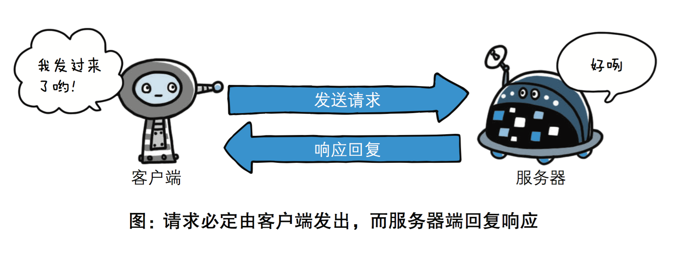

### (3) 无状态保存

HTTP是一种不保存状态,即无状态(stateless)协议。HTTP协议 自身不对请求和响应之间的通信状态进行保存。也就是说在HTTP这个 级别,协议对于发送过的请求或响应都不做持久化处理。

1.  1.  1.  1.  

使用HTTP协议,每当有新的请求发送时,就会有对应的新响应产 生。协议本身并不保留之前一切的请求或响应报文的信息。这是为了更快地处理大量事务,确保协议的可伸缩性,而特意把HTTP协议设计成 如此简单的。可是,随着Web的不断发展,因无状态而导致业务处理变得棘手 的情况增多了。比如,用户登录到一家购物网站,即使他跳转到该站的 其他页面后,也需要能继续保持登录状态。针对这个实例,网站为了能 够掌握是谁送出的请求,需要保存用户的状态。HTTP/1.1虽然是无状态协议,但为了实现期望的保持状态功能, 于是引入了Cookie技术。有了Cookie再用HTTP协议通信,就可以管 理状态了。有关Cookie的详细内容稍后讲解。

### 无连接

无连接的含义是限制每次连接只处理一个请求。服务器处理完客户的请求，并收到客户的应答后，即断开连接。采用这种方式可以节省传输时间。

## http请求协议与响应协议

http协议包含由浏览器发送数据到服务器需要遵循的请求协议与服务器发送数据到浏览器需要遵循的请求协议。用于HTTP协议交互的信被为HTTP报文。请求端(客户端)的HTTP报文 做请求报文,响应端(服务器端)的 做响应报文。HTTP报文本身是由多行数据构成的字 文本。 


### 请求协议

#### 请求格式


#### 请求方式: get与post请求

-   GET提交的数据会放在URL之后，以?分割URL和传输数据，参数之间以&相连，如EditBook?name=test1&id=123456. POST方法是把提交的数据放在HTTP包的请求体中.
-   GET提交的数据大小有限制（因为浏览器对URL的长度有限制），而POST方法提交的数据没有限制.
-   GET与POST请求在服务端获取请求数据方式不同。

### 响应协议

#### 响应格式


#### 响应状态码

状态码的职 是当客户端向服务器端发送请求时, 返回的请求 结果。借助状态码,用户可以知道服务器端是正常 理了请求,还是出 现了 。状态码如200 OK,以3位数字和原因 成。数字中的 一位指定了响应 别,后两位无分 。响应 别有以5种。

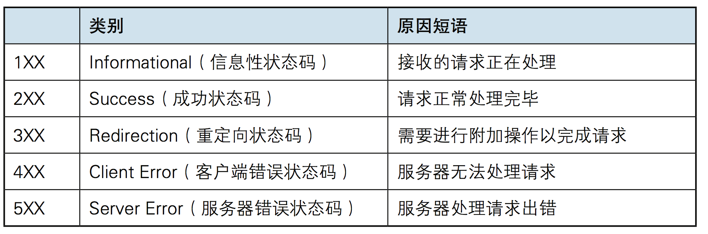

```python
import socket

sock=socket.socket()
sock.bind(("127.0.0.1",8808))
sock.listen(5)

while 1:
    print("server waiting.....")
    conn,addr=sock.accept()
    data=conn.recv(1024)
    print("data",data)

    # 读取html文件
    with open("login.html","rb") as f:
        data=f.read()

    conn.send((b"HTTP/1.1 200 OK\r\n\r\n%s"%data))
    conn.close()
```

login.html

```html
<!DOCTYPE html>
<html lang="en">
<head>
    <meta charset="UTF-8">
    <title>Title</title>
</head>
<body>

<form action="" method="post">
    用户名 <input type="text" name="user">
    密码 <input type="password" name="pwd">
    <input type="submit">
</form>

</body>
</html>
```

# 3 web框架

Web框架（Web framework）是一种开发框架，用来支持动态网站、网络应用和网络服务的开发。这大多数的web框架提供了一套开发和部署网站的方式，也为web行为提供了一套通用的方法。web框架已经实现了很多功能，开发人员使用框架提供的方法并且完成自己的业务逻辑，就能快速开发web应用了。浏览器和服务器的是基于HTTP协议进行通信的。也可以说web框架就是在以上十几行代码基础张扩展出来的，有很多简单方便使用的方法，大大提高了开发的效率。

### wsgiref模块

最简单的Web应用就是先把HTML用文件保存好，用一个现成的HTTP服务器软件，接收用户请求，从文件中读取HTML，返回。

如果要动态生成HTML，就需要把上述步骤自己来实现。不过，接受HTTP请求、解析HTTP请求、发送HTTP响应都是苦力活，如果我们自己来写这些底层代码，还没开始写动态HTML呢，就得花个把月去读HTTP规范。

正确的做法是底层代码由专门的服务器软件实现，我们用Python专注于生成HTML文档。因为我们不希望接触到TCP连接、HTTP原始请求和响应格式，所以，需要一个统一的接口协议来实现这样的服务器软件，让我们专心用Python编写Web业务。这个接口就是WSGI：Web Server Gateway Interface。而wsgiref模块就是python基于wsgi协议开发的服务模块。

```python
from wsgiref.simple_server import make_server

def application(environ, start_response):
    start_response('200 OK', [('Content-Type', 'text/html')])
    return [b'<h1>Hello, web!</h1>']


httpd = make_server('', 8080, application)

print('Serving HTTP on port 8000...')
# 开始监听HTTP请求:
httpd.serve_forever()
```

### DIY一个web框架


models.py

```python
import pymysql
#连接数据库
conn = pymysql.connect(host='127.0.0.1',port= 3306,user = 'root',passwd='',db='web') #db：库名
#创建游标
cur = conn.cursor()

sql='''
create table userinfo(
        id INT PRIMARY KEY ,
        name VARCHAR(32) ,
        password VARCHAR(32)
)

'''

cur.execute(sql)

#提交
conn.commit()
#关闭指针对象
cur.close()
#关闭连接对象
conn.close()
```

启动文件manage.py

```python
from wsgiref.simple_server import make_server

from app01.views import *
import urls


def routers():

    URLpattern=urls.URLpattern
    return URLpattern


def applications(environ,start_response):

    path=environ.get("PATH_INFO")
    start_response('200 OK', [('Content-Type', 'text/html'),('Charset', 'utf8')])
    urlpattern=routers()
    func=None
    for item in urlpattern:
        if path==item[0]:
            func=item[1]
            break
    if func:
        return [func(environ)]
    else:
        return [b"<h1>404!<h1>"]

if __name__ == '__main__':

    server=make_server("",8889,applications)
    print("server is working...")
    server.serve_forever()
```

urls.py

```python
from app01.views import *


URLpattern = (
    ("/login/", login),
)
```

views

```python
import pymysql

from urllib.parse import parse_qs


def login(request):

    if request.get("REQUEST_METHOD")=="POST":

        try:
            request_body_size = int(request.get('CONTENT_LENGTH', 0))
        except (ValueError):
            request_body_size = 0

        request_body = request['wsgi.input'].read(request_body_size)
        data = parse_qs(request_body)


        user=data.get(b"user")[0].decode("utf8")
        pwd=data.get(b"pwd")[0].decode("utf8")

        #连接数据库
        conn = pymysql.connect(host='127.0.0.1',port= 3306,user = 'root',passwd='',db='web') # db：库名
        #创建游标
        cur = conn.cursor()
        SQL="select * from userinfo WHERE NAME ='%s' AND PASSWORD ='%s'"%(user,pwd)
        cur.execute(SQL)

        if cur.fetchone():

            f=open("templates/backend.html","rb")
            data=f.read()
            data=data.decode("utf8")
            return data.encode("utf8")

        else:
             print("OK456")
             return b"user or pwd is wrong"

    else:
        f = open("templates/login.html", "rb")
        data = f.read()
        f.close()
        return data
```

login.html

```python
<!DOCTYPE html>
<html lang="en">
<head>
    <meta charset="UTF-8">
    <title>Title</title>
</head>
<body>

<h4>登录页面</h4>
<form action="" method="post">
     用户名 <input type="text" name="user">
     密码 <input type="text" name="pwd">
    <input type="submit">
</form>

</body>
</html>
```

backend.html

```html
<!DOCTYPE html>
<html lang="en">
<head>
    <meta charset="UTF-8">
    <title>Title</title>
</head>
<body>
<h4>welcome to oldboy!</h4>
</body>
</html>
```

yuan这个package就是一个web框架，下载这个web框架就可以快速实现一些简单的web功能，比如查看时间。

# 4 [4 Django简介](https://www.cnblogs.com/yuanchenqi/articles/8875659.html)

## MVC与MTV模型

## MVC

Web服务器开发领域里著名的MVC模式，所谓MVC就是把Web应用分为模型(M)，控制器(C)和视图(V)三层，他们之间以一种插件式的、松耦合的方式连接在一起，模型负责业务对象与数据库的映射(ORM)，视图负责与用户的交互(页面)，控制器接受用户的输入调用模型和视图完成用户的请求，其示意图如下所示：

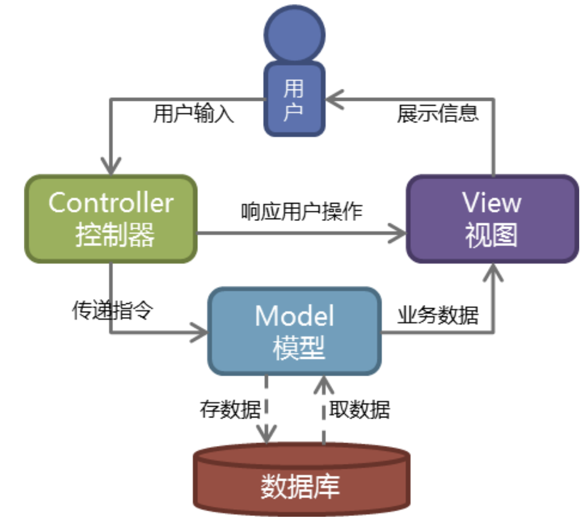

## MTV

Django的MTV模式本质上和MVC是一样的，也是为了各组件间保持松耦合关系，只是定义上有些许不同，Django的MTV分别是值：

-   M 代表模型（Model）： 负责业务对象和数据库的关系映射(ORM)。
-   T 代表模板 (Template)：负责如何把页面展示给用户(html)。
-   V 代表视图（View）：  负责业务逻辑，并在适当时候调用Model和Template。

除了以上三层之外，还需要一个URL分发器，它的作用是将一个个URL的页面请求分发给不同的View处理，View再调用相应的Model和Template，MTV的响应模式如下所示：

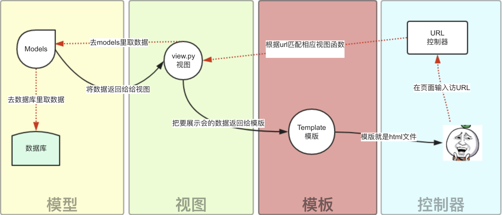

一般是用户通过浏览器向我们的服务器发起一个请求(request)，这个请求回去访问视图函数，（如果不涉及到数据调用，那么这个时候视图函数返回一个模板也就是一个网页给用户），视图函数调用模型，模型去数据库查找数据，然后逐级返回，视图函数把返回的数据填充到模板中空格中，最后返回网页给用户。


# Django的下载与基本命令

### 1、下载Django：

```
pip3 install django
pip3 install django==2.0.1
```

### 2、创建一个django project

```
#安装之后 文件所在位置
/Library/Frameworks/Python.framework/Versions/3.9/bin/django-admin.py  

django-admin.py startproject mysite
```

 当前目录下会生成mysite的工程，目录结构如下：

​    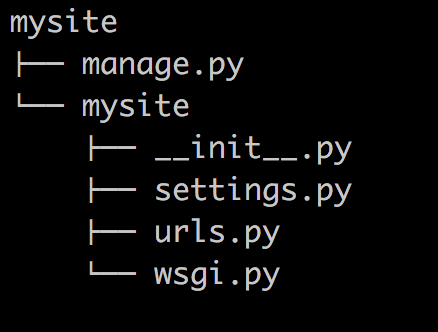

-   manage.py ----- Django项目里面的工具，通过它可以调用django shell和数据库等。
-   settings.py ---- 包含了项目的默认设置，包括数据库信息，调试标志以及其他一些工作的变量。
-   urls.py ----- 负责把URL模式映射到应用程序。

### 3、在mysite目录下创建应用

```
python manage.py startapp blog
```

​    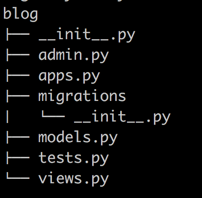

### 4、启动django项目

```
python manage.py runserver 8080
```

​    这样我们的django就启动起来了！当我们访问：http://127.0.0.1:8080/时就可以看到：

​    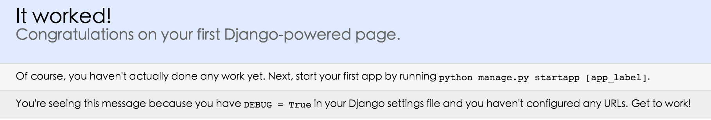

# 基于Django实现的一个简单示例

###  url控制器

```python
from django.contrib import admin
from django.urls import path


from app01 import views

urlpatterns = [
    path('admin/', admin.site.urls),
    path('index/',views.index),
]
```


### 视图

```python
from django.shortcuts import render

# Create your views here.


def index(request):

    import datetime
    now=datetime.datetime.now()
    ctime=now.strftime("%Y-%m-%d %X")

    return render(request,"index.html",{"ctime":ctime})
```


### 模板

```html
<!DOCTYPE html>
<html lang="en">
<head>
    <meta charset="UTF-8">
    <title>Title</title>
</head>
<body>

<h4>当前时间:{{ ctime }}</h4>

</body>
</html>

```


执行效果如下：

 

 ```python
 #小提示:
 #settings.py 配置 应用名称 和templates 路径
 
 INSTALLED_APPS = [
     'django.contrib.admin',
     'django.contrib.auth',
     'django.contrib.contenttypes',
     'django.contrib.sessions',
     'django.contrib.messages',
     'django.contrib.staticfiles',
     'blog'   # 创建的应用名称
 ]
 
 
 TEMPLATES = [
     {
         'BACKEND': 'django.template.backends.django.DjangoTemplates',
         'DIRS': [os.path.join(BASE_DIR,'templates')],  # templates 目录路径
         'APP_DIRS': True,
         'OPTIONS': {
             'context_processors': [
                 'django.template.context_processors.debug',
                 'django.template.context_processors.request',
                 'django.contrib.auth.context_processors.auth',
                 'django.contrib.messages.context_processors.messages',
             ],
         },
     },
 ]
 
 
 # 在pycharm 中导入老师的代码
 # 用pycharm 打开终端,在项目目录下 运行运行 
 python3.9 manage.py runserver
 #配置到pycharm中直接点运行
 open ---> new window  -- > edit Configurations... -->配置 host 127.0.0.1
 # 数据库迁移
 python manage.py makemigrations   # 创建数据库的映射关系
 python manage.py migrate  # 根据上条命令生成的映射关系，在数据库中生成相应的表
 ```


# 5 Django-2的路由层(URLconf)


URL配置(URLconf)就像Django 所支撑网站的目录。它的本质是URL与要为该URL调用的视图函数之间的映射表；你就是以这种方式告诉Django，对于客户端发来的某个URL调用哪一段逻辑代码对应执行。

##  简单的路由配置


```python
from django.urls import path,re_path

from app01 import views

urlpatterns = [
    re_path(r'^articles/2003/$', views.special_case_2003),
    re_path(r'^articles/([0-9]{4})/$', views.year_archive),
    re_path(r'^articles/([0-9]{4})/([0-9]{2})/$', views.month_archive),
    re_path(r'^articles/([0-9]{4})/([0-9]{2})/([0-9]+)/$', views.article_detail),
]

```

注意：

-   若要从URL 中捕获一个值，只需要在它周围放置一对圆括号。
-   不需要添加一个前导的反斜杠，因为每个URL 都有。例如，应该是`^articles` 而不是 `^/articles`。 
-   每个正则表达式前面的'r' 是可选的但是建议加上。它告诉Python 这个字符串是“原始的” —— 字符串中任何字符都不应该转义

示例：

```
    '''
 一些请求的例子：

/articles/2005/03/ 请求将匹配列表中的第三个模式。Django 将调用函数views.month_archive(request, '2005', '03')。
/articles/2005/3/ 不匹配任何URL 模式，因为列表中的第三个模式要求月份应该是两个数字。
/articles/2003/ 将匹配列表中的第一个模式不是第二个，因为模式按顺序匹配，第一个会首先测试是否匹配。请像这样自由插入一些特殊的情况来探测匹配的次序。
/articles/2003 不匹配任何一个模式，因为每个模式要求URL 以一个反斜线结尾。
/articles/2003/03/03/ 将匹配最后一个模式。Django 将调用函数views.article_detail(request, '2003', '03', '03')。
   
    '''
```


## 有名分组

上面的示例使用简单的、没有命名的正则表达式组（通过圆括号）来捕获URL 中的值并以位置 参数传递给视图。在更高级的用法中，可以使用命名的正则表达式组来捕获URL 中的值并以关键字 参数传递给视图。

在Python 正则表达式中，命名正则表达式组的语法是`(?P<name>pattern)`，其中`name` 是组的名称，`pattern` 是要匹配的模式。

下面是以上URLconf 使用命名组的重写：

```
from django.urls import path,re_path

from app01 import views

urlpatterns = [
    re_path(r'^articles/2003/$', views.special_case_2003),
    re_path(r'^articles/(?P<year>[0-9]{4})/$', views.year_archive),
    re_path(r'^articles/(?P<year>[0-9]{4})/(?P<month>[0-9]{2})/$', views.month_archive),
    re_path(r'^articles/(?P<year>[0-9]{4})/(?P<month>[0-9]{2})/(?P<day>[0-9]{2})/$', views.article_detail),
]
```


这个实现与前面的示例完全相同，只有一个细微的差别：捕获的值作为关键字参数而不是位置参数传递给视图函数。例如：

```
    '''
    /articles/2005/03/ 请求将调用views.month_archive(request, year='2005', month='03')函数，而不是views.month_archive(request, '2005', '03')。
    /articles/2003/03/03/ 请求将调用函数views.article_detail(request, year='2003', month='03', day='03')。

    '''
```

在实际应用中，这意味你的URLconf 会更加明晰且不容易产生参数顺序问题的错误 —— 你可以在你的视图函数定义中重新安排参数的顺序。当然，这些好处是以简洁为代价；

## 分发

```
'''
At any point, your urlpatterns can “include” other URLconf modules. This
essentially “roots” a set of URLs below other ones.

'''

from django.urls import path,re_path,include
from app01 import views

urlpatterns = [
   re_path(r'^admin/', admin.site.urls),
   re_path(r'^blog/', include('blog.urls')),   # 这个blog/路径分发给 blog.urls 文件里处理
   re_path(r'^', include('blog.urls')),   # 这个跟目录路径分发给 blog.urls 文件里处理
	 # re_path(r"^app02/",include(("app02.urls","app02"))), #第二个参数对应的是应用名称-名称空间

]
```


## 反向解析

在使用Django 项目时，一个常见的需求是获得URL 的最终形式，以用于嵌入到生成的内容中（视图中和显示给用户的URL等）或者用于处理服务器端的导航（重定向等）。人们强烈希望不要硬编码这些URL（费力、不可扩展且容易产生错误）或者设计一种与URLconf 毫不相关的专门的URL 生成机制，因为这样容易导致一定程度上产生过期的URL。

在需要URL 的地方，对于不同层级，Django 提供不同的工具用于URL 反查：

-   在模板中：使用url 模板标签。
-   在Python 代码中：使用`from django.urls import reverse()函数` 

urls.py:

```
from django.conf.urls import url

from . import views

urlpatterns = [
    #...   name 是起了一个别名, 在模板中引用 
    re_path(r'^articles/([0-9]{4})/$', views.year_archive, name='news-year-archive'),
    #...
]
```


在模板中：

```
<a href="">2012 Archive</a>  # 反向解析

<ul>

<li><a href="">{{ yearvar }} Archive</a></li>

</ul>
```


在python中：

```
from django.urls import reverse     #导入反向解析函数
from django.http import HttpResponseRedirect

def redirect_to_year(request):
    # ...
    year = 2006
    # ...
    return HttpResponseRedirect(reverse('news-year-archive', args=(year,)))   # 同redirect("/path/")
```


当命名你的URL 模式时，请确保使用的名称不会与其它应用中名称冲突。如果你的URL 模式叫做`comment`，而另外一个应用中也有一个同样的名称，当你在模板中使用这个名称的时候不能保证将插入哪个URL。在URL 名称中加上一个前缀，比如应用的名称，将减少冲突的可能。我们建议使用`myapp-comment` 而不是`comment`。

## 名称空间

命名空间（英语：Namespace）是表示标识符的可见范围。一个标识符可在多个命名空间中定义，它在不同命名空间中的含义是互不相干的。这样，在一个新的命名空间中可定义任何标识符，它们不会与任何已有的标识符发生冲突，因为已有的定义都处于其它命名空间中。

由于name没有作用域，Django在反解URL时，会在项目全局顺序搜索，当查找到第一个name指定URL时，立即返回

我们在开发项目时，会经常使用name属性反解出URL，当不小心在不同的app的urls中定义相同的name时，可能会导致URL反解错误，为了避免这种事情发生，引入了命名空间。

#### **project的urls.py:**

```
urlpatterns = [
    re_path(r'^admin/', admin.site.urls),
    #re_path(r'^app01/', include("app01.urls",namespace="app01")), #报错
    #re_path(r'^app02/', include("app02.urls",namespace="app02")), #
    re_path(r'^app01/', include(("app01.urls","app01"))), #指定名称空间 app01
    re_path(r'^app02/', include(("app02.urls","app02"))), 

]
```

#### **app01.urls:**

```
urlpatterns = [
    re_path(r'^index/', index,name="index"),   # name 别名
]
```

#### **app02.urls:**

```
urlpatterns = [
    re_path(r'^index/', index,name="index"),  # name 别名
]
```

#### **app01.views** 

```
from django.core.urlresolvers import reverse

def index(request):

    return  HttpResponse(reverse("app01:index"))  #reverse反向解析("名称空间app01下的index")
```

#### app02.views

```
from django.core.urlresolvers import reverse

def index(request):

    return  HttpResponse(reverse("app02:index")) # 指定名称空间app02 下的index
```

## django2.0版的path

思考情况如下：

```
urlpatterns = [  
    re_path('articles/(?P<year>[0-9]{4})/', year_archive),  
    re_path('article/(?P<article_id>[a-zA-Z0-9]+)/detail/', detail_view),  
    re_path('articles/(?P<article_id>[a-zA-Z0-9]+)/edit/', edit_view),  
    re_path('articles/(?P<article_id>[a-zA-Z0-9]+)/delete/', delete_view),  
]
```

考虑下这样的两个问题：

第一个问题，函数 `year_archive` 中year参数是字符串类型的，因此需要先转化为整数类型的变量值，当然`year=int(year)` 不会有诸如如TypeError或者ValueError的异常。那么有没有一种方法，在url中，使得这一转化步骤可以由Django自动完成？

第二个问题，三个路由中article_id都是同样的正则表达式，但是你需要写三遍，当之后article_id规则改变后，需要同时修改三处代码，那么有没有一种方法，只需修改一处即可？

在Django2.0中，可以使用 `path` 解决以上的两个问题。

### 基本示例

这是一个简单的例子：

```
from django.urls import path  
from . import views  
urlpatterns = [  
    path('articles/2003/', views.special_case_2003),  
    # 内置转换器转换成int类型<int:year> 同时也是有名分组
    path('articles/<int:year>/', views.year_archive),   
    path('articles/<int:year>/<int:month>/', views.month_archive),  
    path('articles/<int:year>/<int:month>/<slug>/', views.article_detail),  
]  
```


基本规则：

-   使用尖括号(`<>`)从url中捕获值。
-   捕获值中可以包含一个转化器类型（converter type），比如使用 `<int:name>` 捕获一个整数变量。若果没有转化器，将匹配任何字符串，当然也包括了 `/` 字符。
-   无需添加前导斜杠。

以下是根据 [2.0官方文档](https://docs.djangoproject.com/en/2.0/topics/http/urls/#example) 而整理的示例分析表：

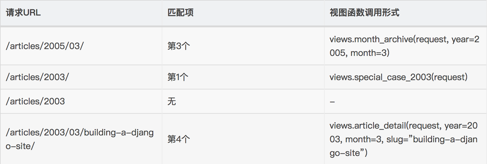

### path转化器

>   文档原文是Path converters，暂且翻译为转化器。

Django默认支持以下5个转化器：

-   str,匹配除了路径分隔符（`/`）之外的非空字符串，这是默认的形式
-   int,匹配正整数，包含0。
-   slug,匹配字母、数字以及横杠、下划线组成的字符串。
-   uuid,匹配格式化的uuid，如 075194d3-6885-417e-a8a8-6c931e272f00。
-   path,匹配任何非空字符串，包含了路径分隔符

### 注册自定义转化器

对于一些复杂或者复用的需要，可以定义自己的转化器。转化器是一个类或接口，它的要求有三点：

-   `regex` 类属性，字符串类型

-   `to_python(self, value)` 方法，value是由类属性 `regex` 所匹配到的字符串，返回具体的Python变量值，以供Django传递到对应的视图函数中。
-   `to_url(self, value)` 方法，和 `to_python` 相反，value是一个具体的Python变量值，返回其字符串，通常用于url反向引用。

例子：

```
# 注册文件建议写在 应用目录里 写urlconvert.py
class FourDigitYearConverter:  
    regex = '[0-9]{4}'   # regex 固定属性写法
    def to_python(self, value):  
        return int(value)  
    def to_url(self, value):   # 反向解析  
        return '%04d' % value  
```

使用`register_converter` 将其注册到URL配置中：

```
# 在主项目的 urls.py注册
from django.urls import register_converter, path    # 导入 register_converter
from app01.urlconvert import FourDigitYearConverter  # 导入app01里写的转化器方法
from . import converters, views  
register_converter(converters.FourDigitYearConverter, 'yyyy')  
register_converter(FourDigitYearConverter, 'yy')  # 注册转化器方法 别名 yy
urlpatterns = [  
    path('articles/2003/', views.special_case_2003),  
    path('articles/<yy:year>/', views.year_archive),   # yy是调用的自定义的转换器
    ...  
]  
```


# [6 Django的视图层](https://www.cnblogs.com/yuanchenqi/articles/8876856.html) 

## 视图函数

一个视图函数，简称视图，是一个简单的Python 函数，它接受Web请求并且返回Web响应。响应可以是一张网页的HTML内容，一个重定向，一个404错误，一个XML文档，或者一张图片. . . 是任何东西都可以。无论视图本身包含什么逻辑，都要返回响应。代码写在哪里也无所谓，只要它在你的Python目录下面。除此之外没有更多的要求了——可以说“没有什么神奇的地方”。为了将代码放在某处，约定是将视图放置在项目或应用程序目录中的名为`views.py`的文件中。

下面是一个返回当前日期和时间作为HTML文档的视图：

```
from django.shortcuts import render, HttpResponse, HttpResponseRedirect, redirect
import datetime

def current_datetime(request):
    now = datetime.datetime.now()
    html = "<html><body>It is now %s.</body></html>" % now
    return HttpResponse(html)
```

让我们逐行阅读上面的代码：

-   首先，我们从 `django.shortcuts`模块导入了`HttpResponse`类，以及Python的`datetime`库。

-   接着，我们定义了`current_datetime`函数。它就是视图函数。每个视图函数都使用`HttpRequest`对象作为第一个参数，并且通常称之为`request`。

    注意,视图函数的名称并不重要；不需要用一个统一的命名方式来命名，以便让Django识别它。我们将其命名为`current_datetime`，是因为这个名称能够精确地反映出它的功能。

-   这个视图会返回一个`HttpResponse`对象，其中包含生成的响应。每个视图函数都负责返回一个`HttpResponse`对象。

#### 

视图层，熟练掌握两个对象即可：请求对象(request)和响应对象(HttpResponse)

## HttpRequest对象

### request属性 　　

django将请求报文中的请求行、首部信息、内容主体封装成 HttpRequest 类中的属性。 除了特殊说明的之外，其他均为只读的。

```
/*

1.HttpRequest.GET

　　一个类似于字典的对象，包含 HTTP GET 的所有参数。详情请参考 QueryDict 对象。

2.HttpRequest.POST

　　一个类似于字典的对象，如果请求中包含表单数据，则将这些数据封装成 QueryDict 对象。

　　POST 请求可以带有空的 POST 字典 —— 如果通过 HTTP POST 方法发送一个表单，但是表单中没有任何的数据，QueryDict 对象依然会被创建。
   因此，不应该使用 if request.POST  来检查使用的是否是POST 方法；应该使用 if request.method == "POST"
　　另外：如果使用 POST 上传文件的话，文件信息将包含在 FILES 属性中。
   
   注意：键值对的值是多个的时候,比如checkbox类型的input标签，select标签，需要用：
        request.POST.getlist("hobby")

3.HttpRequest.body

　　一个字符串，代表请求报文的主体。在处理非 HTTP 形式的报文时非常有用，例如：二进制图片、XML,Json等。
　　但是，如果要处理表单数据的时候，推荐还是使用 HttpRequest.POST 。


4.HttpRequest.path

　　一个字符串，表示请求的路径组件（不含域名）。
　　例如："/music/bands/the_beatles/"

5.HttpRequest.method

　　一个字符串，表示请求使用的HTTP 方法。必须使用大写。
　　例如："GET"、"POST"


6.HttpRequest.encoding

　　一个字符串，表示提交的数据的编码方式（如果为 None 则表示使用 DEFAULT_CHARSET 的设置，默认为 'utf-8'）。
   这个属性是可写的，你可以修改它来修改访问表单数据使用的编码。
   接下来对属性的任何访问（例如从 GET 或 POST 中读取数据）将使用新的 encoding 值。
   如果你知道表单数据的编码不是 DEFAULT_CHARSET ，则使用它。


7.HttpRequest.META

 　　一个标准的Python 字典，包含所有的HTTP 首部。具体的头部信息取决于客户端和服务器，下面是一些示例：

    CONTENT_LENGTH —— 请求的正文的长度（是一个字符串）。
    CONTENT_TYPE —— 请求的正文的MIME 类型。
    HTTP_ACCEPT —— 响应可接收的Content-Type。
    HTTP_ACCEPT_ENCODING —— 响应可接收的编码。
    HTTP_ACCEPT_LANGUAGE —— 响应可接收的语言。
    HTTP_HOST —— 客服端发送的HTTP Host 头部。
    HTTP_REFERER —— Referring 页面。
    HTTP_USER_AGENT —— 客户端的user-agent 字符串。
    QUERY_STRING —— 单个字符串形式的查询字符串（未解析过的形式）。
    REMOTE_ADDR —— 客户端的IP 地址。
    REMOTE_HOST —— 客户端的主机名。
    REMOTE_USER —— 服务器认证后的用户。
    REQUEST_METHOD —— 一个字符串，例如"GET" 或"POST"。
    SERVER_NAME —— 服务器的主机名。
    SERVER_PORT —— 服务器的端口（是一个字符串）。
 　　从上面可以看到，除 CONTENT_LENGTH 和 CONTENT_TYPE 之外，请求中的任何 HTTP 首部转换为 META 的键时，
    都会将所有字母大写并将连接符替换为下划线最后加上 HTTP_  前缀。
    所以，一个叫做 X-Bender 的头部将转换成 META 中的 HTTP_X_BENDER 键。

8.HttpRequest.FILES

　　一个类似于字典的对象，包含所有的上传文件信息。
   FILES 中的每个键为<input type="file" name="" /> 中的name，值则为对应的数据。
　　注意，FILES 只有在请求的方法为POST 且提交的<form> 带有enctype="multipart/form-data" 的情况下才会
   包含数据。否则，FILES 将为一个空的类似于字典的对象。


9.HttpRequest.COOKIES

　　一个标准的Python 字典，包含所有的cookie。键和值都为字符串。


10.HttpRequest.session

 　　一个既可读又可写的类似于字典的对象，表示当前的会话。只有当Django 启用会话的支持时才可用。
    完整的细节参见会话的文档。


11.HttpRequest.user(用户认证组件下使用)

　　一个 AUTH_USER_MODEL 类型的对象，表示当前登录的用户。

　　如果用户当前没有登录，user 将设置为 django.contrib.auth.models.AnonymousUser 的一个实例。你可以通过 is_authenticated() 区分它们。

    例如：

    if request.user.is_authenticated():
        # Do something for logged-in users.
    else:
        # Do something for anonymous users.


     　　user 只有当Django 启用 AuthenticationMiddleware 中间件时才可用。

     -------------------------------------------------------------------------------------

    匿名用户
    class models.AnonymousUser

    django.contrib.auth.models.AnonymousUser 类实现了django.contrib.auth.models.User 接口，但具有下面几个不同点：

    id 永远为None。
    username 永远为空字符串。
    get_username() 永远返回空字符串。
    is_staff 和 is_superuser 永远为False。
    is_active 永远为 False。
    groups 和 user_permissions 永远为空。
    is_anonymous() 返回True 而不是False。
    is_authenticated() 返回False 而不是True。
    set_password()、check_password()、save() 和delete() 引发 NotImplementedError。
    New in Django 1.8:
    新增 AnonymousUser.get_username() 以更好地模拟 django.contrib.auth.models.User。

*/
```


### request常用方法


```
/*

1.HttpRequest.get_full_path()

　　返回 path，如果可以将加上查询字符串。

　　例如："/music/bands/the_beatles/?print=true"


2.HttpRequest.is_ajax()

　　如果请求是通过XMLHttpRequest 发起的，则返回True，方法是检查 HTTP_X_REQUESTED_WITH 相应的首部是否是字符串'XMLHttpRequest'。

　　大部分现代的 JavaScript 库都会发送这个头部。如果你编写自己的 XMLHttpRequest 调用（在浏览器端），你必须手工设置这个值来让 is_ajax() 可以工作。

　　如果一个响应需要根据请求是否是通过AJAX 发起的，并且你正在使用某种形式的缓存例如Django 的 cache middleware，
   你应该使用 vary_on_headers('HTTP_X_REQUESTED_WITH') 装饰你的视图以让响应能够正确地缓存。

*/

```


## HttpResponse对象

响应对象主要有三种形式：

-   HttpResponse()
-   render()
-   redirect()

HttpResponse()括号内直接跟一个具体的字符串作为响应体，比较直接很简单，所以这里主要介绍后面两种形式。

### render()

```
render(request, template_name[, context]）` `结合一个给定的模板和一个给定的上下文字典，并返回一个渲染后的 HttpResponse 对象。
参数：
     request： 用于生成响应的请求对象。

     template_name：要使用的模板的完整名称，可选的参数

     context：添加到模板上下文的一个字典。默认是一个空字典。如果字典中的某个值是可调用的，视图将在渲染模板之前调用它。

render方法就是将一个模板页面中的模板语法进行渲染，最终渲染成一个html页面作为响应体。

```

### redirect()

传递要重定向的一个硬编码的URL

```
def my_view(request):
    ...
    return redirect('/some/url/')
```

也可以是一个完整的URL：

```
def my_view(request):
    ...
    return redirect('http://example.com/')　
```

key：两次请求　

```
1）301和302的区别。

　　301和302状态码都表示重定向，就是说浏览器在拿到服务器返回的这个状态码后会自动跳转到一个新的URL地址，这个地址可以从响应的Location首部中获取
  （用户看到的效果就是他输入的地址A瞬间变成了另一个地址B）——这是它们的共同点。

　　他们的不同在于。301表示旧地址A的资源已经被永久地移除了（这个资源不可访问了），搜索引擎在抓取新内容的同时也将旧的网址交换为重定向之后的网址；

　　302表示旧地址A的资源还在（仍然可以访问），这个重定向只是临时地从旧地址A跳转到地址B，搜索引擎会抓取新的内容而保存旧的网址。 SEO302好于301

2）重定向原因：
（1）网站调整（如改变网页目录结构）；
（2）网页被移到一个新地址；
（3）网页扩展名改变(如应用需要把.php改成.Html或.shtml)。
        这种情况下，如果不做重定向，则用户收藏夹或搜索引擎数据库中旧地址只能让访问客户得到一个404页面错误信息，访问流量白白丧失；再者某些注册了多个域名的
    网站，也需要通过重定向让访问这些域名的用户自动跳转到主站点等。
    
```


用redirect可以解释APPEND_SLASH的用法！

```
小提示:
HttpResponse() #用于回复一个字符串 HttpResponse("aaa")  开发中很少用.
```


 # [7 Django的模板层](https://www.cnblogs.com/yuanchenqi/articles/8876892.html)

你可能已经注意到我们在例子视图中返回文本的方式有点特别。 也就是说，HTML被直接硬编码在 Python代码之中。

```
def current_datetime(request):
    now = datetime.datetime.now()
    html = "<html><body>It is now %s.</body></html>" % now
    return HttpResponse(html)
```

尽管这种技术便于解释视图是如何工作的，但直接将HTML硬编码到你的视图里却并不是一个好主意。 让我们来看一下为什么：

-   对页面设计进行的任何改变都必须对 Python 代码进行相应的修改。 站点设计的修改往往比底层 Python 代码的修改要频繁得多，因此如果可以在不进行 Python 代码修改的情况下变更设计，那将会方便得多。

-   Python 代码编写和 HTML 设计是两项不同的工作，大多数专业的网站开发环境都将他们分配给不同的人员（甚至不同部门）来完成。 设计者和HTML/CSS的编码人员不应该被要求去编辑Python的代码来完成他们的工作。

-   程序员编写 Python代码和设计人员制作模板两项工作同时进行的效率是最高的，远胜于让一个人等待另一个人完成对某个既包含 Python又包含 HTML 的文件的编辑工作。

基于这些原因，将页面的设计和Python的代码分离开会更干净简洁更容易维护。 我们可以使用 Django的 *模板系统* (Template System)来实现这种模式，这就是本章要具体讨论的问题。

```
python的模板：HTML代码＋模板语法
```


```
def current_time(req):
    # ================================原始的视图函数
    # import datetime
    # now=datetime.datetime.now()
    # html="<html><body>现在时刻：<h1>%s.</h1></body></html>" %now


    # ================================django模板修改的视图函数
    # from django.template import Template,Context
    # now=datetime.datetime.now()
    # t=Template('<html><body>现在时刻是:<h1>{{current_date}}</h1></body></html>')
    # #t=get_template('current_datetime.html')
    # c=Context({'current_date':str(now)})
    # html=t.render(c)
    #
    # return HttpResponse(html)


    #另一种写法(推荐)
    import datetime
    now=datetime.datetime.now()
    return render(req, 'current_datetime.html', {'current_date':str(now)[:19]})
```


## 1 模板语法之变量

在 Django 模板中遍历复杂数据结构的关键是句点字符, 语法： 

```
{{var_name}}
```

**views.py：**

```python
def index(request):
    import datetime
    s="hello"
    l=[111,222,333]    # 列表
    dic={"name":"yuan","age":18}  # 字典
    date = datetime.date(1993, 5, 2)   # 日期对象
 
    class Person(object):
        def __init__(self,name):
            self.name=name
 
    person_yuan=Person("yuan")  # 自定义类对象
    person_egon=Person("egon")
    person_alex=Person("alex")
 
    person_list=[person_yuan,person_egon,person_alex]
 
    return render(request,"index.html",{"l":l,"dic":dic,"date":date,"person_list":person_list})
    
```


***template：** 

```
<h4>{{s}}</h4>
<h4>列表:{{ l.0 }}</h4>
<h4>列表:{{ l.2 }}</h4>
<h4>字典:{{ dic.name }}</h4>
<h4>日期:{{ date.year }}</h4>
<h4>类对象列表:{{ person_list.0.name }}</h4>
```

注意：句点符也可以用来引用对象的方法(无参数方法):

```
<h4>字典:{{ dic.name.upper }}<``/``h4>
```

## 2 模板之过滤器

语法：

```
{{obj|filter__name:param}}
```

### `default`

如果一个变量是false或者为空，使用给定的默认值。否则，使用变量的值。例如：

```
{{ value|default:"nothing" }}

```

### length

返回值的长度。它对字符串和列表都起作用。例如：

```
{{ value|length }}
```

如果 value 是 ['a', 'b', 'c', 'd']，那么输出是 4。

### `filesizeformat`

将值格式化为一个 “人类可读的” 文件尺寸 （例如 `'13 KB'`, `'4.1 MB'`, `'102 bytes'`, 等等）。例如：

```
{{ value|filesizeformat }}

```

如果 `value` 是 123456789，输出将会是 `117.7 MB`。　　

### date

如果 value=datetime.datetime.now()

```
{{ value|date:"Y-m-d" }}　　
```

### slice

如果 value="hello world"

```
{{ value|slice:"2:-1" }}
```

### truncatechars[ ](http://python.usyiyi.cn/documents/django_182/ref/templates/builtins.html#truncatechars)

如果字符串字符多于指定的字符数量，那么会被截断。截断的字符串将以可翻译的省略号序列（“...”）结尾。

**参数：**要截断的字符数

例如：

```
{{ value|truncatechars:9 }}
```

### safe

Django的模板中会对HTML标签和JS等语法标签进行自动转义，原因显而易见，这样是为了安全。但是有的时候我们可能不希望这些HTML元素被转义，比如我们做一个内容管理系统，后台添加的文章中是经过修饰的，这些修饰可能是通过一个类似于FCKeditor编辑加注了HTML修饰符的文本，如果自动转义的话显示的就是保护HTML标签的源文件。为了在Django中关闭HTML的自动转义有两种方式，如果是一个单独的变量我们可以通过过滤器“|safe”的方式告诉Django这段代码是安全的不必转义。比如：

```
value="<a href="">点击</a>"

{{ value|safe}}
```

这里简单介绍一些常用的模板的过滤器，[更多详见](http://python.usyiyi.cn/translate/django_182/ref/templates/builtins.html#ref-templates-builtins-tags)

## 3 模板之标签　

标签看起来像是这样的： ``。标签比变量更加复杂：一些在输出中创建文本，一些通过循环或逻辑来控制流程，一些加载其后的变量将使用到的额外信息到模版中。一些标签需要开始和结束标签 （例如` ...`标签 内容 ... ）。

### **for标签**

遍历每一个元素：

```

    <p>{{ person.name }}</p>

```

可以利用``反向完成循环。

遍历一个字典：

```

    <p>{{ key }}:{{ val }}</p>

```

注：循环序号可以通过｛｛forloop｝｝显示　　

```
forloop.counter            The current iteration of the loop (1-indexed)
forloop.counter0           The current iteration of the loop (0-indexed)
forloop.revcounter         The number of iterations from the end of the loop (1-indexed)
forloop.revcounter0        The number of iterations from the end of the loop (0-indexed)
forloop.first              True if this is the first time through the loop
forloop.last               True if this is the last time through the loop
```

### for ... empty[ ](http://python.usyiyi.cn/documents/django_182/ref/templates/builtins.html#for-empty)

`for` 标签带有一个可选的`` 从句，以便在给出的组是空的或者没有被找到时，可以有所操作。

```

    <p>{{ person.name }}</p>


    <p>sorry,no person here</p>

```

### if 标签

``会对一个变量求值，如果它的值是“True”（存在、不为空、且不是boolean类型的false值），对应的内容块会输出。


```

    <p>无效</p>

    <p>优秀</p>

    <p>凑活吧</p>

```


### with[ ](http://python.usyiyi.cn/documents/django_182/ref/templates/builtins.html#with)

使用一个简单地名字缓存一个复杂的变量，当你需要使用一个“昂贵的”方法（比如访问数据库）很多次的时候是非常有用的

例如：

```

    {{ total }} employee{{ total|pluralize }}

```

### csrf_token

这个标签用于跨站请求伪造保护

这叫跨站请求伪造，Cross Site Request Forgery（**CSRF**）

## 4 自定义标签和过滤器

1、在settings中的INSTALLED_APPS配置当前app，不然django无法找到自定义的simple_tag.

2、在app中创建templatetags模块(模块名只能是templatetags)

3、创建任意 .py 文件，如：my_tags.py

```python
from django import template
from django.utils.safestring import mark_safe
 
register = template.Library()   #register的名字是固定的,不可改变
 
 
@register.filter
def filter_multi(v1,v2):
    return  v1 * v2
<br>
@register.simple_tag
def simple_tag_multi(v1,v2):
    return  v1 * v2
<br>
@register.simple_tag
def my_input(id,arg):
    result = "<input type='text' id='%s' class='%s' />" %(id,arg,)
    return mark_safe(result)
```


**4、在使用自定义simple_tag和filter的html文件中导入之前创建的 my_tags.py**

```
　

```

**5、使用simple_tag和filter（如何调用）**

```
-------------------------------.html
  
      
# num=12
{{ num|filter_multi:2 }} #24
 
{{ num|filter_multi:"[22,333,4444]" }}
 
  参数不限,但不能放在if for语句中

```

注意：filter可以用在if等语句后，simple_tag不可以

```

    {{ num|filter_multi:30 }}

```

```
小笔记:
自定义的过滤器最多两个参数,
自定义标签不限制参数
```


## 5 模板继承 (extend)

Django模版引擎中最强大也是最复杂的部分就是模版继承了。模版继承可以让您创建一个基本的“骨架”模版，它包含您站点中的全部元素，并且可以定义能够被子模版覆盖的 blocks 。

通过从下面这个例子开始，可以容易的理解模版继承：


```html
<!DOCTYPE html>
<html lang="en">
<head>
    <link rel="stylesheet" href="style.css" />
    <title>My amazing site</title>
</head>

<body>
    <div id="sidebar">
        
        <ul>
            <li><a href="/">Home</a></li>
            <li><a href="/blog/">Blog</a></li>
        </ul>
        
    </div>

    <div id="content">
        
    </div>
</body>
</html>
```


这个模版，我们把它叫作 `base.html`， 它定义了一个可以用于两列排版页面的简单HTML骨架。“子模版”的工作是用它们的内容填充空的blocks。

在这个例子中， `block` 标签定义了三个可以被子模版内容填充的block。 `block` 告诉模版引擎： 子模版可能会覆盖掉模版中的这些位置。

子模版可能看起来是这样的：

```

 
My amazing blog
 


    <h2>{{ entry.title }}</h2>
    <p>{{ entry.body }}</p>


```

`extends` 标签是这里的关键。它告诉模版引擎，这个模版“继承”了另一个模版。当模版系统处理这个模版时，首先，它将定位父模版——在此例中，就是“base.html”。

那时，模版引擎将注意到 `base.html` 中的三个 `block` 标签，并用子模版中的内容来替换这些block。根据 `blog_entries` 的值，输出可能看起来是这样的：

```html
<!DOCTYPE html>
<html lang="en">
<head>
    <link rel="stylesheet" href="style.css" />
    <title>My amazing blog</title>
</head>
 
<body>
    <div id="sidebar">
        <ul>
            <li><a href="/">Home</a></li>
            <li><a href="/blog/">Blog</a></li>
        </ul>
    </div>
 
    <div id="content">
        <h2>Entry one</h2>
        <p>This is my first entry.</p>
 
        <h2>Entry two</h2>
        <p>This is my second entry.</p>
    </div>
</body>
</html>
```

请注意，子模版并没有定义 `sidebar` block，所以系统使用了父模版中的值。父模版的 `` 标签中的内容总是被用作备选内容（fallback）。

这种方式使代码得到最大程度的复用，并且使得添加内容到共享的内容区域更加简单，例如，部分范围内的导航。

这里是使用继承的一些提示：

-   如果你在模版中使用 `` 标签，它必须是模版中的第一个标签。其他的任何情况下，模版继承都将无法工作。

-   在base模版中设置越多的 `` 标签越好。请记住，子模版不必定义全部父模版中的blocks，所以，你可以在大多数blocks中填充合理的默认内容，然后，只定义你需要的那一个。多一点钩子总比少一点好。

-   如果你发现你自己在大量的模版中复制内容，那可能意味着你应该把内容移动到父模版中的一个 `` 中。

-   If you need to get the content of the block from the parent template, the `{{ block.super }}` variable will do the trick. This is useful if you want to add to the contents of a parent block instead of completely overriding it. Data inserted using `{{ block.super }}` will not be automatically escaped (see the next section), since it was already escaped, if necessary, in the parent template.

-   为了更好的可读性，你也可以给你的 `` 标签一个 *名字* 。例如：

    ```python
    
    ...
    　　
    ```

    在大型模版中，这个方法帮你清楚的看到哪一个　 `` 标签被关闭了。

-   不能在一个模版中定义多个相同名字的 `block` 标签。

# [8 Django 模型层(1)](https://www.cnblogs.com/yuanchenqi/articles/8933283.html)


# ORM简介

-   MVC或者MVC框架中包括一个重要的部分，就是ORM，它实现了数据模型与数据库的解耦，即数据模型的设计不需要依赖于特定的数据库，通过简单的配置就可以轻松更换数据库，这极大的减轻了开发人员的工作量，不需要面对因数据库变更而导致的无效劳动
-   ORM是“对象-关系-映射”的简称。

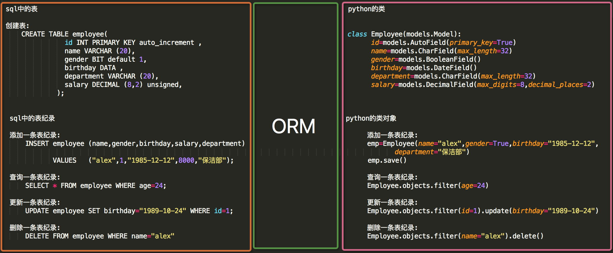


```
 #sql中的表                                                      

 #创建表:
     CREATE TABLE employee(                                     
                id INT PRIMARY KEY auto_increment ,                    
                name VARCHAR (20),                                      
                gender BIT default 1,                                  
                birthday DATA ,                                         
                department VARCHAR (20),                                
                salary DECIMAL (8,2) unsigned,                          
              );


  #sql中的表纪录                                                  

  #添加一条表纪录:                                                          
      INSERT employee (name,gender,birthday,salary,department)            
             VALUES   ("alex",1,"1985-12-12",8000,"保洁部");               

  #查询一条表纪录:                                                           
      SELECT * FROM employee WHERE age=24;                               

  #更新一条表纪录:                                                           
      UPDATE employee SET birthday="1989-10-24" WHERE id=1;              

  #删除一条表纪录:                                                          
      DELETE FROM employee WHERE name="alex"                             


#python的类
class Employee(models.Model):
     id=models.AutoField(primary_key=True)
     name=models.CharField(max_length=32)
     gender=models.BooleanField()
     birthday=models.DateField()
     department=models.CharField(max_length=32)
     salary=models.DecimalField(max_digits=8,decimal_places=2)


 #python的类对象
      #添加一条表纪录:
          emp=Employee(name="alex",gender=True,birthday="1985-12-12",epartment="保洁部")
          emp.save()
      #查询一条表纪录:
          Employee.objects.filter(age=24)
      #更新一条表纪录:
          Employee.objects.filter(id=1).update(birthday="1989-10-24")
      #删除一条表纪录:
          Employee.objects.filter(name="alex").delete()
```


# 单表操作

## 创建表

### 1 创建模型

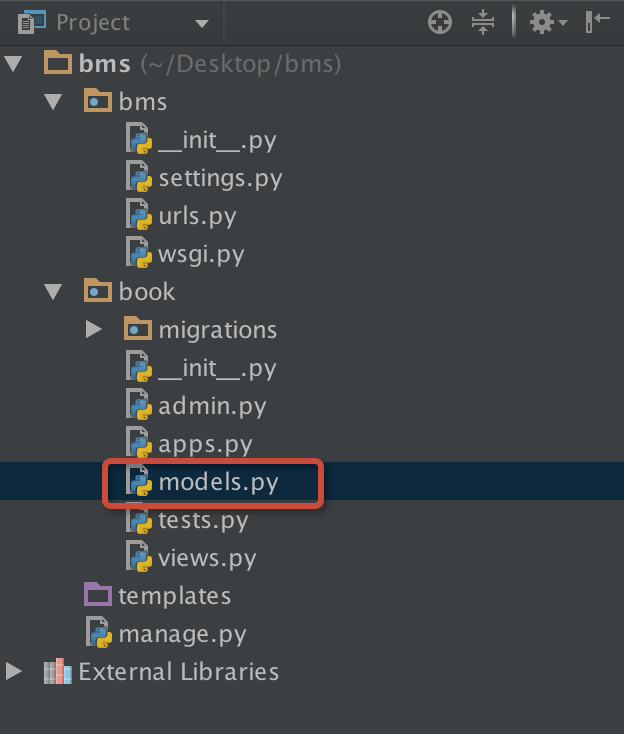

创建名为book的app，在book下的models.py中创建模型：


```
from django.db import models

# Create your models here.

class Book(models.Model):
     id=models.AutoField(primary_key=True)
     title=models.CharField(max_length=32)
     state=models.BooleanField()
     pub_date=models.DateField()
     price=models.DecimalField(max_digits=8,decimal_places=2)
     publish=models.CharField(max_length=32)
     
```


### 2 更多字段和参数

每个字段有一些特有的参数，例如，CharField需要max_length参数来指定`VARCHAR`数据库字段的大小。还有一些适用于所有字段的通用参数。 这些参数在文档中有详细定义，这里我们只简单介绍一些最常用的：

**更多字段：**

```
'''
 
<1> CharField
        字符串字段, 用于较短的字符串.
        CharField 要求必须有一个参数 maxlength, 用于从数据库层和Django校验层限制该字段所允许的最大字符数.
 
<2> IntegerField
       #用于保存一个整数.
 
<3> FloatField
        一个浮点数. 必须 提供两个参数:
         
        参数    描述
        max_digits    总位数(不包括小数点和符号)
        decimal_places    小数位数
                举例来说, 要保存最大值为 999 (小数点后保存2位),你要这样定义字段:
                 
                models.FloatField(..., max_digits=5, decimal_places=2)
                要保存最大值一百万(小数点后保存10位)的话,你要这样定义:
                 
                models.FloatField(..., max_digits=19, decimal_places=10)
                admin 用一个文本框(<input type="text">)表示该字段保存的数据.
 
<4> AutoField
        一个 IntegerField, 添加记录时它会自动增长. 你通常不需要直接使用这个字段;
        自定义一个主键：my_id=models.AutoField(primary_key=True)
        如果你不指定主键的话,系统会自动添加一个主键字段到你的 model.
 
<5> BooleanField
        A true/false field. admin 用 checkbox 来表示此类字段.
 
<6> TextField
        一个容量很大的文本字段.
        admin 用一个 <textarea> (文本区域)表示该字段数据.(一个多行编辑框).
 
<7> EmailField
        一个带有检查Email合法性的 CharField,不接受 maxlength 参数.
 
<8> DateField
        一个日期字段. 共有下列额外的可选参数:
        Argument    描述
        auto_now    当对象被保存时,自动将该字段的值设置为当前时间.通常用于表示 "last-modified" 时间戳.
        auto_now_add    当对象首次被创建时,自动将该字段的值设置为当前时间.通常用于表示对象创建时间.
        （仅仅在admin中有意义...)
 
<9> DateTimeField
         一个日期时间字段. 类似 DateField 支持同样的附加选项.
 
<10> ImageField
        类似 FileField, 不过要校验上传对象是否是一个合法图片.#它有两个可选参数:height_field和width_field,
        如果提供这两个参数,则图片将按提供的高度和宽度规格保存.    
<11> FileField
     一个文件上传字段.
     要求一个必须有的参数: upload_to, 一个用于保存上载文件的本地文件系统路径. 这个路径必须包含 strftime #formatting,
     该格式将被上载文件的 date/time
     替换(so that uploaded files don't fill up the given directory).
     admin 用一个<input type="file">部件表示该字段保存的数据(一个文件上传部件) .
 
     注意：在一个 model 中使用 FileField 或 ImageField 需要以下步骤:
 （1）在你的 settings 文件中, 定义一个完整路径给 MEDIA_ROOT 以便让 Django在此处保存上传文件.
        (出于性能考虑,这些文件并不保存到数据库.) 定义MEDIA_URL 作为该目录的公共 URL. 要确保该目录对
             WEB服务器用户帐号是可写的.
 （2） 在你的 model 中添加 FileField 或 ImageField, 并确保定义了 upload_to 选项,以告诉 Django
      使用 MEDIA_ROOT 的哪个子目录保存上传文件.你的数据库中要保存的只是文件的路径(相对于 MEDIA_ROOT).
      出于习惯你一定很想使用 Django 提供的 get_<#fieldname>_url 函数.举例来说,如果你的 ImageField
    叫作 mug_shot, 你就可以在模板中以 {{ object.#get_mug_shot_url }} 这样的方式得到图像的绝对路径.
 
<12> URLField
    用于保存 URL. 若 verify_exists 参数为 True (默认), 给定的 URL 会预先检查是否存在( 即URL是否被有效装入且没有返回404响应).
   admin 用一个 <input type="text"> 文本框表示该字段保存的数据(一个单行编辑框)
 
<13> NullBooleanField
    类似 BooleanField, 不过允许 NULL 作为其中一个选项. 推荐使用这个字段而不要用 BooleanField 加 null=True 选项admin 用一个选择框 <select> (三个可选择的值: "Unknown", "Yes" 和 "No" ) 来表示这种字段数据.
 
<14> SlugField
      "Slug" 是一个报纸术语. slug 是某个东西的小小标记(短签), 只包含字母,数字,下划线和连字符.#它们通常用于URLs 若你使用 Django 开发版本,你可以指定 maxlength. 若 maxlength 未指定, Django 会使用默认长度: 50.  #在以前的 Django 版本,没有任何办法改变50 这个长度. 这暗示了 db_index=True.
 它接受一个额外的参数: 
 prepopulate_from, which is a list of fields from which to auto-#populate
 the slug, via JavaScript,in the object's admin form: models.SlugField
 (prepopulate_from=("pre_name", "name"))prepopulate_from 不接受 DateTimeFields.
 
<13> XMLField
   一个校验值是否为合法XML的 TextField,必须提供参数: schema_path, 它是一个用来校验文本的 RelaxNG schema #的文件系统路径.
 
<14> FilePathField
可选项目为某个特定目录下的文件名. 支持三个特殊的参数, 其中第一个是必须提供的.
参数    描述
path    必需参数. 一个目录的绝对文件系统路径. FilePathField 据此得到可选项目.
Example: "/home/images".
match    可选参数. 一个正则表达式, 作为一个字符串, FilePathField 将使用它过滤文件名. 
注意这个正则表达式只会应用到 base filename 而不是
路径全名. Example: "foo.*\.txt^", 将匹配文件 foo23.txt 却不匹配 bar.txt 或 foo23.gif.
recursive可选参数.要么 True 要么 False. 默认值是 False. 是否包括 path 下面的全部子目录.
这三个参数可以同时使用.
match 仅应用于 base filename, 而不是路径全名. 那么,这个例子:
FilePathField(path="/home/images", match="foo.*", recursive=True)
...会匹配 /home/images/foo.gif 而不匹配 /home/images/foo/bar.gif
 
<15> IPAddressField
        一个字符串形式的 IP 地址, (i.e. "24.124.1.30").
<16> CommaSeparatedIntegerField
        用于存放逗号分隔的整数值. 类似 CharField, 必须要有maxlength参数.
 
 
 
'''　　
```


**更多参数：**

```
(1)null
 
如果为True，Django 将用NULL 来在数据库中存储空值。 默认值是 False.
 
(1)blank
 
如果为True，该字段允许不填。默认为False。
要注意，这与 null 不同。null纯粹是数据库范畴的，而 blank 是数据验证范畴的。
如果一个字段的blank=True，表单的验证将允许该字段是空值。如果字段的blank=False，该字段就是必填的。
 
(2)default
 
字段的默认值。可以是一个值或者可调用对象。如果可调用 ，每有新对象被创建它都会被调用。
 
(3)primary_key
 
如果为True，那么这个字段就是模型的主键。如果你没有指定任何一个字段的primary_key=True，
Django 就会自动添加一个IntegerField字段做为主键，所以除非你想覆盖默认的主键行为，
否则没必要设置任何一个字段的primary_key=True。
 
(4)unique
 
如果该值设置为 True, 这个数据字段的值在整张表中必须是唯一的
 
(5)choices
由二元组组成的一个可迭代对象（例如，列表或元组），用来给字段提供选择项。 如果设置了choices ，默认的表单将是一个选择框而不是标准的文本框，<br>而且这个选择框的选项就是choices 中的选项。

```


### 3 settings配置

若想将模型转为mysql数据库中的表，需要在settings中配置：

```python
DATABASES = {
    'default': {
        'ENGINE': 'django.db.backends.mysql',
        'NAME':'bms',     　　 　  # 要连接的数据库，连接前需要创建好
        'USER':'root',　　　　　　  # 连接数据库的用户名
        'PASSWORD':'',　　　　　　  # 连接数据库的密码
        'HOST':'127.0.0.1',       # 连接主机，默认本级
        'PORT'：3306    　　　     #  端口 默认3306
    }
}
```


注意1：NAME即数据库的名字，在mysql连接前该数据库必须已经创建，而上面的sqlite数据库下的db.sqlite3则是项目自动创建 USER和PASSWORD分别是数据库的用户名和密码。设置完后，再启动我们的Django项目前，我们需要激活我们的mysql。然后，启动项目，会报错：no module named MySQLdb 。这是因为django默认你导入的驱动是MySQLdb，可是MySQLdb 对于py3有很大问题，所以我们需要的驱动是PyMySQL 所以，我们只需要找到项目名文件下的__init__,在里面写入：

```
import pymysql
pymysql.install_as_MySQLdb()
```

最后通过两条数据库迁移命令即可在指定的数据库中创建表 ：

```
python manage.py makemigrations
python manage.py migrate
```

注意2:确保配置文件中的INSTALLED_APPS中写入我们创建的app名称

```
INSTALLED_APPS = [
    'django.contrib.admin',
    'django.contrib.auth',
    'django.contrib.contenttypes',
    'django.contrib.sessions',
    'django.contrib.messages',
    'django.contrib.staticfiles',
    "book"   #新建的app名称
]
```


注意3:如果报错如下：

```
django.core.exceptions.ImproperlyConfigured: mysqlclient 1.3.3 or newer is required; you have 0.7.11.None
```

MySQLclient目前只支持到python3.4，因此如果使用的更高版本的python，需要修改如下：

通过查找路径C:\Programs\Python\Python36-32\Lib\site-packages\Django-2.0-py3.6.egg\django\db\backends\mysql
这个路径里的文件把

```
if version < (1, 3, 3):
     raise ImproperlyConfigured("mysqlclient 1.3.3 or newer is required; you have %s" % Database.__version__)
```

注释掉 就OK了。

注意4: 如果想打印orm转换过程中的sql，需要在settings中进行如下配置：

```python
LOGGING = {
    'version': 1,
    'disable_existing_loggers': False,
    'handlers': {
        'console':{
            'level':'DEBUG',
            'class':'logging.StreamHandler',
        },
    },
    'loggers': {
        'django.db.backends': {
            'handlers': ['console'],
            'propagate': True,
            'level':'DEBUG',
        },
    }
}

```


## 添加表纪录

### 方式1 

```python
# create方法的返回值book_obj就是插入book表中的python葵花宝典这本书籍纪录对象
 book_obj=Book.objects.create(title="python葵花宝典",state=True,price=100,publish="苹果出版社",pub_date="2012-12-12")
  
```

### 方式2

```python
book_obj=Book(title="python葵花宝典",state=True,price=100,publish="苹果出版社",pub_date="2012-12-12")
book_obj.save()

```


## 查询表纪录

### 查询API

```
<1> all():                  查询所有结果
  
<2> filter(**kwargs):       它包含了与所给筛选条件相匹配的对象
  
<3> get(**kwargs):          返回与所给筛选条件相匹配的对象，返回结果有且只有一个，
                            如果符合筛选条件的对象超过一个或者没有都会抛出错误。
  
<4> exclude(**kwargs):      它包含了与所给筛选条件不匹配的对象
 
<5> order_by(*field):       对查询结果排序
  
<6> reverse():              对查询结果反向排序
  
<8> count():                返回数据库中匹配查询(QuerySet)的对象数量。
  
<9> first():                返回第一条记录
  
<10> last():                返回最后一条记录
  
<11> exists():              如果QuerySet包含数据，就返回True，否则返回False
 
<12> values(*field):        返回一个ValueQuerySet——一个特殊的QuerySet，运行后得到的并不是一系列
                            model的实例化对象，而是一个可迭代的字典序列
<13> values_list(*field):   它与values()非常相似，它返回的是一个元组序列，values返回的是一个字典序列
 
<14> distinct():            从返回结果中剔除重复纪录
```

### 基于双下划线的模糊查询　　

```
Book.objects.filter(price__in=[100,200,300])
Book.objects.filter(price__gt=100)
Book.objects.filter(price__lt=100)
Book.objects.filter(price__range=[100,200])    # range 范围 100 -200 之间
Book.objects.filter(title__contains="python")  # 包含
Book.objects.filter(title__icontains="python") # 包含 不区分大小写
Book.objects.filter(title__startswith="py")    # py开头的
Book.objects.filter(pub_date__year=2012)
Book.objects.filter(pub_date__year=2018,pub_date__month=1,pub_date__day=1) # 过滤年月日
```

## 删除表纪录

删除方法就是 delete()。它运行时立即删除对象而不返回任何值。例如：

```
model_obj.delete()
```

你也可以一次性删除多个对象。每个 QuerySet 都有一个 delete() 方法，它一次性删除 QuerySet 中所有的对象。

例如，下面的代码将删除 pub_date 是2005年的 Entry 对象：

```
Entry.objects.filter(pub_date__year=2005).delete()

```

在 Django 删除对象时，会模仿 SQL 约束 ON DELETE CASCADE 的行为，换句话说，删除一个对象时也会删除与它相关联的外键对象。例如：

```
b = Blog.objects.get(pk=1)
# This will delete the Blog and all of its Entry objects.
b.delete()
```

要注意的是： delete() 方法是 QuerySet 上的方法，但并不适用于 Manager 本身。这是一种保护机制，是为了避免意外地调用 Entry.objects.delete() 方法导致 所有的 记录被误删除。如果你确认要删除所有的对象，那么你必须显式地调用：

```
	
Entry.objects.all().delete()　　
```

如果不想级联删除，可以设置为:

```
pubHouse = models.ForeignKey(to='Publisher', on_delete=models.SET_NULL, blank=True, null=True)

```

## 修改表纪录

```
Book.objects.filter(title__startswith="py").update(price=120)

```

此外，update()方法对于任何结果集（QuerySet）均有效，这意味着你可以同时更新多条记录update()方法会返回一个整型数值，表示受影响的记录条数。　　


# 章节作业

### 1 图书管理系统

实现功能：book单表的增删改查

### 2 查询操作练习

```
1 查询老男孩出版社出版过的价格大于200的书籍
 
2 查询2017年8月出版的所有以py开头的书籍名称
 
3 查询价格为50,100或者150的所有书籍名称及其出版社名称
 
4 查询价格在100到200之间的所有书籍名称及其价格
 
5 查询所有人民出版社出版的书籍的价格（从高到低排序，去重）

```


# [9 Django 模型层(2)](https://www.cnblogs.com/yuanchenqi/articles/8963244.html)

# 多表操作

## 创建模型

实例：我们来假定下面这些概念，字段和关系

作者模型：一个作者有姓名和年龄。

作者详细模型：把作者的详情放到详情表，包含生日，手机号，家庭住址等信息。作者详情模型和作者模型之间是一对一的关系（one-to-one）

出版商模型：出版商有名称，所在城市以及email。

书籍模型： 书籍有书名和出版日期，一本书可能会有多个作者，一个作者也可以写多本书，所以作者和书籍的关系就是多对多的关联关系(many-to-many);一本书只应该由一个出版商出版，所以出版商和书籍是一对多关联关系(one-to-many)。

模型建立如下：

```python
from django.db import models

# Create your models here.

# 作者表
class Author(models.Model):
    nid = models.AutoField(primary_key=True)
    name=models.CharField( max_length=32)
    age=models.IntegerField()

    # 与AuthorDetail建立一对一的关系
    # authorDetail=models.OneToOneField(to="AuthorDetail",on_delete=models.CASCADE)
		# 与AuthorDetail建立一对一的关系  OneToOneField会自动给字段限制unique  
    # 关联是主键nid可不加,django会自动加.  on_delete=models.CASCADE Django2.0之后要加上.
    # on_delete=models.CASCADE,    # 删除关联数据,与之关联也删除
    authorDetail=models.OneToOneField(to="AuthorDetail",to_field="nid", on_delete=models.CASCADE)
    
# 作者详情表
class AuthorDetail(models.Model):
    nid = models.AutoField(primary_key=True)
    birthday=models.DateField()
    telephone=models.BigIntegerField()
    addr=models.CharField( max_length=64)

# 出版社表
class Publish(models.Model):
    nid = models.AutoField(primary_key=True)
    name=models.CharField( max_length=32)
    city=models.CharField( max_length=32)
    email=models.EmailField()


# 图书表
class Book(models.Model):
    nid = models.AutoField(primary_key=True)
    title = models.CharField( max_length=32)
    publishDate=models.DateField()
    price=models.DecimalField(max_digits=5,decimal_places=2)

    # 与Publish建立一对多的关系,外键字段建立在多的一方 #关联出版社表 nid字段  publish生成字段时候会自动生成publish_id
    publish=models.ForeignKey(to="Publish",to_field="nid",on_delete=models.CASCADE)
    # 与Author表建立多对多的关系,ManyToManyField可以建在两个模型中的任意一个，自动创建第三张表
    authors=models.ManyToManyField(to='Author',)
```

扩展: https://www.django.cn/article/show-6.html   Django2.0外键参数on_delete的使用方法

 生成表如下：


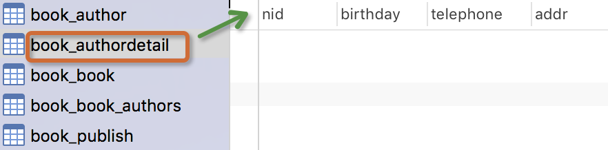

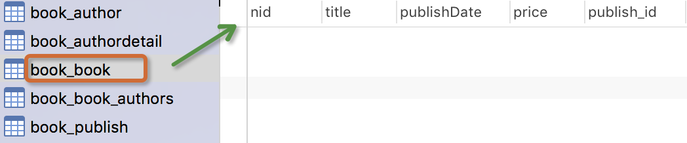


 

注意事项：

-    表的名称`myapp_modelName`，是根据 模型中的元数据自动生成的，也可以覆写为别的名称　　
-   ` id` 字段是自动添加的
-    对于外键字段，Django 会在字段名上添加`"_id"` 来创建数据库中的列名
-    这个例子中的`CREATE TABLE` SQL 语句使用PostgreSQL 语法格式，要注意的是Django 会根据settings 中指定的数据库类型来使用相应的SQL 语句。
-    定义好模型之后，你需要告诉Django _使用_这些模型。你要做的就是修改配置文件中的INSTALL_APPSZ中设置，在其中添加`models.py`所在应用的名称。
-   外键字段 ForeignKey 有一个 null=True 的设置(它允许外键接受空值 NULL)，你可以赋给它空值 None 。

```
小笔记:
一旦确定一对多关系:  建立一对多的关系----> 在多的表中建立关联字段
一旦确定多对多关系:  建立多对多的关系----> 创建第三张表(关联表)  id 和 两个关联字段
一旦确定一对一关系:  建立一对一的关系----> 在两张表中任意一张表中建立关联字段+Unique

建关联字段是为了查询, 外键约束是为了避免产生脏数据
 
```


## 添加表纪录 

操作前先简单的录入一些数据：

publish表：

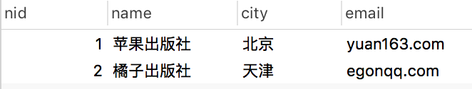

author表：

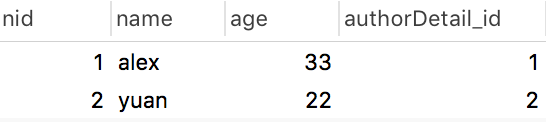

authordetail表:


### 一对多

```
方式1:
   publish_obj=Publish.objects.get(nid=1)
   book_obj=Book.objects.create(title="金瓶眉",publishDate="2012-12-12",price=100,publish=publish_obj)
  
方式2:
   book_obj=Book.objects.create(title="金瓶眉",publishDate="2012-12-12",price=100,publish_id=1)　　
```

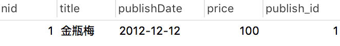

核心：book_obj.publish与book_obj.publish_id是什么？ 

### 多对多


```
# 当前生成的书籍对象
book_obj=Book.objects.create(title="追风筝的人",price=200,publishDate="2012-11-12",publish_id=1)
# 为书籍绑定的做作者对象
yuan=Author.objects.filter(name="yuan").first() # 在Author表中主键为2的纪录
egon=Author.objects.filter(name="alex").first() # 在Author表中主键为1的纪录

# 绑定多对多关系,即向关系表book_authors中添加纪录
book_obj.authors.add(yuan,egon)    #  将某些特定的 model 对象添加到被关联对象集合中。   =======    book_obj.authors.add(*[])
```


数据库表纪录生成如下：

book表 

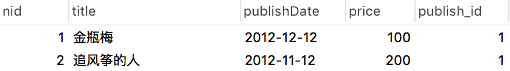

book_authors表

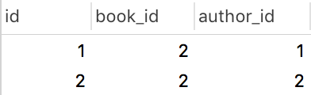

核心:book_obj.authors.all()是什么？

多对多关系其它常用API：

```
book_obj.authors.remove()      # 将某个特定的对象从被关联对象集合中去除。    ======   book_obj.authors.remove(*[])
book_obj.authors.clear()       #清空被关联对象集合
book_obj.authors.set()         #先清空再设置　　
```

[more](http://www.cnblogs.com/yuanchenqi/articles/8978167.html)

## 基于对象的跨表查询

### 一对多查询（Publish 与 Book）

正向查询(按字段：publish)：

```
# 查询主键为1的书籍的出版社所在的城市
book_obj=Book.objects.filter(pk=1).first()
# book_obj.publish 是主键为1的书籍对象关联的出版社对象
print(book_obj.publish.city) 　
```

反向查询(按表名：book_set)：

```
publish=Publish.objects.get(name="苹果出版社")
#publish.book_set.all() : 与苹果出版社关联的所有书籍对象集合   按表名小写 book_set.all()
book_list=publish.book_set.all()    
for book_obj in book_list:
       print(book_obj.title)
```

### 一对一查询(Author 与 AuthorDetail)

正向查询(按字段：authorDetail)：

```
egon=Author.objects.filter(name="egon").first()
print(egon.authorDetail.telephone)
```

反向查询(按表名：author)：

```
# 查询所有住址在北京的作者的姓名
 
authorDetail_list=AuthorDetail.objects.filter(addr="beijing")
for obj in authorDetail_list:
     print(obj.author.name)
```

### 多对多查询 (Author 与 Book)

正向查询(按字段：authors)：

```
# 金瓶眉所有作者的名字以及手机号
 
book_obj=Book.objects.filter(title="金瓶眉").first()
authors=book_obj.authors.all()
for author_obj in authors:
     print(author_obj.name,author_obj.authorDetail.telephone)
```

反向查询(按表名：book_set)：

```
# 查询egon出过的所有书籍的名字
 
 author_obj=Author.objects.get(name="egon")
 book_list=author_obj.book_set.all()        #与egon作者相关的所有书籍
 for book_obj in book_list:
     print(book_obj.title)
```

**注意：**

你可以通过在 ForeignKey() 和ManyToManyField的定义中设置 related_name 的值来覆写 FOO_set 的名称。例如，如果 Article model 中做一下更改：

```
publish = ForeignKey(Book, related_name='bookList')
```

那么接下来就会如我们看到这般：

```
# 查询 人民出版社出版过的所有书籍
 
publish=Publish.objects.get(name="人民出版社")
book_list=publish.bookList.all()  # 与人民出版社关联的所有书籍对象集合
```

## 基于双下划线的跨表查询 

Django 还提供了一种直观而高效的方式在查询(lookups)中表示关联关系，它能自动确认 SQL JOIN 联系。要做跨关系查询，就使用两个下划线来链接模型(model)间关联字段的名称，直到最终链接到你想要的model 为止。

 

```
'''
    正向查询按字段,反向查询按表名小写用来告诉ORM引擎join哪张表
'''
```

### 一对多查询


```
# 练习:  查询苹果出版社出版过的所有书籍的名字与价格(一对多)

    # 正向查询 按字段:publish

    queryResult=Book.objects
　　　　　　　　　　　　.filter(publish__name="苹果出版社")
　　　　　　　　　　　　.values_list("title","price")

    # 反向查询 按表名:book

    queryResult=Publish.objects
　　　　　　　　　　　　　　.filter(name="苹果出版社")
　　　　　　　　　　　　　　.values_list("book__title","book__price")
```


### 多对多查询　　


```
# 练习: 查询alex出过的所有书籍的名字(多对多)

    # 正向查询 按字段:authors:
    queryResult=Book.objects
　　　　　　　　　　　　.filter(authors__name="yuan")
　　　　　　　　　　　　.values_list("title")

    # 反向查询 按表名:book
    queryResult=Author.objects
　　　　　　　　　　　　　　.filter(name="yuan")
　　　　　　　　　　　　　　.values_list("book__title","book__price")
```


### 一对一查询


```
    # 查询alex的手机号
    
    # 正向查询
    ret=Author.objects.filter(name="alex").values("authordetail__telephone")

    # 反向查询
    ret=AuthorDetail.objects.filter(author__name="alex").values("telephone")
```


### 进阶练习(连续跨表)


```
# 练习: 查询人民出版社出版过的所有书籍的名字以及作者的姓名


    # 正向查询
    queryResult=Book.objects
　　　　　　　　　　　　.filter(publish__name="人民出版社")
　　　　　　　　　　　　.values_list("title","authors__name")
    # 反向查询
    queryResult=Publish.objects
　　　　　　　　　　　　　　.filter(name="人民出版社")
　　　　　　　　　　　　　　.values_list("book__title","book__authors__age","book__authors__name")


# 练习: 手机号以151开头的作者出版过的所有书籍名称以及出版社名称


    # 方式1:
    queryResult=Book.objects
　　　　　　　　　　　　.filter(authors__authorDetail__telephone__regex="151")
　　　　　　　　　　　　.values_list("title","publish__name")
    # 方式2:    
    ret=Author.objects
              .filter(authordetail__telephone__startswith="151")
              .values("book__title","book__publish__name")
```


### related_name

反向查询时，如果定义了related_name ，则用related_name替换表名，例如：

```
publish = ForeignKey(Blog, related_name='bookList')
```


```
# 练习: 查询人民出版社出版过的所有书籍的名字与价格(一对多)

# 反向查询 不再按表名:book,而是related_name:bookList


    queryResult=Publish.objects
　　　　　　　　　　　　　　.filter(name="人民出版社")
　　　　　　　　　　　　　　.values_list("bookList__title","bookList__price") 
```


## 聚合查询与分组查询

### `聚合`

`aggregate`(*args, **kwargs)

```
# 计算所有图书的平均价格
    >>> from django.db.models import Avg
    >>> Book.objects.all().aggregate(Avg('price'))
    {'price__avg': 34.35}
```

`aggregate()`是`QuerySet` 的一个终止子句，意思是说，它返回一个包含一些键值对的字典。键的名称是聚合值的标识符，值是计算出来的聚合值。键的名称是按照字段和聚合函数的名称自动生成出来的。如果你想要为聚合值指定一个名称，可以向聚合子句提供它。

```
>>> Book.objects.aggregate(average_price=Avg('price'))
{'average_price': 34.35}
```

如果你希望生成不止一个聚合，你可以向`aggregate()`子句中添加另一个参数。所以，如果你也想知道所有图书价格的最大值和最小值，可以这样查询：

```
>>> from django.db.models import Avg, Max, Min
>>> Book.objects.aggregate(Avg('price'), Max('price'), Min('price'))
{'price__avg': 34.35, 'price__max': Decimal('81.20'), 'price__min': Decimal('12.99')}
```

### 分组

```
###################################－－单表分组查询－－#######################################################

查询每一个部门名称以及对应的员工数

emp:

id  name age   salary    dep
1   alex  12   2000     销售部
2   egon  22   3000     人事部
3   wen   22   5000     人事部


sql语句:
select dep,Count(*) from emp group by dep;

ORM:
emp.objects.values("dep").annotate(c=Count("id")

###################################－－多表分组查询－－###########################


多表分组查询：

查询每一个部门名称以及对应的员工数


emp:

id  name age   salary   dep_id
1   alex  12   2000       1
2   egon  22   3000       2
3   wen   22   5000       2


dep

id   name 
1    销售部
2    人事部


emp－dep:

id  name age   salary   dep_id   id   name 
1   alex  12   2000       1      1    销售部
2   egon  22   3000       2      2    人事部
3   wen   22   5000       2      2    人事部


sql语句:
select dep.name,Count(*) from emp left join dep on emp.dep_id=dep.id group by dep.id

ORM:
dep.objetcs.values("id").annotate(c=Count("emp")).values("name","c")
```


```
class Emp(models.Model):
    name=models.CharField(max_length=32)
    age=models.IntegerField()
    salary=models.DecimalField(max_digits=8,decimal_places=2)
    dep=models.CharField(max_length=32)
    province=models.CharField(max_length=32)
```


annotate()为调用的`QuerySet`中每一个对象都生成一个独立的统计值（统计方法用聚合函数）。

总结 ：跨表分组查询本质就是将关联表join成一张表，再按单表的思路进行分组查询。　

### 查询练习

(1) 练习：统计每一个出版社的最便宜的书

```
publishList=Publish.objects.annotate(MinPrice=Min("book__price"))
for publish_obj in publishList:
    print(publish_obj.name,publish_obj.MinPrice)
```

annotate的返回值是querySet，如果不想遍历对象，可以用上valuelist：

```
queryResult= Publish.objects
　　　　　　　　　　　　.annotate(MinPrice=Min("book__price"))
　　　　　　　　　　　　.values_list("name","MinPrice")
print(queryResult)
```


```
'''

SELECT "app01_publish"."name", MIN("app01_book"."price")  AS "MinPrice" FROM "app01_publish" 
LEFT  JOIN "app01_book" ON ("app01_publish"."nid" = "app01_book"."publish_id") 
GROUP BY "app01_publish"."nid", "app01_publish"."name", "app01_publish"."city", "app01_publish"."email" 

'''
```


(2) 练习：统计每一本书的作者个数

```
ret = Book.objects.annotate(authorsNum=Count("authors__name")).values("title","authorsNum")
```

(3) 统计每一本以py开头的书籍的作者个数：

```
 queryResult=Book.objects.filter(title__startswith="Py").annotate(num_authors=Count('authors'))
　　　　　　　　　 　
ret = Book.objects.filter(title__startswith="py").annotate(authorSnum=Count("authors__name")).values_list("title","authorSnum")

```

(4) 统计不止一个作者的图书：

```
queryResult=Book.objects
　　　　　　　　　　.annotate(num_authors=Count('authors'))
　　　　　　　　　　.filter(num_authors__gt=1)
```

(5) 根据一本图书作者数量的多少对查询集 `QuerySet`进行排序:

```
Book.objects.annotate(num_authors=Count('authors')).order_by('num_authors')

```

(6) 查询各个作者出的书的总价格:

```
#   按author表的所有字段 group by
    queryResult=Author.objects
　　　　　　　　　　　　　　.annotate(SumPrice=Sum("book__price"))
　　　　　　　　　　　　　　.values_list("name","SumPrice")
    print(queryResult)
```

## F查询与Q查询

### F查询

在上面所有的例子中，我们构造的过滤器都只是将字段值与某个常量做比较。如果我们要对两个字段的值做比较，那该怎么做呢？

Django 提供 F() 来做这样的比较。F() 的实例可以在查询中引用字段，来比较同一个 model 实例中两个不同字段的值。

```
# 查询评论数大于收藏数的书籍

from django.db.models import F
Book.objects.filter(commnetNum__lt=F('keepNum'))

```

Django 支持 F() 对象之间以及 F() 对象和常数之间的加减乘除和取模的操作。

```
# 查询评论数大于收藏数2倍的书籍
    Book.objects.filter(commnetNum__lt=F('keepNum')*2)
```

修改操作也可以使用F函数,比如将每一本书的价格提高30元：

```
Book.objects.all().update(price=F("price")+30)　
```

```
数据准备:
直接在models.py  book 类中添加两个字段
comment_sum = models.IntegerField(default=0)
read_sum  = models.IntegerField(default=0)


kanghuadeMacBook-Pro:08-ORM2 kanghua$  python3.9 manage.py makemigrations
kanghuadeMacBook-Pro:08-ORM2 kanghua$ python3.9 manage.py migrate


```


### Q查询

`filter()` 等方法中的关键字参数查询都是一起进行“AND” 的。 如果你需要执行更复杂的查询（例如`OR` 语句），你可以使用`Q 对象`。

```
from django.db.models import Q
Q(title__startswith='Py')
```

`Q` 对象可以使用`&` 和`|` 操作符组合起来。当一个操作符在两个`Q` 对象上使用时，它产生一个新的`Q` 对象。

```
	
bookList=Book.objects.filter(Q(authors__name="yuan")|Q(authors__name="egon"))
```

等同于下面的SQL `WHERE` 子句：

```
	
WHERE name ="yuan" OR name ="egon"
```

你可以组合`&` 和`|` 操作符以及使用括号进行分组来编写任意复杂的`Q` 对象。同时，`Q` 对象可以使用`~` 操作符取反，这允许组合正常的查询和取反(`NOT`) 查询：

```
bookList=Book.objects.filter(Q(authors__name="yuan") & ~Q(publishDate__year=2017)).values_list("title")

```

查询函数可以混合使用`Q 对象`和关键字参数。所有提供给查询函数的参数（关键字参数或`Q` 对象）都将"AND”在一起。但是，如果出现`Q` 对象，它必须位于所有关键字参数的前面。例如：

```
bookList=Book.objects.filter(Q(publishDate__year=2016) | Q(publishDate__year=2017),
                              title__icontains="python"
                             )
                             
```


# [9-1 关联管理器(RelatedManager)](https://www.cnblogs.com/yuanchenqi/articles/8978167.html)

# class RelatedManager

"关联管理器"是在一对多或者多对多的关联上下文中使用的管理器。它存在于下面两种情况：

ForeignKey关系的“另一边”。像这样：

```
from django.db import models
 
class Reporter(models.Model):
    # ...
    pass
 
class Article(models.Model):
    reporter = models.ForeignKey(Reporter)
```

在上面的例子中，管理器reporter.article_set拥有下面的方法。

ManyToManyField关系的两边：

```
class Topping(models.Model):
    # ...
    pass
 
class Pizza(models.Model):
    toppings = models.ManyToManyField(Topping)
```

这个例子中，topping.pizza_set 和pizza.toppings都拥有下面的方法。

**add(obj1[, obj2, ...])**

[](javascript:void(0);)

```
把指定的模型对象添加到关联对象集中。

例如：

>>> b = Blog.objects.get(id=1)
>>> e = Entry.objects.get(id=234)
>>> b.entry_set.add(e) # Associates Entry e with Blog b.
在上面的例子中，对于ForeignKey关系，e.save()由关联管理器调用，执行更新操作。然而，在多对多关系中使用add()并不会调用任何 save()方法，而是由QuerySet.bulk_create()创建关系。

延伸：

# 1 *[]的使用
>>> book_obj = Book.objects.get(id=1)
>>> author_list = Author.objects.filter(id__gt=2)
>>> book_obj.authors.add(*author_list)


# 2 直接绑定主键
book_obj.authors.add(*[1,3])  # 将id=1和id=3的作者对象添加到这本书的作者集合中
                              # 应用: 添加或者编辑时,提交作者信息时可以用到.  
```

[](javascript:void(0);)

**create(\**kwargs)**

[](javascript:void(0);)

```
创建一个新的对象，保存对象，并将它添加到关联对象集之中。返回新创建的对象：

>>> b = Blog.objects.get(id=1)
>>> e = b.entry_set.create(
...     headline='Hello',
...     body_text='Hi',
...     pub_date=datetime.date(2005, 1, 1)
... )

# No need to call e.save() at this point -- it's already been saved.
这完全等价于（不过更加简洁于）：

>>> b = Blog.objects.get(id=1)
>>> e = Entry(
...     blog=b,
...     headline='Hello',
...     body_text='Hi',
...     pub_date=datetime.date(2005, 1, 1)
... )
>>> e.save(force_insert=True)
要注意我们并不需要指定模型中用于定义关系的关键词参数。在上面的例子中，我们并没有传入blog参数给create()。Django会明白新的 Entry对象blog 应该添加到b中。

```

[](javascript:void(0);)

**remove(obj1[, obj2, ...])**

```
从关联对象集中移除执行的模型对象：

>>> b = Blog.objects.get(id=1)
>>> e = Entry.objects.get(id=234)
>>> b.entry_set.remove(e) # Disassociates Entry e from Blog b.
对于ForeignKey对象，这个方法仅在null=True时存在。
```

**clear()**

[](javascript:void(0);)

```
从关联对象集中移除一切对象。

>>> b = Blog.objects.get(id=1)
>>> b.entry_set.clear()
注意这样不会删除对象 —— 只会删除他们之间的关联。

就像 remove() 方法一样，clear()只能在 null=True的ForeignKey上被调用。
```

[](javascript:void(0);)

**set()方法**

先清空，在设置，编辑书籍时即可用到


**注意**

对于所有类型的关联字段，add()、create()、remove()和clear(),set()都会马上更新数据库。换句话说，在关联的任何一端，都不需要再调用save()方法。

**直接赋值：**

通过赋值一个新的可迭代的对象，关联对象集可以被整体替换掉。

```
>>> new_list = [obj1, obj2, obj3]
>>> e.related_set = new_list
```

如果外键关系满足null=True，关联管理器会在添加new_list中的内容之前，首先调用clear()方法来解除关联集中一切已存在对象的关联。否则， new_list中的对象会在已存在的关联的基础上被添加。　　


# [10 Django与Ajax](https://www.cnblogs.com/yuanchenqi/articles/9070966.html)

# Ajax

## Ajax简介

AJAX（Asynchronous Javascript And XML）翻译成中文就是“异步Javascript和XML”。即使用Javascript语言与服务器进行异步交互，传输的数据为XML（当然，传输的数据不只是XML,现在更多使用json数据）。

-   同步交互：客户端发出一个请求后，需要等待服务器响应结束后，才能发出第二个请求；
-   异步交互：客户端发出一个请求后，无需等待服务器响应结束，就可以发出第二个请求。

AJAX除了**异步**的特点外，还有一个就是：浏览器页面**局部刷新**；（这一特点给用户的感受是在不知不觉中完成请求和响应过程）

场景：


#### 优点：

-   AJAX使用Javascript技术向服务器发送异步请求
-   AJAX无须刷新整个页面

## 基于jquery的Ajax实现


```
<button class="send_Ajax">send_Ajax</button>
<script>

       $(".send_Ajax").click(function(){

           $.ajax({
               url:"/handle_Ajax/",
               type:"POST",
               data:{username:"Yuan",password:123},
               success:function(data){
                   console.log(data)
               },
         　　　　　　
               error: function (jqXHR, textStatus, err) {
                        console.log(arguments);
                    },

               complete: function (jqXHR, textStatus) {
                        console.log(textStatus);
                },

               statusCode: {
                    '403': function (jqXHR, textStatus, err) {
                          console.log(arguments);
                     },

                    '400': function (jqXHR, textStatus, err) {
                        console.log(arguments);
                    }
                }

           })

       })

</script>
```


### Ajax－服务器－Ajax流程图

略

## 案例

### 1 用户名是否已被注册

在注册表单中，当用户填写了用户名后，把光标移开后，会自动向服务器发送异步请求。服务器返回true或false，返回true表示这个用户名已经被注册过，返回false表示没有注册过。客户端得到服务器返回的结果后，确定是否在用户名文本框后显示“用户名已被注册”的错误信息！

### 2 基于Ajax进行登录验证 

用户在表单输入用户名与密码，通过Ajax提交给服务器，服务器验证后返回响应信息，客户端通过响应信息确定是否登录成功，成功，则跳转到首页，否则，在页面上显示相应的错误信息。


# 文件上传

## 请求头ContentType

ContentType指的是请求体的编码类型，常见的类型共有3种：

### 1 application/x-www-form-urlencoded

这应该是最常见的 POST 提交数据的方式了。浏览器的原生 <form> 表单，如果不设置 `enctype` 属性，那么最终就会以 application/x-www-form-urlencoded 方式提交数据。请求类似于下面这样（无关的请求头在本文中都省略掉了）：

```
POST http://www.example.com HTTP/1.1
Content-Type: application/x-www-form-urlencoded;charset=utf-8

user=yuan&age=22
```

### 2 multipart/form-data

这又是一个常见的 POST 数据提交的方式。我们使用表单上传文件时，必须让 <form> 表单的 `enctype` 等于 multipart/form-data。直接来看一个请求示例：


```
POST http://www.example.com HTTP/1.1
Content-Type:multipart/form-data; boundary=----WebKitFormBoundaryrGKCBY7qhFd3TrwA

------WebKitFormBoundaryrGKCBY7qhFd3TrwA
Content-Disposition: form-data; name="user"

yuan
------WebKitFormBoundaryrGKCBY7qhFd3TrwA
Content-Disposition: form-data; name="file"; filename="chrome.png"
Content-Type: image/png

PNG ... content of chrome.png ...
------WebKitFormBoundaryrGKCBY7qhFd3TrwA--
```


这个例子稍微复杂点。首先生成了一个 boundary 用于分割不同的字段，为了避免与正文内容重复，boundary 很长很复杂。然后 Content-Type 里指明了数据是以 multipart/form-data 来编码，本次请求的 boundary 是什么内容。消息主体里按照字段个数又分为多个结构类似的部分，每部分都是以 `--boundary` 开始，紧接着是内容描述信息，然后是回车，最后是字段具体内容（文本或二进制）。如果传输的是文件，还要包含文件名和文件类型信息。消息主体最后以 `--boundary--` 标示结束。关于 multipart/form-data 的详细定义，请前往 [rfc1867](http://www.ietf.org/rfc/rfc1867.txt) 查看。

这种方式一般用来上传文件，各大服务端语言对它也有着良好的支持。

上面提到的这两种 POST 数据的方式，都是浏览器原生支持的，而且现阶段标准中原生 <form> 表单也[只支持这两种方式](http://www.w3.org/TR/html401/interact/forms.html#h-17.13.4)（通过 <form> 元素的 `enctype` 属性指定，默认为 `application/x-www-form-urlencoded`。其实 `enctype` 还支持 `text/plain`，不过用得非常少）。

随着越来越多的 Web 站点，尤其是 WebApp，全部使用 Ajax 进行数据交互之后，我们完全可以定义新的数据提交方式，给开发带来更多便利。

### 3 application/json

application/json 这个 Content-Type 作为响应头大家肯定不陌生。实际上，现在越来越多的人把它作为请求头，用来告诉服务端消息主体是序列化后的 JSON 字符串。由于 JSON 规范的流行，除了低版本 IE 之外的各大浏览器都原生支持 JSON.stringify，服务端语言也都有处理 JSON 的函数，使用 JSON 不会遇上什么麻烦。

JSON 格式支持比键值对复杂得多的结构化数据，这一点也很有用。记得我几年前做一个项目时，需要提交的数据层次非常深，我就是把数据 JSON 序列化之后来提交的。不过当时我是把 JSON 字符串作为 val，仍然放在键值对里，以 x-www-form-urlencoded 方式提交。

## 基于form表单的文件上传 

### 模板部分

```
<form action="" method="post" enctype="multipart/form-data">
      用户名 <input type="text" name="user">
      头像 <input type="file" name="avatar">
    <input type="submit">
</form>
```

### 视图部分


```
def index(request):
    print(request.body)   # 原始的请求体数据
    print(request.GET)    # GET请求数据
    print(request.POST)   # POST请求数据
    print(request.FILES)  # 上传的文件数据


    return render(request,"index.html")
```


## 基于Ajax的文件上传

### 模板


```
<form>
      用户名 <input type="text" id="user">
      头像 <input type="file" id="avatar">
     <input type="button" id="ajax-submit" value="ajax-submit">
</form>

<script>

    $("#ajax-submit").click(function(){
        var formdata=new FormData();
        formdata.append("user",$("#user").val());
        formdata.append("avatar_img",$("#avatar")[0].files[0]);
        $.ajax({

            url:"",
            type:"post",
            data:formdata,
            processData: false ,    // 不处理数据
            contentType: false,    // 不设置内容类型

            success:function(data){
                console.log(data)
            }
        })

    })

</script>
```


### 视图


```
def index(request):

    if request.is_ajax():

        print(request.body)   # 原始的请求体数据
        print(request.GET)    # GET请求数据
        print(request.POST)   # POST请求数据
        print(request.FILES)  # 上传的文件数据

        return HttpResponse("ok")


    return render(request,"index.html")
```


检查浏览器的请求头：

```
Content-Type: multipart/form-data; boundary=----WebKitFormBoundaryaWl9k5ZMiTAzx3FT
```


# [11 Django组件-分页器](https://www.cnblogs.com/yuanchenqi/articles/9036515.html)

# Django的分页器（paginator）

### view


```
from django.shortcuts import render,HttpResponse

# Create your views here.
from app01.models import *
from django.core.paginator import Paginator, EmptyPage, PageNotAnInteger

def index(request):

    '''
    批量导入数据:

    Booklist=[]
    for i in range(100):
        Booklist.append(Book(title="book"+str(i),price=30+i*i))
    Book.objects.bulk_create(Booklist)
    '''

    '''
分页器的使用:

    book_list=Book.objects.all()

    paginator = Paginator(book_list, 10)

    print("count:",paginator.count)           #数据总数
    print("num_pages",paginator.num_pages)    #总页数
    print("page_range",paginator.page_range)  #页码的列表


    page1=paginator.page(1) #第1页的page对象
    for i in page1:         #遍历第1页的所有数据对象
        print(i)

    print(page1.object_list) #第1页的所有数据


    page2=paginator.page(2)

    print(page2.has_next())            #是否有下一页
    print(page2.next_page_number())    #下一页的页码
    print(page2.has_previous())        #是否有上一页
    print(page2.previous_page_number()) #上一页的页码


    # 抛错
    #page=paginator.page(12)   # error:EmptyPage

    #page=paginator.page("z")   # error:PageNotAnInteger

    '''


    book_list=Book.objects.all()

    paginator = Paginator(book_list, 10)
    page = request.GET.get('page',1)
    currentPage=int(page)


    try:
        print(page)
        book_list = paginator.page(page)
    except PageNotAnInteger:
        book_list = paginator.page(1)
    except EmptyPage:
        book_list = paginator.page(paginator.num_pages)


    return render(request,"index.html",{"book_list":book_list,"paginator":paginator,"currentPage":currentPage})
```


### index.html:


```
<!DOCTYPE html>
<html lang="en">
<head>
    <meta charset="UTF-8">
    <title>Title</title>
    <link rel="stylesheet" href="https://cdn.bootcss.com/bootstrap/3.3.7/css/bootstrap.min.css" 
    integrity="sha384-BVYiiSIFeK1dGmJRAkycuHAHRg32OmUcww7on3RYdg4Va+PmSTsz/K68vbdEjh4u" crossorigin="anonymous">
</head>
<body>

<div class="container">

    <h4>分页器</h4>
    <ul>

        
             <li>{{ book.title }} -----{{ book.price }}</li>
        

     </ul>


    <ul class="pagination" id="pager">

                 
                    <li class="previous"><a href="/index/?page={{ book_list.previous_page_number }}">上一页</a></li>
                 
                    <li class="previous disabled"><a href="#">上一页</a></li>
                 


                 

                     
                       <li class="item active"><a href="/index/?page={{ num }}">{{ num }}</a></li>
                     
                       <li class="item"><a href="/index/?page={{ num }}">{{ num }}</a></li>

                     
                 


                 
                    <li class="next"><a href="/index/?page={{ book_list.next_page_number }}">下一页</a></li>
                 
                    <li class="next disabled"><a href="#">下一页</a></li>
                 

            </ul>
</div>


</body>
</html>
```


## 扩展


```
def index(request):


    book_list=Book.objects.all()

    paginator = Paginator(book_list, 15)
    page = request.GET.get('page',1)
    currentPage=int(page)

    #  如果页数十分多时，换另外一种显示方式
    if paginator.num_pages>11:

        if currentPage-5<1:
            pageRange=range(1,11)
        elif currentPage+5>paginator.num_pages:
            pageRange=range(currentPage-5,paginator.num_pages+1)

        else:
            pageRange=range(currentPage-5,currentPage+5)

    else:
        pageRange=paginator.page_range


    try:
        print(page)
        book_list = paginator.page(page)
    except PageNotAnInteger:
        book_list = paginator.page(1)
    except EmptyPage:
        book_list = paginator.page(paginator.num_pages)


    return render(request,"index.html",locals())
```


# [12 Django组件-forms组件](https://www.cnblogs.com/yuanchenqi/articles/9036474.html)		

# forms组件

## 校验字段功能

针对一个实例：注册用户讲解。

模型：models.py

```
class UserInfo(models.Model):
    name=models.CharField(max_length=32)
    pwd=models.CharField(max_length=32)
    email=models.EmailField()
    tel=models.CharField(max_length=32)
```

模板: register.html:


```
<!DOCTYPE html>
<html lang="en">
<head>
    <meta charset="UTF-8">
    <title>Title</title>

</head>
<body>

<form action="" method="post">
    
    <div>
        <label for="user">用户名</label>
        <p><input type="text" name="name" id="name"></p>
    </div>
    <div>
        <label for="pwd">密码</label>
        <p><input type="password" name="pwd" id="pwd"></p>
    </div>
    <div>
        <label for="r_pwd">确认密码</label>
        <p><input type="password" name="r_pwd" id="r_pwd"></p>
    </div>
     <div>
        <label for="email">邮箱</label>
        <p><input type="text" name="email" id="email"></p>
    </div>
    <input type="submit">
</form>

</body>
</html>
```


视图函数：register


```
# forms组件
from django.forms import widgets

wid_01=widgets.TextInput(attrs={"class":"form-control"})
wid_02=widgets.PasswordInput(attrs={"class":"form-control"})

class UserForm(forms.Form):
    name=forms.CharField(max_length=32,
                         widget=wid_01
                         )
    pwd=forms.CharField(max_length=32,widget=wid_02)
    r_pwd=forms.CharField(max_length=32,widget=wid_02)
    email=forms.EmailField(widget=wid_01)
    tel=forms.CharField(max_length=32,widget=wid_01)


def register(request):

    if request.method=="POST":
        form=UserForm(request.POST)
        if form.is_valid():
            print(form.cleaned_data)       # 所有干净的字段以及对应的值
        else:
            print(form.cleaned_data)       #
            print(form.errors)             # ErrorDict : {"校验错误的字段":["错误信息",]}
            print(form.errors.get("name")) # ErrorList ["错误信息",]
        return HttpResponse("OK")
    form=UserForm()
    return render(request,"register.html",locals())
```


## 渲染标签功能 

### 渲染方式1


```
<!DOCTYPE html>
<html lang="en">
<head>
    <meta charset="UTF-8">
    <title>Title</title>
   <!-- 最新版本的 Bootstrap 核心 CSS 文件 -->
    <link rel="stylesheet" href="https://cdn.bootcss.com/bootstrap/3.3.7/css/bootstrap.min.css" integrity="sha384-BVYiiSIFeK1dGmJRAkycuHAHRg32OmUcww7on3RYdg4Va+PmSTsz/K68vbdEjh4u" crossorigin="anonymous">
</head>
<body>
<h3>注册页面</h3>
<div class="container">
    <div class="row">
        <div class="col-md-6 col-lg-offset-3">

                <form action="" method="post">
                    
                    <div>
                        <label for="">用户名</label>
                        {{ form.name }}
                    </div>
                    <div>
                        <label for="">密码</label>
                        {{ form.pwd }}
                    </div>
                    <div>
                        <label for="">确认密码</label>
                        {{ form.r_pwd }}
                    </div>
                    <div>
                        <label for=""> 邮箱</label>
                        {{ form.email }}
                    </div>

                    <input type="submit" class="btn btn-default pull-right">
                </form>
        </div>
    </div>
</div>


</body>
</html>
```


### 渲染方式2


```
<form action="" method="post">
                    
                    
                    
                        <div>
                            <label for="">{{ field.label }}</label>
                            {{ field }}
                        </div>
                    
                    <input type="submit" class="btn btn-default pull-right">
                
</form>
```


### 渲染方式3


```
<form action="" method="post">
    
    
    {{ form.as_p }}
    <input type="submit" class="btn btn-default pull-right">

</form>
```


## 显示错误与重置输入信息功能

### 视图


```
def register(request):

    if request.method=="POST":
        form=UserForm(request.POST)
        if form.is_valid():
            print(form.cleaned_data)       # 所有干净的字段以及对应的值
        else:
            print(form.cleaned_data)       #
            print(form.errors)             # ErrorDict : {"校验错误的字段":["错误信息",]}
            print(form.errors.get("name")) # ErrorList ["错误信息",]
        return render(request,"register.html",locals())
    form=UserForm()
    return render(request,"register.html",locals())
```


### 模板


```
<form action="" method="post" novalidate>
    
    
    
        <div>
            <label for="">{{ field.label }}</label>
            {{ field }} <span class="pull-right" style="color: red">{{ field.errors.0 }}</span>
        </div>
    
    <input type="submit" class="btn btn-default">

</form>
```


## 局部钩子与全局钩子

### 模板


```
# forms组件
from django.forms import widgets

wid_01=widgets.TextInput(attrs={"class":"form-control"})
wid_02=widgets.PasswordInput(attrs={"class":"form-control"})

from django.core.exceptions import ValidationError
class UserForm(forms.Form):
    name=forms.CharField(max_length=32,
                         widget=wid_01
                         )
    pwd=forms.CharField(max_length=32,widget=wid_02)
    r_pwd=forms.CharField(max_length=32,widget=wid_02)
    email=forms.EmailField(widget=wid_01)
    tel=forms.CharField(max_length=32,widget=wid_01)


    # 局部钩子
    def clean_name(self):
        val=self.cleaned_data.get("name")
        if not val.isdigit():
            return val
        else:
            raise ValidationError("用户名不能是纯数字!")

    # 全局钩子

    def clean(self):
        pwd=self.cleaned_data.get("pwd")
        r_pwd=self.cleaned_data.get("r_pwd")

        if pwd==r_pwd:
            return self.cleaned_data
        else:
            raise ValidationError('两次密码不一致!')


def register(request):

    if request.method=="POST":
        form=UserForm(request.POST)
        if form.is_valid():
            print(form.cleaned_data)       # 所有干净的字段以及对应的值
        else:
            clean_error=form.errors.get("__all__")

        return render(request,"register.html",locals())
    form=UserForm()
    return render(request,"register.html",locals())
```


### 视图


```
 <form action="" method="post" novalidate>
            

            
                <div>
                    <label for="">{{ field.label }}</label>
                    {{ field }}
                    <span class="pull-right" style="color: red">
                          
                          <span>{{ clean_error.0 }}</span>
                          
                          {{ field.errors.0 }}
                    </span>
                </div>
            
            <input type="submit" class="btn btn-default">

</form>
```


# [13 Django组件-cookie与session](https://www.cnblogs.com/yuanchenqi/articles/9036467.html)

## 会话跟踪技术 

### 1 什么是会话跟踪技术 

我们需要先了解一下什么是会话！可以把会话理解为客户端与服务器之间的一次会晤，在一次会晤中可能会包含多次请求和响应。例如你给10086打个电话，你就是客户端，而10086服务人员就是服务器了。从双方接通电话那一刻起，会话就开始了，到某一方挂断电话表示会话结束。在通话过程中，你会向10086发出多个请求，那么这多个请求都在一个会话中。 
在JavaWeb中，客户向某一服务器发出第一个请求开始，会话就开始了，直到客户关闭了浏览器会话结束。 

在一个会话的多个请求中共享数据，这就是会话跟踪技术。例如在一个会话中的请求如下：  请求银行主页； 

-   请求登录（请求参数是用户名和密码）；
-   请求转账（请求参数与转账相关的数据）； 
-   请求信誉卡还款（请求参数与还款相关的数据）。 

在这上会话中当前用户信息必须在这个会话中共享的，因为登录的是张三，那么在转账和还款时一定是相对张三的转账和还款！这就说明我们必须在一个会话过程中有共享数据的能力。

### 2 会话路径技术使用Cookie或session完成 

我们知道HTTP协议是无状态协议，也就是说每个请求都是独立的！无法记录前一次请求的状态。但HTTP协议中可以使用Cookie来完成会话跟踪！在Web开发中，使用session来完成会话跟踪，session底层依赖Cookie技术。 

## Cookie概述 

### 什么叫Cookie 

Cookie翻译成中文是小甜点，小饼干的意思。在HTTP中它表示服务器送给客户端浏览器的小甜点。其实Cookie是key-value结构，类似于一个python中的字典。随着服务器端的响应发送给客户端浏览器。然后客户端浏览器会把Cookie保存起来，当下一次再访问服务器时把Cookie再发送给服务器。 Cookie是由服务器创建，然后通过响应发送给客户端的一个键值对。客户端会保存Cookie，并会标注出Cookie的来源（哪个服务器的Cookie）。当客户端向服务器发出请求时会把所有这个服务器Cookie包含在请求中发送给服务器，这样服务器就可以识别客户端了！


### Cookie规范 

-    Cookie大小上限为4KB； 
-    一个服务器最多在客户端浏览器上保存20个Cookie； 
-    一个浏览器最多保存300个Cookie； 

上面的数据只是HTTP的Cookie规范，但在浏览器大战的今天，一些浏览器为了打败对手，为了展现自己的能力起见，可能对Cookie规范“扩展”了一些，例如每个Cookie的大小为8KB，最多可保存500个Cookie等！但也不会出现把你硬盘占满的可能！ 
注意，不同浏览器之间是不共享Cookie的。也就是说在你使用IE访问服务器时，服务器会把Cookie发给IE，然后由IE保存起来，当你在使用FireFox访问服务器时，不可能把IE保存的Cookie发送给服务器。

### Cookie与HTTP头 

Cookie是通过HTTP请求和响应头在客户端和服务器端传递的： 

-   Cookie：请求头，客户端发送给服务器端； 
-   格式：Cookie: a=A; b=B; c=C。即多个Cookie用分号离开；  Set-Cookie：响应头，服务器端发送给客户端； 
-   一个Cookie对象一个Set-Cookie： Set-Cookie: a=A Set-Cookie: b=B Set-Cookie: c=C 

### Cookie的覆盖 

 如果服务器端发送重复的Cookie那么会覆盖原有的Cookie，例如客户端的第一个请求服务器端发送的Cookie是：Set-Cookie: a=A；第二请求服务器端发送的是：Set-Cookie: a=AA，那么客户端只留下一个Cookie，即：a=AA。 

### django中的cookie语法

设置cookie：

```
rep = HttpResponse(...) 或 rep ＝ render(request, ...) 或 rep ＝ redirect()
  
rep.set_cookie(key,value,...)
rep.set_signed_cookie(key,value,salt='加密盐',...)　
```

源码：　　


```
'''
class HttpResponseBase:

        def set_cookie(self, key,                 键
        　　　　　　　　　　　　 value='',            值
        　　　　　　　　　　　　 max_age=None,        超长时间 
　　　　　　　　　　　　　　　　　　　　　　　　　　　　　　cookie需要延续的时间（以秒为单位）
　　　　　　　　　　　　　　　　　　　　　　　　　　　　　　如果参数是\ None`` ，这个cookie会延续到浏览器关闭为止。

        　　　　　　　　　　　　 expires=None,        超长时间
       　　　　　　　　　　　　　　　　　　　　　　　　　　expires默认None ,cookie失效的实际日期/时间。 
    　　　　　　　　　　　　　　　　　　　　　　　　　　　　

        　　　　　　　　　　　　 path='/',           Cookie生效的路径，
                                                 浏览器只会把cookie回传给带有该路径的页面，这样可以避免将
                                                 cookie传给站点中的其他的应用。
                                                 / 表示根路径，特殊的：根路径的cookie可以被任何url的页面访问
        　　　　　　　　　　　　 
                             domain=None,         Cookie生效的域名
                                                
                                                  你可用这个参数来构造一个跨站cookie。
                                                  如， domain=".example.com"
                                                  所构造的cookie对下面这些站点都是可读的：
                                                  www.example.com 、 www2.example.com 
        　　　　　　　　　　　　　　　　　　　　　　　　　和an.other.sub.domain.example.com 。
                                                  如果该参数设置为 None ，cookie只能由设置它的站点读取。

        　　　　　　　　　　　　 secure=False,        如果设置为 True ，浏览器将通过HTTPS来回传cookie。
        　　　　　　　　　　　　 httponly=False       只能http协议传输，无法被JavaScript获取
                                                 （不是绝对，底层抓包可以获取到也可以被覆盖）
        　　　　　　　　　　): pass

'''
```


获取cookie：

```
request.COOKIES　　
```

删除cookie：

```
response.delete_cookie("cookie_key",path="/",domain=name)
```

[jquery操作cookie](http://www.cnblogs.com/yuanchenqi/articles/9048367.html)　

### 练习

案例1:显示上次访问时间。　

案例2:显示上次浏览过的商品。

## session

Session是服务器端技术，利用这个技术，服务器在运行时可以 为每一个用户的浏览器创建一个其独享的session对象，由于 session为用户浏览器独享，所以用户在访问服务器的web资源时 ，可以把各自的数据放在各自的session中，当用户再去访问该服务器中的其它web资源时，其它web资源再从用户各自的session中 取出数据为用户服务。


### django中session语法

```
1、设置Sessions值
          request.session['session_name'] ="admin"
2、获取Sessions值
          session_name = request.session["session_name"]
3、删除Sessions值
          del request.session["session_name"]
4、flush()
     删除当前的会话数据并删除会话的Cookie。
     这用于确保前面的会话数据不可以再次被用户的浏览器访问
            
------------------
5、get(key, default=None)
  
fav_color = request.session.get('fav_color', 'red')
  
6、pop(key)
  
fav_color = request.session.pop('fav_color')
  
7、keys()
  
8、items()
  
9、setdefault()
  
  
10 用户session的随机字符串
        request.session.session_key
   
        # 将所有Session失效日期小于当前日期的数据删除
        request.session.clear_expired()
   
        # 检查 用户session的随机字符串 在数据库中是否
        request.session.exists("session_key")
   
        # 删除当前用户的所有Session数据
        request.session.delete("session_key")
   
        request.session.set_expiry(value)
            * 如果value是个整数，session会在些秒数后失效。
            * 如果value是个datatime或timedelta，session就会在这个时间后失效。
            * 如果value是0,用户关闭浏览器session就会失效。
            * 如果value是None,session会依赖全局session失效策略。
```

session配置

```
Django默认支持Session，并且默认是将Session数据存储在数据库中，即：django_session 表中。
   
a. 配置 settings.py
   
    SESSION_ENGINE = 'django.contrib.sessions.backends.db'   # 引擎（默认）
       
    SESSION_COOKIE_NAME = "sessionid"                       # Session的cookie保存在浏览器上时的key，即：sessionid＝随机字符串（默认）
    SESSION_COOKIE_PATH = "/"                               # Session的cookie保存的路径（默认）
    SESSION_COOKIE_DOMAIN = None                             # Session的cookie保存的域名（默认）
    SESSION_COOKIE_SECURE = False                            # 是否Https传输cookie（默认）
    SESSION_COOKIE_HTTPONLY = True                           # 是否Session的cookie只支持http传输（默认）
    SESSION_COOKIE_AGE = 1209600                             # Session的cookie失效日期（2周）（默认）
    SESSION_EXPIRE_AT_BROWSER_CLOSE = False                  # 是否关闭浏览器使得Session过期（默认）
    SESSION_SAVE_EVERY_REQUEST = False                       # 是否每次请求都保存Session，默认修改之后才保存（默认）
```

### 练习

1 登录案例 

```
需要的页面： 
#login.html：登录页面，提供登录表单； 
#index1.html：主页，显示当前用户名称，如果没有登录，显示您还没登录；
#index2.html：主页，显示当前用户名称，如果没有登录，显示您还没登录；
```

思考，如果第二个人再次再同一个浏览器上登录，django-session表会怎样？

2 验证码案例

验证码可以去识别发出请求的是人还是程序！当然，如果聪明的程序可以去分析验证码图片！但分析图片也不是一件容易的事，因为一般验证码图片都会带有干扰线，人都看不清，那么程序一定分析不出来。

 

# [13-1 jquery操作cookie](https://www.cnblogs.com/yuanchenqi/articles/9048367.html)	

cookie

定义：让网站服务器把少量数据储存到客户端的硬盘或内存，从客户端的硬盘读取数据的一种技术；

下载与引入:jquery.cookie.js基于jquery；先引入jquery，再引入：jquery.cookie.js；下载：http://plugins.jquery.com/cookie/

```
<script type="text/javascript" src="js/jquery.min.js"></script>
<script type="text/javascript" src="js/jquery.cookie.js"></script>
```

**1.添加一个"会话cookie"**

```
$.cookie('the_cookie', 'the_value');
```

这里没有指明 cookie有效时间，所创建的cookie有效期默认到用户关闭浏览器为止，所以被称为 “会话cookie（session cookie）”。

**2.创建一个cookie并设置有效时间为 7天**

```
$.cookie('the_cookie', 'the_value', { expires: 7 });
```

这里指明了cookie有效时间，所创建的cookie被称为“持久 cookie （persistent cookie）”。注意单位是：天；

**3.创建一个cookie并设置 cookie的有效路径**

```
$.cookie('the_cookie', 'the_value', { expires: 7, path: '/' });
```

在默认情况下，只有设置 cookie的网页才能读取该 cookie。如果想让一个页面读取另一个页面设置的cookie，必须设置cookie的路径。cookie的路径用于设置能够读取 cookie的顶级目录。将这个路径设置为网站的根目录，可以让所有网页都能互相读取 cookie （一般不要这样设置，防止出现冲突）。

**4.读取cookie**

```
$.cookie('the_cookie');
```

**5.删除cookie**

```
	
$.cookie('the_cookie', null);   //通过传递null作为cookie的值即可
```

**6.可选参数**

```
$.cookie('the_cookie','the_value',{
    expires:7, 
    path:'/',
    domain:'jquery.com',
    secure:true
})　
```

参数

```
expires：（Number|Date）有效期；设置一个整数时，单位是天；也可以设置一个日期对象作为Cookie的过期日期；
path：（String）创建该Cookie的页面路径；
domain：（String）创建该Cookie的页面域名；
secure：（Booblean）如果设为true，那么此Cookie的传输会要求一个安全协议，例如：HTTPS；
```

 

# [14 Django的用户认证组件](https://www.cnblogs.com/yuanchenqi/articles/9064397.html)

# 用户认证　

## auth模块

```
from django.contrib import auth

```

django.contrib.auth中提供了许多方法，这里主要介绍其中的三个：

### **1.1 、authenticate()**  

提供了用户认证，即验证用户名以及密码是否正确,一般需要username password两个关键字参数

如果认证信息有效，会返回一个 User 对象。authenticate()会在User 对象上设置一个属性标识那种认证后端认证了该用户，且该信息在后面的登录过程中是需要的。当我们试图登陆一个从数据库中直接取出来不经过authenticate()的User对象会报错的！！

```
user = authenticate(username='someone',password='somepassword')
```

### **1.2 、login(HttpRequest, user)**　　

该函数接受一个HttpRequest对象，以及一个认证了的User对象

此函数使用django的session框架给某个已认证的用户附加上session id等信息。

```
from django.contrib.auth import authenticate, login
   
def my_view(request):
  username = request.POST['username']
  password = request.POST['password']
  user = authenticate(username=username, password=password)
  if user is not None:
    login(request, user)
    # Redirect to a success page.
    ...
  else:
    # Return an 'invalid login' error message.
    ...
```

### **1.3 、logout(request) 注销用户**　　

```
from django.contrib.auth import logout
   
def logout_view(request):
  logout(request)
  # Redirect to a success page.
```

该函数接受一个HttpRequest对象，无返回值。当调用该函数时，当前请求的session信息会全部清除。该用户即使没有登录，使用该函数也不会报错。

## User对象

User 对象属性：username， password（必填项）password用哈希算法保存到数据库 

### 2.1 、user对象的 is_authenticated()

如果是真正的 User 对象，返回值恒为 True 。 用于检查用户是否已经通过了认证。
通过认证并不意味着用户拥有任何权限，甚至也不检查该用户是否处于激活状态，这只是表明用户成功的通过了认证。 这个方法很重要, 在后台用request.user.is_authenticated()判断用户是否已经登录，如果true则可以向前台展示request.user.name

要求：

1 用户登陆后才能访问某些页面，

2 如果用户没有登录就访问该页面的话直接跳到登录页面

3 用户在跳转的登陆界面中完成登陆后，自动访问跳转到之前访问的地址

方法1:

```
def my_view(request):
  if not request.user.is_authenticated():
    return redirect('%s?next=%s' % (settings.LOGIN_URL, request.path))
```

方法2:

**django已经为我们设计好了一个用于此种情况的装饰器：login_requierd()**

```
from django.contrib.auth.decorators import login_required
      
@login_required
def my_view(request):
  ...
```

若用户没有登录，则会跳转到django默认的 登录URL '/accounts/login/ ' (这个值可以在settings文件中通过LOGIN_URL进行修改)。并传递 当前访问url的绝对路径 (登陆成功后，会重定向到该路径)。

### 2.2 、创建用户

使用 create_user 辅助函数创建用户:

```
from django.contrib.auth.models import User
user = User.objects.create_user（username='',password='',email=''）
```

### 2.3 、check_password(passwd)

```
用户需要修改密码的时候 首先要让他输入原来的密码 ，如果给定的字符串通过了密码检查，返回 True
```

### 2.4 、修改密码

使用 set_password() 来修改密码

```
user = User.objects.get(username='')
user.set_password(password='')
user.save　
```

### 2.5 、简单示例

**注册：**

```
def sign_up(request):
 
    state = None
    if request.method == 'POST':
 
        password = request.POST.get('password', '')
        repeat_password = request.POST.get('repeat_password', '')
        email=request.POST.get('email', '')
        username = request.POST.get('username', '')
        if User.objects.filter(username=username):
                state = 'user_exist'
        else:
                new_user = User.objects.create_user(username=username, password=password,email=email)
                new_user.save()
 
                return redirect('/book/')
    content = {
        'state': state,
        'user': None,
    }
    return render(request, 'sign_up.html', content)　　
```


**修改密码：**

```
@login_required
def set_password(request):
    user = request.user
    state = None
    if request.method == 'POST':
        old_password = request.POST.get('old_password', '')
        new_password = request.POST.get('new_password', '')
        repeat_password = request.POST.get('repeat_password', '')
        if user.check_password(old_password):
            if not new_password:
                state = 'empty'
            elif new_password != repeat_password:
                state = 'repeat_error'
            else:
                user.set_password(new_password)
                user.save()
                return redirect("/log_in/")
        else:
            state = 'password_error'
    content = {
        'user': user,
        'state': state,
    }
    return render(request, 'set_password.html', content)
```


# [15 Django组件-中间件](https://www.cnblogs.com/yuanchenqi/articles/9036479.html)

# 中间件

## 中间件的概念

中间件顾名思义，是介于request与response处理之间的一道处理过程，相对比较轻量级，并且在全局上改变django的输入与输出。因为改变的是全局，所以需要谨慎实用，用不好会影响到性能。

Django的中间件的定义：

```
Middleware is a framework of hooks into Django’s request/response processing. <br>It’s a light, low-level “plugin” system for globally altering Django’s input or output.

```

如果你想修改请求，例如被传送到view中的**HttpRequest**对象。 或者你想修改view返回的**HttpResponse**对象，这些都可以通过中间件来实现。

可能你还想在view执行之前做一些操作，这种情况就可以用 middleware来实现。

Django默认的`Middleware`：


```
MIDDLEWARE = [
    'django.middleware.security.SecurityMiddleware',
    'django.contrib.sessions.middleware.SessionMiddleware',
    'django.middleware.common.CommonMiddleware',
    'django.middleware.csrf.CsrfViewMiddleware',
    'django.contrib.auth.middleware.AuthenticationMiddleware',
    'django.contrib.messages.middleware.MessageMiddleware',
    'django.middleware.clickjacking.XFrameOptionsMiddleware',
]
```


每一个中间件都有具体的功能。

## 自定义中间件

中间件中一共有四个方法：


```
process_request

process_view

process_exception

process_response
```


### process_request，process_response

当用户发起请求的时候会依次经过所有的的中间件，这个时候的请求时process_request,最后到达views的函数中，views函数处理后，在依次穿过中间件，这个时候是process_response,最后返回给请求者。


上述截图中的中间件都是django中的，我们也可以自己定义一个中间件，我们可以自己写一个类，但是必须继承MiddlewareMixin

需要导入

```
from django.utils.deprecation import MiddlewareMixin
```

 

**in views:**

```
def index(request):

    print("view函数...")
    return HttpResponse("OK")
```

**in Mymiddlewares.py：**


```
from django.utils.deprecation import MiddlewareMixin
from django.shortcuts import HttpResponse

class Md1(MiddlewareMixin):

    def process_request(self,request):
        print("Md1请求")
 
    def process_response(self,request,response):
        print("Md1返回")
        return response

class Md2(MiddlewareMixin):

    def process_request(self,request):
        print("Md2请求")
        #return HttpResponse("Md2中断")
    def process_response(self,request,response):
        print("Md2返回")
        return response
```


**结果：**

```
Md1请求
Md2请求
view函数...
Md2返回
Md1返回
```

**注意：**如果当请求到达请求2的时候直接不符合条件返回，即return HttpResponse("Md2中断")，程序将把请求直接发给中间件2返回，然后依次返回到请求者，结果如下：

返回Md2中断的页面，后台打印如下：

```
Md1请求
Md2请求
Md2返回
Md1返回
```

**流程图如下：**

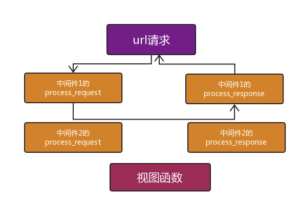

### process_view

```
process_view(self, request, callback, callback_args, callback_kwargs)
```

 **Mymiddlewares.py**修改如下


```
from django.utils.deprecation import MiddlewareMixin
from django.shortcuts import HttpResponse

class Md1(MiddlewareMixin):

    def process_request(self,request):
        print("Md1请求")
        #return HttpResponse("Md1中断")
    def process_response(self,request,response):
        print("Md1返回")
        return response

    def process_view(self, request, callback, callback_args, callback_kwargs):
        print("Md1view")

class Md2(MiddlewareMixin):

    def process_request(self,request):
        print("Md2请求")
        return HttpResponse("Md2中断")
    def process_response(self,request,response):
        print("Md2返回")
        return response

    def process_view(self, request, callback, callback_args, callback_kwargs):
        print("Md2view")
```


结果如下：


```
Md1请求
Md2请求
Md1view
Md2view
view函数...
Md2返回
Md1返回
```


下图进行分析上面的过程：

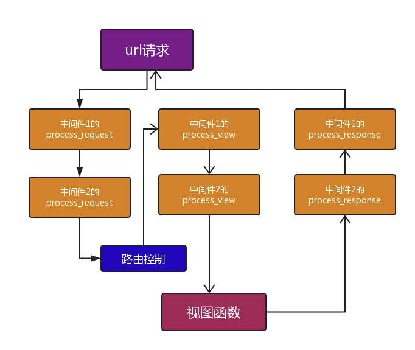

当最后一个中间的process_request到达路由关系映射之后，返回到中间件1的process_view，然后依次往下，到达views函数，最后通过process_response依次返回到达用户。

process_view可以用来调用视图函数：


```
class Md1(MiddlewareMixin):

    def process_request(self,request):
        print("Md1请求")
        #return HttpResponse("Md1中断")
    def process_response(self,request,response):
        print("Md1返回")
        return response

    def process_view(self, request, callback, callback_args, callback_kwargs):

        # return HttpResponse("hello")

        response=callback(request,*callback_args,**callback_kwargs)
        return response
```


结果如下：

```
Md1请求
Md2请求
view函数...
Md2返回
Md1返回
```

注意：process_view如果有返回值，会越过其他的process_view以及视图函数，但是所有的process_response都还会执行。

### process_exception

```
process_exception(``self``, request, exception)
```

示例修改如下：


```
class Md1(MiddlewareMixin):

    def process_request(self,request):
        print("Md1请求")
        #return HttpResponse("Md1中断")
    def process_response(self,request,response):
        print("Md1返回")
        return response

    def process_view(self, request, callback, callback_args, callback_kwargs):

        # return HttpResponse("hello")

        # response=callback(request,*callback_args,**callback_kwargs)
        # return response
        print("md1 process_view...")

    def process_exception(self):
        print("md1 process_exception...")


class Md2(MiddlewareMixin):

    def process_request(self,request):
        print("Md2请求")
        # return HttpResponse("Md2中断")
    def process_response(self,request,response):
        print("Md2返回")
        return response
    def process_view(self, request, callback, callback_args, callback_kwargs):
        print("md2 process_view...")

    def process_exception(self):
        print("md1 process_exception...")
```


结果如下：


```
Md1请求
Md2请求
md1 process_view...
md2 process_view...
view函数...

Md2返回
Md1返回
```


流程图如下：

当views出现错误时：


 

 将md2的process_exception修改如下：

```
  def process_exception(self,request,exception):

        print("md2 process_exception...")
        return HttpResponse("error")
```

结果如下：


```
Md1请求
Md2请求
md1 process_view...
md2 process_view...
view函数...
md2 process_exception...
Md2返回
Md1返回
```


## 应用案例

### **1、做IP访问频率限制**

某些IP访问服务器的频率过高，进行拦截，比如限制每分钟不能超过20次。

### **2、URL访问过滤**

如果用户访问的是login视图（放过）

如果访问其他视图，需要检测是不是有session认证，已经有了放行，没有返回login，这样就省得在多个视图函数上写装饰器了！

## 源码试读

作为延伸扩展内容，有余力的同学可以尝试着读一下以下两个自带的中间件：

```
'django.contrib.sessions.middleware.SessionMiddleware',
'django.contrib.auth.middleware.AuthenticationMiddleware',
```

 

 

　

  

 

