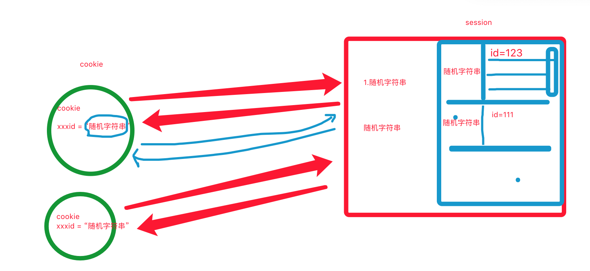
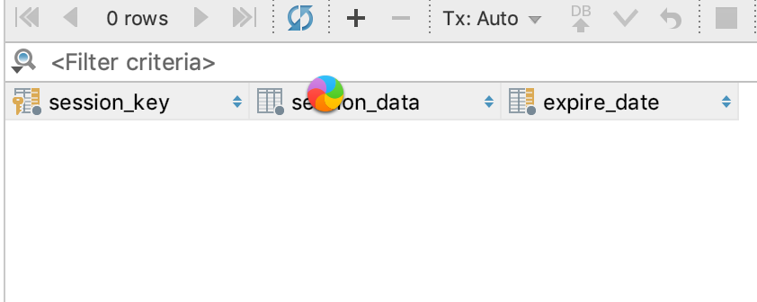

# day04

## 上节作业

- 牛存果：注册时数据插入不成功。
- 史俊贤：能收到验证码，但是注册没反应。
- 江栋：？
- 洪郭靖：？
- 毕云峰：有bug，重写项目。

## 内容回顾

- 项目规则

  - 创建项目：静态、视图、路由

- ajax

  ```
  $.ajax({
  	url: '...',
  	type:"GET",
  	data:{},
  	dataType: "JSON",
  	success:function(res){
  		
  	}
  })
  ```

- ModelForm/Form中想使用视图中数据，例如：request

  ```
  重写ModelForm/Form的 __init__ 方法，把想要的数据传递。
  ```

- django-redis


## 今日概要

- 点击注册
- 用户登录
  - 短信验证码登录
  - 手机or邮箱 / 密码登录
- 项目管理（创建&星标）


## 今日详细

### 1.点击注册

#### 1.1 点击收集数据&ajax

```
$.ajax({
    url:"",
    type:"POST",
    data:$('#regForm').serialize(), // 所有字段数据 + csrf token
    dataType:"JSON",
    success:function (res) {
    console.log(res);
    }
})
```

#### 1.2 数据校验(每个字段)

#### 1.3 写入数据库

#### 1.4 陈硕Bug

### 2. 短信登录

#### 2.1 展示页面

#### 2.2 点击发送短信

#### 2.3 点击登录

## 任务：3小时（下午4点开讲）

### 3.用户名/密码登录


#### 3.1 Python生成图片+写文字

https://www.cnblogs.com/wupeiqi/articles/5812291.html

```
pip3 install pillow
```

#### 3.2 Session & Cookie






#### 3.3 页面显示

#### 3.4 登录


## 总结&任务（一期项目结束）

- 项目代码
- 思维导图（知识点）


