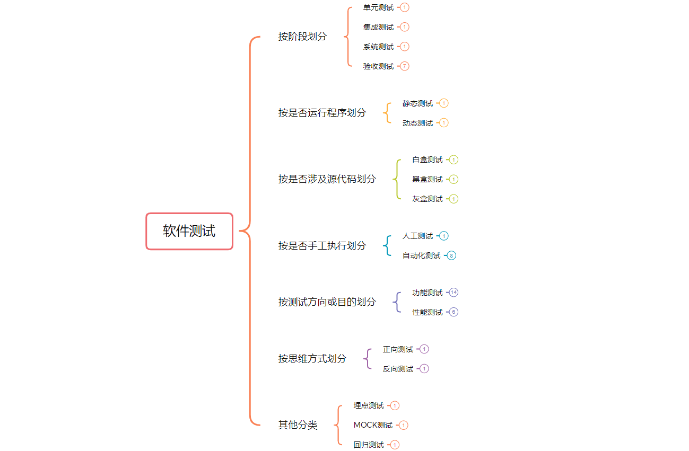
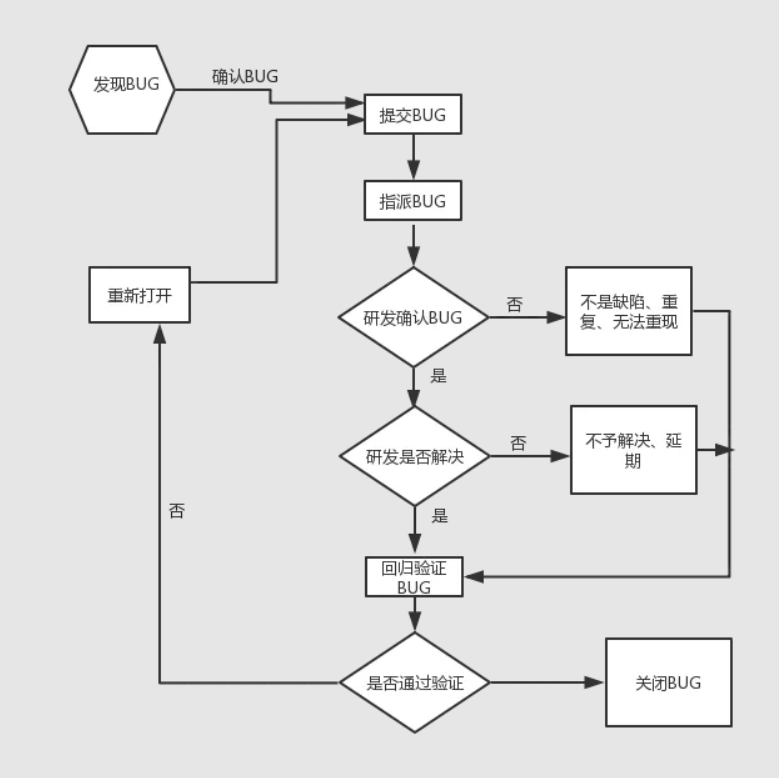
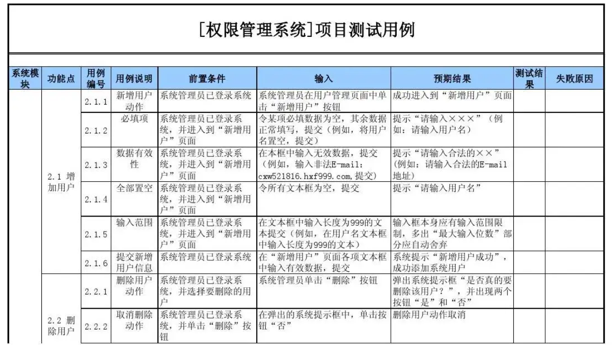
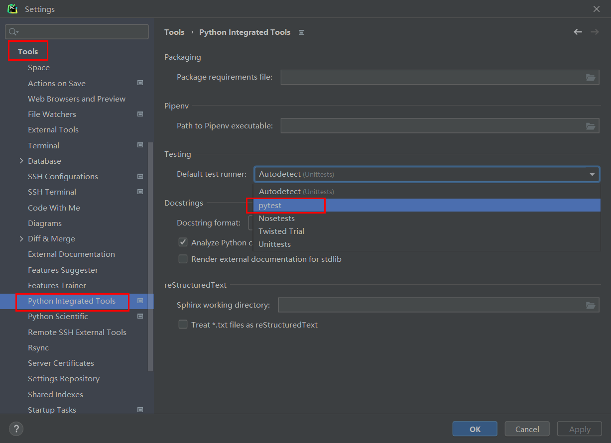

# 基本概念

自动化测试，也叫软件测试自动化。要学习软件测试自动化，首先就需要清楚什么是软件测试。

## 软件测试

因为当局者迷，旁观者清的道理，软件开发是个复杂而周期性的过程，期间很容易产生或遗留下错误，而对于开发人员自己所编写与开发的应用程序（软件），往往有很多问题是他们自己发现不了，所以如果直接把存在不足的、有错误、有漏洞的应用程序直接运营上线提供给用户使用，那么很可能会给企业带来商业风险或影响企业受益，所以就需要软件测试人员进行软件测试了。

而软件测试（Software Testing）就是为了尽快尽早地发现软件的各种软件缺陷而展开的贯穿整个软件生命周期、对软件（包括阶段性产品）进行验证和确认的活动过程。这个过程是在规定的条件下对程序进行测试操作并对其是否能满足设计要求进行评估，以达到发现、纠正程序错误，衡量和提升软件质量的目的。通俗点说，软件测试就是通过各种各样的手段或工具来尽可能的找到软件的不足和错误。

软件测试只能查找出软件中的错误或不足，但不能证明程序中没有错误，而且软件测试不能完全消灭软件的错误，只能尽早尽量多的发现软件中的错误与不足。

```
软件生命周期是指从软件产品的可行性分析到软件不再使用而结束的时间。如果把软件看成是有生命的事物，那么软件的生命周期可分为6个阶段：需求分析、计划、设计、编码开发、测试、运行维护
```


### 测试分类

软件测试从不同的角度有着不同的分类方式。



在实际开发中，往往我们都是根据实际情况采用多种不同的测试手段、测试方式来对软件测试测试的。


### 软件缺陷

软件缺陷，通常又被叫做bug或者defect，即为软件或程序中存在的某种破坏正常运行能力的问题、错误，其存在的最终表现为用户所需要的功能没有完全实现，不能满足或不能全部满足用户的需求。

+   从**产品内部**来说，软件缺陷是软件产品开发或维护过程中所存在的错误、误差等各种问题。

+   从**产品外部**来说，软件缺陷是系统所需要实现的某种功能的没有或不足。

#### 出现原因

bug出现的原因一般有如下几种情况，也就是说符合以下情况的问题都属于bug：

| 原因     | 描述                                                         |
| -------- | ------------------------------------------------------------ |
| 功能遗漏 | 软件未实现用户或产品需求要求的或应有的功能。                 |
| 异常错误 | 软件出现了不应该出现的错误。                                 |
| 功能冗余 | 软件出现了用户或产品需求没有要求的功能。                     |
| 体验度低 | 软件的使用过程过于复杂或难以理解、软件运行缓慢导致用户体验不好。 |


#### 缺陷管理

缺陷管理也叫bug管理，一般会集成到项目管理工具中，常用的项目管理工具：[Teambition](https://www.teambition.com/)、[禅道](https://demo.zentao.net/)、[pingcode](https://pingcode.com/)、飞书、钉钉等。大部分的项目管理工具内置的缺陷管理功能都会对缺陷划分成不同类型、严重等级、优先级别，以及不同的状态。

##### 缺陷类型

| bug类型    | 描述                                                         |
| ---------- | ------------------------------------------------------------ |
| 功能缺陷   | 软件中的功能没有实现或不完善而导致<br>使用过程出现异常错误、逻辑错误等问题。 |
| 界面缺陷   | 用户界面外观缺失或不足，影响了用户正常使用的问题。<br>如：名称过长时被遮挡、文字部分被遮挡、图片只展示部分等。 |
| 需求缺陷   | 需求规格说明书未明确或存在遗留需求的问题。                   |
| 性能问题   | 不满足系统可测量的属性值，如执行时间、处理速度等。<br>如：一个功能被用户使用时没有响应，或需要用户等待时间过久等。 |
| 接口缺陷   | 与其他组件、模块或程序、调用参数或参数列表等不匹配、出现冲突问题。<br>如传参个数与接口不匹配、传参类型与接口不匹配等。 |
| 兼容性缺陷 | 软件运行环境不匹配的问题<br>如操作系统、浏览器、网络环境等不匹配 |
| 易用性缺陷 | 新用户对软件难以快速熟悉或难以快速上手使用的问题。           |
| 代码错误   | 不满足需求、功能实现错误；对产品或项目质量有影响的bug        |
| 配置相关   | 由于提供的配置不当或者配置不能够满足实际要求而出现的问题     |
| 安装部署   | 由于部署安装引起的问题                                       |
| 安全相关   | 出现安全隐患问题，如存在SQL注入，xss攻击等。                 |
| 标准规范   | 不符合相关的国际、国家标准规范或业界规范等                   |

##### 严重等级

| 等级           | 描述                                                         |
| -------------- | ------------------------------------------------------------ |
| 致命缺陷（S1） | 软件任何一个主要功能完全丧失，用户数据受到破坏，软件崩溃、<br>悬挂或者危及用户人身安全。如软件崩溃造成硬件设备漏电等 |
| 严重缺陷（S2） | 软件的主要功能部分丧失，数据不能保存，软件的次要功能完全丧失，<br>系统所提供的功能或服务受到明显的影响。如软件的某个菜单不起作用 |
| 一般缺陷（S3） | 软件的次要功能没有完全实现，但不影响用户的正常使用。<br>如软件内的某些内容输入有误或无法输入。 |
| 较小缺陷（S4） | 用户体验不好或操作不方便，但不影响功能使用和运行。<br>如软件内出现错别字或排版有问题等。 |

##### 优先级别

| 优先级         | 描述                                                   |
| -------------- | ------------------------------------------------------ |
| 立即解决（P1） | 针对软件的致命缺陷，往往需要立即修复。                 |
| 优先解决（P2） | 针对软件的严重缺陷，影响了测试，需要优先修复。         |
| 等候解决（P3） | 针对软件的一般缺陷，需要正常排队等待修复。             |
| 建议解决（P4） | 针对软件的较小缺陷，可以在开发人员有时间时再进行修复。 |


##### 生命周期

从发现bug到关闭bug的这个时间段，我们称之为缺陷（bug）的生命周期。



在整个bug处理的流程上，一般会把bug划分成多个不同状态。

| 状态                        | 描述                                                         |
| --------------------------- | ------------------------------------------------------------ |
| 新建（New）                 | 当bug首次被发现时，测试人员会确认并记录下来，并将bug的状态为New |
| 已指派（Assigned）          | 当bug被指认为New之后，将其传递给开发组，开发组将确认这是否是bug，如果是则开发组的leader会将bug指派给某位开发人员处理，并将bug的状态<br>设定为“Assigned”。 |
| 重新指派（Reassigned）      | bug被重新指派给某位开发人员处理处理。                        |
| 已打开（Open）              | 一旦开发人员开始处理bug，就将bug的状态设为“Open”。           |
| 已修复（Fixed）             | 当开发人员进行处理（并认为已经解决）之后，就可以将bug的状态设置为“Fixed”并将其提交给开发组leader，然后leader将bug返还给测试组。 |
| 等待再测试（Pending Reset） | 当bug被返还到测试组后，会将bug的状态设置为“Pending Reset”    |
| 再测试(Reset)               | 测试组的leader将bug指定给某位测试人员进行再测试，并将bug的状态设置为“Reset”。 |
| 已关闭的（Closed）          | 如测试人员经过再次测试之后确认bug已被解决，会将bug的状态设置为 “Closed”。 |
| 再次打开的（Reopen）        | 如果经过再次测试发现bug仍然存在的话，测试人员将bug再次传递给开发组，并将bug的状态设置为“Reopen” |
| 拒绝中（Pending Reject）    | 如果测试人员传递到开发组的bug被开发组认为不是bug时，这种情况下开发组可以拒绝，将bug的状态设置为“Pending Reject”并返还给测试组。 |
| 被拒绝的(Rejected)          | 测试组的负责人接到拒绝的bug时，如果发现并不能算作bug时，测试组负责人将bug的状态设置为“Rejected”。当然，无法重现，bug信息不足或重复的bug，有时候也会被拒绝。 |
| 延期（Postponed）           | 对于一些特殊的bug的测试需要搁置一段时间，这种情况下，bug的状态就被设置为“Postponed“。 |


#### 缺陷报告

缺陷报告，也叫bug报告，是软件测试人员重要的产出物之一，也是主要工作之一。一份高质量的缺陷报告可以帮助开发人员快速定位问题，修复Bug；也便于测试人员对缺陷进行统计、分析和跟踪管理，是测试人员和开发人员重要的沟通工具。开发中针对需求，测试bug，最怕的就是口口相传。

缺陷报告的基本组成：**缺陷ID**，**缺陷标题**，发现者，前置条件，是否可重现，操作系统，发现时间，所属项目，所属模块，所属版本，缺陷状态，**严重等级**，**优先级别**，**附件描述**，**重现步骤**，预期效果，实际效果等。注意：加粗部分为BUG六要素。

参考模板：


缺陷报告就是软件测试的结果产出物，而如何验证和测试缺陷？那就要继续往下学习更多内容了。


### 测试原则

| 原则                         | 描述                                                         |
| ---------------------------- | ------------------------------------------------------------ |
| 测试显示软件存在缺陷         | 测试只能证明软件中存在缺陷，但并不能证明软件中不存在缺陷，即零缺陷是不可能的。<br>软件测试是为了降低存在缺陷的可能性，即便是没有找到缺陷，也不能证明软件是完美的。 |
| 穷尽测试是不可能的           | 现在软件的规模越来越大，复杂度越来越高，想做到完全性的测试是不可能的。<br>测试人员可以根据严重等级、优先级、场景、目的来分类别进行集中和高强度的测试，从而保证软件的质量。 |
| 测试尽早介入                 | 测试人员越早介入软件开发流程越好，最好在需求阶段就开始介入，使缺陷在需求或设计阶段就被发现，<br>缺陷发现越早，修复的成本就越小，反之，越晚发现修复成本就越高。 |
| 缺陷存在集群现象（二八定律） | 80%的缺陷往往存在于20%的模块中。一般项目复杂功能往往会占据所有功能的20%左右，而这20%的复杂功能往往有可能会包含大部分的缺陷。一个功能模块发现的缺陷频率越高，那存在的未被发现的缺陷出现频率也越高，故发现的缺陷与未发现的缺陷成正比。 |
| 杀虫剂悖论                   | 反复使用相同的杀虫剂会导致害虫对杀虫剂产生免疫而无法杀死害虫，软件测试也一样。如果一直使用相同的测试方法或手段，可能无法发现新的bug。为了解决这个问题，测试用例应当定期修订和评审，增加新的或不同的测试用例帮助发现更多的缺陷。 |
| 测试依赖于环境               | 测试在不同环境（操作系统，浏览器，解释器）下是不同的。所以不应该以完全相同的⽅法去测试两个不同的系统。 |
| 不存在缺陷的谬论             | 与第一条类似，期望仅仅发现并修复⼤量缺陷就能确保系统的成功，这是⼀个谬论。 |


## 测试自动化

著名的敏捷开发布道师 Mike Cohn（迈克·科恩） 在他的着作《Succeeding with Agile》(中文名：《Scrum敏捷软件开发》)一书中提出了测试金字塔的概念。


根据 Mike Cohn 的测试金字塔，测试的组合应该至少由以下三层组成 (自下往上分别是)：

-   单元测试（Unit Tests）
-   服务测试（Services Tests）
-   用户界面测试（UI Tests）

意思是，应该把测试不同粒度的测试分布到整个软件不同层次中，而随着层次越高，编写的测试内容应该越少，也就是写许多小而快的低层次单元测试，适当写一些更粗粒度的中层次接口测试或集成测试，写很少的高层次UI测试、系统测试或验收测试。

所以，根据测试金字塔理论，接下来我们按部就班对测试自动化的内容进行学习。


# 单元测试自动化

所谓的单元测试(Unit Test)是根据特定的输入数据，针对程序代码中的最小实体单元的输入输出的正确性进行验证测试的过程。所谓的最小实体单元就是组织项目代码的最基本代码结构：**函数，类，模块**等。在Python中比较知名的单元测试模块：

-   **unittest**
-   **pytest**
-   doctest
-   nose


## 测试用例

所谓的测试用例(Test Case)，就是执行测试的依据和记录，把测试应用程序的操作步骤**用文档的形式描述**出来的一份文档。文档的格式可以是Excel、markdown、html、xmind网页。

一份合格的测试用例有利于测试人员理清测试思路，确保需要测试的功能周全没有遗漏，方便测试工作的开展和评估测试工作量，同时还可以便于测试人员记录测试数据和测试工作进度，为后续的回归测试提供样本参考，提升测试效率以及后续测试工作的交接。

那么一份合格的测试用例长什么样子或有什么内容呢？

一份合格的测试用例，应该包含测试时间、测试人员、**测试模块名**、**功能点名称**、**用例ID**、**用例说明（测试目的）**、**前置条件**、**输入数据**、**预期结果**、**测试结果（输出结果、实际结果）**等。注意：加粗内容为必备的测试用例八要素。

参考文档：



在实际工作中，因为缺陷报告与测试用例作用相似，因此有时候会合并一起或只选择其中一种。

### 设计方法

那么在工作中，我们一般都应该编写测试用例或者应该怎么设计测试用例来完成我们的测试工作呢？实际上在工作中，测试人员都是基于测试用例的7种基本设计方法来设计与编写测试用例的：

+   **等价类划分法**：根据输入数据的有效性与无效性设计测试用例。
+   边界值分析法：对等价类划分法的一个补充，从等价类的边缘值（临界点）去寻找错误，基于这些错误来设计测试用例。
+   **判定表法**：把输入数据的各种可能情况进行组合罗列成一个判断表，以判断表来设计测试用例。
+   因果图法：用图解的方式表示输入数据的各种组合关系，以此写出判定表，从而设计相应的测试用例。
+   正交表法：基于[正交表](http://support.sas.com/techsup/technote/ts723_Designs.txt)来设计测试用例。
+   场景法：基于流程图展示业务流程或功能的调用流程，对流程图的走向路径设计测试用例。
+   错误推测法：基于经验和直觉，找出程序中认为可能出现的错误来设计测试用例。

一般在工作中，我们比较常用的是等价类划分法与判定表法。

#### 等价类划分法

等价类划分法就是按照测试要求，把具有共同特征的测试数据划分为2类：有效等价类和无效等价类，把测试数据进行分类以后设计测试用例。

+   有效等价类，就是符合程序使用要求或调用代码要求的，能正确使用程序或调用代码的一类数据。
+   无效等价类，就是不符合程序使用要求或调用代码要求的，会导致程序出现异常或结果不正确的一类数据。

使用等价类划分法，可以让我们设计的测试工作更加科学有依据，避免出现穷举测试的情况，减少测试用例的数量。

例如，注册功能中用户名的测试用例，如果功能需求中，要求用户名必须长度为3-11个长度的字符。

| 系统模块 | 功能点   | 用例ID | 测试目的   | 前置条件         | 输入              | 预期 | 结果 |
| -------- | -------- | ------ | ---------- | ---------------- | ----------------- | ---- | ---- |
| 会员模块 | 用户注册 | 01     | 验证用户名 | 打开用户注册页面 | "abc"             | 正确 |      |
| 会员模块 | 用户注册 | 02     | 验证用户名 | 打开用户注册页面 | "abdefgthssaaaaa" | 错误 |      |


#### 判定表法

判定表是分析和表达多逻辑条件下执行不同操作的情况的工具。而软件测试中的判定表法，就是把输入数据的各种可能情况进行组合罗列成一个判断表格，以判断表来设计测试用例。

判定表的表结构一般有如下2种：横向判断表与纵向判定表。

横向判断表：

| 条件桩 | 条件项 |
| ------ | ------ |
| 动作桩 | 动作项 |

纵向判定表：

| 条件桩 | 动作桩 |
| ------ | ------ |
| 条件项 | 动作项 |


例子，测试一个功能是否能修改文件。

| 如果使用纵向判定表： |                 |                 |                 |
| -------------------- | --------------- | --------------- | --------------- |
| 条件1：是否有权限    | 条件2：是否存在 | 结果1：可以修改 | 结果2：不能修改 |
| √                    | √               | √               | ✖               |
| √                    | ✖               | ✖               | √               |
| ✖                    | √               | ✖               | √               |
| ✖                    | ✖               | ✖               | √               |


| 如果使用横向判断表： |      |      |      |      |
| -------------------- | ---- | ---- | ---- | ---- |
| 条件桩：是否有权限   | ✔    | ✔    | ✖    | ✖    |
| 条件桩：是否存在     | ✔    | ✖    | ✔    | ✖    |
| 动作桩：可以修改     | ✔    | ✖    | ✖    | ✖    |
| 动作桩：不能修改     | ✖    | ✔    | ✔    | ✔    |


## 单元测试框架-Unittest

Unittest是Python开发中常用于单元测试的内置框架，免安装使用简单方便，其设计的灵感来源于Java的单元测试框架-Junit。

Unittest具备完整的测试结构，支持自动化测试的执行，对测试用例进行组织，并且提供了丰富的断言方法，还提供生成测试报告。

官方文档：https://docs.python.org/zh-cn/3/library/unittest.html

```
import unittest
print(dir(unittest))
```

上面的代码中，我们就引入了Unittest模块， 同时可以通过打印发现Unittest框架中内置了大量的工具成员。这些工具成员中除了以下5个以外，其他的都不怎么常用。

+   TestCase（测试用例）

    是unittest中最重要的一个类，用于编写测试用例类，是所有测试用例类的父类，实现了测试用例的基本代码。

    

+   TestSuite（测试套件、测试集）

    可以把多个TestCase组织、打包集成到一个测试集中一起执行，TestSuite可以实现多个测试用例的执行。

    

+   TextTestRunner（测试运行器）

    TestSuite本身不具备执行的功能，所以使用TextTestRunner执行测试套件和输出测试结果。

    

+   TestLoader（测试加载器）

    用于加载测试用例TestCase，并生成测试套件TestSuite，实现自动从代码中加载**大量**测试用例到测试套件中。

    

+   TestFixture（测试脚手架）

    所谓的测试脚手架就是为了开展一项或多项测试所需要进行的准备工作，以及所有相关的清理操作。测试脚手架实际上会在执行一些测试代码之前与之后，让我们编写一些初始化和销毁的代码。


### 快速入门

#### 测试用例-TestCase

前面讲到TestCase就是提供给我们编写测试用例的测试代码的，那么怎么编写一个测试用例？需要4个步骤即可。

1.  导入unittest模块

    ```python
    import unittest
    ```

2.  定义测试用例类

    ```python
    import unittest
    class 测试用例类名(unittest.TestCase): # 所有的测试用例类都必须直接或者间接继承unittest.TestCase.
        """测试用例"""
        pass
    ```

3.  定义测试用例方法（此处的测试用例方法，就是上面所说的测试用例设计方法中的一行信息的测试代码）

    ```python
    import unittest
    class 测试用例类名(unittest.TestCase):
        """测试用例"""
        # ....
        def test_测试方法名(参数):  # 测试方法必须以test开头或test_开头
            pass
        # ....
    ```

4.  执行测试用例

    ```python
    unittest.main()
    ```

在实际工作中，我们肯定是在项目中进行测试代码的编写或单独编写一个测试项目，但是我们现在刚开始学习，所以我们可以先编写一个例子代码，对其进行测试，以达到学习的目的。

unittest_01_测试用例的编写.py，代码：

```python
import unittest

# 被测试的代码单元
def add(x,y):
    return x+y

class FuncTest(unittest.TestCase):
    """测试用例"""
    def test_01(self):
        print(add(10, 20))

    def test_02(self):
        print(add("hello", "world"))

    # def test_03(self):
    #     print(add("hello", 20))


# 因为pycharm本身内置了执行unittest的功能，所以不适用以下代码也能执行，但是终端下或者使用其他的代码编辑器时，则需要加上。
if __name__ == '__main__':
    unittest.main()
```


#### 测试套件-TestSuite

前面我们将到测试套件，主要用于把多个测试用例类打包集成到一个测试集中一起执行。工作中，一个项目往往需要编写非常多的测试用例，而那么多的测试用例也不可能只编写在一个文件中，此时就需要使用测试套件了。2个步骤：

1.  通过unittest.TestSuite实例化测试套件对象

    ```
    suite = unittest.TestSuite()
    ```

    

2.  通过addTest方法添加测试用例

    +   添加测试用例方法

        ```python
        # 添加测试用例方法
        suite.addtest(测试用例类名("测试用例方法名"))
        
        # 批量添加测试用例方法
        test_data = (测试用例类名("测试用例方法名1"), 测试用例类名("测试用例方法名2"))
        suite.addtests(test_data)
        ```

    +   添加测试用例类(一次性添加测试用例的所有test_方法)

        ```python
        # 添加测试用例类
        suite.addtest(unittest.makeSuite(测试用例类名))
        
        # 批量添加测试用例类
        test_data = (unittest.makeSuite(测试用例类名1),  unittest.makeSuite(测试用例类名2))
        suite.addTests(test_data)
        ```

unittest_02_测试套件的基本使用.py，代码：

```python
import unittest

import unittest_01_测试用例的编写 as unittest_01

suite = unittest.TestSuite()

# # 添加测试用例方法
# suite.addTest(unittest_01.FuncTest("test_01"))
# suite.addTest(unittest_01.FuncTest("test_02"))

# # 批量添加测试用例方法
# test_data = (unittest_01.FuncTest("test_01"), unittest_01.FuncTest("test_02"))
# suite.addTests(test_data)


# # 添加测试用例类
# suite.addTest(unittest.makeSuite(unittest_01.FuncTest))


# 批量添加测试用例类
test_data = (unittest.makeSuite(unittest_01.FuncTest),  unittest.makeSuite(unittest_01.FuncTest))
suite.addTests(test_data)
```

TestSuite的作用仅仅是把多个测试用例打包集成到一块，但是并没有提供批量执行测试用例的方法，所以我们需要使用TextTestRunner了。


#### 测试运行器-TextTestRunner

前面说过，TextTestRunner是用于执行测试用例、测试套件和输出测试结果的。2个步骤：

+   实例化运行器对象

+   通过run方法执行测试


unittest_03_测试运行器基本使用.py，代码：

```python
import unittest

import unittest_01_测试用例的编写 as unittest_01

suite = unittest.TestSuite()

# # 添加测试用例方法
# suite.addTest(unittest_01.FuncTest("test_01"))
# suite.addTest(unittest_01.FuncTest("test_02"))

# # 批量添加测试用例方法
# test_data = (unittest_01.FuncTest("test_01"), unittest_01.FuncTest("test_02"))
# suite.addTests(test_data)


# # 添加测试用例类
# suite.addTest(unittest.makeSuite(unittest_01.FuncTest))


# 批量添加测试用例类
test_data = (unittest.makeSuite(unittest_01.FuncTest),  unittest.makeSuite(unittest_01.FuncTest))
suite.addTests(test_data)

if __name__ == '__main__':
    runner = unittest.TextTestRunner()
    runner.run(suite)
```


####  测试加载器-TestLoader

前面说过，用于加载测试用例TestCase，并生成测试套件TestSuite，实现自动从代码中加载**大量**测试用例到测试套件中。2个步骤：

+   实例化unittest.TestLoader对象

    ```python
    loader = unittest.TestLoader()
    ```

+   使用discover方法自动搜索指定目录下指定文件格式的python模块，并把查找到的测试用例组装打包集成到测试组件作为返回值。

    ```python
    loader.discover(目录路径, pattern="文件名格式")
    ```

    注意：pattern支持`*`号表示0到多个字符。

unittest_04_测试加载器基本使用.py，代码：

```python
import unittest
loader = unittest.TestLoader()
# 在当前目录下，搜索以unittest开头作为文件名的所有python文件，并把文件中的测试用例类打包集成到测试套件中
suite =loader.discover("./", pattern="unittest*.py")

if __name__ == '__main__':
    runner = unittest.TextTestRunner()
    runner.run(suite)
```


#### 测试脚手架-TestFixture

前面提到，测试脚手架会在执行一些测试代码之前与之后，让我们编写一些初始化和销毁的代码，主要分三个级别：

+   方法级别：在方法执行前与执行后都提供自动调用的实例方法

    setUp和tearDown

+   类级别：在类执行前与执行后都提供自动调用的类方法，不管类中有多少方法，只执行一次。

    setUpClass和tearDownClass

+   模块级别：在模块执行前与执行后都提供自动调用的函数，不管模块中有多少类或方法，只执行一次。

    setUpModule和tearDownModule


##### 方法级别的脚手架

在测试用例类中提供了2个固定名字的实例方法（setUp与tearDown），用于完成方法执行前与执行后的操作。

unittest_05_测试脚手架_方法级别的脚手架.py，代码：

```python
import unittest

# 被测试的代码单元
def add(x,y):
    return x+y

class AddTest(unittest.TestCase):
    """测试用例"""
    def setUp(self):
        print("每个方法执行前都会执行一遍setUp实例方法，用于完成通用的前置操作或初始化工作")

    def tearDown(self):
        print("每个方法执行后都会执行一遍tearDown实例方法，用于完成通用的后置操作或销毁工作")

    def test_01(self):
        print(add(10, 20))

    def test_03(self):
        print(add("hello", 20))


# 因为pycharm本身内置了执行unittest的功能，所以不适用以下代码也能执行，但是终端下或者使用其他的代码编辑器时，则需要加上。
if __name__ == '__main__':
    unittest.main()
```


##### 类级别的脚手架

在测试用例类中提供了2个固定名字的类方法（setUpClass与tearDownClass），用于完成类执行前与执行后的操作。

unittest_06_测试脚手架_类级别的脚手架.py，代码：

```python
import unittest

# 被测试的代码单元
def add(x,y):
    return x+y

class AddTest(unittest.TestCase):
    """测试用例"""
    @classmethod
    def setUpClass(cls):
        print("当前类执行前都会执行一遍setUpClass类方法，用于完成通用的前置操作或初始化工作")

    @classmethod
    def tearDownClass(cls):
        print("当前类执行后都会执行一遍tearDownClass类方法，用于完成通用的后置操作或销毁工作")

    def test_01(self):
        print(add(10, 20))

    def test_03(self):
        print(add("hello", 20))


# 因为pycharm本身内置了执行unittest的功能，所以不适用以下代码也能执行，但是终端下或者使用其他的代码编辑器时，则需要加上。
if __name__ == '__main__':
    unittest.main()
```


##### 模块级别的脚手架

在测试用例类中提供了2个固定名字的函数（setUpModule与tearDownModule），用于完成类执行前与执行后的操作。

unittest_07_测试脚手架_模块级别的脚手架.py，代码：

```python
import unittest


def setUpModule():
    print("当前模块执行前都会执行一遍setUpModule函数，用于完成通用的前置操作或初始化工作")


def tearDownModule():
    print("当前模块执行前都会执行一遍tearDownModule函数，用于完成通用的前置操作或初始化工作")


# 被测试的代码单元
def add(x, y):
    return x + y


class AddTest1(unittest.TestCase):
    """测试用例"""

    @classmethod
    def setUpClass(cls):
        print("当前类执行前都会执行一遍setUpClass类方法，用于完成通用的前置操作或初始化工作")

    @classmethod
    def tearDownClass(cls):
        print("当前类执行后都会执行一遍tearDownClass类方法，用于完成通用的后置操作或销毁工作")

    def test_01(self):
        print(add(10, 20))


class AddTest2(unittest.TestCase):
    """测试用例"""

    @classmethod
    def setUpClass(cls):
        print("当前类执行前都会执行一遍setUp方法，用于完成通用的前置操作或初始化工作")

    @classmethod
    def tearDownClass(cls):
        print("当前类执行后都会执行一遍tearDown方法，用于完成通用的后置操作或销毁工作")

    def test_03(self):
        print(add("hello", 20))


# 因为pycharm本身内置了执行unittest的功能，所以不适用以下代码也能执行，但是终端下或者使用其他的代码编辑器时，则需要加上。
if __name__ == '__main__':
    unittest.main()
```


#### 生成HTML格式测试报告(很少使用，基本不使用)

使用HTMLTestRunner模块可以直接生成HTML格式的报告。HTMLTestRunner是一个不再维护的第三方的模块，通过pip工具安装不了，只能下载后手动导入。

HTMLTestRunner官网：http://tungwaiyip.info/software/HTMLTestRunner.html

HTMLTestRunner下载：http://tungwaiyip.info/software/HTMLTestRunner_0_8_2/HTMLTestRunner.py

因为HTMLTestRunner是python2模块的，所以在python3.x以后需要做些修改才可以使用，修改后版本代码如下：

```python
"""
A TestRunner for use with the Python unit testing framework. It
generates a HTML report to show the result at a glance.

The simplest way to use this is to invoke its main method. E.g.

    import unittest
    import HTMLTestRunner

    ... define your tests ...

    if __name__ == '__main__':
        HTMLTestRunner.main()


For more customization options, instantiates a HTMLTestRunner object.
HTMLTestRunner is a counterpart to unittest's TextTestRunner. E.g.

    # output to a file
    fp = file('my_report.html', 'wb')
    runner = HTMLTestRunner.HTMLTestRunner(
                stream=fp,
                title='My unit test',
                description='This demonstrates the report output by HTMLTestRunner.'
                )

    # Use an external stylesheet.
    # See the Template_mixin class for more customizable options
    runner.STYLESHEET_TMPL = '<link rel="stylesheet" href="my_stylesheet.css" type="text/css">'

    # run the test
    runner.run(my_test_suite)


------------------------------------------------------------------------
Copyright (c) 2004-2007, Wai Yip Tung
All rights reserved.

Redistribution and use in source and binary forms, with or without
modification, are permitted provided that the following conditions are
met:

* Redistributions of source code must retain the above copyright notice,
  this list of conditions and the following disclaimer.
* Redistributions in binary form must reproduce the above copyright
  notice, this list of conditions and the following disclaimer in the
  documentation and/or other materials provided with the distribution.
* Neither the name Wai Yip Tung nor the names of its contributors may be
  used to endorse or promote products derived from this software without
  specific prior written permission.

THIS SOFTWARE IS PROVIDED BY THE COPYRIGHT HOLDERS AND CONTRIBUTORS "AS
IS" AND ANY EXPRESS OR IMPLIED WARRANTIES, INCLUDING, BUT NOT LIMITED
TO, THE IMPLIED WARRANTIES OF MERCHANTABILITY AND FITNESS FOR A
PARTICULAR PURPOSE ARE DISCLAIMED. IN NO EVENT SHALL THE COPYRIGHT OWNER
OR CONTRIBUTORS BE LIABLE FOR ANY DIRECT, INDIRECT, INCIDENTAL, SPECIAL,
EXEMPLARY, OR CONSEQUENTIAL DAMAGES (INCLUDING, BUT NOT LIMITED TO,
PROCUREMENT OF SUBSTITUTE GOODS OR SERVICES; LOSS OF USE, DATA, OR
PROFITS; OR BUSINESS INTERRUPTION) HOWEVER CAUSED AND ON ANY THEORY OF
LIABILITY, WHETHER IN CONTRACT, STRICT LIABILITY, OR TORT (INCLUDING
NEGLIGENCE OR OTHERWISE) ARISING IN ANY WAY OUT OF THE USE OF THIS
SOFTWARE, EVEN IF ADVISED OF THE POSSIBILITY OF SUCH DAMAGE.
"""

# URL: http://tungwaiyip.info/software/HTMLTestRunner.html

__author__ = "Wai Yip Tung"
__version__ = "0.8.2"


"""
Change History

Version 0.8.2
* Show output inline instead of popup window (Viorel Lupu).

Version in 0.8.1
* Validated XHTML (Wolfgang Borgert).
* Added description of test classes and test cases.

Version in 0.8.0
* Define Template_mixin class for customization.
* Workaround a IE 6 bug that it does not treat <script> block as CDATA.

Version in 0.7.1
* Back port to Python 2.3 (Frank Horowitz).
* Fix missing scroll bars in detail log (Podi).
"""

# TODO: color stderr
# TODO: simplify javascript using ,ore than 1 class in the class attribute?

import datetime
import io
import sys
import time
import unittest
from xml.sax import saxutils


# ------------------------------------------------------------------------
# The redirectors below are used to capture output during testing. Output
# sent to sys.stdout and sys.stderr are automatically captured. However
# in some cases sys.stdout is already cached before HTMLTestRunner is
# invoked (e.g. calling logging.basicConfig). In order to capture those
# output, use the redirectors for the cached stream.
#
# e.g.
#   >>> logging.basicConfig(stream=HTMLTestRunner.stdout_redirector)
#   >>>

class OutputRedirector(object):
    """ Wrapper to redirect stdout or stderr """
    def __init__(self, fp):
        self.fp = fp

    def write(self, s):
        self.fp.write(s)

    def writelines(self, lines):
        self.fp.writelines(lines)

    def flush(self):
        self.fp.flush()

stdout_redirector = OutputRedirector(sys.stdout)
stderr_redirector = OutputRedirector(sys.stderr)


# ----------------------------------------------------------------------
# Template

class Template_mixin(object):
    """
    Define a HTML template for report customerization and generation.

    Overall structure of an HTML report

    HTML
    +------------------------+
    |<html>                  |
    |  <head>                |
    |                        |
    |   STYLESHEET           |
    |   +----------------+   |
    |   |                |   |
    |   +----------------+   |
    |                        |
    |  </head>               |
    |                        |
    |  <body>                |
    |                        |
    |   HEADING              |
    |   +----------------+   |
    |   |                |   |
    |   +----------------+   |
    |                        |
    |   REPORT               |
    |   +----------------+   |
    |   |                |   |
    |   +----------------+   |
    |                        |
    |   ENDING               |
    |   +----------------+   |
    |   |                |   |
    |   +----------------+   |
    |                        |
    |  </body>               |
    |</html>                 |
    +------------------------+
    """

    STATUS = {
    0: 'pass',
    1: 'fail',
    2: 'error',
    }

    DEFAULT_TITLE = 'Unit Test Report'
    DEFAULT_TESTER = 'Unit Test'
    DEFAULT_DESCRIPTION = ''

    # ------------------------------------------------------------------------
    # HTML Template

    HTML_TMPL = r"""<?xml version="1.0" encoding="UTF-8"?>
<!DOCTYPE html PUBLIC "-//W3C//DTD XHTML 1.0 Strict//EN" "http://www.w3.org/TR/xhtml1/DTD/xhtml1-strict.dtd">
<html xmlns="http://www.w3.org/1999/xhtml">
<head>
    <title>%(title)s</title>
    <meta name="generator" content="%(generator)s"/>
    <meta http-equiv="Content-Type" content="text/html; charset=UTF-8"/>
    %(stylesheet)s
</head>
<body>
<script language="javascript" type="text/javascript"><!--
output_list = Array();

/* level - 0:Summary; 1:Failed; 2:All */
function showCase(level) {
    trs = document.getElementsByTagName("tr");
    for (var i = 0; i < trs.length; i++) {
        tr = trs[i];
        id = tr.id;
        if (id.substr(0,2) == 'ft') {
            if (level < 1) {
                tr.className = 'hiddenRow';
            }
            else {
                tr.className = '';
            }
        }
        if (id.substr(0,2) == 'pt') {
            if (level > 1) {
                tr.className = '';
            }
            else {
                tr.className = 'hiddenRow';
            }
        }
    }
}


function showClassDetail(cid, count) {
    var id_list = Array(count);
    var toHide = 1;
    for (var i = 0; i < count; i++) {
        tid0 = 't' + cid.substr(1) + '.' + (i+1);
        tid = 'f' + tid0;
        tr = document.getElementById(tid);
        if (!tr) {
            tid = 'p' + tid0;
            tr = document.getElementById(tid);
        }
        id_list[i] = tid;
        if (tr.className) {
            toHide = 0;
        }
    }
    for (var i = 0; i < count; i++) {
        tid = id_list[i];
        if (toHide) {
            document.getElementById('div_'+tid).style.display = 'none'
            document.getElementById(tid).className = 'hiddenRow';
        }
        else {
            document.getElementById(tid).className = '';
        }
    }
}


function showTestDetail(div_id){
    var details_div = document.getElementById(div_id)
    var displayState = details_div.style.display
    // alert(displayState)
    if (displayState != 'block' ) {
        displayState = 'block'
        details_div.style.display = 'block'
    }
    else {
        details_div.style.display = 'none'
    }
}


function html_escape(s) {
    s = s.replace(/&/g,'&amp;');
    s = s.replace(/</g,'&lt;');
    s = s.replace(/>/g,'&gt;');
    return s;
}

/* obsoleted by detail in <div>
function showOutput(id, name) {
    var w = window.open("", //url
                    name,
                    "resizable,scrollbars,status,width=800,height=450");
    d = w.document;
    d.write("<pre>");
    d.write(html_escape(output_list[id]));
    d.write("\n");
    d.write("<a href='javascript:window.close()'>close</a>\n");
    d.write("</pre>\n");
    d.close();
}
*/
--></script>

%(heading)s
%(report)s
%(ending)s

</body>
</html>
"""
    # variables: (title, generator, stylesheet, heading, report, ending)


    # ------------------------------------------------------------------------
    # Stylesheet
    #
    # alternatively use a <link> for external style sheet, e.g.
    #   <link rel="stylesheet" href="$url" type="text/css">

    STYLESHEET_TMPL = """
<style type="text/css" media="screen">
body        { font-family: verdana, arial, helvetica, sans-serif; font-size: 80%; }
table       { font-size: 100%; }
pre         { }

/* -- heading ---------------------------------------------------------------------- */
h1 {
  font-size: 16pt;
  color: gray;
}
.heading {
    margin-top: 0ex;
    margin-bottom: 1ex;
}

.heading .attribute {
    margin-top: 1ex;
    margin-bottom: 0;
}

.heading .description {
    margin-top: 4ex;
    margin-bottom: 6ex;
}

/* -- css div popup ------------------------------------------------------------------------ */
a.popup_link {
}

a.popup_link:hover {
    color: red;
}

.popup_window {
    display: none;
    position: relative;
    left: 0px;
    top: 0px;
    /*border: solid #627173 1px; */
    padding: 10px;
    background-color: #E6E6D6;
    font-family: "Lucida Console", "Courier New", Courier, monospace;
    text-align: left;
    font-size: 8pt;
    width: 500px;
}

}
/* -- report ------------------------------------------------------------------------ */
#show_detail_line {
    margin-top: 3ex;
    margin-bottom: 1ex;
}
#result_table {
    width: 80%;
    border-collapse: collapse;
    border: 1px solid #777;
}
#header_row {
    font-weight: bold;
    color: white;
    background-color: #777;
}
#result_table td {
    border: 1px solid #777;
    padding: 2px;
}
#total_row  { font-weight: bold; }
.passClass  { background-color: #6c6; }
.failClass  { background-color: #c60; }
.errorClass { background-color: #c00; }
.passCase   { color: #6c6; }
.failCase   { color: #c60; font-weight: bold; }
.errorCase  { color: #c00; font-weight: bold; }
.hiddenRow  { display: none; }
.testcase   { margin-left: 2em; }


/* -- ending ---------------------------------------------------------------------- */
#ending {
}

</style>
"""


    # ------------------------------------------------------------------------
    # Heading
    #

    HEADING_TMPL = """<div class='heading'>
<h1>%(title)s</h1>
%(parameters)s
<p class='description'>%(description)s</p>
</div>

""" # variables: (title, parameters, description)

    HEADING_ATTRIBUTE_TMPL = """<p class='attribute'><strong>%(name)s:</strong> %(value)s</p>
""" # variables: (name, value)


    # ------------------------------------------------------------------------
    # Report
    #

    REPORT_TMPL = """
<p id='show_detail_line'>Show
<a href='javascript:showCase(0)'>Summary</a>
<a href='javascript:showCase(1)'>Failed</a>
<a href='javascript:showCase(2)'>All</a>
</p>
<table id='result_table'>
<colgroup>
<col align='left' />
<col align='right' />
<col align='right' />
<col align='right' />
<col align='right' />
<col align='right' />
</colgroup>
<tr id='header_row'>
    <td>Test Group/Test case</td>
    <td>Count</td>
    <td>Pass</td>
    <td>Fail</td>
    <td>Error</td>
    <td>View</td>
</tr>
%(test_list)s
<tr id='total_row'>
    <td>Total</td>
    <td>%(count)s</td>
    <td>%(Pass)s</td>
    <td>%(fail)s</td>
    <td>%(error)s</td>
    <td>&nbsp;</td>
</tr>
</table>
""" # variables: (test_list, count, Pass, fail, error)

    REPORT_CLASS_TMPL = r"""
<tr class='%(style)s'>
    <td>%(desc)s</td>
    <td>%(count)s</td>
    <td>%(Pass)s</td>
    <td>%(fail)s</td>
    <td>%(error)s</td>
    <td><a href="javascript:showClassDetail('%(cid)s',%(count)s)">Detail</a></td>
</tr>
""" # variables: (style, desc, count, Pass, fail, error, cid)


    REPORT_TEST_WITH_OUTPUT_TMPL = r"""
<tr id='%(tid)s' class='%(Class)s'>
    <td class='%(style)s'><div class='testcase'>%(desc)s</div></td>
    <td colspan='5' align='center'>

    <!--css div popup start-->
    <a class="popup_link" onfocus='this.blur();' href="javascript:showTestDetail('div_%(tid)s')" >
        %(status)s</a>

    <div id='div_%(tid)s' class="popup_window">
        <div style='text-align: right; color:red;cursor:pointer'>
        <a onfocus='this.blur();' onclick="document.getElementById('div_%(tid)s').style.display = 'none' " >
           [x]</a>
        </div>
        <pre>
        %(script)s
        </pre>
    </div>
    <!--css div popup end-->

    </td>
</tr>
""" # variables: (tid, Class, style, desc, status)


    REPORT_TEST_NO_OUTPUT_TMPL = r"""
<tr id='%(tid)s' class='%(Class)s'>
    <td class='%(style)s'><div class='testcase'>%(desc)s</div></td>
    <td colspan='5' align='center'>%(status)s</td>
</tr>
""" # variables: (tid, Class, style, desc, status)


    REPORT_TEST_OUTPUT_TMPL = r"""
%(id)s: %(output)s
""" # variables: (id, output)


    # ------------------------------------------------------------------------
    # ENDING
    #

    ENDING_TMPL = """<div id='ending'>&nbsp;</div>"""

# -------------------- The end of the Template class -------------------


TestResult = unittest.TestResult

class _TestResult(TestResult):
    # note: _TestResult is a pure representation of results.
    # It lacks the output and reporting ability compares to unittest._TextTestResult.

    def __init__(self, verbosity=1):
        TestResult.__init__(self)
        self.stdout0 = None
        self.stderr0 = None
        self.success_count = 0
        self.failure_count = 0
        self.error_count = 0
        self.verbosity = verbosity

        # result is a list of result in 4 tuple
        # (
        #   result code (0: success; 1: fail; 2: error),
        #   TestCase object,
        #   Test output (byte string),
        #   stack trace,
        # )
        self.result = []


    def startTest(self, test):
        TestResult.startTest(self, test)
        # just one buffer for both stdout and stderr
        self.outputBuffer = io.StringIO()
        stdout_redirector.fp = self.outputBuffer
        stderr_redirector.fp = self.outputBuffer
        self.stdout0 = sys.stdout
        self.stderr0 = sys.stderr
        sys.stdout = stdout_redirector
        sys.stderr = stderr_redirector


    def complete_output(self):
        """
        Disconnect output redirection and return buffer.
        Safe to call multiple times.
        """
        if self.stdout0:
            sys.stdout = self.stdout0
            sys.stderr = self.stderr0
            self.stdout0 = None
            self.stderr0 = None
        return self.outputBuffer.getvalue()


    def stopTest(self, test):
        # Usually one of addSuccess, addError or addFailure would have been called.
        # But there are some path in unittest that would bypass this.
        # We must disconnect stdout in stopTest(), which is guaranteed to be called.
        self.complete_output()


    def addSuccess(self, test):
        self.success_count += 1
        TestResult.addSuccess(self, test)
        output = self.complete_output()
        self.result.append((0, test, output, ''))
        if self.verbosity > 1:
            sys.stderr.write('ok ')
            sys.stderr.write(str(test))
            sys.stderr.write('\n')
        else:
            sys.stderr.write('.')

    def addError(self, test, err):
        self.error_count += 1
        TestResult.addError(self, test, err)
        _, _exc_str = self.errors[-1]
        output = self.complete_output()
        self.result.append((2, test, output, _exc_str))
        if self.verbosity > 1:
            sys.stderr.write('E  ')
            sys.stderr.write(str(test))
            sys.stderr.write('\n')
        else:
            sys.stderr.write('E')

    def addFailure(self, test, err):
        self.failure_count += 1
        TestResult.addFailure(self, test, err)
        _, _exc_str = self.failures[-1]
        output = self.complete_output()
        self.result.append((1, test, output, _exc_str))
        if self.verbosity > 1:
            sys.stderr.write('F  ')
            sys.stderr.write(str(test))
            sys.stderr.write('\n')
        else:
            sys.stderr.write('F')


class HTMLTestRunner(Template_mixin):
    """
    """
    def __init__(self, stream=sys.stdout, verbosity=1, title=None, description=None, tester=None):
        self.stream = stream
        self.verbosity = verbosity
        if title is None:
            self.title = self.DEFAULT_TITLE
        else:
            self.title = title
        if description is None:
            self.description = self.DEFAULT_DESCRIPTION
        else:
            self.description = description

        self.startTime = datetime.datetime.now()
        if tester is None:
            self.tester = self.DEFAULT_TITLE
        else:
            self.tester = tester

    def run(self, test):
        "Run the given test case or test suite."
        result = _TestResult(self.verbosity)
        test(result)
        self.stopTime = datetime.datetime.now()
        self.generateReport(test, result)
        print (sys.stderr, "\nTime Elapsed: %s" %(self.stopTime-self.startTime))
        return result


    def sortResult(self, result_list):
        # unittest does not seems to run in any particular order.
        # Here at least we want to group them together by class.
        rmap = {}
        classes = []
        for n,t,o,e in result_list:
            cls = t.__class__
            if not cls in rmap:
                rmap[cls] = []
                classes.append(cls)
            rmap[cls].append((n,t,o,e))
        r = [(cls, rmap[cls]) for cls in classes]
        return r


    def getReportAttributes(self, result):
        """
        Return report attributes as a list of (name, value).
        Override this to add custom attributes.
        """
        startTime = str(self.startTime)[:19]
        duration = str(self.stopTime - self.startTime)
        status = []
        if result.success_count: status.append('Pass %s'    % result.success_count)
        if result.failure_count: status.append('Failure %s' % result.failure_count)
        if result.error_count:   status.append('Error %s'   % result.error_count  )
        if status:
            status = ' '.join(status)
        else:
            status = 'none'
        return [
            ('Start Time', startTime),
            ('Duration', duration),
            ('Status', status),
            ('Tester', self.tester),
        ]


    def generateReport(self, test, result):
        report_attrs = self.getReportAttributes(result)
        generator = 'HTMLTestRunner %s' % __version__
        stylesheet = self._generate_stylesheet()
        heading = self._generate_heading(report_attrs)
        report = self._generate_report(result)
        ending = self._generate_ending()
        output = self.HTML_TMPL % dict(
            title = saxutils.escape(self.title),
            generator = generator,
            stylesheet = stylesheet,
            heading = heading,
            report = report,
            ending = ending,
        )
        self.stream.write(output.encode('utf8'))


    def _generate_stylesheet(self):
        return self.STYLESHEET_TMPL


    def _generate_heading(self, report_attrs):
        a_lines = []
        for name, value in report_attrs:
            line = self.HEADING_ATTRIBUTE_TMPL % dict(
                    name = saxutils.escape(name),
                    value = saxutils.escape(value),
                )
            a_lines.append(line)
        heading = self.HEADING_TMPL % dict(
            title = saxutils.escape(self.title),
            parameters = ''.join(a_lines),
            description = saxutils.escape(self.description),
        )
        return heading


    def _generate_report(self, result):
        rows = []
        sortedResult = self.sortResult(result.result)
        for cid, (cls, cls_results) in enumerate(sortedResult):
            # subtotal for a class
            np = nf = ne = 0
            for n,t,o,e in cls_results:
                if n == 0: np += 1
                elif n == 1: nf += 1
                else: ne += 1

            # format class description
            if cls.__module__ == "__main__":
                name = cls.__name__
            else:
                name = "%s.%s" % (cls.__module__, cls.__name__)
            doc = cls.__doc__ and cls.__doc__.split("\n")[0] or ""
            desc = doc and '%s: %s' % (name, doc) or name

            row = self.REPORT_CLASS_TMPL % dict(
                style = ne > 0 and 'errorClass' or nf > 0 and 'failClass' or 'passClass',
                desc = desc,
                count = np+nf+ne,
                Pass = np,
                fail = nf,
                error = ne,
                cid = 'c%s' % (cid+1),
            )
            rows.append(row)

            for tid, (n,t,o,e) in enumerate(cls_results):
                self._generate_report_test(rows, cid, tid, n, t, o, e)

        report = self.REPORT_TMPL % dict(
            test_list = ''.join(rows),
            count = str(result.success_count+result.failure_count+result.error_count),
            Pass = str(result.success_count),
            fail = str(result.failure_count),
            error = str(result.error_count),
        )
        return report


    def _generate_report_test(self, rows, cid, tid, n, t, o, e):
        # e.g. 'pt1.1', 'ft1.1', etc
        has_output = bool(o or e)
        tid = (n == 0 and 'p' or 'f') + 't%s.%s' % (cid+1,tid+1)
        name = t.id().split('.')[-1]
        doc = t.shortDescription() or ""
        desc = doc and ('%s: %s' % (name, doc)) or name
        tmpl = has_output and self.REPORT_TEST_WITH_OUTPUT_TMPL or self.REPORT_TEST_NO_OUTPUT_TMPL

        # o and e should be byte string because they are collected from stdout and stderr?
        if isinstance(o,str):
            # TODO: some problem with 'string_escape': it escape \n and mess up formating
            # uo = unicode(o.encode('string_escape'))
            uo=o
        else:
            uo = o

        ue = e

        script = self.REPORT_TEST_OUTPUT_TMPL % dict(
            id = tid,
            output = saxutils.escape(uo+ue),
        )

        row = tmpl % dict(
            tid = tid,
            Class = (n == 0 and 'hiddenRow' or 'none'),
            style = n == 2 and 'errorCase' or (n == 1 and 'failCase' or 'none'),
            desc = desc,
            script = script,
            status = self.STATUS[n],
        )
        rows.append(row)
        if not has_output:
            return

    def _generate_ending(self):
        return self.ENDING_TMPL


##############################################################################
# Facilities for running tests from the command line
##############################################################################

# Note: Reuse unittest.TestProgram to launch test. In the future we may
# build our own launcher to support more specific command line
# parameters like test title, CSS, etc.
class TestProgram(unittest.TestProgram):
    """
    A variation of the unittest.TestProgram. Please refer to the base
    class for command line parameters.
    """
    def runTests(self):
        # Pick HTMLTestRunner as the default test runner.
        # base class's testRunner parameter is not useful because it means
        # we have to instantiate HTMLTestRunner before we know self.verbosity.
        if self.testRunner is None:
            self.testRunner = HTMLTestRunner(verbosity=self.verbosity)
        unittest.TestProgram.runTests(self)

main = TestProgram

##############################################################################
# Executing this module from the command line
##############################################################################

if __name__ == "__main__":
    main(module=None)
```


打印HTML格式的测试报告，unittest_08_打印HTML格式的测试报告.py，代码：

```python
import unittest
from HTMLTestRunner import HTMLTestRunner
import unittest_01_测试用例的编写 as unittest_01

suite = unittest.TestSuite()

test_data = (unittest.makeSuite(unittest_01.FuncTest),  unittest.makeSuite(unittest_01.FuncTest))
suite.addTests(test_data)

if __name__ == '__main__':
    # 生成html报告
    with open("test_report.html", "wb") as file:
        runner = HTMLTestRunner(
            stream=file,
            title="单元测试的HTML格式报告",
            description="python单元测试报告",
            tester="墨落"
        )
        runner.run(suite)
```


#### 断言

断言(assertion)是一种在程序中的判断测试用例执行结果是否符合预期结果的方式，所以断言也被称之为“期望”。当程序执行到断言的位置时，对应的断言应该为真。若断言不为真时，程序会中止执行，并给出错误信息。

unittest中常用的断言方法（加粗为重要方法）：

| 断言方法                                 | 断言描述                               |
| :--------------------------------------- | :------------------------------------- |
| **assertEqual(arg1, arg2, msg=None)**    | 验证arg1=arg2，不等则fail              |
| **assertNotEqual(arg1, arg2, msg=None)** | 验证arg1 != arg2, 相等则fail           |
| **assertTrue(expr, msg=None)**           | 验证expr是true，如果为false，则fail    |
| **assertFalse(expr,msg=None)**           | 验证expr是false，如果为true，则fail    |
| **assertIs(arg1, arg2, msg=None)**       | 验证arg1、arg2是同一个对象，不是则fail |
| **assertIsNot(arg1, arg2, msg=None)**    | 验证arg1、arg2不是同一个对象，是则fail |
| **assertIsNone(expr, msg=None)**         | 验证expr是None，不是则fail             |
| **assertIsNotNone(expr, msg=None)**      | 验证expr不是None，是则fail             |
| **assertIn(arg1, arg2, msg=None)**       | 验证arg1是arg2的子串，不是则fail       |
| **assertNotIn(arg1, arg2, msg=None)**    | 验证arg1不是arg2的子串，是则fail       |
| assertIsInstance(obj, cls, msg=None)     | 验证obj是cls的实例，不是则fail         |
| assertNotIsInstance(obj, cls, msg=None)  | 验证obj不是cls的实例，是则fail         |


unittest_09_断言.py，代码：

```python
import unittest

def add(x ,y):
    return x + y


class AddTest(unittest.TestCase):
    def test_01(self):
        res = add(1,2)
        # 断言结果是否与预期内容相同
        # self.assertEqual(res, 3, msg="断言失败！一般会错误的结果与原因")
        # self.assertEqual(res, 2, msg="断言失败！一般会错误的结果与原因")
        self.assertIn(res, [1, 2], msg="断言失败！一般会错误的结果与原因")

if __name__ == '__main__':
    unittest.main()

```


#### 跳过

针对开发中有时候针对不同环境或者不同的时间段，不同的代码版本，有时候部分测试用例不希望被执行，则可以使用跳过。

```python
@unittest.skipIf(判断条件表达式, 跳过原因)
```

unittest_10_跳过.py，代码：

```python
import unittest


def add(x, y):
    return x + y


version = (2, 7, 0)

class AddTest(unittest.TestCase):
    def setUp(self):
        print("setUP执行....")

    @unittest.skipIf(version <= (3, 5, 0), "版本低于3.5，所以不测试test_01")
    def test_01(self):
        res = add(1, 2)
        self.assertIn(res, [1, 3], msg="断言失败！一般会错误的结果与原因")

    def test_02(self):
        res = add("a", "B")
        self.assertEqual(res, "aB", msg="断言失败！一般会错误的结果与原因")


if __name__ == '__main__':
    unittest.main()

```


#### 参数化

当需要使用多组不同的测试数据测试同一个方法时，可以使用unittest参数化来解决。常用的参数化方法有ddt、paramunittes

```python
pip install parameterized
```

unittest_11_参数化.py，代码：

```python
import unittest
from parameterized import parameterized

def add(x, y):
    return x + y


version = (2, 7, 0)

class AddTest(unittest.TestCase):
    def setUp(self):
        print("setUP执行....")

    @parameterized.expand([(10,20), ("a","B"), (50, 20)])
    def test_00(self, x, y):
        res = add(x, y)
        self.assertIn(res, [1, 30, "aB", 70], msg="断言失败！一般会错误的结果与原因")


    # def test_01(self):
    #     res = add(1, 2)
    #     self.assertIn(res, [1, 3], msg="断言失败！一般会错误的结果与原因")
    #
    # def test_02(self):
    #     res = add("a", "B")
    #     self.assertEqual(res, "aB", msg="断言失败！一般会错误的结果与原因")
    #
    # def test_03(self):
    #     print(add("a", 20))

if __name__ == '__main__':
    unittest.main()
```


### 数据驱动测试

Data-Driven Tests（DDT）即数据驱动测试，可以实现多个数据对同一个方法进行测试，达到数据和测试代码分离，目的是为了减少测试用例的数量。

基本安装

```python
pip install ddt
```

直接传递单个数据

unittest_12_参数化_基于ddt直接传递数据.py，代码：

```python
import unittest
from ddt import ddt, data

def add(a,b):
    return a+b

@ddt
class AddTest(unittest.TestCase):
    # # 单次传递一个数据到测试用例方法中
    # @data(100)
    # @data([1,2,3,4])
    # @data({"a":1,"b":2})
    # @data((1,2,3))

    # # 多次传递一个数据到测试用例方法中
    # @data(*["a","b","c"]) # 字符串
    # @data(*[{"a":1}, {"a":2}, {"a":3}]) # 字典
    # @data(*[[1, 1, 1], [1, 1, 2], [1, 1, 3]])
    @data([1, 1, 1], [1, 1, 2], [1, 1, 3])
    def test_01(self, a):
        print(a)


if __name__ == '__main__':
    unittest.main()
```

unittest_13_参数化-基于ddt解包传递多个数据.py，使用unpack装饰器解包数据

```python
import unittest
from ddt import ddt, data, unpack

def add(a, b, c):
    return a + b + c

@ddt
class AddTest(unittest.TestCase):
    @data((1,2,3),(1,2,1),(1,3,1),(1,1,3))
    @unpack
    def test_01(self,a,b,c):
        add(a,b,c)

if __name__ == '__main__':
    unittest.main()
```


## 单元测试框架-Pytest

Pytest是基于Python语言的单元测试框架，也是一个命令行的工具，比 unittest 测试框架更灵活。具有以下特点：

1.  入门简单，易上手，官方文档丰富而且使用广泛，有大量的参数例子。
2.  unittest有的，它都有，而且支持更为复杂的功能测试
3.  支持大量第三方插件，如：失败重试、控制用例执行顺序等。
4.  基于配置文件可以很简单的集成CI（持续集成）工具中。

安装

```python
pip install pytest
```


### 快速入门

#### 基本格式

pytest_01_基本格式.py，代码：

```python
def add(x, y):
    return x + y

class TestAddFunc(object):  # 测试用例类名必须用Test开头
    def test_01(self):   # 方法名与函数名必须要用test_开头
        print(add(10, 20))

    def test_02(self):
        print(add("a", "B"))

    def test_03(self):
        print(add("a", 20))
```

#### 测试运行

pytest提供了三种方式给测试人员执行测试用例：

+   命令行运行

    ```python
    pytest -s -v 文件名
    # -s 输出测试用例的print语句打印的信息
    # -v 输出执行的测试用用例的类名以及方法名
    # -x 一旦发现失败用例，立即停止继续运行
    # -maxfail=2 当测试遇到2条失败用例，立即停止继续运行
    ```

    

+   Pycharm运行

    file -> settings，打开配置窗口。

    

+   main函数运行（基本不用）

    ```python
    pytest.main(["模块文件名::类名::方法名", "参数"])
    pytest.main(["pytest_01_基本格式.py::TEstAddFunc::test_01", "-sv"])
    ```


#### 测试脚手架

方法级别：setup与teardown

类级别：setup_class与teardown_class，注意：这是实例方法，不是类方法

模块级别：setup_module与teardown_module

pytest_02_测试脚手架.py，代码：

```python
def add(x, y):
    return x + y


def setup_module():
    print("模块执行初始化操作")

def teardown_module():
    print("模块执行初始化putest")

class TestAddFunc(object):  # 测试用例类名必须用Test开头
    def setup(self):
        print('setup执行初始化操作')
    def teardown(self):
        print('teardown执销毁操作')

    def setup_class(self):    # 注意：此处方法类型是实例方法。
        print('类级别：setup_class执行初始化操作')

    def teardown_class(self):  # 注意：此处方法类型是实例方法。
        print('类级别：teardown_class执行初始化操作')


    def test_01(self):   # 方法名与函数名必须要用test_开头
        print(add(10, 20))

    def test_02(self):
        print(add("a", "B"))

    def test_03(self):
        print(add(20, 20))

```


#### 基于配置文件运行pytest

在pytest提供的终端运行测试用例的方式的基础上，pytest还支持使用配置文件来简化运行参数。

可以通过pytest --help 查看pytest配置文件的名：pytest.ini、tox.ini、setup.cfg。

配置文件一般保存在项目根目录下。

pytest.ini，配置文件格式：

```ini
; 命名空间，表示以下选项属于pytest配置
[pytest]
; 运行参数
addopts = -s -v
; 匹配搜索的测试文件的目录路径
testpaths = ./
; 匹配搜索的测试文件名格式
python_files = test_*.py
; 匹配搜索的测试类格式
python_classes = Test*
; 匹配搜索的测试方法名格式
python_functions = test_*
```

上面的注释，必须清除否则报错。有了配置文件以后，使用pytest命令即可运行测试用例。

```bash
pytest
```


#### 断言

Pytest的断言比unittest提供的断言更加简单易用，仅仅只需要使用assert关键字，后续跟上python原生的表达式即可。

```python
assert "m" in "moluo"
assert "m" not in "moluo"
assert 1 == 2
assert 1 != 1
assert 1 > 2
assert not True
assert type(1) is int
assert type(1) not is int
```

pytest_03_断言.py，代码：

```python
def add(x, y):
    return x + y


class TestAddFunc(object):  # 测试用例类名必须用Test开头
    def test_01(self):   # 方法名与函数名必须要用test_开头
        res = add(10, 20)
        assert res == 30

    def test_02(self):
        res = add("a", "B")
        assert type(res) is int

    def test_03(self):
        res = add(20, 20)
        assert res != 20
```


#### 跳过

根据特定的条件，不执行标识的测试函数。

```python
@pytest.mark.skipif(判断条件, reason="跳过原因")
```

pytest_04_跳过.py，代码：

```python
import pytest


def add(x, y):
    return x + y

version = (2, 7, 12)

class TestAddFunc(object):  # 测试用例类名必须用Test开头
    def test_01(self):   # 方法名与函数名必须要用test_开头
        res = add(10, 20)
        assert res == 30

    @pytest.mark.skipif(version <= (2, 7, 12), reason="高于2.7以下，不测试test_02")
    def test_02(self):
        res = add("a", "B")
        assert type(res) is int

    def test_03(self):
        res = add(20, 20)
        assert res != 20
```


#### 参数化

pytest也支持参数化操作，而且不需要安装任何第三方模块即可使用，也不再需要ddt。

```python
import pytest


def add(x, y):
    return x + y


class TestAddFunc(object):  # 测试用例类名必须用Test开头
    @pytest.mark.parametrize("x,y", [(10, 20), ("a", "b"), ("a", 20)])
    def test_01(self, x, y):   # 方法名与函数名必须要用test_开头
        res = add(x, y)
        assert res == 30
```


### 进阶使用

#### 控制测试用例执行顺序

unittest执行测试用例的默认顺序是根据测试用例方法名的ASCII码排序而定的，值越小，越靠前执行。

pytest执行测试用例的默认顺序是根据测试方法的源代码上下顺序来排序的。

而如果我们要控制测试用例的执行顺序，可以通过pytest的第三方模块pytest-ordering来实现。

安装

```python
pip install pytest-ordering
```

使用

```python
class TestAdd(object):
    @pytest.mark.run(order=n)  # n表示执行顺序，可以是正负整数。
    def test_测试方法名(self):
        pass
# 执行顺序为优先执行正数排序的方法，接着到没有排序的方法，最后是负数排序的方法。
# 如果多个方法都是正数，则先执行排序值小的，同理如果多个方法都是负数，也是一样先执行排序值小的。
```


#### 失败用例重试

安装

```python
pip install pytest-returnfailures
```

使用

```python
安装插件到本地以后，在pytest运行参数中会新增选项：--retuns 重试次数
# 重试次数为正整数
```


#### 生成HTML格式测试报告

安装

```python
pip install pytest-html
```

使用

```python
安装插件到本地以后，在pytest运行参数中会新增选项：--html=report.html
```


### allure

**Allure** 是一款轻量级的开源自动化测试报告生成框架。它支持绝大部分测试框架，比如 pytest、unittest 等。

-   下载allure命令行工具：https://github.com/allure-framework/allure2/releases
-   解压allure.zip到一个文件目录中
-   将allure安装目录\bin所在的路径添加环境变量path中
-   命令行输入`pip install allure-pytest`
-   在命令行中输入allure,如果能看到命令就是已经配置完成

jdk1.8（Java 8 环境）下载安装

https://www.java.com/zh-CN/download/