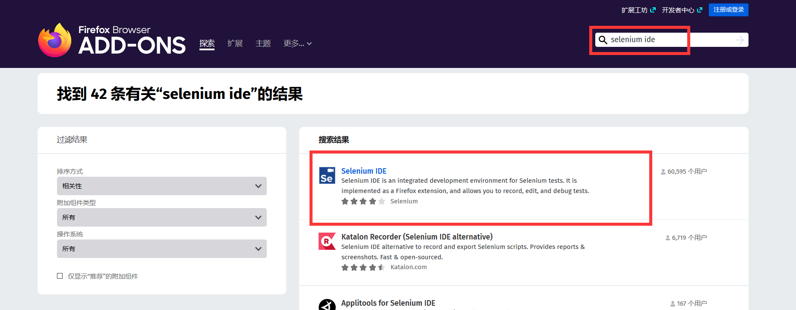
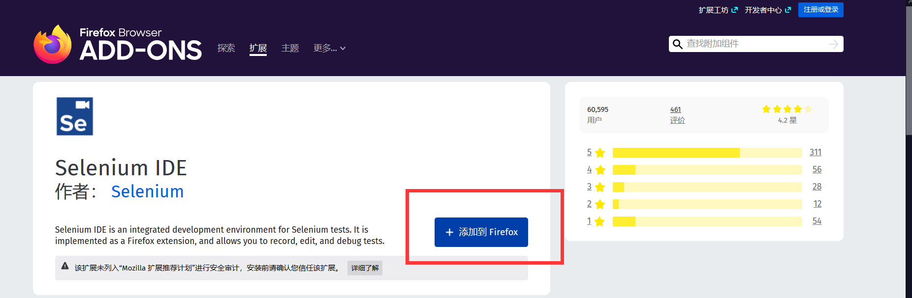
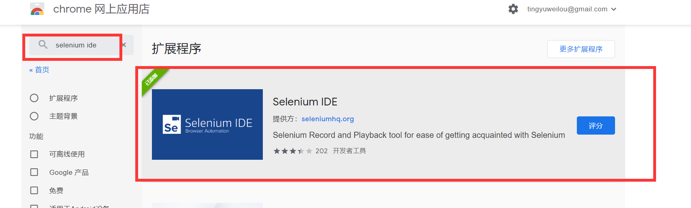
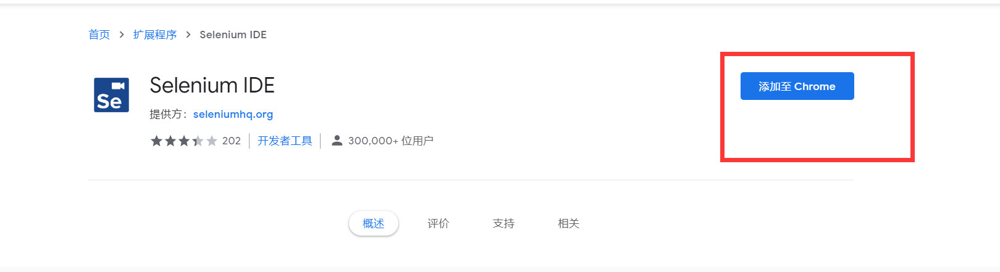
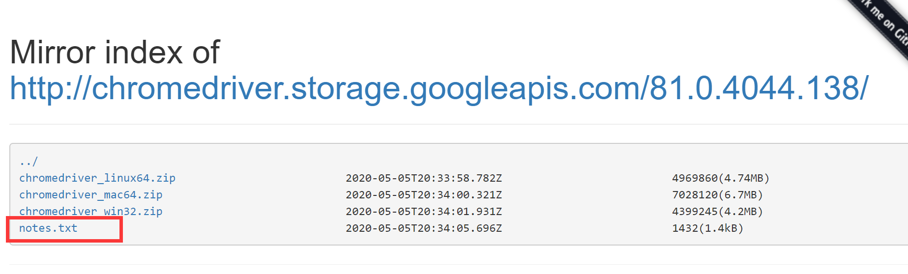
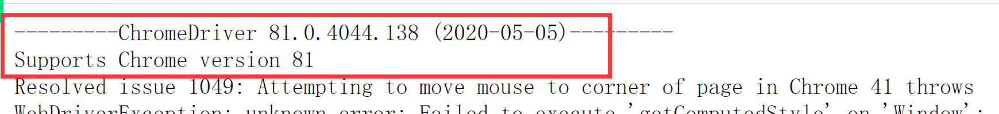
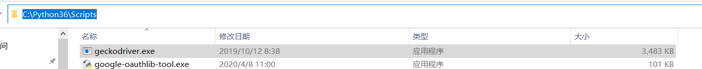
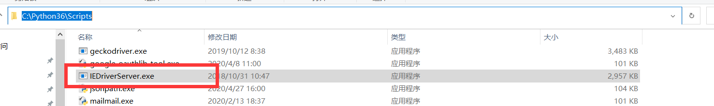
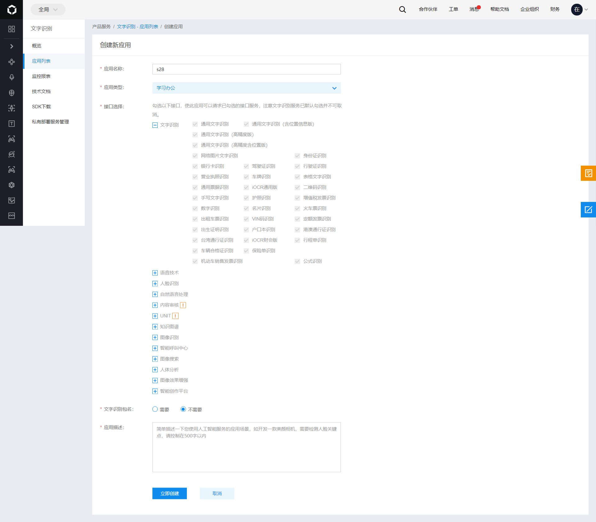

[TOC]


# selenium IDE

提供了脚本录制功能和导出脚本。

**火狐浏览器安装**

火狐的插件管理中搜索`selenium ide`.



将该插件添加到浏览器。



添加成功如下：


**在Google应用商店**



添加该扩展程序。



添加成功如下：


解决：无法访问谷歌应用商店的问题：

1.  访问：https://www.extfans.com/
2.  搜索`selenium ide`
3.  微信扫一扫输入验证码下载
4.  打开[chrome://extensions/](chrome://extensions/)，将下载压缩包中的`selenium-ide.crx`文件拖拽到该页面中，进行添加下载。


# selenium webdriver

要想使用selenium操作浏览器，必须有一个浏览器驱动对象，如何实例化该对象，就是用webdriver来实现。

操作不同的浏览器需要不同的驱动对象，即，每个浏览器都要配置自己的驱动对象。

当webdriver配置好了之后，那如何通过python代码去操作浏览器对象呢？这里还需要一个相关模块。

及我们要干两件事：

1.  配置不同浏览器的驱动对象
2.  下载selenium模块


## 下载selenium模块

```
pip install selenium
pip install https://pypi.doubanio.com/simple selenium==3.141.0
```


# 配置不同的浏览器驱动

## for chrome

selenium 配置Chrome的驱动，该驱动需要和Chrome的版本保持一致（大版本）

Chrome的驱动下载地址：

1. https://registry.npmmirror.com/binary.html?path=chromedriver/
2. http://chromedriver.storage.googleapis.com/index.html

1.  打开https://registry.npmmirror.com/binary.html?path=chromedriver/


2.  再次查看驱动版本和浏览器版本是否一致





3.  根据平台下载对应的压缩包


4.  将下载后的压缩包内的`chromedriver.exe`文件拷贝到解释器的`Scripts`目录。因为该目录已经添加到了系统得Path中了。


5.  测试

```python
import time
# 1. 导入webdriver
from selenium import webdriver
# 2. 实例化指定浏览器的webdriver对象
# driver = webdriver.Chrome(executable_path=r'D:\video\s28-testing-day18-selenium\note\chromedriver.exe')
driver = webdriver.Chrome()
# 3. 访问指定的url，进行相关操作
try:
    driver.get(url='https://www.baidu.com')
    
    driver.find_element_by_id('kw').send_keys('听雨危楼')
    driver.find_element_by_id('su').click()

# 4. 完事后，关闭浏览器
except Exception as e:
    print(e)
finally:
    time.sleep(2)
    driver.quit()
```

## for  Firefox

1.  打开github的火狐浏览器驱动地址：https://github.com/mozilla/geckodriver，找到下载链接：https://github.com/mozilla/geckodriver/releases/tag/v0.26.0


2.  将下载到本地的压缩包中的`geckodriver.exe`文件，拷贝到python解释器的`Scripts`目录中即可。



3.  测试：

```python
import time
# 1. 导入webdriver
from selenium import webdriver
# 2. 实例化指定浏览器的webdriver对象
# driver = webdriver.Chrome(executable_path=r'D:\video\s28-testing-day18-selenium\note\chromedriver.exe')
# driver = webdriver.Firefox(executable_path=r'D:\video\s28-testing-day18-selenium\note\geckodriver.exe')
driver = webdriver.Firefox()
# 3. 访问指定的url，进行相关操作
try:
    driver.get(url='https://www.baidu.com')

    driver.find_element_by_id('kw').send_keys('听雨危楼')
    driver.find_element_by_id('su').click()

# 4. 完事后，关闭浏览器
except Exception as e:
    print(e)
finally:
    time.sleep(2)
    driver.quit()
```


## for ie

必要的配置：


**安装webdriver驱动**

1.  打开：http://selenium-release.storage.googleapis.com/index.html，选择一个跟selenium版本一致的链接。


2.  这里选择32为版本的压缩包，因为32位版本相对于64位性能高一些。


3.  将压缩包内的可执行文件拷贝到python解释器的`Scripts`目录中。




4.  测试：

```python
import time
# 1. 导入webdriver
from selenium import webdriver
# 2. 实例化指定浏览器的webdriver对象
# driver = webdriver.Ie(executable_path=r'D:\video\s28-testing-day18-selenium\note\IEDriverServer.exe')
driver = webdriver.Ie()
# 3. 访问指定的url，进行相关操作
try:
    driver.get(url='https://www.baidu.com')

    driver.find_element_by_id('kw').send_keys('听雨危楼')
    driver.find_element_by_id('su').click()

# 4. 完事后，关闭浏览器
except Exception as e:
    print(e)
finally:
    time.sleep(2)
    driver.quit()
```


## Safari

参考：https://www.cnblogs.com/Neeo/articles/10671532.html#safari

更多参考：[https://www.cnblogs.com/Neeo/articles/10671532.html#%E7%BD%91%E9%A1%B5%E6%B5%8F%E8%A7%88%E5%99%A8](https://www.cnblogs.com/Neeo/articles/10671532.html#网页浏览器)


# webdriver的基本操作

```python
import time
from selenium import webdriver

driver = webdriver.Chrome()


driver.get(url='https://www.baidu.com')

# driver.find_element()   # 定位标签
# print(driver.title)
# driver.close()  # 关闭当前的窗口
# driver.quit()  # 退出浏览器
# print(driver.page_source)  # 获取页面的内置
# 设置浏览器的大小
# driver.set_window_size(800, 600)
# print(driver.get_window_size())  # 获取浏览器窗口大小
# driver.save_screenshot('a.png')  # 屏幕截图，保存图片的类型必须是 png
# driver.refresh()  # 刷新
# driver.back()  # 后退
# driver.forward() # 前进

# driver.get_cookies() # 获取cookies
# driver.current_url  # 获取当前window的url
# driver.current_window_handle  # 获取当前窗口对象
# driver.execute_script("alert('xxoo');")  # 执行 js代码
time.sleep(3)
driver.quit()
```


# 常用的标签选择器

如何定位指定的标签，就用到了标签选择器，常用的选择器有：

1.  根据id定位
2.  根据class定位
3.  根据tag name定位
4.  根据超链接定位
    1.  绝对定位
    2.  模糊定位
5.  根据xpath定位，根据dom树来定位，每个标签在dom树中都有自己的节点，`//*[@id="1"]/h3/a/em`
6.  根据css selecter （样式选择器定位），非常强大
7.  定位input框，根据name属性定位
8.  by选择器，封装了上面几种定位形式

补充：每种定位方式都有复数形式。


# 元素定位

https://www.cnblogs.com/Neeo/articles/12362920.html


**根据name属性定位**

保证标签对象有name属性才能定位。


**css selector选择器**

可以根据：

1.  根据id
2.  根据class
3.  tag name
4.  支持匹配符，如 `^`, `$`， `*`


# 文件上传

https://www.cnblogs.com/Neeo/articles/12171227.html


# 滚动操作

https://www.cnblogs.com/Neeo/articles/10672628.html


# 等待机制

https://www.cnblogs.com/Neeo/articles/11005164.html


用于网络延迟严重场景，避免代码执行较快，但是遇到标签还没有加载完成就对该标签进行操作，出现报错的问题。

在selenium中，有三种等待机制可用：

1.  显式等待，当有需要等待的标签时，才去使用等待。
2.  隐式等待，在浏览器对象创建之初，就为这个对象添加一个**被动**，即隐式等待，当遇到查找标签的时候，就子自动的触发被动也就是隐式等待。
3.  python的休眠机制，time.sleep()，啥也别说了，强制睡眠


# switch_to


https://www.cnblogs.com/Neeo/articles/11003803.html


# 百度ai

https://ai.baidu.com/

1.  首先要有一个百度ai的账号（百度云盘的账号也能用）
2.  访问控制台，选择文字识别


3.  选择创建应用


4.  配置应用



随便输入一些描述信息。

5.   获取api KEY 和 seccet key


6.  获取 token

参考：https://cloud.baidu.com/doc/OCR/s/zk3h7xz52

```python
import requests
import base64
# client_id 为官网获取的 API Key， client_secret 为官网获取的 Secret Key
host = 'https://aip.baidubce.com/oauth/2.0/token?grant_type=client_credentials&client_id=SBHMsV1cYBeOXSAL0X975GCG&client_secret=LedXa2pPqKT9WmO2qU1FegDg9u2Gbe27'
response = requests.get(host)
if response:
    access_token = response.json()['access_token']
```

7.  获取识别结果

```python
import requests
import base64
'''
通用文字识别
'''

request_url = "https://aip.baidubce.com/rest/2.0/ocr/v1/general_basic"
# 二进制方式打开图片文件
f = open(r'D:\video\s28-testing-day18-selenium\note\b.png', 'rb')
img = base64.b64encode(f.read())

params = {"image": img}
access_token = '24.83c36a5a583d87923919104793022a56.2592000.1591866873.282335-19847256'
request_url = request_url + "?access_token=" + access_token
headers = {'content-type': 'application/x-www-form-urlencoded'}
response = requests.post(request_url, data=params, headers=headers)
if response:
    print(response.json()['words_result'][0]['words'])
```

# 实战：SaaS项目登录实战

```python
import base64
import requests
import unittest
from selenium import webdriver
from HTMLTestRunnerSelenium import HTMLTestRunner


class MyCase(unittest.TestCase):
    user = "18211101742"
    password = "root1234"
    code_img = r'D:\video\s28-testing-day18-selenium\note\c.png'

    @classmethod
    def setUpClass(cls):
        cls.driver = webdriver.Chrome()
        cls.driver.implicitly_wait(10)

    @classmethod
    def tearDownClass(cls):
        cls.driver.quit()


    def setUp(self):
        self.driver.get('http://www.neeo.cc:6005/login/')


    def test_case_01(self):

        self.driver.find_element_by_id('id_username').send_keys(self.user)
        self.driver.find_element_by_id('id_password').send_keys(self.password)

        # 首先获取验证码图片，然后调用百度AI的文字识别接口，接着将验证码图片发送到百度服务器，得到验证码的识别结果，然后将结果send到 input 框中

        # 获取img图片
        self.driver.find_element_by_id("imageCode").screenshot(self.code_img)
        # 将图片发送到百度ai的文字识别接口
        self.driver.find_element_by_id('id_code').send_keys(self.foo())

        # 点击确定
        self.driver.find_element_by_css_selector('input[type=submit]').click()
        try:
            text = self.driver.find_element_by_class_name('col-xs-7').find_element_by_tag_name('span').text
            if text:
                # 访问失败
                self.assertEqual('', '验证码输入错误')
            else:
                pass
        except Exception:
            pass

    def test_case_02(self):
        self.driver.find_element_by_id('id_username').send_keys(self.user)
        self.driver.find_element_by_id('id_password').send_keys(self.password)

        # 首先获取验证码图片，然后调用百度AI的文字识别接口，接着将验证码图片发送到百度服务器，得到验证码的识别结果，然后将结果send到 input 框中

        self.driver.find_element_by_id('id_code').send_keys("xxxxxxxx")

        # 点击确定
        self.driver.find_element_by_css_selector('input[type=submit]').click()

        try:
            text = self.driver.find_element_by_class_name('col-xs-7').find_element_by_tag_name('span').text
            if text:
                # 访问失败
                self.assertEqual('', '验证码输入错误')
            else:
                pass
        except Exception:
            self.assertEqual('', '验证码输入错误')
    def foo(self):
        request_url = "https://aip.baidubce.com/rest/2.0/ocr/v1/general_basic"
        # 二进制方式打开图片文件
        f = open(self.code_img, 'rb')
        img = base64.b64encode(f.read())

        params = {"image": img}
        access_token = '24.83c36a5a583d87923919104793022a56.2592000.1591866873.282335-19847256'
        request_url = request_url + "?access_token=" + access_token
        headers = {'content-type': 'application/x-www-form-urlencoded'}
        response = requests.post(request_url, data=params, headers=headers)
        if response:
            return response.json()['words_result'][0]['words']
        else:
            return ''

if __name__ == '__main__':

    suite = unittest.makeSuite(testCaseClass=MyCase)
    f = open('./report.html', 'wb')
    HTMLTestRunner(verbosity=2, title='xxxx', description='ooooo', stream=f).run(suite)

    f.close()

```

# 生成测试报告

https://www.cnblogs.com/Neeo/articles/12175981.html


# 无头浏览器

常用的无头浏览器有：

1.  phontomjs
2.  谷歌无头
3.  火狐无头

如无特殊情况，推荐使用谷歌和火狐无头

参考：[https://www.cnblogs.com/Neeo/articles/10671532.html#%E6%97%A0%E5%A4%B4%E6%B5%8F%E8%A7%88%E5%99%A8](https://www.cnblogs.com/Neeo/articles/10671532.html#无头浏览器)

```python
from selenium import webdriver

def foo():
    """
    如果报如下错误：
    selenium.common.exceptions.WebDriverException: Message: 'phantomjs' executable needs to be in PATH.
    原因是在执行时，没有在 path中找到驱动，这里的解决办法是实例化driver对象时，添加executable_path参数，引用驱动的绝对路径
    """

    driver = webdriver.PhantomJS(executable_path=r"C:\Python36\Scripts\phantomjs-2.1.1-windows\bin\phantomjs.exe") # 解决如上报错
    driver.implicitly_wait(time_to_wait=10)
    driver.get('https://www.baidu.com')
    print(driver.title)  # 百度一下，你就知道
    driver.quit()

if __name__ == '__main__':
    foo()
```


