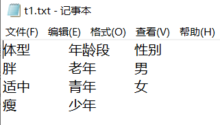
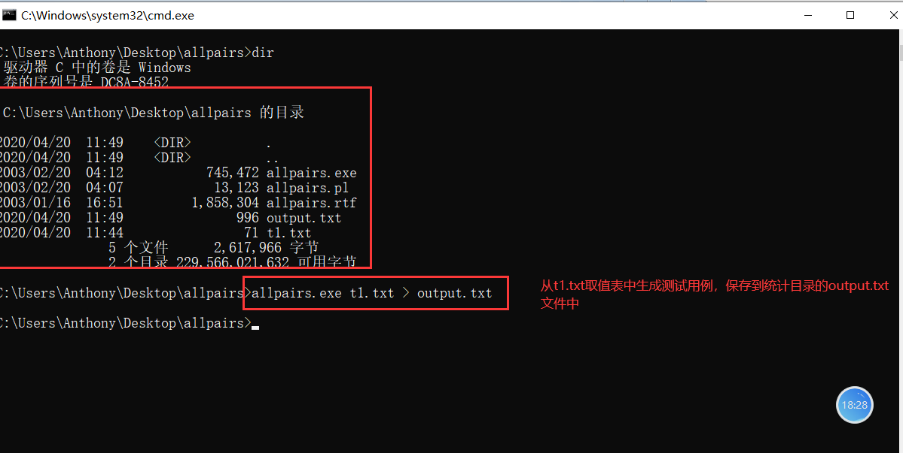
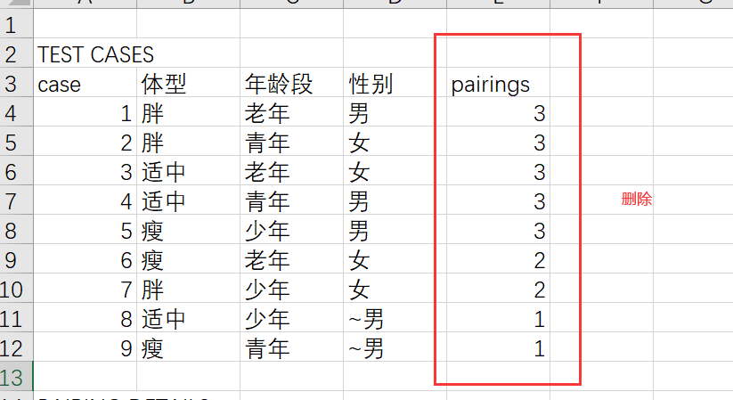
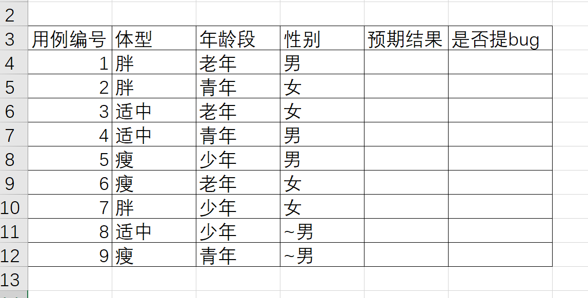

[toc]


# before

1.  声音和视频是否正常
2.  大家如果上课环境不太好的话，注意静音你的麦

# 内容回顾

## 测试分类

1.  测试的分类
    1.  白盒测试，针对代码的逻辑检查，测试。
    2.  黑盒测试，不关注程序的内部逻辑，只是通过设计测试用例对程序输入数据，然后校验输出结果是否符合预期结果。
    3.  灰盒测试，介于白盒测试和黑盒测试中间的一种测试形式，即关注程序的内部逻辑，有关注程序的外在表现。
    4.  单元测试，白盒测试，判断程序的逻辑覆盖，如判断函数中的if语句有没有覆盖到，一般由开发在做
    5.  集成测试，组装测试，测试重点是各功能模块之间的数据交互，依赖关系
    6.  系统测试，测试人员来执行
    7.  验收测试，由客户进行验收，主要考察的系统的功能的完备，
        1.  α测试，Alpha测试模拟实际操作环境下验收测试，如删档内测试，软件只是初步完成的产品，bug可能较多，不会进行上线提供用户访问。
        2.  β测试，Beta测试系统已经通过内部测试，大部分错误已经修复，即将正式发布，在多个真实环境下发布，如不删档公测。
        3.  uat测试， UAT（用户验收测试）阶段的测试就不是软件开发商自己的测试来做了，而是由客户根据自己的实际业务场景，（或派人员）来使用软件，对具体的功能进行测试。
    8.  随机测试，探索性测试，对于核心功能或者重大bug进行复测
    9.  回归测试，是指修改了旧代码后，重新进行测试以确认修改没有引入新的错误或导致其他代码产生错误。自动回归测试将大幅降低[系统测试](https://baike.baidu.com/item/系统测试/3073399)、维护升级等阶段的成本。自动化测试常用于回归测试中。回归测试的目的，不是发现新bug，而是检查原有的测试点是否有问题。
    10.  灰度发布测试，（或称金丝雀发布，或称灰度测试），是指在黑与白之间能够平滑过渡的一种发布方式。在其上可以进行A/B testing，即让一部分用户继续用产品特性A，一部分用户开始用产品特性B，如果用户对B没有什么反对意见，那么逐步扩大范围，把所有用户都迁移到B上面来。灰度发布的意义：灰度发布能及早获得用户的意见反馈，完善产品功能，提升产品质量，让用户参与产品测试，加强与用户互动，降低产品升级所影响的用户范围。
    11.  穷尽测试，测试受到时间和经济成本的影响，不可能完成穷尽测试，而是基于风险驱动模式，侧重的设计测试用例，寻求缺陷和研发成本的平衡。


## 测试方法

1.  黑盒测试方法：
    1.  等价类划分法
    2.  边界值
    3.  因果图和判定表
    4.  场景法
    5.  .....
2.  白盒测试方法：
    1.  逻辑覆盖率，代码覆盖率
    2.  语句覆盖率
    3.  条件覆盖率

```python
def foo(a, b)
	if a == 1 or b==2:
        pass
    else:
        pass
foo(a=1, b=3)
foo(a=1, b=2)
foo(a=2, b=2)
foo(a=2, b=3)
```

3.  手工和自动化测试：
    1.  自动化测试，借助脚本或者工具来完成测试，用于枯燥、重复性、人很难甚至无法模拟出来的测试场景，但是自动化测试还是离不开人的参与
    2.  手工测试，目前的测试行业，还是以手工测试为主，自动化测试为辅的现状
4.  静态和动态测试：
    1.  静态，不执行代码，主要对各阶段产生的文档进行评审，还包括，配置数据
    2.  动态，执行代码，测试程序的表现，稳定性，功能是否完备


## 黑盒测试方法

### 等价类划分法

我们要采用分类测试：

-   整数，比如在范围（-100~100）内取最大、最小、中间值
-   小数，比如在范围（-100~100）内取最大、最小、中间值
-   符号，各种符号（!@#、、）
-   汉字或其他语言、字母
-   空格
-   空值，也就是什么都不输入

通过上面的分类，我们发现用户所有可能输入的数据，划分为了若干份（或称为不同的子集），然后从每个子集中**选取少数具有代表性的数据作为测试用例**，这种测试用例我们称为**等价类（类别）划分法**。

等价类划分法是一种重要的、常用的黑盒测试方法，无需考虑程序的内部结构，只需要考虑程序的输入规格即可，它将不能穷举的测试过程进行合理的分类，从而保证设计出来的测试用例具有完整性和代表性。

在有限的测试资源的情况下，用少量有代表性的数据得到比较好的测试效果。

等价类划分分为（基本概念）：

-   有效等价类，指符合《需求规格说明书》，输入合理的数据集合。
-   无效等价类，指不符合《需求规格说明书》，输入不合理的数据集合。

等价类思考步骤：

-   首先确定有效等价类和无效等价类
-   有效等价类就是一目了然的题目条件（比如在0~20之间测试），要考虑到两端的极值（边界值）和中间值。
-   无效等价类先划分与条件相反的情况（比如不在0~20范围内），再去找特殊情况，如中英文，符号、空格、空等。

### 边界值

**大量的错误是发生在输入或者输出范围的边界上，而不是再输入范围的内部**。所以，为了保证测试质量，我们需要重点关注测试边界。

如需求是**标题长度大于0，标题长度小于等于30**

考虑边界值的情况是，0,1，15   29,30,31

边界值通常和等价类划分法连用。


### 因果图

因果图（Cause-Effect Graph）法是一种利用图解法分析输入的各种组合情况，从而设计测试用例的方法，它适用于检查程序输入条件的各种组合情况。
**因果图法的特点**

-   考虑输入条件的相互制约及组合关系
-   考虑输出条件对输入条件的依赖关系

**因果图法产生的背景**

-   等价类划分法和边界值分析方法都是着重的考虑输入条件，但是极少的考虑输入条件的各种组合、输入条件之间的相互制约关系，这样虽然各种输入条件可能出错的情况已经测试到了，但是多个输入条件组合起来可能出错的情况却很难发现。
-   如果在测试的时候，必须考虑输入条件的组合情况，那么可能的组合情况将非常的多，导致测试任务繁重。因此，我们必须考虑一种适合于描述多种条件的组合，相应产生多个动作的形式来进行测试用例的设计，这就用到了因果图，也就是设计逻辑模型。

**因果图的核心**

-   因果图法适用于输入条件较多的情况，测试所有输入条件的排列组合。因果图所谓的因就是输入，而果就是输出。
    -   因果图之`因`，即输入条件。
    -   因果图之`果`，即输出结果。

**因果图法要注意考虑的要点**

-   所有输入/输出条件的相互制约关系及组合关系。
-   输出结果对输入条件的依赖关系，也就是什么样的输入组合会产生怎样的输出结果，即`因果关系`。

**因果图法基本步骤**

利用因果图导出测试用例需要经过以下几个步骤：

-   找出所有的原因，原因即是输入条件或输入条件的等价类。
-   找出所有的结果，结果即输出条件。
-   明确所有输入条件之间的制约关系及组合关系。比如，哪些条件可以组合到一起，哪些条件不能组合到一起。
-   明确所有输出条件之间的制约关系以及组合关系。比如，哪些输出结果可以同时输出，哪些输出结果不能同时输出。
-   找出什么样的输入条件组合会产生哪种输出结果。
-   把因果图转换成判定表/决策表。
-   为判定表/决策表中的每一列表示的情况设计测试用例。

最终的目的不是画图，而是通过画图理解各种输入输出的情况，然后输出判定表。

### 判定表

因果图只是一种辅助工具，我们通过因果图分析出一个表，这个表就是判定表，然后通过判定表编写测试用例。但是有的时候，画因果图非常麻烦，影响测试效率，所以，我们很多时候都是直接写判定表，进而编写测试用例。

**判定表的组成**

-   条件桩：问题的所有条件，即所有的条件组合。
-   动作桩：问题的所有输出，即所有的输出组合。
-   条件项：针对条件桩的取值。
-   动作项：条件项的各种取值情况下的输出结果。

**判定表制作步骤**

-   列出所有的条件桩和动作桩。
-   填入条件项与动作项，得到初始判定表。
-   简化判定表（合并相似规则（相同动作））。


# 今日内容

## 场景法

场景法就是模拟用户操作软件时的场景，**主要用于测试系统的业务流程。**

-   当接到一个测试任务时，我们并不关注某个控制的边界值，等价类是否满足要求。而是要关注它的主要功能和业务流程是否正确实现，这就需要使用场景法来完成测试。
-   当业务流程没问题时，即软件的主要功能没有问题时，我们再重新从边界值、等价类方面对软件进行测试。

在冒烟测试时也主要采用场景法进行测试。

**用例场景定义**

在场景法中有两个重要的概念：

-   基本流：按照正确的业务流程来实现一条操作路径，即模拟正确的操作流程。
-   备选流：导致程序出现错误的操作流程，即模拟错误的操作流程。

用例场景使用来描述流经用例路径的过程，这个过程从开始到结束遍历用例中所有的基本流和备选流。

**用例场景产生的背景**

现在的软件几乎都是由事件触发来控制流程的，事件触发时的情景便形成了场景，而同一事件因不同的触发顺序和处理结果形成事件流。

将这种在软件设计方面的思想引入到软件测试中，生动的描绘出时间触发时的情景，有利于测试设计者测试用例，同时测试用例也更容易得到理解和执行。

-   在使用场景法设计测试用例时，需要覆盖系统用例中的主**成功场景**和**扩展场景**。并且需要适当补充各种正反面的测试用例和考虑出异常场景的情形。
-   当使用场景测试软件没有问题时，可以再使用边界值、等价类划分法等测试方法对软件进行更加细致、完整的测试。


## 流程分析法

流程分析法主要是针对测试场景类型，属于流程测试场景的测试项下的一个测试子项进行设计。是从白盒测试设计方法中的路径覆盖分析法借鉴过来的一种方法。

-   在白盒测试中，路径就是指函数代码的某个分支组合，路径覆盖法需要构造足够的用例，以覆盖函数的所有代码路径。
-   在黑盒测试中，若将软件系统的某个流程看成路径的话，则可以针对该路径使用路径分析法设计测试用例。

**优点**

-   降低了测试用例的设计难度，只要搞清楚各种流程，就可以设计出高质量的测试用例来，而不需要太多测试方面的经验。
-   在测试时间较为紧迫的情况下，可以有的放矢的选择测试用例，而不用完全根据经验来取舍。

**流程分析法的实施步骤**

-   详细了解需求。
-   根据需求说明或界面原型，找出业务流程的各个页面以及各个页面之间的流转关系。
-   画出业务流程，由产品经理使用Axure软件制作。
-   写用例，覆盖所有的路径分支。

**流程分析法总结**

-   流程分析法适用于有先后顺序的测试。常用于业务流程测试、安装流程测试等。
-   流程分析法重点在于测试流程。因此，一般每个流程用一个测试用例验证。
-   流程测试没有问题并不能说明系统功能没有问题，还需要针对每步功能进行测试。对于包含复杂流程的系统，只有功能点和处理流程都进行测试覆盖，才算是比较充分的测试。

画流程图的软件：presson，亿图图示专家，xmind，百度脑图

## 错误推测法

错误推测法是指利用**直觉**和**经验**猜测出出错的可能类型，有针对性的列举出程序中所有可能的错误和容易发生错误的地方。它是骨灰级测试大佬喜欢使用的一种测试用例设计方法。

**基本思想**

基本思想是列举出可能犯的错误或错误易发生的清单，然后根据清单编写测试用例；这种方法很大程度上是凭经验进行的，即凭人们对过去所作测试结果的分析，对所揭示缺陷的规律性作直觉的推测来发现缺陷。

采用错误推测法，最重要的是要思考和分析测试对象的各个方面，多参考以前发现的Bug的相关数据、总结的经验，个人多考虑异常的情况、反面的情况、特殊的输入，以一个攻击者的态度对待程序，才能够设计出比较完善的测试用例。

## 正交表测试法

在正式介绍正交测试法，我们先来了解两个概念：

-   什么是因素（Factor）：在一项实验中，凡欲考察的变量称为因素（变量）。
-   什么是水平（位级，Level）：在实验范围内，因素被考察的值称为水平（变量的取值）。

正交表是一个二维表格，它的构成如下：

-   行数（Runs）：正交表中行的个数，即实验的次数（用例）。

-   因素数（Factors）：正交表中列的个数。

-   水平数（Levels）：任何单个因素能够取得的值的最大个数。正交表中包含的值为从0到**水平数减一**或**从1到水平数**。

-   正交表的的表示形式：

    

    

    -   n是表的行数，也就是需要测试组合的次数。
    -   k是表的列数，表示控件的个数（因素数或因子数）。
    -   m是每个控件包含的取值个数（各因素的水平数，即各因素的状态数）。
    -   例如我们之前的字体属性程序的需求中，可以这么列：


-   有4个控件。
-   每个控件有3个取值。
-   9为需要测试的组合个数。
-   也称为4因素3水平。


正交测试源于正交实验设计方法。

正交试验设计方法是一种研究多因素多水平的实验设计方法，它根据正交性从全面实验中挑选出部分有代表性的点进行试验，这些有代表性的点具备了**均匀分散，齐整可比**的特点。

正交试验设计方法一般使用已经造好了的正交表格来安排实验并进行数据分析。

正交测试法与正交实验设计方法类似，也使用了已经造好的正交表格来生成测试用例。它简单易行，应用性较好。

**正交表测试法的适用范围**

正交表测试法适用于输入条件相互独立，并且需要对输入的**各种组合**进行测试的场合。

**正交表的正交性**

-   整齐可比性：在同一张正交表中，每个因素的每个水平出现的次数是完全相同的。由于在实验中每个因素的每个水平与其它因素的每个水平参与实验的几率是完全相同的，这就保证了在各水平中最大程度的排除了其他因素水平的干扰。因而能有效的进行比较和作出展望。
-   均衡分散性：在同一张正交表中，任意两列（两个因素）的水平搭配（横向形成的数字对）是完全相同的。这就保证了实验条件均衡的分散在因素水平的完全组合中，因而具有很强的代表性。

**查询正交表**

当然，我们无需自己去设计正交表，可以使用人家罗列好的正交表，我们只需根据被测程序选择相应的正交表。

地址1：https://www.cnblogs.com/Neeo/articles/11315875.html

地址2：https://www.york.ac.uk/depts/maths/tables/orthogonal.htm

地址3：http://support.sas.com/techsup/technote/ts723_Designs.txt

ps：正交表是经过严格的数学推理得来的！

**正交测试用例设计步骤**

-   根据所测程序中控件的个数（因素）以及每个控件的取值个数（水平），选取一个合适的正交排列表。
-   将控件及其取值列举出来，并对其进行编号。
-   将控件及其取值映射到正交排列表中。
    -   把正交排列表中的ABCD（因子）分别替换成4个控件。
    -   把每列中的1,2,3（状态）分别换成这个控件的3个取值（水平），排列顺序要按照表中给出的顺序。
-   根据映射好的正交排列表编写测试用例。


## 混合正交表法

**使用正交法的局限性**

-   目前常见的正交（排列）表只有前面介绍的几种。
-   即使是已有的正交表，基本都要求每个控件中取值的个数要相等，这在实际软件中很少遇到。

**没有现成的正交排列表怎么办？**

通过正交测试法的学习，我们更多的应该学习到一种测试思想，也就是在从所有组合集合中选取测试数据时，应该均匀的选取其中的组合作为测试用例，而不要只在某个局部选取数据。

而类似下面这种情况，也比较常见，我们利用之前的正交表，就不好使了：

| 体型 | 年龄段 | 性别 |
| ---- | ------ | ---- |
| 胖   | 老人   | 男   |
| 适中 | 青年   | 女   |
| 瘦   | 儿童   |      |

如上的实例中，有三个因素（体型、年龄段、性别）。但各自的水平并不一致。这该怎么办？找不到现成的正交表。那只好用工具来生成了。

工具下载安装地址：https://www.cnblogs.com/Neeo/articles/11318346.html

注意：目前allpairs只有Windows平台有

***allpairs使用方式**

1.  根据你的数据构建取值表，用txt文档制作：
    1.  字段后是tab，不是空格
    2.  最后一个字段虽然空，但也有一个tab




2.  命令行使用allparis.exe执行生成命令：



3.  整理生成的用例表
    1.  复制output.txt文件内容
    2.  新建一个Excel表格，粘贴copy的内容
4.   整理测试用例
    1.  将无用的列删除
    2.  将配对描述删除
    3.  整理，添加相应字段






**如上图中的`~男`**字段表示该选项选择男或者女都不影响测试用例的执行结果。

参考：https://www.cnblogs.com/Neeo/articles/11795983.html

# 缺陷管理

**软件缺陷的定义**
`IEEE 1983 of IEEE Standard 729`中对软件缺陷作了一个标准的定义：

-   从产品内部看，软件缺陷是软件产品开发或维护过程中所存在的错误、毛病等各种问题。
-   从外部看，软件缺陷是系统所需要实现的某种功能的失效或违背。

软件缺陷是指存在于软件（程序、数据、文档）中的那些不符合用户需求的问题。

**缺陷和bug的关系**

缺陷>=bug，缺陷包含bug。


## 软件缺陷产生的原因

软件缺陷产生是不可避免的，造成软件缺陷产生的原因主要归纳如下：

-   需求解释或者记录错误
-   用户需求定义错误
-   设计说明存在错误
-   编码说明、程序代码有误
-   硬件或者软件系统上存在错误
-   其他，如文档错误、内容不正确或拼写错误


软件缺陷的严重性参考：

| 严重等级   | 描述                                                         |
| ---------- | ------------------------------------------------------------ |
| 5-Critical | 系统瘫痪、异常退出、死循环、严重的计算错误等                 |
| 4-VeryHigh | 频繁的死机，系统大部分功能不可用                             |
| 3-High     | a.功能点没有实现，或不符合用户需求 b.数据丢失                |
| 2-Medium   | a.影响一个相对独立的功能 b.仅仅在特定条件上发生 c.与产品需求定义不一致 d.断断续续的出现问题 |
| 1-Low      | 表面性错误（如错别字）                                       |

软件缺陷的优先级参考：

| 优先级别   | 描述                                                         |
| ---------- | ------------------------------------------------------------ |
| 5-Urgent   | 最高优先级。在这个错误影响下，系统几乎不可用。               |
| 4-VeryHigh | 高优先级。错误对这套系统的能力产生严重的影响。               |
| 3-High     | 中优先级。如果这个错误存在与系统中，会制约开发和测试的活动的进行，如果先前没有修复它，那么需要在发布前修复它。 |
| 2-Medium   | 低优先级。不会延迟发布，但是会在以后修正这个错误。           |
| 1-Low      | 最低优先级。时间和资源允许时修正。                           |


## 缺陷密度

基本的缺陷测量是以每千行代码的缺陷数(个/KLOC)来测量的。称为缺陷密度，其测量单位是defects／KLOC。可按照以下步骤来计算一个程序的缺陷密度：

-   累计开发过程中每个阶段发现的缺陷总数。
-   统计程序中新开发的和修改的代码行数。
-   计算每千行的缺陷数=1000*缺陷总数/代码行数。

例如：一个132.2万行的源程序总共有210个缺陷，那该程序的缺陷密度是：

```
缺陷密度 = 1000 * 210  / 1322000 = 0.15个/KLOC
```

PS：[KLOC](https://baike.baidu.com/item/kloc/374901)，千行代码


参考：https://www.cnblogs.com/Neeo/articles/11796009.html


# 敏捷模型

参考： https://www.cnblogs.com/Neeo/articles/10579119.html


# 今日作业

1.  搭建Windows版或者docker版的禅道，参考链接：https://www.cnblogs.com/Neeo/articles/12620853.htm
2.  安装意图图示专家
3.  为SAAS平台画流程图


**如果电脑有问题，暂时搭建不了的，先用我的**

地址：http://www.neeo.cc:6003/zentao/user-login.html

账号：admin

密码：admin!1234


