[toc]


# before

1.  百度云视频链接，失效及时找我
2.  画图工具，并不是一定要用亿图等等


# 内容回顾

## 场景法

场景法就是模拟用户操作软件时的场景，主要用于测试系统的业务流程。

-   当接到一个测试任务时，我们并不关注某个控制的边界值，等价类是否满足要求。而是要关注它的主要功能和业务流程是否正确实现，这就需要使用场景法来完成测试。
-   当业务流程没问题时，即软件的主要功能没有问题时，我们再重新从边界值、等价类方面对软件进行测试。

在冒烟测试时也主要采用场景法进行测试。

**用例场景定义**

在场景法中有两个重要的概念：

-   基本流：按照正确的业务流程来实现一条操作路径，即模拟正确的操作流程。
-   备选流：导致程序出现错误的操作流程，即模拟错误的操作流程。

用例场景使用来描述流经用例路径的过程，这个过程从开始到结束遍历用例中所有的基本流和备选流。

**用例场景产生的背景**

现在的软件几乎都是由事件触发来控制流程的，事件触发时的情景便形成了场景，而同一事件因不同的触发顺序和处理结果形成事件流。

将这种在软件设计方面的思想引入到软件测试中，生动的描绘出时间触发时的情景，有利于测试设计者测试用例，同时测试用例也更容易得到理解和执行。

-   在使用场景法设计测试用例时，需要覆盖系统用例中的主**成功场景**和**扩展场景**。并且需要适当补充各种正反面的测试用例和考虑出异常场景的情形。
-   当使用场景测试软件没有问题时，可以再使用边界值、等价类划分法等测试方法对软件进行更加细致、完整的测试。

## 流程分析法

流程分析法主要是针对测试场景类型，属于流程测试场景的测试项下的一个测试子项进行设计。是从白盒测试设计方法中的路径覆盖分析法借鉴过来的一种方法。

-   在白盒测试中，路径就是指函数代码的某个分支组合，路径覆盖法需要构造足够的用例，以覆盖函数的所有代码路径。
-   在黑盒测试中，若将软件系统的某个流程看成路径的话，则可以针对该路径使用路径分析法设计测试用例。

**优点**

-   降低了测试用例的设计难度，只要搞清楚各种流程，就可以设计出高质量的测试用例来，而不需要太多测试方面的经验。
-   在测试时间较为紧迫的情况下，可以有的放矢的选择测试用例，而不用完全根据经验来取舍。

**流程分析法的实施步骤**

-   详细了解需求。
-   根据需求说明或界面原型，找出业务流程的各个页面以及各个页面之间的流转关系。
-   画出业务流程，由产品经理使用Axure软件制作。
-   写用例，覆盖所有的路径分支。


流程图的每一个分支，都可以是一个测试点，也就是一个测试用例。

## 错误推断法

错误推测法是指利用**直觉**和**经验**猜测出出错的可能类型，有针对性的列举出程序中所有可能的错误和容易发生错误的地方。它是骨灰级测试大佬喜欢使用的一种测试用例设计方法。

**基本思想**

基本思想是列举出可能犯的错误或错误易发生的清单，然后根据清单编写测试用例；这种方法很大程度上是凭经验进行的，即凭人们对过去所作测试结果的分析，对所揭示缺陷的规律性作直觉的推测来发现缺陷。

采用错误推测法，最重要的是要思考和分析测试对象的各个方面，多参考以前发现的Bug的相关数据、总结的经验，个人多考虑异常的情况、反面的情况、特殊的输入，以一个攻击者的态度对待程序，才能够设计出比较完善的测试用例。

## 正交表测试法

正交表的两个概念：

-   什么是因素（Factor）：在一项实验中，凡欲考察的变量称为因素（变量）。简单来说，就是控件
-   什么是水平（位级，Level）：在实验范围内，因素被考察的值称为水平（变量的取值）。简单来说，就是控件的取值结果

正交表是一个二维表格，它的构成如下：

-   行数（Runs）：正交表中行的个数，即实验的次数（用例）。
-   因素数（Factors）：正交表中列的个数。
-   水平数（Levels）：任何单个因素能够取得的值的最大个数。正交表中包含的值为从0到**水平数减一**或**从1到水平数**。

正交表测试法适用于输入条件相互独立，并且需要对输入的**各种组合**进行测试的场合。

**正交表的正交性**

-   整齐可比性：在同一张正交表中，每个因素的每个水平出现的次数是完全相同的。由于在实验中每个因素的每个水平与其它因素的每个水平参与实验的几率是完全相同的，这就保证了在各水平中最大程度的排除了其他因素水平的干扰。因而能有效的进行比较和作出展望。
-   均衡分散性：在同一张正交表中，任意两列（两个因素）的水平搭配（横向形成的数字对）是完全相同的。这就保证了实验条件均衡的分散在因素水平的完全组合中，因而具有很强的代表性。

正交表是经过严格推理得来的二维正交表，可以从网上搜到：

-   地址1：https://www.cnblogs.com/Neeo/articles/11315875.html

-   地址2：https://www.york.ac.uk/depts/maths/tables/orthogonal.htm

-   地址3：http://support.sas.com/techsup/technote/ts723_Designs.txt


**正交测试用例设计步骤**

-   根据所测程序中控件的个数（因素）以及每个控件的取值个数（水平），选取一个合适的正交排列表。
-   将控件及其取值列举出来，并对其进行编号。
-   将控件及其取值映射到正交排列表中。
    -   把正交排列表中的ABCD（因子）分别替换成4个控件。
    -   把每列中的1,2,3（状态）分别换成这个控件的3个取值（水平），排列顺序要按照表中给出的顺序。
-   根据映射好的正交排列表编写测试用例。


## 混合正交表

**使用正交法的局限性**

-   目前常见的正交（排列）表只有前面介绍的几种。
-   即使是已有的正交表，基本都要求每个控件中取值的个数要相等，这在实际软件中很少遇到。

**没有现成的正交排列表怎么办？**

通过正交测试法的学习，我们更多的应该学习到一种测试思想，也就是在从所有组合集合中选取测试数据时，应该均匀的选取其中的组合作为测试用例，而不要只在某个局部选取数据。

如何使用混合正交表呢？我们不自己动手，而是通过软件来实现。allparis，下载地址：https://www.cnblogs.com/Neeo/articles/11318346.html

**如何使用allparis制作混合正交表的测试用例**

示例：

1.  在allparis的安装目录中，创建一个txt文件，然后对控件和水平进行一一列举，每项参数以tab隔开，如果空缺项也要有tab


2.  使用allparis.exe 读取刚才创建的txt文件，输出一个制作好的混合正交表测试用例的匹配结果。

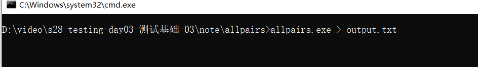


3.  创建一个Excel表格，对匹配结果进行整理成测试用例。

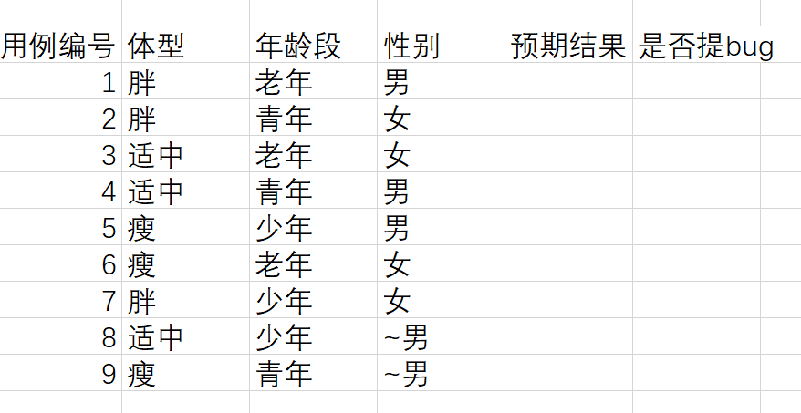

`~`表示该取值不会影响测试用例的执行结果。

## 缺陷管理

1.  缺陷 >= bug

2.  缺陷的属性：

    1.  严重性
    2.  优先级
    3.  唯一ID
    4.  缺陷的起源/来源/根源
    5.  缺陷的类型
    6.  缺陷的状态

3.  bug：

    1.  bug的类型
    2.  bug的等级

4.  缺陷报告

    1.  书写规范
    2.  都有哪些内容
    3.  缺陷处理流程

    

    4.  缺陷数据分析，根据数据表现的内容，来对软件的后续工作提供数据指导。

    5.  bug分布情况

    6.  基本的缺陷测量是以每千行代码的缺陷数(个/KLOC)来测量的。称为缺陷密度，其测量单位是defects／KLOC。可按照以下步骤来计算一个程序的缺陷密度：

        -   累计开发过程中每个阶段发现的缺陷总数。
        -   统计程序中新开发的和修改的代码行数。
        -   计算每千行的缺陷数=1000*缺陷总数/代码行数。

        例如：一个132.2万行的源程序总共有210个缺陷，那该程序的缺陷密度是：

```
缺陷密度 = 1000 * 210  / 1322000 = 0.15个/KLOC    # KLOC:每千行代码
```

5.  常用的bug管理工具，这里主要讲禅道

6.  敏捷开发流程：https://www.cnblogs.com/Neeo/articles/10579119.html


# 今日内容

禅道的使用：

-   安装
-   使用

软件质量


# 今日内容详情

## 禅道的使用

### 禅道的介绍

禅道项目管理软件（简称：禅道）集产品管理、项目管理、质量管理、文档管理、组织管理和事务管理于一体，是一款功能完备的项目管理软件，完美地覆盖了项目管理的核心流程。

禅道的主要管理思想基于国际流行的敏捷项目管理方式—Scrum。Scrum是一种注重实效的敏捷项目管理方式，它规定了核心的管理框架 ，但具体的细节还需要团队自行扩充。禅道在遵循其管理方式基础上，又融入了国内研发现状的很多需求，比如bug管理，测试用例管理，发布管理，文档管理等。因此禅道不仅仅是一款scrum敏捷项目管理工具，更是一款完备的项目管理软件。基于scrum，又不局限于scrum。

禅道最大的特色是创造性的将产品、项目、测试这三者的概念明确分开，互相配合，又互相制约。通过需求、任务、bug来进行交相互动，最终通过项目拿到合格的产品。

目前，禅道和JIRA用的人较多。我们这里以禅道为例。

**禅道项目管理软件是做什么的？**

禅道由[青岛易软天创网络科技有限公司](http://www.cnezsoft.com/)开发，国产开源项目管理软件。它集产品管理、项目管理、质量管理、文档管理、组织管理和事务管理于一体，是一款专业的研发项目管理软件，完整覆盖了研发项目管理的核心流程。禅道管理思想注重实效，功能完备丰富，操作简洁高效，界面美观大方，搜索功能强大，统计报表丰富多样，软件架构合理，扩展灵活，有完善的API可以调用。禅道，专注研发项目管理！

**为什么用禅道这个名字？**

禅和道这两个字含义极其丰富，有宗教方面的含义，也有文化层面的含义。禅道项目管理软件取其文化含义，期望通过这两个字来传达我们对管理的理解和思考。这个名字是受《编程之道》和《编程之禅》这两本书的启发。英文里面的禅为Zen，道为Tao，所以我们软件的英文名字为zentao。

### Windows平台禅道的下载安装

我们可以在Windows，Mac，linux平台去搭建禅道。

下载地址：https://www.zentao.net/download/zentaopms12.2-80207.html

**如果是Windows平台，安装目录一定是磁盘的根目录**

Windows平台的默认账号密码：

````
账号：admin
密码：123456
````

### docker部署禅道

1.  去哪拉取镜像 	


# 禅道使用流程

## 创建角色

角色：

-   产品经理
-   项目经理
-   开发经理(主管)
    -   开发团队1
        -   开发人员1
        -   开发人员2
    -   开发团队2
        -   开发人员1
-   测试经理(主管)
    -   测试团队
        -   测试人员
        -   ...


| 角色            | 密码      | 备注      |
| :-------------- | :-------- | :-------- |
| admin           | root!1234 | 管理员    |
| chanpinjingli1  | root!1234 | 产品经理1 |
| xiangmujingli1  | root!1234 | 项目经理1 |
| yanfazhuguan1   | root!1234 | 研发主管1 |
| chanpinzhuguan1 | root!1234 | 产品主管1 |
| ceshizhuguan1   | root!1234 | 测试主管1 |
| gaocengguanli1  | root!1234 | 高层管理1 |
| kaifa1          | root!1234 | 开发人员1 |
| kaifa2          | root!1234 | 开发人员2 |
| ceshi1          | root!1234 | 测试人员1 |
| ceshi2          | root!1234 | 测试人员2 |

为了方便，角色密码以都为`root!1234`。

组织 -- 添加用户/批量添加用户

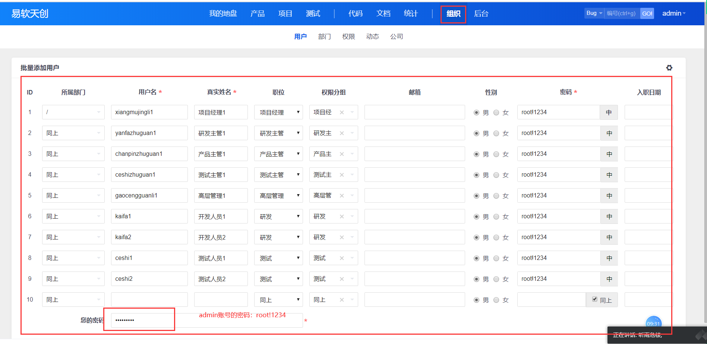

## 创建产品计划

产品经理登录，选择产品--创建产品

填写：

-   计划名称
-   开始/结束日期
-   计划的描述


创建计划的好处有：

-   可以帮助产品人员控制产品的研发过程。
-   帮助相关人员了解产品进度，便于后续的工作安排。


## 创建需求和需求变更

创建需求，由产品经理登录，选择产品--创建需求：

-   如果该需要评审，就不要勾选`不需要评审`选择框。需要评审：
    -   指派给谁评审，如指派给产品主管评审，注意，评审是一个线下活动，禅道这里只是记录评审结果
    -   产品主管登录后，可以进行评审结果的操作
        -   确认通过，该需求没有问题，可以搞。
        -   有待明确，需求本身存在问题，需要继续完善。
            -   当产品经理完善之后，由产品主管继续进行评审。
        -   拒绝，要给出拒绝的理由。
            -   已完成
            -   已细分
            -   重复
            -   不做
            -   ...
-   只有经过评审通过的需求，状态是激活状态，即，可以去实现该需求。


**需求变更**

1.  由产品经理登录，选择产品 --- 需求，指定一个激活状态的需求进行变更流程：


要在变更流程之后，指定有谁评审，这里指定项目主管评审。

2.  产品主管登录禅道，产品 --- 需求 --- 指派给我；选择评审按钮，选择评审结果和备注。关于评审结果：
    1.  确认通过，该需求可以变更，后续工作，按照新需求完成。
    2.  撤销变更，需求变更失败，后续工作，按照原需求完成。
    3.  有待明确，需求变更描述有问题，打回去重新编写描述，然后再来进行评审。


当需求变更通过后，该需求的状态变成激活状态。


## 创建项目及关联需求

现在，关于产品相关的需求已经评审结束，就可以进入到项目立项阶段，也就是即将进入到实际的编码阶段了。

项目立项一般都是开个立项会：

-   由产品人员把产品的需求与项目组成员沟通，必要时调整需求；
-   项目组成员估算完成需求的工作量；
-   对需求进行分解，任务分配；

完事之后，一般由项目经理在禅道中建立项目。

PS:项目组成员在线下已经分配好了，但还需要在项目创建后，手动的关联，所以，称这个过程为创建项目和创建团队。


以项目经理角色登录


编写项目信息：

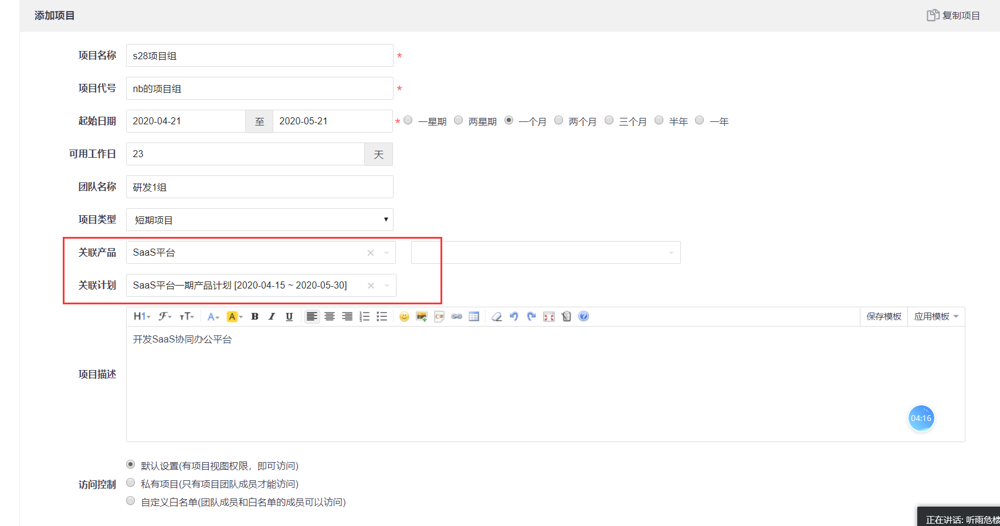

当项目创建后，需要设置项目团队(开发组/测试组)，进行项目与产品及产品计划进行关联。注意，关联操作会自动的关联在产品计划中已激活的需求。也可以手动的关联需求。

## 开发完成需求

首先项目经理/项目主管/研发主管登录，项目 -- 需求列表中，可以为将需求进行分解，分成若干粒度更小的任务，便于开发进行开发工作。


开发在任务列表中，能看到指派给自己的任务都有哪些，并且任务的时长。

开发在开发该任务时，要每天填写工时，能及时查看任务进度。

当该任务已经完成后，即剩余工时为0时，可以选择结束该任务，那此时的任务就处于已完成的状态。


当所有的任务都完成后，并且开发自测通过后，就可以进行提测，在提测前，要进行构建版本的过程。

## 构建版本

开发人员登录，访问项目 --- 版本 -- 创建版本


编写版本信息。


在版本信息的描述中，要注意：

1.  该版本的实现哪些功能
2.   解决哪些问题？
3.  测试中，有些注意事项和建议

版本构建成功后，如下图


## 版本关联需求

该版本实现了哪些需求

### 赋予研发角色权限

默认的，开发人员无权做给版本关联需求的操作，该权限只有研发主管、项目经理有权限。

如何给开发赋予该权限：

1.  用admin账号登录，组织 -- 权限  --- 找到研发角色，点击权限维护按钮。


2.  下拉选择版本，勾选关联需求选项。


3.  此时，以开发人员的角色登录禅道，就可以发现已经有了该权限，也就是有了关联需求的按钮。


注意，该操作适用于为所有的角色赋予指定权限。

### 版本关联需求

开发人员(研发主管/项目经理登录也行)登录，项目视图 ---- 版本选项，点击指定版本的关联需求按钮。


勾(多)选需求，然后点击`关联需求`按钮。


关联需求成功后，在版本详情中，能看到关联的需求：

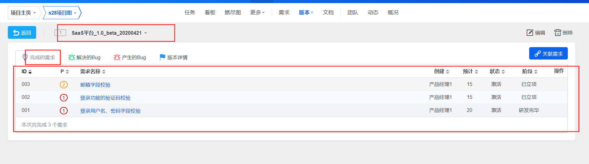

## 开发提测

此时的项目，在当前产品计划中，开发阶段基本完成， 可以向测试提测。

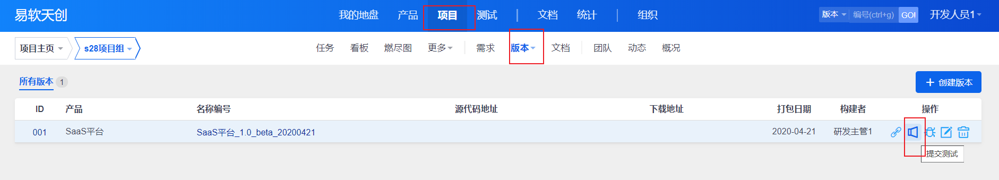

编写提测单：

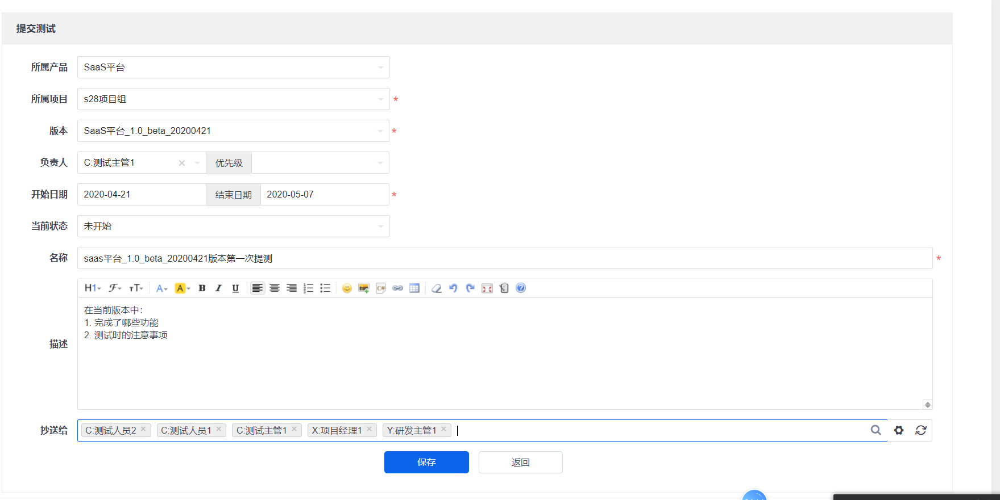


## 用户创建用例


测试人员身份登录禅道，访问测试视图下的用例选项。


编写测试用例。


创建成功：

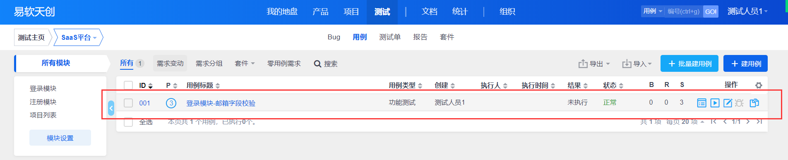


## 版本关联用例

测试视图 --- 测试单 --- 点击关联用例

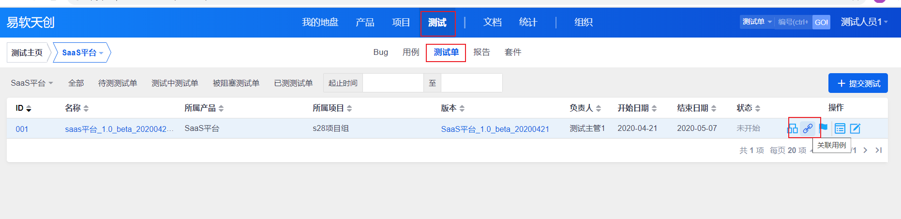


勾选用例并点击保存。


关联成功：


注意，只有用例的状态是正常的，才能被关联。

## 后台开启用例评审功能

一般的，我们写的测试用例都是需要评审的，但是默认的，禅道并没有开启用例评审权限。

admin账号登录，后台 --- 自定义 --- 用例 ---- 评审流程，勾选开启，然后点击保存。


接下来 ，由测试人员登录，在创建用例详情中，可以勾选该评审功能。


需要评审的用例的状态是待评审状态。

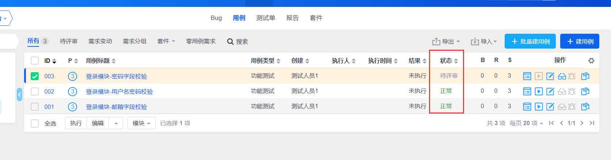

注意，测试人员也能评审自己的用例(也可以使用admin账号取消测试人员的评审测试用例的权限)，但一般选择测试主管来评审。

## 执行用例并且提交bug

首先明确，用例执行是一个实际的操作过程，只是在禅道中记录这一过程，并且进行bug管理。

### 执行用例

测试人员登录：

测试视图 -- 用例列表 ---- 选择执行用例

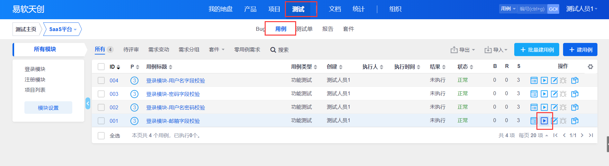

## 提交bug

测试人员登录，点击执行用例，当用例执行失败，在禅道中需要记录并且提交bug：


编辑bug信息：

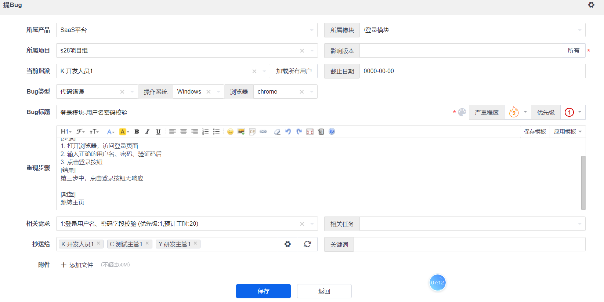

开发人员访问测试 --- bug，点击指派给我的，bug详情中，点击确认按钮。


## 回归测试

当开发修复bug后，我们测试人员需要进行回归测试。

如果回归测试成功，选择关闭bug

如果回归测试失败，重新激活该bug，开发继续修复，我们在进行回归测试，直到回归测试成功，然后关闭该bug。


参考：https://www.cnblogs.com/Neeo/articles/12620853.html


# 今天作业

按照敏捷开发流程，使用禅道走一遍。


