[toc]

# 内容回顾

## requests

requests是基于urllib的https/http库，可以发各种类型的请求，在请求中可以携带不同的参数。

常用的方法：

```python
"""
pip install requests
"""
import requests

reponse = requests.request(
	method="get",
    url="https://www.baidu.com",
    timeout=1,   # 超时
    params={},
    data={},
    json={},
    cookies={},
    files={"file": open("file", 'wb')},
)
response.encoding = "GBK", # 指定编码
response.status_code    # 响应状态码
response.text   # 获取文本类型的数据
response.json()  # 响应内容是json
response.content  # 响应内容是bytes
response.headers   # 获取响应头， 包含 content-type:text/html;
response.cookies()   # 获取cookies
response.cookies.get_diict()   # 获取cookies并且以字典的形式返回
response.cookies.get_list()   # 获取cookies并且以列表的形式返回
response.iter_content(chunk_size=1024)   # 迭代获取大数据用这个
```

bs4模块，解析文本查找标签及标签属性或者内容：

```python
"""
pip install beautifulsoup4
"""

from bs4 import BeautifulSoup

soup = BeautifulSoup(文本类型请求结果, 解析器)   # response.text, "html.parser"

div_obj = soup.find(name="div", attr={"id": "xxxxx"})   # 找一个
img_list = div_obj.find_all(name="img", [attr])   # 找多个标签， 可以根据attr属性过滤，以列表的形式返回多个

for img in img_list:
    img.get("src")   # 获取标签的属性
div_obj.text  # 获取标签的文本内容
```

## postman

### 下载和安装

去[官网](https://www.postman.com/)下载，然后点击安装，会自动完成安装，无需别的配置，当安装成功后，会提示你登录/注册账号，建议用账号登录

### 基本使用

1.  postman面板介绍

2.  常见的请求：

    1.  无参get请求
    2.  有参数的get请求
    3.  k:v格式的post请求
    4.  k:json格式的post请求
    5.  json格式的post请求

    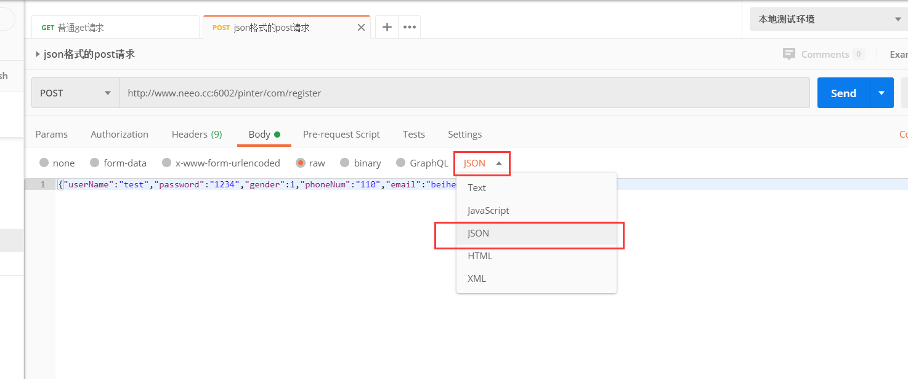

3.  文件上传


4.  postman console，请求的历史记录，有完整的：
    1.  请求头
    2.  请求体
    3.  响应头
    4.  响应体

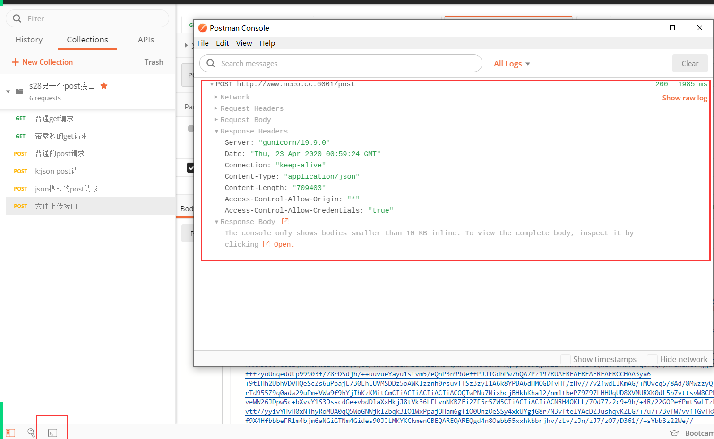

5.   如何导出请求数据


6.  集合：将同一类型或者同一项目的接口收集到一个集合中，便于统一管理和自动化执行。

    1.  如何创建集合

    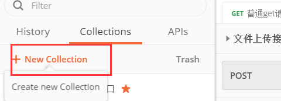

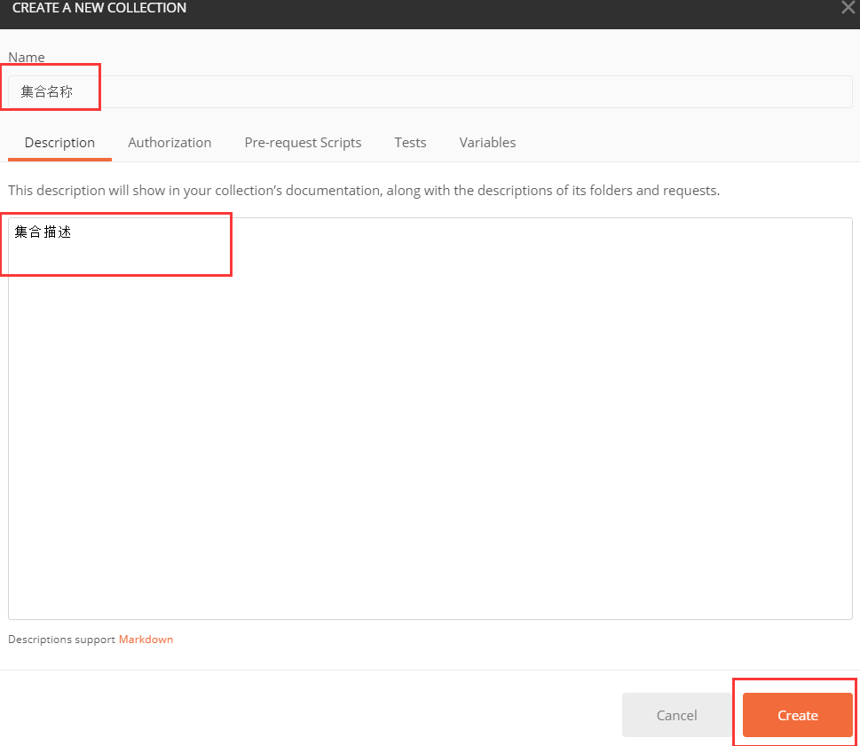

2.  将接口收集到集合中。

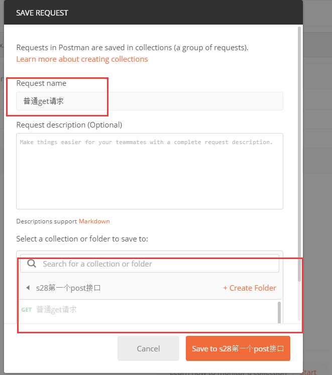


# 今日内容

## 环境管理

参考：https://www.cnblogs.com/Neeo/articles/12186481.html

创建环境：

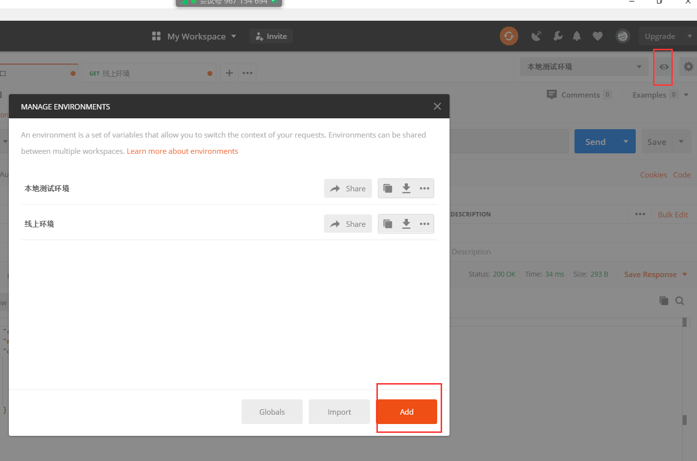

编辑当前环境的变量：


如何在请求中应用上环境中的变量？

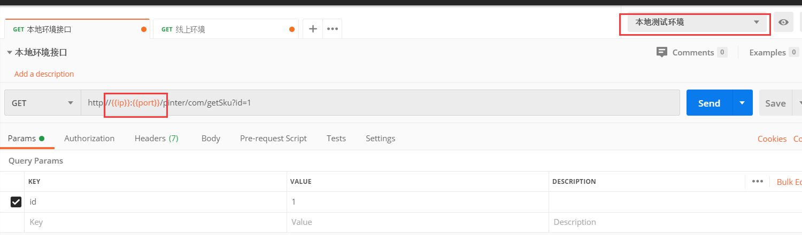

使用`{{变量名}}`的方式使用环境中的变量值。

### 变量的作用域

全局变量：作用于全局，postman中的任何地方

集合变量：变量只作用于集合中的接口

内置动态变量：内置的一些时间戳，UIID变量。

自定义环境变量：自己定义的环境，在该环境中创建的变量，只要你使用该环境，就能使用其中变量值。

#### 全局变量

**如何创建全局变量**

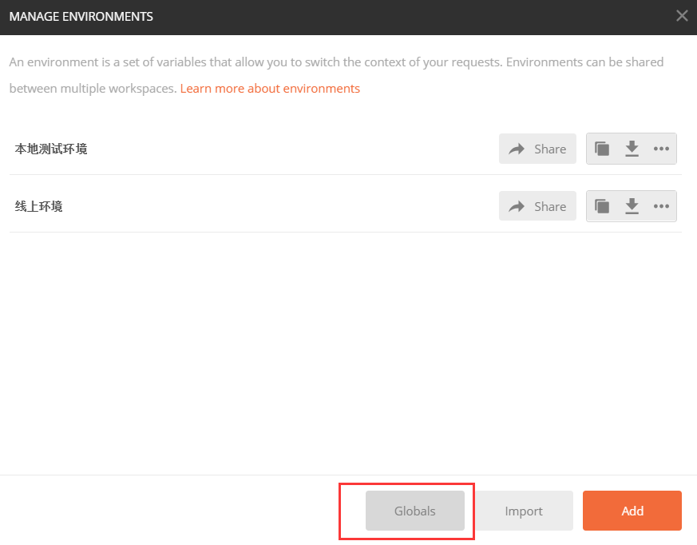


使用`{{变量名}}`来使用。

#### 集合变量

只作用于当前的集合中。

**创建**

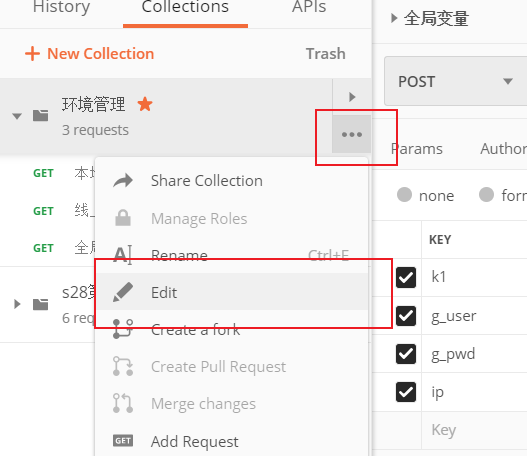


使用`{{变量名}}`来使用。

#### 内置的变量

作用于所有地方，使用`{{$内置的变量名}}`

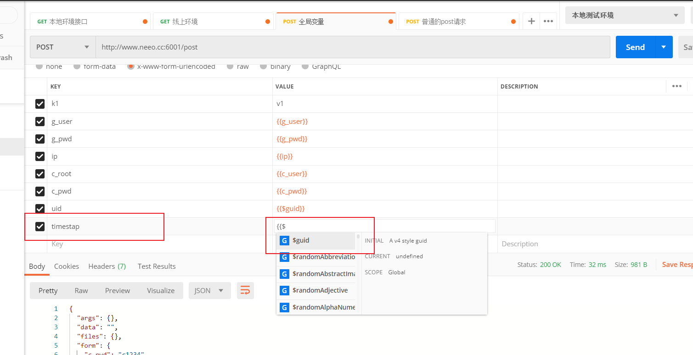

常用的：

-   timestap
-   guid

更多内置的变量参考：https://learning.postman.com/docs/postman/variables-and-environments/variables-list/


## 断言

参考：https://www.cnblogs.com/Neeo/articles/12186485.html

python中的断言，assert，断定结果是怎样的，否则就断言失败。

```python
import requests

response = requests.get("https://www.baidu.com", timeout=5)


try:
    assert response.status_code == 201
    print('断言成功')
except AssertionError as e:
    print('断言失败')
```


在postman中，如何使用断言。

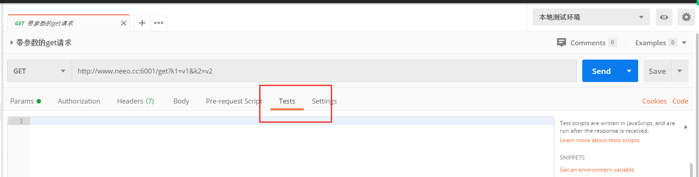

postman中，可用的模板？

| 模板                                            | 描述                                 | 示例                                                         |
| :---------------------------------------------- | :----------------------------------- | :----------------------------------------------------------- |
| clear a global variable                         | 清除全局变量                         | pm.globals.unset("variable_key");                            |
| Clear an environment variable                   | 清除一个环境变量                     | pm.environment.unset("variable_key");                        |
| get a global variable                           | 得到一个全局变量                     | pm.globals.get("variable_key");                              |
| get a variable                                  | 得到一个变量                         | pm.variables.get("variable_key");                            |
| Get an environment variable                     | 得到一个环境变量                     | pm.environment.get("variable_key");                          |
| response body:contains string                   | 检查response body包含字符串          | pm.test("Body matches string", function () { pm.expect(pm.response.text()).to.include("string_you_want_to_search"); }); |
| response body:convert XML body to a JSON object | response body：将XML转换为JSON对象   | var jsonObject = xml2Json(responseBody);                     |
| response body:is equal to a string              | 检查响应体等于一个字符串             | pm.test("Body is correct", function () { pm.response.to.have.body("response_body_string"); }); |
| response body:JSON value check                  | 检查response body中JSON某字段值      | pm.test("Your test name", function () { var jsonData = pm.response.json(); pm.expect(jsonData.value).to.eql(100); }); |
| response headers:content-Type header check      | 检查content-Type是否包含在header返回 | pm.test("Content-Type is present", function () { pm.response.to.have.header("Content-Type"); }); |
| response time is than 200ms                     | 响应时间超过200ms                    | pm.test("Response time is less than 200ms", function () { pm.expect(pm.response.responseTime).to.be.below(200); }); |
| send s request                                  | 发送一个请求                         | pm.sendRequest("https://postman-echo.com/get", function (err, response) { console.log(resp onse.json()); }); |
| set a global variable                           | 设置一个全局变量                     | pm.globals.set("variable_key", "variable_value");            |
| set an environment variable                     | 设置一个环境变量                     | pm.environment.set("variable_key", "variable_value");        |
| status code:Code is 200                         | 状态码：代码是200                    | pm.test("Status code is 200", function () { pm.response.to.have.status(200); }); |
| status code:code name has string                | 状态码：代码中有指定字符串           | pm.test("Status code name has string", function () { pm.response.to.have.status("Created"); }); |
| status code：successful POST request            | 状态码：成功的post请求               | pm.test("Successful POST request", function () { pm.expect(pm.response.code).to.be.oneOf([201,202]); }); |
| use tiny validator for JSON data                | 为json数据使用tiny验证器             | var schema = { "items": { "type": "boolean" } }; var data1 = [true, false]; var data2 = [true, 123]; pm.test('Schema is valid', function() { pm.expect(tv4.validate(data1, schema)).to.be.true; pm.expect(tv4.validate(data2, schema)).to.be.true; }); |

### 常用的断言

```javascript
// 状态码断言

pm.test("判断响应状态码是否是 200", function () {
    pm.response.to.have.status(200);
});

// 判断json中的key value是否符合预期，如果你的key是嵌套结构，就点下去

pm.test("Your test name", function () {
    var jsonData = pm.response.json();
    pm.expect(jsonData.args.k2).to.eql("v2");
});


// 判断文本类型的响应文本中，是否包含指定的字段
pm.test("判断响应体是否包含指定的字段", function () {
    pm.expect(pm.response.text()).to.include("百度一下");
});
```

### 集合公共断言

创建集合公共断言。

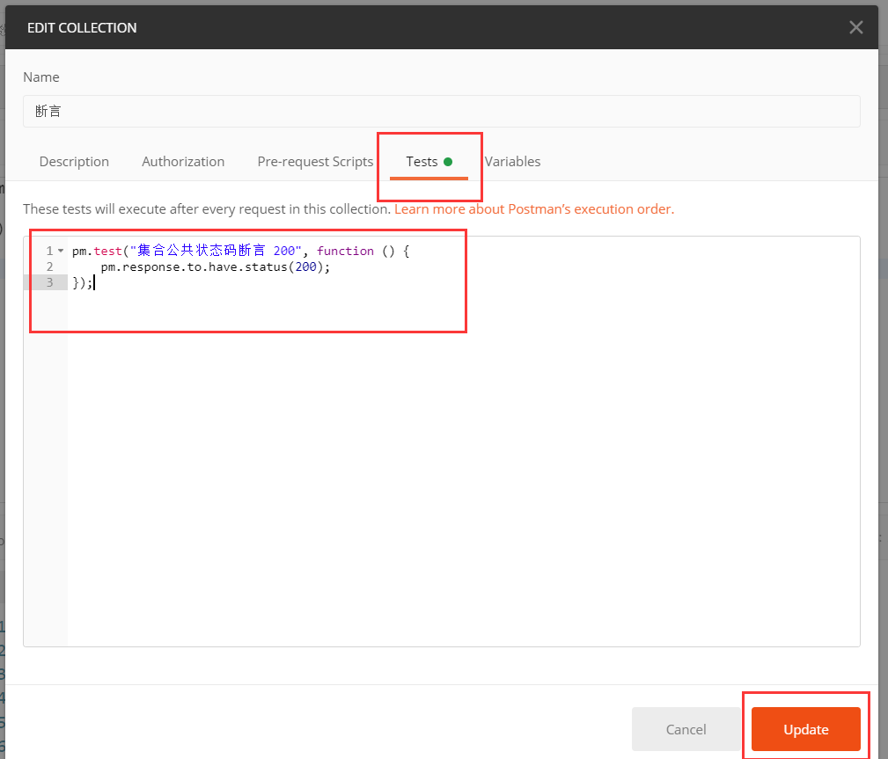

可以将集合中的一些公共的断言写到集合配置中，在集合中的接口在执行时，会自动的应用上集合配置中的断言。


# 特殊接口

## 签名接口

1.  知道签名接口的加密规则
    1.  sign：md5(手机号 + 盐 + 时间戳)
2.  知道，在请求之前处理相关的数据


```javascript
// 获取手机号

var phone = "1212113";

// 获取盐
var optCode = "testfan";


// 获取时间戳

var timestamp = new Date().getTime();

// console.log(timestamp);

// md5 加密

var md5 = CryptoJS.MD5(phone + optCode + timestamp).toString();
// console.log(md5);

// 将加密后的字符串set回环境中
pm.globals.set("phone", phone);
pm.globals.set("timestamp", timestamp);
pm.globals.set("md5", md5);
```


## cookies

处理cookie有两种方式：

-   第一种，手动的获取cookies值，然后在需要cookies的请求中，手动携带，注意：你要保证cookie值是有效的。
-   第二种，postman在发送请求的时候，如果响应中有cookies返回，就会自动的帮我们保存在cookie管理器中。当有向该域名发送请求的时候，postman会自动的帮我们携带cookie值。

## token

postman不会帮我们处理token，只能我们自己来完成：

-   第一种，用例浏览器登录账号，获取token值，在有需要的接口中，手动添加。

-   第二种：

    -   在登录接口访问成功后，从请求体中获取token字段，并且set到全局变量中。

    ```javascript
    // 从响应体中获取token字段： data
    var token = pm.response.json().data;
    
    // 将token值set到全局的环境中去。
    pm.globals.set("my_token", token);
    ```

    -   在需要使用token的接口中，在该接口请求发送之前， 从环境中获取token值，填写在请求头中。

    


## webservice接口

参考：http://www.webxml.com.cn/zh_cn/index.aspx

简单来说，webservice是通过xml进行交互的web请求，本质上也是HTTP请求。

Web Service也叫XML Web Service WebService是一种可以接收从Internet或者Intranet上的其它系统中传递过来的请求，轻量级的独立的通讯技术。是通过SOAP在Web上提供的软件服务，使用WSDL文件进行说明，并通过UDDI进行注册。

**如何调试webservice接口**

1.  在post请求的`raw`中输入请求的参数，并且，格式选择`xml`:

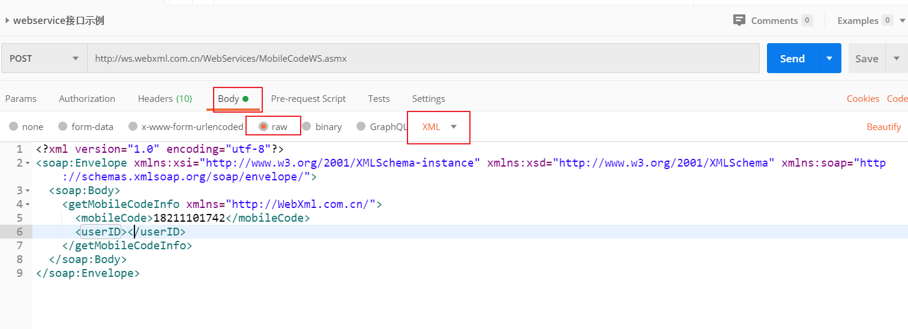

2.  由于上一步中，选择`xml`格式的时候，postman会自动的在请求头中，添加上`Content-Type:application/xml`，但是webservice接口的content-type不是`application/xml`而是`text/xml`.

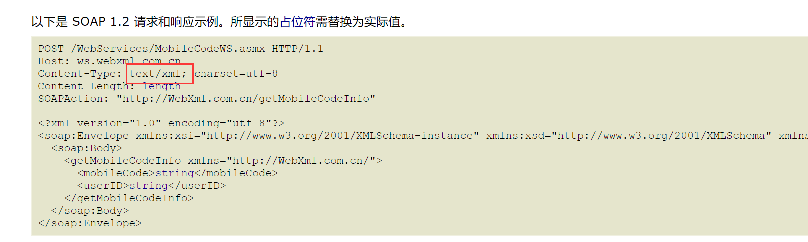

3.  修改请求content-type值。


4.  就正常的发请求就完了。

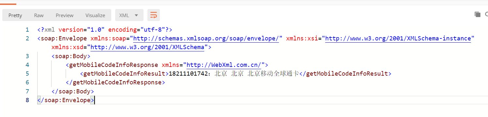


# 集合自动化

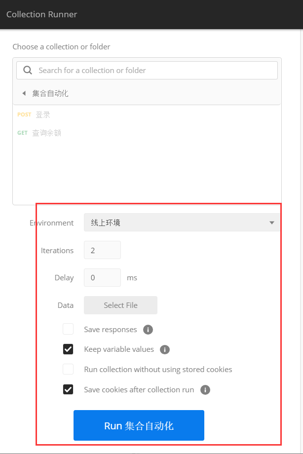

如上图，在启动集合的时候，有如下参数配置：

-   Environment：选择接口执行时依赖的环境。
-   Iterations：表示该集合内的接口运行的次数。
-   Delay：接口执行前延时多少毫秒。
-   Log Response：默认记录所有的响应日志。
-   Data：参数数据，暂时先不管它。
-   Keep variable values：保存在运行过程中产生的变量或者值，选择默认即可。
-   Run collection without using stored cookies：运行中不使用cookie，这里也保持默认。
-   Save cookies after collection run：在集合执行之后，保存cookies，选择默认。
-   Run 集合名称：运行集合。

数据驱动这里：一般轮训次数会自动的根据你的数据行数来定。如果轮训次数大于数据行数，那么在剩余的轮训中，提取的数据就是数据文件的最后一行。


# 命令行测试

## 环境配置

1.  安装nodejs：https://www.cnblogs.com/Neeo/articles/11637320.html，注意，nodejs版本不低于10。

2.  由于自带的npm命令受网络影响严重，我们需要配置一个国内的淘宝镜像：cnpm，终端(管理员权限)执行如下命令：

```
npm install -g cnpm --registry=https://registry.npm.taobao.org
```

3.  测试vnpm是否安装成功：

```
cnpm -v
```

4.  使用cnpm来安装Newman插件：

```
cnpm install newman --global
newman -v
```

5.  安装reporter插件，用来生成测试报告

```
cnpm install -g newman-reporter-html
```

6.  执行终端命令，获取html类型的报告

```
newman run 脚本 -d 参数文件 -e 环境文件 -n 循环次数 -r html --reporter-html-export 测试报告路径
```


## question

### newman required node version >=10

意思是nodejs版本太低了，需要10及以上的版本。


## nodejs需要win8以上的系统

这个意思是新版本的nodejs要求的Windows系统在win8以上，你可以安装一个稍微低一点的nodejs，如12.x版本

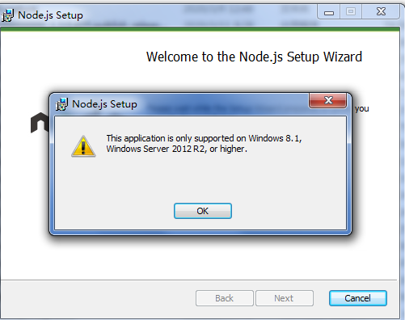


# 本地部署Java项目

1.  要安装java jdk（Windows/Mac）：java jdk安装：https://www.cnblogs.com/Neeo/articles/11954283.html
2.  下载`apache-tomcat-8.5.38.zip`压缩包，解压到你的本机上，一个没有中文，空格的目录中。
3.  配置相关的环境变量。

| 变量名        | 值                  |
| ------------- | ------------------- |
| JAVA_HOME     | java jdk 的安装目录 |
| PATH          | %JAVA_HOME%\bin     |
| CATALINA_HOME | tomcat的安装目录    |
| PATH          | tomcat的bin目录     |

4.  启动，在任意目录打开终端，输入`pinter`，启动过程稍慢，选哟静等一会儿

5.  浏览器访问`127.0.0.1:8231/pinter/index`

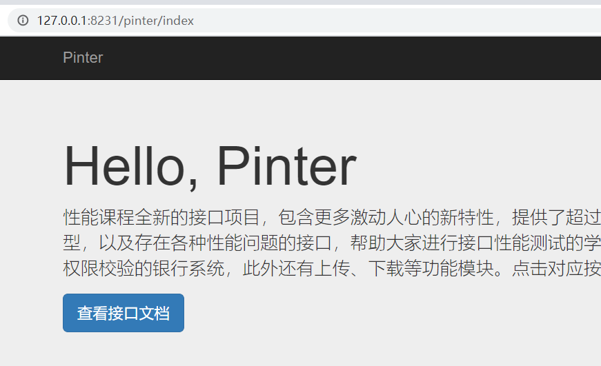


其他平台配置方式：https://www.cnblogs.com/Neeo/articles/12168651.html


## 问题

打开tomcat的启动文件，一闪即逝，意思是你的Java环境配置的有问题，解决办法：

1.  检擦你的环境变量是否配置好了。
2.  重启电脑


# 今日作业

把今天的特殊接口、断言、环境管理、命令行执行postman脚本、tomcat部署都要做一遍。


