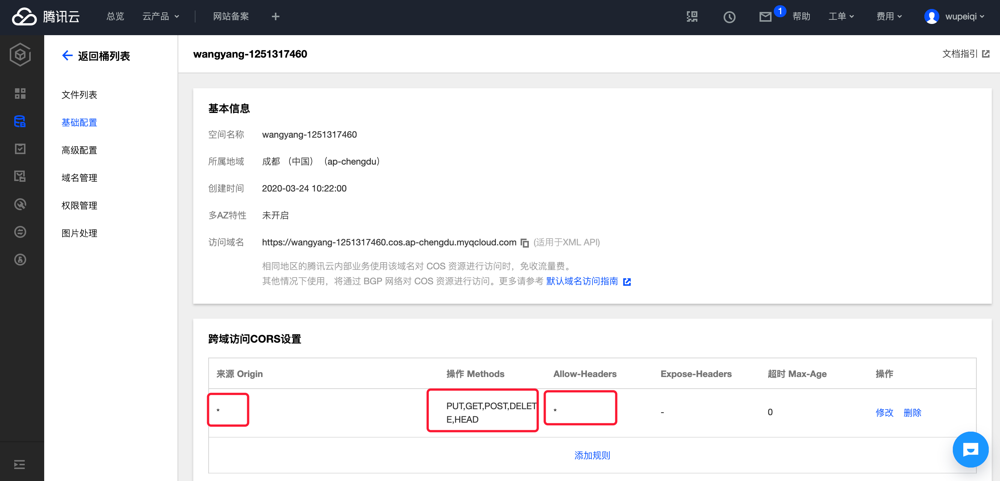

# day10 文件管理


本节主要带大家实现saas平台的文件管理部分，用于给项目提供文件共享的功能，在文件管理部部分主要涵盖一下两大部分：

- 文件夹管理
  - 文件夹的增删改查
  - 文件夹嵌套的深度以返回的问题
  - 删除文件夹时将此文件夹下所有的子文件夹及文件要删除
- 文件管理 <span style="color:red;">【重点】</span>
  - 通过js + 腾讯 cos 进行文件的上传
  - 上传文件时显示进度条

其中文件管理属于项目中的核心重点部分，尤其是js对文件及进度条的管理，所以本节主要为大家提供这个功能的介绍。

## 1. 秘钥直接上传文件【不推荐】

在前端可以通过 js + 秘钥 直接向腾讯的cos上传文件，但是考虑安全问题所以推荐使用，但可以把他当做入门学习的示例来进行功能的实现。

### 1.1 下载js并引入

下载地址：https://github.com/tencentyun/cos-js-sdk-v5/tree/master/dist

```
<script src="./cos-js-sdk-v5.min.js"></script>
```

### 1.2 前端代码示例

```html


<!DOCTYPE html>
<html lang="en">

<head>
    <meta charset="UTF-8">
    <meta name="viewport" content="width=device-width, initial-scale=1.0">
    <title>Document</title>
</head>

<body>
    <h1>示例1：直接通过秘钥进行删除上传文件</h1>
    <input type="file" name="upload_file" id="uploadFile" multiple />

    <script src=" "> </script>
    <script src=" "> </script>
    <script>
        var cos;
        $(function () {
            initCOS();
            bindChangeFileInput();
        });

        function initCOS() {
            cos = new COS({
                SecretId: 'AKIDFPJSXQEk8PXVL3Tx5zf6MSL0Sf7Qoikg',
                SecretKey: 'yiCWfZCXcQxJZlqncKvRu5DKHySg8sMp',
            });
        }

        function bindChangeFileInput() {
            $("#uploadFile").change(function () {
                // 获取要上传的所有文件对象列表
                var files = $(this)[0].files;
                $.each(files, function (index, fileObject) {
                    var fileName = fileObject.name;
                    // 上传文件
                    cos.putObject({
                        Bucket: 'wangyang-1251317460', /* 必须 */
                        Region: 'ap-chengdu',     /* 存储桶所在地域，必须字段 */
                        Key: fileName,              /* 必须 */
                        StorageClass: 'STANDARD',
                        Body: fileObject, // 上传文件对象
                        onProgress: function (progressData) {
                            console.log("文件上传进度--->",fileName,JSON.stringify(progressData));
                        }
                    }, function (err, data) {
                        console.log(err || data);
                    });

                })

            })
        }
    </script>
</body>

</html>
```


### 1.3 跨域问题

通过js直接上传文件时，都会出现跨域的问题，要想解决跨域必须在cos后台进行相应的配置，如：




### 1.4 上传成功


Django示例代码，访问：http://127.0.0.1:8000/demo1/


## 2.临时凭证上传文件【推荐】

由于key直接放在前端，会导致前端用户获取到我们的 secret_key 和 secret_id，有可能会导致cos中的数据不安全。so，建议使用临时授权的方式，即：

- 浏览器先向我们的django后台获取临时凭证，django返回临时凭证给前端浏览器
- 前端浏览器根据临时凭证创建cos对象
- 前端浏览器使用cos对象的putObject方法上传文件。

#### 2.1 按照生成临时凭证的SDK

```
pip install -U qcloud-python-sts
```

#### 2.2 代码

```python
def demo2(request):
    """
    示例2：通过临时凭证上传
    """
    return render(request,'demo2.html')
```


```html


<!DOCTYPE html>
<html lang="en">

<head>
    <meta charset="UTF-8">
    <meta name="viewport" content="width=device-width, initial-scale=1.0">
    <title>Document</title>
</head>

<body>
    <h1>示例2：临时凭证上传文件</h1>
    <input type="file" name="upload_file" id="uploadFile" multiple />

    <script src=" "> </script>
    <script src=" "> </script>
    <script>
        var cos;
        $(function () {
            initCOS();
            bindChangeFileInput();
        });

        function initCOS() {
            cos = new COS({
                getAuthorization: function (options, callback) {
                    // 想django后台发送请求，获取临时凭证
                    $.get('/cos/credential/', {
                        // 可从 options 取需要的参数
                    }, function (data) {
                        var credentials = data && data.credentials;
                        if (!data || !credentials) return console.error('credentials invalid');
                        callback({
                            TmpSecretId: credentials.tmpSecretId,
                            TmpSecretKey: credentials.tmpSecretKey,
                            XCosSecurityToken: credentials.sessionToken,
                            StartTime: data.startTime,
                            ExpiredTime: data.expiredTime,
                        });
                    });
                }
            });
        }

        function bindChangeFileInput() {
            $("#uploadFile").change(function () {
                // 获取要上传的所有文件对象列表
                var files = $(this)[0].files;
                $.each(files, function (index, fileObject) {
                    var fileName = fileObject.name;
                    // 上传文件
                    cos.putObject({
                        Bucket: 'wangyang-1251317460', /* 必须 */
                        Region: 'ap-chengdu',     /* 存储桶所在地域，必须字段 */
                        Key: fileName,              /* 必须 */
                        StorageClass: 'STANDARD',
                        Body: fileObject, // 上传文件对象
                        onProgress: function (progressData) {
                            console.log("文件上传进度--->", fileName, JSON.stringify(progressData));
                        }
                    }, function (err, data) {
                        console.log(err || data);
                    });

                })

            })
        }
    </script>
</body>

</html>
```


#### 2.3 生成凭证

```python

def cos_credential(request):
    from sts.sts import Sts
    config = {
        # 临时密钥有效时长，单位是秒（30分钟=1800秒）
        'duration_seconds': 1800,
        # 固定密钥 id
        'secret_id': "AKIDFPJSXQEk8PXVL3Tx5zf6MSL0Sf7Qoikg",
        # 固定密钥 key
        'secret_key': "yiCWfZCXcQxJZlqncKvRu5DKHySg8sMp",
        # 换成你的 bucket
        'bucket': "wangyang-1251317460",
        # 换成 bucket 所在地区
        'region': "ap-chengdu",
        # 这里改成允许的路径前缀，可以根据自己网站的用户登录态判断允许上传的具体路径
        # 例子： a.jpg 或者 a/* 或者 * (使用通配符*存在重大安全风险, 请谨慎评估使用)
        'allow_prefix': '*',
        # 密钥的权限列表。简单上传和分片需要以下的权限，其他权限列表请看 https://cloud.tencent.com/document/product/436/31923
        'allow_actions': [
            'name/cos:PostObject',
            # 'name/cos:DeleteObject',
            # "name/cos:UploadPart",
            # "name/cos:UploadPartCopy",
            # "name/cos:CompleteMultipartUpload",
            # "name/cos:AbortMultipartUpload",
            "*",
        ],

    }

    sts = Sts(config)
    result_dict = sts.get_credential()
    return JsonResponse(result_dict)
    
```

#### 2.4 上传文件


Django示例代码见：【http://127.0.0.1:8000/demo2/】


## 3.Django示例代码

cos_demo.zip