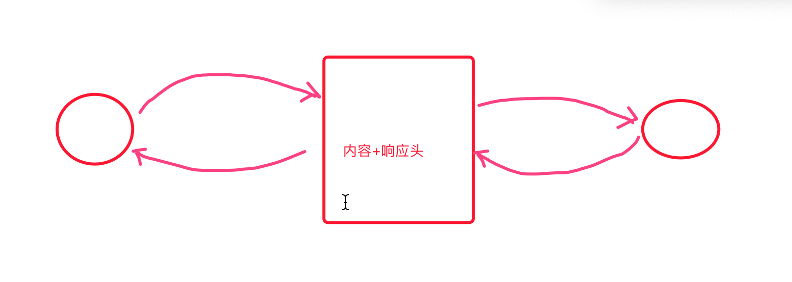
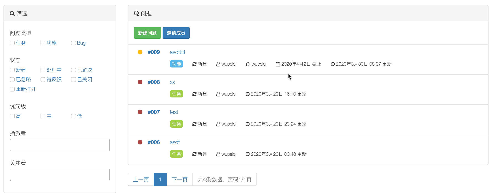

# day13

- 毕云峰
- 任伟博
- 田春鹏，最后一个没有做。


## 今日概要

- 文件管理：下载
- 项目删除
- 问题管理：
  - 表结构
  - 新建问题
  - 问题展示列表
  - 分页


## 今日详细

### 1.下载文件

```
浏览器 				 django
请求					  HttpResponse(...) 文本；响应头
请求					  render(...)       文本；响应头
请求					  ...               文件内容；响应头
```



```python
def download(request):
    # 打开文件，获取文件的内容
    with open('xxx.png',mode="rb") as f:
        data = f.read()
	
	response =  HttpResponse(data)
    # 设置响应头
    response['Content-Disposition'] = "attachment; filename=xxx.png"
    return response
```

### 2.删除项目

- 项目删除
- 桶删除

### 3.问题管理

#### 3.1 设计表结构




```
- 产品经理：功能 + 原型图
- 开发人员：表结构的设计
```

| ID   | 标题 | 内容 | 类型FK | 模块FK | 状态CH | 优先级CH | 指派FK | 关注m2m | 开始时间 | 截止时间 | 模式 | 父问题 |
| ---- | ---- | ---- | ------ | ------ | ------ | -------- | ------ | ------- | -------- | -------- | ---- | ------ |
|      |      |      |        |        |        |          |        |         |          |          |      |        |
|      |      |      |        |        |        |          |        |         |          |          |      |        |
|      |      |      |        |        |        |          |        |         |          |          |      |        |

| Id   | 问题类型 | 项目ID |
| ---- | -------- | ------ |
| 1    | Bug      |        |
| 2    | 功能     |        |
| 3    | 任务     |        |

| Id   | 模块            | 项目 |
| ---- | --------------- | ---- |
| 1    | 第一期 用户认证 |      |
| 2    | 第二期 任务管理 |      |
| 3    | 第三期 支付     |      |

```
class Issues(models.Model):
    """ 问题 """
    project = models.ForeignKey(verbose_name='项目', to='Project')
    issues_type = models.ForeignKey(verbose_name='问题类型', to='IssuesType')
    module = models.ForeignKey(verbose_name='模块', to='Module', null=True, blank=True)

    subject = models.CharField(verbose_name='主题', max_length=80)
    desc = models.TextField(verbose_name='问题描述')
    priority_choices = (
        ("danger", "高"),
        ("warning", "中"),
        ("success", "低"),
    )
    priority = models.CharField(verbose_name='优先级', max_length=12, choices=priority_choices, default='danger')

    # 新建、处理中、已解决、已忽略、待反馈、已关闭、重新打开
    status_choices = (
        (1, '新建'),
        (2, '处理中'),
        (3, '已解决'),
        (4, '已忽略'),
        (5, '待反馈'),
        (6, '已关闭'),
        (7, '重新打开'),
    )
    status = models.SmallIntegerField(verbose_name='状态', choices=status_choices, default=1)

    assign = models.ForeignKey(verbose_name='指派', to='UserInfo', related_name='task', null=True, blank=True)
    attention = models.ManyToManyField(verbose_name='关注者', to='UserInfo', related_name='observe', blank=True)
    
    start_date = models.DateField(verbose_name='开始时间', null=True, blank=True)
    end_date = models.DateField(verbose_name='结束时间', null=True, blank=True)
    mode_choices = (
        (1, '公开模式'),
        (2, '隐私模式'),
    )
    mode = models.SmallIntegerField(verbose_name='模式', choices=mode_choices, default=1)

    parent = models.ForeignKey(verbose_name='父问题', to='self', related_name='child', null=True, blank=True,
                               on_delete=models.SET_NULL)

    creator = models.ForeignKey(verbose_name='创建者', to='UserInfo', related_name='create_problems')

    create_datetime = models.DateTimeField(verbose_name='创建时间', auto_now_add=True)
    latest_update_datetime = models.DateTimeField(verbose_name='最后更新时间', auto_now=True)

    def __str__(self):
        return self.subject
        
class Module(models.Model):
    """ 模块（里程碑）"""
    project = models.ForeignKey(verbose_name='项目', to='Project')
    title = models.CharField(verbose_name='模块名称', max_length=32)

    def __str__(self):
        return self.title

class IssuesType(models.Model):
    """ 问题类型 例如：任务、功能、Bug """
    title = models.CharField(verbose_name='类型名称', max_length=32)
    project = models.ForeignKey(verbose_name='项目', to='Project')

    def __str__(self):
        return self.title

```

#### 3.2 新建问题

##### 3.2.1 模态对话框

- 显示对话框
- 显示用户要填写的数据（表单）

前端插件：

- bootstrap-datepicker

  ```
  css
  js
  js找到标签处理
  ```

- bootstrap-select

  ```
  css
  js
  ModelForm中添加属性
  ```

#### 3.3 问题列表

#### 3.4 自定义分页（10年前文件）


## 任务&作业

1. 下载文件
2. 删除项目
3. 问题管理
   1. 表结构
   2. 样式 + 插件
   3. ajax + 添加 + 页面刷新
   4. 问题列表
   5. 分页


