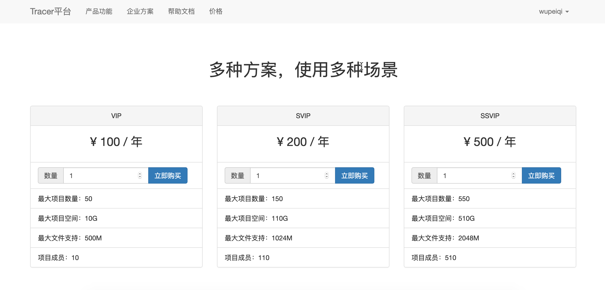
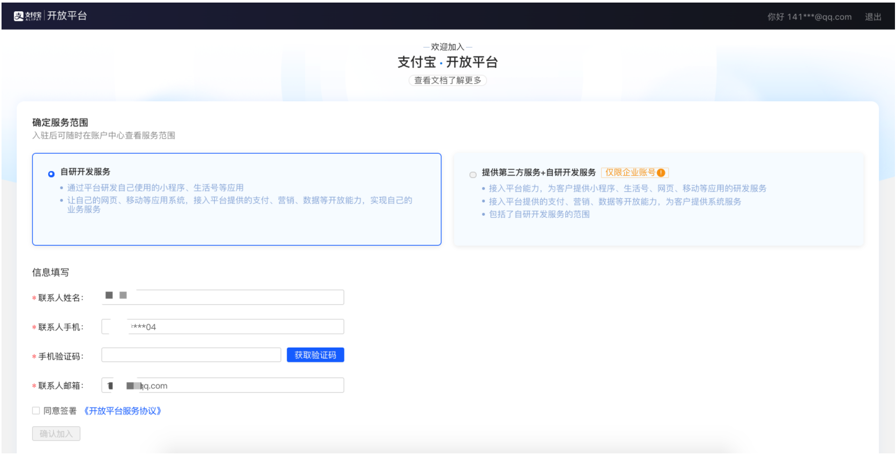
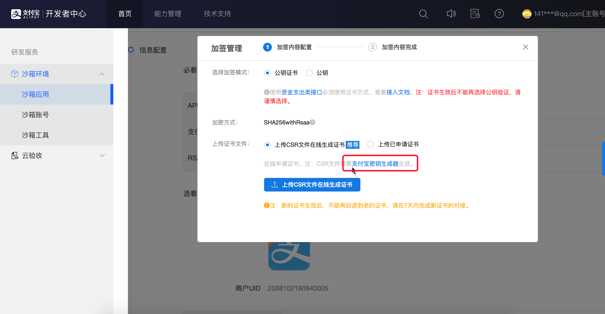
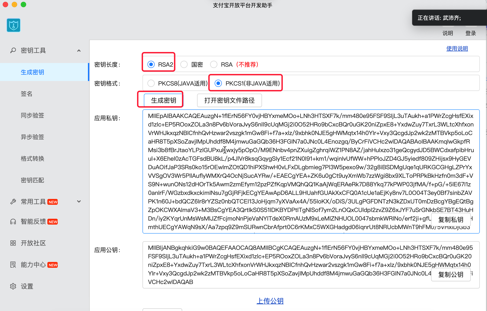
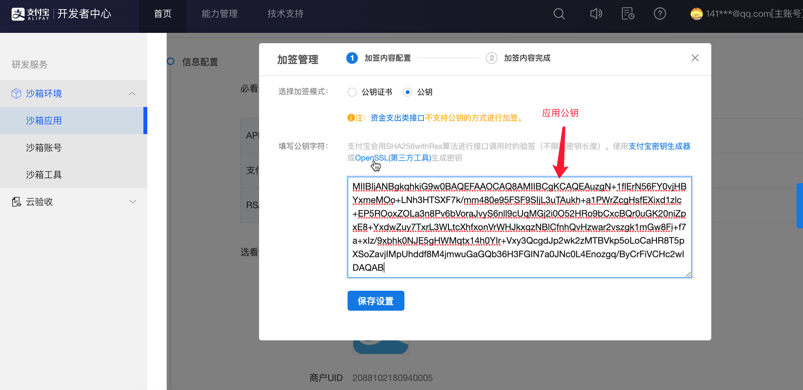
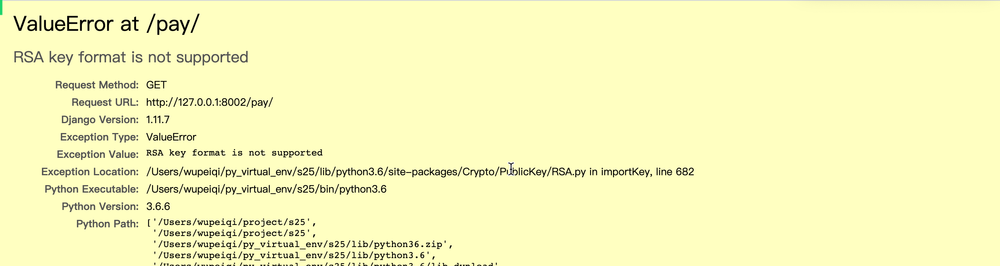
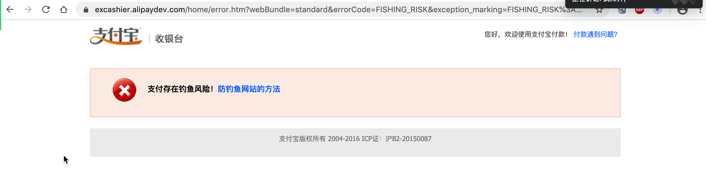

# day17 

- 任伟博，？
- 马天昊，前端js导入有问题。


## 今日概要

- 统计报表
- 支付


## 今日详细

### 1.django时区

```python
# datetime.datetime.now() / datetime.datetime.utcnow() => utc时间
# TIME_ZONE = 'UTC'

# datetime.datetime.now() - 东八区时间 / datetime.datetime.utcnow() => utc时间
TIME_ZONE = 'Asia/Shanghai'

# 影响自动生成数据库时间字段；
#       USE_TZ = True，创建UTC时间写入到数据库。
#       USE_TZ = False，根据TIME_ZONE设置的时区进行创建时间并写入数据库
USE_TZ = False
```

### 2.昨天Bug

```python
# 最多允许的成员(要进入的项目的创建者的限制）
# max_member = request.tracer.price_policy.project_member # 当前登录用户他限制

# 是否已过期，如果已过期则使用免费额度
max_transaction = models.Transaction.objects.filter(user=invite_object.project.creator).order_by('-id').first()
if max_transaction.price_policy.category == 1:
    max_member = max_transaction.price_policy.project_member
else:
    if max_transaction.end_datetime < current_datetime:
        free_object = models.PricePolicy.objects.filter(category=1).first()
        max_member = free_object.project_member
    else:
        max_member = max_transaction.price_policy.project_member
```

### 3.画图

在网页上画图：HighCharts / Echarts 。

#### 3.1 下载文件

https://www.highcharts.com.cn/download

#### 3.2 应用

```
<script src="http://cdn.highcharts.com.cn/highcharts/8.0.4/highcharts.js"></script>
```

```
<div id='i1'></div>
```

```
var chart = Highcharts.chart('i1', {
		title: {
				text: '2010 ~ 2016 年太阳能行业就业人员发展情况'
		},
		subtitle: {
				text: '数据来源：thesolarfoundation.com'
		},
		yAxis: {
				title: {
						text: '就业人数'
				}
		},
		legend: {
				layout: 'vertical',
				align: 'right',
				verticalAlign: 'middle'
		},
		plotOptions: {
				series: {
						label: {
								connectorAllowed: false
						},
						pointStart: 2010
				}
		},
		series: [{
				name: '安装，实施人员',
				data: [43934, 52503, 57177, 69658, 97031, 119931, 137133, 154175]
		}, {
				name: '工人',
				data: [24916, 24064, 29742, 29851, 32490, 30282, 38121, 40434]
		}, {
				name: '销售',
				data: [11744, 17722, 16005, 19771, 20185, 24377, 32147, 39387]
		}, {
				name: '项目开发',
				data: [null, null, 7988, 12169, 15112, 22452, 34400, 34227]
		}, {
				name: '其他',
				data: [12908, 5948, 8105, 11248, 8989, 11816, 18274, 18111]
		}],
		responsive: {
				rules: [{
						condition: {
								maxWidth: 500
						},
						chartOptions: {
								legend: {
										layout: 'horizontal',
										align: 'center',
										verticalAlign: 'bottom'
								}
						}
				}]
		}
});
```

#### 3.3 关于中文包

- 给你提供js文件
- 不提供

#### 总结：

- 下载并引入

- 应用

  - 引入js
  - 定义div
  - js进行配置

- 以后有需求：demo + api

- 注意事项：series

  - 生成单条的图

    ```
    series: [{
    	data: [1,2,3,4,5,65,76,8778]
    }]
    ```

  - 生成多条的图

    ```
    series: [
        {
        	name:'苹果',
            data: [1,2,3,4,5,65,76,8778]
        },
        {
        	name:'句子',
            data: [1,2,3,4,5,65,76,8778]
        }
    ]
    ```

    

### 4.统计


#### 4.1 daterangepicker插件

#### 4.1 饼图

#### 4.3 柱状图

### 重点难点：

- 前端的配置，找配置&试。
- 数据处理，前端所需格式的数据。


### 5.支付

#### 5.1 点击价格展示套餐

无需登录就能查看。



#### 5.2 支付页面

需要登录才能看到。


#### 5.3 订单列表【作业】

展示所有订单以及可以取消订单、再次发起支付。

- 查看所有的订单（读取个人的交易记录的表 category=2）
- 去支付（把自己的id传到后台）
  - 根据ID获取：价格、订单号
  - 生成支付宝条状链接
  - 跳转到支付宝去支付

- 交易记录的过期（1天之后过期）

  ```
  交易记录创建时间判断 和 当前时间进行比较
  celery定时任务30分钟执行。【预习】
  ```

  


## 支付宝支付

- 正式环境：营业执照等信息。

  ```
  https://opendocs.alipay.com/open/270/105899
  ```

- 沙箱环境，模拟真实的环境。

  ```
  https://opendocs.alipay.com/open/200/105311
  ```

  

### 1.申请开通沙箱环境

https://openhome.alipay.com/platform/appDaily.htm?tab=info




注册成功之后会获取两个值：

- APPID，2016102400754054
- 支付宝网关
  - https://openapi.alipaydev.com/gateway.do
  - https://openapi.alipay.com/gateway.do

### 2.生成秘钥

秘钥用于以后对URL中添加的参数进行加密和校验。

#### 2.1 下载秘钥生成器

生成一对秘钥：

- 应用公钥
- 应用私钥






#### 2.2 上传应用公钥并获得支付宝公钥




本次操作中共获取到三个秘钥：

- 应用公钥
- 应用私钥，对以后URL中传入的数据进行签名加密用。
- 支付宝公钥（通过应用公钥生成），在页面支付成功后跳转回来时候，对支付宝给我们传的值进行校验。


### 3.账户信息和测试APP

- 买家信息

  ```
  买家账号uppiav5017@sandbox.com
  登录密码111111
  支付密码111111
  用户名称沙箱环境
  证件类型身份证(IDENTITY_CARD)
  证件号码939581196106136440
  账户余额
  99999.00充值取现
  ```

- 商家信息

  ```
  商家账号ijcwgw5346@sandbox.com
  商户UID2088102180940005
  登录密码111111
  账户余额
  0.00充值取现
  ```

- APP
  


### 4.两种支持

- SDK，写好一个Python模块
  https://opendocs.alipay.com/open/54/103419

  ```
  1. 安装模块
  2. 基于模块实现想要的功能
  ```

  ```python
  pip install alipay-sdk-python==3.3.398
  
  # 不推荐
  ```

- API，就是给你提供的一个URL
  https://opendocs.alipay.com/apis/api_1/alipay.trade.page.pay

  ```
  1. 自己手动会URL进行处理和加密
  ```

  ```
  让你跳转到这个地址：【网关?参与】 组成
  网关 = https://openapi.alipaydev.com/gateway.do
  参数 = {
  	app_id:"2016102400754054",
  	method:"alipay.trade.page.pay"
  	format:"JSON",
  	return_url:"支付成功之后跳转GET到的那个页面地址",
  	notify_url:"同时偷偷想这个地址发送一个POST请求",
  	charset:"utf-8",
  	sign_type:"RSA2",
  	sign:"签名",
  	timestamp:"2014-07-24 03:07:50",
  	version:'1.0',
  	biz_content:{
  		out_trade_no:"订单号",
  		product_code:"FAST_INSTANT_TRADE_PAY",
  		total_amount:11.68,
  		subject:"订单标题"
  	}
  }
  ```

  ```
  如果支付成功之后，服务器宕机，如何处理？
  偷偷向notify_url发请求，说支付成功了，你更改下状态。
  	服务器宕机，支付宝访问不到，则会在24小时以内发送：支付宝服务器会不断重发通知，直到超过24小时22分钟。一般情况下，25小时以内完成8次通知（通知的间隔频率一般是：4m,10m,10m,1h,2h,6h,15h）
  	我的网站接收到支付宝请求之后，返回数据不正确，同上。
  	返回一个字符串 "success"
  	
  https://opendocs.alipay.com/open/270/105902/
  ```

  ```
  支付宝签名的过程：对参数进行处理，处理完之后再让他和网关拼接起来。 
  网关 = https://openapi.alipaydev.com/gateway.do
  params = {
  	app_id:"2016102400754054",
  	method:"alipay.trade.page.pay"
  	format:"JSON",
  	return_url:"支付成功之后跳转GET到的那个页面地址",
  	notify_url:"同时偷偷想这个地址发送一个POST请求",
  	charset:"utf-8",
  	sign_type:"RSA2",
  	sign:"签名",
  	timestamp:"2014-07-24 03:07:50",
  	version:'1.0',
  	biz_content:{
  		out_trade_no:"订单号",
  		product_code:"FAST_INSTANT_TRADE_PAY",
  		total_amount:11.68,
  		subject:"订单标题"
  	}
  }
  
  1. 将参数中 空、文件、字节、sign 踢出。 
     params.pop(sign)
  
  2. 排序，对参数中所有的key进行从小大大排序 sort(params)
     并按照第一个字符的键值ASCII码递增排序（字母升序排序），如果遇到相同字符则按照第二个字符的键值ASCII码递增排序，以此类推。
  
  3. 将排序后的参数与其对应值，组合成“参数=参数值”的格式，并且把这些参数用&字符连接起来，此时生成的字符串为待签名字符串。
     待签名的字符串 = "app_id=2016102400754054&method=alipay.trade.page.pay"
  
     注意：1.有字典应该转换为字符串; 2.字符串中间不能有空格。
     json.dumps(info,separators=(",",":"))
  4.使用各自语言对应的SHA256WithRSA签名函数并利用商户（应用）私钥对待签名字符串进行签名，并进行Base64编码。
     result = 使用 SHA256WithRSA 函数和私钥对签名字符串进行签名
     签名 = 在对result进行Base64编码
  
     把签名再添加到会params字典中 params[sign] = 签名
  	注意：base64编码之后之后，内部不能有换行符 签名.replace("\n","")
  	
  5.再讲所有的参数拼接起来。
  	
  	注意：在拼接URL时候不能出现 ;,(等字符， 提前将特殊字符转换URL转义的字符。
  		from urllib.parse import quote_plus
  
  https://opendocs.alipay.com/open/291/105974
  https://opendocs.alipay.com/open/291/106118
  ```

  ```python
  # pip3 install pycrypto
  # 如果是 pycryptodom.xxxx.whl  下载到本地，pip install pycryptodom.xxxx.whl
  ```

  ```python
  # 构造字典
  params = {
      'app_id': "2016102400754054",
      'method': 'alipay.trade.page.pay',
      'format': 'JSON',
      'return_url': "http://127.0.0.1:8001/pay/notify/",
      'notify_url': "http://127.0.0.1:8001/pay/notify/",
      'charset': 'utf-8',
      'sign_type': 'RSA2',
      'timestamp': datetime.datetime.now().strftime("%Y-%m-%d %H:%M:%S"),
      'version': '1.0',
      'biz_content': json.dumps({
          'out_trade_no': order_id,
          'product_code': 'FAST_INSTANT_TRADE_PAY',
          'total_amount': 1.11,
          'subject': "x1"
      }, separators=(',', ':'))
  }
  
  # 获取待签名的字符串
  unsigned_string = "&".join(["{0}={1}".format(k, params[k]) for k in sorted(params)])
  print(unsigned_string)
  
  # 签名 SHA256WithRSA(对应sign_type为RSA2)
  from Crypto.PublicKey import RSA
  from Crypto.Signature import PKCS1_v1_5
  from Crypto.Hash import SHA256
  from base64 import decodebytes, encodebytes
  
  # SHA256WithRSA + 应用私钥 对待签名的字符串 进行签名
  private_key = RSA.importKey(open("files/skd/应用私钥2048.txt").read())
  signer = PKCS1_v1_5.new(private_key)
  signature = signer.sign(SHA256.new(unsigned_string.encode('utf-8')))
  
  # 对签名之后的执行进行base64 编码，转换为字符串
  sign_string = encodebytes(signature).decode("utf8").replace('\n', '')
  
  # 把生成的签名赋值给sign参数，拼接到请求参数中。
  
  from urllib.parse import quote_plus
  result = "&".join(["{0}={1}".format(k, quote_plus(params[k])) for k in sorted(params)])
  result = result + "&sign=" + quote_plus(sign_string)
  
  gateway = "https://openapi.alipaydev.com/gateway.do"
  pay_url = "{}?{}".format(gateway, result)
  
  ```

  

  

  

  

### 5.常见报错：秘钥



秘钥格式问题。


### 6.常见报错：钓鱼网站




## 项目开发流程

- 需求整理
- 功能设计
- 表结构设计
- 开发，代码都是运行在自己电脑。
  - 前端：1
  - 后端：1
- 运维，把代码部署到`服务器`（牛逼的电脑）
  - 租一台电脑 + 租一个公网IP + 租域名
  - 域名解析： 域名 - IP绑定 - 电脑（django）
  - Linux操作系统 ( 全都 )  /  windows操作系统

## 下一阶段：Linux操作系统（7天）

- linux基本命令
- linux上安装python、dango、redis
- linux系统上代码部署：nginx + uwsgi 
- docker中安装python、django、redis > 项目部署。

- 个人建议

  - 项目讲完了，周6、7项目赶上我的进度。
  - 项目思维导图（面试项目复习）
  - 租一个腾讯云或阿里云服务器（1年/100-200）

- 作业要求：下周一之前录屏幕视频，把项目的每个页面涉及到的知识点和如何实现的。

  ```
  星期一晚上12:00。
  ```

  

  


