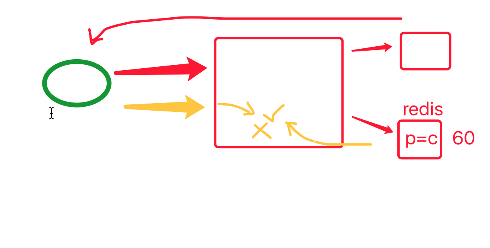

# day02

## 内容回顾

1. local_settings的作用？

   ```
   本地配置信息。
   - 开发
   - 测试             GIT仓库
   - 运维
   ```

2. .gitignore的作用？

   ```
   git软件，本地进行版本管理。
   	git init
   	git add 
   	git commit 
   码云/github/gitlab，代码托管。
   ```

3. 虚拟环境的作用？

   ```
   项目之间环境隔离。
   开发：本地环境
   线上: 多环境隔离
   ```

   ```
   pip freeze > requirements.txt
   pip install -r requirements.txt
   ```

   

## 今日概要

- 腾讯发送短信
- django的ModelForm组件
- redis
- 注册逻辑设计
- 开发
- 讲解


## 今日详细

### 1.腾讯发送短信

- 注册
- 登录

使用文档：https://pythonav.com/wiki/detail/10/81/

djang代码示例：

- 仓库地址：https://gitee.com/wupeiqi/s25
- 提交信息：sms sdk


### 2. Django的ModelFor


### 3. 下一步思路

- 点击获取验证

  - 获取手机号

  - 向后台发送ajax

    - 手机
    - tpl=register

  - 向手机发送验证码(ajax/sms/redis)

  - 验证码失效处理 60s

    

## 4.redis基本操作

#### 4.1 安装redis

windows

linux

#### 4.1 python操作redis的模块

-  redis直接连接

https://pythonav.com/wiki/detail/10/82/


##  作业

- ModelForM页面
- register页面写ajax，手机号和模板字符串tpl  csrf
- 校验：手机格式、模板
- sms + redis
- 进阶
  - 倒计时效果
  - 注册按钮：字段校验 + 手机验证码
  - py操作redis：django-redis
  - js上传 （闭包）【可选】


老师课上代码：https://gitee.com/wupeiqi/s25


