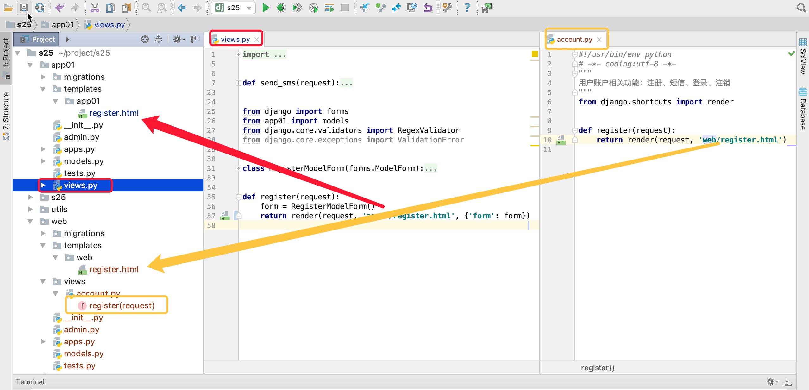
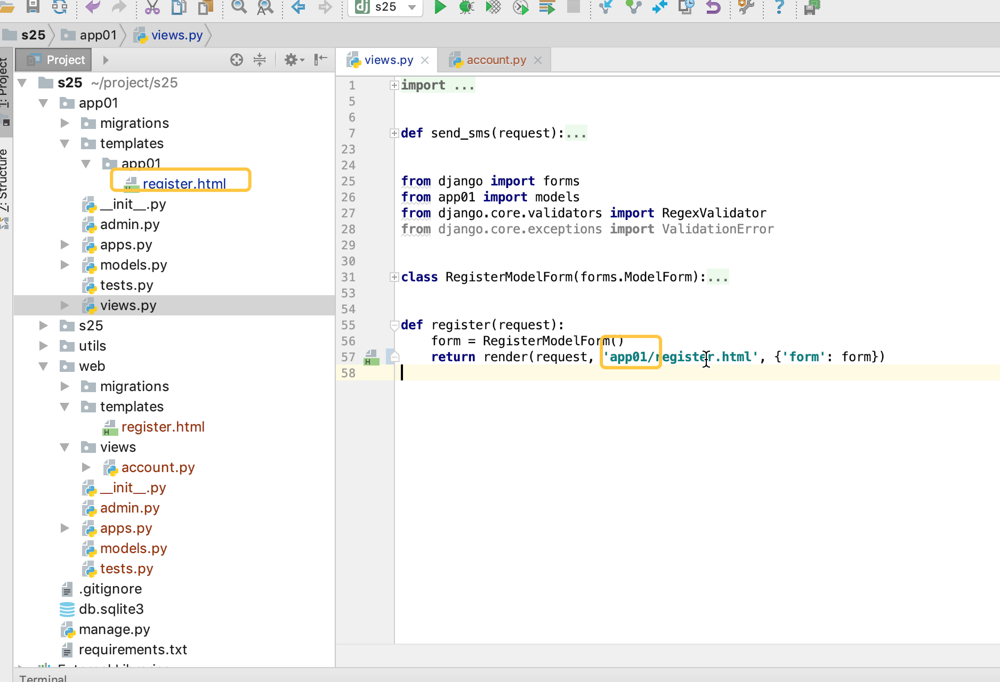

# day03 用户认证

## 内容回顾&补充

- 虚拟环境 virtualenv（每个项目创建独立虚拟环境）

- requirements.txt ( pip freeze > requirements.txt )

- local_settings.py 

- gitignore

- 腾讯云短信 / 阿里云短信 （ 阅读文档，文档不清晰：谷歌、必应、搜狗 ）

  - API，提供URL你去访问这些URL并根据提示传参数。【所有第三方工具都有】

    ```python
    requests.get("http://www.xxx.com//adsf/asdf/",json={......})
    ```

  - SDK，模块；下载安装模块，基于模块完成功能。

    ```python
    sms.py
        def func():
            return requests.get("http://www.xxx.com//adsf/asdf/",json={......})
    ```

    ```python
    pip install sms
    ```

    ```python
    sms.func()
    ```

- redis，帮助我们在内存可以存取数据的软件（基于内存的数据库）

  - 第一步：在A主机安装redis & 配置 & 启动

  - 第二步：链接redis

    - 方式一：利用redis提供的客户端。

    - 方式二：利用相关模块。

      - 安装模块

        ```
        pip3 install redis
        ```

      - 使用模块【不推荐直接连接】

        ```python
        import redis
        
        conn = redis.Redis(host='10.211.55.28', port=6379, password='foobared', encoding='utf-8')
        
        conn.set('15131255089', 9999, ex=10)
        
        value = conn.get('15131255089')
        
        print(value)
        ```

      - 使用模块【推荐连接池】

        ```python
        import redis
        # 创建redis连接池（默认连接池最大连接数 2**31=2147483648）
        pool = redis.ConnectionPool(host='10.211.55.28', port=6379, password='foobared', encoding='utf-8', max_connections=1000)
        
        # 去连接池中获取一个连接
        conn = redis.Redis(connection_pool=pool)
        # 设置键值：15131255089="9999" 且超时时间为10秒（值写入到redis时会自动转字符串）
        conn.set('name', "武沛齐", ex=10)
        # 根据键获取值：如果存在获取值（获取到的是字节类型）；不存在则返回None
        value = conn.get('name')
        print(value)
        ```

- django-redis，在django中“方便的”使用redis。

  ```
  不方便：redis模块 + 连接池
  方便：django-redis
  ```

  - 安装：`django-redis`

    ```
    pip3 install django-redis
    ```

  - 使用

    ```python
    # 配置文件 settings.py (建议local_settings.py)
    
    CACHES = {
        "default": {
            "BACKEND": "django_redis.cache.RedisCache",
            "LOCATION": "redis://10.211.55.28:6379", # 安装redis的主机的 IP 和 端口
            "OPTIONS": {
                "CLIENT_CLASS": "django_redis.client.DefaultClient",
                "CONNECTION_POOL_KWARGS": {
                    "max_connections": 1000,
                    "encoding": 'utf-8'
                },
                "PASSWORD": "foobared" # redis密码
            }
        },
        "master": {
            "BACKEND": "django_redis.cache.RedisCache",
            "LOCATION": "redis://10.211.55.29:6379", # 安装redis的主机的 IP 和 端口
            "OPTIONS": {
                "CLIENT_CLASS": "django_redis.client.DefaultClient",
                "CONNECTION_POOL_KWARGS": {
                    "max_connections": 1000,
                    "encoding": 'utf-8'
                },
                "PASSWORD": "foobar999ed" # redis密码
            }
        }
    }
    ```

    ```python
    from django.shortcuts import HttpResponse
    
    from django_redis import get_redis_connection
    
    def index(request):
        # 去连接池中获取一个连接
        conn = get_redis_connection() # 默认去default中
        
        conn.set('nickname', "武沛齐", ex=10)
        value = conn.get('nickname')
        print(value)
        return HttpResponse("OK")
    ```

## 今日概要

- 注册
- 短信验证码登录
- 用户名密码登录


## 今日详细

### 1.实现注册

#### 1.1 展示注册页面

##### 1.1.1 创建web的应用 & 注册


##### 1.1.2 模板文件路径处理





##### 1.1.3 母板准备


Git地址：https://gitee.com/wupeiqi/s25

commit: 模板准备

##### 1.1.4 URL准备


Git地址：https://gitee.com/wupeiqi/s25

commit: 路由处理

##### 1.1.5 注册页面显示

- 母版中导航
- 注册页面样式
- ModelForm放到指定目录forms

Git地址：https://gitee.com/wupeiqi/s25

commit:  注册页面显示


#### 1.2 点击获取验证码


##### 1.2.1 按钮绑定点击事件

##### 1.2.2 获取手机号

##### 1.2.3 发送ajax

##### 1.2.4 手机号校验

- 不能为空
- 格式正确
- 没有注册过

##### 1.2.5 验证通过

- 发送短信
- 将短信保存到redis中（60s）

##### 1.2.6 成功失败

- 失败，错误信息

- 成功，倒计时

  - disabled属性

    ```
    $("#btnSms").prop("disabled",true); 添加disabled属性，不可操作。
    $("#btnSms").prop("disabled",false); 移除disabled属性，可操作。
    ```

  - 定时器

    ```
    var obj = setInterval(function(){
    	console.log(123);
    },1000)
    
    clearInterval(obj);
    ```

    ```javascript
    var time = 60;
    var obj = setInterval(function(){
    	time = time - 1;
    	if(time < 1){
    		clearInterval(obj);          
    	}
    },1000)
    ```

    

## 内容总结

- 视图 view.py  ->  views目录

- 模板，根目录templates -> 根据app注册顺序去每个app的templates中

- 静态文件，同上 static

- 项目中多个app且想要各自模板、静态文件隔离，建议通过app名称再进行嵌套即可。

- 路由分发

  - include
  - namespace

- 母板

  ```
  title
  css
  content
  js
  ```

- bootstrap导航条 、 去除圆角、container

- ModelForm生成HTML标签，自动ID `id_字段名`

- 发送ajax请求

  ```
  $.ajax({
  	url:'/index/',
  	type:'GET',
  	data: {},
  	dataType: "JSON",
  	success:function(res){
  		console.log(res)
  	}
  })
  ```

- Form & ModelForm可以进行表单验证

  ```
  form = SendSmsForm(data=reqeust.POST) # QueryDict
  form = SendSmsForm(data=reqeust.GET) # QueryDict
  ```

- Form & ModelForm 中如果想要用视图中的值（request）

  ```python
  class SendSmsForm(forms.Form):
      mobile_phone = forms.CharField(label='手机号', validators=[RegexValidator(r'^(1[3|4|5|6|7|8|9])\d{9}$', '手机号格式错误'), ])
  
      def __init__(self, request, *args, **kwargs):
          super().__init__(*args, **kwargs)
          self.request = request
  ```

- 短信

- redis（django-redis）

- 倒计时


## 今日作业

- 点击注册按钮【必须做】
- 短信登录【可选】
- django实现图片验证码【可选】


