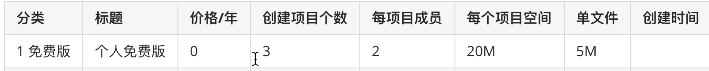

# day05

## 上节作业

- 朱鑫朝：首页展示、图片验证码
- 高楚凡：首页展示
- 母建军：
- 洪郭靖：
- 张容：短信签名审核、其他代码写了
- 马天昊：图片验证码报错

## 今日概要


- django写离线脚本
- 探讨业务
- 设计表结构
- 我的表结构
- 功能实现【任务】
  - 查看项目列表
  - 创建项目
  - 星标项目


## 今日详细

### 1.django离线脚本

```
django,框架
离线，非web运行时
脚本，一个或几个py文件
```

在某个py文件中对django项目做一些处理。

#### 示例1：使用离线脚本在用户表插入数据

```python
#!/usr/bin/env python
# -*- coding:utf-8 -*-
import os
import sys
import django

base_dir = os.path.dirname(os.path.dirname(os.path.abspath(__file__)))
sys.path.append(base_dir)
os.environ.setdefault("DJANGO_SETTINGS_MODULE", "s25.settings")
django.setup()  # os.environ['DJANGO_SETTINGS_MODULE']


from web import models
# 往数据库添加数据：链接数据库、操作、关闭链接
models.UserInfo.objects.create(username='陈硕', email='chengshuo@live.com', mobile_phone='13838383838', password='123123')
```

#### 示例2：数据库录入全国省市县

#### 示例3：朋友圈项目敏感字、词语

#### 示例4：saas免费版：1G、5项目、10人


### 2.探讨业务

#### 2.1 价格价格策略

| 分类     | 标题       | 价格/年 | 创建项目个数 | 每项目成员 | 每个项目空间 | 单文件 | 创建时间 |
| -------- | ---------- | ------- | ------------ | ---------- | ------------ | ------ | -------- |
| 1 免费版 | 个人免费版 | 0       | 3            | 2          | 20M          | 5M     |          |
| 2 收费版 | VIP        | 199     | 20           | 100        | 50G          | 500M   |          |
| 3 收费版 | SVIP       | 299     | 50           | 200        | 100G         | 1G     |          |
| 其他     |            |         |              |            |              |        |          |

注意：新用户注册拥有免费版的额度。

#### 2.2 用户

| 用户名 | 手机号     | 密码 |      |
| ------ | ---------- | ---- | ---- |
| 1 alex | 1383838383 | sb   |      |
| 2 王洋 | 1888888    | db   |      |
| 3 陈硕 | 166666666  | ddb  |      |

#### 2.3 交易

| ID   | 状态          | 用户 | 价格 | 实际支付 | 开始      | 结束      | 数量（年） | 订单 |      |
| ---- | ------------- | ---- | ---- | -------- | --------- | --------- | ---------- | ---- | ---- |
| 1    | 已支付        | 1    | 1    | 0        | 2020-3-18 | null      | 0          | UY12 |      |
| 2    | 已支付        | 2    | 1    | 0        | 2020-3-18 | null      | 0          | UY32 |      |
| 3    | 已支付        | 3    | 1    | 0        | 2020-3-18 | null      | 0          | UY42 |      |
| 4    | 已支付        | 2    | 2    | 199      | 2020-4-18 | 2021-4-18 | 1          | UY52 |      |
| 5    | 未支付/已支付 | 3    | 3    | 299*2    | 2020-5-18 | 2021-5-18 | 2          | UY62 |      |

`request.tracer = 交易对象`

#### 2.4 创建存储

基于腾讯对象存储COS存储数据。

#### 2.5 项目

| ID   | 项目名称 | 描述 | 颜色    | 星标  | 参与人数 | 创建者 | 已使用空间 |      |      |
| ---- | -------- | ---- | ------- | ----- | -------- | ------ | ---------- | ---- | ---- |
| 1    | CRM      | ..   | `#dddd` | true  | 5        | 3      | 5M         |      |      |
| 2    | 路飞学城 | ...  | `#uuu7` | false | 10       | 3      | 1G         |      |      |
| 3    | SAAS     | ...  | `#uu97` | false | 20       | 3      | 2G         |      |      |

#### 2.6 项目参与者

| ID   | 项目 | 用户 | 星标  |
| ---- | ---- | ---- | ----- |
| 1    | 1    | 1    | true  |
| 2    | 1    | 2    | False |
|      |      |      |       |


### 3.任务

#### 3.1 创建相应表结构

#### 3.2 离线脚本创建价格策略【免费版】



#### 3.3 用户注册【改】

- 之前：注册成功只是新建用户
- 现在：
  - 新建用户
  - 新建交易记录【免费版】

#### 3.4 添加项目

#### 3.5 展示项目

- 星标
- 我创建的
- 我参与的

#### 3.6 星标项目

注意：不要求样式


