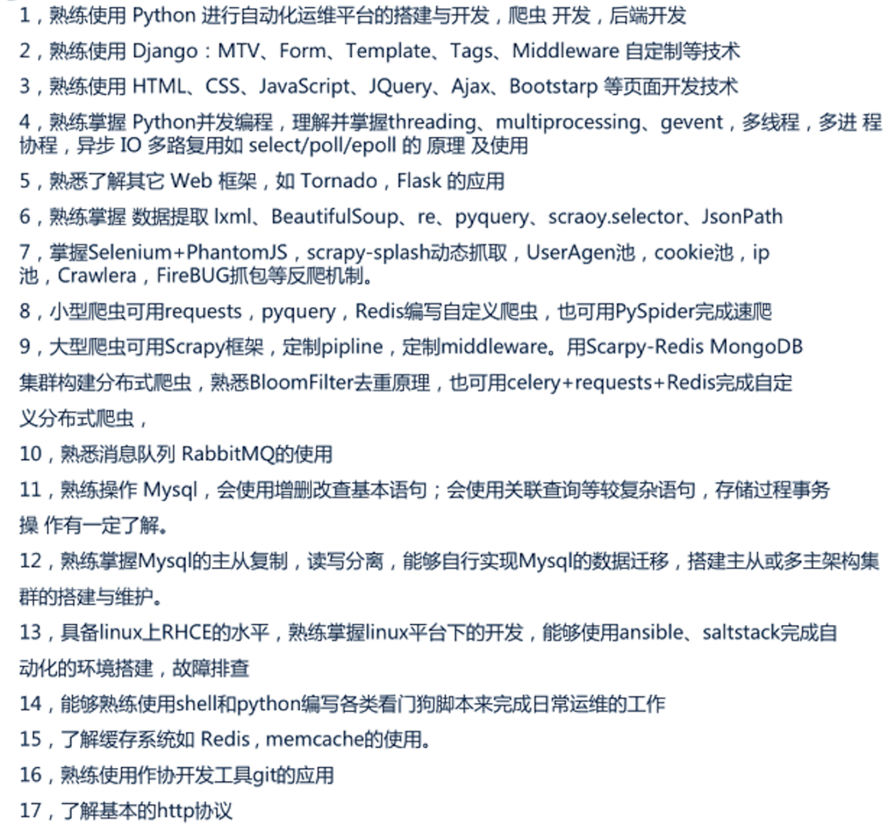
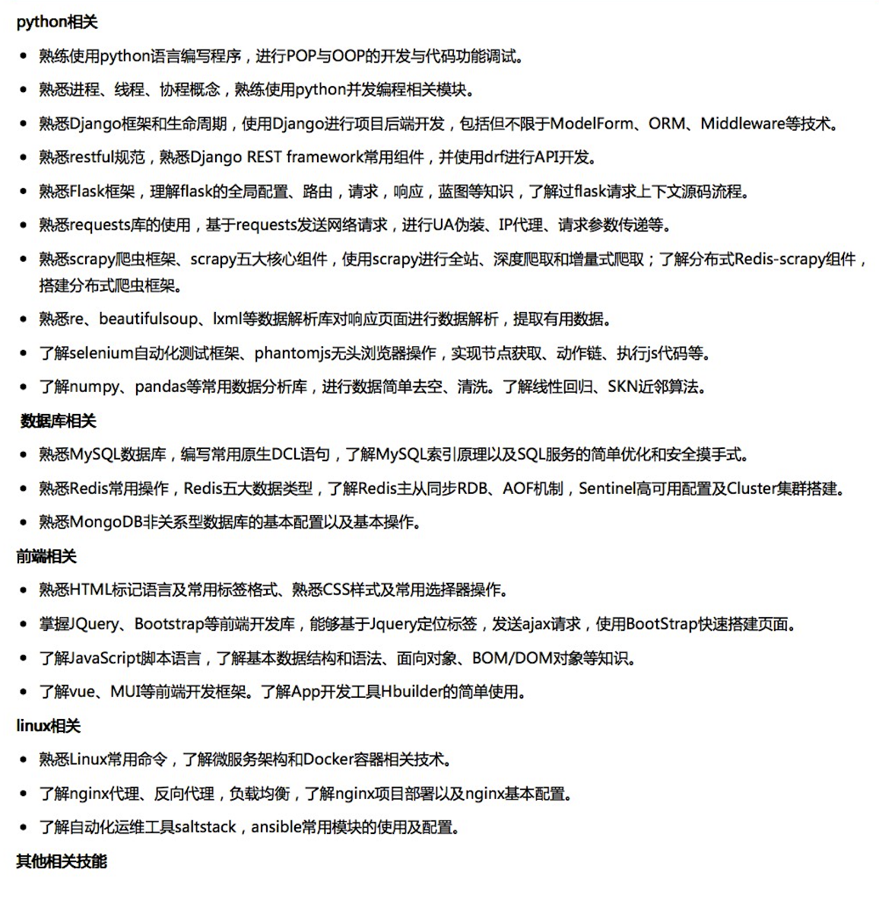

# 尼古拉斯赵四 - Python开发

性别：男     |     年龄：25岁     |     工作经验：3年

手机：188888888     |     邮箱：nb@gmail.com

大学：北京大学     |     学历：本科     |     专业：软件工程

个人博客：https://www.cnblogs.com/wupeiqi

> 提示：邮箱建议用gmail，谷歌的邮箱（翻墙）/  163 邮箱。
>
> 翻墙：https://freemycloud.xyz/

## 教育&工作经历

- xxxx年xx月加入XXXX，任Python开发工程师，负责从0到1进行XXX平台的搭建，包括商城、微信小程序、分销平台、管理后台等项目的开发。
- xxxx年xx月加入XXXX，先后在 系统开发、测试开发 部门任Python开发工程师，主导开发了 XXXX 项目，结合vue.js + drf 前后端分离实现的XXXX平台。除此之外，在测试开发部门协助开发 自动化测试脚本、自动化测试接口平台系统的开发。在职期间，学习了测试等相关知识点并且深入研究django rest frameowork源码，可以更高效的实现的前后端分离项目的开发和部署。
- xxxx年xx月加入XXXX，任 Python / 前端 开发工程师，先后负责开发 企业官方站点 / 活动专题页面 / 销售管理平台 / 业务信息爬虫 / 短信邮件等辅助工具等 项目开发和维护，除此之外，为提升开发效率以及代码组件的重用性，在职期间开发了一些权限、分页、中间件等组件。
- xxxx年9月入学xx大学，软件工程专业，上学期间自学python、java、前端开发等，在校期间在负责老师的带领下负责维护校园网、外包开发xx、xx、xx等系统。

> 提示：在一家公司至少要做1年； 大四出去实习1年、第一家1、2年、第二家公司。
>
> - 在3线城市，来北京；
> - 寻求更大的发展：公司业务发展慢，在技术上得不到成长。
> - 公司倒闭（疫情原因）
>
> 收集200份简历，找他们如何描述项目和公司。

## 技术栈

- 熟悉 Python、Golang、测试 等编程语言和技能。
- 研究Python C 底层源码了解内存管理、GC垃圾回收机制。
- 熟悉Python主流django、flask等框架，并且深入研究django rest framework源码。
- 研究Python3推荐异步编程asyncio，并应用在爬虫开发、高性能框架Fastapi的开发中。
- 为学习更多专业技能，深入剖析python中扩展性极佳的Flask源码及底层实现。
- 熟悉网络模型以及部分网络通信原理，熟悉HTTP/HTTPS协议，了解TCP/IP协议，具备网络编程能力。
- 熟悉 前端、JavaScript、gojs、vue.js、COS、JSONP、websocket、jwt等技术。
- 熟悉 MySQL、Redis、Memcached、Mongo、SQLServer等数据库。
- 熟练掌握软件功能、自动化、性能测试的方法、基础理论、项目流程，具备全链路测试流程设计能力。
- 熟悉unittest、pytest、selenium等工具，能够独立完成基于python的接口/UI自动化测试框架设计及测试。
-   熟练使用 git/svn，禅道/QC 等企业常用工具。  
- 熟练使用Linux，熟悉shell，能通过python和shell,进行Linux脚本开发。
- 了解微服务设计模式，熟悉docker技术。
- 学习能力很强，热爱技术，喜欢钻研和分享技术，独立搭建和维护，个人技术分享站点。

## 项目经验

### 1. xx学城/xxxx商城

时间：xxxx年     |     公司：xxxxxxx

xxx学城是⼀个基于Python和Django开发的平台，平台的⽬标致力于提升在线学习的完课率，目前在线教育领域都是在线看视频的方式，xx学城从开创最新“一对⼀”模式辅导，实现导师每天跟进并定期考核制度，除次之外执行学、练、改、管、测五位⼀体的教学⽅法以及奖惩措施，以此促进完成学成率。

#### 功能

- 路飞学城共包含三⼤大部分，即：导师平台、管理理平台、在线平台（APP），导师后台主要对导师进⾏行行跟进和考核监管，对导师采⽤用扣“奖金”措施来督促导师跟进率。管理后台主要⽤用于运操作管理，可以对于深科技和咨询信息的录⼊和编辑，除此之外还可以对课程上传管理以及学⽣休学和提现管理。

- 在线平台部分主要为vue和app提供接口功能，接口基于django rest framewok框架的基础搭建，利用其内置组件和⾃定义扩展实现⽤户认证和访问频率限制，根据依赖django-redis组件实现对缓存的操作，将⽤户访问记录放⼊入redis实现认证操作。

- 在线业务主线主要将课程分为“学位课”和“专题课”，基于django contenttype组件实现课程多价格策略，为了减轻数据库压力将临时购买信息放⼊redis以便便操作，购物流程包含 ⻉里、优惠券、⽀付宝联合支付。在线通知使⽤用阿⾥短信接⼝和“微信服务号”模板消息对购买、提交作业、咨询等信息的提醒。最后整合第三⽅美洽、CC视频、保利威视在线咨询以及在线视频播放的功能。

#### 技术栈

django rest framework / restful api / vue.js / redis / celery / contenttypes / 前后端分离 

> 项目名称：不要出现 在线学习平台 字眼；200份简历看他们写的都是什么项目名。
>
> 项目功能：业务流程 + 穿插技术点

### 2.SELL系统

时间：xxxx年     |     公司：xxxxxxx

随着公司日益发展以及市场和销售人员日益扩展，完成销售流程的规范化以及标准化并在SELL系统对员工进行行监管，项目主要用于为公司销售⼈员、运营、售后等⼈员提供公共的处理平台，在公司发展的过程中以便便实现信息的管理， 实现公司的信息化流程。为销售人员工提供客户关系的管理，对于新客户信息的录入和等级。定期对客户进行回访和跟进，从而增加用户粘性，便便于之后的转化。运营和渠道通过关系以及人脉获取有效客户，可以进⾏行录⼊和分配。

#### 功能

- 为销售、渠道人员以及管理理者实现⼀个规范化的平台，为了防止销售之间存在的"恶意"或"非恶意"竞争,避免有人进⾏抢单导致部门不和谐因素。

- 实⾏公户和私户管理理,公户主要存放未指定销售的客户信息,公户可有两种⽅式进⾏分配到私户,第⼀种是销售⾃己申请,第⼆种是主管进⾏行行主动分配.

- 私户主要存放⾃己的客户,在申请客户时基于数据库事务/锁保证数据安全,从⽽安全将客户申请到⾃己的账户.批量量操作时候action模糊搜索等操作。

- 项⽬中继承了⼀个独立的权限组件,权限组件主要⽤于为让各种⻆色的客户仅能访问⾃己拥有的功能,⽆无权越级访问,权限基本使用流程涵盖了了一下知识点,如:⽤户认证,将权限和菜单信息放⼊session/用户访问,在中间件中进行权限校验(⽩名单)/动态菜单,使⽤用 inclusion_tag 定制菜单的显示.

#### 技术栈

RBAC / django / inclusion_tag / 中间件 /  MySQL  / 权限组件 / Stark组件 / django admin  / mdeditor

### 3. 发布系统 

时间：xxxx年      |     公司：xxxxxxxx

系统主要用于实现减少人工干预及成本，基于python的框架和gitlab实现发布任务的处理。项目中对于密钥进行了统一管理，避免权限冲突。为了方面项目中对于项目和服务器之间的管理和隔离，给项目分配指定服务器，分配之后再通过 "全量发布" 和 “灰度发布”进行更小粒度的管控，通过django channels组件使项目支持websocket，以实现 发布、回滚实时数据和日志的展示，另外通过 gojs 动态绘制发布任务步骤的流程图，支持发布和同时多审阅。

#### 功能

-  摒弃原本地ssh文件的方式，使用StringIO实现对于密钥文本处理。 
- 为项目创建多环境管理，并根据环境去做发布任务的配置。 
-  对于不同发布任务，通过配置remote path 进行远程项目路径的管理。
-  直接使用paramiko进行远程服务器的操作，避免对于ansible、saltstack等工具的依赖。
-  通过 with上下文管理和定制Transport对象 实现同用 SSHProxy组件，以提升远程服务器操作性能。
-  基于gitpython模块封装常见远程仓库操作，并结合ModelForm Hook 实现选择版本、分支、commit等，避免用户在页面重复输入导致发布过程异常。
-  引入前端组件GoJS，内部基于canvas实现动态绘制流程图。
-  研究 Websocket 实现原理，并基于 django-channels 组件实现日志、图表实时动态展示(channels layer 实现群组概念)。

#### 技术栈

django / MySQL / Paramiko / SaltStack / Gojs / websocket / channel-layers / redis / celery / 上下文管理 / git

> 提示：技术点，应用在项目哪里，实现了什么功能

### 4.CMDB平台

时间：xxxx年      |     公司：xxxxxxxx

cmdb平台实现资产信息化管理，基于程序实现硬件资产信息的自动化采集并集成自动装机和资源池管理。项目主要由资产采集中控机、rest API、资产管控平台三部分组成，使用puppet report和saltstack等工具定期进行资产信息的收集并进行结构化处理，通过API的形式将数据变更处理并进行持久化。

#### 功能

- 资产采集，支持puppet report、saltstack、paramiko、ansible 等多种采集资产扩展。参考django中间件的原理、开发封闭原则、工厂模式实现可插拔式的插件，在资产采集部分还继承了可扩展的功能，让定制插件时可以更加方便。
- 基于反射、异常、日志、约束、工厂和单例模式实现采集模式的快速切换及debug环境的配置.
- drf实现 rest api接口搭建并为第三方监控、财务等系统提供数据支持。
- 扩展并自定义django app组件 rbac / stark / mdeditor 等工具实现平台快速搭建。

#### 技术栈

django / drf / MySQL / puppet&saltstack&paramiko / 线程池 / 设计模式 / django组件 

### 5.微信小程序

时间：xxxx年      |     公司：xxxxxxxx

微信小程序平台开发的的拍卖系统，项目主要分为圈子和拍卖两大部分业务，通过圈子进行信息交互和动态的管理提升用户粘性，结合企业和大V合作进行专项拍卖和宣传。系统包含了小程序、API、运营中心三个子系统组成。

#### 功能

- 腾讯COS对象存储、微信小程序MAP 异步机制 、闭包进行动态管理及用户交互。
- 圈子和用户互动及 websocket 实现实时数据响应，实现发布、收藏、赞等一些列行为。
- 基于 Nest 和 Hook 实现对 拍卖专场、拍品、保证金等数据结构化处理并利用Python语法结构特性对后台数据的处理进行优化。
- 结合 认证、权限、JWT、腾讯短信API、redis实现用户认证和过期。
- 使用 celery + redis 实现专场状态、拍品 和 订单处理。 

#### 技术栈

django / drf / MySQL / 微信小程序 / jwt / 异步编程 / celery / redis / 腾讯对象存储

## 自我评价

