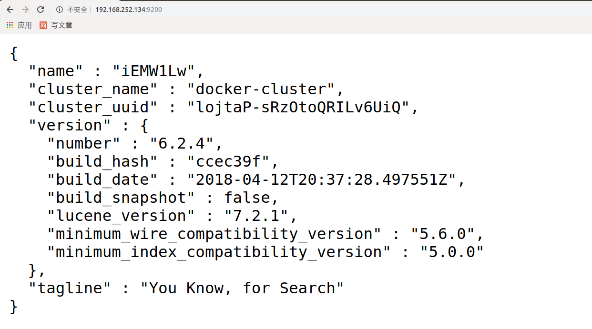

# Elasticsearch

开源的 [Elasticsearch ](https://www.elastic.co/)是目前全文搜索引擎的首选。

它可以快速地储存、搜索和分析海量数据。维基百科、Stack Overflow[爆栈]、Github 都采用它。

Elasticsearch 的底层是开源库 [Lucene](https://lucene.apache.org/)。但是，你没法直接用 Lucene，必须自己写代码去调用它的接口。Elastic 是 Lucene 的封装，提供了 REST API 的操作接口，开箱即用。

Elasticsearch 是用Java实现的。

搜索引擎在对数据构建索引时，需要进行分词处理。分词是指将一句话拆解成多个单字或词，这些字或词便是这句话的关键词。如

```python
我是中国人。
```

'我'、'是'、'中'、'国'、'人'、'中国'等都可以是这句话的关键词。

Elasticsearch 不支持对中文进行分词建立索引，需要配合扩展ik分词器[**elasticsearch-ik**]来实现中文分词处理。

扩展：https://www.cnblogs.com/leeSmall/p/9189078.html

## docker安装Elasticsearch和ik分词器

```
sudo docker pull bachue/elasticsearch-ik:2.2-1.8
```

注意： 容器较大，所以可以选择配置国内加速器

国内的镜像加速器选项较多，如：阿里云，DaoCloud 等。这里我们使用阿里云的[docker加速器](https://cr.console.aliyun.com/)。


点击“镜像加速器”


```bash
sudo mkdir -p /etc/docker
sudo tee /etc/docker/daemon.json <<-'EOF'
{
  "registry-mirrors": ["https://2xdmrl8d.mirror.aliyuncs.com"]
}
EOF
sudo systemctl daemon-reload
sudo systemctl restart docker
```

也可以使用笔记里面的素材目录下的镜像文件加载到docker中

```bash
sudo docker load -i '/home/moluo/Desktop/elasticsearch-ik.tar.gz'
sudo docker image ls
```


 拉取了镜像以后，直接创建容器

```bash
sudo docker run -itd --network=host -e ES_JAVA_OPTS="-Xms256m -Xmx256m" --name=esik bachue/elasticsearch-ik:2.2-1.8
```

上面容器在创建并运行9秒以后会自动关闭，可以通过以下命令查看容器运行的日志信息：

```bash
sudo docker logs --since 30m esik  # 查看最近30分钟的日志

sudo docker logs -t --since="2020-01-01T00:00:00" <容器名称/容器ID> # 查看某时间之后的日志

sudo docker logs -t --since="开始时间" --until "结束时间" <容器名称/容器ID> # 查看某时间段日志
```

经过查看可以发现报错信息如下：

```bash
ERROR: [1] bootstrap checks failed
[1]: max virtual memory areas vm.max_map_count [65530] is too low, increase to at least [262144]
```

`vm.max_map_count`参数，是允许一个进程在内容中拥有的最大数量（VMA：虚拟内存地址， 一个连续的虚拟地址空间），当进程占用内存超过max_map_count时， 直接GG。所以错误提示：elasticsearch用户拥有的内存权限太小，至少需要262144。

max_map_count配置文件写在系统中的`/proc/sys/vm`文件中，但是我们不需要进入docker容器中配置，因为docker使用宿主机的/proc/sys作为只读路径之一。因此我们在Ubuntu系统下设置一下命令即可：

```bash
sudo sysctl -w vm.max_map_count=262144 # 本次服务器，的mvm = 262144，如果服务器关闭了，需要重新设置
```

删除上面的容器，继续创建`elasticsearch`容器：

```bash
sudo docker rm esik
sudo docker run -itd --network=host -e ES_JAVA_OPTS="-Xms256m -Xmx256m" --name=esik bachue/elasticsearch-ik:2.2-1.8
```

完成上面操作以后，我们接下来，直接访问浏览器，输入`IP:9200`，出现以下内容则表示elasticsearch安装成功：



接下来，我们可以使用postman测试下使用能对文本进行正常分词。

```
GET    /_analyze?pretty

{
  "text": "老男孩python"
}
```

出现内容如下则表示分词器正常：

```json
{
    "tokens": [
        {
            "token": "老",
            "start_offset": 0,
            "end_offset": 1,
            "type": "<IDEOGRAPHIC>",
            "position": 0
        },
        {
            "token": "男",
            "start_offset": 1,
            "end_offset": 2,
            "type": "<IDEOGRAPHIC>",
            "position": 1
        },
        {
            "token": "孩",
            "start_offset": 2,
            "end_offset": 3,
            "type": "<IDEOGRAPHIC>",
            "position": 2
        },
        {
            "token": "python",
            "start_offset": 3,
            "end_offset": 9,
            "type": "<ALPHANUM>",
            "position": 3
        }
    ]
}
```

接下来，我们快速的学习下使用分词器。

## 分词器的基本使用

上面的分词器测试中，我们使用了postman发起了如下请求：

```bash
GET    /_analyze?pretty

{
  "text": "老男孩python"
}
```

这个请求得到的分词结果其实很傻瓜。因为这样会自动把每一个文字都进行了分割。

所以我们使用postman发起一个新的请求：

```
GET    /_analyze?pretty

{
  "analyzer": "ik_smart",
  "text": "老男孩python"
}
```

效果：

```json
{
    "tokens": [
        {
            "token": "老",
            "start_offset": 0,
            "end_offset": 1,
            "type": "CN_CHAR",
            "position": 0
        },
        {
            "token": "男孩",
            "start_offset": 1,
            "end_offset": 3,
            "type": "CN_WORD",
            "position": 1
        },
        {
            "token": "python",
            "start_offset": 3,
            "end_offset": 9,
            "type": "ENGLISH",
            "position": 2
        }
    ]
}
```

`analyzer`表示分词器 ，我们可以理解为分词的算法或者分析器。默认情况下，Elasticsearch内置了很多分词器。

以下两种举例，又兴趣可以访问[文章](https://blog.csdn.net/ZYC88888/article/details/83620572)来深入了解。

```
1. standard 标准分词器，单字切分。上面我们测试分词器时候没有声明analyzer参数，则默认调用标准分词器。
2. simple 简单分词器，按非字母字符来分割文本信息
```

综合上面的分词器，其实对于中文都不友好，所以我们前面安装的ik分词器就有了用武之地。

ik分词器在Elasticsearch内置分词器的基础上，新增了2种分词器。

```bash
ik_max_word：会将文本做最细粒度的拆分；尽可能多的拆分出词语

ik_smart：会做最粗粒度的拆分；已被分出的词语将不会再次被其它词语占有
```

我们使用下ik分词器，在postman中发起请求：

```bash
GET    /_analyze?pretty

{
  "analyzer": "ik_max_word",
  "text": "你好，老男孩python"
}
```

效果：

```json
{
    "tokens": [
        {
            "token": "你好",
            "start_offset": 0,
            "end_offset": 2,
            "type": "CN_WORD",
            "position": 0
        },
        {
            "token": "老",
            "start_offset": 3,
            "end_offset": 4,
            "type": "CN_CHAR",
            "position": 1
        },
        {
            "token": "男孩",
            "start_offset": 4,
            "end_offset": 6,
            "type": "CN_WORD",
            "position": 2
        },
        {
            "token": "python",
            "start_offset": 6,
            "end_offset": 12,
            "type": "ENGLISH",
            "position": 3
        }
    ]
}
```


### 使用haystack对接Elasticsearch

#### django-haystack 模块

专门给 django 提供搜索功能的。 django-haystack 提供了一个统一的API搜索接口，底层可以根据自己需求更换搜索引擎( Solr, Elasticsearch, Whoosh, Xapian 等等)，类似于 django 中的 ORM 插件，提供了一个操作数据库接口，但是底层具体使用哪个数据库是可以在配置文件中进行设置的。

在django中可以通过使用haystack来调用Elasticsearch搜索引擎。而在drf框架中，也有一个对应的drf-haystack模块，是`django-haystack`进行封装处理的。

1）安装模块

```python
pip install drf-haystack          # django框架安装命令： pip install django-haystack
pip install elasticsearch         # 版本有问题6.0.0，5.0.0，7.5.1
```


2）注册应用，settings/dev.py，代码：

```python
INSTALLED_APPS = [
    ...
    'haystack',
    ...
]
```


3）相关配置

在配置文件中配置haystack使用的搜索引擎后端，settings/dev.py，代码：

```python
# Haystack
HAYSTACK_CONNECTIONS = {
    'default': {
        'ENGINE': 'haystack.backends.elasticsearch_backend.ElasticsearchSearchEngine',
        # elasticsearch运行的服务器ip地址，端口号默认为9200
        'URL': 'http://192.168.252.168:9200/',
        # elasticsearch建立的索引库的名称，一般使用项目名作为索引库
        'INDEX_NAME': 'renran',
    },
}

# 设置在Django运行时，如果有数据产生变化(添加、修改、删除)，
# haystack会自动让Elasticsearch实时生成新数据的索引
HAYSTACK_SIGNAL_PROCESSOR = 'haystack.signals.RealtimeSignalProcessor'
```


4）创建索引类

通过创建索引类，来指明让搜索引擎对哪些字段建立索引，也就是可以通过哪些字段的关键字来检索数据。

在article子应用下创建索引类文件search_indexes.py，代码：

```python
from haystack import indexes
from .models import Article

class ArticleIndex(indexes.SearchIndex, indexes.Indexable):
    """
    文章索引数据模型类
    """
    text = indexes.CharField(document=True, use_template=True)
    id = indexes.IntegerField(model_attr='id')
    title = indexes.CharField(model_attr='title')
    content = indexes.CharField(model_attr='content')

    def get_model(self):
        """返回建立索引的模型类"""
        return Article

    def index_queryset(self, using=None):
        """返回要建立索引的数据查询集"""
        return self.get_model().objects.filter(is_public=True)
```


在ArticleIndex建立的字段，都可以借助haystack由elasticsearch搜索引擎查询。

其中text字段我们声明为document=True，表名该字段是主要进行关键字查询的字段， 该字段的索引值可以由多个数据库模型类字段组成，具体由哪些模型类字段组成，我们用use_template=True表示后续通过模板来指明。其他字段都是通过model_attr选项指明引用数据库模型类的特定字段。

在REST framework中，索引类的字段会作为查询结果返回数据的来源。

6）在templates目录中创建text字段使用的模板文件

配置模板目录，settings/dev.py，代码：

```python
# 模板引擎
TEMPLATES = [
    {
        'BACKEND': 'django.template.backends.django.DjangoTemplates',
        'DIRS': [
            os.path.join(BASE_DIR, "templates"),
        ],
        'APP_DIRS': True,
        'OPTIONS': {
            'context_processors': [
                'django.template.context_processors.debug',
                'django.template.context_processors.request',
                'django.contrib.auth.context_processors.auth',
                'django.contrib.messages.context_processors.messages',
            ],
        },
    },
]
```


接着，在templates/search/indexes/article/article_text.txt文件中定义

```python
{{ object.title }}
{{ object.content }}
{{ object.id }}
```

此模板指明当将关键词通过text参数名传递时，可以通过article的title、content、id来进行关键字索引查询。

7）手动重建索引

```python
python manage.py rebuild_index
```

8）创建序列化器

在article/serializers.py中创建haystack序列化器

```python
from drf_haystack.serializers import HaystackSerializer

class ArticleIndexSerializer(HaystackSerializer):
    """
    文章索引结果数据序列化器
    """
    class Meta:
        index_classes = [ArticleIndex]
        fields = ('text', 'id', 'title', 'content')
```

**注意fields属性的字段名与ArticleIndex类的字段对应。**

9）创建视图

在article/views.py中创建视图

```python
from drf_haystack.viewsets import HaystackViewSet

class ArticleSearchViewSet(HaystackViewSet):
    """
    文章搜索
    """
    index_models = [Article]

    serializer_class = ArticleIndexSerializer
```

10）定义路由

通过REST framework的router来定义路由，article/urls.py，代码：

```python
from django.urls import path,re_path
from . import views
# 。。。。

from rest_framework.routers import SimpleRouter
router = SimpleRouter()
router.register('search', views.ArticleSearchViewSet, base_name='article_search')
router.register("", views.ArticleAPIView)
urlpatterns += router.urls
```

11）测试

我们可以访问进行测试


给视图添加分页器，进行搜索内容分页显示

article/paginations.py，代码：

```python
from rest_framework.pagination import PageNumberPagination
class ArticleSearchPageNumberPagination(PageNumberPagination):
    """文章搜索分页器"""
    page_size = 2
    max_page_size = 20
    page_size_query_param = "size"
    page_query_param = "page"
```

article/views.py，代码：

```python
from drf_haystack.viewsets import HaystackViewSet
from .serializers import ArticleIndexSerializer
from .paginations import ArticleSearchPageNumberPagination
class ArticleSearchViewSet(HaystackViewSet):
    """
    文章搜索
    """
    index_models = [Article]
    serializer_class = ArticleIndexSerializer
    pagination_class = ArticleSearchPageNumberPagination
```

客户端提供搜索功能，在头部子组件中完善输入搜索内容以后的点击跳转页面效果，

```vue
<template>
  <div class="header">
    <nav class="navbar">
      <div class="width-limit">
        <!-- 左上方 Logo -->
        <a class="logo" href="/"></a>

        <!-- 右上角 -->
        <!-- 未登录显示登录/注册/写文章 -->
        <router-link class="btn write-btn" target="_blank" to="/writer">写文章</router-link>
        <router-link class="btn sign-up" id="sign_up" to="/user/register">注册</router-link>
        <router-link class="btn log-in" id="sign_in" to="/user/login">登录</router-link>
        <div class="container">
          <div class="collapse navbar-collapse" id="menu">
            <ul class="nav navbar-nav">
              <li class="tab active">
                <a href="/">
                  
                  <span class="menu-text">首页</span>
                </a>
              </li>
              <li class="search">
                <form>
                  <input type="text" v-model="text" autocomplete="off" placeholder="搜索" class="search-input">
                  <a class="search-btn" href="" @click.stop.prevent="to_search"></a>
                </form>
              </li>
            </ul>
          </div>
        </div>

        <!-- 如果用户登录，显示下拉菜单 -->
      </div>
    </nav>
  </div>
</template>

<script>
    export default {
        name: "Header",
        data(){
            return {
                text:"",
            }
        },
        methods:{
            to_search(){
                // 跳转到搜索页面
                if(this.text.length<1){
                    return;
                }
                this.$router.push(`/search?text=${this.text}`);
            }
        }
    }
</script>
```

在前端创建搜索页面的组件，代码如下：

```vue
<template>
  <div class="container search">
    <div class="row">
      <div class="aside">
        <div>
          <ul class="menu">
            <li class="active"><a><div class="setting-icon"><i class="iconfont ic-search-note"></i></div> <span>文章</span></a></li>
            <li class=""><a><div class="setting-icon"><i class="iconfont ic-search-user"></i></div> <span>用户</span></a></li>
            <li class=""><a><div class="setting-icon"><i class="iconfont ic-search-collection"></i></div> <span>专题</span></a></li>
            <li class=""><a><div class="setting-icon"><i class="iconfont ic-search-notebook"></i></div> <span>文集</span></a></li>
          </ul>
        </div>
        <div class="search-recent">
          <div class="search-recent-header clearfix">
            <span>最近搜索</span> <a>清空</a></div>
          <ul class="search-recent-item-wrap">
            <li><a href="" target="_blank"><i class="iconfont ic-search-history"></i> <span>dd</span> <i class="iconfont ic-unfollow"></i></a></li>
            <li><a href="" target="_blank"><i class="iconfont ic-search-history"></i> <span>2020</span> <i class="iconfont ic-unfollow"></i></a></li>
          </ul>
        </div>
      </div>
      <div class="col-xs-16 col-xs-offset-8 main">
        <div class="search-content">
          <div class="sort-type">
            <a class="active">综合排序 · </a>
            <a class="">热门文章 ·</a>
            <a class="">最新发布 ·</a>
            <a class="">最新评论</a>
            <span>&nbsp;&nbsp;|&nbsp;</span>
            <div class="v-select-wrap">
              <div class="v-select-submit-wrap"><svg viewBox="0 0 10 6" aria-hidden="true"><path d="M8.716.217L5.002 4 1.285.218C.99-.072.514-.072.22.218c-.294.29-.294.76 0 1.052l4.25 4.512c.292.29.77.29 1.063 0L9.78 1.27c.293-.29.293-.76 0-1.052-.295-.29-.77-.29-1.063 0z"></path></svg>
              </div>
            </div>
          </div>
          <div class="result">16743 个结果</div>
          <ul class="note-list">
            <li>
              <div class="content">
                <div class="author"><a href="" target="_blank" class="avatar"></a> <div class="info"><a href="" class="nickname">DD的外婆</a><span class="time">2 年前 </span>
                </div>
              </div>
              <a href="" target="_blank" class="title">成长启示录（一）尊重是人类的本能需要</a>
              <p class="abstract">…… 怎么啦？我重复了上述情形，没在意<em class="search-result-highlight">DD</em>的表情。而当我低头看到<em class="search-result-highlight">DD</em>时，我的心快要碎了，只见他憋着嘴，两眼通红，委屈……得要哭的样子。这时，我才意识到我们的言行让他产生了误解。于是，我忙说：<em class="search-result-highlight">DD</em>啊，我们大家都拉臭粑粑的，没关系，没关系。这样，他才恢复了情绪。&#65279;    <em class="search-result-highlight">DD</em>八个月大的一天，我和<em class="search-result-highlight">DD</em>爸爸正在陪他玩，玩得正嗨……</p>
                <div class="meta">
                  <a href="" target="_blank"><i class="iconfont ic-list-read"></i> 246</a>
                  <a href="" target="_blank"><i class="iconfont ic-list-comments"></i> 9</a>
                  <span><i class="iconfont ic-list-like"></i> 3</span>
                  <span><i class="iconfont ic-list-money"></i> 3</span>
                </div>
              </div>
            </li>
          </ul>
          <div>
            <ul class="pagination">
              <li><a href="" class="active">1</a></li>
              <li><a>2</a></li>
              <li><a>3</a></li>
              <li><a>4</a></li>
              <li><a>下一页</a></li>
            </ul>
          </div>
        </div>
      </div>
    </div>
  </div>
</template>

<script>
    export default {
        name: "Search"
    }
</script>
<style scoped>
    /* 这里的css在笔记的素材中找到Search.vue复制进去 */
</style>
```

路由，代码：

```javascript
import Vue from 'vue'
import Router from 'vue-router'

Vue.use(Router);

// ....

import Search from "@/components/Search"


export default new Router({
  mode: "history",
  routes: [
    /// ...
      {
       name:"Search",
       path:"/search",
       component: Search,
     },
  ]
})

```


在搜索页面加载完成以后，对api数据进行搜索请求，因为客户端需要更多的返回搜索字段，所以我们重新调整api视图接口，返回用户信息和点赞等记录数值。

模型，代码，article/models.py，代码：

```python
class Article(BaseModel):
    """文章模型"""
    title = models.CharField(max_length=200, verbose_name="文章标题")
    content = models.TextField(null=True, blank=True, verbose_name="文章内容")
    user = models.ForeignKey(User, on_delete=models.DO_NOTHING, verbose_name="用户")
    collection = models.ForeignKey(ArticleCollection, on_delete=models.CASCADE, verbose_name="文集")
    pub_date = models.DateTimeField(null=True, default=None, verbose_name="发布时间")
    access_pwd = models.CharField(max_length=15,null=True, blank=True, verbose_name="访问密码")
    read_count = models.IntegerField(default=0, null=True, blank=True, verbose_name="阅读量")
    like_count = models.IntegerField(default=0, null=True, blank=True, verbose_name="点赞量")
    collect_count = models.IntegerField(default=0, null=True, blank=True, verbose_name="收藏量")
    comment_count = models.IntegerField(default=0, null=True, blank=True, verbose_name="评论量")
    reward_count = models.IntegerField(default=0, null=True, blank=True, verbose_name="赞赏量")
    is_public = models.BooleanField(default=False, verbose_name="是否公开")
    save_id = models.IntegerField(default=0, null=True, blank=True, verbose_name="编辑历史ID")
    class Meta:
        db_table = "rr_article"
        verbose_name = "文章"
        verbose_name_plural = verbose_name

    @property
    def user_nickname(self):
        return self.user.nickname

    @property
    def user_avatar(self):
        try:
            image_url = self.user.avatar.url
            return image_url
        except:
            return ""
```

索引类代码，article/search_indexes.py，代码：

```python
class ArticleIndex(indexes.SearchIndex, indexes.Indexable):
    """
    文章索引数据模型类
    """
    id = indexes.IntegerField(model_attr='id')
    title = indexes.CharField(model_attr='title')
    content = indexes.CharField(model_attr='content')
    read_count = indexes.IntegerField(model_attr='read_count')
    like_count = indexes.IntegerField(model_attr='like_count')
    comment_count = indexes.IntegerField(model_attr='comment_count')
    reward_count = indexes.IntegerField(model_attr='reward_count')
    author_id = indexes.IntegerField(model_attr="user_id")
    author_name = indexes.CharField(model_attr="user_nickname")
    author_avatar = indexes.CharField(model_attr="user_avatar")
    # 文档字段，这个字段不属于模型的，可以通过这个索引字段，到数据库中进行多个字段的搜索匹配
    text = indexes.CharField(document=True, use_template=True)

    def get_model(self):
        """返回建立索引的模型类"""
        return Article

    def index_queryset(self, using=None):
        """返回要建立索引的数据查询集"""
        return self.get_model().objects.filter(is_public=True)

```


序列化器，增加多个返回字段，article/serializers.py，代码：

```python
class ArticleIndexSerializer(HaystackSerializer):
    """
    文章索引结果数据序列化器
    """
    class Meta:
        index_classes = [ArticleIndex]
        fields = ('id', 'title', 'content', "author_id", 'author_name', "author_avatar", 'read_count','like_count','comment_count','reward_count')
```

客户端请求搜索，代码：

```vue
<template>
  <div class="container search">
    <Header/>
    <div class="row">
      <div class="aside">
        <div>
          <ul class="menu">
            <li class="active"><a><div class="setting-icon"><i class="iconfont ic-search-note"></i></div> <span>文章</span></a></li>
            <li class=""><a><div class="setting-icon"><i class="iconfont ic-search-user"></i></div> <span>用户</span></a></li>
            <li class=""><a><div class="setting-icon"><i class="iconfont ic-search-collection"></i></div> <span>专题</span></a></li>
            <li class=""><a><div class="setting-icon"><i class="iconfont ic-search-notebook"></i></div> <span>文集</span></a></li>
          </ul>
        </div>
        <div class="search-recent">
          <div class="search-recent-header clearfix">
            <span>最近搜索</span> <a>清空</a></div>
          <ul class="search-recent-item-wrap">
            <li><a href="" target="_blank"><i class="iconfont ic-search-history"></i> <span>dd</span> <i class="iconfont ic-unfollow"></i></a></li>
            <li><a href="" target="_blank"><i class="iconfont ic-search-history"></i> <span>2020</span> <i class="iconfont ic-unfollow"></i></a></li>
          </ul>
        </div>
      </div>
      <div class="col-xs-16 col-xs-offset-8 main">
        <div class="search-content">
          <div class="sort-type">
            <a class="active">综合排序 · </a>
            <a class="">热门文章 ·</a>
            <a class="">最新发布 ·</a>
            <a class="">最新评论</a>
            <span>&nbsp;&nbsp;|&nbsp;</span>
            <div class="v-select-wrap">
              <div class="v-select-submit-wrap"><svg viewBox="0 0 10 6" aria-hidden="true"><path d="M8.716.217L5.002 4 1.285.218C.99-.072.514-.072.22.218c-.294.29-.294.76 0 1.052l4.25 4.512c.292.29.77.29 1.063 0L9.78 1.27c.293-.29.293-.76 0-1.052-.295-.29-.77-.29-1.063 0z"></path></svg>
              </div>
            </div>
          </div>
          <div class="result">{{search_count}} 个结果</div>
          <ul class="note-list">
            <li v-for="article in search_result">
              <div class="content">
                <div class="author"><a href="" target="_blank" class="avatar"></a> <div class="info"><a href="" class="nickname">{{article.author_name}}</a><span class="time">2 年前 </span>
                </div>
              </div>
              <a href="" target="_blank" class="title">{{article.title}}</a>
              <p class="abstract">…… {{article.content}}……</p>
                <div class="meta">
                  <a href="" target="_blank"><i class="iconfont ic-list-read"></i> {{article.read_count}}</a>
                  <a href="" target="_blank"><i class="iconfont ic-list-comments"></i> {{article.comment_count}}</a>
                  <span><i class="iconfont ic-list-like"></i> {{article.like_count}}</span>
                  <span v-if="article.reward_count>=1"><i class="iconfont ic-list-money"></i> {{article.reward_count}}</span>
                </div>
              </div>
            </li>
          </ul>
          <div>
            <ul class="pagination">
              <li><a href="" class="active">1</a></li>
              <li><a>2</a></li>
              <li><a>3</a></li>
              <li><a>4</a></li>
              <li><a>下一页</a></li>
            </ul>
          </div>
        </div>
      </div>
    </div>
  </div>
</template>

<script>
    import Header from "./common/Header"
    export default {
        name: "Search",
        data(){
            return {
                text: "",
                search_result:[], // 搜索结果结果
                search_count:0,  // 搜索结果数量
            }
        },
        components:{
            Header,
        },
        created() {
            this.text = this.$route.query.text;
            this.get_search_result();
        },
        methods:{
            get_search_result(){
                this.$axios.get(`${this.$settings.Host}/article/search/`,{
                    params:{
                        text: this.text,
                    }
                }).then(response=>{
                    this.search_result = response.data.results;
                    this.search_count = response.data.count;
                })
            }
        }
    }
</script>
```


### 高亮显示搜索结果中的搜素关键词

```vue
<template>
  <div class="container search">
    <Header/>
    <div class="row">
      <div class="aside">
        <div>
          <ul class="menu">
            <li class="active"><a><div class="setting-icon"><i class="iconfont ic-search-note"></i></div> <span>文章</span></a></li>
            <li class=""><a><div class="setting-icon"><i class="iconfont ic-search-user"></i></div> <span>用户</span></a></li>
            <li class=""><a><div class="setting-icon"><i class="iconfont ic-search-collection"></i></div> <span>专题</span></a></li>
            <li class=""><a><div class="setting-icon"><i class="iconfont ic-search-notebook"></i></div> <span>文集</span></a></li>
          </ul>
        </div>
        <div class="search-recent">
          <div class="search-recent-header clearfix">
            <span>最近搜索</span> <a>清空</a></div>
          <ul class="search-recent-item-wrap">
            <li><a href="" target="_blank"><i class="iconfont ic-search-history"></i> <span>dd</span> <i class="iconfont ic-unfollow"></i></a></li>
            <li><a href="" target="_blank"><i class="iconfont ic-search-history"></i> <span>2020</span> <i class="iconfont ic-unfollow"></i></a></li>
          </ul>
        </div>
      </div>
      <div class="col-xs-16 col-xs-offset-8 main">
        <div class="search-content">
          <div class="sort-type">
            <a class="active">综合排序 · </a>
            <a class="">热门文章 ·</a>
            <a class="">最新发布 ·</a>
            <a class="">最新评论</a>
            <span>&nbsp;&nbsp;|&nbsp;</span>
            <div class="v-select-wrap">
              <div class="v-select-submit-wrap"><svg viewBox="0 0 10 6" aria-hidden="true"><path d="M8.716.217L5.002 4 1.285.218C.99-.072.514-.072.22.218c-.294.29-.294.76 0 1.052l4.25 4.512c.292.29.77.29 1.063 0L9.78 1.27c.293-.29.293-.76 0-1.052-.295-.29-.77-.29-1.063 0z"></path></svg>
              </div>
            </div>
          </div>
          <div class="result">{{search_count}} 个结果</div>
          <ul class="note-list">
            <li v-for="article in search_result">
              <div class="content">
                <div class="author"><a href="" target="_blank" class="avatar"></a> <div class="info"><a href="" class="nickname">{{article.author_name}}</a><span class="time">2 年前 </span>
                </div>
              </div>
              <a href="" target="_blank" class="title">{{article.title}}</a>
              <p class="abstract" v-html="'……'+ highlight(article.content) +'……'"></p>
                <div class="meta">
                  <a href="" target="_blank"><i class="iconfont ic-list-read"></i> {{article.read_count}}</a>
                  <a href="" target="_blank"><i class="iconfont ic-list-comments"></i> {{article.comment_count}}</a>
                  <span><i class="iconfont ic-list-like"></i> {{article.like_count}}</span>
                  <span v-if="article.reward_count>=1"><i class="iconfont ic-list-money"></i> {{article.reward_count}}</span>
                </div>
              </div>
            </li>
          </ul>
          <div>
            <ul class="pagination">
              <li><a href="" class="active">1</a></li>
              <li><a>2</a></li>
              <li><a>3</a></li>
              <li><a>4</a></li>
              <li><a>下一页</a></li>
            </ul>
          </div>
        </div>
      </div>
    </div>
  </div>
</template>

<script>
    import Header from "./common/Header"
    export default {
        name: "Search",
        data(){
            return {
                text: "",
                search_result:[], // 搜索结果结果
                search_count:0,  // 搜索结果数量
            }
        },
        components:{
            Header,
        },
        created() {
            this.text = this.$route.query.text;
            this.get_search_result();
        },
        methods:{
            highlight(content){
              this.text = this.$route.query.text;
              let reg = new RegExp(this.text,"g");
              content = content.replace(reg,`<em class="search-result-highlight">${this.text}</em>`);
              return content;
            },
            get_search_result(){
                this.$axios.get(`${this.$settings.Host}/article/search/`,{
                    params:{
                        text: this.text,
                    }
                }).then(response=>{
                    this.search_result = response.data.results;
                    this.search_count = response.data.count;
                })
            }
        }
    }
</script>
```

static/reset.css，代码：

```css
.search-result-highlight {
    font-style: normal;
    color: #ea6f5a;
}

```

搜索历史功能的实现思路：

```bash
在用户请求搜索接口的时候，客户端同时发送一个ajax把当前搜索关键词，记录到redis中，redis中数据的存储格式：
search_history_<user_id>:{
    '关键词1': 搜索次数,
    '关键词2': 搜索次数,
    '关键词3': 搜索次数,
}

# 基于上面的数据，可以融入到热点推荐里面。
```


# 个人中心

显示保存在本地存储中的个人信息，代码：

```vue
<template>
  <div class="container wallet">
    <Header></Header>
    <div class="row">
      <div class="col-xs-24 main">
        <div class="row top">
          <div class="col-xs-7 user">
            <a href="" class="avatar">
              
            </a>
            <div class="info">
              <a href="" class="name">{{storage.user_name}}</a>
<!--              <div class="mobile-bind has-bind">已绑定手机</div>-->
<!--              <div class="dropdown-menu arrow-top" style="">-->
<!--                <div>当前绑定手机: 139****5901</div>-->
<!--              </div>-->
            </div>
          </div>
          <div class="col-xs-10 middle">
            <div class="account-money">账户余额</div>
            <span class="money-main">1</span><span class="money-sub">.92元</span>
            <div class="action">
              <div class="btn btn-hollow disable">
                提现
              </div>
          <span class="warn">*当前余额不足</span>
            </div>
          </div>
          <div class="col-xs-7 meta">
            <div>每次提现最小额度为￥100.00</div>
            <div>提现会在 3-5 个工作日内到账</div>
            <div>结算后的收益，提现不再收取手续费</div>
            <a href="" target="_blank" class="help">收入结算与提现常见问题</a>
          </div>
        </div>
        <ul class="body">
          <li class="title">
            <div class="time">时间</div>
            <div class="type">类型</div>
            <div class="details">详情</div>
            <div class="amount">金额</div>
            <div class="remark">状态</div>
          </li> <!---->
          <li>
            <div class="time">2020-01-16 17:07</div>
            <div class="type">赞赏</div>
            <div class="details reward">向<a href="" target="_blank">小电</a>的文章<a href="" target="_blank">《今年春节档超神了，5部必看》</a> 赞赏 2 元</div>
            <div class="amount minus">-￥2.00</div>
            <div class="remark"><div class="state">已支付</div></div>
          </li>
        </ul>
        <div>

        </div>
      </div>
    </div>
  </div>
</template>

<script>
    import Header from "./common/Header"
    export default {
        name: "Wallet",
        data(){
          return {
            token:"",
            storage:{}, // 本地存储中的个人信息
          }
        },
        created() {
          this.get_storage();
          this.get_login_user();
          this.get_pay_result();
        },
        components:{Header},
        methods:{
          get_storage(){
            if(localStorage.user_id){
                this.storage = localStorage
            }else{
                this.storage = sessionStorage
            }
          },
           get_login_user(){
            // 判断用户是否登录
            this.token = this.stroage.user_token;
            if(!this.token){
                // 没登录
                this.$alert("对不起，您尚未登录，请登录后继续操作！","警告",{
                  callback(){
                    self.$router.push("/user/login");
                  }
                });
                return false;
            }
            // 获取登录用户
             return this.token;
          },
          get_pay_result(){
            // 判断是否是从支付页面返回
            if(!this.token){
              this.$router.push("/login");
              return false;
            }
            if(this.$route.query.out_trade_no){
              // 转发支付结果到服务端
              this.$axios.get(`${this.$settings.Host}/payments/alipay/result/`+location.search).then(response=>{

              }).catch(error=>{
                this.$message.error("支付结果处理有误！请及时联系客服工作人员！");
              });
            }
          }
        }
    }
</script>
```


服务端提供用户的余额

user/views.py, 视图代码：

```python
from .models import User
from rest_framework.generics import GenericAPIView
from rest_framework.permissions import IsAuthenticated
class UserCenterAPIView(GenericAPIView):
    permission_classes = [IsAuthenticated]
    # 设置当前用户访问自己的数据
    def get(self,request,pk):
        user = request.user
        if user.id !=int(pk):
            return Response({"message":"对不起，您无权访问其他用户信息"}, status=status.HTTP_403_FORBIDDEN)

        return Response({
            "money": request.user.money,
        })
```

路由：

```python
    re_path("(?P<pk>\d+)/" ,views.UserCenterAPIView.as_view() ),
```

客户端代码:

```VUE
<template>
  <div class="container wallet">
    <Header></Header>
    <div class="row">
      <div class="col-xs-24 main">
        <div class="row top">
          <div class="col-xs-7 user">
            <a href="" class="avatar">
              
            </a>
            <div class="info">
              <a href="" class="name">{{storage.user_name}}</a>
<!--              <div class="mobile-bind has-bind">已绑定手机</div>-->
<!--              <div class="dropdown-menu arrow-top" style="">-->
<!--                <div>当前绑定手机: 139****5901</div>-->
<!--              </div>-->
            </div>
          </div>
          <div class="col-xs-10 middle">
            <div class="account-money">账户余额</div>
            <span class="money-main">{{parseInt(user_info.money)}}</span><span class="money-sub">.{{get_float(user_info.money)}}元</span>
            <div class="action">
              <div class="btn btn-hollow disable">
                提现
              </div>
          <span class="warn">*当前余额不足</span>
            </div>
          </div>
          <div class="col-xs-7 meta">
            <div>每次提现最小额度为￥100.00</div>
            <div>提现会在 3-5 个工作日内到账</div>
            <div>结算后的收益，提现不再收取手续费</div>
            <a href="" target="_blank" class="help">收入结算与提现常见问题</a>
          </div>
        </div>
        <ul class="body">
          <li class="title">
            <div class="time">时间</div>
            <div class="type">类型</div>
            <div class="details">详情</div>
            <div class="amount">金额</div>
            <div class="remark">状态</div>
          </li> <!---->
          <li>
            <div class="time">2020-01-16 17:07</div>
            <div class="type">赞赏</div>
            <div class="details reward">向<a href="" target="_blank">小电</a>的文章<a href="" target="_blank">《今年春节档超神了，5部必看》</a> 赞赏 2 元</div>
            <div class="amount minus">-￥2.00</div>
            <div class="remark"><div class="state">已支付</div></div>
          </li>
        </ul>
        <div>

        </div>
      </div>
    </div>
  </div>
</template>

<script>
    import Header from "./common/Header"
    export default {
        name: "Wallet",
        data(){
          return {
            token:"",
            storage:{}, // 本地存储中的个人信息
            user_info:{ // 服务端返回的 用户信息
                money: 0,
            },
          }
        },
        created() {
          this.get_storage();
          this.get_login_user();
          this.get_pay_result();
          this.get_user_info();
        },
        components:{Header},
        methods:{
          get_float(money){
              money = money-parseInt(money);
              return parseInt(Math.round(money * 100));
          },
          get_user_info(){
             this.$axios.get(`${this.$settings.Host}/users/${this.storage.user_id}/`,{
                 headers:{
                     Authorization: "jwt " + this.token,
                 }
             }).then(response=>{
                this.user_info.money = response.data.money;
                console.log(this.user_info.money);
             }).catch(error=>{
                 let message = error.response.data.message;
                 this.$message.error(message?message:'对不起，获取数据失败');
             });
          },
          get_storage(){
            if(localStorage.user_id){
                this.storage = localStorage
            }else{
                this.storage = sessionStorage
            }
          },
           get_login_user(){
            // 判断用户是否登录
            this.token = this.storage.user_token;
            if(!this.token){
                // 没登录
                this.$alert("对不起，您尚未登录，请登录后继续操作！","警告",{
                  callback(){
                    self.$router.push("/user/login");
                  }
                });
                return false;
            }
            // 获取登录用户
             return this.token;
          },
          get_pay_result(){
            // 判断是否是从支付页面返回
            if(!this.token){
              this.$router.push("/login");
              return false;
            }
            if(this.$route.query.out_trade_no){
              // 转发支付结果到服务端
              this.$axios.get(`${this.$settings.Host}/payments/alipay/result/`+location.search).then(response=>{

              }).catch(error=>{
                this.$message.error("支付结果处理有误！请及时联系客服工作人员！");
              });
            }
          }
        }
    }
</script>

```


### 显示个人用户的收支记录

users/models.py。模型，代码;

```python
from renranapi.utils.models import BaseModel
class Record(BaseModel):
    """收支记录"""
    TYPE_CHOICES = (
        ("赞赏", 0),
        ("购买", 1),
        ("提现", 2),
        ("充值", 3),
        ("其他", 4),
    )
    STAUTS_CHOICES = (
        ("未支付", 0),
        ("已支付", 1),
    )
    GOODS_CHOICES = (
        ("其他", 0),
        ("文章", 1),
    )
    types = models.IntegerField(choices=TYPE_CHOICES, default=4, verbose_name="类型")
    user = models.ForeignKey(User, on_delete=models.DO_NOTHING, related_name="record_list", verbose_name="用户")
    money = models.DecimalField(decimal_places=2, max_digits=8, default=0, verbose_name="金额")
    status = models.IntegerField(choices=STAUTS_CHOICES, default=0, verbose_name="状态")
    goods = models.CharField(max_length=150, verbose_name="物品名称")
    goods_type = models.IntegerField(choices=GOODS_CHOICES, default=0,verbose_name="物品类型")

    class Meta:
        db_table = "rr_user_record"
        verbose_name = '用户收支记录'
        verbose_name_plural = verbose_name
```

数据迁移

```bash
python manage.py makemigrations
python manage.py migrate
```

修改模型代码：

```python
from renranapi.utils.models import BaseModel
class Record(BaseModel):
    """收支记录"""
    TYPE_CHOICES = (
        (0, "赞赏"),
        (1, "购买"),
        (2, "提现"),
        (3, "充值"),
        (4, "其他"),
    )
    STAUTS_CHOICES = (
        (0, "未支付"),
        (1, "已支付"),
    )
    GOODS_CHOICES = (
        (0, "其他"),
        (1, "文章"),
    )
    types = models.IntegerField(choices=TYPE_CHOICES, default=4, verbose_name="类型")
    user = models.ForeignKey(User, on_delete=models.DO_NOTHING, related_name="record_list", verbose_name="用户")
    money = models.DecimalField(decimal_places=2, max_digits=8, default=0, verbose_name="金额")
    status = models.IntegerField(choices=STAUTS_CHOICES, default=0, verbose_name="状态")
    goods = models.CharField(max_length=150, verbose_name="物品名称")
    goods_id = models.IntegerField(default=0, verbose_name="物品名称")
    goods_type = models.IntegerField(choices=GOODS_CHOICES, default=0,verbose_name="物品类型")
    other_user = models.IntegerField(default=0, verbose_name="用户")

    class Meta:
        db_table = "rr_user_record"
        verbose_name = '用户收支记录'
        verbose_name_plural = verbose_name

    @property
    def goods_type_text(self):
        return self.get_goods_type_display()

    @property
    def types_text(self):
        return self.get_types_display()

    @property
    def other_user_name(self):
        if self.other_user>0:
            try:
                other_user_obj = User.objects.get(pk=self.other_user)
                return other_user_obj.nickname
            except User.DoesNotExist:
                return ""

    @property
    def status_text(self):
        return self.get_status_display()
```


序列化器：

```python
from .models import Record
class RecordModelSerializer(serializers.ModelSerializer):
    class Meta:
        model = Record
        fields = ["id","types","types_text","user","other_user","other_user_name","money","status","status_text","goods","goods_id","goods_type","goods_type_text","created_time"]

```

视图，代码：

```python
from rest_framework.generics import ListAPIView
from rest_framework.permissions import IsAuthenticated
from .serializers import RecordModelSerializer
from .models import Record
class UserRecordAPIView(ListAPIView):
    serializer_class = RecordModelSerializer
    permission_classes = [IsAuthenticated]

    def get_queryset(self):
        user = self.request.user
        queryset = Record.objects.filter(user=user)
        return queryset
```

路由，代码：

```python
from django.urls import path,re_path
from rest_framework_jwt.views import obtain_jwt_token
from . import views
urlpatterns = [
    path("login/", obtain_jwt_token),
    path("captcha/", views.CaptchaAPIView.as_view() ),
    path("", views.UserCreateAPIView.as_view()),
    re_path("sms/(?P<mobile>1[3-9]\d{9})/", views.SMSCodeAPIView.as_view()),
    path("find/password/", views.ResetPasswordAPIView.as_view() ),
    path("follow/", views.FollowAPIView.as_view() ),
    re_path("(?P<pk>\d+)/" ,views.UserCenterAPIView.as_view() ),
    path("record/", views.UserRecordAPIView.as_view()),
]
```

客户端显示收支记录，组件代码：

```vue
<template>
  <div class="container wallet">
    <Header></Header>
    <div class="row">
      <div class="col-xs-24 main">
        <div class="row top">
          <div class="col-xs-7 user">
            <a href="" class="avatar">
              
            </a>
            <div class="info">
              <a href="" class="name">{{storage.user_name}}</a>
<!--              <div class="mobile-bind has-bind">已绑定手机</div>-->
<!--              <div class="dropdown-menu arrow-top" style="">-->
<!--                <div>当前绑定手机: 139****5901</div>-->
<!--              </div>-->
            </div>
          </div>
          <div class="col-xs-10 middle">
            <div class="account-money">账户余额</div>
            <span class="money-main">{{parseInt(user_info.money)}}</span><span class="money-sub">.{{get_float(user_info.money)}}元</span>
            <div class="action">
              <div class="btn btn-hollow disable">
                提现
              </div>
          <span class="warn">*当前余额不足</span>
            </div>
          </div>
          <div class="col-xs-7 meta">
            <div>每次提现最小额度为￥100.00</div>
            <div>提现会在 3-5 个工作日内到账</div>
            <div>结算后的收益，提现不再收取手续费</div>
            <a href="" target="_blank" class="help">收入结算与提现常见问题</a>
          </div>
        </div>
        <ul class="body">
          <li class="title">
            <div class="time">时间</div>
            <div class="type">类型</div>
            <div class="details">详情</div>
            <div class="amount">金额</div>
            <div class="remark">状态</div>
          </li> <!---->
          <li v-for="record in record_list">
            <div class="time">{{record.created_time.replace("T"," ")}}</div>
            <div class="type">{{record.types_text}}</div>
            <div class="details reward" v-if="record.types==0">向<a href="" target="_blank">{{record.other_user_name}}</a>的{{record.goods_type_text}}<a href="" target="_blank">《{{record.goods}}》</a> 赞赏 {{record.money}} 元</div>
            <div class="amount minus">-￥{{record.money}}</div>
            <div class="remark"><div class="state">{{record.status_text}}</div></div>
          </li>
        </ul>
        <div>

        </div>
      </div>
    </div>
  </div>
</template>

<script>
    import Header from "./common/Header"
    export default {
        name: "Wallet",
        data(){
          return {
            token:"",
            storage:{}, // 本地存储中的个人信息
            user_info:{ // 服务端返回的 用户信息
                money: 0,
            },
            record_list:[], // 支出记录
          }
        },
        created() {
          this.get_storage();
          this.get_login_user();
          this.get_pay_result();
          this.get_user_info();
          this.get_user_record();
        },
        components:{Header},
        methods:{
          get_user_record(){
              this.$axios.get(`${this.$settings.Host}/users/record/`,{
                 headers:{
                     Authorization: "jwt " + this.token,
                 }
              }).then(response=>{
                  this.record_list = response.data;
              }).catch(error=>{
                  console.log(error.response);
              })
          },
          get_float(money){
              money = money-parseInt(money);
              return parseInt(Math.round(money * 100));
          },
          get_user_info(){
             this.$axios.get(`${this.$settings.Host}/users/${this.storage.user_id}/`,{
                 headers:{
                     Authorization: "jwt " + this.token,
                 }
             }).then(response=>{
                this.user_info.money = response.data.money;
                console.log(this.user_info.money);
             }).catch(error=>{
                 let message = error.response.data.message;
                 this.$message.error(message?message:'对不起，获取数据失败');
             });
          },
          get_storage(){
            if(localStorage.user_id){
                this.storage = localStorage
            }else{
                this.storage = sessionStorage
            }
          },
           get_login_user(){
            // 判断用户是否登录
            this.token = this.storage.user_token;
            if(!this.token){
                // 没登录
                this.$alert("对不起，您尚未登录，请登录后继续操作！","警告",{
                  callback(){
                    self.$router.push("/user/login");
                  }
                });
                return false;
            }
            // 获取登录用户
             return this.token;
          },
          get_pay_result(){
            // 判断是否是从支付页面返回
            if(!this.token){
              this.$router.push("/user/login");
              return false;
            }
            if(this.$route.query.out_trade_no){
              // 转发支付结果到服务端
              this.$axios.get(`${this.$settings.Host}/payments/alipay/result/`+location.search).then(response=>{

              }).catch(error=>{
                this.$message.error("支付结果处理有误！请及时联系客服工作人员！");
              });
            }
          }
        }
    }
</script>

```


### 用户钱包余额提现

```
1. 给用户模型，增加一个支付宝账号。【如果想要做的细致以下，可以在个人中心提供一个单独的页面，提供一个表单，然后用户可以填写绑定自己的账号，以及账号可以选择对应的支付类型。】\
2. 在用户钱包页面，判断用户是否已经绑定了支付宝账号。
3. 在服务端实现一个支付宝转账给个人的api接口
   实际使用需要跟蚂蚁金服签约，但是开发过程中，可以使用沙箱提供的测试账号来直接开发。
   签约地址：https://cshall.alipay.com/enterprise/index.htm
   沙箱环境：https://developers.alipay.com/platform/appDaily.htm?tab=info
   官方文档地址：https://docs.open.alipay.com/309/106236
   sdk地址：https://github.com/fzlee/alipay/blob/master/README.zh-hans.md
```

签约页面：


服务端实现转账的api接口，

用户模型增加支付宝账号字段，users/models.py，代码：

```python
from django.contrib.auth.models import AbstractUser
from django.db import models
# Create your models here.
class User(AbstractUser):
    """用户模型类"""
    nickname = models.CharField(max_length=20, null=True, blank=True, verbose_name="用户昵称")
    avatar = models.ImageField(upload_to="avatar", null=True, blank=True, verbose_name="用户头像")
    mobile = models.CharField(max_length=11, unique=True, verbose_name='手机号')
    money = models.DecimalField(max_digits=7, decimal_places=2, default=0, verbose_name="账户余额")
    blocked_money = models.DecimalField(max_digits=7, decimal_places=2, default=0, verbose_name="冻结余额")
    alipay_account = models.CharField(max_length=150, null=True, blank=True, verbose_name="支付宝账号")
    
    class Meta:
        db_table = 'rr_users'
        verbose_name = '用户信息'
        verbose_name_plural = verbose_name
```

数据迁移

```bash
python manage.py makemigrations
python manage.py migrate
```


payments/views.py，代码：

```python
from django.shortcuts import render

# Create your views here.
from rest_framework.views import APIView
from .models import Reward
from rest_framework.permissions import IsAuthenticated
import random
from datetime import datetime
from alipay import AliPay
from django.conf import settings
from rest_framework.response import Response


# 。。。。

from rest_framework.permissions import IsAuthenticated
class AlipayTransferAPIView(APIView):
    """支付宝转账到个人账号的API接口"""
    permission_classes = [IsAuthenticated]
    def post(self,request):
        # 1. 判断余额是否足够提现最小金额
        user = request.user
        if user.money < 100:
            return Response({"message":"对不起，您的余额较低，不能提现！"}, status=status.HTTP_400_BAD_REQUEST)

        if user.alipay_account == "":
            return Response({"message":"对不起，您尚未绑定支付宝账号，请绑定以后再继续体现！"})

        # 默认提现全部，同学们，可以在客户端设置一个弹窗口，让用户输入自己要体现的金额
        amount = user.money

        # 调用alipay的支付转账接口发起请求
        try:
            alipay = AliPayAPIView.get_alipay()
            result = alipay.api_alipay_fund_trans_toaccount_transfer(
                datetime.now().strftime("%Y%m%d%H%M%S"),
                payee_type="ALIPAY_USERID",
                payee_account=user.alipay_account,
                amount=float(amount)
            )
        except Exception:
            # 记录错误信息到日志中
            return Response({"message":"转账申请失败！请联系客服工作人员!"}, status=status.HTTP_500_INTERNAL_SERVER_ERROR)

        # 判断请求的返回结果
        if result['msg'] != "Success":
            return Response({"message":"对不起，提现申请失败！请联系客服工作人员！"}, status=status.HTTP_500_INTERNAL_SERVER_ERROR)

        # 扣除金额
        user.money -= amount # 浮点数运算会存在精度丢失问题，所以自己保留小数位2位
        user.save()

        # 提现记录【申请失败，转账中，已转账】
        # 自己实现
    
        return Response({"message":"提现申请通过！请耐心等待到账！"})
```

路由地址：

```python
from django.urls import path,re_path
from . import views
urlpatterns = [
    path("alipay/", views.AliPayAPIView.as_view()),
    path("alipay/result/", views.AlipayResultAPIView.as_view()),
    path("alipay/transfer/", views.AlipayTransferAPIView.as_view()),
]
```

客户端实现点击申请提现，代码：

```vue
<template>
  <div class="container wallet">
    <Header></Header>
    <div class="row">
      <div class="col-xs-24 main">
        <div class="row top">
          <div class="col-xs-7 user">
            <a href="" class="avatar">
              
            </a>
            <div class="info">
              <a href="" class="name">{{storage.user_name}}</a>
<!--              <div class="mobile-bind has-bind">已绑定手机</div>-->
<!--              <div class="dropdown-menu arrow-top" style="">-->
<!--                <div>当前绑定手机: 139****5901</div>-->
<!--              </div>-->
            </div>
          </div>
          <div class="col-xs-10 middle">
            <div class="account-money">账户余额</div>
            <span class="money-main">{{parseInt(user_info.money)}}</span><span class="money-sub">.{{get_float(user_info.money)}}元</span>
            <div class="action">
              <div class="btn btn-hollow disable" @click="transfer">
                提现
              </div>
          <span class="warn" v-if="user_info.money<min_money">*当前余额不足</span>
            </div>
          </div>
          <div class="col-xs-7 meta">
            <div>每次提现最小额度为￥{{min_money.toFixed(2)}}</div>
            <div>提现会在 3-5 个工作日内到账</div>
            <div>结算后的收益，提现不再收取手续费</div>
            <a href="" target="_blank" class="help">收入结算与提现常见问题</a>
          </div>
        </div>
        <ul class="body">
          <li class="title">
            <div class="time">时间</div>
            <div class="type">类型</div>
            <div class="details">详情</div>
            <div class="amount">金额</div>
            <div class="remark">状态</div>
          </li> <!---->
          <li v-for="record in record_list">
            <div class="time">{{record.created_time.replace("T"," ")}}</div>
            <div class="type">{{record.types_text}}</div>
            <div class="details reward" v-if="record.types==0">向<a href="" target="_blank">{{record.other_user_name}}</a>的{{record.goods_type_text}}<a href="" target="_blank">《{{record.goods}}》</a> 赞赏 {{record.money}} 元</div>
            <div class="amount minus">-￥{{record.money}}</div>
            <div class="remark"><div class="state">{{record.status_text}}</div></div>
          </li>
        </ul>
        <div>

        </div>
      </div>
    </div>
  </div>
</template>

<script>
    import Header from "./common/Header"
    export default {
        name: "Wallet",
        data(){
          return {
            token:"",
            storage:{}, // 本地存储中的个人信息
            user_info:{ // 服务端返回的 用户信息
                money: 0,
            },
            record_list:[], // 支出记录
            min_money: 100, // 提现的最小金额
          }
        },
        created() {
          this.get_storage();
          this.get_login_user();
          this.get_pay_result();
          this.get_user_info();
          this.get_user_record();
        },
        components:{Header},
        methods:{
          transfer(){
              this.$axios.post(`${this.$settings.Host}/payments/alipay/transfer/`, {
                  //  money: this.money,
              },{
                  headers:{
                     Authorization: "jwt " + this.token,
                 }
              }).then(response=>{
                  this.$message.success("提现申请完成～请留意您的账号到账情况！");
              }).catch(error=>{
                  console.log(error.response);
              })
          },
          get_user_record(){
              this.$axios.get(`${this.$settings.Host}/users/record/`,{
                 headers:{
                     Authorization: "jwt " + this.token,
                 }
              }).then(response=>{
                  this.record_list = response.data;
              }).catch(error=>{
                  console.log(error.response);
              })
          },
          get_float(money){
              money = money-parseInt(money);
              return parseInt(Math.round(money * 100));
          },
          get_user_info(){
             this.$axios.get(`${this.$settings.Host}/users/${this.storage.user_id}/`,{
                 headers:{
                     Authorization: "jwt " + this.token,
                 }
             }).then(response=>{
                this.user_info.money = response.data.money;
                console.log(this.user_info.money);
             }).catch(error=>{
                 let message = error.response.data.message;
                 this.$message.error(message?message:'对不起，获取数据失败');
             });
          },
          get_storage(){
            if(localStorage.user_id){
                this.storage = localStorage
            }else{
                this.storage = sessionStorage
            }
          },
           get_login_user(){
            // 判断用户是否登录
            this.token = this.storage.user_token;
            if(!this.token){
                // 没登录
                this.$alert("对不起，您尚未登录，请登录后继续操作！","警告",{
                  callback(){
                    self.$router.push("/user/login");
                  }
                });
                return false;
            }
            // 获取登录用户
             return this.token;
          },
          get_pay_result(){
            // 判断是否是从支付页面返回
            if(!this.token){
              this.$router.push("/user/login");
              return false;
            }
            if(this.$route.query.out_trade_no){
              // 转发支付结果到服务端
              this.$axios.get(`${this.$settings.Host}/payments/alipay/result/`+location.search).then(response=>{

              }).catch(error=>{
                this.$message.error("支付结果处理有误！请及时联系客服工作人员！");
              });
            }
          }
        }
    }
</script>
```

