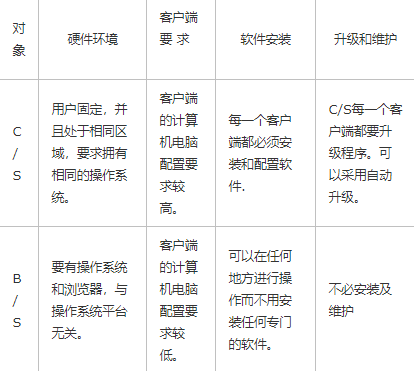
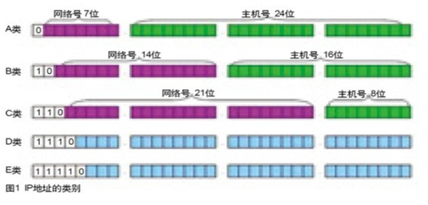
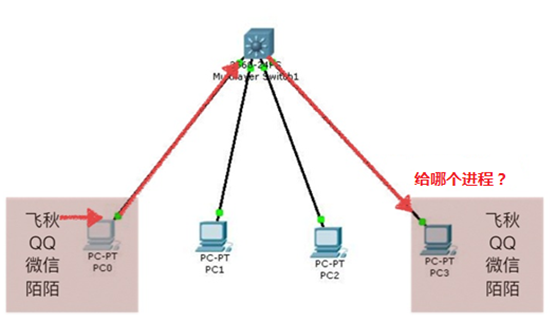
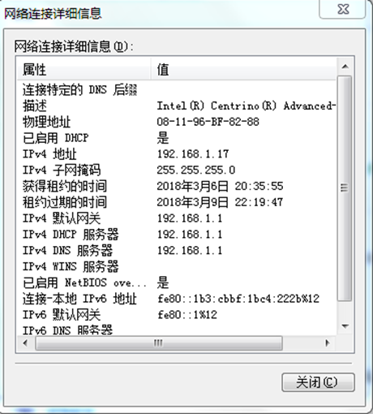
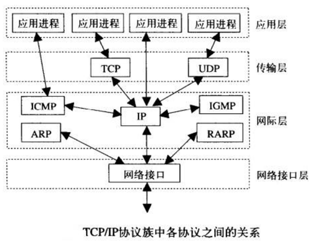
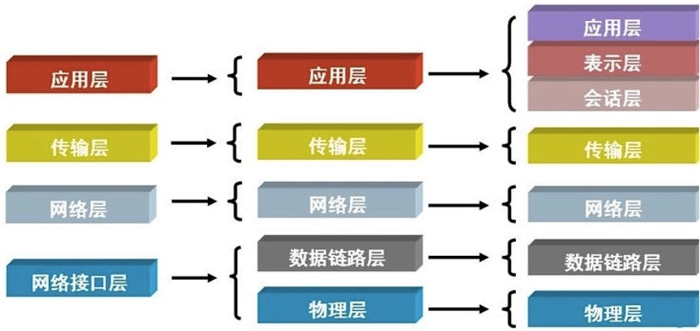
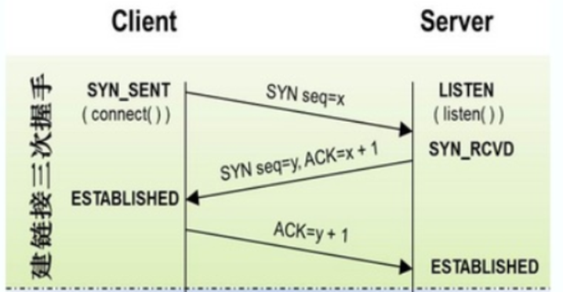
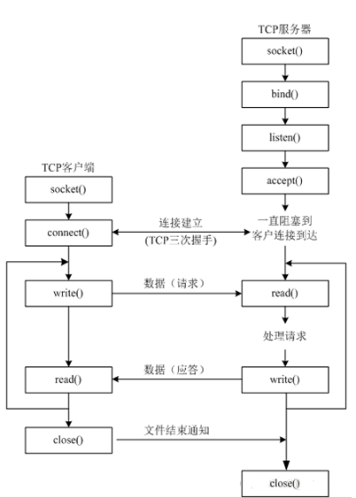
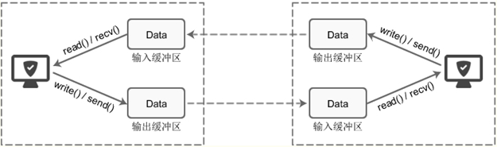

# 第五章 网络编程

自从互联网诞生以来，现在基本上所有的程序都是网络程序，很少有单机版的程序了。

计算机网络就是把各个计算机连接到一起，让网络中的计算机可以互相通信。网络编程就是如何在程序中实现两台计算机的通信。

举个例子，当你使用浏览器访问新浪网时，你的计算机就和新浪的某台服务器通过互联网连接起来了，然后，新浪的服务器把网页内容作为数据通过互联网传输到你的电脑上。

由于你的电脑上可能不止浏览器，还有QQ、Skype、Dropbox、邮件客户端等，不同的程序连接的别的计算机也会不同，所以，更确切地说，网络通信是两台计算机上的两个进程之间的通信。比如，浏览器进程和新浪服务器上的某个Web服务进程在通信，而QQ进程是和腾讯的某个服务器上的某个进程在通信


从编程角度来看：分为web编程和网络编程，最好可以分清两者的概念。前者更倾向于去学习一些主流的框架以及自己搭建站点，后者则是从更底层上去描述与实现。

网络编程不等于网站编程，网络编程是使用套接字来达到进程间通信

## 第一节 网络基础

## 1.1 B/S和C/S架构（15分钟）

- CS即Client/Server（客户机/服务器）结构，C/S结构在技术上很成熟，它的主要特点是交互性强、具有安全的存取模式、网络通信量低、响应速度快、利于处理大量数据。但是该结构的程序是针对性开发，变更不够灵活，维护和管理的难度较大。通常只局限于小型局域网，不利于扩展。并且，由于该结构的每台客户机都需要安装相应的客户端程序，分布功能弱且兼容性差，不能实现快速部署安装和配置，因此缺少通用性，具有较大的局限性。要求具有一定专业水准的技术人员去完成


- BS即Browser/Server（浏览器/服务器）结构，就是只安装维护一个服务器（Server），而客户端采用浏览器（Browse）运行软件。B/S结构应用程序相对于传统的C/S结构应用程序是一个非常大的进步。 B/S结构的主要特点是分布性强、维护方便、开发简单且共享性强、总体拥有成本低。但数据安全性问题、对服务器要求过高、数据传输速度慢、软件的个性化特点明显降低，这些缺点是有目共睹的，难以实现传统模式下的特殊功能要求。例如通过浏览器进行大量的数据输入或进行报表的应答、专用性打印输出都比较困难和不便。此外，实现复杂的应用构造有较大的困难。统一接口。




总结：

- CS 优点：本地响应速度快，在硬件和网络环境不好的情况下用CS能提高效率（其实是降低用户愤怒值）
- CS 缺点： 如果二次开发较多，投入很大。首先你不能保证不继续修改二次开发方案，那么CS 的兼容性就会不断接受挑战
- BS 优点： 部署简单，打开就用，不用太担心二次开发带来的兼容性
- BS 缺点： 给用户的感觉就是反应慢


## 1.2 两台机器如何通信？

### 1.2.1 IP（25分钟）

IP地址： ⽤来在⽹络中标记⼀台电脑的⼀串数字， ⽐如192.168.1.1（c类）； 在同一⽹络上是惟⼀的（用来标记唯一的一台电脑）

每⼀个IP地址包括两部分： ⽹络地址和主机地址 

主机号0,255两个数不能使用（网络号、广播地址）



- A类IP地址由1字节的⽹络地址和3字节主机地址组成， ⽹络地址的最⾼位必须是“0”，地址范围1.0.0.1-126.255.255.254可⽤的A类⽹络有126个， 每个⽹络能容纳1677214个主机 
- B类IP地址由2个字节的⽹络地址和2个字节的主机地址组成， ⽹络地址的最⾼位必须是“10”，地址范围128.1.0.1-191.255.255.254  可⽤的B类⽹络有16384个， 每个⽹络能容纳65534主机 
- C类IP地址由3字节的⽹络地址和1字节的主机地址组成， ⽹络地址的最⾼位必须是“110”范围192.0.1.1-223.255.255.254    C类⽹络可达2097152个， 每个⽹络能容纳254个主机 
- D类IP地址第⼀个字节以“1110”开始， 它是⼀个专⻔保留的地址。它并不指向特定的⽹络， ⽬前这⼀类地址被⽤在多点⼴播（一对多） 中多点⼴播地址⽤来⼀次寻址⼀组计算机 地址范围224.0.0.1-239.255.255.254
- E类IP地址以“1111”开始， 为将来使⽤保留 E类地址保留， 仅作实验和开发⽤ 


私有IP：本地局域网上的IP，专门为组织机构内部使用

在这么多⽹络IP中， 国际规定有⼀部分IP地址是⽤于我们的局域⽹使⽤， 属于私⽹IP， 不在公⽹中使⽤的， 它们的范围是：

- 10.0.0.0～10.255.255.255
- 172.16.0.0～172.31.255.255 
- 192.168.0.0～192.168.255.255 

私有IP禁止出现在Internet中，来自于私有IP的流量全部都会阻止并丢掉。公有IP可以全球访问


IP地址127． 0． 0． 1代表本机IP地址， ⽤ http://127.0.0.1 就可以测试本机中配置的Web服务器

常用来ping 127.0.0.1来看本地ip/tcp正不正常

### 1.2.3 子网掩码（5分钟）

是我们测量两个IP是否属于同一个网段的工具

⼦⽹掩码不能单独存在， 它必须结合IP地址⼀起使⽤

⼦⽹掩码只有⼀个作⽤， 就是将某个IP地址划分成⽹络地址和主机地址两部分

⼦⽹掩码的设定必须遵循⼀定的规则：与IP地址相同， ⼦⽹掩码的长度也是32位，左边是⽹络位， ⽤⼆进制数字“1”表示；右边是主机位， ⽤⼆进制数字“0”表示

假设IP地址为“192.168.1.1”⼦⽹掩码为“255.255.255.0”

- “1”有24个， 代表与此相对应的IP地址左边24位是⽹络号
- “0”有8个， 代表与此相对应的IP地址右边8位是主机号 

### 1.2.4 端口号（25分钟）

端口号： 用来标记区分进程

- ⼀台拥有IP地址的主机可以提供许多服务， ⽐如HTTP（万维⽹服务） 、 FTP（⽂件传输） 、 SMTP（电⼦邮件） 等， 这些服务完全可以通过1个IP地址来实现。 那么， 主机是怎样区分不同的⽹络服务呢？

-  显然不能只靠IP地址， 因为IP地址与⽹络服务的关系是⼀对多的关系。实际上是通过“IP地址+端⼝号”来区分不同的服务的

  


端⼝号是一个数字，只有整数， 范围是从0到65535 （分为知名和动态两种）

- 知名端⼝是众所周知的端⼝号（用来做固定事情）， 范围从0到1023，例如：
  - 80端⼝分配给HTTP服务（网站）
  - 21端⼝分配给FTP服务（文件下载）
  - 可以理解为， ⼀些常⽤的功能使⽤的号码是固定的 
- 动态端⼝的范围是从1024到65535之所以称为动态端⼝
  - 之所以称为动态端⼝，是因为它⼀般不固定分配某种服务， ⽽是动态分配
  - 动态分配是指当⼀个系统进程或应⽤程序进程需要⽹络通信时， 它向主机申请⼀个端⼝， 主机从可⽤的端⼝号中分配⼀个供它使⽤


### 1.2.5 网卡（5分钟）

网卡（网络适配器，网络接口卡）是一块被设计用来允许计算机在网络上进行通讯的计算机硬件


### 1.2.6 mac（10分钟）

每一个网卡都有一个被称为MAC地址的独一无二的48位串行号

也叫物理地址（实际地址）：由网络设备制造商生产时写在硬件内部

IP地址与MAC地址在计算机里都是以二进制表示的，IP地址是32位的，而MAC地址则是48位的（6个字节）

如：08:00:20:0A:8C:6D就是一个MAC地址，其中前3组16进制数08:00:20代表网络硬件制造商的编号，它由IEEE（电气与电子工程师协会）分配

而后3组16进制数0A:8C:6D代表该制造商所制造的某个网络产品（如网卡）的系列号

MAC地址在世界是惟一的

（可以直接理解为网卡的序列号）



### 1.2.7 交换机（15分钟）

集线器(HUB)是计算机网络中连接多个计算机或其他设备的连接设备，是对网络进行集中管理的最小单元。英文Hub就是中心的意思，像树的主干一样，它是各分支的汇集点。HUB是一个共享设备，主要提供信号放大和中转的功能，它把一个端口接收的所有信号向所有端口分发出去

交换机(Switch)是一种基于MAC（网卡的硬件地址）识别，能完成封装转发数据包功能的网络设备。交换机可以“学习”MAC地址，并把其存放在内部地址表中，通过在数据帧的始发者和目标接收者之间建立临时的交换路径，使数据帧直接由源地址到达目的地址


arp协议：地址解析协议（arp在七层中的第三层，mac在第二层）
通过一台机器的IP地址获取到了它的mac地址，用到了交换机：
主机发送信息时将包含目标IP地址的ARP请求广播到局域网络上的所有主机，并接收返回消息，以此确定目标的物理地址。
收到返回消息后将该IP地址和物理地址存入本机ARP缓存中并保留一定时间，下次请求时直接查询ARP缓存以节约资源。
第一次是广播，后面是单播

### 1.2.8 路由器（15分钟）

路由器：确定一条路径的设备，路由器是连接因特网中用来链接网络号不同的、不同的网络，相当于中间人各局域网、广域网的设备，它会根据信道的情况自动选择和设定路由，以最佳路径，按前后顺序发送信号的设备。
路由器的一个作用是连通不同的网络，另一个作用是选择信息传送的线路

- 同一个局域网当中的终端之间进行通讯的基础是处于同一个网段中，一个路由器至少有两个网卡，能够链接不同网段的网络使之可以通信
- 选择通畅快捷的近路，能大大提高通信速度，减轻网络系统通信负荷，节约网络系统资源，提高网络系统畅通率

### 1.2.9 OSI （50分钟）

协议：约定好的规范

早期的计算机⽹络， 都是由各⼚商⾃⼰规定⼀套协议， IBM、 Apple和Microsoft都有各⾃的⽹络协议， 互不兼容

为了把全世界的所有不同类型的计算机都连接起来， 就必须规定⼀套全球通⽤的协议， 为了实现互联⽹这个⽬标

互联⽹协议簇（Internet ProtocolSuite） 就是通⽤协议标准。因为互联⽹协议包含了上百种协议标准， 但是最重要的两个协议是TCP和IP协议， 所以， ⼤家把互联⽹的协议总称TCP/IP协议 

这就是完成进程之间通信的规范




在早期，不同的公司都推出了属于自己的私有网络协议，相互之间不能兼容
于是，ISO（国际标准化组织）站出来：干脆这样，我给大家制定一个通用的网络通信协议，该协议是国际标准
于是ISO博览众家之长，制订了“一堆”详细的，复杂的，繁琐的，精确的网络通信协议
不过这堆协议太复杂了，为了理清思路，便于学习，将他们分了7类（也就是分了7层），不同层代表不同的功能，并把这些协议归到相应的层里面去
国际标准出来了，接下来就要软件/硬件厂商去实现了。但实际上各厂商并没有完整实现7层协议，因为7层协议栈追求全能、完善，导致它太过复杂，实现起来太难了

于是，实际使用时，按4层划分（5层划分非官方）



OSI七层协议，是英文Open System Interconnect的缩写，中文翻译开放系统互联

TCP/IP定义了电子设备如何连入因特网，以及数据如何在它们之间传输的标准

4层的层级结构中，每一层都呼叫它的下一层所提供的网络来完成自己的需求

其中的应用层关注的是应用程序的细节，而不是数据在网络中的传输活动。其他三层主要处理所有的通信细节，对应用程序一无所知

- 应用层：应用程序间沟通的层，不同的文件系统有不同的文件命名原则和不同的文本行表示方法等，不同的系统之间传输文件还有各种不兼容问题，这些都将由应用层来处理
- 传输层：在此层中，它提供了节点间的数据传送服务，如传输控制协议（TCP）、用户数据报协议（UDP）等，这一层负责传送数据，并且确定数据已被送达并接收
- 网络层：负责提供基本的数据包传送功能，让每一块数据包都能够到达目的主机。网络层接收由更低层发来的数据包，并把该数据包发送到更高层，相反，IP层也把从TCP或UDP层接收来的数据包传送到更低层
- 网络接口层：对实际的网络媒体的管理，定义如何使用实际网络来传送数据（处理机械的、电气的和过程的接口）


7层的层级结构如下：

- 物理层：

  网线连接在客户端计算机上，其实是连接在了计算机的一个叫做网卡的设备上，网卡是专门负责与外界通信的。网线一般是双绞线或者光缆，也可以使用无线电波，中间经过交换机，路由器，防火墙等等一堆设备统称为物理连接介质，可以理解为经过互联网，再连接到服务端设备。首先工作的是物理层，发送电信号


- 数据链路层：

  电信号分为两种，高电平和低电平，高电平可以被人定义成数字 1，低电平可以被人定义成数字 0。假如我客户端发送一个 0010101100，服务端相应的就会收到这些数字。但是单纯的一段二进制数字这是没有意义的，一定要明确，从哪里开始到哪里结束这表示一段内容，从哪里开始到哪里结束这又表示另外一段内容。这也就是说，我们要给这些二进制数字进行分组

  以太网协议规定：

  - 一组电信号构成一个数据报，叫做‘帧’
  - 每一数据帧分成：报头head和数据data两部分

> 这一点和我们写信类似，有信封，有信的内容，信封上面会写明这封信的发送者接受者分别是谁， 信里面的信纸上写的就是信的内容。

head包含：(固定18个字节)

- 发送者／源地址，6个字节

- 接收者／目标地址，6个字节

- 数据类型，6个字节

data包含：(最短46字节，最长1500字节)

> 注意：头固定长度18个字节，也只有固定长度，接收者才知道按照什么标准来读取

- 数据报的具体内容

head长度＋data长度＝最短64字节，最长1518字节，超过最大限制就分片发送

> 以太网规定head里面要有发送者的源地址和接受者的目标地址，源地址可以理解为是发送者的家，目标地址就是接收者的家。那么，在计算机中如何标识家在哪里？

使用mac地址，注意这个mac地址不是你用的苹果电脑那个mac，只是巧合同名了。MAC地址（Media Access Control Address），直译为媒体访问控制地址，也称为局域网地址（LAN Address），以太网地址（Ethernet Address）或物理地址（Physical Address），它是一个用来确认网上设备位置的地址。

mac地址是计算机上一个唯一的地址，是在计算机的网卡上的，每块网卡出厂时都被烧制上一个
世界唯一的mac地址，长度为48位2进制，通常由12位16进制数表示（前六位是厂商编号，后六位是流水线号）
这样做的目的就是要保证每一个mac地址是全世界独一无二的


网络层：

网络层有一个IP协议，我们常说的IPV4就是IP协议的第四个版本，IPV6就是IP协议的第六个版本


传输层：

传输层有一个TCP协议和UDP协议，这两个协议都是基于端口工作的协议


会话层：负责文件发送/接收

表示层：负责数据压缩、编码


应用层：

应用层就是应用软件，应用软件是你写的，这个标准可以由你来定，当然了你也可以遵循一些大家已经定制好了的应用层协议的标准，常见的有 http，mail，ftp


发送过程：

应用层软件（有协议或无协议）===>传输层（TCP/UDP协议）===>网络层（ip协议）===>数据链路层（以太网协议）===>物理层===>电信号发送（100011001010110）

接收过程则相反

## 1.3 socket入门（15分钟）

socket:通过网络完成进程间通信的方式（区别于一台计算机之间进程通信）
Socket的英文原义是“插孔”。通常也称作"套接字“


Socket本质是编程接口(API)： Socket 是对 TCP/IP 协议的封装，Socket 只是个编程接口不是协议，通过 Socket 我们才能使用 TCP/IP 协议簇（程序员层面）

TCP/IP也要提供可供程序员做网络开发所用的接口，这就是Socket编程接口；HTTP是轿车，提供了封装或者显示数据的具体形式；Socket是发动机，提供了网络通信的能力

最重要的是，Socket是面向客户/服务器模型而设计的，针对客户和服务器程序提供不同的Socket系统调用

套接字之间的连接过程可以分为三个步骤：服务器监听，客户端请求，连接确认


创建Socket：

```python
import socket
#导入套接字模块
s = socket.socket(socket.AF_INET, socket.SOCK_STREAM)
#s此时是一个socket对象，拥有发送和接收网络数据的功能
```

该函数带有两个参数

- AF_INET（ipv4协议⽤于 Internet 进程间通信） 
- 套接字类型， 可以是 SOCK_STREAM（流式套接字， ⽤于TCP 协议） 或者 SOCK_DGRAM（数据报套接字， ⽤于 UDP 协议） 
- TCP慢但是稳定不会丢数据
- UDP快但是可能会丢数据，也容易被黑客攻击
- 确定了IP地址端口号（ipv4协议），TCP或UDP协议之后，计算机之间就可以通过socket进行通信

## 第二节 TCP和UDP协议

## 2.1 UDP（15分钟）

UDP --- User Data Protocol，用户数据报协议， 是⼀个⽆连接的简单的⾯向数据报的传输层协议。 UDP不提供可靠性， 它只是把应⽤程序传给IP层的数据报发送出去， 但是并不能保证它们能到达⽬的地。 由于UDP在传输数据报前不⽤在客户和服务器之间建⽴⼀个连接， 且没有超时重发等机制， 故⽽传输速度很快

UDP⼀般⽤于多点通信和实时的数据业务， ⽐如：

- 语⾳⼴播
- 视频
- QQ
- TFTP(简单⽂件传送）

可以理解为写信


### 2.2 TCP以及三次握手四次挥手（35分钟）

TCP（Transmission Control Protocol，传输控制协议）是面向连接的协议，也就是说，在收发数据前，必须和对方建立可靠的连接

- 使用情况多于udp
  - 稳定：保证数据一定能收到
  - 相对UDP会慢一点
  - web服务器一般都使用TCP（银行转账，稳定比快要重要）
  - TCP通信模型：在通信之前，必须先等待建立链接


一个TCP连接必须要经过三次“对话”才能建立起来，其中的过程非常复杂，简单的描述下这三次对话的简单过程：

- 主机A向主机B发出连接请求数据包：“我想给你发数据，可以吗？”，这是第一次对话
- 主机B向主机A发送同意连接和要求同步（同步就是两台主机一个在发送，一个在接收，协调工作）的数据包：“可以，你什么时候发？”，这是第二次对话
- 主机A再发出一个数据包确认主机B的要求同步：“我现在就发，你接着吧！”，这是第三次对话
- 三次“对话”的目的是使数据包的发送和接收同步，经过三次“对话”之后，主机A才向主机B正式发送数据

可以理解为打电话，先建立通道


#### 2.2.1 三次握手和四次挥手


A--B  

A请求建立连接  B回复确认信息 A给B回复确认信息


第一次握手：建立连接时，客户端发送SYN（请求同步）包到服务器，并进入SYN_SENT（请求连接）状态，等待服务器确认

第二次握手：服务器收到syn包，必须确认客户的SYN（x+1），同时自己也发送一个SYN包（syn=y），即SYN+ACK包，此时服务器进入SYN_RECV(SYN派遣)状态


第三次握手：客户端收到服务器的SYN＋ACK包，向服务器发送确认包ACK(y+1)，此包发送完毕，客户端和服务器进入ESTABLISHED（TCP连接成功）状态，完成三次握手。客户端与服务器才正式开始传送数据


理想状态下，TCP连接一旦建立，在通信双方中的任何一方主动关闭连接之前，TCP 连接都将被一直保持下去




在tcp传输过程中，如果有一方收到了对方的数据，一定会发送一个ACK确认包给发送方


断开一个TCP连接则需要“四次挥手”
第一次挥手：主动关闭方调用close，会发送一个长度为0的数据包以及FIN（结束标志）用来关闭主动方到被动关闭方的数据传送，告诉被动关闭方：我已经不会再给你发数据了，但是，此时主动关闭方还可以接受数据

第二次挥手：被动关闭方收到FIN包后，发送一个ACK给对方，确认序号为收到序号+1

第三次挥手：被动关闭方发送一个FIN，用来关闭被动关闭方到主动关闭方的数据传送，也就是告诉主动关闭方，我的数据也发送完了，不会再给你发数据了

第四次挥手：主动关闭方收到FIN后，发送一个ACK给被动关闭方，确认序号为收到序号+1，至此，完成四次挥手


长连接：三次握手四次挥手之间分多次传递完所有数据（看视频、在线游戏），长时间占用某个套接字

短连接：三次握手四次挥手之间传递少部分数据，多次握手挥手才传递完所有数据（浏览器），短时间占用


### 2.3 TCP与UDP的区别（15分钟）

1.基于连接与无连接

2.对系统资源的要求（TCP较多，UDP少）

3.UDP程序结构较简单

4.流模式与数据报模式 

5.TCP保证数据正确性，UDP可能丢包，TCP保证数据顺序，UDP不保证


### 2.4 基于tcp、udp协议的socket服务

#### 2.4.1 udp 编程（50分钟）

```python
# 发送数据：
from socket import *
s = socket(AF_INET, SOCK_DGRAM) #创建套接字
addr = ('192.168.1.17', 8080) #准备接收方地址
data = input("请输入：")
s.sendto(data.encode(),addr)
#发送数据时，python3需要将字符串转成byte
#encode(‘utf-8’)# 用utf-8对数据进行编码，获得bytes类型对象
#decode（）反过来
s.close()


import socket
sk = socket.socket(AF_INET,SOCK_STREAM)  tcp
```


发送数据给飞秋

- 飞秋使用：2425端口

- 发送普通数据飞秋不会响应，必须发送特殊格式的内容

  - 1:123123:吴彦祖:吴彦祖-pc:32:haha

- 飞秋有自己的应用层协议

  - 最前面的1表示版本
  - 后面的数字随便写
  - 32代表发送消息

- 飞秋炸弹：循环不延时发消息（网络攻击）

  

- 注意：IP和端口在网络通信中缺一不可，用到的协议也要匹配
  
  - 例如飞秋用的是udp协议，使用TCP协议发数据是无效的

接收数据

```python
from socket import *
s = socket(AF_INET, SOCK_DGRAM) #创建套接字
addr = ('192.168.1.17', 8080) #准备接收方地址
data = input("请输入：")
s.sendto(data.encode(),addr)
#等待接收数据
redata = s.recvfrom(1024)
#1024表示本次接收的最大字节数
print(redata)
s.close()
```


绑定信息：
如果没有绑定某个端口，每发送一次信息，系统会随机分配一个端口


绑定信息：让一个进程可以使用固定的端口（不可以重复）

一般情况下，发送方可以不绑定端口，接收方需要绑定

```python
from socket import *

s = socket(AF_INET, SOCK_DGRAM) #创建套接字

s.bind(('', 8788))   #绑定一个端口，ip地址和端⼝号，ip⼀般不⽤写

addr = ('192.168.1.17', 8080)   #准备接收方地址

data = input("请输入：")

s.sendto(data.encode(),addr)

redata = s.recvfrom(1024) #1024表示本次接收的最⼤字节数

print(redata)

s.close()
```


练习：

尝试编写一个echo服务器

- Echo服务是一种非常有用的用于调试和检测的工具。这个协议的作用也十分简单，接收到什么原封发回

```python
from socket import *
#1创建套接字
udpSocket = socket(AF_INET, SOCK_DGRAM)
#2绑定本地信息，不使用随机分配的端口
bindAddr = ("",7088)
udpSocket.bind(bindAddr)#绑定
num = 0

while True:
    #接收对方发送的数据
    recvData = udpSocket.recvfrom(1024)
    print(recvData)
    #将接收到的数据回发给对方
    udpSocket.sendto(recvData[0],recvData[1])
    num += 1
    print("已将接收到的第%d个数据返回给对方，"%num)
udpSocket.close()

```


聊天室程序

```python
from socket import *
import time
#1创建套接字
udpSocket = socket(AF_INET, SOCK_DGRAM)
bindAddr = ("",7088)
udpSocket.bind(bindAddr)#绑定
while True:
    #接收对方发送的数据
    recvData = udpSocket.recvfrom(1024)
    print('【%s】 %s.%s' %(time.ctime(),recvData[1],recvData[0].decode("GB2312")))
    a = input("请输入：")
    udpSocket.sendto(a.encode('GB2312'),('192.168.1.17',8080))
#5关闭套接字
udpSocket.close()
```


练习：
使⽤多线程完成⼀个全双⼯的聊天程序 

- 全双工（Full Duplex）是通讯传输的一个术语。通信允许数据在两个方向上同时传输（电话）
- 单工是只允许甲方向乙方传送信息，而乙方不能向甲方传送（收音机）
- 半双工：甲方发消息时乙方只能收不能发（对讲机）


udp广播

- 广播：当前网络上所有电脑的某个进程都收到同一个数据

- 使用udp协议，tcp没有广播


如果让广播方给接收方每人发一份数据，将会出现卡顿。所以借助交换机来分发数据

```python
import socket
dest = (‘<broadcast>’,7788）#<broadcast>自动识别当前网络的广播地址
#创建udp套接字
s = socket.socket(socket.AF_INET, socket.SOCK_DGRAM)
#对这个需要发送广播数据的套接字进行修改设置，否则不能发送广播数据
s.setsockopt(socket.SOL_SOCKET, socket.SO_BROADCAST, 1) #允许s发送广播数据
#setsocketopt 设置套接字选项 SOL_SOCKET:通用套接字选项  1：选项值
s.sendto(b'Hi',dest)
print("等待回复")
while True:
    (buf, address) = s.recvfrom(2048)
    print(address,buf.decode(“GB2312”))
```


#### 2.4.2 TCP 编程（45分钟）

tcp服务器流程如下：
1. socket创建⼀个套接字
2. bind绑定ip和port
3. listen设置最大连接数，收到连接请求后，这些请求需要排队，如果队列满，就拒绝请求
4. accept等待客户端的链接、接收连接请求
5. recv/send接收发送数据




```
from socket import *
tcpSerSocket = socket(AF_INET, SOCK_STREAM)
address = (‘’, 7788) 

tcpSerSocket.bind(address)

tcpSerSocket.listen(5)#设置最大连接数

newSocket, clientAddr = tcpSerSocket.accept()  #阻塞

# 如果有新的客户端来链接服务器， 那么就产⽣⼀个新的套接字
# newSocket⽤来为这个客户端服务（10086小妹）
# tcpSerSocket就可以省下来等待其他新客户端的链接 

# 接收对⽅发送过来的数据， 最⼤接收1024个字节
recvData = newSocket.recv(1024)  

#发送⼀些数据到客户端
newSocket.send(“thank you !”)

# 关闭为这个客户端服务的套接字， 只要关闭了， 就意味着为不能再为这个客户端服务了
newSocket.close()

# 关闭监听套接字， 只要这个套接字关闭了， 就意味着整个程序不能再接收任何新的客户端的连接
tcpSerSocket.close() 
```


TCP客户端

```python
from socket import *
clientSocket = socket(AF_INET, SOCK_STREAM)

serAddr = ('192.168.1.17', 7788)
#链接服务器
clientSocket.connect(serAddr)

clientSocket.send(b"hello")
recvData = clientSocket.recv(1024)
print("接收到的数据为：", recvData)
clientSocket.close()
```


服务器循环

```python
from socket import *
serSocket = socket(AF_INET, SOCK_STREAM)
localAddr = ('',7788)
serSocket.bind(localAddr)
serSocket.listen(5)
while True:
    print("主进程等待新客户端")
    newSocket,destAddr = serSocket.accept()
    print("主进程接下来负责处理",str(destAddr))
    try:
        while True:
            recvData = newSocket.recv(1024)
            if len(recvData)>0: #如果收到的客户端数据长度为0，代表客户端已经调用close（）下线
                print("接收到", str(destAddr),recvData)
            else:
                print("%s-客户端已关闭" %str(destAddr))
                break
    finally:
        newSocket.close()
serSocket.close()
```


## 第三节 SocketServer使用和剖析

### 3.1 粘包（50分钟）

TCP协议是面向流的协议，容易出现粘包问题




不管是recv还是send都不是直接接收对方的数据（不是一个send一定对应一个recv），而是操作自己的缓
存区（产生沾包的根本原因）

- 例如基于tcp的套接字客户端往服务端上传数据，发送时数据内容是按照一段一段的字节流发送的，
  在接收方看了，根本不知道该文件的字节流从何处开始，在何处结束

- 
  所谓粘包问题主要还是因为接收方不知道消息之间的界限，不知道一次性提取多少字节的数据所造成的。


而UDP是面向消息的协议，每个UDP段都是一条消息，应用程序必须以消息为单位提取数据，
不能一次提取任意字节的数据，这一点和TCP是很不同的，所以只有TCP有粘包现象，UDP永远不会粘包


粘包不一定会发生

如果发生了：1.可能是在客户端已经粘了

　　　　　　2.客户端没有粘，可能是在服务端粘了

- 客户端粘包：
  - 发送端需要等缓冲区满才发送出去，造成粘包
    （发送数据时间间隔很短，数据量很小，TCP优化算法会当做一个包发出去，产生粘包）

  ```python
  # server端：
  import socket
  server = socket.socket(socket.AF_INET, socket.SOCK_STREAM)
  server.bind(('127.0.0.1', 9904))  
  server.listen(5)
  conn, addr = server.accept()
  res1 = conn.recv(1024)
  print('第一次', res1)
  res2 = conn.recv(1024)
  print('第二次', res2)
  
  # client端：
  import socket
  client = socket.socket(socket.AF_INET, socket.SOCK_STREAM)
  client.connect(('127.0.0.1', 9904))
  client.send('hello'.encode('utf-8')) 12  12/3
  client.send('world'.encode('utf-8')) 14  14/2
  
  
  打印结果：
  第一次 b'helloworld' 
  第二次 b''
  
  
  不合适的解决方案：
  send时加上时间间隔，虽然可以解决，但是会影响效率。不可取。
  
  ```

  

- 服务端粘包
  
  - 接收方没能及时接收缓冲区的包（或没有接收完），造成多个包接收（客户端发送了一段数据，服务端只收了一小部分，服务端下次再收的时候还是从缓冲区拿上次遗留的数据，产生粘包）

```python
# server端：
import socket
server =socket.socket(socket.AF_INET ,socket.SOCK_STREAM)
server.bind(('127.0.0.1' ,9904))
server.listen(5)

conn,addr =server.accept()
res1 = conn.recv(2)  # 第一没有接收完整
print('第一次' ,res1)
res2 =conn.recv(10)# 第二次会接收旧数据，再收取新的
print('第二次', res2)


# client端：
import socket
client = socket.socket(socket.AF_INET, socket.SOCK_STREAM)
client.connect(('127.0.0.1', 9904))

client.send(struct.pack('i',100)+'hello'.encode('utf-8')) #stuct.pack('i',100) -- 4bytes
client.send('world'.encode('utf-8'))

res =server.recv(4) 
data_len = struct.unpack('i',res)[0]
recv(data_len)

打印结果：
第一次 b'he'
第二次 b'lloworld'


不合适的解决方案：
提升recv的接收数量的上限。 不可取
因为没有上限。8G数据，一次接收8G撑爆内存了

```


问题的根源在于：接收端不知道发送端将要传送的字节流的长度
所以解决粘包的方法就是发送端在发送数据前，发一个头文件包，告诉发送的字节流总大小，然后接收端来一个死循环接收完所有数据

使用struct模块可以用于将Python的值根据格式符，转换为固定长度的字符串（byte类型）

- struct模块中最重要的三个函数是pack(), unpack(), calcsize()
  - pack(fmt, v1, v2, ...)     按照给定的格式(fmt)，把数据封装成字符串(实际上是类似于c结构体的字节流)
  - unpack(fmt, string)       按照给定的格式(fmt)解析字节流string，返回解析出来的tuple
  - calcsize(fmt)                 计算给定的格式(fmt)占用多少字节的内存

```python
import socket
import struct

phone = socket.socket(socket.AF_INET, socket.SOCK_STREAM)

phone.connect(('127.0.0.1', 8080))  # 建立连接， 拨号

while 1:
    cmd = input('>>>')
    phone.send(cmd.encode('utf-8'))
    # 1. 接收固定长度报头
    data_head = phone.recv(4)

    # 2. 获取数据总长度
    total_size = struct.unpack('i', data_head)[0]
    total_data = b''
    while len(total_data) < total_size:
        total_data += phone.recv(1024)
    print(total_data.decode('gbk'))

phone.close()
```


```python
import socket
import subprocess
import struct
phone = socket.socket(socket.AF_INET, socket.SOCK_STREAM)
phone.bind(('127.0.0.1', 8080))
phone.listen(5)
while 1:  
    conn, client_addr = phone.accept()
    print(client_addr)
    while 1:
        try:
            cmd = conn.recv(1024)
            ret = subprocess.Popen(cmd.decode('utf-8'), shell=True, stdout=subprocess.PIPE, stderr=subprocess.PIPE)
            correct_msg = ret.stdout.read()
            error_msg = ret.stderr.read()
            # 1.获取总长度
            total_size = len(correct_msg) + len(error_msg)  # 7865
            # 2. 制作等长度的报头
            # 将一个数字（不定长的int类型）转化成等长度的bytes类型。# total_size int数据类型。--->bytes
            ret = struct.pack('i', total_size)
            # 3. 发送固定长度的报头
            conn.send(ret)
            # 4. 发送数据
            conn.send(correct_msg + error_msg)
        except ConnectionResetError:
            break
    conn.close()
phone.close()
```


### 3.2 基于socketserver模块实现并发socket服务（50分钟）


Python 提供了两个级别访问的网络服务。：

低级别的网络服务支持基本的 Socket，它提供了标准的 BSD Sockets API，可以访问底层操作系统Socket接口的全部方法。

高级别的网络服务模块 SocketServer， 它提供了服务器中心类，可以简化网络服务器的开发

- socketserver可以实现和多个客户端通信（实现并发处理多个客户端请求的Socket服务端）

  它是在socket的基础上进行了一层封装，也就是说底层还是调用的socket

  - 服务器接受客户端连接请求——》实例化一个请求处理程序——》根据服务器类和请求处理程序类，调用处理方法。

  - 例如：基本请求程序类（BaseRequestHandler）调用方法 handle 。此方法通过属性 self.request 来访问客户端套接字

- 创建socketserver的基本步骤：

```python
import socketserver

#创建一个请求处理类，继承 BaseRequestHandler 并且重写父类中的 handle()
#在handle（）中处理和客户端所有的交互，建立链接时会自动执行handle方法

socketserver.TCPServer.allow_reuse_address = True  
# 允许地址（端口）重用

#实例化 TCPServer对象 ，将服务器IP/端口号和请求处理类传给 TCPServer
server =socketserver.ThreadingTCPServer(ip_port,MyServer)
# 对 socketserver.ThreadingTCPServer 类实例化对象，将ip地址，端口号以及自己定义的类名传入，并返回一个对象
#多线程：ThreadingTCPServer
#多进程：ForkingTCPServer -only in Linux

#对象执行serve_forever方法，开启服务端（handle_request()只处理一个请求）
server.serve_forever() 
 #处理多个请求，永远执行
```


- 服务端

  ```python
  import socketserver
  
  # 自定义类来实现通信循环
  class MyServer(socketserver.BaseRequestHandler):
      # 必须写入handle方法，建立链接时会自动执行handle方法
      def handle(self):
          while True:
              data = self.request.recv(1024)
              # handle 方法通过属性 self.request 来访问客户端套接字
              print('->client:', data)
              self.request.send(data.upper())
  
  socketserver.TCPServer.allow_reuse_address = True
  server = socketserver.ThreadingTCPServer(('127.0.0.1', 8080), MyServer)
  server.serve_forever()
  ```

- 客户端：

  ```python
  import socket
  
  client = socket.socket(socket.AF_INET, socket.SOCK_STREAM)
  client.connect(('127.0.0.1', 8080))
  
  while True:
      client.send('hello'.encode('utf-8'))
      data = client.recv(1024)
      print(data)
  
  ```

  