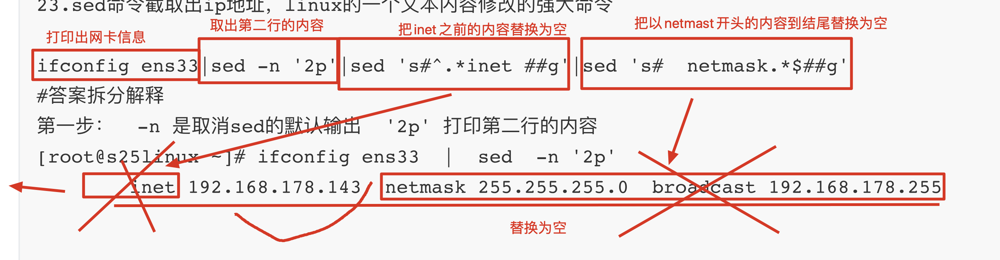
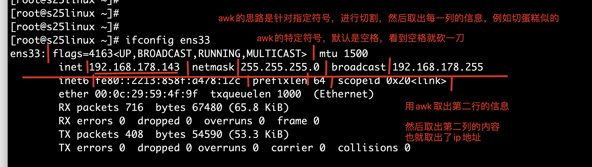

##[Tiancai](https://gitee.com/tian_cai1995) 的答案

标题虽然是python笔试题，但是内容，是python笔试题中出现的linux题目

作为一个后端开发，需要掌握的Linux功底

能否在一台linux机器上，部署2个django项目

企业内网管理平台

信息抓取平台

基于文件夹路径的不同，以及要修改代码的路径，实现运行2个项目吗？

```
nginx web服务器，提供静态资源展示，提供反向代理功能 

基于域名不同的项目部署，因为访问站点，添加端口，不友好的
第一个项目：nginx(www.selfcrm.com)+uwsgi+django+mariadb+virtualenv
第二个项目: nginx(www.selfsite.com)+uwsgi+django+virtualenv+mariadb

不同的请求，进入到nginx的时候，开始匹配不同的server{}站点，然后根据域名的不同，决定发给哪个虚拟主机，然后转发给不同的后端机器
```


```
www.s25crm.com   ->   123.206.16.61
解答：一个ip可以对应多个域名。

域名和ip的关系  

1对1  确定？------可以是1对1

多对多 确定？❎

多对一  确定？--------也可以是多对一

一对多 确定？❌


你这么去考虑 ，就懂了

手机电话簿，名字=====电话号码的 对应关系？
1对1 是最常见的，没问题吧

张强====110
丽丽====120

多对一  ，也是可以的，你给这个人，起多个昵称

老李===110
小李子===110
小李李===100


```







```
linux考试题
1.在登录Linux时，一个具有唯一进程ID号的shell将被调用，这个ID是什么(B)
 进程ID号是什么？----pid ，进程id号 
A.NID B.PID C.UID C.CID
process 进程

2.下面那个文件夹存放用户密码信息(B)  ，访问用户密码的文件 /etc/passwd
A./boot B./etc C./var D./dev

3.用于自动补全功能时，输入命令或文件的前1个或后几个字母按什么键(B)
A.ctrl B.tab C.alt D.esc

4.vim退出不保存的命令是(A,D)
A.:q B.q C.:wq D.:q!(这个更严谨，强制不保存退出)

5.文件权限读、写、执行三种符号的标志依次是(A)
A.rwx B.xrw C.rdx D.rws
			other  4  r-- 4         user  rwx7    group  rw-6 
			user   group   other
			7     6    4  
6.某文件的组外成员的权限是只读、属主是全部权限、组内权限是可读可写、该文件权限为(D)  
A.467 B.674 C.476 D.764

7.改变文件的属主的命令是(C)
A.chmod B.touch C.chown D.cat
   change mode 更改权限              change own
                 
8.解压缩文件mydjango.tar.gz，我们可以用(A)
A.tar -zxvf mydjango.tar.gz
B.tar -xvz mydjango.tar.gz
C.tar -czf mydjango.tar.gz
D.tar - xvf mydjango.tar.gz

9.检查linux是否安装了,可用哪些命令(B)
A.rpm -ivh nginx 安装这个rpm包
B.rpm -q nginx  query 查询包是否安装
C.rpm -U nginx	update 更新，升级软件包
D.rpm -x nginx 

10.Linux配置文件一般放在什么目录(A)
A.etc B.bin C.lib D.dev

11.linux中查看内存，交换内存的情况命令是(C)  free -m  #以兆的单位，显示内存使用情况
A.top B.last c.free D.lastcomm

12.观察系统动态进程的命令是(B)，linux的任务管理器
A.free B.top C.lastcomm D.df

13.如果执行命令，chmod 746 file.txt ，那么该文件的权限是(A)
A.rwxr—rw-
B.rw-r—r—
C.—xr—rwx
D.rwxr—r—

14.找出当前目录以及其子目录所有扩展名为”.txt”的文件，那么命令是(D)
A.ls .txt
B.find /opt -name “.txt”
C.ls -d .txt
d.find -name “.txt”，系统是识别为 find  ./  -name ".txt"

15.什么命令常用于检测网络主机是否可达? C
A.ssh，远程连接服务器 B.netstat查看linux的网络端口 C.ping D.exit退出交互式的系统终端

16.退出交互式shell，应该输入什么?
A:q! B.quit C.; D.exit       D

17.在父目录不存在的时候，添加的参数是? D    mkdir -p  /s25/女同学/alex
A.-P B.-d C.-f D.-p       

18.下列文件中，包含了主机名到IP地址映射关系的文件是? 应该选B  ❌
A./etc/hostname  存放linux的主机名的文件
B./etc/hosts    --------B  ，没问题，就是这个文件，可以在linux中强制定义主机名和ip的解析关系，本地解析
C./etc/resolv.conf  ，写入dns服务器地址的文件，比如填入 nameserver  114.114.114.114 
D./etc/networks  网络相关配置的文件

19.请问你使用的linux发行版是什么？如何查看linux发行版信息？
  cat /etc/re

[root@localhost ~]# cat /etc/redhat-release 
CentOS Linux release 7.5.1804 (Core) 

20.Linux单引号双引号的区别?

单引号:内容就是一个字符串,不会识别任何其他特殊符号
双引号:是能够识别特殊符号的,以及变量

21.vim有几种工作模式

四种:正常模式,命令模式,插入模式,可视模式

-----
超哥理解的答案：  命令模式、编辑模式、底线命令模式
1.vim  file.txt  
2. 开始编辑
3.  :wq!  退出且保存内容


22.nginx的主配置文件是?如何实现多虚拟主机?nginx反向代理参数是？

conf/nginx.conf  
在配置文件中添加多个server代码块 修改里面的端口号等
proxy_pass 请求转发的参数，反向代理的参数
uwsgi_pass  基于uwsgi协议的请求转发


线上是:socket;  线下是http，❌这位同学想表述的是uwsgi.ini中的一个参数，和题意无关

23.sed命令截取出ip地址，linux的一个文本内容修改的强大命令

ifconfig ens33|sed -n '2p'|sed 's#^.*inet ##g'|sed 's#  netmask.*$##g'


#答案拆分解释
ifconfig ens33 |  sed -n '2p'  |  sed 's/.*inet//g'  | sed 's/netmask.*//g'
 192.168.178.143
 
第一步：  -n 是取消sed的默认输出  '2p' 打印第二行的内容
[root@s25linux ~]# ifconfig ens33  |  sed  -n '2p'  
        inet 192.168.178.143  netmask 255.255.255.0  broadcast 192.168.178.255

第二步：  针对第二行的内容，再次处理，然后
 sed 's/.*inet//g'    
 sed 的替换功能 s是替换模式   's/你想替换掉的内容/替换之后的内容/'
 's/把inet一直到ip地址的内容/空/g'   
 's/.*inet//'  把任意内容到inet的字符串，替换为空
 
ifconfig ens33 |  sed -n '2p'  |  sed 's/.*inet//g'
 192.168.178.143  netmask 255.255.255.0  broadcast 192.168.178.255

第三步：


24.如何解压缩后缀是.tar.gz文件?

tar -zxvf  .tar.gz

25.awk命令截取出ip地址，awk命令是linux强大的三剑客命令，用于对字符串的专业格式化
ifconfig ens33  |  awk 'NR==2 {print $2}'  

#-------------------------------------------------------------------


26.www服务在internet最为广泛，采用的结构是?


http --->  nginx -->  uwsgi


Browser/Server   浏览器/服务器  B/S 

C/S  client/server  王者荣耀 

27.如何给linux添加dns服务器记录?

#填入2个阿里的dns服务器地址
vim  /etc/resolv.conf  #
nameserver  223.5.5.5  
nameserver  223.6.6.6

28.每月的5,15,25的晚上5点50重启nginx

50 17 5,15,25 * *  /usr/bin/systemctl  restart nginx (命令的绝对路径)

29.每分钟清空/tmp/内容

* * * * *  /usr/bin/rm  -rf  /tmp/*


30.每天早上6.30清空/tmp/的内容

30 6 * * *  /usr/bin/rm  -rf  /tmp/*

31.每个星期三的下午6点和8点的第5到15分钟之间备份mysql数据到/opt/

5-15 18,20 * * 3 /usr/bin/mysqldump -uroot -p  --all-databases > /opt/alldb.sql

32.某文件权限是drw-r—rw-，请解读该权限？

d 代表是一个文件夹
属主user:读写
组group:只读
其他人other:读写

33.centos版本系统服务管理命令是?

例如:redis
systemctl  status  redis  #查看redis服务的状态
systemctl  start  redis
systemctl  stop  redis  
systemctl  restart redis  
systemctl  enable  redis  #设置redis开机自启
systemctl  disable  redis  #禁止redis开机自启 

34.如何远程登录阿里云123.206.16.61，且运维更改了ssh端口是 24456?

ssh -p  24456   root@123.206.16.61  #指定ssh的端口去连接


35.备份mariadb的命令是?

/usr/bin/mysqldump -uroot -p  --all-databases > /opt/alldb.sql

36.简述特殊符号的含义?

#        在某些文件中表示注释行，在命令提示符，表示超级用户的身份提示符
.        当前目录
..       当前目录的上一级目录
$PATH    查看PATH路径  ,$表示定义变量，取值符

37.如果你发现在公司无法使用rm，使用提示’禁止你使用rm’,是为什么？

因为你的权限只有可读,或者权限不够,不可以操作此命令 ,
起了别名alias rm='echo 禁止你使用rm'

38.如何修改test.py属组为alex?

 chgrp   alex  test.txt

39.如何在windows和linux传输文件？有哪些方法？

lrzsz           xftp          scp(scp是linux平台的命令，windows powershell里有scp命令，可能)

40.如何杀死mariad进程? mariadb在linux上的启动进程名，还是mysql

pkill -9 mysql(pkill后面跟名字)，强制性杀死和mysql相关的进程，

rm或是kill之类，pkill等危险类的操作，请看明白了再操作
pkill -9 python  #强制性杀死机器上，所有和python相关的进程，你可能杀死一些必要的进程
因此，最好使用kill，单独的去杀死进程


kill -9 mariad的进程号(kill后面跟进程号)

41.登录一台Linux之后，使用yum命令提示command not found，怎么办?


应该下载yum   ，说的也没什么问题，但是应该是错的，，，❌

因为yum工具，是红帽系列的系统，默认自带的软件包管理工具

除非你登录的是一个ubuntu系统，默认没有yum而是apt-get等工具。。


42.linux如何安装软件?有几种方式？

yum  rpm   源码包编译安装

43.出于安全角度，简述如何安装启动redis服务端？

yum install redis -y
systemctl  start redis 
redis-cli
----
更改默认启动端口 6379
开启protommode yes  #开启redis的安全模式
设置redis密码
redis-sever redis.conf

44.如何保证本地测试环境和线上开发环境一致性？思路?

docker 打包镜像，
# 比如你又2台机器，都需要部署环境
机器1，部署了nginx，python3，mariadb，redis，ok后，可以用了
还得在机器2上，再部署一遍，如上的操作
	docker能够把机器1所有的环境，打包成一个镜像文件，发给机器2，直接运行该镜像，机器2就可以拥有机器1所有的环境了

#这个命令的操作，解决的，仅仅是python项目的模块依赖问题而已...
手动解决环境问题  pip3  freeze > requirements.txt  

45.virtualenv是什么?简述如何使用

virtualenv是用来为一个应用创建一套运行环境的工具(例如:python)
pip3 install virtualenv
virtualenv --no-site-packages --python=python3 env1
source /opt/目录/bin/activate
pip3 list

46.virtulevnwrapper是什么？简述使用
virutalenv在创建比如venv1,venv2等等多个虚拟环境目录的时候，难以管理


virtaulenvwrapper是virtualenv的扩展包,用于方便管理虚拟环境
安装虚拟环境        pip3 install virtualenvwrapper
需要做一个配置方可使用
创建并进入虚拟环境   mkvirtualenv  env1 #自动的放入一个统一的虚拟环境文件夹管理目录
切换虚拟环境        workon  虚拟环境名

47.redis哨兵是什么？作用是

redis哨兵就是监控redis主从服务,不储存数据的,作用是用于自动切换redis服务主从关系,当主库服务停止后,会将其中一个从库变为主库

48.redis-cluster是什么?

就是为了最大化利用内存,可以采用redis-cluster群集,就是分布式储存,每台redis储存不同的内容,满足这种分布式储存要求的集群的一种体现,群集至少需要3主3从,且每个实例使用不同的配置文件.

49.什么是静态资源，什么是动态资源？

静态资源:网站的CSS/JS/HTML文件
动态资源:一般是指数据,即后端给前端提供的数据

50.配置linux软连接的命令?
软连接====快捷方式===
window下
D:\我的应用\qq\qq.exe   双击安装，发送这个qq.txt发送到桌面快捷方式，以后再桌面直接双击
link_qq.exe  直接就能够运行qq了

link_qq.exe ---->  D:\我的应用\qq\qq.exe


ln -s 目标文件名  软连接名
#比如环境变量的配置，场景
# 不想修改PATH，也想直接使用python3
ln -s  /opt/python36/bin/python3     /usr/sbin/   #自动的生成一个/usr/sbin/python3

直接输入Python3的时候 


51.如何永久添加/opt/python36/的环境变量？

vim /etc/profile
添加PATH="/opt/python36/bin:"   #如果不写上这个bin，那就大错特错了...
source /etc/profile
 
52.给如下代码添加注释，是nginx.conf的配置
server{                  --->  一个虚拟主机
listen 80;               --->  监听的端口,访问的端口是80
server_name 192.168.11.11; ---> 访问的域名192.168.11.11
location / {             --->  访问的url路径
root html;               --->  指定页面的站点资料目录
index index.html;        --->  指定的首页文件的名字
}
}

server{                 --->虚拟主机
listen 8080;            --->nginx的监听端口
server_name 192.168.11.11;  --->nginx访问域名
location / {                --->location匹配url
include uwsgi_params;       ---> 将uwsgi_params文件中的参数添加进nginx.conf中
uwsgi_pass 0.0.0.0:8000;    --->反向代理转发请求给uwsgi的8000端口
}
}

53.supervisor是什么？如何使用?

supervisor是守护进程的配置
1.yum install supervisor
2.echo_supervisord_conf  >  /etc/supervisor.conf  #生成配置文件
3.vim  写入自定义的配置
[program:crm];  -->项目的名字
command = uwsgi的绝对路径 --ini  uwsgi.ini的绝对命令;  #启动项目的命令
stopasgroup = true; #默认为false,进城被杀死时,是否向这个进程组发送stop信号,包括子进程
killasgroup = true;  #默认为false,向进程组发送kill信号包括子进程
4.supervisord  -c  /etc/supervisor.conf start  all
5.管理supervisor的进程
supervisorctl  -c  /etc/supervisor.conf
#启动所有项目

54.简述项目部署流程？如何部署路飞，uwsgi+nginx+supervisor+nginx

1.安装python3环境
2.安装nginx和redis和mariadb
3.部署前端
    3.1安装node.js环境
    3.2安装node依赖包
    3.3修改axios的发送的端口接口
    3.4打包编译node项目 npm run build 
    3.5  如果你发现忘记修改了前端的axios数据提交地址，且已经打包生成了dist，
    解决办法是，删除此dist以及前端的代码，重新解压缩源码，修改数据提交地址，重新打包
    
4.部署后端
    4.1安装virtualven
    4.2创建虚拟环境
    4.3安装django和uwsgi,以及项目的依赖包
    4.4修改uwsgi的配置文件路径与其他
5.配置nginx
    5.1创建两个虚拟主机,分别监听80端口和8000端口
    5.2访问80端口就是前端vue
    5.3访问8000端口就是vue发起的8000端口请求,反向代理到9000的uwsgi
6.启动nginx,mysql,redis
7.通过supervisor管理

牛批，我对这个同学的敬仰，又如滔滔江水，连绵不绝。。。


55.docker是什么？简述docker优势

linux容器软件
docker优势:
    更搞效的利用系统资源
    更快速的启动时间
    一致的运行环境
    持续交付和部署
    更轻松的迁移,维护和扩展

56.你常用的docker常用命令有哪些？操作镜像、容器、仓库的命令
操作镜像命令:
    docker images    --查看本地镜像
    docker serach 镜像   --通过docker hub搜索镜像
    docker rmi 镜像   --删除镜像
    docker save 镜像 > 路径     --导出镜像
    docker load  <  路径    --导入镜像
    docker build -t   --打包生成镜像
操作容器命令:
    docker run -d  镜像  解释器  # 根据镜像生成容器,后台允许
    docker run -it 镜像 解释器   #根据镜像生成并进入容器
    docker start/stop 容器id    #启动/停止容器
    docker ps  #查看当前运行的容器
    docker rm  容器id  #删除容器
    docker exec 容器id  #进入当前正在运行的容器
    docker commit  容器id   镜像名  #将容器提交为镜像
    docker contain ls  #查看当前运行的容器
操作仓库的命令:
	docker pull 镜像  #  下载镜像
	docker push 镜像   #  推送镜像
	
57.哪个命令无法查看linux文件内容？  D
A.tac B.more分屏读取文件内容 C.head 读取文件前10行 D.man 查看命令的帮助手册

cat 是读取文件，自上而下
tac 是读取文件，自下而上

ls  命令，读取文件夹内容
sl  是什么呢？自己试一试 yum install sl -y  #玩一玩，你会回来评论的。。。


58.使用rm -i 系统会提示什么信息？  B
A.命令所有参数
B.是否真的删除
C.是否有写的权限
D.文件的路径

59.为何说rm -rf 慎用？

因为-r递归删除     -f是强制删除

60.python操作linux的模块是?

os 

61.如果端口8080被占用，如何查看是什么进程？

netstat  -tunlp | grep 8080  #能够看到8080该端口的进程名字是什么

62.redis是如何做持久化的?

RDB:
redis会定期保存数据快照至一个RDB文件中, 并在启动时自动加载RDB文件,恢复之前保存的数据,通过save指令触发持久化,redis单独开启一个子进程进行数据持久化
AOF:
redis 会把每一个写请求都记录在一个日志文件里,在redis重启时,会把AOF文件中记录的所有写操作顺序执行一遍,确保数据恢复到最新
随着AOF不断地记录写操作日志,因为所有的操作都会记录,所以必定会出现一些无用的日志,大量无用的日志会让AOF文件过大,也会让数据恢复的时间过长
优先:数据安全.不怕数据损坏,断电还可以用redis-check-aof修复数据,AOF文件人为可读
缺点:占磁盘,性能损耗高,数据恢复慢
怎么用RDB和AOF?
如果及配置了RDB.有配置的AOF,则在进行数据持久化的时候,都会进行,但是再根据文件恢复数据的时候,以AOF文件为准,RDB文件作废

63.redis集群了解过么？sentinal和cluster区别是什么?

Redis Sentinal着眼于高可用，在master宕机时会自动将slave提升为master，继续提供服务。
Redis Cluster着眼于扩展性，在单个redis内存不足时，使用Cluster进行分片存储。

64.创建mysql用户alex，并且授予权限select权限，命令是什么？

create user alex ;  SQL语句对吗？
#不同的mysql用户，登录mysql的增删改查权限是不一样的，需要使用grant语句去授权

grant select,create on *.* to alex@'%';

65.nginx如何实现负载均衡?
#定义一个负载均衡的服务器地址池，里面填入的是你多台django的ip和端口

upstream  myserver{
server  ip:端口   weight=权重数
server  ip:端口   weight=权重数
}

66.nginx的负载均衡调度算法有几种？是什么?

轮询机制    按时间顺序逐一分配到不同的后端服务器
weight     加权轮询,weight值越大,分配到的访问几缕越高
ip_hash    每个请求192.168.178.134按照访问ip的hash结果分配 ,这样来自统一IP的固定访问一个后端服务器
url_hash   按照访问URL的hash结果来分配请求,是每个URL定向到同一个后端服务器
least_conn  最少链接数,哪个机器链接少就分发

67.linux下载软件包的方法有?

wget url地址
curl 也是发起http请求的命令

68.windows和linux常用远程连接工具有哪些?

xshell
putty
securecrt

69.如何给予一个脚本可执行权限

chmod u+x file  

70.过滤出settings.py中所有的空白和注释行

grep   -v "^#"    settings.py |grep   -v "^$"   

71.过滤出file1中以abc结尾的行

grep "abc$"  file1  

72.容器退出后，通过docker ps查看不到，数据会丢吗?

不会丢,因为容器停止了并没有被删除,docker  ps  -a

73.如何批量清理后台停止的容器

docker rm  `docker ps -aq

74.如何查看容器日志?

docker logs -f    #实时刷新容器内的日志

75.服务器被攻击，吃光了所有的CPU资源，怎么办？禁止重装系统

1.查看系统负载情况   (top命令)
2.杀死无用的占资源的进程
3.系统全局搜索find搜索,找到病毒文件 rm  -rf 删掉
4.还需要检查定时任务是否添加了些东西

牛批，答得很好

76.绘制下python web部署图

 如最下面的图

77.在centos7.2中用一句话杀死所有的test.py进程

kill -9  test.py   #❌   kill是杀死进程id号的

pkill -9 test.py  #杀死进程名

78.在centos7.2中如何查看程序执行所消耗的cpu，内存等硬件信息

top

79.Linux查询环境变量的命令是

echo  $PATH

80.查询脚本定时任务的命令是

crontab  -l

81.saltstack、ansible、fabric、puppt工具的作用
都是批量化管理服务器的工具，且是基于python开发的工具
可以方便运维同学，一个人管理万台服务器，自动化部署

# ------------------------------------------

82.uwsgi、wsgi是什么？

uwsgi是一种线路协议而不是通信协议,在此常用于uwsgi服务器与其他网络服务器的数据通信
而uwgsi是实现了uwsgi和wsgi两种协议的web服务器

wsgi  是web 服务器网关接口,他是一个协议,描述了web服务器如何与web应用程序通信,在线上,走的协议是nginx通过uwsgi_socket找到web应用程序uwsgi

83.supervisor是什么？

supervisor是守护进程的配置

84.解释PV,UV的含义？
PV  page view  页面浏览量 ,网站刷新一次，页面浏览量+1,不能够精确的表示网站的访问流量
问情况 ，

ip数，这里的ip指的是是固定的公网ip
	咱们25期的同学，都在家里，所有人都访问一下pythonav.cn  ，能够抓到多少个公网ip？
	咱班60个人
	因此，我的服务器，捉到的公网ip数，就是60
我的服务器统计的pv数是多少呢？不好统计，因为永不一直在刷新，可以通过nginx的access.log去计数统计
一条日志记录，就是一个pv

# ---------------------------------------

85.解释QPS是什么？

#----------------------------------------------------

86.解释什么是静态资源？动态资源？

静态资源:网站的CSS/JS/HTML文件
动态资源:一般是指数据,即后端给前端提供的数据

87.saltstack如何采集服务器静态数据？

# --------------------------------------------------

88.请用yaml语法表示如下python数据结构，yaml是狠重要的配置文件语法
{
“老男孩”:[{“老师”:[“太白”,”女神”,”吴老板”]},{“学生”:[“20期佳增同学”]}]
}

# --------------------------------------------------

89.redis怎么实现队列？

redis 的列表可以用来实现消息队列,key用来表示队列名称,发消息采用rpush,lpush,取消息采用rpop,lpop实现

90.什么是docker生命周期？

如下图

91.docker容器有哪些状态？

dockerfile  用于创建image镜像模版文件.
image:镜像文件对比PC端的概念,可以把它理解为服务器端的可执行软件包
container:运行起来的image文件就是容器了,从外表来看就是一个应用,可以对外提供服务

92.dockerfile常用指令？

from  --设置镜像使用基础镜像
maintainer  --设置镜像的作者
run     --编译镜像时运行的脚本
cmd     -- 设置容器的启动命令
label   --设置镜像的标签
expoese  --设置镜像暴露的端口
env     --设置容器的环境变量
add/copy     --  编译镜像时赋值文件到镜像中
entrypoint   --设置程序的入口程序
volume     --设置容器的挂载卷
user    --设置  run  cmd  entrypoint 用户名
workdir  --设置run  cmd entrypoint  copy add指令工作目录
arg    --设置编译镜像时加入的参数
onbuild   --设置镜像的onbuild命令
stopsignal：设置容器的退出信号量


93.dockerfile中copy和add的区别

Writing Dockerfiles建议尽量使用COPY，并使用RUN与COPY的组合来代替ADD，这是因为虽然COPY只支持本地文件拷贝到container，但它的处理比ADD更加透明，建议只在复制tar文件时使用ADD，如ADD trusty-core-amd64.tar.gz /。

94.docker获取和删除镜像的命令?

docker rmi 镜像   删除镜像

95.如何退出一个交互式的容器终端，而不终止它？

 docker rm  容器id  #删除容器

96.容器如何端口映射？数据卷映射？

#------------------------------------

97.如何进入容器？流程是？

docker exec 容器id  #进入当前正在运行的容器

98.简述docker使用流程

docker images    --查看本地镜像
    docker serach 镜像   --通过docker hub搜索镜像
    docker rmi 镜像   --删除镜像
    docker save 镜像 > 路径     --导出镜像
    docker load  <  路径    --导入镜像
    docker build -t   --打包生成镜像
操作容器命令:
    docker run -d  镜像  解释器  # 根据镜像生成容器,后台允许
    docker run -it 镜像 解释器   #根据镜像生成并进入容器
    docker start/stop 容器id    #启动/停止容器
    docker ps  #查看当前运行的容器
    docker rm  容器id  #删除容器
    docker exec 容器id  #进入当前正在运行的容器
    docker commit  容器id   镜像名  #将容器提交为镜像
    docker contain ls  #查看当前运行的容器
操作仓库的命令:
	docker pull 镜像  #  下载镜像
	docker push 镜像   #  推送镜像


99.如何批量删除或停止容器?

docker rm 'docker ps -aq'

100.nginx的access.log能够统计哪些信息？
 
 #------------------------------
 
101.容器都是默认后台运行，怎么查看容器日志？

docker logs

102.容器退出后，通过docker ps 命令查看不到，数据会丢失么？

不会
```