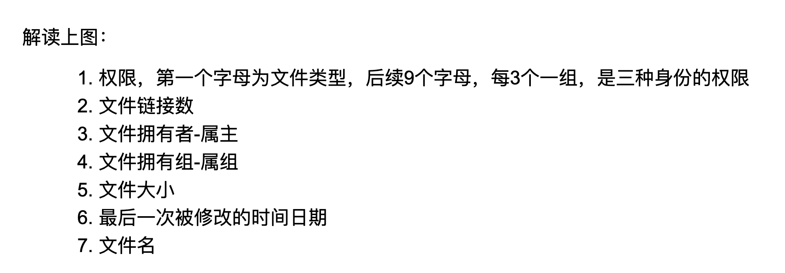
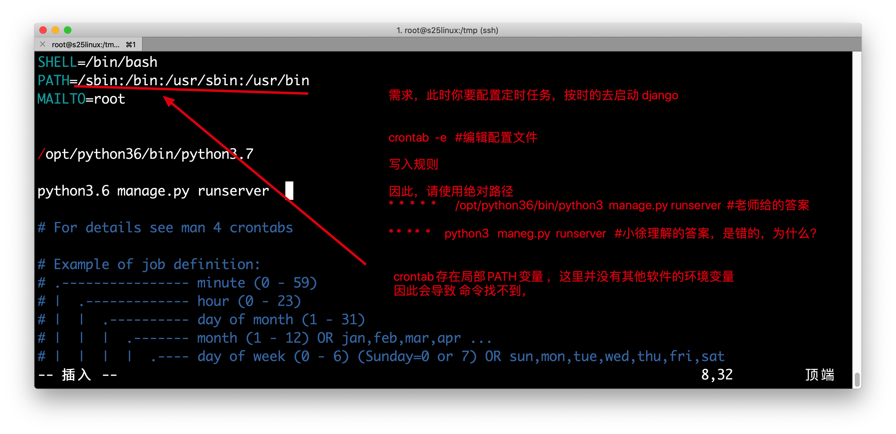

## day03Linux学习

1.打开vmware 虚拟机，通过`ip addr show`命令查看今日的ip地址

2.通过xshell远程连接linux机器，因为xshell远程终端更好用

## Linux用户管理

```
对于一个qq群而言，有哪些角色划分，权利的划分
群主-----qq群里面，权利最大，想干嘛就干嘛，可以随意的拉人，踢人等等----相当于皇帝----相当于linux的root用户

管理员---他是root赋予的临时的超级权限-在用皇帝的身份狐假虎威---钦差大人---linux系统中的sudo命令--尚方宝剑

吃瓜群众---权利最低的，基本上只能够在自己的家目录，进行增删改查，其他目录，权限都很低-----linux的普通用户
```

系统创建了用户，同时会创建一个同名的组

例如

```
useradd  caixukun  #创建普通用户 caixukun，系统会在/etc/passwd文件中，增加一行用户信息
且同时创建了一个用户组  也叫caixukun  ，存放在/etc/group 文件中
```

### id命令

查看用户的账户信息的命令

例如

```
id  root 
[root@s25linux tmp]#  id  root
uid=0(root) gid=0(root) 组=0(root)

id  caixukun
[root@s25linux tmp]# id caixukun
uid=1004(caixukun) gid=1004(caixukun) 组=1004(caixukun)
```

### 组的概念

对于技术部门，运维需要分配的单个用户的权限太散，太多，人太多了。。。

【权限控制，其实控制的就是，不同的组，不同用户，针对不同的文件夹，文件，操作的权限的不同】

比如说

```
mysql的默认数据存放路径，如 /var/lib/mysql/*     那么这个mysql的数据文件，以及所有的文件夹，是属于哪个组，哪个用户管理呢？

比如说有一个文件
-rw-r--r--. 1 root root 0 2月  17 08:52 mysql.log


```


前端组

后端组，权利稍微大一点。

运维组，对于服务器操作权限很大，可以使用root的权限

测试部门

安全部门

DB部门 

运维都得对上述的人，进行权限控制，对于服务器的操作权限

因此引入组的概念，针对整个组管理，就方便多了，

### root而言

root为什么叫root，是因为系统提出了UID的概念，用户id号，用户id为0的就是系统的超级用户

普通用户由root用户创建，默认的UID是从1000开始进行累计，权利很低

### 普通用户

```
默认用户家目录都在/home
例如
/home/pyyu/
/home/alex/
/home/wupeiqi/

```

## 用户管理的命令

添加删除用户，注意的是，涉及到权限的修改，只能用root去操作，其他人基本上没权限

```
useradd  caixukun  #创建用户caixukun
passwd   caixukun  #给用户修改密码，

userdel  caixukun  #删掉caixukun这个用户

userdel -rf  caixukun  #删除用户，且删除用户的家目录

```

### 用户登录切换

```
su  -   用户名  #用户登录切换，普通用户切换，需要输入密码，root用户想干嘛都不需要密码

#这个减号必须加上，叫做，完全的环境变量切换，是正确的切换方式
比如 
su - pyyu

su - root
```

### 尚方宝剑命令sudo

```
1.当pyyu用户，想要进入/root文件夹，发现权限不够，怎么办

思路：
1.使用sudo命令，默认以root身份去执行命令
例如  sudo   cd /root

思路2：
把pyyu用户，加入到root组里，也就拥有了root组的权限，但是还是得查看这个group的权限

思路3：
直接修改/root文件夹的权限，允许其他人，也可以读写执行 ，其他人也就能够进入到/root文件夹了
```

【sudo命令使用配置流程】

```
1.使用visudo命令，修改配置文件，添加你允许执行sudo命令的用户
visudo  #打开文件后，找到大约在91行的内容，修改为如下
     91 ## Allow root to run any commands anywhere
     92 root    ALL=(ALL)       ALL
     93 pyyu    ALL=(ALL)       ALL

2.保存退出之后，即可使用sudo命令了
sudo  ls /root  
```

## Linux文件、目录权限管理

```
文件管理的权限-----也就是针对这文件，属于哪个用户，属于哪个组，以及对应的权限是什么


背景：比如武沛奇，有一个手机 iphone7  

这个iphone7 属于哪个用户？他的权限应该是怎样的？(他对于这个手机使用的权限)
	(这个手机属于 武沛奇，并且他的权限，应该是 最大的权限，可以随意的把玩 )
	对于武沛奇自己而言
	是可以任意的把玩，用读写执行的权限
	武沛奇可以看手机，改手机资料，手机给砸了
	
	
那武沛奇的家庭成员（他老婆），对于这个手机而言，属于什么样的关系？并且可能的权限是什么？ 

读，写，执行（可以看手机，改手机内容，以及砸掉手机）

他老婆属于武沛奇这个家庭组里，可能分配的权限是，读写权限（这个权限都是有权利最大的人分配的，好比一家之主说话才算话）
因此，武沛奇家庭组的人，可能只能读写，，也就是，可以  看手机 ，，玩手机，而不能砸掉


那此时，超哥来了，对于这个武沛奇的手机而言，属于什么身份关系？以及可能用的 读写执行权限是什么？？

超哥对于这个手机而言，就属于一个 其他人，没有任何的关系，因此权限一般很低，只能看一看，摸都不给摸

```

对于如上的比喻做一个总结

```
对于linux系统而言，文件、文件夹，都是有  user 属主，  group属组的一个角色分配，还存在一个other其他人
这三个身份的划分

并且设定了  r  w   x  三个权利的限制，也就是 读，写，执行（对于文件的读写执行）


场景：
1. root用户在/tmp目录下 创建了一个 文件 叫做  root.txt ，因此这个文件默认就属于root用户，属于root用户组

2.此时 一个普通用户，登录了机器 ，如
ssh   chaoge@192.168.178.134  登录机器之后，chaoge对于这个 root.txt文件而言，就是一个其他人的身份了

```




查看文件夹的详细信息

```
[root@s25linux ~]# ll /tmp
总用量 4
drwxr-xr-x. 2 root root    6 2月  17 11:00 hehe   #文件夹 
解读它的信息
drwxr-xr-x  拆分如下
d  d代表是一个文件夹
rwx   user是root，root可以读写执行
r-x   group也是root，root组里的成员，可以读，执行
r-x    others权限是 读，执行

#文件的权限，必须顺序是 rwx ，没有权限则写一个-号

-rw-r--r--. 1 pyyu pyyu 2328 2月  17 09:15 pwd.txt  #文件 
#解读如上的权限
-   开头是 -号，就是普通的文本类型 
rw-  user是pyyu，pyyu这个用户权限是 可读、可写，不可执行
r--   group是pyyu，只读
r--   此时peiqi这个用户对于pwd.txt这个文件，权限就是 只读的
```

对于文件的rwx

```
r   cat，more，less，head，等读取文件内容的操作
w    vim  ，echo，等写入内容的操作 
x   可以执行的脚本，例如bash，python等脚本，文件会变成绿色
```

对于文件夹的rwx

```
r  ls 查看文件夹内容
w   允许在文件夹中创建文件等操作
x    允许cd进入此文件夹
```

## chmod命令总结

```
chmod 可以更改文件的权限，更改针对 user，group，other的权限修改，例如

chmod  u+r   file.txt  #给文件的user，添加读的权限
chmod  g-x  file.txt  #给文件的group组权限，去掉可执行
chmod o+r,o+w,o+x  file.txt  #给文件的other身份，最大的权限，读写执行

chmod 000  file.txt  #给与文件最低的权限，任何人不得读写执行


```


### chown

change  owner缩写

更改文件的拥有者，user

```
chown  新的属主  file.txt
```


## chgrp

更改文件的拥有组，group

change group 缩写

```
chgrp  新的属组  file.txt
```

## 软连接

windows的一个快捷方式而已

```
创建命令

ln  -s  目标文件绝对路径     软连接绝对路径
[root@s25linux tmp]# ln  -s  /tmp/test.txt   /opt/t.txt  #给/tmp/test.txt创建一个快捷方式，放在/opt/t.txt 这里

删除快捷方式，删除软连接是不会影响源文件的

windows下装另一个qq在 D:\qq\qq.exe ，发送快捷方式到桌面   
```

## 打包、压缩、解压缩

也就是linux的tar命令

打包，不节省空间

压缩，节省磁盘空间

```
语法
tar 命令
功能参数

-z   调用gzip命令，对文件压缩 ，加上这个参数，才会节省磁盘空间
-x   解包，拆快递
-v    显示整个过程
-f    必须写在参数结尾，指定压缩文件的名字 
-c    打包，收拾快递

压缩文件的后缀，本没有意义，只是告诉别人，这个文件是用什么命令压缩/解压缩

*.gz   gzip命令解压缩
*.tar   用tar命令解压缩
*.xz   用xz命令解压
*.zip   用unzip命令解压

```

案例1：打包/opt/目录下所有的内容，打包生成tar包`allopt.tar`

```
第一步：打包opt下所有内容
[root@s25linux opt]# tar   -cvf  allopt.tar   ./*

第二步：解包这个tar包
[root@s25linux opt]# tar  -xvf  allopt.tar   ./

```

案例2：打包，且压缩/opt目录下所有内容，生成tar.gz包`allopt.tar.gz`

```
第一步：打包，且压缩，就是加一个-z参数即可
[root@s25linux opt]# tar   -zcvf  allopt.tar   ./*

第二步：解压缩，常见的*.tar.gz，也有人会缩写成  *.tgz ，都可以如此的去解压缩
[root@s25linux opt]# tar  -zxvf  allopt.tar.gz   ./
```

```
疑问：必须先打包再压缩吗？能对一个文件夹直接压缩吗？

解答：  打包，压缩是一体的，是调用tar命令，加上-z参数，自动就压缩了

tar -zcvf   dir.tar.gz  ./testdir/  #压缩此文件夹，放入到一个压缩文件 dir.tar.gz中

.gz是 压缩的常见后缀格式
```

## 防火墙

用于控制服务器的出/入流量

防止恶意流量攻击服务器，保护服务器的端口等服务。

在学习阶段是直接关闭的，专业的运维人员需要学习iptables软件的一些指令

```
云服务器，默认都有一个硬件防火墙，以及软件防火墙（iptables、firewalld）
我在服务器上，运行了django服务，如果开启了防火墙服务器，且没有自定义规则，默认是拒绝所有外来流量 ，导致我们windows无法访问到linux运行的django等程序


1.清空防火墙规则
iptables -F #清空防火墙规则

2.关闭防火墙的服务
systemctl   stop firewalld  #关闭防火墙服务
systemctl disable  firewalld  #禁止防火墙开机自启

```

## DNS域名解析

什么是dns解析？

```
dns解析系统-------手机上的电话簿------- 小王----132xxx      小莉---186xxxx

dns服务器，存储了公网注册的所有（域名----ip）对应的解析关系


linux的dns客户端配置文件/etc/resolv.conf
里面定义了主备的两个dns服务器地址
[root@s25linux ~]# cat /etc/resolv.conf
# Generated by NetworkManager
#search localdomain
nameserver 119.29.29.29
nameserver 223.5.5.5


linux的本地dns强制解析文件  /etc/hosts，可以写入一些测试的域名，用于本地机器使用,域名解析优先级更高
[root@s25linux ~]# cat  /etc/hosts
127.0.0.1   localhost localhost.localdomain localhost4 localhost4.localdomain4
::1         localhost localhost.localdomain localhost6 localhost6.localdomain6

127.0.0.1  pythonav.cn


```

nslookup命令

```
域名查找命令
nslookup   www.pythonav.cn  #寻找dns对应关系
```

浏览器输入url之后，是怎么解析的？发生了什么事？

浏览器里面输入 www.pythonav.com发生了什么

```
1.浏览器进行dns查找，解析 域名对应的ip机器，找到之后浏览器访问此ip地址 
2.用户请求，发送到了服务器之后，优先是发给了nginx（web服务器），用户请求的是静态资源（jpg,html,css,jquery）nginx直接从磁盘上找到资料给与用户查看
如果nginx检测到用户请求是一个动态请求，登录，注册，读取数据库，例如 .php  例如 .aspx ，通过url匹配发现是动态请求，转发给后端的应用服务器（php,tomcat,django）
3.django处理完用户的动态请求之后，如果发现需要读取数据库，再通过pymysql向mysql读取数据
4.如果django处理请求，发现读取的是redis，再通过pyredis向redis拿数据
5.django处理完毕之后，返回给nginx
6.nginx返回给用户浏览器
7.浏览器渲染数据之后，给与用户查看页面 

大型网站技术架构，很nb，好好看，面试可劲吹
```

## crontab定时任务

crond定时任务服务，提供了一个客户端管理命令crontab

```
crontab  -e  #编辑定时任务配置文件

crontab -l  #查看定时任务的规则

定时任务，注意的是 ，几号，和星期几不得共用
```

案例

```
1.每分钟，将一句话，追加写入到一个文件中

第一步：crontab -e  #打开配置文件
写入如下内容，用的是vim编辑器命令
*  *  *  *  *  /usr/bin/echo  "有人问王思聪，钱是万能的吗？王思聪答：钱是万达的" >>  /tmp/wsc.txt


2.检查定时任务
crontab -l
```

```
定时任务的语法规则

*  *  *  *  *   命令的绝对路径
分 时  日 月 周  


3,5  *  *  *  *      #每小时的第3，第5分钟执行命令

15   2-5  *  *  *     ￥每天的2点一刻，3点一刻，4点一刻，5点一刻，执行命令

每天8.30上班
30 08 * * *  去上班

每天12下班回家睡觉
00 00 * * *   回家睡觉

```

定时任务语法练习

```
#每分钟执行一次命令
*  *  *  *  *   命令的绝对路径
分 时  日 月 周  

#每小时的3,15分钟执行命令
*  *  *  *  *   命令的绝对路径
分 时  日 月 周  

3,15  * *  *  *   命令


#在上午8-11点的第3和第15分钟执行
*  *  *  *  *   命令的绝对路径
分 时  日 月 周  
3,15  8-11  *  *  *  


#每晚9:30执行命令
*  *  *  *  *   命令的绝对路径
分 时  日 月 周  
30  21  *  *  *  


#每周六、日的下午1：30执行命令
*  *  *  *  *   命令的绝对路径
分 时  日 月 周  
30  13  *  *  6,7

#每周一到周五的凌晨1点，清空/tmp目录的所有文件，注意执行的命令请用绝对路径，否则会执行失败
*  *  *  *  *   命令的绝对路径
分 时  日 月 周  
0  1  *  *  1-5  /usr/bin/rm -rf /tmp/*  


#每晚的零点重启nginx
0  0  *  * *  /usr/bin/systemctl  restart nginx  


#每月的1,10,22日的4:45重启nginx
*  *  *  *  *  
分 时  日 月 周   
45  4  1,10,22   *  *     /usr/bin/systemctl  restart nginx  

#每个星期一的上午8点到11点的第3到15分钟执行命令
*  *  *  *  *  
分 时  日 月 周
3-15  8-11   *  *  1   命令绝对路径 

```




```
记住一句话，服务器上操作，用绝对路径，基本不会出错了，除非手误，单词写错了。。。。
能用绝对路径，别用相对路径!
```

休息一下，4点来，配置好yum环境

## linux软件包管理

```
windows的软件管理，安装文件的后缀 *.exe
macos的应用程序安装 后缀  *.dmg
linux的二进制软件包 都是  *.rpm 格式的
```

软件的依赖关系

```
pip  install  flask  #仅仅就安装了flask模块吗？肯定不是，会安装一堆依赖的模块，比如jinja2等模块

那么在linux平台，一个软件想要正确的运行，也得解决系统的开环库环境，解决依赖关系
```

linux平台的软件安装形式，有3个

- 源代码编译安装，此方式较为麻烦，但是可以自由选择软件的版本（因为是去官网下载最新版本代码），也可以扩展第三方额外的功能（五颗星）
  - 扩展第三方功能
  - 指定软件安装目录
- rpm包手动安装，此方式拒绝，需要手动解决依赖关系，贼恶心（两颗星）
- yum自动化安装软件，需要配置好yum源，能够自动搜索依赖关系，下载，安装，处理依赖关系（五颗星）
  - 不好的地方在于，yum源仓库的软件，版本可能较低
  - 无法指定安装路径，机器数量较多的时候，不容易控制

### 更换yum源


配置笔记

yum源的默认仓库文件夹是 `/etc/yum.repos.d/`，只有在这个目录`第一层`的*.repo结尾的文件，才会被yum读取

```
1.下载wget命令
yum install wget -y   #wget命令就是在线下载一个url的静态资源

2.备份旧的yum仓库源
cd  /etc/yum.repos.d

mkdir  repobak
mv *.repo   repobak  #备份repo文件

3.下载新的阿里的yum源仓库，阿里的开源镜像站https://developer.aliyun.com/mirror/
wget -O /etc/yum.repos.d/CentOS-Base.repo http://mirrors.aliyun.com/repo/Centos-7.repo

4.继续下载第二个仓库 epel仓库
wget -O /etc/yum.repos.d/epel.repo http://mirrors.aliyun.com/repo/epel-7.repo

5.此时已经配置完毕，2个新的yum仓库，可以自由的嗨皮，下载软件了
[root@s25linux yum.repos.d]# ls
CentOS-Base.repo  epel.repo  repobak

6.下载一个redis玩一玩
[root@s25linux yum.repos.d]# yum install redis -y  #就能够自动的下载redis，且安装redis

7.此时可以启动redis软件了，通过yum安装的redis，这么启动
systemctl  start redis   

8.使用redis的客户端命令，连接redis数据库
[root@s25linux yum.repos.d]# redis-cli

127.0.0.1:6379> ping
PONG


```

## Linux编译python3开发环境

发博客，尝试是否能照着博客，搭建出python3的开发环境

https://www.cnblogs.com/pyyu/p/7402145.html


