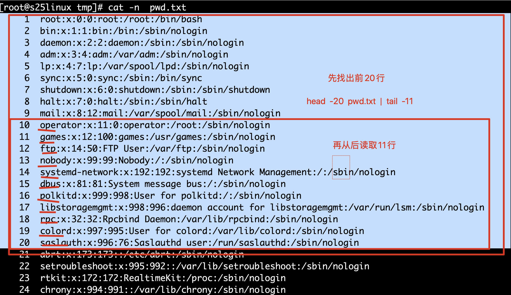

#1.默写常用命令与其意思

pwd打印当前所在目录的绝对路径

touch创建普通文件，linux下文件的后缀没有实际意义，只是一个名字而已

```
touch    hehe.txt
touch     xixi 
以上的hehe.txt和xixi没有任何的区别，只要是通过touch命令创建的，就是一个普通文件，后缀只是给程序员看起来比较人性化，一眼就知道是什么作用的含义

touch   socket.py  #一眼就知道是用python写的普通文件，脚本文件 

#为何指出如上的内容，因为windows下文件后缀是有实际意义和区别
```


ifconfig可设置网络设备的状态

mkdir创建文件夹

tree以树状图显示层级结构

top查看linux的动态资源使用情况，这个命令是多个命令结果的整合，类似于windows的任务管理器

```
top可以看到系统运行时间，负载情况  uptime
cpu
内存  free  -m   #读取内存使用情况，以MB的单位显示
动态进程等信息  ps  -ef 
```

man用于查看命令的帮助文档

rm删除文件

echo输出字符串

cat查看文件的内容

du统计文件的大小

cp拷贝文件

mv移动文件,重命名

find在服务器上搜索文件，文件夹

grep过滤文件中所需要的信息

ls展示当前目录中的目录和文件

cd切换目录

kill杀死进程

#2.如何查看Linux的环境变量，路径以什么符号分割？如何修改PATH变量，以及永久修改PATH？

查看Linux环境变量：`echo $PATH`，每个不同的路径用 : 分割

临时修改linux的PATH变量

[root@vm_0_8_centos /]#  `PATH="/usr/local/sbin:/usr/local/bin:/usr/sbin:/usr/bin:/root/bin"`

永久修改PATH：需要修改/etc/profile文件中的内容
在vim /etc/profile添加如下内容

PATH="/usr/local/sbin:/usr/local/bin:/usr/sbin:/usr/bin:/root/bin"

在退出linux远程会话，重新连接的时候，系统会自动读取这个文件中所有的变量定义，因此达到永久生效的效果

#3.反复练习绝对路径，相对路径

在/home/目录创建文件夹oldboy,进入oldboy创建helloLinux.txt

[root@vm_0_8_centos home]# mkdir oldboy
[root@vm_0_8_centos home]# cd oldboy/
[root@vm_0_8_centos oldboy]# touch helloLinux.txt
创建/tmp/chaogeLinux.txt，用绝对路径方式与相对路径两种方法

[root@vm_0_8_centos oldboy]# touch /tmp/chaogeLinux.txt  #绝对路径写法
[root@vm_0_8_centos oldboy]# cat /tmp/chaogeLinux.txt 
[root@vm_0_8_centos oldboy]# rm /tmp/chaogeLinux.txt
rm: remove regular empty file ‘/tmp/chaogeLinux.txt’? y
[root@vm_0_8_centos oldboy]# touch ../../tmp/chaogeLinux.txt #相对路径的写法
[root@vm_0_8_centos oldboy]# rm /tmp/chaogeLinux.txt
rm: remove regular empty file ‘/tmp/chaogeLinux.txt’? y
在/tmp/目录下创建chaogeDir目录

[root@vm_0_8_centos oldboy]# mkdir /tmp/chaogeDir   #绝对路径写法
[root@vm_0_8_centos oldboy]# rmdir /tmp/chaogeDir/
#4.解释 linux下 >, >> 符号是什么意思?
‘>’表示的是重定向输出覆盖符

'>>'表示的是重定向输出 追加符

#5.找到服务器上所有 以.txt结尾的普通文件

```
插曲
在linux下以.开头的文件是隐藏文件

例如 touch .你看不到我.txt

#找出服务器上所有的.txt 后缀的普通文件

find  /  -type  f  -name "*.txt"  
```


[root@vm_0_8_centos oldboy]# find / -name "*.txt"
/etc/pki/nssdb/pkcs11.txt
/home/oldboy/helloLinux.txt
/usr/lib/python2.7/site-packages/oauthlib-2.0.1-py2.7.egg-info/dependency_links.txt
/usr/lib/python2.7/site-packages/oauthlib-2.0.1-py2.7.egg-info/top_level.txt略....

#6.查看进程，并且过滤出有关python的进程

[root@vm_0_8_centos ~]# ps -ef | grep python
root 987 1 0 Feb13 ? 00:00:07 /usr/bin/python2 -Es /usr/sbin/tuned -l -P
root 11597 11504 0 18:53 pts/1 00:00:00 grep --color=auto python

#7.如何树状图显示django的项目文件内容

tree /s25django/

#8.如何查看rm命令的详细使用信息？

man rm

#9.读取/etc/passwd文件内容，写入到/tmp/pwd.txt文件中，（用两种方式）

[root@vm_0_8_centos ~]# cp /etc/passwd /tmp/pwd.txt
[root@vm_0_8_centos ~]# cat /etc/passwd > /tmp/pwd2.txt

#10.在linux编写二个socket脚本，能够运行一个服务端，一个客户端，能send，recv接收消息即可

服务端:
[root@vm_0_8_centos tmp]# vim server.py

\#!coding:utf-8
import socket
sk = socket.socket()
sk.bind(('127.0.0.1',8005))
sk.listen(2)
conn,addr = sk.accept()
msg = conn.recv(1024).decode('utf-8')
print msg

[root@vm_0_8_centos tmp]# python server.py
hello

客户端
[root@vm_0_8_centos tmp]# vim client.py

\#!coding:utf-8
import socket
sk = socket.socket()
sk.connect(('127.0.0.1',8005))
sk.send("hello".encode('utf-8'))

[root@vm_0_8_centos tmp]# python client.py

#11.读取第十题的socket服务端脚本，且显示行号

[root@vm_0_8_centos tmp]# cat -n server.py

#12.拷贝/tmp下所有的内容，放到/optbak文件夹下

[root@vm_0_8_centos tmp]# cp -r /tmp/*     /optbak  #最好还是添加*通配符

#13.给第十题的socket客户端脚本，改个名字

[root@vm_0_8_centos tmp]# mv server.py my_server.py

#14.移动第十题的2个socket脚本，放入到/Learn_linux目录下

[root@vm_0_8_centos tmp]# mv my_server.py /LearnLinux/
[root@vm_0_8_centos tmp]# mv client.py /LearnLinux/
[root@vm_0_8_centos tmp]# ls /LearnLinux/
client.py my_server.py
#15.给启动django的命令做一个简单的别名
python3 manage.py runserver 0.0.0.0:8000

alias start="python3 manage.py runserver 0.0.0.0:8000"

#16.搜索linux中所有超过100M的 压缩文件（后缀是*.gz）

[root@vm_0_8_centos tmp]# find / -size +100M -name "*.gz"

#17.搜索linux中名字有关django的文件夹

[root@vm_0_8_centos tmp]# find / -type d  -name django

#18.过滤出settings.py配置文件中的有益信息（非空，非注释行）

cat ./settings.py | grep -v "^#" | grep -v "^$"  #写的很好，有没有其他方式了，其他写法

 grep -v "^#"  setings.py  |grep -v "^$"   #另一种写法，效果同上


#19.过滤出 /etc/passwd文件中有关root的行，注意大小写

[root@vm_0_8_centos tmp]# cat /etc/passwd | grep -i root  #可以适当的考虑，是否加上-i参数，忽略大小写

#20.实时刷新文件/var/log/nginx/access.log日志的内容变化

[root@vm_0_8_centos tmp]# tail -f /var/log/nginx/access.log #此文件必须存在

#21.查看settings.py文件前10行

head /usr/lib/python2.7/site-packages/cloud_init-17.1-py2.7.egg/cloudinit/settings.py

#22.查看/etc/passwd文件的 10~20行的内容

[root@vm_0_8_centos tmp]# cat -n /etc/passwd | sed -n '10,20p' /etc/passwd

```
如何用 head和tail读取 10~20行的内容
[root@s25linux tmp]# head -20  pwd.txt |tail -11
```



# 23.传输本地的/tmp/pwd.txt到192.168.1.11服务器的/tmp目录

[root@vm_0_8_centos tmp]# scp /tmp/pwd.txt root@192.168.1.11:/tmp/

#24.如何在/home/python目录，执行/home/my_first.py文件?

[root@vm_0_8_centos python]# python /home/my_first.py  #直接使用绝对路径，绝不会出错，不用考虑当前位置

如果是相对路径，如何写？

```
/home/python/     /home/my_first.py

python  ../my_first.py
```


#25.向my_first.py文件中写入"Life is short,I use python"

[root@vm_0_8_centos home]# cat >> my_first.py << EOF

Life is short, I use python
EOF
[root@vm_0_8_centos home]# cat my_first.py
Life is short, I use python


```
echo "Life is short,I use python"   >  my_fisrt.py  #另一种写法
```


#26.找一下python命令在哪

[root@vm_0_8_centos tmp]# which python
/usr/bin/python

#27.查看/var/log/文件夹大小

[root@vm_0_8_centos tmp]# du -sh /var/log/
209M /var/log/

#28.如何查看服务器的负载信息？

top

#29.如何查看服务器是否运行了mysql?有哪些验证方式

[root@vm_0_8_centos home]# ps -ef | grep "mysql"   #寻找mysql相关的进程 
root 3056 14027 0 20:59 pts/3 00:00:00 grep --color=auto mysql

```
#检查端口
netstat -tunlp  |grep  3306  
```


#30.如何杀死django进程？

```
解读上面的答案，是完全错误的!
ps -ef | grep "django"   #ps -ef命令查出来的是，执行进程时敲的命令 
  
#启动django的命令  python3  manage.py runserver 
  
  
#正确的杀死django的方式流程是

1.过滤出django相关的进程
ps -ef|grep  "uwsgi"  #线上用uwsgi+django形式启动
#在本地测试可以如下命令杀死
ps -ef|grep  "python"  #过滤和python有关的进程 
  
```


