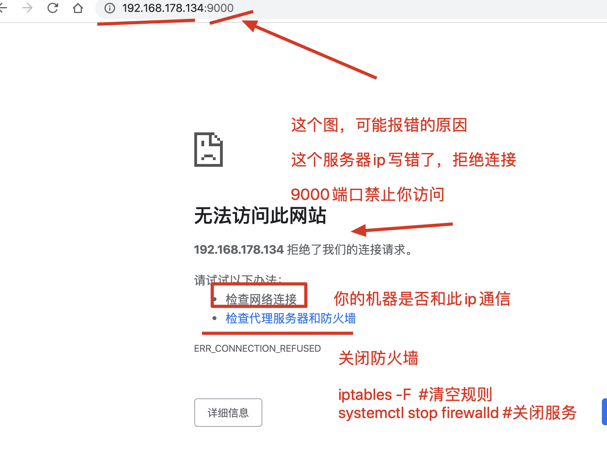
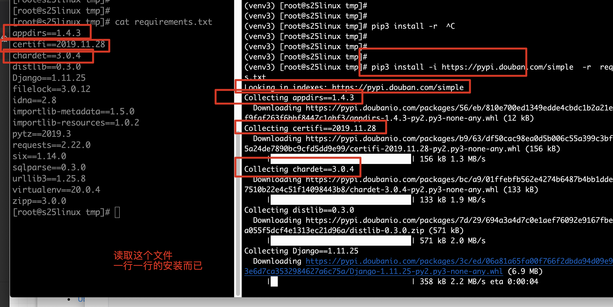
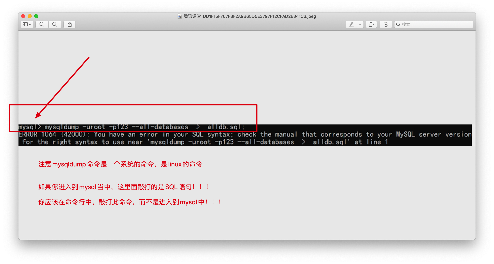

##linux下python3环境搭建

linux安装软件有哪些方式？

- rpm软件包 手动安装，拒绝此方式，需要手动解决依赖关系
- yum自动化安装，自动处理依赖关系，非常好用
- 源代码编译安装，可自定义的功能更多，指定软件安装路径
- 二进制源代码下载，此软件已经被编译安装过，生成了可执行的文件
  - 下载压缩包后，直接解压缩即可使用


```
编译安装python3的步骤

1.很重要，必须执行此操作，安装好编译环境，c语言也是编译后运行，需要gcc编译器golang，对代码先编译，再运行，python是直接运行
yum install gcc patch libffi-devel python-devel  zlib-devel bzip2-devel openssl-devel ncurses-devel sqlite-devel readline-devel tk-devel gdbm-devel db4-devel libpcap-devel xz-devel -y

2.获取python的源代码，下载且安装，下载源代码包的形式，自由选择
用windows的迅雷极速下载，下载完了之后，发送给linux机器即可
mac的同学，可以用scp或者等传输工具

windows的同学可以用lrzsz(yum install lrzsz -y )，xftp(自行去网站下载，支持断点续传，大文件传输)等文件传输工具

wget  https://www.python.org/ftp/python/3.6.9/Python-3.6.9.tgz 

3.下载完源代码包之后，进行解压缩
tar -zxvf Python-3.6.9.tgz 

4.解压缩完毕之后，生成了python369的源代码目录，进入源代码目录准备开始编译
cd Python-3.6.9

5.此时准备编译三部曲 ，编译的第一曲：指定python3的安装路径，以及对系统的开发环境监测，使用如下命令
#命令解释
#  configure 是一个脚本文件，用于告诉gcc编译器，python3即将安装到哪里，以及对基础的开发环境检查，检查openssl，检查sqllite，等等
# 编译第一曲，结束后，主要是生成makefile，用于编译的

[root@s25linux Python-3.6.9]# ./configure --prefix=/opt/python369/    

#编译第二曲：开始进行软件编译
直接输入 make指令即可

#编译第三曲：编译安装，生成python3的可执行程序，也就是生成/opt/python369/
make install    

#编译的第二曲，和第三曲，可以简写成  make && make install   #代表make成功之后，继续make install 

6.等待出现如下结果，表示python3编译安装结束了
Successfully installed pip-18.1 setuptools-40.6.2

7.此时可以去检查python3的可执行程序目录
[root@s25linux bin]# pwd
/opt/python369/bin


8.配置PATH环境变量 ，永久修改PATH，添加Python3的bin目录放入PATH开头位置
vim /etc/profile
写入如下内容
PATH="/opt/python369/bin:/usr/local/sbin:/usr/local/bin:/usr/sbin:/usr/bin:"

9.手动读取/etc/profile，加载文件中的所有变量
source  /etc/profile  

10.检查python3的目录，以及pip3的绝对路径
[root@s25linux bin]# which pip3
/opt/python369/bin/pip3

[root@s25linux bin]# which python3
/opt/python369/bin/python3

```


window上安装lol的过程

```
1.下载lol可执行安装文件  lol.ext
2.双击安装 ，首次应该是指定lol的安装位置 
3.下一步开始安装，lol会检查系统的微软的基础游戏运行组件，如果缺少某组件，游戏会安装失败(缺少什么就安装什么即可)，如果微软的开发环境正常，则正常安装
4.直到游戏安装完毕，生成可执行的游戏执行程序
5.进入游戏安装目录，开始使用

linux平台安装软件，也是这个过程，只不过用命令行代替了点点的操作
```

### 创建django项目，linux运行django

注意你的python3版本，和django的版本，是否合适！！


讲师机环境

python3.6.9  

django选择用1.11.25 

```
1.安装django模块
pip3 install -i https://pypi.douban.com/simple  django==1.11.25 
#检查一下pip3的模块信息
pip3 list

2.升级pip3工具
pip3 install  -i https://pypi.douban.com/simple  --upgrade pip

3.在linux平台，使用命令创建django项目了
 django-admin  startproject  dj1
 
 4.创建一个app01
 [root@s25linux dj1]# django-admin startapp app01
 
 5.编写一个视图函数，hello视图，修改app01，【访问hello视图，返回字符串，s25期的靓仔们很强】
 
 5.1  修改django的settings.py ，注册app01 ，修改如下
 		#并且修改允许访问的主机列表
 		
# 默认只允许 本地 127.0.0.1访问
# 启动在了linux的机器上 ，如果不修改windows无法访问
# 写一个 * 表示允许所有的主机访问
ALLOWED_HOSTS = ["*"]

   INSTALLED_APPS = [
      'django.contrib.admin',
      'django.contrib.auth',
      'django.contrib.contenttypes',
      'django.contrib.sessions',
      'django.contrib.messages',
      'django.contrib.staticfiles',
      'app01',
  ]
  
 
 
 5.2 先修改django的 urls.py
      from django.conf.urls import url
      from django.contrib import admin
      from app01 import views
      urlpatterns = [
          url(r'^admin/', admin.site.urls),
          url(r'^hello/', views.hello),
      ]


5.3 编写django的app01.views，添加如下代码
  from django.shortcuts import render,HttpResponse

  def hello(requests):
      return HttpResponse("s25期的靓仔们很强")


6. 进行数据库迁移
[root@s25linux dj1]# python3 manage.py migrate

6.1.指定ip和端口，启动django
[root@s25linux mysite]# python3  manage.py  runserver 0.0.0.0:9000

7.如何访问django项目？
访问linux的ip地址+django的端口

8.出现无法访问的问题，要根据报错去思考，到底是什么问题
 网站直接是白屏，白花花什么都看不见，
```




照着笔记，完成python3和django环境的搭建，运行出页面 “s25期的靓仔们很强”


```
linux编译安装软件的步骤

1.获取软件的源代码，去官网下载最新的，或者指定版本
2.解压缩源代码
3.进入源代码目录，开始编译三部曲，指定安装路径，make，make install
4.软件编译安装结束后，配置PATH环境变量，能够便捷的访问命令

```


## virtualenv虚拟环境工具

需要用虚拟环境的背景

‘


```
virtualenv 可以在系统中建立多个不同并且相互不干扰的虚拟环境。
python3的虚拟环境工具配置
1.下载虚拟环境工具
pip3 install -i https://pypi.tuna.tsinghua.edu.cn/simple virtualenv

2.通过命令行创建虚拟环境
#pip3安装的模块会放在这里
[root@s25linux ~]# find /opt/python369/  -name site-packages
/opt/python369/lib/python3.6/site-packages
#  --python=python3  指定venv虚拟解释器，以哪个解释器为本体

# 这个命令如果你用相对路径，就得注意你在哪敲打的此命令
[root@s25linux opt]# virtualenv --python=python  venv1

3.创建好venv1之后，需要激活方可使用，这个激活其实就是在修改PATH而已
[root@s25linux bin]# source /opt/venv1/bin/activate
(venv1) [root@s25linux bin]#

4.明确虚拟环境下venv1的解释器是干净隔离的
(venv1) [root@s25linux bin]# which python3
/opt/venv1/bin/python3
(venv1) [root@s25linux bin]#
(venv1) [root@s25linux bin]#
(venv1) [root@s25linux bin]# which pip3
/opt/venv1/bin/pip3
(venv1) [root@s25linux bin]#
(venv1) [root@s25linux bin]# pip3 list
Package    Version
---------- -------
pip        20.0.2
setuptools 45.2.0
wheel      0.34.2


5.在venv1中安装django1
(venv1) [root@s25linux opt]# pip3 install -i https://pypi.douban.com/simple django==1.11.9
(venv1) [root@s25linux opt]# django-admin  startproject  venv1_dj119


6.再开一个ssh窗口，再创建venv2，用于运行django2 版本
virtualenv --python=python  venv2
激活虚拟环境venv2
[root@s25linux opt]# source /opt/venv2/bin/activate
创建django版本2的项目
pip3 install -i https://pypi.douban.com/simple django==2.0.1
创建diango2项目
django-admin  startproject  venv2_dj2


7.分别启动2个版本的django，浏览器访问效果


8.deactivate  #直接执行此命令，退出虚拟环境，系统会自动删除venv的PATH，也就表示退出了
```

激活虚拟环境的原理图


```
利用了虚拟环境，可以分别运行多个干净、隔离的python web环境
```


## 保证开发环境，生产环境python模块一致性

软件开发的环境

小公司，服务器环境可能没那么严格（本地开发人员+测试环境+线上环境）

大公司，（本地环境+测试环境+预生产环境+线上环境）


Python web开发组 

- 开发环境（windows，macOS，ubuntu，本地开发代码的一个环境），装python3  pip3项目依赖的模块
  - python3环境
  - mysql环境
  - redis环境
  - vue
  - nginx
- 测试服务器，代码测试bug，以上的环境，还得再搭一遍，测试服务器才能运行项目
  - 
- 线上服务器，还得环境搭建一遍，，，，很难受。。


如何解决环境问题？

1. 虚拟机的模板克隆，打包好一个基础开发环境，克隆多份，生产多个部署环境
2. 利用docker容器技术的，一个镜像打包技术


-----

在这里，是看一下

在windows开发一个项目，pip3 安装了很多的模块，最终该项目才可以运行，比如crm代码

代码上传到一个新的服务器，是一个空的环境，还得在部署一遍，比如crm代码

```
土办法：运行代码，查看报错，一个一个模块单独去安装解决

不那么土的办法：
pip3 freeze  > requirements.txt  #把你当前解释器所有用到的模块，信息导出到一个文件中

1.在windows的cmd命令行中，通过此命令导出模块信息
pip3 freeze  > requirements.txt 

2.把此文件发送给linux机器，或者直接拷贝其内容，也可以
在linux机器上，安装此文件即可，自动读取文件每一行的模块信息，自动安装

pip3 install -i https://pypi.douban.com/simple  -r  requirements.txt   


本质用法：这个命令其实就是，将一个解释器的模块信息导出，丢给其他人去安装

学习阶段，模拟使用
1.在物理解释器下，安装各种模块
2.在虚拟环境下，安装此模块文件 


```





## linux启动crm项目

```
1.准备好crm代码，讲师的，或是自己所写的，上传至linux服务器中
lrzsz
xftp
scp

上传至服务器的代码是tf_crm.zip  ，zip用unzip命令解压缩
unzip tf_crm.zip

2.新建一个虚拟环境，用于运行crm
在项目下，生成虚拟环境，便于管理此文件夹
[root@s25linux tf_crm]# virtualenv --python=python  venv_crm

3.立即解决crm运行所需的模块依赖
pip3 freeze > requirements.txt  
上传至linux服务器
在venv_crm虚拟环境中，安装此文件即可

如果没有此模块依赖文件，那么就手动解决吧，。。。。
此时你要注意
python3  manage.py runserver 这个命令，并不是让你启动django项目的！！！
因为此命令，调用的是python 内置的wsgiref单机socket模块，性能低下，单进程单线程。。。

#手动安装所有模块
pip3 install -i https://pypi.douban.com/simple django==1.11.25
(venv_crm) [root@s25linux tf_crm]# pip3 install -i https://pypi.douban.com/simple pymysql
(venv_crm) [root@s25linux tf_crm]# pip3 install -i https://pypi.douban.com/simple django-multiselectfield

4.缺少mysql，因此需要安装mariadb，且启动
(venv_crm) [root@s25linux tf_crm]# yum install mariadb-server  mariadb -y

是否激活虚拟环境，会影响yum工具吗？ 
不会，因为激活虚拟环境，只是添加了一个PATH而已，只会影响python相关的操作，不会影响到其他的linux命令....
无论是否激活虚拟环境，也不会影响yum等等..

5.启动mariadb数据库
(venv_crm) [root@s25linux tf_crm]# systemctl start mariadb

6.注意可能需要修改django的settings.py有关数据库连接的账密信息等

7.还要注意，由于数据库是空的，还得进行数据库表的导入，导出本地数据库表，导出
# 参数--all-databases能够导出所有的数据库，表，也可以指定某一个数据库。表导出
大家使用此命令行就可以了！！！！导出所有的库表，然给交给linux导入
大家使用此命令行就可以了！！！！导出所有的库表，然给交给linux导入
大家使用此命令行就可以了！！！！导出所有的库表，然给交给linux导入
mysqldump  -uroot -p  --all-databases   >  alldb.sql 

#冯浩敲打的命令，如下，指定数据库导出
# -d 参数是只导出表结构，不要表中的数据
mysqldump -uroot -p123 -d tf_crm > tf_crm.sql  

8.发送此alldb.sql文件，给linux机器，再进行数据导入
就是将第七步的SQL文件，通过lrzsz、scp、xftp等方式，发送此文件，给linux
mysql -uroot -p  <  /opt/alldb.sql

9.此时再次尝试启动crm项目
(venv_crm) [root@s25linux tf_crm]# python3 manage.py runserver 0.0.0.0:9090
```

###mysql导出数据的命令

```
数据库备份与恢复
mysqldump命令用于备份数据库数据

[root@master ~]# mysqldump -u root -p --all-databases > /tmp/db.dump

2.导出db1、db2两个数据库的所有数据

mysqldump -uroot -proot --databases db1 db2 >/tmp/user.sql
```





部署步骤并不难，做好笔记，按照流水线来操作即可

vue前后端分离的部署，难度会+1

virtualenvwrapper是吧，那个是virtualenv的升级版，用哪个都一样，都是创建多个虚拟环境

virtualenv不支持查看所有虚拟环境，virtualenvwrapper支持，是 lsvirtualenv命令

## uwsgi启动python web

让你的django在linux上，支持并发形式启动，支持多进程，多线程，乃至于协程的一个C语言编写的高性能工具

```
1.安装uwsgi工具
pip3 install -i https://pypi.douban.com/simple  uwsgi

2.编写uwsgi.ini配置文件，以多进程形式启动tf_crm
touch uwsgi.ini  #手动创建此uwsgi的配置文件，写入如下的内容参数，去启动crm
# 写入如下的功能性的参数配置，用于启动项目
# 这些部署的流程，是国外的uwsgi官网，给与的用法，我们照着用即可
# 注意要根据你自己的目录，修改如下的参数

[uwsgi]
# Django-related settings
# the base directory (full path)
#  填写crm项目的第一层绝对路径
chdir           = /opt/tf_crm/
# Django's wsgi file
# 填写crm项目第二层的相对路径，找到第二层目录下的wsgi.py
# 这里填写的不是路径，是以上一个参数为相对，找到第二层项目目录下的wsgi.py文件
module          = tf_crm.wsgi
# the virtualenv (full path)
# 填写虚拟环境解释器的第一层工作目录 
home            = /opt/tf_crm/venv_crm
# process-related settings
# master
master          = true
# maximum number of worker processes
# 代表定义uwsgi运行的多进程数量，官网给出的优化建议是 2*cpu核数+1 ，单核的cpu填写几?
# 如果是单进程，十万个请求，都丢给一个进程去处理
# 3个工作进程，十万个请求，就分给了3个进程去分摊处理
processes       = 3

# the socket (use the full path to be safe
# 这里的socket参数，是用于和nginx结合部署的unix-socket参数，这里临时先暂停使用
# socket          = 0.0.0.0:8000
#  线上不会用http参数，因为对后端是不安全的，使用socket参数是安全的连接，用nginx反向代理去访问
# 后端程序是运行在防火墙内部，外网是无法直接访问的
# 临时使用http参数，便于我们用浏览器调试访问
http =  0.0.0.0:8000

# ... with appropriate permissions - may be needed
# chmod-socket    = 664
# clear environment on exit
vacuum          = true


3.此时可以用命令，基于uwsgi协议的一个高性能web后端启动了
uwsgi  --ini  ./uwsgi.ini  #指定配置文件启动后端

4.此时crm项目，已经用uwsgi支持了3个进程的启动了，但是由于uwsgi对静态文件的解析性能很弱，线上是丢给nginx去处理的

5.未完待续。。。留在部署时候再讲
```


## supervisor进程管理工具


