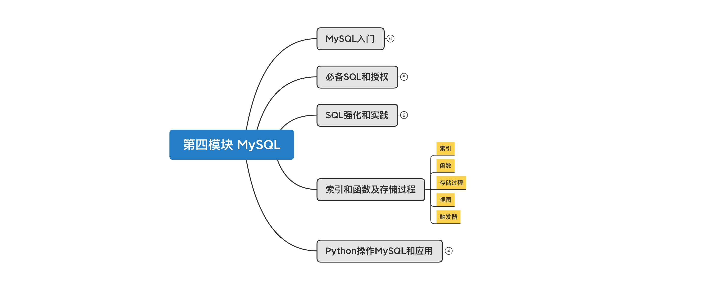
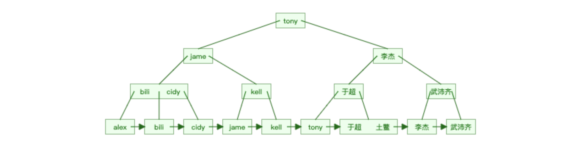
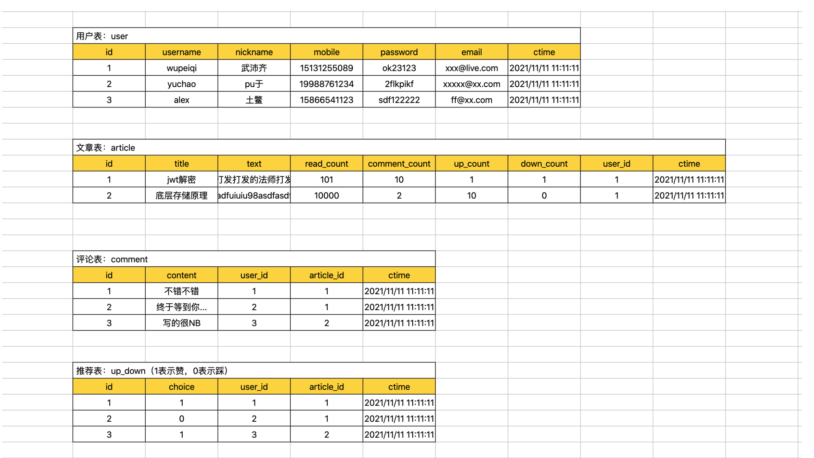
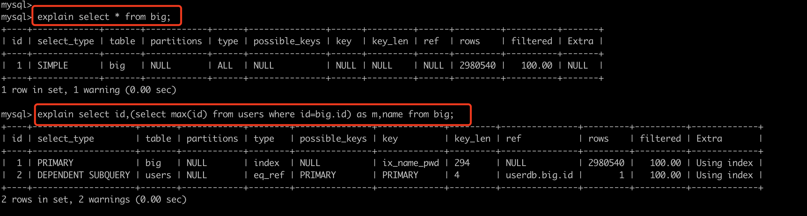
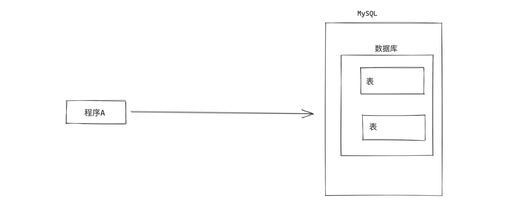

# day28 索引和函数及存储过程



课程目标：了解MySQL中索引、函数、存储过程、函数、触发器、视图等知识点。

课程概要：

- 索引
- 函数
- 存储过程
- 视图
- 触发器


## 1. 索引

在数据库中索引最核心的作用是：**加速查找**。  例如：在含有300w条数据的表中查询，无索引需要700秒，而利用索引可能仅需1秒。

```
mysql> select * from big where password="81f98021-6927-433a-8f0d-0f5ac274f96e";
+----+---------+---------------+--------------------------------------+------+
| id | name    | email         | password                             | age  |
+----+---------+---------------+--------------------------------------+------+
| 11 | wu-13-1 | w-13-1@qq.com | 81f98021-6927-433a-8f0d-0f5ac274f96e |    9 |
+----+---------+---------------+--------------------------------------+------+
1 row in set (0.70 sec)

mysql> select * from big where id=11;
+----+---------+---------------+--------------------------------------+------+
| id | name    | email         | password                             | age  |
+----+---------+---------------+--------------------------------------+------+
| 11 | wu-13-1 | w-13-1@qq.com | 81f98021-6927-433a-8f0d-0f5ac274f96e |    9 |
+----+---------+---------------+--------------------------------------+------+
1 row in set (0.00 sec)

mysql> select * from big where name="wu-13-1";
+----+---------+---------------+--------------------------------------+------+
| id | name    | email         | password                             | age  |
+----+---------+---------------+--------------------------------------+------+
| 11 | wu-13-1 | w-13-1@qq.com | 81f98021-6927-433a-8f0d-0f5ac274f96e |    9 |
+----+---------+---------------+--------------------------------------+------+
1 row in set (0.00 sec)
```

在开发过程中会为哪些 经常会被搜索的列 创建索引，以提高程序的响应速度。例如：查询手机号、邮箱、用户名等。


### 1.1 索引原理

为什么加上索引之后速度能有这么大的提升呢？ 因为索引的底层是基于B+Tree的数据结构存储的。




很明显，如果有了索引结构的查询效率比表中逐行查询的速度要快很多且数据量越大越明显。

B+Tree结构连接：https://www.cs.usfca.edu/~galles/visualization/BPlusTree.html


数据库的索引是基于上述B+Tree的数据结构实现，但在创建数据库表时，如果指定不同的引擎，底层使用的B+Tree结构的原理有些不同。

- myisam引擎，非聚簇索引（数据 和 索引结构 分开存储）

- innodb引擎，聚簇索引（数据 和 主键索引结构存储在一起）


#### 1.1.1 非聚簇索引（mysiam引擎）

```sql
create table 表名(
    id int not null auto_increment primary key, 
    name varchar(32) not null,
    age int
)engine=myisam default charset=utf8;
```


#### 1.1.2 聚簇索引（innodb引擎）

```sql
create table 表名(
    id int not null auto_increment primary key, 
    name varchar(32) not null,
    age int
)engine=innodb default charset=utf8;
```


在MySQL文件存储中的体现：

```
root@192 userdb # pwd
/usr/local/mysql/data/userdb
root@192 userdb # ls -l
total 1412928
-rw-r-----  1 _mysql  _mysql       8684 May 15 22:51 big.frm，表结构。
-rw-r-----  1 _mysql  _mysql  717225984 May 15 22:51 big.ibd，数据和索引结构。
-rw-r-----  1 _mysql  _mysql       8588 May 16 11:38 goods.frm
-rw-r-----  1 _mysql  _mysql      98304 May 16 11:39 goods.ibd
-rw-r-----  1 _mysql  _mysql       8586 May 26 10:57 t2.frm，表结构
-rw-r-----  1 _mysql  _mysql          0 May 26 10:57 t2.MYD，数据
-rw-r-----  1 _mysql  _mysql       1024 May 26 10:57 t2.MYI，索引结构
```


上述 聚簇索引 和 非聚簇索引 底层均利用了B+Tree结构结构，只不过内部数据存储有些不同罢了。

在企业开发中一般都会使用 innodb 引擎（内部支持事务、行级锁、外键等特点），在MySQL5.5版本之后默认引擎也是innodb。

```sql
mysql> show create table users \G;
*************************** 1. row ***************************
       Table: users
Create Table: CREATE TABLE `users` (
  `id` int(11) NOT NULL AUTO_INCREMENT,
  `name` varchar(32) DEFAULT NULL,
  `password` varchar(64) DEFAULT NULL,
  `ctime` datetime DEFAULT NULL,
  `age` int(11) DEFAULT '5',
  PRIMARY KEY (`id`)
) ENGINE=InnoDB AUTO_INCREMENT=11 DEFAULT CHARSET=utf8
1 row in set (0.00 sec)

ERROR:
No query specified

mysql> show index from users \G;
*************************** 1. row ***************************
        Table: users
   Non_unique: 0
     Key_name: PRIMARY
 Seq_in_index: 1
  Column_name: id
    Collation: A
  Cardinality: 3
     Sub_part: NULL
       Packed: NULL
         Null:
   Index_type: BTREE   -- 虽然显示BTree，但底层数据结构基于B+Tree。
      Comment:
Index_comment:
1 row in set (0.00 sec)

ERROR:
No query specified

mysql>
```

innodb引擎，一般创建的索引：聚簇索引。


### 1.2 常见索引

在innodb引擎下，索引底层都是基于B+Tree数据结构存储（聚簇索引）。


在开发过程中常见的索引类型有：

- 主键索引：加速查找、不能为空、不能重复。 + 联合主键索引
- 唯一索引：加速查找、不能重复。  + 联合唯一索引
- 普通索引：加速查找。 + 联合索引


#### 1.2.1 主键和联合主键索引

```sql
create table 表名(
    id int not null auto_increment primary key,   -- 主键
    name varchar(32) not null
);

create table 表名(
    id int not null auto_increment,
    name varchar(32) not null,
    primary key(id)
);

create table 表名(
    id int not null auto_increment,
    name varchar(32) not null,
    primary key(列1,列2)          -- 如果有多列，称为联合主键（不常用且myisam引擎支持）
);
```

```sql
alter table 表名 add primary key(列名);
```

```sql
alter table 表名 drop primary key;
```

注意：删除索引时可能会报错，自增列必须定义为键。

```
ERROR 1075 (42000): Incorrect table definition; there can be only one auto column and it must be defined as a key

alter table 表 change id id int not null;
```

```sql
create table t7(
    id int not null,
    name varchar(32) not null,
    primary key(id)
);

alter table t6 drop primary key;
```


#### 1.2.2 唯一和联合唯一索引

```sql
create table 表名(
    id int not null auto_increment primary key,
    name varchar(32) not null,
    email varchar(64) not null,
    unique ix_name (name),
    unique ix_email (email),
);

create table 表名(
    id int not null auto_increment,
    name varchar(32) not null,
    unique (列1,列2)               -- 如果有多列，称为联合唯一索引。
);
```

```sql
create unique index 索引名 on 表名(列名);
```

```sql
drop unique index 索引名 on 表名;
```


#### 1.2.3 索引和联合索引

```sql
create table 表名(
    id int not null auto_increment primary key,
    name varchar(32) not null,
    email varchar(64) not null,
    index ix_email (email),
    index ix_name (name),
);

create table 表名(
    id int not null auto_increment primary key,
    name varchar(32) not null,
    email varchar(64) not null,
    index ix_email (name,email)     -- 如果有多列，称为联合索引。
);
```

```sql
create index 索引名 on 表名(列名);
```

```sql
drop index 索引名 on 表名;
```


在项目开发的设计表结构的环节，大家需要根据业务需求的特点来决定是否创建相应的索引。

#### 案例：博客系统



- 每张表id列都创建 自增 + 主键。
- 用户表
  - 用户名 + 密码 创建联合索引。
  - 手机号，创建唯一索引。
  - 邮箱，创建唯一索引。
- 推荐表
  - user_id和article_id创建联合唯一索引。


### 1.3 操作表

在表中创建索引后，查询时一定要命中索引。


在数据库的表中创建索引之后优缺点如下：

- 优点：查找速度快、约束（唯一、主键、联合唯一）
- 缺点：插入、删除、更新速度比较慢，因为每次操作都需要调整整个B+Tree的数据结构关系。

所以，在表中不要无节制的去创建索引啊。。。


在开发中，我们会对表中经常被搜索的列创建索引，从而提高程序的响应速度。


```sql
CREATE TABLE `big` (
    `id` int(11) NOT NULL AUTO_INCREMENT,
    `name` varchar(32) DEFAULT NULL,
    `email` varchar(64) DEFAULT NULL,
    `password` varchar(64) DEFAULT NULL,
    `age` int(11) DEFAULT NULL,
    PRIMARY KEY (`id`),                       -- 主键索引
    UNIQUE KEY `big_unique_email` (`email`),  -- 唯一索引
    index `ix_name_pwd` (`name`,`password`)     -- 联合索引
) ENGINE=InnoDB DEFAULT CHARSET=utf8
```


一般情况下，我们针对只要通过索引列去搜搜都可以 `命中` 索引（通过索引结构加速查找）。

```sql
select * from big where id = 5;
select * from big where id > 5;
select * from big where email = "wupeiqi@live.com";
select * from big where name = "武沛齐";
select * from big where name = "kelly" and password="ffsijfs";
...
```


但是，还是会有一些特殊的情况，让我们无法命中索引（即使创建了索引），这也是需要大家在开发中要注意的。


- 类型不一致

  ```sql
  select * from big where name = 123;		-- 未命中
  select * from big where email = 123;	-- 未命中
  
  特殊的主键：
  	select * from big where id = "123";	-- 命中
  ```

- 使用不等于

  ```sql
  select * from big where name != "武沛齐";				-- 未命中
  select * from big where email != "wupeiqi@live.com";  -- 未命中
  
  特殊的主键：
  	select * from big where id != 123;	-- 命中
  ```

- or，当or条件中有未建立索引的列才失效。

  ```sql
  select * from big where id = 123 or password="xx";			-- 未命中
  select * from big where name = "wupeiqi" or password="xx";	-- 未命中
  特别的：
  	select * from big where id = 10 or password="xx" and name="xx"; -- 命中
  ```

- 排序，当根据索引排序时候，选择的映射如果不是索引，则不走索引。

  ```sql
  select * from big order by name asc;     -- 未命中
  select * from big order by name desc;    -- 未命中
  
  特别的主键：
  	select * from big order by id desc;  -- 命中
  ```

- like，模糊匹配时。

  ```sql
  select * from big where name like "%u-12-19999";	-- 未命中
  select * from big where name like "_u-12-19999";	-- 未命中
  select * from big where name like "wu-%-10";		-- 未命中
  
  特别的：
  	select * from big where name like "wu-1111-%";	-- 命中
  	select * from big where name like "wuw-%";		-- 命中
  ```

- 使用函数

  ```sql
  select * from big where reverse(name) = "wupeiqi";  -- 未命中
  
  特别的：
  	select * from big where name = reverse("wupeiqi");  -- 命中
  ```

- 最左前缀，如果是联合索引，要遵循最左前缀原则。

  ```sql
  如果联合索引为：(name,password)
      name and password       -- 命中
      name                 	-- 命中
      password                -- 未命中
      name or password       	-- 未命中
  ```

  

常见的无法命中索引的情况就是上述的示例。

对于大家来说会现在的最大的问题是，记不住，哪怎么办呢？接下来看执行计划。


### 1.4 执行计划

MySQL中提供了执行计划，让你能够预判SQL的执行（只能给到一定的参考，不一定完全能预判准确）。

```
explain + SQL语句;
```



其中比较重要的是 type，他他SQL性能比较重要的标志，性能从低到高依次：`all < index < range < index_merge < ref_or_null < ref < eq_ref < system/const` 

- ALL，全表扫描，数据表从头到尾找一遍。(一般未命中索引，都是会执行权标扫描)

  ```sql
  select * from big;
  
  特别的：如果有limit，则找到之后就不在继续向下扫描.
  	select * from big limit 1;
  ```

- INDEX，全索引扫描，对索引从头到尾找一遍

  ```sql
  explain select id from big;
  explain select name from big;
  ```

- RANGE，对索引列进行范围查找

  ```sql
  explain select * from big where id > 10;
  explain select * from big where id in (11,22,33);
  explain select * from big where id between 10 and 20;
  explain select * from big where name > "wupeiqi" ;
  ```

- INDEX_MERGE，合并索引，使用多个单列索引搜索

  ```sql
  explain select * from big where id = 10 or name="武沛齐";
  ```

- REF，根据 索引 直接去查找（非键）。

  ```sql
  select *  from big where name = '武沛齐';
  ```

- EQ_REF，连表操作时常见。

  ```sql
  explain select big.name,users.id from big left join users on big.age = users.id;
  ```

- CONST，常量，表最多有一个匹配行,因为仅有一行,在这行的列值可被优化器剩余部分认为是常数,const表很快。

  ```sql
  explain select * from big where id=11;					-- 主键
  explain select * from big where email="w-11-0@qq.com";	-- 唯一索引
  ```

- SYSTEM，系统，表仅有一行(=系统表)。这是const联接类型的一个特例。

  ```sql
   explain select * from (select * from big where id=1 limit 1) as A;
  ```


其他列：

```
id，查询顺序标识

z，查询类型
    SIMPLE          简单查询
    PRIMARY         最外层查询
    SUBQUERY        映射为子查询
    DERIVED         子查询
    UNION           联合
    UNION RESULT    使用联合的结果
    ...
    
table，正在访问的表名

partitions，涉及的分区（MySQL支持将数据划分到不同的idb文件中，详单与数据的拆分）。 一个特别大的文件拆分成多个小文件（分区）。

possible_keys，查询涉及到的字段上若存在索引，则该索引将被列出，即：可能使用的索引。
key，显示MySQL在查询中实际使用的索引，若没有使用索引，显示为NULL。例如：有索引但未命中，则possible_keys显示、key则显示NULL。

key_len，表示索引字段的最大可能长度。(类型字节长度 + 变长2 + 可空1)，例如：key_len=195，类型varchar(64)，195=64*3+2+1

ref，连表时显示的关联信息。例如：A和B连表，显示连表的字段信息。

rows，估计读取的数据行数（只是预估值）
	explain select * from big where password ="025dfdeb-d803-425d-9834-445758885d1c";
	explain select * from big where password ="025dfdeb-d803-425d-9834-445758885d1c" limit 1;
filtered，返回结果的行占需要读到的行的百分比。
	explain select * from big where id=1;  -- 100，只读了一个1行，返回结果也是1行。
	explain select * from big where password="27d8ba90-edd0-4a2f-9aaf-99c9d607c3b3";  -- 10，读取了10行，返回了1行。
	注意：密码27d8ba90-edd0-4a2f-9aaf-99c9d607c3b3在第10行
	
extra，该列包含MySQL解决查询的详细信息。
    “Using index”
    此值表示mysql将使用覆盖索引，以避免访问表。不要把覆盖索引和index访问类型弄混了。
    “Using where”
    这意味着mysql服务器将在存储引擎检索行后再进行过滤，许多where条件里涉及索引中的列，当（并且如果）它读取索引时，就能被存储引擎检验，因此不是所有带where子句的查询都会显示“Using where”。有时“Using where”的出现就是一个暗示：查询可受益于不同的索引。
    “Using temporary”
    这意味着mysql在对查询结果排序时会使用一个临时表。
    “Using filesort”
    这意味着mysql会对结果使用一个外部索引排序，而不是按索引次序从表里读取行。mysql有两种文件排序算法，这两种排序方式都可以在内存或者磁盘上完成，explain不会告诉你mysql将使用哪一种文件排序，也不会告诉你排序会在内存里还是磁盘上完成。
    “Range checked for each record(index map: N)”
    这个意味着没有好用的索引，新的索引将在联接的每一行上重新估算，N是显示在possible_keys列中索引的位图，并且是冗余的。
```


### 小结

上述索引相关的内容讲的比较多，大家在开发过程中重点应该掌握的是：

- 根据情况创建合适的索引（加速查找）。
- 有索引，则查询时要命中索引。


## 2. 函数

MySQL中提供了很多函数，为我们的SQL操作提供便利，例如：

```
mysql> select * from d1;
+----+-----------+
| id | name      |
+----+-----------+
|  1 | 武沛齐    |
|  3 | xxx       |
|  4 | pyyu      |
+----+-----------+
3 rows in set (0.00 sec)

mysql> select count(id), max(id),min(id),avg(id) from d1;
+-----------+---------+---------+---------+
| count(id) | max(id) | min(id) | avg(id) |
+-----------+---------+---------+---------+
|         3 |       4 |       1 |  2.6667 |
+-----------+---------+---------+---------+
1 row in set (0.00 sec)

mysql>
mysql>
mysql> select id,reverse(name) from d1;
+----+---------------+
| id | reverse(name) |
+----+---------------+
|  1 | 齐沛武        |
|  3 | xxx           |
|  4 | uyyp          |
+----+---------------+
3 rows in set (0.00 sec)

mysql> select id, reverse(name),concat(name,name), NOW(), DATE_FORMAT( NOW(),'%Y-%m-%d %H:%i:%s')  from d1;
+----+---------------+--------------------+---------------------+-----------------------------------------+
| id | reverse(name) | concat(name,name)  | NOW()               | DATE_FORMAT( NOW(),'%Y-%m-%d %H:%i:%s') |
+----+---------------+--------------------+---------------------+-----------------------------------------+
|  1 | 齐沛武        | 武沛齐武沛齐       | 2021-05-27 09:18:07 | 2021-05-27 09:18:07                     |
|  3 | xxx           | xxxxxx             | 2021-05-27 09:18:07 | 2021-05-27 09:18:07                     |
|  4 | uyyp          | pyyupyyu           | 2021-05-27 09:18:07 | 2021-05-27 09:18:07                     |
+----+---------------+--------------------+---------------------+-----------------------------------------+
3 rows in set (0.00 sec)

mysql> select concat("alex","sb");
+---------------------+
| concat("alex","sb") |
+---------------------+
| alexsb              |
+---------------------+
1 row in set (0.00 sec)

mysql> select sleep(1);
+----------+
| sleep(1) |
+----------+
|        0 |
+----------+
1 row in set (1.00 sec)
```


部分函数列表：

```
CHAR_LENGTH(str)
    返回值为字符串str 的长度，长度的单位为字符。一个多字节字符算作一个单字符。
    对于一个包含五个二字节字符集, LENGTH()返回值为 10, 而CHAR_LENGTH()的返回值为5。

CONCAT(str1,str2,...)
    字符串拼接
    如有任何一个参数为NULL ，则返回值为 NULL。
CONCAT_WS(separator,str1,str2,...)
    字符串拼接（自定义连接符）
    CONCAT_WS()不会忽略任何空字符串。 (然而会忽略所有的 NULL）。

CONV(N,from_base,to_base)
    进制转换
    例如：
        SELECT CONV('a',16,2); 表示将 a 由16进制转换为2进制字符串表示

FORMAT(X,D)
    将数字X 的格式写为'#,###,###.##',以四舍五入的方式保留小数点后 D 位， 并将结果以字符串的形式返回。若  D 为 0, 则返回结果不带有小数点，或不含小数部分。
    例如：
        SELECT FORMAT(12332.1,4); 结果为： '12,332.1000'
INSERT(str,pos,len,newstr)
    在str的指定位置插入字符串
        pos：要替换位置其实位置
        len：替换的长度
        newstr：新字符串
    特别的：
        如果pos超过原字符串长度，则返回原字符串
        如果len超过原字符串长度，则由新字符串完全替换
INSTR(str,substr)
    返回字符串 str 中子字符串的第一个出现位置。

LEFT(str,len)
    返回字符串str 从开始的len位置的子序列字符。

LOWER(str)
    变小写

UPPER(str)
    变大写

LTRIM(str)
    返回字符串 str ，其引导空格字符被删除。
RTRIM(str)
    返回字符串 str ，结尾空格字符被删去。
SUBSTRING(str,pos,len)
    获取字符串子序列

LOCATE(substr,str,pos)
    获取子序列索引位置

REPEAT(str,count)
    返回一个由重复的字符串str 组成的字符串，字符串str的数目等于count 。
    若 count <= 0,则返回一个空字符串。
    若str 或 count 为 NULL，则返回 NULL 。
REPLACE(str,from_str,to_str)
    返回字符串str 以及所有被字符串to_str替代的字符串from_str 。
REVERSE(str)
    返回字符串 str ，顺序和字符顺序相反。
RIGHT(str,len)
    从字符串str 开始，返回从后边开始len个字符组成的子序列

SPACE(N)
    返回一个由N空格组成的字符串。

SUBSTRING(str,pos) , SUBSTRING(str FROM pos) SUBSTRING(str,pos,len) , SUBSTRING(str FROM pos FOR len)
    不带有len 参数的格式从字符串str返回一个子字符串，起始于位置 pos。带有len参数的格式从字符串str返回一个长度同len字符相同的子字符串，起始于位置 pos。 使用 FROM的格式为标准 SQL 语法。也可能对pos使用一个负值。假若这样，则子字符串的位置起始于字符串结尾的pos 字符，而不是字符串的开头位置。在以下格式的函数中可以对pos 使用一个负值。

    mysql> SELECT SUBSTRING('Quadratically',5);
        -> 'ratically'

    mysql> SELECT SUBSTRING('foobarbar' FROM 4);
        -> 'barbar'

    mysql> SELECT SUBSTRING('Quadratically',5,6);
        -> 'ratica'

    mysql> SELECT SUBSTRING('Sakila', -3);
        -> 'ila'

    mysql> SELECT SUBSTRING('Sakila', -5, 3);
        -> 'aki'

    mysql> SELECT SUBSTRING('Sakila' FROM -4 FOR 2);
        -> 'ki'

TRIM([{BOTH | LEADING | TRAILING} [remstr] FROM] str) TRIM(remstr FROM] str)
    返回字符串 str ， 其中所有remstr 前缀和/或后缀都已被删除。若分类符BOTH、LEADIN或TRAILING中没有一个是给定的,则假设为BOTH 。 remstr 为可选项，在未指定情况下，可删除空格。

    mysql> SELECT TRIM('  bar   ');
            -> 'bar'

    mysql> SELECT TRIM(LEADING 'x' FROM 'xxxbarxxx');
            -> 'barxxx'

    mysql> SELECT TRIM(BOTH 'x' FROM 'xxxbarxxx');
            -> 'bar'

    mysql> SELECT TRIM(TRAILING 'xyz' FROM 'barxxyz');
            -> 'barx'   
```

更多函数：https://dev.mysql.com/doc/refman/5.7/en/functions.html


当然，MySQL中也支持让你去自定义函数。

- 创建函数

  ```sql
  delimiter $$
  create function f1(
      i1 int,
      i2 int)
  returns int
  BEGIN
      declare num int;
      declare maxId int;
      select max(id) from big into maxId;
      
      set num = i1 + i2 + maxId;
      return(num);
  END $$
  delimiter ;
  ```

- 执行函数

  ```sql
  select f1(11,22);
  
  select f1(11,id),name from d1;
  ```

- 删除函数

  ```sql
  drop function f1;
  ```


## 3. 存储过程

存储过程，是一个存储在MySQL中的SQL语句集合，当主动去调用存储过程时，其中内部的SQL语句会按照逻辑执行。


- 创建存储过程

  ```sql
  delimiter $$
  create procedure p1()
  BEGIN
      select * from d1;
  END $$
  delimiter ;
  ```

- 执行存储过程

  ```sql
  call p1();
  ```

  ```python
  #!/usr/bin/env python
  # -*- coding:utf-8 -*-
  import pymysql
  
  conn = pymysql.connect(host='127.0.0.1', port=3306, user='root', passwd='root123', db='userdb')
  cursor = conn.cursor(cursor=pymysql.cursors.DictCursor)
  # 执行存储过程
  cursor.callproc('p1')
  result = cursor.fetchall()
  
  cursor.close()
  conn.close()
  
  print(result)
  ```

- 删除存储过程

  ```sql
  drop procedure proc_name;
  ```

  

### 3.1 参数类型

存储过程的参数可以有如下三种：

- in，仅用于传入参数用
- out，仅用于返回值用
- inout，既可以传入又可以当作返回值

```sql
delimiter $$
create procedure p2(
    in i1 int,
    in i2 int,
    inout i3 int,
    out r1 int
)
BEGIN
    DECLARE temp1 int;
    DECLARE temp2 int default 0;
    
    set temp1 = 1;

    set r1 = i1 + i2 + temp1 + temp2;
    
    set i3 = i3 + 100;

end $$
delimiter ;
```

```sql
set @t1 =4;
set @t2 = 0;
CALL p2 (1, 2 ,@t1, @t2);
SELECT @t1,@t2;
```

```python
#!/usr/bin/env python
# -*- coding:utf-8 -*-
import pymysql

conn = pymysql.connect(host='127.0.0.1', port=3306, user='root', passwd='root123', db='userdb')
cursor = conn.cursor(cursor=pymysql.cursors.DictCursor)

# 执行存储过程
cursor.callproc('p2',args=(1, 22, 3, 4))

# 获取执行完存储的参数
cursor.execute("select @_p2_0,@_p2_1,@_p2_2,@_p2_3")
result = cursor.fetchall()
# {"@_p2_0":11 }

cursor.close()
conn.close()

print(result)
```


### 3.2 返回值 & 结果集

```sql
delimiter $$
create procedure p3(
    in n1 int,
    inout n2 int,
    out n3 int
)
begin
    set n2 = n1 + 100;
    set n3 = n2 + n1 + 100;
    select * from d1;
end $$
delimiter ;
```

```sql
set @t1 =4;
set @t2 = 0;
CALL p3 (1,@t1, @t2);
SELECT @t1,@t2;
```

```python
#!/usr/bin/env python
# -*- coding:utf-8 -*-
import pymysql

conn = pymysql.connect(host='127.0.0.1', port=3306, user='root', passwd='root123', db='userdb')
cursor = conn.cursor(cursor=pymysql.cursors.DictCursor)
# 执行存储过程
cursor.callproc('p3',args=(22, 3, 4))
table = cursor.fetchall() # 得到执行存储过中的结果集

# 获取执行完存储的参数
cursor.execute("select @_p3_0,@_p3_1,@_p3_2")
rets = cursor.fetchall()

cursor.close()
conn.close()

print(table)
print(rets)
```


### 3.3 事务 & 异常

事务，成功都成功，失败都失败。

```sql
delimiter $$
create PROCEDURE p4(
    OUT p_return_code tinyint
)
BEGIN 
  DECLARE exit handler for sqlexception 
  BEGIN 
    -- ERROR 
    set p_return_code = 1; 
    rollback; 
  END; 
 
  DECLARE exit handler for sqlwarning 
  BEGIN 
    -- WARNING 
    set p_return_code = 2; 
    rollback; 
  END; 
 
  START TRANSACTION;  -- 开启事务
    delete from d1;
    insert into tb(name)values('seven');
  COMMIT;  -- 提交事务
 
  -- SUCCESS 
  set p_return_code = 0; 
 
  END $$
delimiter ; 
```

```sql
set @ret =100;
CALL p4(@ret);
SELECT @ret;
```

```python
#!/usr/bin/env python
# -*- coding:utf-8 -*-
import pymysql

conn = pymysql.connect(host='127.0.0.1', port=3306, user='root', passwd='root123', db='userdb')
cursor = conn.cursor(cursor=pymysql.cursors.DictCursor)
# 执行存储过程
cursor.callproc('p4',args=(100))

# 获取执行完存储的参数
cursor.execute("select @_p4_0")
rets = cursor.fetchall()

cursor.close()
conn.close()

print(table)
print(rets)
```


### 3.4 游标

```sql
delimiter $$
create procedure p5()
begin 
    declare sid int;
    declare sname varchar(50); 
    declare done int default false;


    declare my_cursor CURSOR FOR select id,name from d1;
    
    DECLARE CONTINUE HANDLER FOR NOT FOUND SET done = TRUE;
    
    open my_cursor;
        xxoo: LOOP
            fetch my_cursor into sid,sname;
            IF done then 
                leave xxoo;
            END IF;
            insert into t1(name) values(sname);
        end loop xxoo;
    close my_cursor;
end $$
delimiter ; 
```

```sql
call p5();
```


## 4.视图

视图其实是一个虚拟表（非真实存在），其本质是【根据SQL语句获取动态的数据集，并为其命名】，用户使用时只需使用【名称】即可获取结果集，并可以将其当作表来使用。

```sql
SELECT
    *
FROM
    (SELECT nid,name FROM tb1 WHERE nid > 2) AS A
WHERE
    A.name > 'alex';
```

- 创建视图

  ```sql
  create view v1 as select id,name from d1 where id > 1;
  ```

- 使用视图

  ```sql
  select * from v1;
  
  -- select * from (select id,name from d1 where id > 1) as v1;
  ```

- 删除视图

  ```sql
  drop view v1;
  ```

- 修改视图

  ```sql
  alter view v1 as SQL语句
  ```


注意：基于视图只能查询，针对视图不能执行 增加、修改、删除。 如果源表发生变化，视图表也会发生变化。


## 5.触发器



对某个表进行【增/删/改】操作的前后如果希望触发某个特定的行为时，可以使用触发器。

```sql
# 插入前
CREATE TRIGGER tri_before_insert_tb1 BEFORE INSERT ON tb1 FOR EACH ROW
BEGIN
    ...
END

# 插入后
CREATE TRIGGER tri_after_insert_tb1 AFTER INSERT ON tb1 FOR EACH ROW
BEGIN
    ...
END

# 删除前
CREATE TRIGGER tri_before_delete_tb1 BEFORE DELETE ON tb1 FOR EACH ROW
BEGIN
    ...
END

# 删除后
CREATE TRIGGER tri_after_delete_tb1 AFTER DELETE ON tb1 FOR EACH ROW
BEGIN
    ...
END

# 更新前
CREATE TRIGGER tri_before_update_tb1 BEFORE UPDATE ON tb1 FOR EACH ROW
BEGIN
    ...
END

# 更新后
CREATE TRIGGER tri_after_update_tb1 AFTER UPDATE ON tb1 FOR EACH ROW
BEGIN
    ...
END
```

```sql
DROP TRIGGER tri_after_insert_tb1;
```


示例：

- 在 t1 表中插入数据之前，先在 t2 表中插入一行数据。

  ```sql
  delimiter $$
  CREATE TRIGGER tri_before_insert_t1 BEFORE INSERT ON t1 FOR EACH ROW
  BEGIN
  	-- NEW.id  NEW.name  NEW.email
  	-- INSERT INTO t2 (name) VALUES();
  	IF NEW.name = 'alex' THEN
          INSERT INTO t2 (name) VALUES(NEW.id);
      END IF;
  
  END $$
  delimiter ;
  ```

  ```
  insert into t1(id,name,email)values(1,"alex","xxx@qq.com")
  ```

- 在t1表中删除数据之后，再在t2表中插入一行数据。

  ```sql
  delimiter $$
  CREATE TRIGGER tri_after_insert_t1 AFTER DELETE ON t1 FOR EACH ROW
  BEGIN
  
  IF OLD.name = 'alex' THEN
      INSERT INTO t2 (name) VALUES(OLD.id);
  END IF;
  
  END $$
  delimiter ;
  ```

特别的：NEW表示新数据，OLD表示原来的数据。


## 总结

对于Python开发人员，其实在开发过程中触发器、视图、存储过程用的很少（以前搞C#经常写存储过程），最常用的其实就是正确的使用索引以及常见的函数。

- 索引，加速查找 & 约束。
  - innodb和myisam的区别，聚簇索引 和 非聚簇索引。
  - 常见的索引：主键、唯一、普通。
  - 命中索引
  - 执行计划
- 函数，提供了一些常见操作 & 配合SQL语句，执行后返回结果。
- 存储过程，一个SQL语句的集合，可以出发复杂的情况，最终可以返回结果 + 数据集。
- 视图，一个虚拟的表。
- 触发器，在表中数据行执行前后自定义一些操作。


## 作业

1. 根据你掌握的索引知识重新设计 day27  博客系统的表结构，让查询数据库的速度可以变得更快。
2. 了解 函数、存储过程、触发器、视图。


