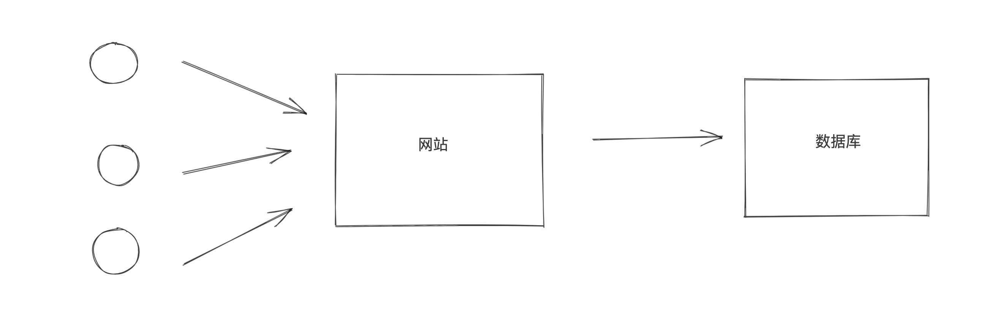

# day29 Python操作MySQL和实战


课程目标：掌握事务和锁以及Python操作MySQL的各种开发必备知识。

课程概要：

- 事务
- 锁
- 数据库连接池
- SQL工具类
- 其他


## 1. 事务

innodb引擎中支持事务，myisam不支持。

```sql
CREATE TABLE `users` (
  `id` int(11) NOT NULL AUTO_INCREMENT PRIMARY KEY,
  `name` varchar(32) DEFAULT NULL,
  `amount` int(11) DEFAULT NULL
) ENGINE=InnoDB DEFAULT CHARSET=utf8;
```


例如：李杰 给 武沛齐 转账 100，那就会涉及2个步骤。

- 李杰账户 减100
- 武沛齐账户 加 100

这两个步骤必须同时完成才算完成，并且如果第一个完成、第二步失败，还是回滚到初始状态。

事务，就是来解决这种情况的。  大白话：要成功都成功；要失败都失败。

事务的具有四大特性（ACID）：

- 原子性（Atomicity）

  ```
  原子性是指事务包含的所有操作不可分割，要么全部成功，要么全部失败回滚。
  ```

- 一致性（Consistency）

  ```
  执行的前后数据的完整性保持一致。
  ```

- 隔离性（Isolation）

  ```
  一个事务执行的过程中,不应该受到其他事务的干扰。
  ```

- 持久性（Durability）

  ```
  事务一旦结束,数据就持久到数据库
  ```


### 1.1 MySQL客户端

```sql
mysql> select * from users;
+----+---------+---------+
| id | name    | amount  |
+----+---------+---------+
|  1 | wupeiqi |    5    |
|  2 |  alex   |    6    |
+----+---------+---------+
3 rows in set (0.00 sec)

mysql> begin;  -- 开启事务 start transaction;
Query OK, 0 rows affected (0.00 sec)

mysql> update users set amount=amount-2 where id=1;   -- 执行操作
Query OK, 1 row affected (0.00 sec)
Rows matched: 1  Changed: 1  Warnings: 0

mysql> update users set amount=amount+2 where id=2;   -- 执行操作
Query OK, 1 row affected (0.00 sec)
Rows matched: 1  Changed: 1  Warnings: 0

mysql> commit;  -- 提交事务  rollback;
Query OK, 0 rows affected (0.00 sec)

mysql> select * from users;
+----+---------+---------+
| id | name    | amount  |
+----+---------+---------+
|  1 | wupeiqi |    3    |
|  2 |  ale x  |    8    |
+----+---------+---------+
3 rows in set (0.00 sec)
```


```sql
mysql> select * from users;
+----+---------+---------+
| id | name    | amount  |
+----+---------+---------+
|  1 | wupeiqi |    3    |
|  2 |  ale x  |    8    |
+----+---------+---------+
3 rows in set (0.00 sec)

mysql> begin; -- 开启事务
Query OK, 0 rows affected (0.00 sec)

mysql> update users set amount=amount-2 where id=1; -- 执行操作（此时数据库中的值已修改）
Query OK, 1 row affected (0.00 sec)
Rows matched: 1  Changed: 1  Warnings: 0

mysql> rollback; -- 事务回滚（回到原来的状态）
Query OK, 0 rows affected (0.00 sec)

mysql> select * from users;
+----+---------+---------+
| id | name    | amount  |
+----+---------+---------+
|  1 | wupeiqi |    3    |
|  2 |  ale x  |    8    |
+----+---------+---------+
3 rows in set (0.00 sec)
```


### 1.2 Python代码

```sql
import pymysql

conn = pymysql.Connect(host='localhost', port=3306, user='root', password='root123', db='blogs')
cursor = conn.cursor()

conn.begin()

try:
    cursor.execute('update student set sname="张飞" where sid=5; ')
    int('sadf')
    cursor.execute('update student set sname="张晓峰" where sid=4; ')
except Exception as e:
    # 回滚
    print('rollback')
    conn.rollback()
else:
    # commit
    print('commit')
    conn.commit()

cursor.close()
conn.close()

```


## 2. 锁

在用MySQL时，不知你是否会疑问：同时有很多做更新、插入、删除动作，MySQL如何保证数据不出错呢？


MySQL中自带了锁的功能，可以帮助我们实现开发过程中遇到的同时处理数据的情况。对于数据库中的锁，从锁的范围来讲有：

- 表级锁，即A操作表时，其他人对整个表都不能操作，等待A操作完之后，才能继续。
- 行级锁，即A操作表时，其他人对指定的行数据不能操作，其他行可以操作，等待A操作完之后，才能继续。

```
MYISAM支持表锁，不支持行锁；
InnoDB引擎支持行锁和表锁。

即：在MYISAM下如果要加锁，无论怎么加都会是表锁。
    在InnoDB引擎支持下如果是基于索引查询的数据则是行级锁，否则就是表锁。
```

所以，一般情况下我们会选择使用innodb引擎，并且在 搜索 时也会使用索引（命中索引）。

接下来的操作就基于innodb引擎来操作：

```sql
CREATE TABLE `L1` (
  `id` int(11) NOT NULL AUTO_INCREMENT,
  `name` varchar(255) DEFAULT NULL,
  `count` int(11) DEFAULT NULL,
  PRIMARY KEY (`id`)
) ENGINE=InnoDB  DEFAULT CHARSET=utf8;
```


在innodb引擎中，update、insert、delete的行为内部都会先申请锁（排它锁），申请到之后才执行相关操作，最后再释放锁。

```
所以，当多个人同时向数据库执行：insert、update、delete等操作时，内部加锁后会排队逐一执行。
```

而select则默认不会申请锁。

```
select * from xxx;
```

如果，你想要让select去申请锁，则需要配合 事务 + 特殊语法来实现。

SELECT ... LOCK IN SHARE MODE走的是IS锁(意向共享锁)，即在符合条件的rows上都加了共享锁，这样的话，其他session可以读取这些记录，也可以继续添加IS锁，但是无法修改这些记录直到你这个加锁的session执行完成(否则直接锁等待超时)。

SELECT ... FOR UPDATE 走的是IX锁(意向排它锁)，即在符合条件的rows上都加了排它锁，其他session也就无法在这些记录上添加任何的S锁或X锁。如果不存在一致性非锁定读的话，那么其他session是无法读取和修改这些记录的，但是innodb有非锁定读(快照读并不需要加锁)，for update之后并不会阻塞其他session的快照读取操作，除了select ...lock in share mode和select ... for update这种显示加锁的查询操作。

通过对比，发现for update的加锁方式无非是比lock in share mode的方式多阻塞了select...lock in share mode的查询方式，并不会阻塞快照读。

lock in share mode 只锁覆盖索引，但是如果是 for update 就不一样了。 执行 for update 时， 系统会认为你接下来要更新数据，因此会顺便给主键索引上满足条件的行加上行锁。 锁是加在索引上的，如果你要用 lock in share mode 来 给行加读锁避免数据被更新的话，就必须得绕过覆盖索引的优化，在查询字段中加入索引中不存在 的字段


- `for update`，走的是IX锁(意向排它锁) 排它锁，符合条件的rows上都加了排它锁，其他session是~~无法读取~~和**无法修改**这些记录，

  ```sql
  begin; 
  	select * from L1 where name="武沛齐" for update;    -- name列不是索引（表锁）
  commit;
  ```

  ```sql
  begin; -- 或者 start transaction;
  	select * from L1 where id=1 for update;			  -- id列是索引（行锁）
  commit;
  ```

- `lock in share mode` ，走的是IS锁(意向共享锁)，即在符合条件的rows上都加了共享锁，其他session可以**读取**这些记录，也可以继续添加IS锁，但是**无法修改**这些记录直到你这个加锁的session执行完成(否则直接锁等待超时)    

  ```sql
  begin; 
  	select * from L1 where name="武沛齐" lock in share mode;    -- 假设name列不是索引（表锁）
  commit;
  ```

  ```sql
  begin; -- 或者 start transaction;
  	select * from L1 where id=1 lock in share mode;           -- id列是索引（行锁）
  commit;
  ```


### 2.1 排它锁 

排它锁（ `for update`）。

应用场景：总共100件商品，每次购买一件需要让商品个数减1 。

```sql
A: 访问页面查看商品剩余 100
B: 访问页面查看商品剩余 100

此时 A、B 同时下单，那么他们同时执行SQL：
	update goods set count=count-1 where id=3
由于Innodb引擎内部会加锁，所以他们两个即使同一时刻执行，内部也会排序逐步执行。


但是，当商品剩余 1个时，就需要注意了。
A: 访问页面查看商品剩余 1
B: 访问页面查看商品剩余 1

此时 A、B 同时下单，那么他们同时执行SQL：
	update goods set count=count-1 where id=3
这样剩余数量就会出现 -1，很显然这是不正确的，所以应该怎么办呢？


这种情况下，可以利用 排它锁，在更新之前先查询剩余数量，只有数量 >0 才可以购买，所以，下单时应该执行：
	begin; -- start transaction;
	select count from goods where id=3 for update;
	-- 获取个数进行判断
	if 个数>0:
		update goods set count=count-1 where id=3;
	else:
		-- 已售罄
	commit;
```


基于Python代码示例：

```python
import pymysql
import threading


def task():
    conn = pymysql.connect(host='127.0.0.1', port=3306, user='root', passwd='root123', charset="utf8", db='userdb')
    cursor = conn.cursor(pymysql.cursors.DictCursor)  # fetchone会返回dict fetchall 字典里包含多个dict
    # cursor = conn.cursor()
	
    # 开启事务
    conn.begin()

    cursor.execute("select id,age from tran where id=2 for update")
    # fetchall      ( {"id":1,"age":10},{"id":2,"age":10}, )   ((1,10),(2,10))
    # {"id":1,"age":10}   (1,10)
    result = cursor.fetchone()
    current_age = result['age']
    
    if current_age > 0:
        cursor.execute("update tran set age=age-1 where id=2")
    else:
        print("已售罄")

    conn.commit()

    cursor.close()
    conn.close()


def run():
    for i in range(5):
        t = threading.Thread(target=task)
        t.start()


if __name__ == '__main__':
    run()

```


### 2.2 共享锁

共享锁（ `lock in share mode`），可以读，但不允许写。

加锁之后，后续其他事物可以可以进行读，但不允许写（update、delete、insert），因为写的默认也会加锁。


**Locking Read Examples**

Suppose that you want to insert a new row into a table `child`, and make sure that the child row has a parent row in table `parent`. Your application code can ensure referential integrity throughout this sequence of operations.

First, use a consistent read to query the table `PARENT` and verify that the parent row exists. Can you safely insert the child row to table `CHILD`? No, because some other session could delete the parent row in the moment between your `SELECT` and your `INSERT`, without you being aware of it.

To avoid this potential issue, perform the [`SELECT`](https://dev.mysql.com/doc/refman/5.7/en/select.html) using `LOCK IN SHARE MODE`:

```sql
SELECT * FROM parent WHERE NAME = 'Jones' LOCK IN SHARE MODE;
```

After the `LOCK IN SHARE MODE` query returns the parent `'Jones'`, you can safely add the child record to the `CHILD` table and commit the transaction. Any transaction that tries to acquire an exclusive lock in the applicable row in the `PARENT` table waits until you are finished, that is, until the data in all tables is in a consistent state.

---------------------------------------------------------------------------------------------------------

扩展  https://blog.csdn.net/sinat_27143551/article/details/89968902

lock in share mode适用于两张表存在业务关系时的一致性要求，for  update适用于操作同一张表时的一致性要求。


## 3. 数据库连接池



在操作数据库时需要使用数据库连接池。

```
pip3.9 install pymysql
pip3.9 install dbutils
```

```python
import threading
import pymysql
from dbutils.pooled_db import PooledDB

MYSQL_DB_POOL = PooledDB(
    creator=pymysql,  # 使用链接数据库的模块
    maxconnections=5,  # 连接池允许的最大连接数，0和None表示不限制连接数
    mincached=2,  # 初始化时，链接池中至少创建的空闲的链接，0表示不创建
    maxcached=3,  # 链接池中最多闲置的链接，0和None不限制
    blocking=True,  # 连接池中如果没有可用连接后，是否阻塞等待。True，等待；False，不等待然后报错
    setsession=[],  # 开始会话前执行的命令列表。如：["set datestyle to ...", "set time zone ..."]
    ping=0,
    # ping MySQL服务端，检查是否服务可用。
    # 如：0 = None = never, 1 = default = whenever it is requested, 
    # 2 = when a cursor is created, 4 = when a query is executed, 7 = always
    host='127.0.0.1',
    port=3306,
    user='root',
    password='root123',
    database='userdb',
    charset='utf8'
)


def task():
    # 去连接池获取一个连接
    conn = MYSQL_DB_POOL.connection()
    cursor = conn.cursor(pymysql.cursors.DictCursor)
    
    cursor.execute('select sleep(2)')
    result = cursor.fetchall()
    print(result)

    cursor.close()
    # 将连接交换给连接池
    conn.close()

def run():
    for i in range(10):
        t = threading.Thread(target=task)
        t.start()


if __name__ == '__main__':
    run()

```


## 4. SQL工具类

基于数据库连接池开发一个公共的SQL操作类，方便以后操作数据库。


### 4.1 单例和方法

```sql
# db.py
import pymysql
from dbutils.pooled_db import PooledDB


class DBHelper(object):

    def __init__(self):
        # TODO 此处配置，可以去配置文件中读取。
        self.pool = PooledDB(
            creator=pymysql,  # 使用链接数据库的模块
            maxconnections=5,  # 连接池允许的最大连接数，0和None表示不限制连接数
            mincached=2,  # 初始化时，链接池中至少创建的空闲的链接，0表示不创建
            maxcached=3,  # 链接池中最多闲置的链接，0和None不限制
            blocking=True,  # 连接池中如果没有可用连接后，是否阻塞等待。True，等待；False，不等待然后报错
            setsession=[],  # 开始会话前执行的命令列表。如：["set datestyle to ...", "set time zone ..."]
            ping=0,
            # ping MySQL服务端，检查是否服务可用。# 如：0 = None = never, 1 = default = whenever it is requested, 2 = when a cursor is created, 4 = when a query is executed, 7 = always
            host='127.0.0.1',
            port=3306,
            user='root',
            password='root123',
            database='userdb',
            charset='utf8'
        )

    def get_conn_cursor(self):
        conn = self.pool.connection()
        cursor = conn.cursor(pymysql.cursors.DictCursor)
        return conn, cursor

    def close_conn_cursor(self, *args):
        for item in args:
            item.close()

    def exec(self, sql, **kwargs):
        conn, cursor = self.get_conn_cursor()

        cursor.execute(sql, kwargs)
        conn.commit()

        self.close_conn_cursor(conn, cursor)

    def fetch_one(self, sql, **kwargs):
        conn, cursor = self.get_conn_cursor()

        cursor.execute(sql, kwargs)
        result = cursor.fetchone()

        self.close_conn_cursor(conn, cursor)
        return result

    def fetch_all(self, sql, **kwargs):
        conn, cursor = self.get_conn_cursor()

        cursor.execute(sql, kwargs)
        result = cursor.fetchall()

        self.close_conn_cursor(conn, cursor)

        return result


db = DBHelper()

```

```sql
from db import db

db.exec("insert into d1(name) values(%(name)s)", name="武沛齐666")

ret = db.fetch_one("select * from d1")
print(ret)

ret = db.fetch_one("select * from d1 where id=%(nid)s", nid=3)
print(ret)

ret = db.fetch_all("select * from d1")
print(ret)

ret = db.fetch_all("select * from d1 where id>%(nid)s", nid=2)
print(ret)

```


### 4.2 上下文管理

如果你想要让他也支持 with 上下文管理。

```
with 获取连接：
	执行SQL（执行完毕后，自动将连接交还给连接池）

```


```python
# db_context.py
import threading
import pymysql
from dbutils.pooled_db import PooledDB

POOL = PooledDB(
    creator=pymysql,  # 使用链接数据库的模块
    maxconnections=5,  # 连接池允许的最大连接数，0和None表示不限制连接数
    mincached=2,  # 初始化时，链接池中至少创建的空闲的链接，0表示不创建
    maxcached=3,  # 链接池中最多闲置的链接，0和None不限制
    blocking=True,  # 连接池中如果没有可用连接后，是否阻塞等待。True，等待；False，不等待然后报错
    setsession=[],  # 开始会话前执行的命令列表。如：["set datestyle to ...", "set time zone ..."]
    ping=0,
    host='127.0.0.1',
    port=3306,
    user='root',
    password='root123',
    database='userdb',
    charset='utf8'
)


class Connect(object):
    def __init__(self):
        self.conn = conn = POOL.connection()
        self.cursor = conn.cursor(pymysql.cursors.DictCursor)

    def __enter__(self):
        return self

    def __exit__(self, exc_type, exc_val, exc_tb):
        self.cursor.close()
        self.conn.close()

    def exec(self, sql, **kwargs):
        self.cursor.execute(sql, kwargs)
        self.conn.commit()

    def fetch_one(self, sql, **kwargs):
        self.cursor.execute(sql, kwargs)
        result = self.cursor.fetchone()
        return result

    def fetch_all(self, sql, **kwargs):
        self.cursor.execute(sql, kwargs)
        result = self.cursor.fetchall()
        return result

```

```python
from db_context import Connect

with Connect() as obj:
    # print(obj.conn)
    # print(obj.cursor)
    ret = obj.fetch_one("select * from d1")
    print(ret)

    ret = obj.fetch_one("select * from d1 where id=%(id)s", id=3)
    print(ret)

```


## 5.其他

navicat，是一个桌面应用，让我们可以更加方便的管理MySQL数据库。


- mac系统：https://www.macdo.cn/17030.html
- win系统：
  - 链接: https://pan.baidu.com/s/13cjbrBquz9vjVqKgWoCQ1w  密码: qstp
  - 链接: https://pan.baidu.com/s/1JULIIwQA5s0qN98KP8UXHA  密码: p18f


## 总结

本节内容比较重要，也是开发中经常会使用到的技能。

- 事务，解决批量操作同时成功或失败的问题。
- 锁，解决并发处理的问题。
- 数据库连接池，解决多个人请求连接数据库的问题。
- SQL工具类，解决连接数据库代码重复的问题。
- navicat工具


## 大作业：开发博客系统

> 请基于你掌握的所有技能，实现 day27  博客系统的所有功能。


根据如下的业务需求设计相应的表结构，内部需涵盖如下功能。

- 注册
- 登录
- 发布博客
- 查看博客列表，显示博客标题、创建时间、阅读数量、评论数量、赞数量等。（支持分页查看）
- 博客详细，显示博文详细、评论 等。
  - 发表评论
  - 赞 or 踩
  - 阅读数量 + 1

可参考如下图片来设计相应的表结构。

### 1. 注册和登录


### 2. 文章列表


### 3. 文章详细


### 4. 评论 & 阅读 & 赞 & 踩


注意：假设都是一级评论（不能回复评论）。


