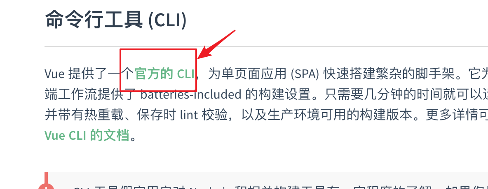
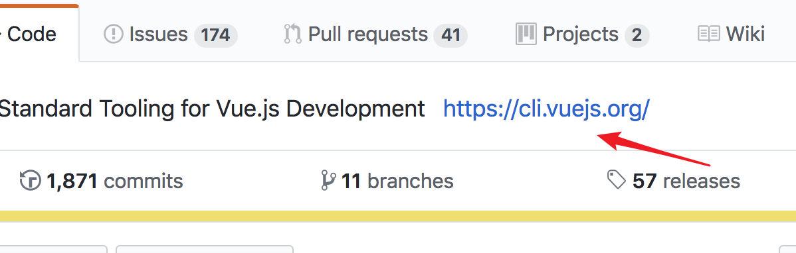
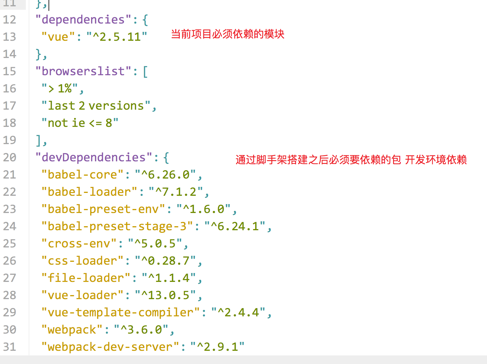

#### Axios的基本使用

#### 介绍

Axios 是一个基于 promise 的 HTTP 库，可以用在浏览器和 node.js 中。

- 从浏览器中创建 [XMLHttpRequests](https://developer.mozilla.org/en-US/docs/Web/API/XMLHttpRequest)
- 从 node.js 创建 [http](http://nodejs.org/api/http.html) 请求
- 支持 [Promise](https://developer.mozilla.org/en-US/docs/Web/JavaScript/Reference/Global_Objects/Promise) API
- 拦截请求和响应
- 转换请求数据和响应数据
- 取消请求
- 自动转换 JSON 数据
- 客户端支持防御 [XSRF](http://en.wikipedia.org/wiki/Cross-site_request_forgery)

##### axios的get请求

```
// 为给定 ID 的 user 创建请求
axios.get('/user?ID=12345')
  .then(function (response) {
    console.log(response);
  })
  .catch(function (error) {
    console.log(error);
  });
  
  $.ajax({
      url:'',
      type'get',
      success:function(data){
	  },
	  error:function(err){
	}
  })
```


#####  aixos的post请求

```
axios.post('/user', {
    firstName: 'Fred',
    lastName: 'Flintstone'
  })
  .then(function (response) {
    console.log(response);
  })
  .catch(function (error) {
    console.log(error);
  });
```

#### axios的默认配置

未来以后axios是一个局部作用域的那么我们可以通过

Vue.prototype.$axios = axios; 

此时我们就可以在任意组件中通过this.$axios获取到当前的axios实例


默认配置URL

axios.defaults.baseURL = 'http://127.0.0.1:8800'


#### grant、gulp、webpack工具介绍

1.对前端中的资源（html、css、js png mp3 mp4 font....）进行编译打包

2.webpack它里面很多loader

!image-20181022120324944](assets/image-20181022120324944.png)


*webpack* 是一个现代 JavaScript 应用程序的*静态模块打包器(module bundler)*。当 webpack 处理应用程序时，它会递归地构建一个*依赖关系图(dependency graph)*，其中包含应用程序需要的每个模块，然后将所有这些模块打包成一个或多个 *bundle*。


#### 历史介绍

- 2009年初，commonjs规范还未出来，此时前端开发人员编写的代码都是非模块化的，

  - 那个时候开发人员经常需要十分留意文件加载顺序所带来的依赖问题

- 与此同时 nodejs开启了js全栈大门，而requirejs在国外也带动着前端逐步实现模块化

- 引用 ： var $ = require('jquery')

  - 同时国内seajs也进行了大力推广 海纳百川 有容乃大
  - AMD 规范 ，具体实现是requirejs define('模块id',[模块依赖1,模块依赖2],function(){  return ;}) , ajax请求文件并加载
  - Commonjs || CMD 规范seajs 淘宝玉伯
    - commonjs和cmd非常相似的
      - cmd  require/module.exports
    - commonjs是js在后端语言的规范: 模块、文件操作、操作系统底层
    - CMD 仅仅是模块定义
  - UMD 通用模块定义，一种既能兼容amd也能兼容commonjs 也能兼容浏览器环境运行的万能代码

- npm/bower集中包管理的方式备受青睐，12年browserify/webpack诞生

  - npm 是可以下载前后端的js代码475000个包
  - bower 只能下载前端的js代码,bower 在下载bootstrap的时候会自动的下载jquery
  - browserify 解决让require可以运行在浏览器，分析require的关系，组装代码
  - webpack 打包工具，占市场主流

- es6的module

  ​	export default {}|| fn || msg

  

  ​	**前端中也是有模块的，导入方式是下面这种用法**

  ​	import xxx from './index.js'

  **webpack: 对前端中的资源编译打包、支持模块化es6的module**

  

  #### 模块的使用

  webpack的使用必须要依赖node

  node -v

  npm -v

  全局安装webpack    webpack.cmd

  ```npm install webpack@3.12.0 -g```

  ###### 1.下载webpack为项目开发依赖

  ``` npm install webpack@3.12.0 -D``` 

  

  npm  install -g http-server

  使用：

  Hs -o -p 8888

  

  #### 脚手架

  前端开发中提到的“脚手架”是一个形象的比喻，比喻各类语言的前期工作环境。

  在软件开发上（当然也包括前端开发）的脚手架指的就是：有人帮你把这个开发过程中要用到的工具、环境都配置好了，你就可以方便地直接开始做开发，专注你的业务，而不用再花时间去配置这个开发环境，这个开发环境就是脚手架。

  比如vue.js就有个vue-cli脚手架，基于node.js的开发环境，作者帮你把开发环境大部分东西都配置好了，你把脚手架下载下来就可以直接开发了，不用再考虑搭建这些工具环境。

  

  

  下载安装脚手架 vue-cli

  

  #### 	





```
npm install -g @vue/cli
```


vue -V

证明下载成功


```
npm install -g @vue/cli-init
```

此时你的电脑上 通过终端既可以使用2.x版本和3.x版本的脚手架工具


关于vue-cli2.x 脚手架工具

```javascript
vue init <模板> <项目名>
模板:webpack-simple 简单的配置webapck的模板
     webpack   复杂的webpack模块，单元测试、ESLint 热重载
vue init webpack-simple my-project
```





vue的生态圈 vue-awesome

参考链接：

https://github.com/vuejs/awesome-vue

https://segmentfault.com/p/1210000008583242/read?from=timeline


```javascript
vue init webpack 02-webpack_project
```


