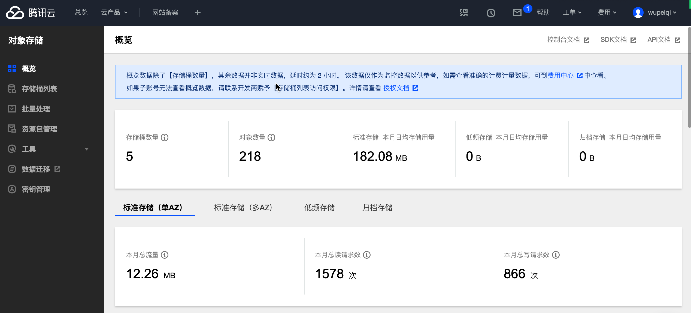

# day09 wiki

- 杨礼：只写了删除，未写编辑。
- 周子惠：只写了删除，未写编辑。
- 洪郭靖：联系不上（班主任）
- 朱鑫潮：家里没有网
- 未到：尹立生、高楚凡、邵婉婷


## 今日概要

- wiki删除
- wiki编辑
- markdown编辑器
  - 添加、编辑
  - 预览页面
- markdown上传图片的功能

## 今日详细

### 1.wiki删除

### 2.wiki编辑

### 3.markdown编辑器

- 富文本编辑器，ckeditor
- markdown编辑器，mdeditor

项目中想要应用markdown编辑器：

- 添加和编辑的页面中 textarea 输入框 -> 转换为markdown编辑器

  ```
  1. textarea框通过div包裹以便以后查找并转化为编辑器
  	<div id='editor'>.... </div>
  2. 应用js和css
  	<link rel="stylesheet" href="">
  	<script src=""></script>
  
  3. 进行初始化
  	$(function () {
         initEditorMd();
      });
          /*
          初始化markdown编辑器（textare转换为编辑器）
           */
          function initEditorMd() {
              editormd('editor', {
                  placeholder: "请输入内容",
                  height: 500,
                  path: ""
              })
          }
  4.全屏
  	.editormd-fullscreen{
              z-index: 1001;
          }
  ```

- 预览页面按照markdown格式显示

  ```
  1. 内容区域
  	<div id="previewMarkdown">
      	<textarea>{{ wiki_object.content }}</textarea>
      </div>
  2. 引入css 、 js
  	<link rel="stylesheet" href="">
  	
  	<script src=""></script>
      <script src=""></script>
      <script src=""></script>
      <script src=""></script>
      <script src=""></script>
      <script src=""></script>
      <script src=""></script>
      <script src=""></script>
      
  3. 初始化
  	 $(function () {
              initPreivewMarkdown();
  
          });
          function initPreivewMarkdown() {
              editormd.markdownToHTML("previewMarkdown", {
                  htmlDecode: "style,script,iframe"
              });
          }
  ```


总结：编辑器实现markdown编辑和预览。

欠：markdown组件进行上传图片


### 4.腾讯对象存储


#### 4.1 开通服务器


#### 4.2 后台




#### 4.3 Python实现上传文件

```sh
pip install -U cos-python-sdk-v5
```

```python
# APPID 已在配置中移除,请在参数 Bucket 中带上 APPID。Bucket 由 BucketName-APPID 组成
# 1. 设置用户配置, 包括 secretId，secretKey 以及 Region
# -*- coding=utf-8
from qcloud_cos import CosConfig
from qcloud_cos import CosS3Client
import sys


secret_id = 'COS_SECRETID'      # 替换为用户的 secretId
secret_key = 'COS_SECRETKEY'      # 替换为用户的 secretKey
region = 'ap-chengdu'     # 替换为用户的 Region

token = None                # 使用临时密钥需要传入 Token，默认为空，可不填
scheme = 'https'            # 指定使用 http/https 协议来访问 COS，默认为 https，可不填
config = CosConfig(Region=region, SecretId=secret_id, SecretKey=secret_key, Token=token, Scheme=scheme)
# 2. 获取客户端对象
client = CosS3Client(config)
```

```python
# 创建桶
response = client.create_bucket(
    Bucket='examplebucket-1250000000'
)
```

```python
# 上传文件
response = client.upload_file(
    Bucket='wangyang-1251317460',
    LocalFilePath='local.txt',  # 本地文件的路径
    Key='picture.jpg', #  上传到桶之后的文件名
    PartSize=1,
    MAXThread=10,
    EnableMD5=False
)
print(response['ETag'])
```


上传文件示例代码：

```python
from qcloud_cos import CosConfig
from qcloud_cos import CosS3Client

secret_id = '自己id'  # 替换为用户的 secretId
secret_key = '自己的key'  # 替换为用户的 secretKey

region = 'ap-chengdu'  # 替换为用户的 Region

config = CosConfig(Region=region, SecretId=secret_id, SecretKey=secret_key)

client = CosS3Client(config)

response = client.upload_file(
    Bucket='wangyang-1251317460',
    LocalFilePath='code.png',  # 本地文件的路径
    Key='p1.png'  # 上传到桶之后的文件名
)
print(response['ETag'])

```


创建桶的示例代码：

```python
#!/usr/bin/env python
# -*- coding:utf-8 -*-

from qcloud_cos import CosConfig
from qcloud_cos import CosS3Client

secret_id = 'asdf'  # 替换为用户的 secretId
secret_key = 'sdfsdf'  # 替换为用户的 secretKey

region = 'ap-chengdu'  # 替换为用户的 Region

config = CosConfig(Region=region, SecretId=secret_id, SecretKey=secret_key)

client = CosS3Client(config)

response = client.create_bucket(
    Bucket='test-1251317460',
    ACL="public-read"  # private  /  public-read / public-read-write
)

```


### 5.项目中集成cos

希望我们的项目中用到的图片可以放在cos中，防止我们的服务处理图片时压力过大。

#### 5.1 创建项目时创建桶

```
bucket = "{}-{}-{}-1251317460".format(name, request.tracer.user.mobile_phone, str(int(time.time())))
region = 'ap-chengdu'
create_bucket(bucket, region)
```

```
#!/usr/bin/env python
# -*- coding:utf-8 -*-
from qcloud_cos import CosConfig
from qcloud_cos import CosS3Client
from django.conf import settings


def create_bucket(bucket, region="ap-chengdu"):
    """
    创建桶
    :param bucket: 桶名称
    :param region: 区域
    :return:
    """

    config = CosConfig(Region=region, SecretId=settings.TENCENT_COS_ID, SecretKey=settings.TENCENT_COS_KEY)
    client = CosS3Client(config)
    client.create_bucket(
        Bucket=bucket,
        ACL="public-read"  # private  /  public-read / public-read-write
    )
```

#### 5.2 mardown上传图片到cos

- cos上传文件：本地文件 ； 接收markdown上传的文件再进行上传到cos；
- markdown上传图片


## 今日作业

- 编辑&删除
- 申请腾讯对象存储（5G）
- 脚本进行
  - 创建桶
  - 上传本地文件
- 在编辑&添加页面应用markdown组件
- 在预览页面运用markdown组件
- 创建项目：创建桶（修改表结构）
- markdown+cos 上传图片
- 【可选】Javascript代码实现文件上传（id/key）
- 【可选】临时凭证 + js上传


