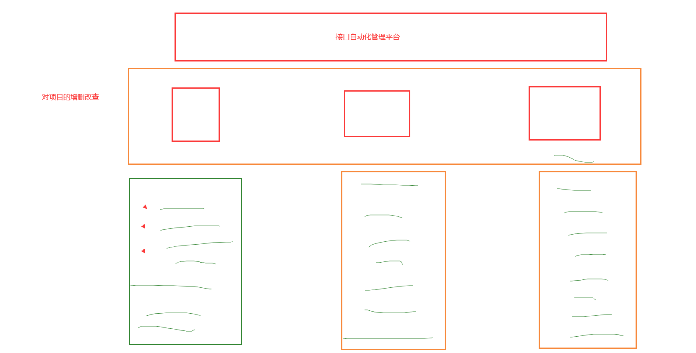
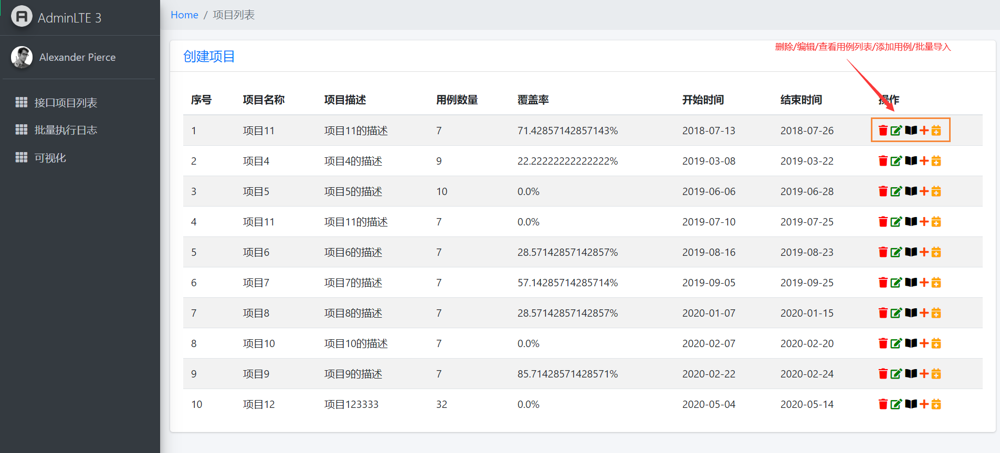
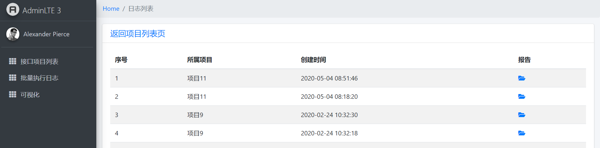

# 接口自动化平台

管理所有的接口：

-   接口的增删改查
-   一键执行接口，并生成测试报告
    -   批量执行
    -   下载报告
-   批量导入
    -   从Excel表格中
-   定时任务
    -   每天定时（凌晨1点）检查是否有今天要结束的测试活动，如果有，就自动的执行一遍。
-   可视化
    -   echarts

实现：

-   django + unittest

# 项目分析

项目列表：

用例列表：

用例执行日志：

参考项目列表图，完成：

-   新建项目
-   编辑项目
-   删除项目
-   为项目添加用例

数据库设计：

-   项目表的字段：
    -   项目名称
    -   项目描述
    -   用例数据量，该字段是统计出来的
    -   覆盖率字段，计算出来的（通过的用例数量除以项目总的用例数量）
    -   开始时间
    -   结束时间
-   用例表
    -   用例名称
    -   用例描述
    -   所属项目
    -   请求的url
    -   请求的类型
    -   请求的参数
    -   期望值
    -   执行状态
        -   已执行
        -   未执行
    -   通过状态，用例执行后，修改此状态
        -   执行成功，已通过
        -   执行失败，未通过
    -   用例报告
-   日志表：
    -   所属项目
    -   执行时间
    -   执行的报告

作业完成顺序：项目表的增删改查 ---> 用例表的增删改查 -----> 用例执行------> 批量执行的用例日志 ---> 数据可视化

# 今日作业

-   项目表的增删改查

-   用例表的增删改查

