[TOC]


# 什么是持续集成

## 持续集成

持续集成是一种软件开发实践经验，采用持续集成时，开发人员会定期将他们的代码变更合并到一个中央存储库中，之后系统会自动运行构建和测试操作。持续集成的主要目标是更快发现并解决错误，提高软件质量，并缩短验证和发布新软件更新所需的时间。

### 持续交付

持续交付是一种软件开发实践。通过持续交付，系统可以自动构建和测试代码更改，并为将其发布到生产环境做好准备。持续交付可以在构建阶段后将所有代码变更都部署到测试环境和/或生产环境中，从而实现对持续集成的扩展。当持续交付得以正确实施时，开发人员将始终能够获得一个已通过标准化测试流程的部署就绪型构建工件。

参考：

-   https://aws.amazon.com/cn/devops/what-is-devops/
-   https://www.jianshu.com/p/5643b1cf9e3f
-   https://www.cnblogs.com/Neeo/p/10428714.html

# 关于jenkins

[Jenkins](https://jenkins.io/zh/)是一个**开源项目**，是基于**Java**开发的集成工具。Jenkins是一款开源CI&CD软件，用于自动化各种任务，包括构建、测试和部署软件.
Jenkins支持各种运行方式，可通过系统包,Docker或者通过一个独立的Java程序。

文档：https://www.jenkins.io/zh/doc/


## jenkins安装

前提：有java 环境

支持各种的平台：

-   Windows，有msi
-   Tomcat环境，可以部署到Windows、Mac OS、linux
-   docker，Windows、Mac OS、linux

最低推荐配置:

-   256MB可用内存
-   1GB可用磁盘空间(作为一个[Docker](https://www.jenkins.io/zh/doc/book/installing/#docker)容器运行jenkins的话推荐10GB)

为小团队推荐的硬件配置:

-   1GB+可用内存
-   50 GB+ 可用磁盘空间

软件配置:

-   Java 8—无论是Java运行时环境（JRE）还是Java开发工具包（JDK）都可以。


### jenkins for docker

本次安装环境：阿里云服务器(centos7.4) + docker 19.03.8

常用的镜像有两个：

```
docker pull jenkins:latest
docker pull jenkinsci/blueocean:latest
```

1.  下载jenkins镜像

```
[root@r ~]# docker pull jenkinsci/blueocean:latest
[root@r ~]# docker images |grep jenkins
jenkinsci/blueocean   latest              789f2766377f        15 hours ago        567MB
```

2.  启动docker容器

````
docker run \
  -u root \
  --name s267 \
  --restart=always \
  -d \
  -p 6010:8080 \
  -p 50000:50000 \
  --env JAVA_OPTS="-Xmx512m" \
  -e JAVA_OPTS=-Duser.timezone=Asia/Shanghai \
  -v /etc/localtime:/etc/localtime \
  -v /tmp/jenkins_home:/var/jenkins_home \
  -v /var/run/docker.sock:/var/run/docker.sock \
  jenkinsci/blueocean:latest
````

3.  启动后，会默认的创建一个admin用户(只有基于jenkinsci/blueocean:latest镜像的jenkins容器会创建一个admin用户)，并且生成一个初始密码：

```
# 查看密码，仅除此使用
[root@r ~]# docker logs -t -f --tail 40 s267
# 查看密码，推荐
[root@r ~]# docker exec -it -u root s267 bash
bash-4.4# cat /var/jenkins_home/secrets/initialAdminPassword 
a02074d95cd94b2891d241d350a00293
```

4.  使用初始密码解锁jenkins。

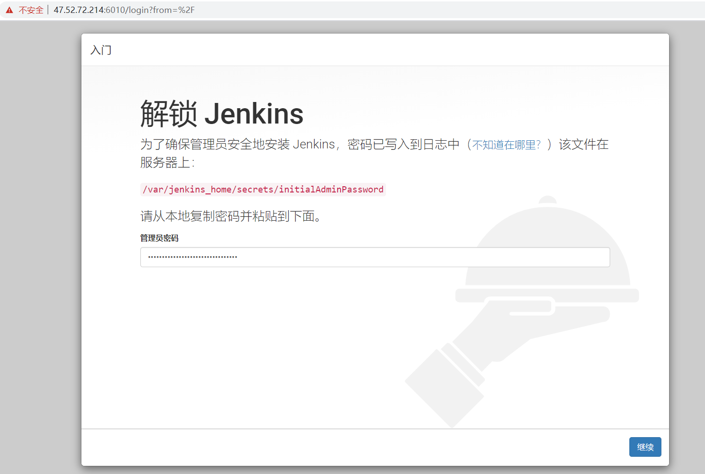

5.  新手入门之，安装推荐的插件：


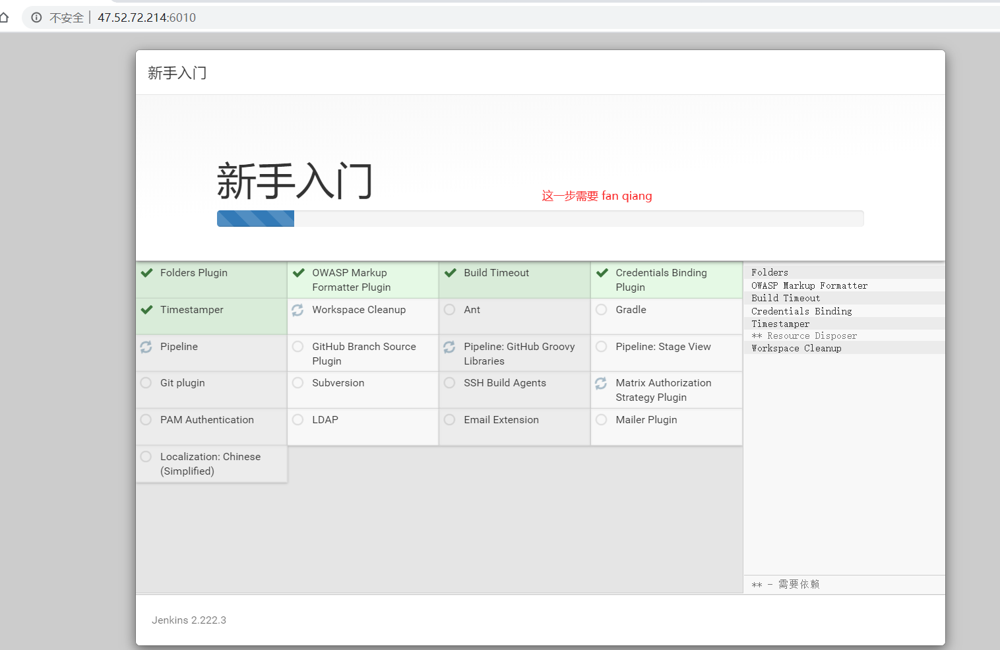

6.  新手入门之创建初始管理员用户，如果在这一步手动创建了管理员用户，默认创建的admin用户将会被注销。


7.  新手入门之实例配置，配置jenkins url


8.  新手入门结束


9.  欢迎来到jenkins

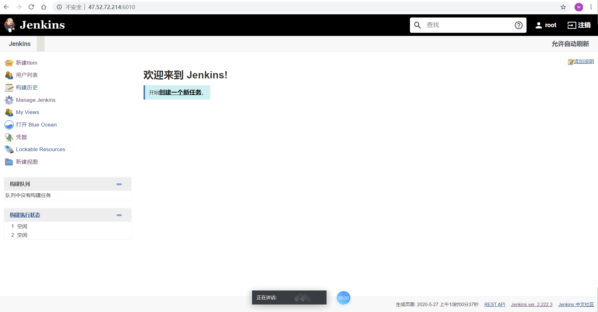


# 常用的操作

## 手动重启jenkins

1.  前台访问：

```
http://47.52.72.214:6010/restart
```

2.  安装完插件之后，可以选择重启jenkins，使插件安装生效。
3.  docker命令来重启jenkins

```
docker restart s267
```


# 插件管理


## 安装插件

**方式1：**

管理jenkins ---> manges plugins ---> 可选插件，搜索要安装的插件，可选择，安装并且重启jenkins

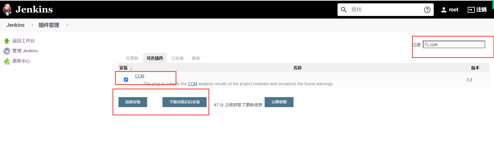

由于下载地址是插件官网，可能会导致下载失败，然后安装失败.....

如果安装失败，就采用第二种方式。

**方式2：**

1.  手动下载插件，参考网址：https://updates.jenkins.io/download/plugins/，这里以allure插件为例：


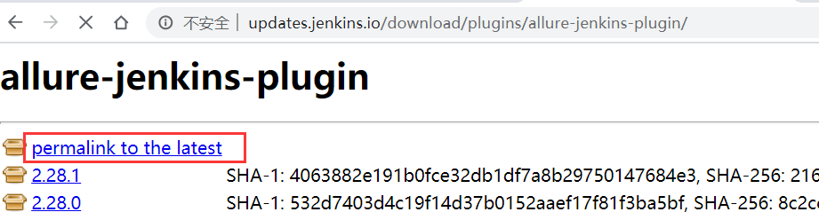


然后手动将下载到本地的hpi插件，上传到jenkins。

管理jenkins ---> manges plugins ---> 高级选项，下拉选择上传插件。点击本地文件上传


完事之后，重启jenkins，插件生效。

## 卸载插件

管理jenkins ---> manges plugins ---> 已安装，搜索要卸载的插件，并且勾选然后点击卸载。


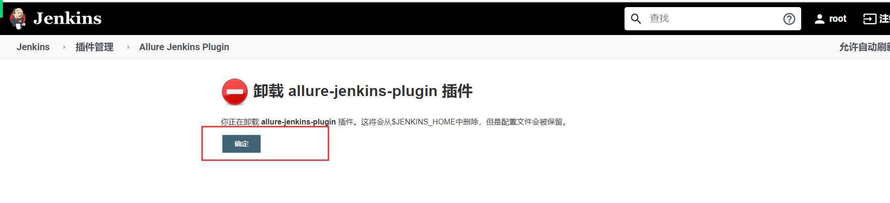

## 解决：插件下载慢的问题

修改`/var/jenkins_home/hudson.model.UpdateCenter.xml `文件，换国内源：

```xml
bash-4.4# cat /var/jenkins_home/hudson.model.UpdateCenter.xml 
<?xml version='1.1' encoding='UTF-8'?>
<sites>
  <site>
    <id>default</id>
    <url>https://updates.jenkins.io/update-center.json</url>
  </site>
</sites>bash-4.4# vi /var/jenkins_home/hudson.model.UpdateCenter.xml 
bash-4.4# cat /var/jenkins_home/hudson.model.UpdateCenter.xml 
<?xml version='1.1' encoding='UTF-8'?>
<sites>
  <site>
    <id>default</id>
    <url>https://mirrors.tuna.tsinghua.edu.cn/jenkins/updates/update-center.json</url>
  </site>
```

常用的国内源地址：

```
https://mirrors.tuna.tsinghua.edu.cn/jenkins/updates/update-center.json
http://mirror.esuni.jp/jenkins/updates/update-center.json
http://mirror.xmission.com/jenkins/updates/update-center.json
```


# 用户管理

常用的操作：

-   创建用户
-   修改密码


## 必要的配置

管理jenkins ---> 全局安全配置，勾选允许用户注册，完事点击保存。


## 修改密码

1.  manage jenkins ---> mange user ，用户列表，选择用户id。

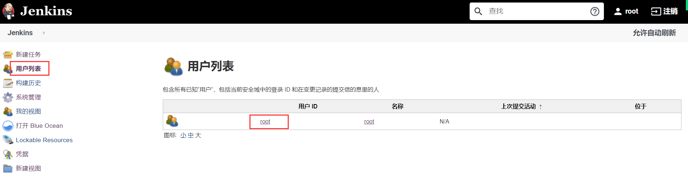

2.  选择设置，下拉重新输入新的密码，然后下拉点击确认按钮。


## 创建用户


管理jenkins ---> 管理用户

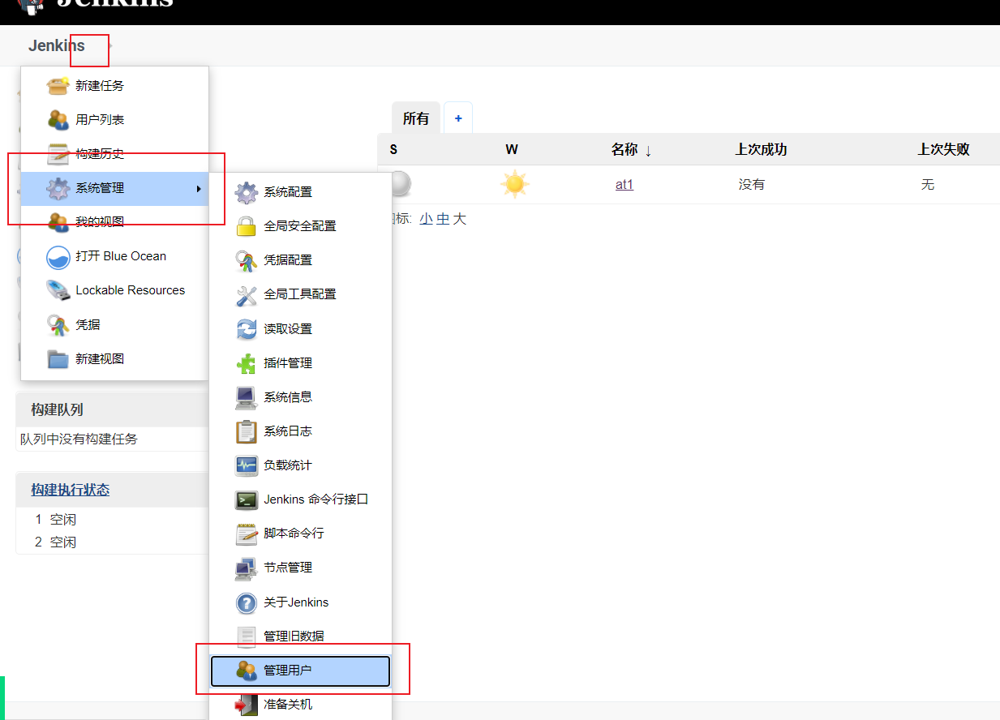

点击新建用户

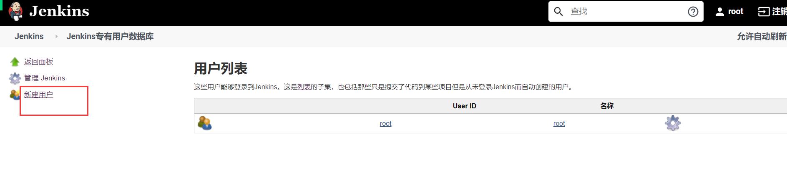

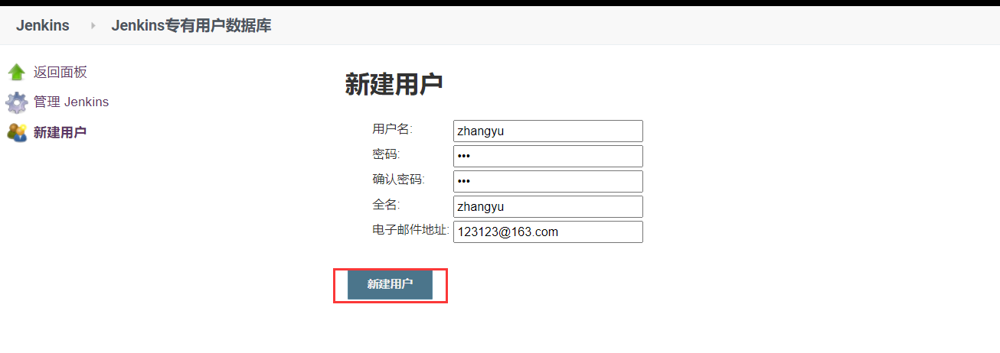

创建成功后的用户列表：

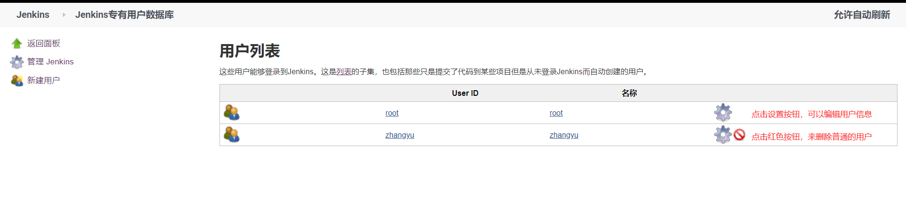

## 删除用户

这里只能删除普通的用户。

管理jenkins ---> 管理用户，点击红色按钮进行删除。


确认删除：

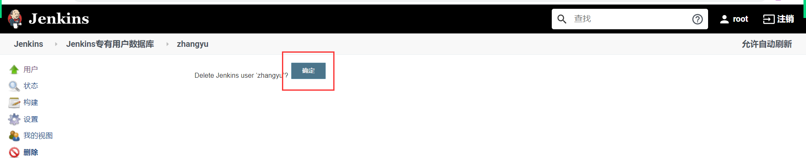


# 凭据管理

由于jenkins要和别的软件或者平台打交道，那么就要拿着先关凭据去做认证。

-   添加凭据
-   修改凭据
-   删除凭据


## 添加凭据

jenkins主页 ---> 凭据 ---> 全局凭据


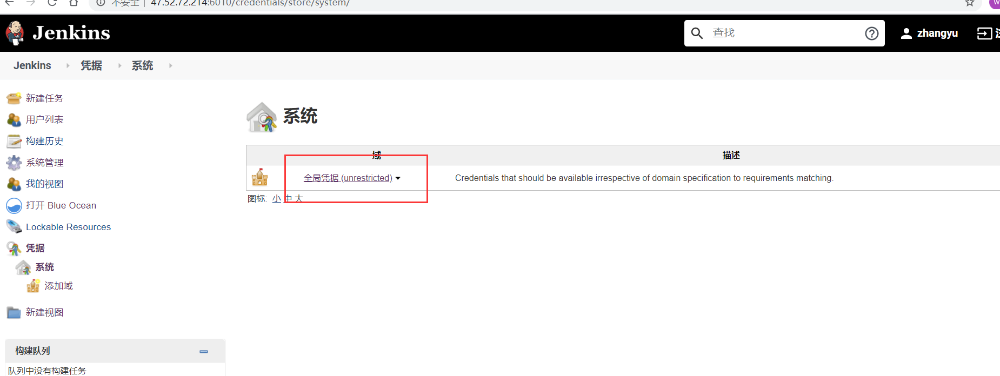

此时进入到了全局的凭据列表，列出了所有的凭据。


如何添加凭据呢？

点击左侧的添加凭据按钮。

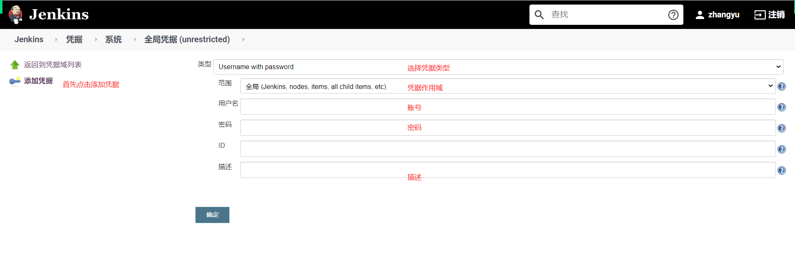

创建成功，会在凭据列表展示出来，可以点击右侧按钮编辑该凭据。


## 修改凭据

在凭据列表中，点击指定凭据后的小三角或者右侧的更新按钮，来修改凭据。


来修改相关内容。

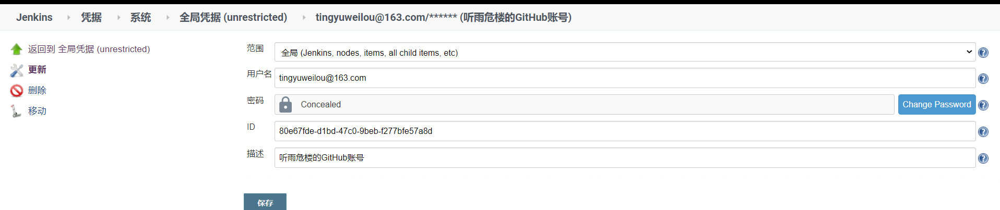


## 删除凭据

凭据列表，选择指定凭据后的小三角，选择删除选项。


确认删除。

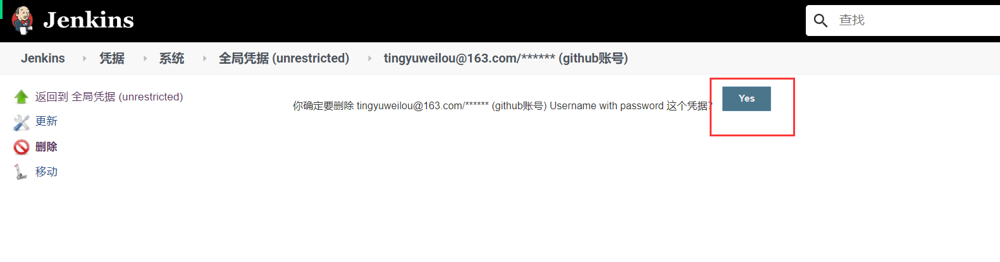

## 问题

在上述的配置GitHub账号密码的凭据中，有的时候会遇到如下问题：


如何解决：

可以使用ssh形式来解决：

## 配置github公钥私钥凭据

### 生成公钥私钥

在本机使用git来生成公钥私钥：

```
ssh-keygen -t rsa -C "你的邮箱@163.com"

# 示例，一路回车
$ ssh-keygen -t rsa -C "tingyuweilou@163.com"
Generating public/private rsa key pair.
Enter file in which to save the key (/c/Users/Anthony/.ssh/id_rsa):
Enter passphrase (empty for no passphrase):
Enter same passphrase again:
Your identification has been saved in /c/Users/Anthony/.ssh/id_rsa.
Your public key has been saved in /c/Users/Anthony/.ssh/id_rsa.pub.
The key fingerprint is:
SHA256:IpMirm5XMasMF74a2ti1RSXZyiu35hORaYTYfkoWIz0 tingyuweilou@163.com
The key's randomart image is:
+---[RSA 2048]----+
|   + .           |
|  o E .o         |
|   o =ooo        |
|   .+=*+         |
|. oo=+O.S        |
|.o +.*.o         |
| o+ * +.         |
|o=.* =o.         |
|*o= .oo.         |
+----[SHA256]-----+
```

在本机(windows)的用户，你的用户下面有个`.ssh`目录，生成了公钥私钥两个文件。


### 配置公钥

1.  在GitHub的settings中，添加ssh key


2.  将本地的公钥添加进去

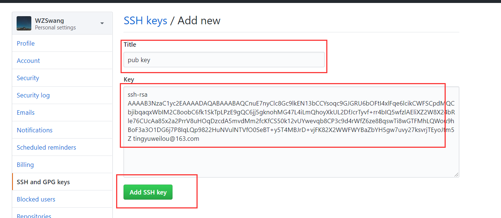


添加成功。


### 配置私钥

在jenkins中，凭据管理下的凭据列表，添加一个凭据。


添加成功后的凭据列表：


## 使用凭据

如在job中：

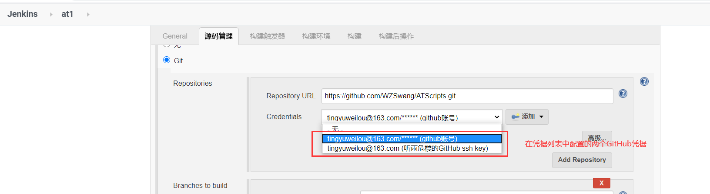


错误参考：https://www.cnblogs.com/my_captain/p/11020381.html


# 安装python环境

不同的镜像依赖的基础镜像不同，导致容器内容的包管理工具也不同，如何查看以来的基础镜像：

```
[root@r docker_data]# docker exec -it -u root myjenkins bash
bash-4.4# cat /etc/issue 
Welcome to Alpine Linux 3.9
Kernel \r on an \m (\l)
```

常见的基础镜像的包管理工具有：

-   Alpine Linux 3.9：apk
-   Debian：apt-get
-   centos：yum


常用的apk的操作：

```
# 更新源列表
apk update -y
# 搜索包
apk search 包名

apk search python3
# 安装包
apk add 包名

apk add python3

apk add python3=3.6.9-r2
apk add python2=2.7.18-r0
# 查看包信息
apk info python3
# 删除包
apk del 包名

apk del vim
```


**安装python3.6**

1.  更新源列表和安装依赖

````
bash-4.4# apk update -y
bash-4.4# apk add gcc
bash-4.4# apk add build-base
bash-4.4# apk add zlib-dev
````

2.  安装python3

```
apk search python3
apk add python3=3.6.9-r2
```

3.  测试安装成功：

```
bash-4.4# python3 -V
Python 3.6.9
bash-4.4# pip3 -V
pip 18.1 from /usr/lib/python3.6/site-packages/pip (python 3.6)
```

4.  升级pip

```
pip3 install --upgrade pip
```


参考：

-   https://www.cnblogs.com/Neeo/articles/10675522.html

-   https://www.cnblogs.com/Neeo/articles/12195138.html


# 配置邮箱

能配置基础的邮箱和扩展邮箱

## 基础邮箱配置

在系统配置选项，下拉选择邮件通知选项：

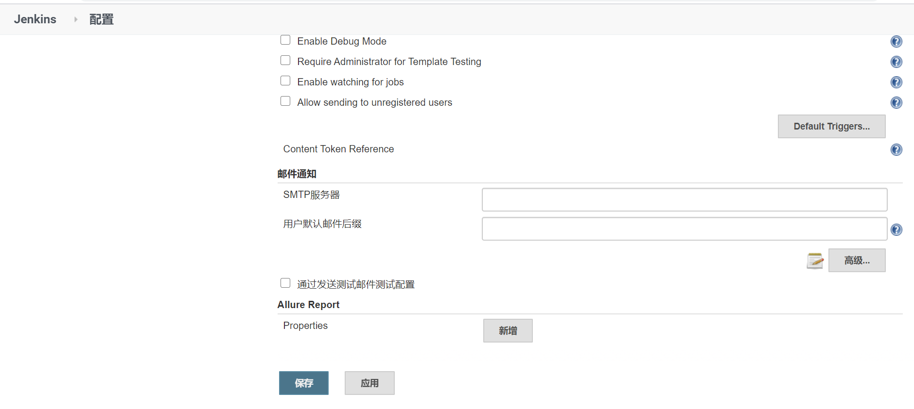

如何配置？

1.  在系统配置选项，配置系统管理员邮箱


2.  配置邮件通知，按下图配置。

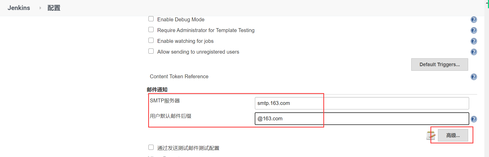


3.  点击高级后，按下图配置

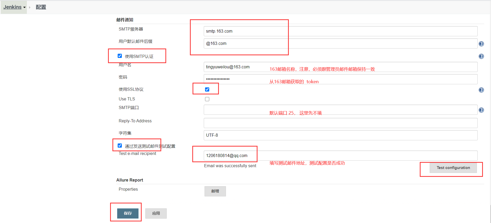

4.  在项目中的构建后操作，选择

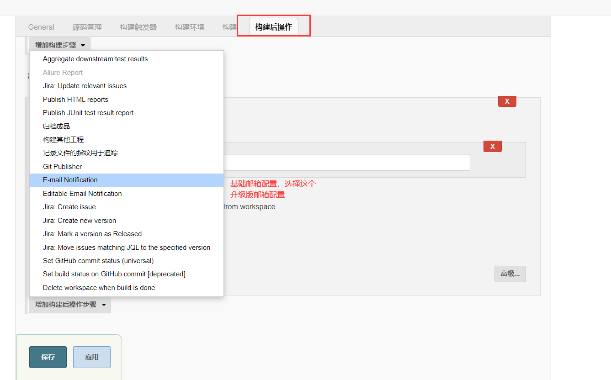

5.  填写收件人列表，然后点击保存。


后续的构建中，在构建后的操作中，就会自动发邮件。

## 配置邮箱升级版

参考博客：https://www.cnblogs.com/Neeo/articles/12805815.html

邮箱HTML模板，后续会用到：

```html
<!DOCTYPE html>
<html>
<head>
    <meta charset="UTF-8">
    <title>${ENV, var="JOB_NAME"}-第${BUILD_NUMBER}次构建日志</title>
</head>

<body leftmargin="8" marginwidth="0" topmargin="8" marginheight="4"
      offset="0">
<table width="95%" cellpadding="0" cellspacing="0"
       style="font-size: 11pt; font-family: Tahoma, Arial, Helvetica, sans-serif">
    <tr>
        <td>
            <h2>
                <b>来自Jenkins的邮件通知</b>
            </h2>
        </td>
    </tr>
    <tr>
        <td>
            <br/>
            <b style="color:#0B610B;">构建信息:</b>
            <hr size="2" width="100%" align="center"/>
        </td>
    </tr>
    <tr>
        <td>
            <ul>
                <li>项目名称&nbsp;：&nbsp;${PROJECT_NAME}</li>
                <li>触发原因&nbsp;：${CAUSE}</li>
                <li>构建日志&nbsp;：&nbsp;<a href="${BUILD_URL}console">${BUILD_URL}console</a></li>
                <li>单元测试报告&nbsp;：<a href="${BUILD_URL}allure/">${BUILD_URL}allureReport/</a></li>
                <li>工作目录&nbsp;：&nbsp;<a href="${PROJECT_URL}">${PROJECT_URL}</a></li>
                <li>测试报告下载&nbsp;：&nbsp;<a href="${PROJECT_URL}">${PROJECT_URL}lastSuccessfulBuild/artifact/allure-report.zip</a></li>
            </ul>
        </td>
    </tr>
    <tr>
        <td><b style="color:#0B610B;">构建日志:</b>
            <hr size="2" width="100%" align="center"/>
        </td>
    </tr>
    <tr>
        <td><textarea cols="80" rows="30" readonly="readonly"
                      style="font-family: Courier New;width: 500px;max-width: 1000px;">${BUILD_LOG}</textarea>
        </td>
    </tr>
</table>
</body>
</html>
```

上面模板的含义参考可用变量列表：

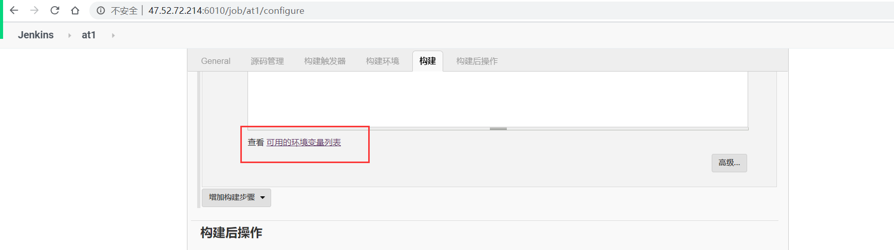

1.  首先要保证`Email Extension Plugin`已下载。

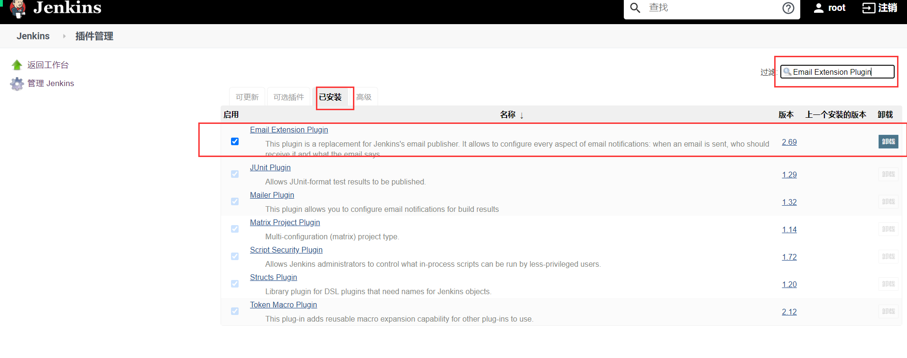


2.  确认管理员邮件地址


3.  填写smtp等信息，点击高级


4.  按照下图配置


5.  点击保存。

6.  在项目构建后操作，选择高级邮箱配置


7.  按照下图，点击高级设置


8.  如下图，点击高级


9.  如下图

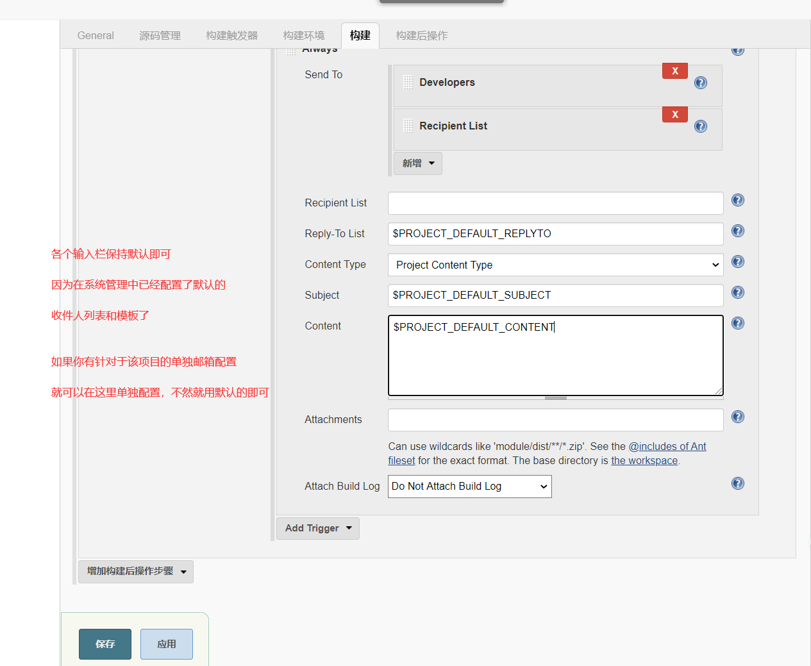

10.  点击保存即可。

注意，上述`6~9`都是针对于该项目的特殊配置，如果没有特殊的配置，就是用系统配置中的相关参数。


# 配置java jdk/git/Allure Commandline

## 配置java jdk

1.  找到容器内容的`JAVA_HOME`

```
bash-4.4# echo $PATH
/usr/local/sbin:/usr/local/bin:/usr/sbin:/usr/bin:/sbin:/bin:/usr/lib/jvm/java-1.8-openjdk/jre/bin:/usr/lib/jvm/java-1.8-openjdk/bin
bash-4.4# 

```


2.  将`/usr/lib/jvm/java-1.8-openjdk`添加到`管理 jenkins`---> `全局工具配置`中的JDK选项中。

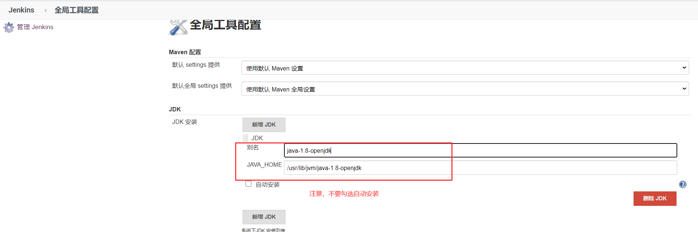


3.  完事之后，下拉点击保存即可。


## 配置git

1.  容器环境从软连中过滤出Git

```
bash-4.4# ls /usr/bin/git*
/usr/bin/git  /usr/bin/git-lfs	/usr/bin/git-receive-pack  /usr/bin/git-shell  /usr/bin/git-upload-archive  /usr/bin/git-upload-pack
```


2.  将`/usr/bin/git`软连添加到`管理 jenkins`---> `全局工具配置`中的git选项中。


3.  下拉保存即可。


## 配置Allure Commandline

1.  保证已经在插件中心下载了allure插件。


2.  `管理 jenkins`---> `全局工具配置`中的Allure Commandline选项，点击添加 allure commandline。


3.  按照下图配置即可。


# 部署一个自由风格的job

常用的操作：

1.  general，项目的描述信息，和基本的一些参数
2.  源码管理，如何管理你的代码，从哪拉取，如何配置凭据。
3.  构建触发器，你的项目如何运行？
    1.  执行一次
    2.  轮循执行
    3.  每一周，每一天，每一个月
4.  构建环境，选择你的项目构建环境是，如ant
5.  构建，如何执行你的项目，如何运行你的代码
    1.  执行shell
    2.  Windows 终端
    3.  .....
6.  构建后的操作，当项目构建完毕后，要做什么事情
    1.  生成相关报告
    2.  发送相关的邮件


## general

配置构建环境中的参数，后续再构建中，能直接是用的参数。

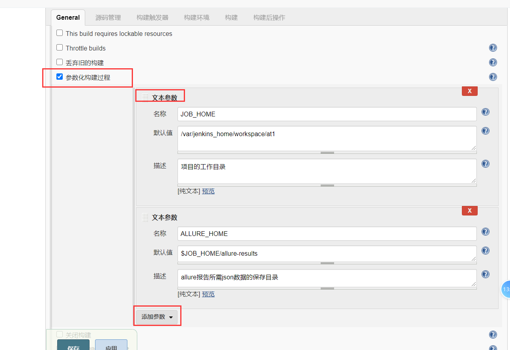


## 构建触发器


```
# Example of job definition:
# .---------------- minute (0 - 59)
# |  .------------- hour (0 - 23)
# |  |  .---------- day of month (1 - 31)
# |  |  |  .------- month (1 - 12) OR jan,feb,mar,apr ...
# |  |  |  |  .---- day of week (0 - 6) (Sunday=0 or 7) OR sun,mon,tue,wed,thu,fri,sat
# |  |  |  |  |
# *  *  *  *  * user-name  command to be executed
　分 时  日 月  周
```

示例：

```
# 每天8:30分执行一次
30 08 * * *

# #每小时的3,15分组执行
3,15 * * * *

# 在上午8-11点的第3和第15分钟执行
3,15 8-11 * * *
```

更多参考：https://www.cnblogs.com/pyyu/articles/9355477.html

## 构建

点击添加构建步骤：

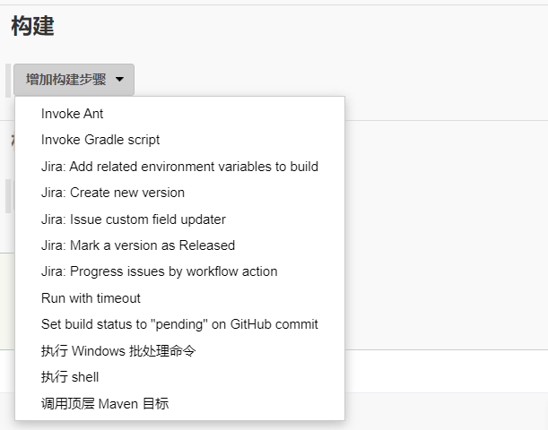

常用的有：

-   linux：执行shell
-   Windows：执行Windows批处理命令


## 构建后的操作

### 配置allure报告

allure commandline会自动从`$ALLURE_HOME`目录读取json数据，生成allure报告。


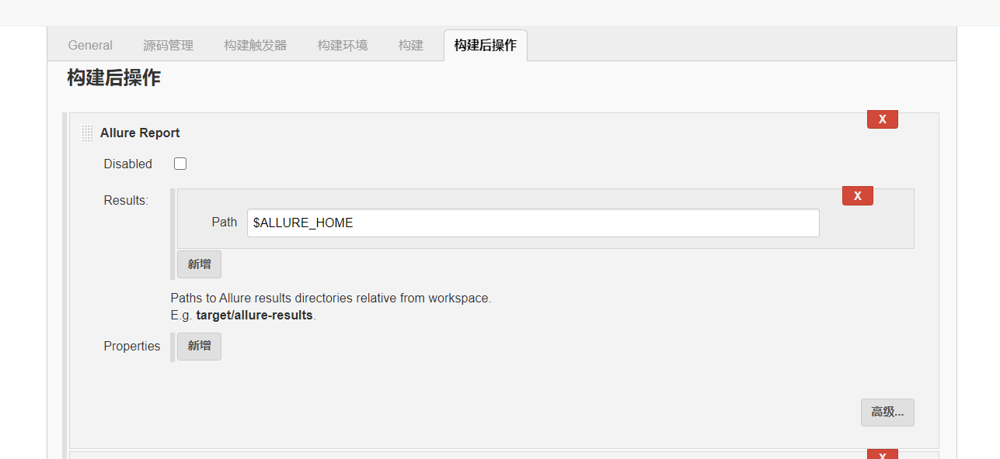

注意，json数据目录在项目根目录下的`allure-results`目录；生成的报告在项目根目录下的`allure-report`目录中。我们可以通过在项目目录下看到。


### 邮件配置

如果在系统管理中，配置了邮件进阶版的相关参数，这里都选择默认即可。

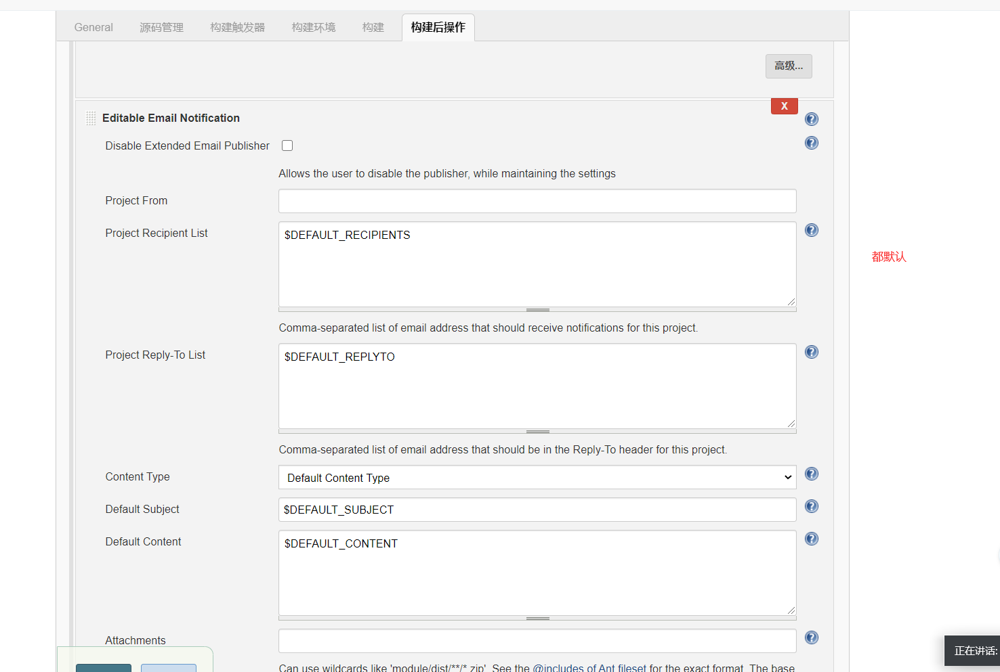

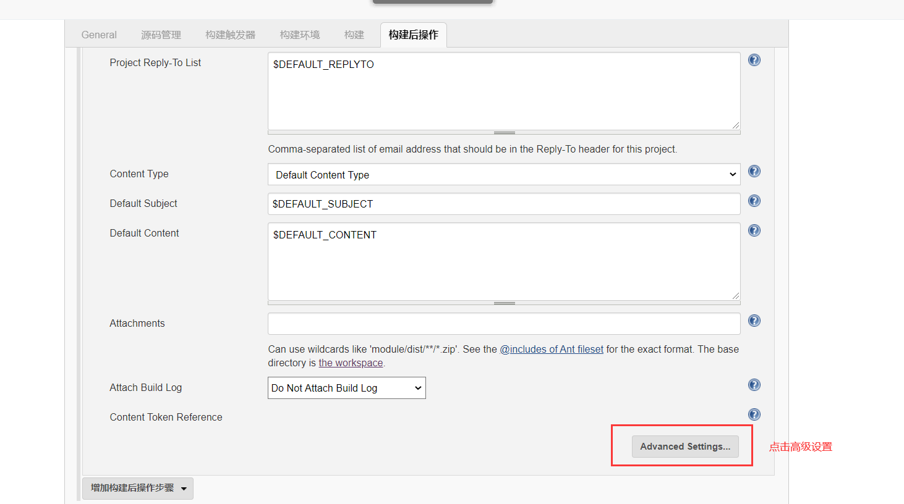


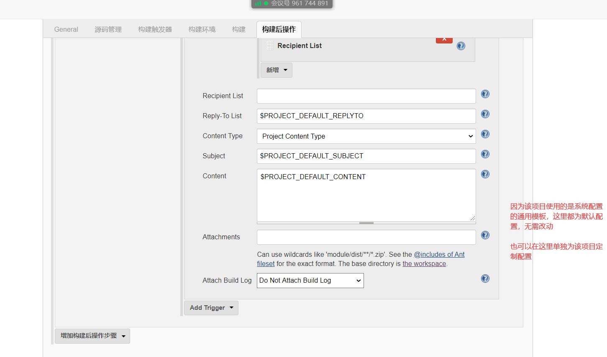

## 项目的配置一览图

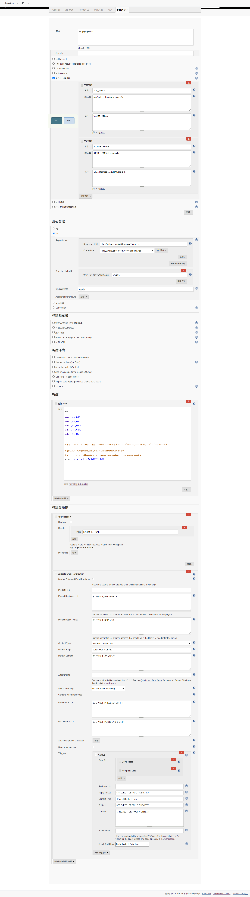

就差左下角的保存按钮了。


# 关于jenkins容器迁移

我已经将制作好的镜像上传到了docker hub上，咱们直接拉取即可：

```
docker pull wangzhangkai/jenkins:1.0
```

然后启动：

```
docker run \
  -u root \
  --name myjenkins \
  --restart=always \
  -d \
  -p 6010:8080 \
  -p 50000:50000 \
  --env JAVA_OPTS="-Xmx1024m" \
  -e JAVA_OPTS=-Duser.timezone=Asia/Shanghai \
  -v /etc/localtime:/etc/localtime \
  -v /tmp/jenkins_home:/var/jenkins_home \
  -v /var/run/docker.sock:/var/run/docker.sock \
  wangzhangkai/jenkins:1.0
```

参考上述命令启动即可。

# 问题

## HTTP ERROR 403 No valid crumb was included in the request

一般在提交的时候，遇到该问题。

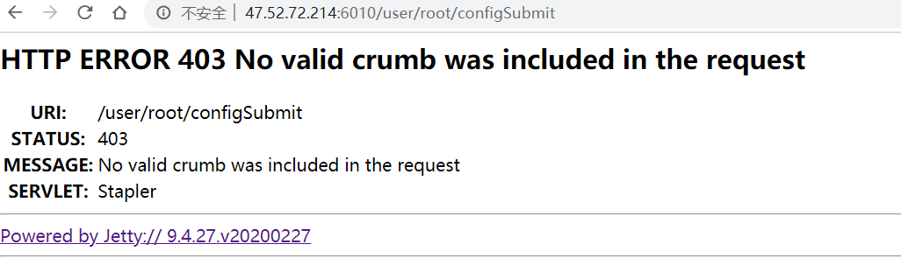

解决，管理jenkins ----> 全局安全配置，下拉选择扩展请求保护，勾选启用代理兼容，下拉保存。

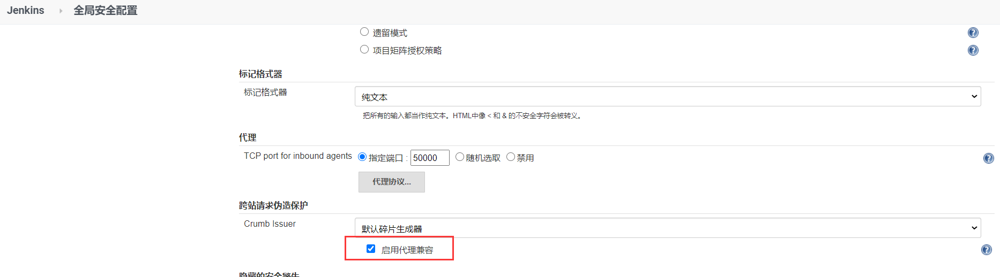

这么解决之后，可能会引发一个新的问题，匿名用户可以登录。


```
docker run \
  -u root \
  --name myjenkins \
  --restart=always \
  -d \
  -p 6010:8080 \
  -p 50000:50000 \
  --env JAVA_OPTS="-Xmx512m" \
  -e JAVA_OPTS=-Duser.timezone=Asia/Shanghai \
  -v /etc/localtime:/etc/localtime \
  -v /docker_data/jenkins_home:/var/jenkins_home \
  -v /var/run/docker.sock:/var/run/docker.sock \
  wangzhangkai/jenkins:1.0
```