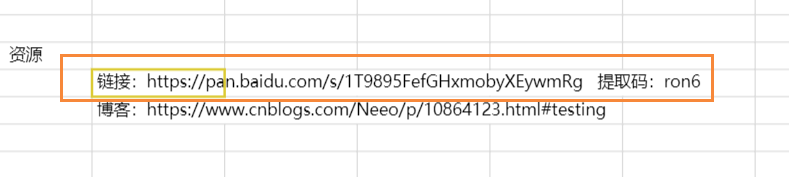
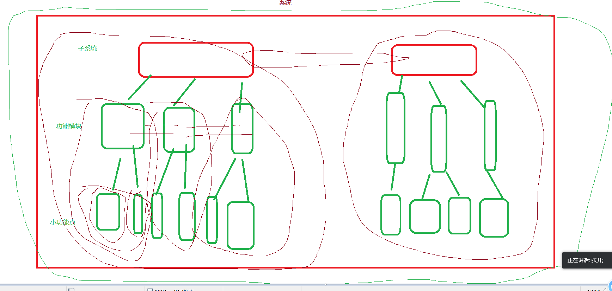

[toc]


# before

1.   感谢小贝老师每天创建腾通文档
2.   关于每天的视频和笔记
    1.  我不会每天给一个百度云链接，而是在每天的腾讯文档中有总视频的链接，失效告诉我一声
    2.  我会在群文件中每天单独发一份笔记，视频不发在群文件



3.  希望大家按时签到
4.  腾讯文档及时扣1，或者写出问题
5.  有什么意见或者建议，跟我私聊


# 内容回顾

1.  **软件测试的定义：通过手工或者相关工具，对`被测对象`进行测试操作。从而验证实际与预期结果是否存在差异。**被测对象不单指代码，也包括，需求文档和配置数据

2.  软件测试出现的原因：

    1.  行业竞争大
    2.  软件复杂度高

3.  测试的主要工作：

    1.  检查代码，评审开发文档。
    2.  进行测试设计、写作测试文档、测试计划、测试方案、测试用例等等。
    3.  执行测试、发现软件缺陷，提交缺陷报告，并**追踪缺陷修复的过程**。

4.  测试原则是指在执行测试工作时必须要遵守的一些规则：

    -   测试证明软件存在缺陷，无论执行什么样的测试操作，都能保证当前软件是有缺陷的。
    -   不能执行穷尽测试，有些功能是没有办法将所有的情况都罗列出来，所以任何的测试操作都有结束的时间。
    -   缺陷存在群集现象，首先要了解一个**二八理论**，即对于软件的功能来说，核心功能占20%，非核心功能占80%（当然，不是绝对的）。那么在测试中，我们会集中测试20%的核心功能。所以，这部分发现缺陷的概率会远高于80%非核心部分。也因此我们遇到的缺陷就都会集中在20%的核心功能这块。
    -   某些测试需要依赖特殊的环境，毋庸置疑，有些测试依赖极端的条件，这种条件有时候很难满足。
    -   **测试应尽早介入**，越早的发现和解决软件存在的缺陷，我们应该尽可能的尽早展开测试。
    -   **杀虫剂现象**，同样的测试用例不能重复执行多次，因为软件会对它产生免疫。比如说，你用`3 * 3`测试出代码不等于`9`，把这个缺陷提交给开发，开发随后解决了这个bug，那我们再测试的时候，就不要用`3 * 3`来测试了，因为开发在改bug的时候，想法设法的让`3 * 3 = 9`，所以，同样的用例，软件会对它产生`免疫`。
    -   不存在缺陷谬论，任何软件不可能是完美的。

5.  测试对象指的是：

    1.  功能集合
    2.  使用说明书
    3.  配置数据

6.  常见的项目组织架构

    1.  产品经理(总监)
        1.  开发(研发经理/主管)
            1.  研发组，研发1组，研发2组
        2.  测试(经理/主管)
            1.  测试组，测试1组，测试2组
        3.  配置(配置经理/主管)
    2.  SQA，软件的质量保证，他们贯穿整个产品周期
    3.   小公司的现状，以路飞为例：
        1.  Alex，大老板
        2.  产品经理，他收集/整理归纳/产品的问题，他提出需求，把控产品的走向
        3.  UI小姐姐，切图
        4.  开发，集开发(前后端)/测试/运维于一身
        5.  半个运维
        6.  运营和推广
        7.  销售
        8.  .........
    
7. 测试用例
   


8. 测试计划书

   1.  
2. **测试计划书内容包含哪些内容**
       -   人力以及时间资源分配
    -   责任划分
       -   风险控制
3. 测试计划书示例参考昨天的笔记
   

   

   
9.   软件的兼容性测试
       1.  当软件处于一个基本测试完毕，并且运行稳定时候，开展兼容性测试
    2.  测试浏览器的兼容性，在谷歌，火狐，ie等多个浏览器中进行测试
           1.  样式
        2.  图片展示
           3.  字体
           4.  ...
   
   10.  版本控制，
        1.  版本控制工具
            1.  SVN，老了点
            2.  git， 推荐使用，用的人多
   
   11.  测试环境
        1.  务必保证测试环境，独立，干净
        2.  务必于开发/线上环境保持一致
            1.  硬件
            2.  软件，版本
        3.  数据
        4.  尽可能的由专人维护
            1.  网络
            2.  硬件
            3.  软件
            4.  测试数据
            5.  测试工具
   12.  常用的测试工具
        1.  selenium
        2.  postman
        3.  fiddler
        4.  禅道
        5.  jmeter
        6.  ....
   
   13.  软件的生命周期
   
   
   
   14.  在软件周期中，开发和测试都遵循一定的模型来展开工作
        1.  测试模型
            1.  V
            2.  W
            3.  H，将测试活动独立出来，跟开发和其他活动分开，准备测试，找测试就绪点，展开测试
        2.  开发模型
            1.  瀑布模型
            2.  快速原型模型，根据用户提出的需求，先实现一个小模型，然后运行模型，得到用的评审，完善模型，重复用户评审；在此基础上，开发软件产品
            3.  螺旋模型，特点是增加了风险控制
            4.  敏捷模型，现在公司常用的开发模型
   
   # 今日内容
   
   1.  测试分类
   2.  测试方法
   
   
   
    
   
   # 今日内容详细
   
   ## 测试分类
   
   **按照被测对象是否执行划分**
   
   1.  静态测试，程序不执行，静态的观察程序代码，接口文档，文字、描述、逻辑
   2.  动态测试，执行程序，然后进行功能校验，查看程序的执行结果是否符合预期值
   
   **按照测试手段划分**
   
   1.  手工测试， 动手干就完了！
   2.  自动化测试，编写自动化脚本，要有人工辅助
   
   **测试阶段划分**
   
   -   开发阶段测试：
       -   单元测试（组件，模块测试，文件测试，函数、类测试）
       -   集成测试(组装测试，测试接口，测试数据结构)
   -   已有成型的产品测试：
       -   系统测试(将软件和计算机硬件，支持软件，数据和工作人员等要素，结合起来，针对产品进行测试)
   -   上线环境，产品可以工作后的测试：
       -   验收测试（正式验收测试、Alpha测试、Beta测试）
   
   一般地，软件从开发到交付使用，要经历的测试有：
   
   -   黑盒测试
   -   白盒测试
   -   单元测试
   -   集成测试
   -   系统测试
   -   验收测试
   
   但是测试人员的角色却在不断发生变化：
   
   -   开发人员在不同的开发阶段要做：黑盒测试、白盒测试、单元测试
   -   测试人员在测试周期内要做：黑盒测试、集成测试、系统测试
   -   而用户要做的就是：验收测试
   
   根据不同的范围，测试可以大致的分为单元测试、集成测试、系统测试和验收测试。体现了测试由小到大、由内致外、循序渐进的测试过程和分而治之的思想。
   
   
   
   ## 各测试分类详解
   
   单元测试（UT，unit testing），是指对软件中的最小可测试单元进行检查和验证。对于单元测试中单元的含义，一般来说，要根据实际情况去判定其具体含义。并且单元测试，粒度最小，一般由开发小组采用白盒方式来测试，主要测试单元是否符合`设计`。一般的，在django中，最小的单元是函数。
   
    
   
   白盒测试主要应用在单元测试阶段，主要是对代码级的测试，针对程序内部逻辑构，测试手段有：
   
   -   语句覆盖
   -   判定覆盖
   -   条件覆盖
   -   路径覆盖
   -   条件组合覆盖
   
   白盒测试也称结构测试或逻辑驱动测试，它是按照程序内部的结构测试程序，通过测试来检测产品内部动作是否按照设计规格说明书的规定正常进行，检验程序中的每条通路是否都能按预定要求正确工作。 这一方法是把测试对象看作一个打开的盒子，测试人员依据程序内部逻辑结构相关信息，设计或选择测试用例，对程序所有逻辑路径进行测试，通过在不同点检查程序的状态，确定实际的状态是否与预期的状态一致。
   
   对比黑盒测试，白盒测试更严谨，对软件的源码和架构进行测试，需要软件源代码，流程图等设计文档。
   
   ```python
   
   def foo(a, b):
       if a == 1 or b ==2:
           print('aaaa', a, b)
       else:
           print('bbbbbbbbbb', a, b)
   
   foo(a=1, b=3)
   foo(a=2, b=2)
   foo(a=2, b=3)
   ```
   
   
   
   集成测试（IT，system integration test），又称为组装测试，界于单元测试和系统测试之间，起到`桥梁作用`，一般由开发小组采用白盒加黑盒的方式来测试，既验证`设计`，又验证`需求`。 主要用来测试模块与模块之间的接口，同时还要测试一些主要业务功能。集成测试（也叫组装测试，联合测试）是单元测试的逻辑扩展。它最简单的形式是：把两个已经测试过的单元组合成一个组件，测试它们之间的接口。从这一层意义上讲，组件是指多个单元的集成聚合。在现实方案中，许多单元组合成组件，而这些组件又聚合为程序的更大部分。方法是测试片段的组合，并最终扩展成进程，将模块与其他组的模块一起测试。最后，将构成进程的所有模块一起测试。此外，如果程序由多个进程组成，应该成对测试它们，而不是同时测试所有集成测试进程。
   
    系统测试（ST，system test）粒度最大，一般由独立测试小组采用黑盒方式来测试，主要测试系统是否符合`需求规格说明书`。在经过以上各阶段测试确认之后，把系统完整地模拟客户环境来进行的测试。系统测试是将已经确认的软件、计算机硬件、外设、网络等其他元素结合在一起，进行信息系统的各种组装测试和确认测试，其目的是通过与系统的需求相比较，发现所开发的系统与用户需求不符或矛盾的地方，从而提出更加完善的方案。它的的任务是尽可能彻底地检查出程序中的错误，提高软件系统的可靠性，其目的是检验系统"做得怎样？"。这阶段又可分为三个步骤：
   
   -   模块测试，测试每个模块的程序是否有错误。
   -   组装测试，测试模块之间的接口是否正确。
   -   确认测试，测试整个软件系统是否满足用户功能和性能的要求。
   
    
   
    
   
   验收测试（AT，acceptance test）与系统测试相似，主要区别是测试人员不同，验收测试由用户执行。一般分为：
   
   -   **α测试（内测）**：Alpha测试模拟实际操作环境下验收测试，如删档内测试，软件只是初步完成的产品，bug可能较多，不会进行上线提供用户访问。
   -   **β测试（公测）**：Beta测试系统已经通过内部测试，大部分错误已经修复，即将正式发布，在多个真实环境下发布，如不删档公测。
       对比α版本已经有了较大改进，但仍可能存在一些bug，需要大规模测试，例如DNF公司更新一个地图，提供公测免费下载，由专业游戏玩家进行游戏结果反馈，开发者再进行修复。
   -   **γ版本**：Gamma版本，指的是软件版本正式发行的候选版本，与即将发布的正式版相差无几。Gamma版也可以称为RC（Release Candidate）版本。
   -   **UAT测试**：UAT测试（user acceptance test），UAT（用户验收测试）阶段的测试就不是软件开发商自己的测试来做了，而是由客户根据自己的实际业务场景，（或派人员）来使用软件，对具体的功能进行测试。
   
    
   
    随机测试也称为探索测试。
   
   主要是对被测软件的一些**重要功能**进行复测，也包括测试那些当前测试用例没有覆盖到的部分。除此之外，对于软件的更新和新增功能进行重点测试，尤其是对一些特殊情况点、特殊的使用环境、并发性等进行测试，还包括以前测试中发现的**重大bug**进行再次测试。
   
   随机测试可以结合回归测试一起进行。


灰度发布（或称金丝雀发布，或称灰度测试），是指在黑与白之间能够平滑过渡的一种发布方式。在其上可以进行A/B testing，即让一部分用户继续用产品特性A，一部分用户开始用产品特性B，如果用户对B没有什么反对意见，那么逐步扩大范围，把所有用户都迁移到B上面来。

灰度发布是对某一产品的发布逐步扩大使用群体范围，也叫灰度放量。灰度发布可以保证整体系统的稳定，在初始灰度的时候就可以发现、调整问题，以保证其影响度。

灰度期：灰度发布开始到结束期间的这一段时间，称为灰度期。

**灰度发布的意义**

灰度发布能及早获得用户的意见反馈，完善产品功能，提升产品质量，让用户参与产品测试，加强与用户互动，降低产品升级所影响的用户范围。

**灰度发布的步骤**

-   定义目标
-   选定策略：包括用户规模、发布频率、功能覆盖度、回滚策略、运营策略、新旧系统部署策略等
-   筛选用户：包括用户特征、用户数量、用户常用功能、用户范围等
-   部署系统：部署新系统、部署用户行为分析系统（web analytics）、设定分流规则、运营数据分析、分流规则微调
-   发布总结：用户行为分析报告、用户问卷调查、社会化媒体意见收集、形成产品功能改进列表
-   产品完善
-   新一轮灰度发布或完整发布

小结：


参考：https://www.cnblogs.com/Neeo/articles/11795967.html


## 测试方法

黑盒测试常用方法：

-   等价类划分法
-   场景法
-   边界值
-   因果图
-   判定表

白盒测试，参考：https://www.cnblogs.com/Neeo/articles/11795996.html

-   语句覆盖
-   条件覆盖
-   路径覆盖


**程序插桩**

[程序插桩](https://baike.baidu.com/item/程序插桩)，最早是由J.C. Huang 教授提出的，它是在保证被测程序原有逻辑完整性的基础上在程序中插入一些[探针](https://baike.baidu.com/item/探针/1846154)（又称为“探测仪”，本质上就是进行信息采集的[代码段](https://baike.baidu.com/item/代码段/9966451)，可以是[赋值语句](https://baike.baidu.com/item/赋值语句/4248688)或采集覆盖信息的[函数调用](https://baike.baidu.com/item/函数调用/4127405)），通过[探针](https://baike.baidu.com/item/探针/1846154)的执行并抛出程序运行的[特征](https://baike.baidu.com/item/特征/6205236)数据，通过对这些数据的[分析](https://baike.baidu.com/item/分析/4327108)，可以获得程序的[控制流](https://baike.baidu.com/item/控制流/854473)和数据流信息，进而得到[逻辑覆盖](https://baike.baidu.com/item/逻辑覆盖/3231015)等动态信息，从而实现测试目的的方法。

简单来说，程序插桩就是我们在调试程序时，常常要在程序中插入一些打印语句（想想我们在程序中常用的print语句），其目的是希望在程序执行中打印出我们最为关心的信息，然后进一步通过这些信息了解程序执行过程中程序的一些动态特性。

从这一思想发展出程序插桩技术能够按照用户的要求，获取程序的各种信息，成为测试工作的有效测试手段。


我们一般从以下五个维度来区分：

-   测试阶段不同：
    -   单元测试阶段主要利用白盒测试方法。
    -   集成测试阶段主要利用灰盒测试方法。
    -   系统测试阶段主要利用黑盒测试方法。
-   测试依据，因为测试阶段的不同，采用的测试方法也不同，那它们的测试依据也不同：
    -   白盒测试主要依据详细测试说明书（LLD）。
    -   黑盒测试主要依据需求规格（设计）说明书（SRS）。
    -   灰盒测试主要依据概要规格（设计）说明书（HLD）。
-   测试方法：
    -   白盒测试方法可以有静态和动态，控制流、信息流、数据流、各种覆盖率、插桩处理。
    -   黑盒测试方法有各种测试类型（功能型、负载、恢复性），以及应用等价类、边界值、流程图法、正交法等。
    -   灰盒测试这里即用白盒的，也用黑盒的。
-   评估基准：
    -   白盒根据逻辑覆盖率来评估。
    -   黑盒主要看需求规格的覆盖率。
    -   灰盒主要看接口覆盖率。
-   特点不一样：
    -   白盒测试，特点是及早的发现问题，定位问题也很快，缺点是对接口、对设计、程序之间的调用、用户感受也不是很好。
    -   黑盒解决问题的代价比较大，很大发现模块内部的问题。

# 等价类划分法


**选取少数具有代表性的数据作为测试用例**，这种测试用例我们称为**等价类（类别）划分法**。

优点：

-   将不能穷举的测试过程进行合理的分类，从而保证设计出来的测试用例具有完整性和代表性。

-   在有限的测试资源的情况下，用少量有代表性的数据得到比较好的测试效果。

等价类划分分为（基本概念）：

-   有效等价类，指符合《需求规格说明书》，输入合理的数据集合。
-   无效等价类，指不符合《需求规格说明书》，输入不合理的数据集合。

等价类思考步骤：

-   首先确定有效等价类和无效等价类
-   有效等价类就是一目了然的题目条件（比如在0~20之间测试），要考虑到两端的极值（边界值）和中间值。
-   无效等价类先划分与条件相反的情况（比如不在0~20范围内），再去找特殊情况，如中英文，符号、空格、空等。

**等价类划分发的测试思想**

-   穷举测试：把所有可能的数据全部测试一遍称为穷举测试，虽然穷举测试是最全面的测试，但是很明显不现实，因为测试效率太低了，数据量巨大，根本测不过来（思考前面计算器的例子）。但又因为没有做过穷举测试，所以会有遗漏缺陷的风险，如果时间允许，尽可能的做补充测试（觉得有风险有问题的做补充测试）。
-   理想的测试思想，使用最少的测试数据，达到最好的测试质量，毕竟性价比还是要追求的嘛。
-   而等价类划分法则是从大量的数据中，划分范围（或分类），每个范围内的数据测试效果是等价的，所以每个范围是一个等价类，然后从每个范围内挑选出具有代表性的数据，这些代表数据能反映这个范围内的测试结果。
-   等价类划分法的基本思想是：
    -   有效等价类，对于程序来说，是有意义的，合理的输入数据集合，然后测试功能是否符合预期。
    -   无效等价类，对于程序来说，是无意义的，不合理的输入数据集，用来测试程序是否具有强大的异常处理能力，也就是测试程序的健壮性。


#  边界值

**什么是边界值？**

边界是指对于输入等价类和输出等价类而言，稍高于边界值和稍低于边界值的一些特定情况，边界值分析法常应用于黑盒测试中。边界值也可以称为极值。

根据以往的经验来看：**大量的错误是发生在输入或者输出范围的边界上，而不是再输入范围的内部**。所以，为了保证测试质量，我们需要重点关注测试边界。


**确定边界值的一般思路**

-   确定边界情况，也就是确定输入或者输出等价类的边界
-   选取正好等于、刚刚大于、刚刚小于边界值作为测试数据

边界值的方法思考：

-   如果输入条件规定了范围，则应该取这个范围的边界值，比如`1~100`，边界值应该取`0 1 100 101`。
-   如果输入条件规定了输入值的个数。比如密码长度为`8~24`，边界值应该取`7 8 9 23 24 25`位字符来判断。
-   边界值和等价类的区别，**边界值分析不是从等价类中随便找一个作为代表，而是整个等价类的每个边界都要作为测试条件。**
-   边界值的思想是在结合实际环境，应该选出到边界和刚超过的值作为测试依据。边界值和等价类是相辅相成的，共同使测试用例更加完善。

常见的边界值：

-   循环中的第1、2次和倒数第1、2次。
-   数值元素的第一个和最后一个值。
-   报表的第一行和最后一行。
-   文本框接收字符个数，用户名长度啊，密码长度等。


# 因果图和判定表

无论是等价类还是边界值，都重点的考虑的是输入输出的情况。但很少考虑输入(多个输入)输出之间的组合和制约情况。

因果图（Cause-Effect Graph）法是一种利用图解法分析输入的各种组合情况，从而设计测试用例的方法，它适用于检查程序输入条件的各种组合情况。
**因果图法的特点**

-   考虑输入条件的相互制约及组合关系
-   考虑输出条件对输入条件的依赖关系

**因果图法产生的背景**

-   等价类划分法和边界值分析方法都是着重的考虑输入条件，但是极少的考虑输入条件的各种组合、输入条件之间的相互制约关系，这样虽然各种输入条件可能出错的情况已经测试到了，但是多个输入条件组合起来可能出错的情况却很难发现。
-   如果在测试的时候，必须考虑输入条件的组合情况，那么可能的组合情况将非常的多，导致测试任务繁重。因此，我们必须考虑一种适合于描述多种条件的组合，相应产生多个动作的形式来进行测试用例的设计，这就用到了因果图，也就是设计逻辑模型。

**因果图的核心**

-   因果图法适用于输入条件较多的情况，测试所有输入条件的排列组合。因果图所谓的因就是输入，而果就是输出。
    -   因果图之`因`，即输入条件。
    -   因果图之`果`，即输出结果。

**因果图法要注意考虑的要点**

-   所有输入/输出条件的相互制约关系及组合关系。
-   输出结果对输入条件的依赖关系，也就是什么样的输入组合会产生怎样的输出结果，即`因果关系`。

因果图只是一种辅助工具，我们通过因果图分析出一个表，这个表就是判定表，然后通过判定表编写测试用例。但是有的时候，画因果图非常麻烦，影响测试效率，所以，我们很多时候都是直接写判定表，进而编写测试用例。

**判定表的组成**

-   条件桩：问题的所有条件，即所有的条件组合。
-   动作桩：问题的所有输出，即所有的输出组合。
-   条件项：针对条件桩的取值。
-   动作项：条件项的各种取值情况下的输出结果。

**判定表制作步骤**

-   列出所有的条件桩和动作桩。
-   填入条件项与动作项，得到初始判定表。
-   简化判定表（合并相似规则（相同动作））。


# 今日作业

1.  把今天讲的黑盒测试用例的示例，敲一遍
2.  预习剩下的黑盒测试方法
3.  预习，缺陷管理：https://www.cnblogs.com/Neeo/articles/11796009.html
4.  预习，敏捷开发：https://www.cnblogs.com/Neeo/articles/10579119.html
5.  尝试安装禅道：https://www.cnblogs.com/Neeo/articles/12620853.html


