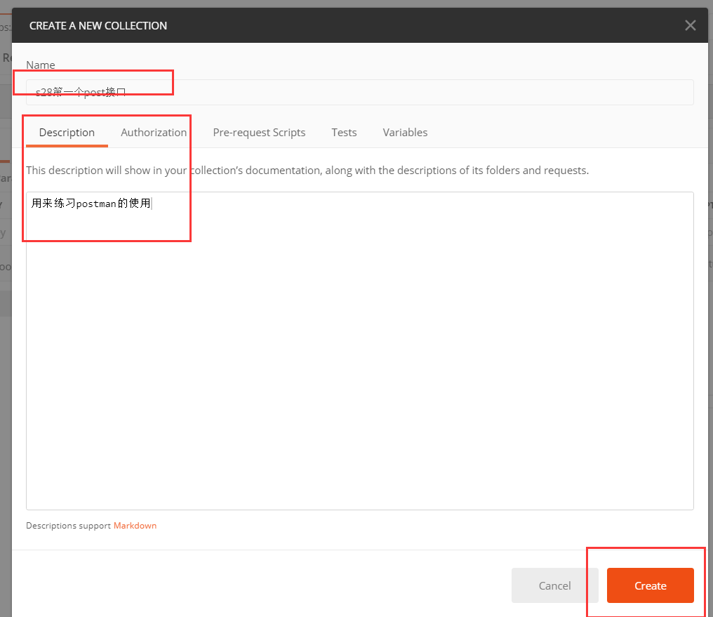

[toc]


# 内容回顾

禅道的下载，安装和使用

**docker环境搭建的禅道**

```
mkdir /data
docker pull idoop/zentao:12.0.1
docker run -d -p 6003:80 -p 3308:3306 --restart=always -e ADMINER_USER="root" -e ADMINER_PASSWD="password" -e BIND_ADDRESS="false" -v /docker_data/zentao_data:/opt/zbox/ --add-host smtp.exmail.qq.com:163.177.90.125 --name zentao-server idoop/zentao:latest
```

启动成功后，直接浏览器访问`ip:6003`，默认的账号密码：

```
账号：admin
密码：123456
```

**禅道的使用流程**

1.  修改admin账号的密码


2.  参考上面的流程进行操作
3.  角色的创建

**产品管理阶段**

2.  产品经理创建产品
3.  产品经理创建产品计划
    1.  在该计划周期内，完成的任务量，建立模块
4.  创建模块
5.  创建需求
    1.  对需求进行评审
        1.  确认通过，
        2.  有待明确，该需要需要继续完善
    2.  需求进行变更
        1.  走需求变更的流程
        2.  线下的活动，对变更进行评审


**项目阶段**

1.  项目经理创建项目
    1.  项目的立项会，
    2.  产品人员/需求人员要跟项目团队说明产品情况，沟通需求，必要的是，更改需求
2.  建立项目与产品的绑定关系
3.  建立开发团队
4.  建立项目关联需求的操作
5.  项目的开发阶段
    1.  领取任务，
    2.  开站立会议，汇报昨日工作情况和今日的任务安排，是否遇到什么困难
    3.  维护任务看板
6.  当所有的需求都实现完毕，并且通过自测
7.  构建版本
    1.  绑定该版本都实现了哪些需求，及关联需求
8.  提测

**测试阶段**

1.  开发提测
2.  当开发在开发功能时，测试人员在做测试准备，如编写测试计划，编写测试用例，准备测试环境和数据。
3.  首先是创建用例
    1.  用例需要评审，即走一个评审流程。但是，禅道默认用例的评审功能是关闭的。我们需要手动打开该泳衣评审流程。
    2.  进行用例评审
        1.  是否通过
4.  将用例与版本进行关联
5.  执行用例
    1.  如果关键步骤执行失败，与预期不符，就应该转bug，一般转给开发该功能的开发人员。
        1.  在转bug的时候，一定要简单扼要的说明bug情况，客观事实的编写复现步骤。目的是帮助开发人员尽快的去发现、定位bug，
    2.  当测试在提交一个bug后
        1.  指定修复人员，即开发人员
        2.  开发在接到bug后，首先进行确认操作，
        3.  确认完毕后，真实的去修复bug，然后再点击解决。此时bug处于已完成了。
        4.  测试人员对该bug进行回归测试
        5.  如果没有问题，就关闭该bug
        6.  如果有问题，开发继续修复bug。然后再进行回归测试。


# 今日内容概要

接口测试：

1.  requests
2.  postman
3.  unittest/pytest
4.  接口测试平台和自动化脚本
5.  参考：https://www.cnblogs.com/Neeo/articles/11809457.html


# 今日内容详情

requests是基于urllib的HTTP库，可以帮助我们发送各式各样的请求，携带各式各样的参数。

```
pip install requests
```


**请求**

包括：

-   如何发送不同类型的请求
    -   get
    -   post
    -   delete
    -   put
    -   。。。。
-   在请求中，如何携带参数
    -   cookies
    -   headers
    -   data
    -   json

**响应**

在响应对象中：

-   都有哪些属性
-   json
-   bytes
-   文本类型


如何通过响应头判断该响应体的内容？通过content-type来判断：

-   json类型的响应content-type:application/json 
-   图片：content-type:image/gif
-   文本类型的响应：content-type:text/html


如果获取到的文本内容有乱码，如何解决？

1.  要想到查看当前页面编码格式
2.  使用response.encoding = 编码格式


requests.request(method, url, **kwargs)类能够构造一个请求，支持不同的请求方式。

```python
import requests

response = requests.request(method='get', url='https://www.baidu.com')
print(response.status_code)
```

request类中来看看几个参数：

-   method：请求方式。
-   url：请求URL。
-   **kwargs：
    -   params：字典或者字节序列，作为参数增加到url中，使用这个参数可以把一些键值对以`k1=v1&k2=v2`的模式增加到url中，get请求中用的较多。
    -   data：字典、字节序列或者文件对象，重点作为向服务器提供或提交资源，作为请求的请求体，与params不同放在url上不同。它也可以接受一个字符串对象。
    -   json：json格式的数据，可以向服务器提交json类型的数据。
    -   headers：字典，定义请求的请求头，比如可以headers字典定义user agent。
    -   cookies：字典或者CookieJar。
    -   auth：元组，用来支持HTTP认证功能。
    -   files：字典，用来向服务器传输文件。
    -   timeout：指定超时时间。
    -   proxies：字典，设置代理服务器。
    -   allow_redirects：开关，是否允许对URL进行重定向，默认为True。
    -   stream：开关，是否对获取内容进行立即下载，默认为False，也就是立即下载。这里需要说明的，stream一般应用于流式请求，比如说下载大文件，不可能一次请求就把整个文件都下载了，不现实，这种情况下，就要设置`stream=True`，requests无法将连接释放回连接池，除非下载完了所有数据，或者调用了response.close。
    -   verify：开关，用于SSL证书认证，默认为True。
    -   cert：用于设置保存本地SSL证书路径。

>   流式请求，指的不是请求是流，而是请求返回的数据流，返回一点取一点，而普通的请求是返回完毕你再取内容。


分享：http://www.neeo.cc:6001/   # httpbin，提供了常用的请求方式，用于接口练习


## requests示例介绍


### params参数

常用于get请求。

```python
import requests
# response = requests.get(url='http://www.neeo.cc:6001/get?user=zhangkai&pwd=666')
# print(response.json())

params = {
    "user": "张开",
    "pwd": 666
}
response = requests.get(url='http://www.neeo.cc:6001/get', params=params)
print(response.json())
```

### headers

该参数使用所有请求需要携带请求头的场景。

```python
import requests
headers = {
    "user-agent": "Mozilla/5.0 (Windows NT 10.0; Win64; x64) AppleWebKit/537.36 (KHTML, like Gecko) Chrome/81.0.4044.113 Safari/537.36"
}

response = requests.get('https://www.zhihu.com/question/361649589/answer/1163303688', headers=headers)
print(response.status_code)
print(response.text)
```


## cookies参数


```python
import requests
# 1. 登录,获取cookies值

response = requests.post(url="http://www.neeo.cc:6002/pinter/bank/api/login?userName=admin&password=1234")
print(response.json())
print(response.cookies)
print(response.cookies.get_dict())


# 2. 在需要cookies验证的时候，携带上刚才获取到的cookies值
response = requests.get(url='http://www.neeo.cc:6002/pinter/bank/api/query?userName=admin', cookies=response.cookies.get_dict())
print(response.status_code)
print(response.json())
```

## data参数

```python
import requests
data = {
    "userName": "=admin",
    "password": "1234"
}
response = requests.post(url="http://www.neeo.cc:6002/pinter/bank/api/login", data=data)
print(response.json())
print(response.cookies)
```

## json参数

```python
import requests
response = requests.post('http://www.neeo.cc:6001/post', json={"user":"zhangkai"})
print(response.json())
```


## 文件上传

```python
import requests
file = {"file": open('a.gif', 'rb')}
response = requests.post("http://www.neeo.cc:6001/post", files=file)
print(response.json())
```


# requests/bs4爬虫练习


```python
import os
import requests
from bs4 import BeautifulSoup   # 解析爬取回来的文本，去其中找标签/标签的属性/标签的内容
BASE_DIR = os.path.dirname(os.path.abspath(__file__))

url = "https://www.autohome.com.cn/news/"
response = requests.request('get', url=url, )
# print(response.encoding)
response.encoding = "GBK"   # 解决乱码问题
# print(response.text)
# 解析文本，拿到解析后的soup对象，所有解析后的数据都在soup对象中
soup_obj = BeautifulSoup(response.text, "html.parser")   # response.text: 要解析的文本    html.parser：指定什么解析器来解析文本
# 使用soup对象找div标签
div_obj = soup_obj.find(name='div', attrs={"id": "auto-channel-lazyload-article"})
# print(div_obj)
# 根据div对象，找其内的所有的img标签
img_list = div_obj.find_all(name="img")
# print(img_list[0])
for item in img_list:
    # print(item)
    # 获取标签的src属性
    img_url = item.get("src")
    if not img_url.startswith("https:"):
        img_url = "https:" + item.get("src")
    img_url = "https:" + item.get("src")
    # 使用requests模块向img url发请求，获取bytes类型数据，并且保存到本地
    img_response = requests.get(img_url)
    file_name = os.path.join(BASE_DIR, 'images', img_url.rsplit("/", 1)[-1])
    with open(file_name, 'wb') as f:
        f.write(img_response.content)
    print(file_name, "download done .........")

```

beautifulsoup4:

-   soup_obj = BeautifulSoup(response.text, "html.parser")   # response.text: 要解析的文本    html.parser：指定什么解析器来解析文本
-   soup_obj.find(name=标签名， attr={”属性名":"属性值"})  因为找到的标签可能有多个，那使用attr来过滤指定的标签。
-   soup_obj.find_all(name=标签名， attr={”属性名":"属性值"}))  找到所有以attr过滤的标签。
-   img.get('src')，表示获取指定标签的属性
-   获取标签的文本内容，使用标签名.text


# postman

1.  常见的接口
    1.  普通的get请求
    2.  带参数get请求
    3.  post请求：k:v
    4.  post请求：k:{“k1”:"va1"}
    5.  post请求：json
    6.  webservice接口
2.  特殊的接口
    1.  文件上传
    2.  cookies
    3.  token
    4.  签名接口
3.  环境管理
    1.  如何配置环境
4.  断言
    1.  状态码断言
    2.  json断言
5.  接口自动化
6.  命令行测试
7.  参数化配置


## 普通请求


2.  k:v格式的post请求


3.  参数为json的post请求


3.  文件上传：


## 集合的概念

将同一类型，同一项目的接口管理起来。





