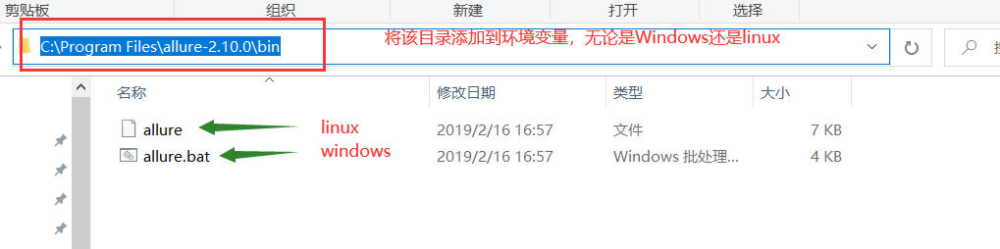
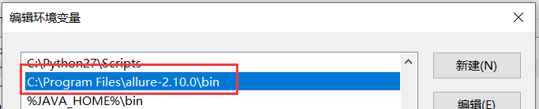
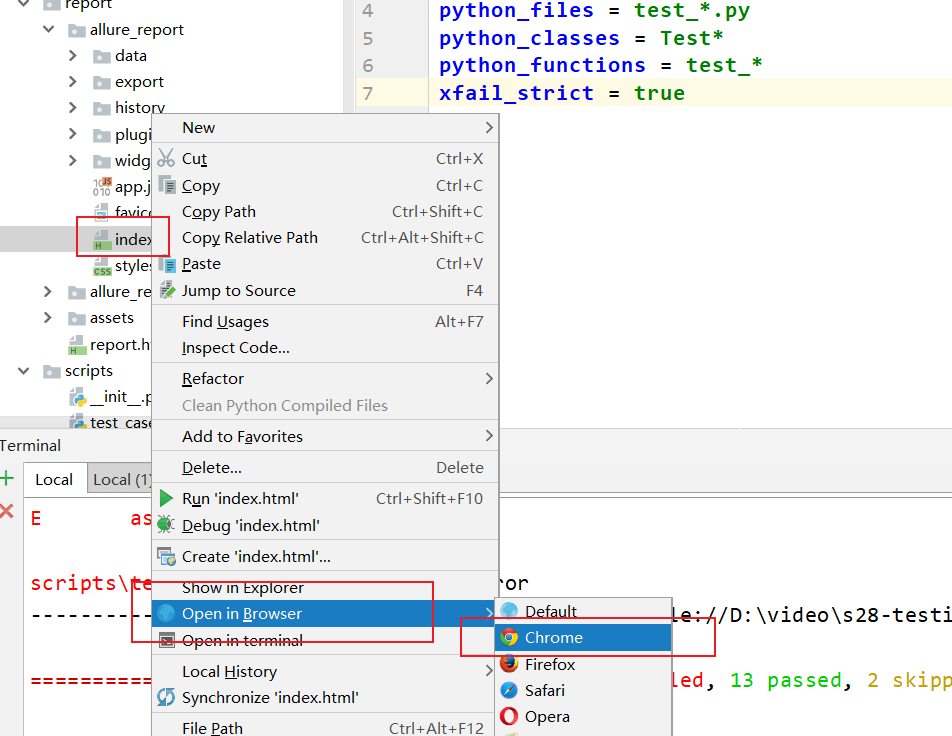
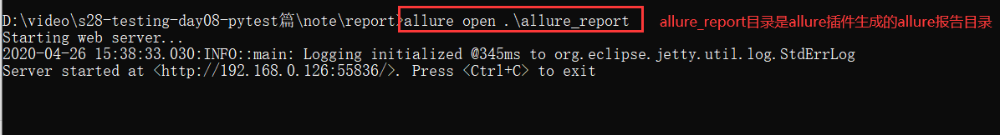
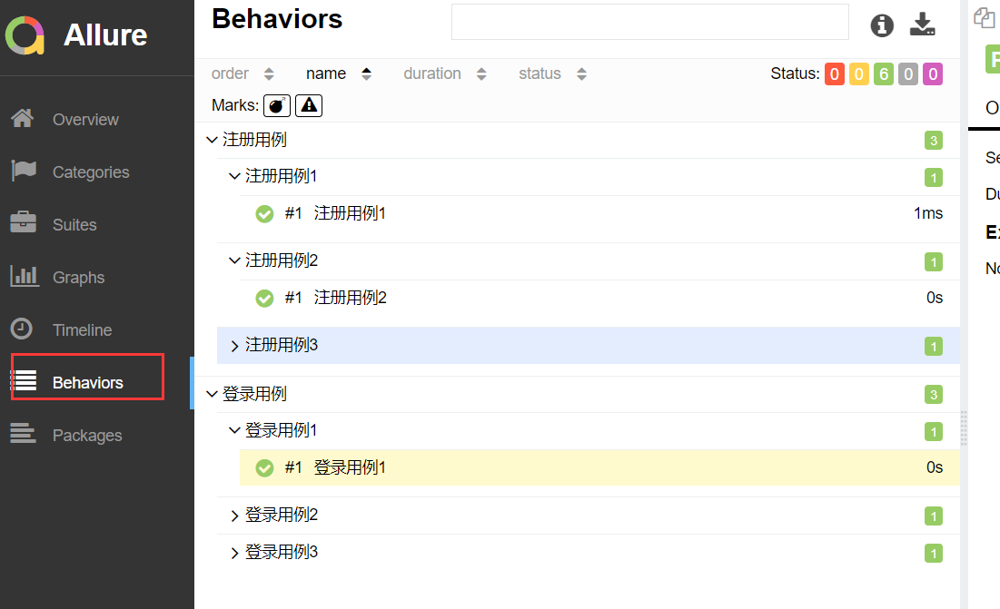

[toc]

# before

明天（4.27）由建超老师补一天的linux

# 内容回顾

unittest框架：
1. 自定义的类必须继承unittest.TestCase 
2. runTest的用法
3. 断言，直接self.assertTrue
4. 测试套件，即手动/自动的将多个符合条件(方法名以test)的用例收到到一个集合(容器)中；使用 unittest.TextTestRunner 执行器去执行集合中的用例
    - 手动的，unittest.TestSuite，需要手动的实例化用例，手动的创建集合，手动的将用例添加到的集合中，手动的构造执行器执行集合中的用例
        - suite.addTest()
        - suite.addTests()
        - suite.countTestCases()
    - unittest.makeSuite(testCaseClass=, prefix=), 自动的创建集合，并且在创建的时候，将用例添加到集合中
        - testCaseClass，收集该指定类中的用例
        - 收集以prefix开头的用例
5. unittest.defaultTestLoader
    - `unittest.defaultTestLoader`等价于`unittest.TestLoader()`
    - unittest.defaultTestLoader.discover(),递归收集指定Python包中的以`pattern="test_"`开头脚本，收集脚本中unittest.TestCase的子类，以test开头的用例
        - top_level_dir，顶级的目录
        - start_dir， 收集顶级目录内的指定子目录内的用例；start_dir的目录不能大于top_level_dir；可以小于或者等于，但不能大于。
        - pattern，指定收集以pattern开头的用例脚本。
    - unittest.defaultTestLoader.loadTestsFromModule()， 加载指定的模块中的用例
    - unittest.defaultTestLoader.loadTestsFromName()， 加载指定的脚本中的指定用例。
    - unittest.defaultTestLoader.loadTestsFromNames()，加载指定的脚本中的多个指定用例。
6. verbosity,控制控制台输出结果的详细超程度
    - 0， 输出简洁的结果
    - 1，默认的输出形式
    - 2， 详细输出形式
7. skip，跳过用例
    - unittest.skip(reason)，描述一下逃过用例的原因，然后该用例在本次的执行中，不执行，即跳过用例，但是它会被收集到结果中。
    - unittest.skipIf(condition, reason) ,condition是跳过用例的条件，reason是描述一下逃过用例的原因。
8. setUp/setUpClass/teardown/teardownClass
    - setUp,在每个用例执行前执行的特殊方法
    - setUpClass，在所有的用例执行前执行的特殊方法，使用的时候，别忘了，加@classmethod
    - teardown，在每个用例执行后执行的特殊方法
    - teardownClass,在所有的用例执行后执行的特殊方法，使用的时候，别忘了，加@classmethod
9. unittest.main，自动的收集当前脚本中的测试用例并且执行。
10. 生成测试报告
    - 使用的是第三方的报告插件，参考：https://www.cnblogs.com/Neeo/articles/7942613.html
11. 将测试报告发送到指定的邮箱中，用到了第三方的邮箱服务器，参考：
    - https://www.cnblogs.com/Neeo/articles/11199127.html#%E9%80%9A%E8%BF%87smtp%E5%8F%91%E9%82%AE%E4%BB%B6
    - https://www.cnblogs.com/Neeo/articles/11199127.html

# 关于pytest

pytest单元测试框架：
- 插件丰富
- 简单
- 易上手
- 可以搭配其他的第三方工具生成漂亮的测试报告
- 参数化

# pytest的安装
1. 下载

```
pip install pytest
```

2. 测试是否安装成功

```
C:\Users\Anthony>pytest --version
This is pytest version 5.3.5, imported from c:\python36\lib\site-packages\pytest\__init__.py
setuptools registered plugins:
  allure-pytest-2.8.9 at c:\python36\lib\site-packages\allure_pytest\plugin.py
  pytest-forked-1.1.3 at c:\python36\lib\site-packages\pytest_forked\__init__.py
  pytest-html-2.0.1 at c:\python36\lib\site-packages\pytest_html\plugin.py
  pytest-metadata-1.8.0 at c:\python36\lib\site-packages\pytest_metadata\plugin.py
  pytest-ordering-0.6 at c:\python36\lib\site-packages\pytest_ordering\__init__.py
  pytest-rerunfailures-8.0 at c:\python36\lib\site-packages\pytest_rerunfailures.py
  pytest-xdist-1.31.0 at c:\python36\lib\site-packages\xdist\plugin.py
  pytest-xdist-1.31.0 at c:\python36\lib\site-packages\xdist\looponfail.py
```

# 简单上手


注意，pytest运行的脚本名称，不能含有`.`,比如`2.内容回顾.py`，你可以写成`2-内容回顾.py`,否则报错：
```
ModuleNotFoundError: No module named '2'
```
解决`collected 0 items`的问题。
在pytest执行脚本的过程中，它会读取以`test`开头的函数，或者以`Test`开头的类。
```python


import pytest

def test_run_01():

    assert 1

def test_run_02():

    assert 1


if __name__ == '__main__':
    pytest.main(['2-pytest简单使用.py'])
```
当执行完毕，用例通过使用`.`表示，`F`表示断言失败。

# pytest中的setup和teardown
在pytest中，setupteardown有以下几种：
- 模块级别的setup和teardown，作用于当年模块内所有的用例执行性前后
    - setup_module
    - teardown_module
- 函数级别的setup和teardown，作用于每个函数的执行前后
    - setup_function
    - teardown_function
- 类级别的setup和teardown，作用于类中所有用例的前后
    - setup_class
    - teardown_class
- 类中用例级别的setup和teardown
    - setup_method
    - teardown_method


## 函数级别的

```python
import pytest

def setup_function():
    print("在函数执行前执行我")

def teardown_function():
    print("在函数执行后执行我")

def test_case_01():

    assert 1

def test_case_02():

    assert 1

if __name__ == '__main__':
    pytest.main(['-v', '-s', '3-setup和teardown.py'])
```

## 类级别的

```python
class TestCase(object):

    def setup_class(self):
        print("在类中，所有用例执行 前 执行我")

    def teardown_class(self):
        print("在类中，所有用例执行 后 执行我")

    def test_case_03(self):
        assert 1

    def test_case_04(self):
        assert 1
```
## 类中方法级别的
```python
class TestCase(object):

    def setup_class(self):
        print("在类中，所有用例执行 前 执行我")

    def teardown_class(self):
        print("在类中，所有用例执行 后 执行我")

    def setup_method(self):
        print("类中方法级别， 在用例 前 执行我")

    def teardown_method(self):
        print("类中方法级别， 在用例 后 执行我")

    def test_case_03(self):
        assert 1

    def test_case_04(self):
        assert 1
```


## 模块级别的

```python
def setup_module():
    print("模块级别的 setup_module")


def teardown_module():
    print("模块级别的 teardown_module")


def setup_function():
    print("在函数执行前执行我")

def teardown_function():
    print("在函数执行后执行我")

def test_case_01():

    assert 1

def test_case_02():

    assert 1


class TestCase(object):

    def setup_class(self):
        print("在类中，所有用例执行 前 执行我")

    def teardown_class(self):
        print("在类中，所有用例执行 后 执行我")

    def setup_method(self):
        print("类中方法级别， 在用例 前 执行我")

    def teardown_method(self):
        print("类中方法级别， 在用例 后 执行我")

    def test_case_03(self):
        assert 1

    def test_case_04(self):
        assert 1
```


# 配置文件

```ini
[pytest]
addopts = -s -v
testpaths = ./scripts
python_files = test_*.py
python_classes = Test*
python_functions = test_*
```
各参数：
- `addopts`, 执行时读取的参数
    - `-v`，控制pytest输出结果的详细程度
    - `-s`，在pytest的输出中，输出我们自己写的print，默认是不输出的。
- `testpaths`，收集所有的用例集合。
- `python_files`，读取以该参数指定前缀的脚本。
- `python_classes`，定义类的类名必须是`Test`
- `python_functions`，定义函数的函数名。

配置配置文件的注意事项：
- `scripts`目录一般跟`pytest.ini`文件同级别。
- `pytest.ini`文件中不允许有中文；并且该文件必须在项目的根目录下面。

# 跳过用例
```python
import pytest

@pytest.mark.skip(reason='无条件跳过')
def test_case_01():
    assert 1


@pytest.mark.skipif(condition=1 < 2, reason="condition条件为真时跳过用例")
def test_case_02():

    assert 1
```

# 标记预期失败
场景：
某个用例我预期它会失败，那就对这个接口标记一下：
- 预期失败，实际执行结果是失败。
- 预期失败，但是实际执行结果是成功的。如果有特殊要求的话，那么该用例我们可以将它认为是执行失败。 

```
scripts/test_xfail.py::test_case_01 FAILED
scripts/test_xfail.py::test_case_02 XFAIL
scripts/test_xfail.py::test_case_03 PASSED
scripts/test_xfail.py::test_case_04 FAILED
scripts/test_xfail.py::test_case_01 XPASS
```
如果在配置文件中，添加了`xfail_strict=true`，表示如果预期失败，确执行成功的的用例标记为失败。
- FAILED：用例执行失败
- XFAIL：预期失败，实际执行结果也是失败
- PASSED:正常的用例通过标识
- FAILED:正常的用例失败标识
- XPASS:预期失败，执行结果却成功的标识。


# 参数化：parametrize

pytest支持参数化，及从外部引入数据进行测试。


```python
import pytest

phone = [10086, 10010, 110]

@pytest.mark.parametrize('item', phone)
def test_case(item):   # item命名遵从于argnames参数，
    print(111, item)
    assert 1
```
@pytest.mark.parametrize(argnames, argvalues):
- argnames:表示每次从argvalues中提取的一个元素
- argvalues:表示要传的数据，如列表、元组、字典、集合

多参数：

```python
import pytest
phone = [10086, 10010, 110]
code = ['10086', '10010', '110']


@pytest.mark.parametrize('item,code', zip(phone, code))
def test_case(item, code):
    print(111, item, code)
    assert 1

```

# 固件：@pytest.fixture()

固件，简单来说，就是测试夹具，类似于setup/teardown的功能，但是相对的比较灵活。

简单用法：
```python
import pytest

@pytest.fixture()
def login():   # 固件
    print("登录成功")

def test_index(login):  # 该用例执行之前要登录
    print("index page")
    assert 1
```
在用例函数中传递固件的函数名。

**预处理和后处理**
```python
import pytest
@pytest.fixture()
def db():
    print("connect db。。。")   # 预处理，在用例执行之前做的逻辑

    yield

    print('close db .....')   # 后处理，在用例执行之后要做的逻辑

def test_index(db):  # 该用例执行之前要登录
    print("index page")
    assert 1
```

# 失败重跑：rerun

当用例执行失败后，可以指定重新运行的次数，常用来处理网络不佳的情况下。

使用之前下载：
```
pip install pytest-rerunfailures
```

**使用**
在配置文件的`addopts`参数后跟 --reruns=3
```ini
addopts = -s -v --reruns=3
```
使用的时候，正常的写用例和执行即可，当检测到用例执行失败，就会自动的触发rerun，直到在规定次数内尝试执行用例成功，那该用例就执行成功了，否则重新尝试至规定的次数，然后该用例执行失败。


# 控制用例执行顺序:pytest-ordering

默认的， pytest中，用例的执行顺序是从上到下的形式。如果有需要自定义控制用例执行顺序的话，就需要用ordering插件。

**下载**
```
pip install pytest-ordering
```

使用：
```python
import pytest

@pytest.mark.run(order=2)
def test_case_02():
    assert 1
@pytest.mark.run(order=1)
def test_case_01():
    assert 1
@pytest.mark.run(order=3)
def test_case_03():
    assert 1

class TestCase(object):

    def test_case_06(self):
        assert 1

    def test_case_05(self):
        assert 1


    @pytest.mark.run(order=4)
    def test_case_04(self):
        assert 1
```
如果，有排序的和五排序的用例同时存在，则优先执行有排序的；在安装找默认的从上到下的顺序执行无排序的。

# html插件：pytest-html
在pytest中，要想生成测试报告，需要单独下载测试报告插件：

```
pip install pytest-html
```
使用，编辑配置文件：
```ini
[pytest]
addopts = -s --html=./report/report.html

```

# allure


## allure插件安装

allure是第三方的轻量级的测试报告插件：
- 易安装
- 界面优美
- 可配置性强

allure依赖Java环境，你要安装Java 环境：https://www.cnblogs.com/Neeo/articles/11954283.html

allure插件下载：百度云盘链接：链接：https://pan.baidu.com/s/1Xj1A_xsRscOZHskTR4xjAg 提取码：6b33

或者去https://github.com/allure-framework/allure2/releases下载


allure插件安装：
解压压缩包到一个没有中文的目录中，然后将其中的bin目录添加到环境变量(PATH)中





测试，终端输入：


## Python安装allure模块

Python通过allure模块生成allure需要的中间数据——json数据。

在使用allure插件读取json数据，进而生成allure测试报告。


下载allure模块：

```
pip install allure-pytest
```

配置`pytest.ini`文件：

```ini
[pytest]
addopts = --alluredir ./report/result
```

使用allure插件读取json数据，生成allure报告：

```
allure generate report/result -o report/allure_html --clean
```

**注意**，allure报告的展示需要HTTP服务器的支持。所以，目前来说，有两种打开方式：

-   使用pycharm打开



-   第二种就是使用allure自带的open命令打开



## 其他用法

### 为用例添加标题和描述信息

```python
import pytest

import allure

@allure.title("第一个测试用例")
@allure.description("这个一个阴沉的天")
def test_case_01():
    assert 1

@allure.title("第二个测试用例")
@allure.description("下着雨")
def test_case_02():
    assert 0

```

### feature和story

行为驱动标记，简单理解为为用例分类。

```python
import pytest

import allure

@allure.feature("登录用例")
class TestLogin(object):

    @allure.story("登录用例1")
    @allure.title("登录用例1")
    def test_case_01(self):
        assert 1

    @allure.story("登录用例2")
    @allure.title("登录用例2")
    def test_case_02(self):
        assert 1

    @allure.story("登录用例3")
    @allure.title("登录用例3")
    def test_case_03(self):
        assert 1

@allure.feature("注册用例")
class TestRegister(object):
    @allure.story("注册用例1")
    @allure.title("注册用例1")
    def test_case_01(self):
        assert 1

    @allure.story("注册用例2")
    @allure.title("注册用例2")
    def test_case_02(self):
        assert 1

    @allure.story("注册用例3")
    @allure.title("注册用例3")
    def test_case_03(self):
        assert 1
```





### severity

allure中对bug的严重（severity）级别也有定义，allure使用`severity`来标识测试用例或者测试类的bug级别，分为blocker，critical，normal，minor，trivial5个级别。一般，bug分为如下几个级别：

-   Blocker级别：中断缺陷（客户端程序无响应，无法执行下一步操作），系统无法执行、崩溃或严重资源不足、应用模块无法启动或异常退出、无法测试、造成系统不稳定。
-   Critical级别：即影响系统功能或操作，主要功能存在严重缺陷，但不会影响到系统稳定性。比如说一个服务直接不可用了，微信不能发消息，支付宝不能付款这种，打开直接报错。
-   Major：即界面、性能缺陷、兼容性。如操作界面错误（包括数据窗口内列名定义、含义是否一致）、长时间操作无进度提示等。
-   Normal级别：普通缺陷（数值计算错误），是指非核心业务流程产生的问题，比如说知乎无法变更头像，昵称等。这个要看自己的定义。
-   Minor/Trivial级别：轻微缺陷（必输项无提示，或者提示不规范），比如各种影响体验，但不影响使用的内容。


```python
import pytest

import allure

@allure.feature("登录用例")
class TestLogin(object):
    @allure.severity(allure.severity_level.BLOCKER)
    @allure.story("登录用例1")
    @allure.title("登录用例1")
    def test_case_01(self):
        assert 1

    @allure.severity(allure.severity_level.NORMAL)
    @allure.story("登录用例2")
    @allure.title("登录用例2")
    def test_case_02(self):
        assert 0


    @allure.severity(allure.severity_level.NORMAL)
    @allure.story("登录用例3")
    @allure.title("登录用例3")
    def test_case_03(self):
        assert 1

@allure.feature("注册用例")
class TestRegister(object):


    @allure.story("注册用例1")
    @allure.title("注册用例1")
    @allure.severity(allure.severity_level.BLOCKER)
    def test_case_01(self):
        assert 0

    @allure.severity(allure.severity_level.MINOR)
    @allure.story("注册用例2")
    @allure.title("注册用例2")
    def test_case_02(self):
        assert 1

    @allure.severity(allure.severity_level.MINOR)
    @allure.story("注册用例3")
    @allure.title("注册用例3")
    def test_case_03(self):
        assert 0
```

### dynamic

在参数化的时候，我们无法使用allure的相关功能，因为装饰器中是写死的功能，在参数中，数据都是在用例中使用。所以，我们采用allure.dynamic参数动态的为用例添加相关的功能。

```python
import requests
import pytest
import allure


url_list = [
    {'url': "https://www.baidu.com", "method": "get", "status": 200, "title": "百度"},
    {'url': "https://www.cnblogs.com/Neeo/articles/11832655.html", "method": "get", "status": 200, "title":"cnblogs"},
    {'url': "http://www.neeo.cc:6001/post", "method": "post", "status": 200, "title":"post接口"},
    {'url': "http://www.neeo.cc:6001/put", "method": "put", "status": 200, "title":"put接口"},
]


@pytest.mark.parametrize('item', url_list)
def test_case(item):

    allure.dynamic.title(item['title'])
    response = requests.request(method=item['method'], url=item['url'])
    # print(response.status_code,  item['status'])
    assert response.status_code == item['status']
```


