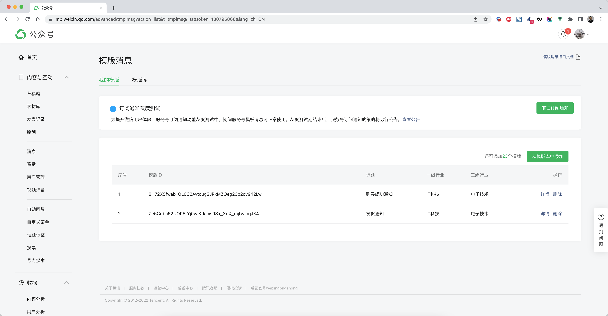
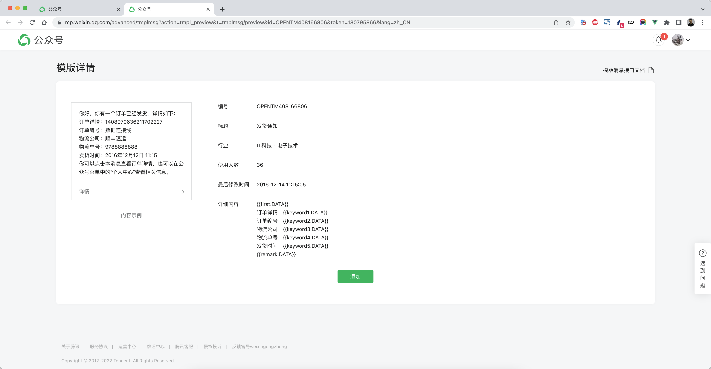
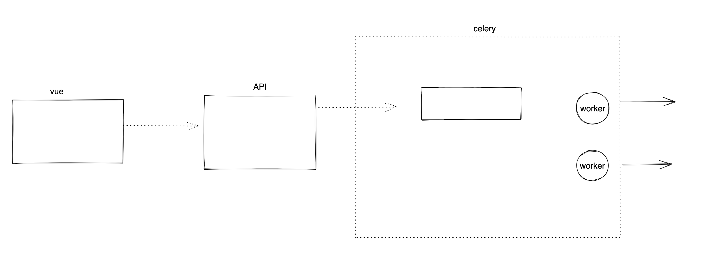
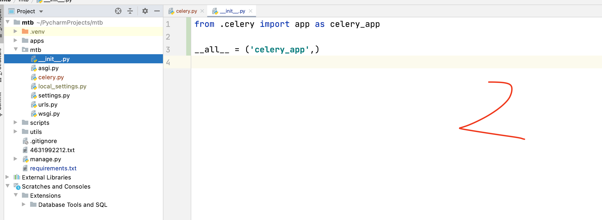
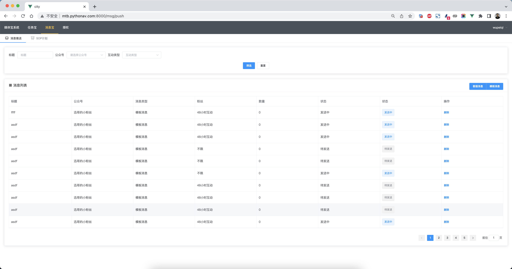

## 6.媒体宝-消息宝

消息宝的核心功能就是代替公众号向粉丝发送消息，微信为公众号向粉丝发送消息提供了两类：

- 模板消息

  ```
  https://developers.weixin.qq.com/doc/offiaccount/Message_Management/Template_Message_Interface.html
  ```

- 客服消息，只有48小时内有互动的才能发送客服消息。

  ```
  https://developers.weixin.qq.com/doc/offiaccount/Message_Management/Service_Center_messages.html#%E5%AE%A2%E6%9C%8D%E6%8E%A5%E5%8F%A3-%E5%8F%91%E6%B6%88%E6%81%AF
  ```


### 6.1 模板消息

在公众平台上可以选择添加消息模板。

https://mp.weixin.qq.com/advanced/tmplmsg?action=list&t=tmplmsg/list&token=180795866&lang=zh_CN







调用微信提供的接口去发送模板消息：

> http请求方式: POST https://api.weixin.qq.com/cgi-bin/message/template/send?access_token=ACCESS_TOKEN

```json
{
    "touser":"OPENID",
    "template_id":"ngqIpbwh8bUfcSsECmogfXcV14J0tQlEpBO27izEYtY",      
    "data":{
        "first": {
            "value":"恭喜你购买成功！",
            "color":"#173177"
        },
        "keyword1":{
            "value":"巧克力",
            "color":"#173177"
        },
        "keyword2": {
            "value":"39.8元",
            "color":"#173177"
        },
        "keyword3": {
            "value":"2014年9月22日",
            "color":"#173177"
        },
        "remark":{
            "value":"欢迎再次购买！",
            "color":"#173177"
        }
    }
}
```


#### 6.1.1 获取所有模板

https://developers.weixin.qq.com/doc/offiaccount/Message_Management/Template_Message_Interface.html

获取已添加至帐号下所有模板列表，可在微信公众平台后台中查看模板列表信息。为方便第三方开发者，提供通过接口调用的方式来获取帐号下所有模板信息，具体如下:

**接口调用请求说明**

> http请求方式：GET https://api.weixin.qq.com/cgi-bin/template/get_all_private_template?access_token=ACCESS_TOKEN

**参数说明**

| 参数         | 是否必须 | 说明         |
| :----------- | :------- | :----------- |
| access_token | 是       | 接口调用凭证 |

**返回说明**

正确调用后的返回示例：

```json
{	
     "template_list": [{
      "template_id": "iPk5sOIt5X_flOVKn5GrTFpncEYTojx6ddbt8WYoV5s",
      "title": "领取奖金提醒",
      "primary_industry": "IT科技",
      "deputy_industry": "互联网|电子商务",
      "content": "{ {result.DATA} }\n\n领奖金额:{ {withdrawMoney.DATA} }\n领奖  时间:    { {withdrawTime.DATA} }\n银行信息:{ {cardInfo.DATA} }\n到账时间:  { {arrivedTime.DATA} }\n{ {remark.DATA} }",
      "example": "您已提交领奖申请\n\n领奖金额：xxxx元\n领奖时间：2013-10-10 12:22:22\n银行信息：xx银行(尾号xxxx)\n到账时间：预计xxxxxxx\n\n预计将于xxxx到达您的银行卡"
   }]
}
```


#### 6.1.2 获取粉丝OpenID

https://developers.weixin.qq.com/doc/offiaccount/User_Management/Getting_a_User_List.html

公众号可通过本接口来获取帐号的关注者列表，关注者列表由一串OpenID（加密后的微信号，每个用户对每个公众号的OpenID是唯一的）组成。一次拉取调用最多拉取10000个关注者的OpenID，可以通过多次拉取的方式来满足需求。

接口调用请求说明

```text
http请求方式: GET（请使用https协议）
https://api.weixin.qq.com/cgi-bin/user/get?access_token=ACCESS_TOKEN&next_openid=NEXT_OPENID
```

| 参数         | 是否必须 | 说明                                     |
| :----------- | :------- | :--------------------------------------- |
| access_token | 是       | 调用接口凭证                             |
| next_openid  | 是       | 第一个拉取的OPENID，不填默认从头开始拉取 |

返回说明

正确时返回JSON数据包：

```text
{
    "total":2,
    "count":2,
    "data":{
    	"openid":["OPENID1","OPENID2"]
    },
    "next_openid":"NEXT_OPENID"
}
```


#### 6.1.3 发送消息

调用微信提供的接口去发送模板消息：

> http请求方式: POST https://api.weixin.qq.com/cgi-bin/message/template/send?access_token=ACCESS_TOKEN

```json
{
    "touser":"OPENID",
    "template_id":"ngqIpbwh8bUfcSsECmogfXcV14J0tQlEpBO27izEYtY",      
    "data":{
        "first": {
            "value":"恭喜你购买成功！",
            "color":"#173177"
        },
        "keyword1":{
            "value":"巧克力",
            "color":"#173177"
        },
        "keyword2": {
            "value":"39.8元",
            "color":"#173177"
        },
        "keyword3": {
            "value":"2014年9月22日",
            "color":"#173177"
        },
        "remark":{
            "value":"欢迎再次购买！",
            "color":"#173177"
        }
    }
}
```


### 6.2 客服消息

https://developers.weixin.qq.com/doc/offiaccount/Message_Management/Service_Center_messages.html

当用户给公众号发送消息时，可以将其信息记录下来，48小时以内都可以向此人推送客服消息。


#### 6.2.1 互动表


#### 6.2.2 发送消息

**接口调用请求说明**

> http请求方式: POST https://api.weixin.qq.com/cgi-bin/message/custom/send?access_token=ACCESS_TOKEN

各消息类型所需的JSON数据包如下：

发送文本消息

```json
{
    "touser":"OPENID",
    "msgtype":"text",
    "text":
    {
         "content":"Hello World"
    }
}
```

发送图片消息（图片上传到微信，返回MEDIA_ID）

```json
{
    "touser":"OPENID",
    "msgtype":"image",
    "image":
    {
      "media_id":"MEDIA_ID"
    }
}
```


### 6.3 互动信息更新

#### 6.3.1 表结构

在msg的app中创建表结构。

```python
from django.db import models


class Interaction(models.Model):
    """ 互动表，用于记录最近48小时内有互动的人 """
    authorizer_app_id = models.CharField(verbose_name="公众号授权ID", max_length=64)
    user_open_id = models.CharField(max_length=64, verbose_name="互动粉丝ID")
    end_date = models.PositiveIntegerField(verbose_name="互动截止时间戳", help_text="互动时间+48小时")

```

#### 6.3.2 触发更新

```python
import importlib
event_list = [
    "apps.msg.event.handler",
    # "apps.task.event.handler",
]
for path in event_list:
    module_path, func_name = path.rsplit(".", maxsplit=1)
    module = importlib.import_module(module_path)
    func = getattr(module, func_name)
    func(authorizer_app_id, decrypt_xml)
```


`apps.msg.event.py`

```python
import time
import xml.etree.cElementTree as ET
from . import models


def handler(authorizer_app_id, decrypt_xml):
    """ 接收消息 """
    xml_tree = ET.fromstring(decrypt_xml)
    msg_type = xml_tree.find("MsgType").text

    # 更新互动表
    if msg_type in {"text", "image", "voice", "video"}:
        from_user_open_id = xml_tree.find("FromUserName").text
        models.Interaction.objects.update_or_create(
            defaults={"end_date": int(time.time()) + 48 * 60 * 60},
            authorizer_app_id=authorizer_app_id,
            user_open_id=from_user_open_id,
        )
```


### 6.4 发送消息




#### 6.4.1 表结构


#### 6.4.2 vue页面（客服消息）


#### 6.4.3 drf接口（客服消息）

- 接收请求
- 表单验证
- 如果是图片，就上传到素材库获取media_id
- 执行celery任务，去执行消息发送（创建任务生成任务ID）    - **暂时先不做**
- 写入数据库（待执行）


#### 6.4.4 Celery

Celery是由Python开发的一个简单、灵活、可靠的处理大量任务的分发系统。


- 在服务器上安装redis并启动（记得腾讯云设置安全组6379端口）

  ```
  参考文档：https://pythonav.com/wiki/detail/10/82/
  ```

- 安装python操作redis模块

  ```
  pip install redis
  ```

- 安装celery（基于Python开发）

  ```
  参考文档：https://docs.celeryq.dev/en/stable/index.html
  ```

  ```
  pip install celery
  ```

  ```
  如果是windows请在安装一个eventlet
  pip install eventlet
  ```


#### 6.4.5 Celery（客服消息）

当准备工作都安装成功后，接下来就需要在django项目中配置，配置成功后才能运行。配置步骤如下：





```
celery -A  mtb worker -l info -P eventlet
```


#### 6.4.6 vue页面（模板消息）


#### 6.4.7 drf接口（模板消息）

- 接口请求
- 数据校验
- 全部粉丝 or 48小时互动粉丝
- 模板消息发送（celery）+ 状态更新


```python
template_list = 
[
    
    {
      "template_id": "iPk5sOIt5X_flOVKn5GrTFpncEYTojx6ddbt8WYoV5s",
      "title": "领取奖金提醒",
      "primary_industry": "IT科技",
      "deputy_industry": "互联网|电子商务",
      "content": "{ {result.DATA} }\n\n领奖金额:{ {withdrawMoney.DATA} }\n领奖  时间:    { {withdrawTime.DATA} }\n银行信息:{ {cardInfo.DATA} }\n到账时间:  { {arrivedTime.DATA} }\n{ {remark.DATA} }",
      "example": "您已提交领奖申请\n\n领奖金额：xxxx元\n领奖时间：2013-10-10 12:22:22\n银行信息：xx银行(尾号xxxx)\n到账时间：预计xxxxxxx\n\n预计将于xxxx到达您的银行卡",
        "item_dict":{"result":"", "withdrawMoney":"", ....}
	},
        {
      "template_id": "iPk5sOIt5X_flOVKn5GrTFpncEYTojx6ddbt8WYoV5s",
      "title": "领取奖金提醒",
      "primary_industry": "IT科技",
      "deputy_industry": "互联网|电子商务",
      "content": "{ {result.DATA} }\n\n领奖金额:{ {withdrawMoney.DATA} }\n领奖  时间:    { {withdrawTime.DATA} }\n银行信息:{ {cardInfo.DATA} }\n到账时间:  { {arrivedTime.DATA} }\n{ {remark.DATA} }",
      "example": "您已提交领奖申请\n\n领奖金额：xxxx元\n领奖时间：2013-10-10 12:22:22\n银行信息：xx银行(尾号xxxx)\n到账时间：预计xxxxxxx\n\n预计将于xxxx到达您的银行卡",
             "item_dict":{"result":"", "withdrawMoney":"", ....}
	}
]
```

```python
{
    "iPk5sOIt5X_flOVKn5GrTFpncEYTojx6ddbt8WYoV5s":{
      "template_id": "iPk5sOIt5X_flOVKn5GrTFpncEYTojx6ddbt8WYoV5s",
      "title": "领取奖金提醒",
      "primary_industry": "IT科技",
      "deputy_industry": "互联网|电子商务",
      "content": "{ {result.DATA} }\n\n领奖金额:{ {withdrawMoney.DATA} }\n领奖  时间:    { {withdrawTime.DATA} }\n银行信息:{ {cardInfo.DATA} }\n到账时间:  { {arrivedTime.DATA} }\n{ {remark.DATA} }",
      "example": "您已提交领奖申请\n\n领奖金额：xxxx元\n领奖时间：2013-10-10 12:22:22\n银行信息：xx银行(尾号xxxx)\n到账时间：预计xxxxxxx\n\n预计将于xxxx到达您的银行卡",
        "item_dict":{"result":"", "withdrawMoney":"", ....}
	},
    "iPk5sOIt5X_flOVKn5GrTFpncEYTojx6ddbt8WYoV5s":{
      "template_id": "iPk5sOIt5X_flOVKn5GrTFpncEYTojx6ddbt8WYoV5s",
      "title": "领取奖金提醒",
      "primary_industry": "IT科技",
      "deputy_industry": "互联网|电子商务",
      "content": "{ {result.DATA} }\n\n领奖金额:{ {withdrawMoney.DATA} }\n领奖  时间:    { {withdrawTime.DATA} }\n银行信息:{ {cardInfo.DATA} }\n到账时间:  { {arrivedTime.DATA} }\n{ {remark.DATA} }",
      "example": "您已提交领奖申请\n\n领奖金额：xxxx元\n领奖时间：2013-10-10 12:22:22\n银行信息：xx银行(尾号xxxx)\n到账时间：预计xxxxxxx\n\n预计将于xxxx到达您的银行卡",
        "item_dict":{"result":"", "withdrawMoney":"", ....}
	},
    
}
```


#### 6.4.8 消息页面




### 6.5 SOP

SOP的核心功能是就是实现**定时消息**的发送（发送模板消息）。


## 小结

至此，消息宝的功能完成了。


