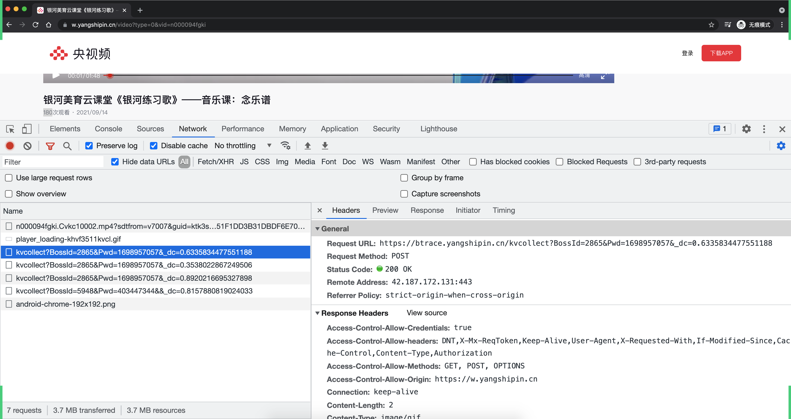
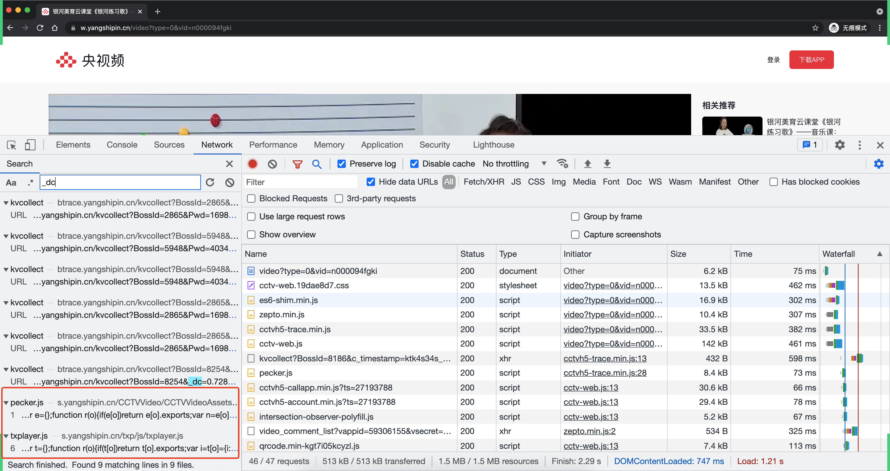
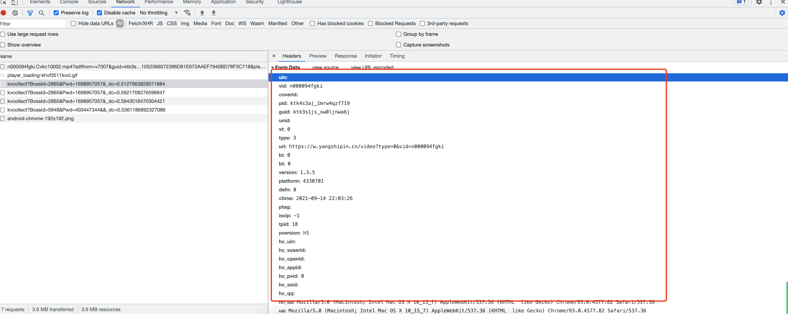
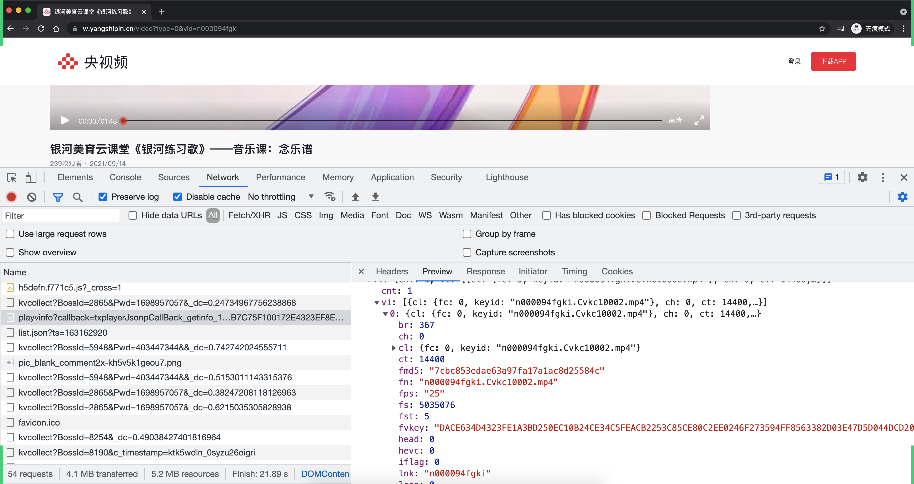
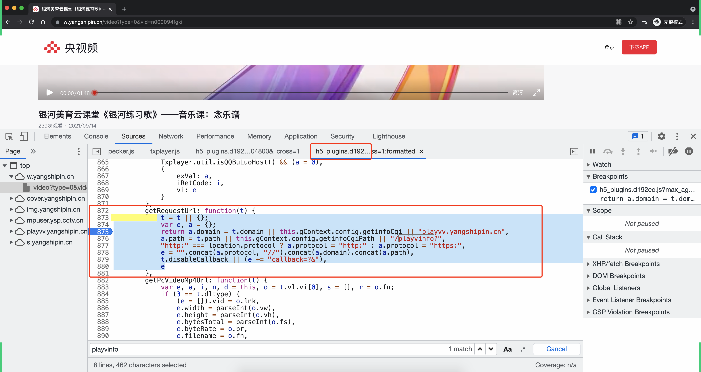
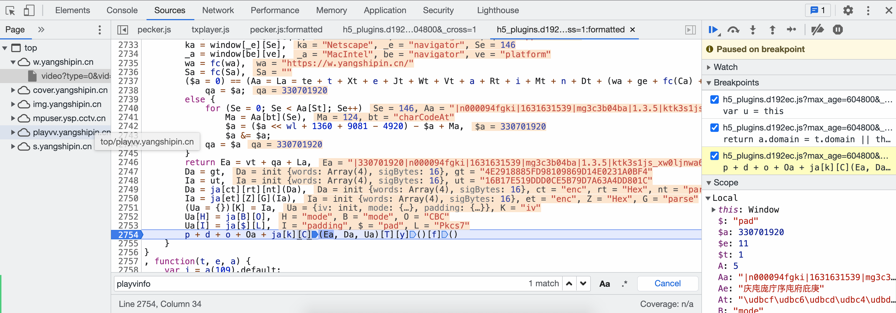
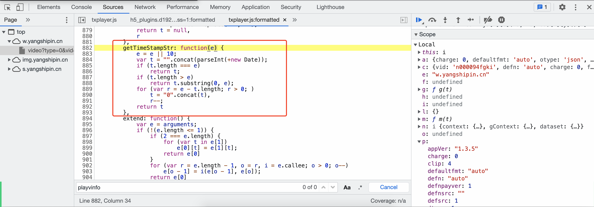

## 关于课程

- 模块

  - JS逆向案例
  - APP逆向（*）
  - 平台开发：刷播放量

- 上课节奏：8：00 ~ 10:00 

- 大家需要提前准备：

  - Python开发环境 & Pycharm。

  - 建议：安卓手机（root）

    - 绝大部分：安卓模拟器

    - 少部分：安卓手机（root）

      ```
      我自己：红米8A，想办法去root.
      - 解开BL锁（等7天左右）
      - 才能root操作
      ```

      


## 今日内容

> 专业干刷单（12人+3000部手机）。
>
> 某视频的播放量（腾讯技术）。


### 1.前戏

#### 1.1 JSONP


#### 1.2 AES加密

> Python默认想要进行AES加密，都要通过一个第三方模块。
>
> ```
> pip install pycryptodome==3.10.1
> ```


基础版本（app逆向）：

```python
from Crypto.Cipher import AES
from Crypto.Util.Padding import pad


def aes_encrypt(data_string):
    key = "fd6b639dbcff0c2a1b03b389ec763c4b"
    iv = "77b07a672d57d64c"
    aes = AES.new(
        key=key.encode('utf-8'),
        mode=AES.MODE_CBC,
        iv=iv.encode('utf-8')
    )
    raw = pad(data_string.encode('utf-8'), 16)
    return aes.encrypt(raw)


data = "aadzfalskdjf;lkaj;dkjfa;skdjf;akjsdf;kasd;fjaoqwierijhnlakjdhf"
result = aes_encrypt(data)
print(result)
```


变换版本：

```python
from Crypto.Cipher import AES
from Crypto.Util.Padding import pad
import binascii

KEY = "4E2918885FD98109869D14E0231A0BF4"
KEY = binascii.a2b_hex(KEY)

IV = "16B17E519DDD0CE5B79D7A63A4DD801C"
IV = binascii.a2b_hex(IV)


def aes_encrypt(data_string):
    aes = AES.new(
        key=KEY,
        mode=AES.MODE_CBC,
        iv=IV
    )
    raw = pad(data_string.encode('utf-8'), 16)
    aes_bytes = aes.encrypt(raw)
    return binascii.b2a_hex(aes_bytes).decode().upper()


data = "|878975262|d000035rirv|1631615607|mg3c3b04ba|1.3.5|ktjwlm89_to920weqpg|4330701|https://w.yangshipin.cn/|mozilla/5.0 (macintosh; ||Mozilla|Netscape|MacIntel|"
result = aes_encrypt(data)
print(result)
```


逆向的过程中，如果看到的AES，一定要去找：key、iv


#### 1.3 JS原型和面向对象

```python
ES5，不支持面向对象（居多）。
ES6，支持面向对象。

即使专业前端开发会用一些框架（ES6编写） --> 自动转换成ES5  --> 用户获取JS的面向对象的代码（ES5）。
```


```javascript
// JS中定义了一个函数
function f1(){
    
}

f1()
```

```javascript
// JS中定义了一个函数
function f1(a1,a2){
    
}

f1(1,2)
```

```javascript
// JS中定义了一个函数
function f1(a1,a2){
    this.a1 = a1;  // this，就像python中的self
    this.a2 = a2;
}

// 实例化一个对象
var data = new f1(1,2)
data.a1  // 1
data.a2  // 2
```

```javascript
// JS中定义了一个函数（构造方法）
function f1(a1,a2){
    this.a1 = a1;  // this，就像python中的self
    this.a2 = a2;
}

// 基于原型实现的面向对象中的方法。（方法）
f1.prototype = {
    preInfo:function(a3){
        // this.a1
        return this.a1 + this.a2 + a3;   # 【断点】
    }
}


// 实例化一个对象
var data = new f1(1,2)
data.a1  // 1
data.a2  // 2

var result = data.preInfo(100)
console.log(result) // 103

# 问题：如果以后你某中方式确定，推到上面的调用者的话，就可以去找构造方法。
# 问题：上述示例，找到构造方法了，你能看出来a1是谁传的值，以及等于什么？接下来应该继续在往上找。
# 问题：如何找？
# 		- 根据特征去代码中通篇去找。
# 		- 找调用栈。
```

```python
class f1(object):
    def __init__(self,a1,a2):
        self.a1 = a1
        self.a2 = a2
        
    def preInfo(self,a3):
        return self.a1 + self.a2 + self.a3 

data =f1(1,2)
data.preInfo(100)
```


### 2.正餐

视频地址：https://w.yangshipin.cn/video?type=0&vid=n000094fgki

#### 2.1 用无痕模式

以前你访问过这个平台的话，有一些的cookie会记录下来（模拟第一次访问），内部算法生成的值都会重新计算一遍。


#### 2.2 分析网络请求


#### 2.3 点击播放分析（URL）

点击播放按钮后发生了啥？如果通过代码模拟出来了，就可以去刷播放量了。




```
https://btrace.yangshipin.cn/kvcollect?BossId=2865&Pwd=1698957057&_dc=0.6335834477551188

https://btrace.yangshipin.cn/kvcollect?BossId=2865&Pwd=1698957057&_dc=0.8475775671033112
																	  0.7764171909658486

所以：
	BossId，固定。
	Pwd，固定。
	_dc，去所有的js中搜索 _dc，如果能直接搜到并看到：_dc=xxx、 get_dc、create_dc
	
一般情况下，如果你们在URL中看到:
	- 时间戳
        >>> time.time()
        1631626900.097156
        >>> time.time()
        1631626901.741516
        >>> time.time()
        1631626902.218645
	- 随机数
		JS: Math.random()
		Python:
			import random
			_dc = random.random()
			
		
```

- 关于参数

  - 参数固定

  - 算法生成

    ```
    当我们在js中找到算法的具体实现了，我们就有两种方式去实现这个算法：
    - 用Python代码直接实现。
    - 写JS + Python + node.js 可以直接去编译JS代码并的到结果。
    ```

  - 之前的请求返回

搜索 `_dc`





#### 2.4 点播播放分析（请求体）




请求体中数据来源：

- 参数固定

  ```
  version: 1.3.5
  platform: 4330701
  ```

- 算法生成

  ```
  pid
  guid
  ```

- 之前发给咱们的

  ```
  vurl，其实就是视频的地址。
  
  问题：视频地址是怎么来的？
  https://mp4playcloud-cdn.ysp.cctv.cn/n000094fgki.Cvkc10002.mp4?sdtfrom=v7007&guid=ktk3s1js_xw0ljnwa6j&vkey=3475262D508387FF356D4D84989A058ABC495EBD0F89E7300A87A15C70DE5584A007A714E4326E5BB79047390EF700569BF305ABA8B28A29A10D0598EC5064E05365DFF66A90D6B84DD9B6FF600060C309C2FD27AA55EA53B1FB13F6FD483DD7A1D9BEA2E3D32FD3AA0F82CD951052366072396D81E673AAEF7940BD78F3C718&platform=2
  
  https://mp4playcloud-cdn.ysp.cctv.cn/n000094fgki.Cvkc10002.mp4?sdtfrom=v7007&guid=ktk3s1js_xw0ljnwa6j&vkey=3475262D508387FF356D4D84989A058ABC495EBD0F89E7300A87A15C70DE5584A007A714E4326E5BB79047390EF700569BF305ABA8B28A29A10D0598EC5064E05365DFF66A90D6B84DD9B6FF600060C309C2FD27AA55EA53B1FB13F6FD483DD7A1D9BEA2E3D32FD3AA0F82CD951052366072396D81E673AAEF7940BD78F3C718&platform=2
  ```

  

##### 2.4.1 vurl是怎么来的？

```
https://mp4playcloud-cdn.ysp.cctv.cn/n000094fgki.Cvkc10002.mp4?sdtfrom=v7007&guid=ktk3s1js_xw0ljnwa6j&vkey=3475262D508387FF356D4D84989A058ABC495EBD0F89E7300A87A15C70DE5584A007A714E4326E5BB79047390EF700569BF305ABA8B28A29A10D0598EC5064E05365DFF66A90D6B84DD9B6FF600060C309C2FD27AA55EA53B1FB13F6FD483DD7A1D9BEA2E3D32FD3AA0F82CD951052366072396D81E673AAEF7940BD78F3C718&platform=2
```

```
n000094fgki.Cvkc10002，视频资源。【playvinfo，fn】
sdtfrom=v7007，固定
guid=ktk3s1js_xw0ljnwa6j，内部算法算成。
vkey=3475262D508387FF356D4D84989A058ABC495EBD0...【playvinfo，fvkey】
platform=2, 固定
```





###### 1.分析playvinfo请求

希望等到返回值中的：

```
n000094fgki.Cvkc10002，视频资源。【playvinfo，fn】
vkey=3475262D508387FF356D4D84989A058ABC495EBD0...【playvinfo，fvkey】
```

代码去伪造请求：

```
https://playvv.yangshipin.cn/playvinfo?callback=txplayerJsonpCallBack_getinfo_191839&&charge=0&defaultfmt=auto&otype=json&guid=ktk3s1js_xw0ljnwa6j&flowid=ktk5wcw7_qlbraag6wx_4330701&platform=4330701&sdtfrom=v7007&defnpayver=0&appVer=1.3.5&host=w.yangshipin.cn&ehost=https%3A%2F%2Fw.yangshipin.cn%2Fvideo&refer=w.yangshipin.cn&sphttps=1&sphls=&_rnd=1631629201&spwm=4&vid=n000094fgki&defn=auto&fhdswitch=&show1080p=false&dtype=1&clip=4&defnsrc=&fmt=auto&defsrc=1&encryptVer=8.1&cKey=--01EC95C2F91572F711D89557AA6608107FF4D13F9F480F8352A6527C5B4C30BA8F73F6B7B011E018551EFFB87C75FECB6301C112D206FCB32AFBD95EDF28B6E3C311A766455846585DB04327CDD5545BAE50F2DC23DBAAC0859CA00BA4BEAEC115A5282FB0F12111CB533A7BBB2368B6CAFDF2E406F6FAEB627BAE9593F13AEDB54039D21EF0F9C6D7EA14C9734592A8EB7C75F100172E4323EF8E447E84008F8F&_1631629201089=
```

```
guid: ktk3s1js_xw0ljnwa6j
flowid: ktk5wcw7_qlbraag6wx_4330701
_rnd: 1631629201
cKey: --01EC95C2F91572F711D89557AA6608107FF4D13F9F480F8352A6527C5B4C30BA8F73F6B7B011E018551EFFB87C75FECB6301C112D206FCB32AFBD95EDF28B6E3C311A766455846585DB04327CDD5545BAE50F2DC23DBAAC0859CA00BA4BEAEC115A5282FB0F12111CB533A7BBB2368B6CAFDF2E406F6FAEB627BAE9593F13AEDB54039D21EF0F9C6D7EA14C9734592A8EB7C75F100172E4323EF8E447E84008F8F
```


根据关键字：`playvinfo`去搜索。




```
"--018B5C39470C7167AF32830598B7054E912B1ACB0E6A4A3C44D3821932E2DB9180B84C096FBE90E5A593D4C1152FFA0DFB9C0A7A0DA86AFC215F3D63BA58BACD1CCEC2DC5C2F7CC073194F624C2633744044A9D491A8256C76AA1C41AD07F4BADEDB14ED3EBA75CD0CEC43A9C6CCF187C2DBDBABA0DA918D87E6BC89A0CF90087B6F2B51B6FCBDDC12364B5BCB87B3ACB54D55DE286124D6B3CE81897EAC884BB6"
```

```
ckey = y(p.vid, p._rnd, p.appVer, p.guid, p.platform)
```





- 明文：

  ```
  "|330701920|n000094fgki|1631631539|mg3c3b04ba|1.3.5|ktk3s1js_xw0ljnwa6j|4330701|https://w.yangshipin.cn/|mozilla/5.0 (macintosh; ||Mozilla|Netscape|MacIntel|"
  ```

- 加密模式：CBC

- iv和key

  ```
  key = "4E2918885FD98109869D14E0231A0BF4"
  iv = "16B17E519DDD0CE5B79D7A63A4DD801C"
  ```


vkey = --01 + toString(某些参数 + AES加密得来的).upper()

所以，ckey是通过  某些参数 + AES加密得来的。


测试：

```
"|20445933|n000094fgki|1631632032|mg3c3b04ba|1.3.5|ktk3s1js_xw0ljnwa6j|4330701|https://w.yangshipin.cn/|mozilla/5.0 (macintosh; ||Mozilla|Netscape|MacIntel|"


"--0135A69A45AFE36284C87EB1C7E7000C3F2F6E9B0184B3F7D3A3AB22C1C22239C1EEB9EF79A16C9CE1054347FA743C30692C3847E2B8D20F878789614868EE272B8EC877D0CD9ACCBE9BF23CC8D527BF7A8920ED46D8FD2057B0C630EA779AD4C842F689BB40F622A891DA3B618D5F02D51117FF069A51DC84BCD037A3A3608D1E9FDFFF42EE508C310AFECC7AA2FCF45932FB1A42D990A0463C8A9594AA2B00ED"

--0135A69A45AFE36284C87EB1C7E7000C3F2F6E9B0184B3F7D3A3AB22C1C22239C1EEB9EF79A16C9CE1054347FA743C30692C3847E2B8D20F878789614868EE272B8EC877D0CD9ACCBE9BF23CC8D527BF7A8920ED46D8FD2057B0C630EA779AD4C842F689BB40F622A891DA3B618D5F02D51117FF069A51DC84BCD037A3A3608D1E9FDFFF42EE508C310AFECC7AA2FCF45932FB1A42D990A0463C8A9594AA2B00ED
```


我们算法跑一下：

```python
from Crypto.Cipher import AES
from Crypto.Util.Padding import pad
import binascii

KEY = "4E2918885FD98109869D14E0231A0BF4"
KEY = binascii.a2b_hex(KEY)

IV = "16B17E519DDD0CE5B79D7A63A4DD801C"
IV = binascii.a2b_hex(IV)


def aes_encrypt(data_string):
    aes = AES.new(
        key=KEY,
        mode=AES.MODE_CBC,
        iv=IV
    )
    raw = pad(data_string.encode('utf-8'), 16)
    aes_bytes = aes.encrypt(raw)
    return binascii.b2a_hex(aes_bytes).decode().upper()


data = "|20445933|n000094fgki|1631632032|mg3c3b04ba|1.3.5|ktk3s1js_xw0ljnwa6j|4330701|https://w.yangshipin.cn/|mozilla/5.0 (macintosh; ||Mozilla|Netscape|MacIntel|"
result = aes_encrypt(data)
print(f"--01{result}")
```


###### 问题来了：明文是怎么来的？

```
vid="n000094fgki"
_rnd=? 【int(time.time())】
appVer="1.3.5"
platform="4330701"
guid=?

y(p.vid, p._rnd, p.appVer, p.guid, p.platform);
```


###### 关于rnd





```python
import time 
rnd= int(time.time())
```


###### 关于guid


```python
import execjs

javascript_file = execjs.compile('''
function createGUID() {
    var e = (new Date).getTime().toString(36)
      , t = Math.random().toString(36).replace(/^0./, "");
    return "".concat(e, "_").concat(t)
}
''')

guid = javascript_file.call('createGUID')
print(guid)
```


###### 关于flowid

```
w.dataset.flowid = "".concat(w.dataset.playerId, "_").concat(w.dataset.platform);

- playerId，调用guid
- 拼接platform
```

```python
import execjs

javascript_file = execjs.compile('''
function createGUID() {
    var e = (new Date).getTime().toString(36)
      , t = Math.random().toString(36).replace(/^0./, "");
    return "".concat(e, "_").concat(t)
}
''')

guid = javascript_file.call('createGUID')
print(guid)


flowid = javascript_file.call('createGUID') + "_" + "4330701"
print(flowid)
```


###### 关于pid

```python
import execjs

javascript_file = execjs.compile('''
function createGUID() {
    var e = (new Date).getTime().toString(36)
      , t = Math.random().toString(36).replace(/^0./, "");
    return "".concat(e, "_").concat(t)
}
''')

guid = javascript_file.call('createGUID')
print(guid)
pid = javascript_file.call('createGUID')
print(pid)
flowid = pid + "_" + "4330701"
print(flowid)
```


###### 明文的算法汇总

```
EA = "|" + qa + | + la 

la = vid + | + rnd + | + Wt + | + "1.3.5"拼接 =》 wt?
qa = ?
```

- qa 是什么？

  ```javascript
  Aa = "|n000094fgki|1631634260|mg3c3b04ba|1.3.5|ktk3s1js_xw0ljnwa6j|4330701|https://w.yangshipin.cn/|mozilla/5.0 (macintosh; ||Mozilla|Netscape|MacIntel|"
  
  // Aa[St] = Aa长度
  $a = 0
  wl = -5516
  for (Se = 0; Se < Aa[St]; Se++)
      Ma = Aa[bt](Se), // 找到字符对应ascii值，ord
      $a = ($a << wl + 1360 + 9081 - 4920) - $a + Ma, // ($a << 5) - $a
      $a &= $a;
  qa = $a
  ```

  ```python
  import ctypes
  
  def create_qa(data_string):
      """
      原算法
          Aa = "|d000035rirv|1622526980|mg3c3b04ba|1.3.2|df553a055bb06eda3653173ee5a010bf|4330701|https://w.yangshipin.cn/|mozilla/5.0 (macintosh; ||Mozilla|Netscape|MacIntel|"
          wl = -5516
          $a=0
          for (Se = 0; Se < Aa[St]; Se++)
                  Ma = Aa[bt](Se), Ae["charCodeAt"]()
                  $a = ($a << wl + 1360 + 9081 - 4920) - $a + Ma,
                  $a &= $a;
              qa = $a
      """
  
      a = 0
      for i in data_string:
          _char = ord(i)
          a = (a << 5) - a + _char
          a &= a
      return ctypes.c_int32(a).value
  
  la = "|n000094fgki|1631634260|mg3c3b04ba|1.3.5|ktk3s1js_xw0ljnwa6j|4330701|https://w.yangshipin.cn/|mozilla/5.0 (macintosh; ||Mozilla|Netscape|MacIntel|"
  qa = create_qa(la)
  print(qa)
  ```

  

- wt是什么？la是什么？

  ```
  wt = mg3c3b04ba
  
  la = "|n000094fgki|1631634260|mg3c3b04ba|1.3.5|ktk3s1js_xw0ljnwa6j|4330701|https://w.yangshipin.cn/|mozilla/5.0 (macintosh; ||Mozilla|Netscape|MacIntel|"
  ```

  

## 扩展：用python去执行js

- 自己电脑上安装node.js 

  ```
  https://nodejs.org/zh-cn/
  ```

- 在python中安装一个模块

  ```
  pip install PyExecJS==1.5.1
  ```

- 用python代码去执行js代码

  ```python
  import execjs
  
  javascript_file = execjs.compile('''
  function createDc() {
      return Math.random();
  }
  ''')
  
  result = javascript_file.call('createDc')
  print(result)
  ```


