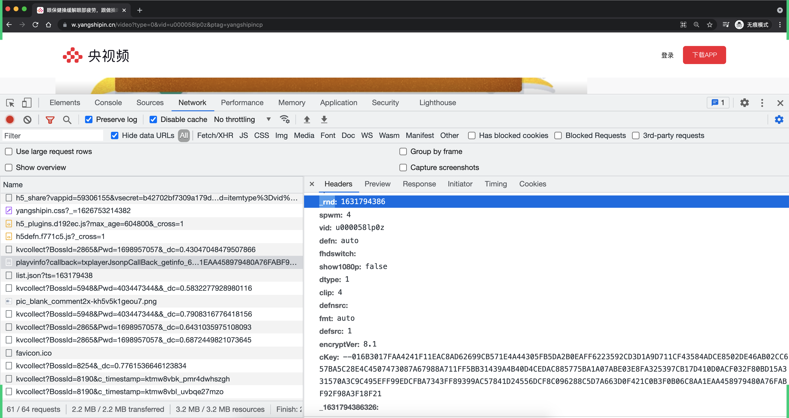

# day02 x视频播放

今日概要：

- x视频
- x视频并发方案
  - 线程池，10线程
  - 协程，10协程（虚拟）
  - 线程池 + 协程 混合模式


## 1.x视频脚本

- rnd
- guid
- pid
- flowid
- _dc
- AES加密生成ckey
- ckey再去获取
  - vkey
  - 资源地址


### 1.1 简单的算法

```python
import execjs

javascript_file = execjs.compile('''
function createGUID() {
    var e = (new Date).getTime().toString(36)
      , t = Math.random().toString(36).replace(/^0./, "");
    return "".concat(e, "_").concat(t)
}
''')


def run():
    app_version = "1.3.5"
    platform = "4330701"
    guid = javascript_file.call('createGUID')
    pid = javascript_file.call('createGUID')
    flow_id = "{}_{}".format(pid, platform)


if __name__ == '__main__':
    run()
```


### 1.2 生成ckey

- 明文拼接
  - 准备好相关参数
  - 小算法
- AES加密

```python
import execjs
import time
from urllib.parse import urlparse, parse_qs

from Crypto.Cipher import AES
from Crypto.Util.Padding import pad
import binascii


javascript_file = execjs.compile('''
function createGUID() {
    var e = (new Date).getTime().toString(36)
      , t = Math.random().toString(36).replace(/^0./, "");
    return "".concat(e, "_").concat(t)
}
''')
import ctypes


def create_qa(data_string):
    """
    原算法
        Aa = "|d000035rirv|1622526980|mg3c3b04ba|1.3.2|df553a055bb06eda3653173ee5a010bf|4330701|https://w.yangshipin.cn/|mozilla/5.0 (macintosh; ||Mozilla|Netscape|MacIntel|"
        wl = -5516
        $a=0
        for (Se = 0; Se < Aa[St]; Se++)
                Ma = Aa[bt](Se), Ae["charCodeAt"]()
                $a = ($a << wl + 1360 + 9081 - 4920) - $a + Ma,
                $a &= $a;
            qa = $a
    """

    a = 0
    for i in data_string:
        _char = ord(i)
        a = (a << 5) - a + _char
        a &= a
    return ctypes.c_int32(a).value


def aes_encrypt(data_string):
    key = binascii.a2b_hex("4E2918885FD98109869D14E0231A0BF4")
    iv = binascii.a2b_hex("16B17E519DDD0CE5B79D7A63A4DD801C")
    aes = AES.new(
        key=key,
        mode=AES.MODE_CBC,
        iv=iv
    )
    raw = pad(data_string.encode('utf-8'), 16)
    aes_bytes = aes.encrypt(raw)
    return binascii.b2a_hex(aes_bytes).decode()


def create_ckey(vid, app_version, guid, platform):
    rnd = str(int(time.time()))
    wt = "mg3c3b04ba"
    ending = "https://w.yangshipin.cn/|mozilla/5.0 (macintosh; ||Mozilla|Netscape|MacIntel|"

    # 1.拼接字符串
    data_list = ["", vid, rnd, wt, app_version, guid, platform, ending]
    data_string = "|".join(data_list)
    # 根据data_string生成qa
    qa = create_qa(data_string)
    encrypt_string = "|{}{}".format(qa, data_string)

    # 2.AES加密
    ckey = "--01" + aes_encrypt(encrypt_string).upper()
    return ckey


def run(video_url):
    vid = parse_qs(urlparse(video_url).query)['vid'][0]
    app_version = "1.3.5"
    platform = "4330701"
    guid = javascript_file.call('createGUID')
    pid = javascript_file.call('createGUID')
    flow_id = "{}_{}".format(pid, platform)

    # 1.创建ckey
    ckey = create_ckey(vid, app_version, guid, platform)
    print(ckey)


    # 2.拿着ckey去发送请求从而获得
    # fn是资源地址  "u000058lp0z.ZKuq10002.mp4"
    # vkey=...

    # 3.去播放


if __name__ == '__main__':
    video_url = "https://w.yangshipin.cn/video?type=0&vid=u000058lp0z&ptag=yangshipincp"
    run(video_url)

```


### 1.3 获取vkey




```python
import requests
import json
import execjs
import time
from urllib.parse import urlparse, parse_qs

from Crypto.Cipher import AES
from Crypto.Util.Padding import pad
import binascii

javascript_file = execjs.compile('''
function createGUID() {
    var e = (new Date).getTime().toString(36)
      , t = Math.random().toString(36).replace(/^0./, "");
    return "".concat(e, "_").concat(t)
}
''')
import ctypes


def create_qa(data_string):
    """
    原算法
        Aa = "|d000035rirv|1622526980|mg3c3b04ba|1.3.2|df553a055bb06eda3653173ee5a010bf|4330701|https://w.yangshipin.cn/|mozilla/5.0 (macintosh; ||Mozilla|Netscape|MacIntel|"
        wl = -5516
        $a=0
        for (Se = 0; Se < Aa[St]; Se++)
                Ma = Aa[bt](Se), Ae["charCodeAt"]()
                $a = ($a << wl + 1360 + 9081 - 4920) - $a + Ma,
                $a &= $a;
            qa = $a
    """

    a = 0
    for i in data_string:
        _char = ord(i)
        a = (a << 5) - a + _char
        a &= a
    return ctypes.c_int32(a).value


def aes_encrypt(data_string):
    key = binascii.a2b_hex("4E2918885FD98109869D14E0231A0BF4")
    iv = binascii.a2b_hex("16B17E519DDD0CE5B79D7A63A4DD801C")
    aes = AES.new(
        key=key,
        mode=AES.MODE_CBC,
        iv=iv
    )
    raw = pad(data_string.encode('utf-8'), 16)
    aes_bytes = aes.encrypt(raw)
    return binascii.b2a_hex(aes_bytes).decode()


def create_ckey(vid, rnd, app_version, guid, platform):
    wt = "mg3c3b04ba"
    ending = "https://w.yangshipin.cn/|mozilla/5.0 (macintosh; ||Mozilla|Netscape|MacIntel|"

    # 1.拼接字符串
    data_list = ["", vid, rnd, wt, app_version, guid, platform, ending]
    data_string = "|".join(data_list)
    # 根据data_string生成qa
    qa = create_qa(data_string)
    encrypt_string = "|{}{}".format(qa, data_string)

    # 2.AES加密
    ckey = "--01" + aes_encrypt(encrypt_string).upper()
    return ckey


def fetch_vkey(vid, rnd, app_ver, platform, flow_id, guid, ckey):
    params = {
        "callback": "txplayerJsonpCallBack_getinfo_711482",
        "charge": "0",
        "defaultfmt": "auto",
        "otype": "json",
        "guid": guid,
        "flowid": flow_id,
        "platform": platform,
        "sdtfrom": "v7007",
        "defnpayver": "0",
        "appVer": app_ver,
        "host": "w.yangshipin.cn",
        "ehost": "https://w.yangshipin.cn/video",
        "refer": "w.yangshipin.cn",
        "sphttps": "1",
        "_rnd": rnd,  # _rnd: x.getTimeStampStr(),
        "spwm": "4",
        "vid": vid,
        "defn": "auto",
        "show1080p": "false",
        "dtype": "1",
        "clip": "4",
        "fmt": "auto",
        "defnsrc": "",
        "fhdswitch": "",
        "defsrc": "1",
        "sphls": "",
        "encryptVer": "8.1",
        "cKey": ckey,
    }

    headers = {
        'user-agent': 'Mozilla/5.0 (iPhone; CPU iPhone OS 13_2_3 like Mac OS X) AppleWebKit/605.1.15 (KHTML, '
                      'like Gecko) Version/13.0.3 Mobile/15E148 Safari/604.1',
        'referer': 'https://m.yangshipin.cn/',
    }

    url = "https://playvv.yangshipin.cn/playvinfo"

    with requests.get(url=url, params=params, headers=headers) as res:
        # txplayerJsonpCallBack_getinfo_711482(  {"dltype":1,"exem":0}  } )
        # 1.去掉函数名和括号，再进行json序列化
        # json.loads(res.text[1:-1])
        # 返回的是个原组吧
        # print(res.text)
        # data = json.loads(res.text)
        # print(data)\
        # 假设内部都是单引号，这一句也会报错。
        # json.loads(res.text[1:-1])
        # 2.evel直接编译并执行函数
        return eval(res.text)


def txplayerJsonpCallBack_getinfo_711482(info_dict):
    return info_dict['vl']['vi'][0]['fn'], info_dict['vl']['vi'][0]['fvkey']


def run(video_url):
    vid = parse_qs(urlparse(video_url).query)['vid'][0]
    app_version = "1.3.5"
    platform = "4330701"
    guid = javascript_file.call('createGUID')
    pid = javascript_file.call('createGUID')
    flow_id = "{}_{}".format(pid, platform)
    rnd = str(int(time.time()))

    # 1.创建ckey
    ckey = create_ckey(vid, rnd, app_version, guid, platform)

    # 2.拿着ckey去发送请求从而获得
    # fn是资源地址  "u000058lp0z.ZKuq10002.mp4"
    # vkey=...

    fn, vkey = fetch_vkey(vid, rnd, app_version, platform, flow_id, guid, ckey)
    print(fn, vkey)
    # 3.去播放


if __name__ == '__main__':
    video_url = "https://w.yangshipin.cn/video?type=0&vid=u000058lp0z&ptag=yangshipincp"
    run(video_url)

```


### 1.4 去播放

- GET传参

  ```python
  import random 
  params = {
  	"BossId":2865,
  	"Pwd":1698957057,
  	"_dc":random.random()
  }
  ```

- 请求体中的参数

  ```
  vurl=https://mp4playcloud-cdn.ysp.cctv.cn/u000058lp0z.ZKuq10002.mp4?
  
  sdtfrom=v7007&guid=ktmw8ugi_j0kk5cmqmgr&vkey=8650581214BB5F6ED0A3FE10602B5670A5D66B6597D4B11599D708F31B50114B44672F3CBF1D2AA392799F31F1FAB47CB48FEA5B3B22877326E4C6ADFB7205D5C112826FAA41633F00AA07C232E479512F4C7F45A5C9E949157083967F96872D3B9FED7A7C6F0791018C82A370C249892A2C9B089CE9DF7E8682C69B0ABF46A5&platform=2
  
  data_dict = {
  	...
  }
  ```


```python
import time
import random
import ctypes
import datetime
import binascii
from urllib.parse import urlparse, parse_qs, urlencode

import execjs
import requests
from Crypto.Cipher import AES
from Crypto.Util.Padding import pad

javascript_file = execjs.compile('''
function createGUID() {
    var e = (new Date).getTime().toString(36)
      , t = Math.random().toString(36).replace(/^0./, "");
    return "".concat(e, "_").concat(t)
}
''')


def create_qa(data_string):
    """
    原算法
        Aa = "|d000035rirv|1622526980|mg3c3b04ba|1.3.2|df553a055bb06eda3653173ee5a010bf|4330701|https://w.yangshipin.cn/|mozilla/5.0 (macintosh; ||Mozilla|Netscape|MacIntel|"
        wl = -5516
        $a=0
        for (Se = 0; Se < Aa[St]; Se++)
                Ma = Aa[bt](Se), Ae["charCodeAt"]()
                $a = ($a << wl + 1360 + 9081 - 4920) - $a + Ma,
                $a &= $a;
            qa = $a
    """

    a = 0
    for i in data_string:
        _char = ord(i)
        a = (a << 5) - a + _char
        a &= a
    return ctypes.c_int32(a).value


def aes_encrypt(data_string):
    key = binascii.a2b_hex("4E2918885FD98109869D14E0231A0BF4")
    iv = binascii.a2b_hex("16B17E519DDD0CE5B79D7A63A4DD801C")
    aes = AES.new(
        key=key,
        mode=AES.MODE_CBC,
        iv=iv
    )
    raw = pad(data_string.encode('utf-8'), 16)
    aes_bytes = aes.encrypt(raw)
    return binascii.b2a_hex(aes_bytes).decode()


def create_ckey(vid, rnd, app_version, guid, platform):
    wt = "mg3c3b04ba"
    ending = "https://w.yangshipin.cn/|mozilla/5.0 (macintosh; ||Mozilla|Netscape|MacIntel|"

    # 1.拼接字符串
    data_list = ["", vid, rnd, wt, app_version, guid, platform, ending]
    data_string = "|".join(data_list)
    # 根据data_string生成qa
    qa = create_qa(data_string)
    encrypt_string = "|{}{}".format(qa, data_string)

    # 2.AES加密
    ckey = "--01" + aes_encrypt(encrypt_string).upper()
    return ckey


def fetch_vkey(vid, rnd, app_ver, platform, flow_id, guid, ckey):
    params = {
        "callback": "txplayerJsonpCallBack_getinfo_711482",
        "charge": "0",
        "defaultfmt": "auto",
        "otype": "json",
        "guid": guid,
        "flowid": flow_id,
        "platform": platform,
        "sdtfrom": "v7007",
        "defnpayver": "0",
        "appVer": app_ver,
        "host": "w.yangshipin.cn",
        "ehost": "https://w.yangshipin.cn/video",
        "refer": "w.yangshipin.cn",
        "sphttps": "1",
        "_rnd": rnd,  # _rnd: x.getTimeStampStr(),
        "spwm": "4",
        "vid": vid,
        "defn": "auto",
        "show1080p": "false",
        "dtype": "1",
        "clip": "4",
        "fmt": "auto",
        "defnsrc": "",
        "fhdswitch": "",
        "defsrc": "1",
        "sphls": "",
        "encryptVer": "8.1",
        "cKey": ckey,
    }

    headers = {
        'user-agent': 'Mozilla/5.0 (iPhone; CPU iPhone OS 13_2_3 like Mac OS X) AppleWebKit/605.1.15 (KHTML, '
                      'like Gecko) Version/13.0.3 Mobile/15E148 Safari/604.1',
        'referer': 'https://m.yangshipin.cn/',
    }

    url = "https://playvv.yangshipin.cn/playvinfo"

    with requests.get(url=url, params=params, headers=headers) as res:
        # txplayerJsonpCallBack_getinfo_711482(  {"dltype":1,"exem":0}  } )
        # 1.去掉函数名和括号，再进行json序列化
        # json.loads(res.text[1:-1])
        # 返回的是个原组吧
        # print(res.text)
        # data = json.loads(res.text)
        # print(data)\
        # 假设内部都是单引号，这一句也会报错。
        # json.loads(res.text[1:-1])
        # 2.evel直接编译并执行函数
        return eval(res.text)


def txplayerJsonpCallBack_getinfo_711482(info_dict):
    return info_dict['vl']['vi'][0]['fn'], info_dict['vl']['vi'][0]['fvkey']


def play(video_url, vid, pid, guid, fn, vkey):
    download_params = {
        "sdtfrom": "v7007",
        "guid": guid,
        "vkey": vkey,
        "platform": "2",
    }
    # 视频下载连接视频
    vurl = "https://mp4playcloud-cdn.ysp.cctv.cn/{}?{}".format(fn, urlencode(download_params))

    params = {
        "BossId": 2865,
        "Pwd": 1698957057,
        "_dc": random.random()  # "&_dc=".concat(Math.random()))
    }
    data = {
        "uin": "",
        "vid": vid,
        "coverid": "",
        "pid": pid,
        "guid": guid,
        "unid": "",
        "vt": "0",
        "type": "3",
        # "url": "https://w.yangshipin.cn/video?type=0&vid=d000035rirv",
        "url": video_url,
        "bi": "0",
        "bt": "0",
        "version": "1.3.2",
        "platform": "4330701",
        "defn": "0",
        # "ctime": "2021-06-02 09:30:01",
        "ctime": datetime.datetime.now().strftime("%Y-%m-%d %H:%M:%S"),
        "ptag": "",
        "isvip": "-1",
        "tpid": "13",
        "pversion": "h5",
        "hc_uin": "",
        "hc_vuserid": "",
        "hc_openid": "",
        "hc_appid": "",
        "hc_pvid": "0",
        "hc_ssid": "",
        "hc_qq": "",
        "hh_ua": "Mozilla/5.0 (Macintosh; Intel Mac OS X 10_15_7) AppleWebKit/537.36 (KHTML  like Gecko) Chrome/90.0.4430.212 Safari/537.36",
        "ua": "Mozilla/5.0 (Macintosh; Intel Mac OS X 10_15_7) AppleWebKit/537.36 (KHTML  like Gecko) Chrome/90.0.4430.212 Safari/537.36",
        "ckey": "",
        "iformat": "0",
        "hh_ref": video_url,
        "vuid": "",
        "vsession": "",
        "format_ua": "other",
        "common_rcd_info": "",
        "common_ext_info": "",
        "v_idx": "0",
        "rcd_info": "",
        "extrainfo": "",
        "c_channel": "",
        "vurl": vurl,
        "step": "6",
        "val": "164",
        "val1": "1",
        "val2": "1",
        "idx": "0",
        "c_info": "",
        "isfocustab": "0",
        "isvisible": "0",
        "fact1": "",
        "fact2": "",
        "fact3": "",
        "fact4": "",
        "fact5": "",
        "cpay": "0",
        "tpay": "0",
        "dltype": "1"
    }

    res = requests.post(
        url="https://btrace.yangshipin.cn/kvcollect",
        params=params,
        data=data,
        headers={
            'user-agent': 'Mozilla/5.0 (iPhone; CPU iPhone OS 13_2_3 like Mac OS X) AppleWebKit/605.1.15 (KHTML, '
                          'like Gecko) Version/13.0.3 Mobile/15E148 Safari/604.1',
            'referer': 'https://m.yangshipin.cn/',
        }
    )
    res.close()


def run(video_url):
    vid = parse_qs(urlparse(video_url).query)['vid'][0]
    app_version = "1.3.5"
    platform = "4330701"
    guid = javascript_file.call('createGUID')
    pid = javascript_file.call('createGUID')
    flow_id = "{}_{}".format(pid, platform)
    rnd = str(int(time.time()))

    # 1.创建ckey
    ckey = create_ckey(vid, rnd, app_version, guid, platform)

    # 2.拿着ckey去发送请求从而获得
    # fn是资源地址  "u000058lp0z.ZKuq10002.mp4"
    # vkey=...
    fn, vkey = fetch_vkey(vid, rnd, app_version, platform, flow_id, guid, ckey)

    # 3.去播放
    play(video_url, vid, pid, guid, fn, vkey)


if __name__ == '__main__':
    url = "https://w.yangshipin.cn/video?type=0&vid=u000058lp0z&ptag=yangshipincp"
    run(url)
```


## 2.并发方案

- 进程，资源消耗多。
- 线程，资源消耗少。
- 协程，资源消耗更少。


多线程或多进程开发？

```
应该开多少个线程？多少个进程？ 如果进程和线程开的过多会导致效率低下，所以一般我们用进程池和线程池来进行开发。
```

```python
import time
from concurrent.futures import ThreadPoolExecutor, ProcessPoolExecutor


def task(idx):
    print(idx)
    time.sleep(2)


# 内部最多可以有10个线程的线程池 
pool = ThreadPoolExecutor(10)

# 往线程池中发任务，1000个任务
for i in range(1000):
    pool.submit(task, i)

# 等待线程池将所有的任务执行完毕
pool.shutdown()

print("执行完毕")
```


### 2.1 线程池版本

```python
import time
import random
import ctypes
import datetime
import binascii
from urllib.parse import urlparse, parse_qs, urlencode
from concurrent.futures import ThreadPoolExecutor

import execjs
import requests
from Crypto.Cipher import AES
from Crypto.Util.Padding import pad

javascript_file = execjs.compile('''
function createGUID() {
    var e = (new Date).getTime().toString(36)
      , t = Math.random().toString(36).replace(/^0./, "");
    return "".concat(e, "_").concat(t)
}
''')


def create_qa(data_string):
    """
    原算法
        Aa = "|d000035rirv|1622526980|mg3c3b04ba|1.3.2|df553a055bb06eda3653173ee5a010bf|4330701|https://w.yangshipin.cn/|mozilla/5.0 (macintosh; ||Mozilla|Netscape|MacIntel|"
        wl = -5516
        $a=0
        for (Se = 0; Se < Aa[St]; Se++)
                Ma = Aa[bt](Se), Ae["charCodeAt"]()
                $a = ($a << wl + 1360 + 9081 - 4920) - $a + Ma,
                $a &= $a;
            qa = $a
    """

    a = 0
    for i in data_string:
        _char = ord(i)
        a = (a << 5) - a + _char
        a &= a
    return ctypes.c_int32(a).value


def aes_encrypt(data_string):
    key = binascii.a2b_hex("4E2918885FD98109869D14E0231A0BF4")
    iv = binascii.a2b_hex("16B17E519DDD0CE5B79D7A63A4DD801C")
    aes = AES.new(
        key=key,
        mode=AES.MODE_CBC,
        iv=iv
    )
    raw = pad(data_string.encode('utf-8'), 16)
    aes_bytes = aes.encrypt(raw)
    return binascii.b2a_hex(aes_bytes).decode()


def create_ckey(vid, rnd, app_version, guid, platform):
    wt = "mg3c3b04ba"
    ending = "https://w.yangshipin.cn/|mozilla/5.0 (macintosh; ||Mozilla|Netscape|MacIntel|"

    # 1.拼接字符串
    data_list = ["", vid, rnd, wt, app_version, guid, platform, ending]
    data_string = "|".join(data_list)
    # 根据data_string生成qa
    qa = create_qa(data_string)
    encrypt_string = "|{}{}".format(qa, data_string)

    # 2.AES加密
    ckey = "--01" + aes_encrypt(encrypt_string).upper()
    return ckey


def fetch_vkey(vid, rnd, app_ver, platform, flow_id, guid, ckey):
    params = {
        "callback": "txplayerJsonpCallBack_getinfo_711482",
        "charge": "0",
        "defaultfmt": "auto",
        "otype": "json",
        "guid": guid,
        "flowid": flow_id,
        "platform": platform,
        "sdtfrom": "v7007",
        "defnpayver": "0",
        "appVer": app_ver,
        "host": "w.yangshipin.cn",
        "ehost": "https://w.yangshipin.cn/video",
        "refer": "w.yangshipin.cn",
        "sphttps": "1",
        "_rnd": rnd,  # _rnd: x.getTimeStampStr(),
        "spwm": "4",
        "vid": vid,
        "defn": "auto",
        "show1080p": "false",
        "dtype": "1",
        "clip": "4",
        "fmt": "auto",
        "defnsrc": "",
        "fhdswitch": "",
        "defsrc": "1",
        "sphls": "",
        "encryptVer": "8.1",
        "cKey": ckey,
    }

    headers = {
        'user-agent': 'Mozilla/5.0 (iPhone; CPU iPhone OS 13_2_3 like Mac OS X) AppleWebKit/605.1.15 (KHTML, '
                      'like Gecko) Version/13.0.3 Mobile/15E148 Safari/604.1',
        'referer': 'https://m.yangshipin.cn/',
    }

    url = "https://playvv.yangshipin.cn/playvinfo"

    with requests.get(url=url, params=params, headers=headers) as res:
        # txplayerJsonpCallBack_getinfo_711482(  {"dltype":1,"exem":0}  } )
        # 1.去掉函数名和括号，再进行json序列化
        # json.loads(res.text[1:-1])
        # 返回的是个原组吧
        # print(res.text)
        # data = json.loads(res.text)
        # print(data)\
        # 假设内部都是单引号，这一句也会报错。
        # json.loads(res.text[1:-1])
        # 2.evel直接编译并执行函数
        return eval(res.text)


def txplayerJsonpCallBack_getinfo_711482(info_dict):
    return info_dict['vl']['vi'][0]['fn'], info_dict['vl']['vi'][0]['fvkey']


def play(video_url, vid, pid, guid, fn, vkey):
    download_params = {
        "sdtfrom": "v7007",
        "guid": guid,
        "vkey": vkey,
        "platform": "2",
    }
    # 视频下载连接视频
    vurl = "https://mp4playcloud-cdn.ysp.cctv.cn/{}?{}".format(fn, urlencode(download_params))

    params = {
        "BossId": 2865,
        "Pwd": 1698957057,
        "_dc": random.random()  # "&_dc=".concat(Math.random()))
    }
    data = {
        "uin": "",
        "vid": vid,
        "coverid": "",
        "pid": pid,
        "guid": guid,
        "unid": "",
        "vt": "0",
        "type": "3",
        # "url": "https://w.yangshipin.cn/video?type=0&vid=d000035rirv",
        "url": video_url,
        "bi": "0",
        "bt": "0",
        "version": "1.3.2",
        "platform": "4330701",
        "defn": "0",
        # "ctime": "2021-06-02 09:30:01",
        "ctime": datetime.datetime.now().strftime("%Y-%m-%d %H:%M:%S"),
        "ptag": "",
        "isvip": "-1",
        "tpid": "13",
        "pversion": "h5",
        "hc_uin": "",
        "hc_vuserid": "",
        "hc_openid": "",
        "hc_appid": "",
        "hc_pvid": "0",
        "hc_ssid": "",
        "hc_qq": "",
        "hh_ua": "Mozilla/5.0 (Macintosh; Intel Mac OS X 10_15_7) AppleWebKit/537.36 (KHTML  like Gecko) Chrome/90.0.4430.212 Safari/537.36",
        "ua": "Mozilla/5.0 (Macintosh; Intel Mac OS X 10_15_7) AppleWebKit/537.36 (KHTML  like Gecko) Chrome/90.0.4430.212 Safari/537.36",
        "ckey": "",
        "iformat": "0",
        "hh_ref": video_url,
        "vuid": "",
        "vsession": "",
        "format_ua": "other",
        "common_rcd_info": "",
        "common_ext_info": "",
        "v_idx": "0",
        "rcd_info": "",
        "extrainfo": "",
        "c_channel": "",
        "vurl": vurl,
        "step": "6",
        "val": "164",
        "val1": "1",
        "val2": "1",
        "idx": "0",
        "c_info": "",
        "isfocustab": "0",
        "isvisible": "0",
        "fact1": "",
        "fact2": "",
        "fact3": "",
        "fact4": "",
        "fact5": "",
        "cpay": "0",
        "tpay": "0",
        "dltype": "1"
    }

    res = requests.post(
        url="https://btrace.yangshipin.cn/kvcollect",
        params=params,
        data=data,
        headers={
            'user-agent': 'Mozilla/5.0 (iPhone; CPU iPhone OS 13_2_3 like Mac OS X) AppleWebKit/605.1.15 (KHTML, '
                          'like Gecko) Version/13.0.3 Mobile/15E148 Safari/604.1',
            'referer': 'https://m.yangshipin.cn/',
        }
    )
    print(res.text)
    res.close()


def run(video_url):
    vid = parse_qs(urlparse(video_url).query)['vid'][0]
    app_version = "1.3.5"
    platform = "4330701"
    guid = javascript_file.call('createGUID')
    pid = javascript_file.call('createGUID')
    flow_id = "{}_{}".format(pid, platform)
    rnd = str(int(time.time()))

    # 1.创建ckey
    ckey = create_ckey(vid, rnd, app_version, guid, platform)
    # 2.拿着ckey去发送请求从而获得
    # fn是资源地址  "u000058lp0z.ZKuq10002.mp4"
    # vkey=...
    fn, vkey = fetch_vkey(vid, rnd, app_version, platform, flow_id, guid, ckey)

    # 3.去播放
    play(video_url, vid, pid, guid, fn, vkey)


if __name__ == '__main__':
    url = "https://w.yangshipin.cn/video?type=0&vid=u000058lp0z&ptag=yangshipincp"
    pool = ThreadPoolExecutor(5)
    for i in range(2):
        pool.submit(run, url)

    pool.shutdown()
    print("完成")

```


### 2.2 协程版本

#### 1.什么是协程？


协程也可以去实现其他的操作，例如：

```
100000000000， 你想让一亿个数字相加。

一亿拆分成10份，让这10份用协程去跑。
```

可以去完成：

- IO任务
- 计算型的任务（不用协程）


#### 2. Python3.4之前官方未提供功能

以前大家都是用 gevent、greenlet、twisted。


#### 3. Python3.4 + 装饰器

asyncio模块。

```python
import asyncio

@asyncio.coroutine
def func1():
    print(1)
    yield from asyncio.sleep(2)  # 遇到IO耗时操作，自动化切换到tasks中的其他任务
    print(2)
    
@asyncio.coroutine
def func2():
    print(3)
    yield from asyncio.sleep(2) # 遇到IO耗时操作，自动化切换到tasks中的其他任务
    print(4)

    
tasks = [
    asyncio.ensure_future( func1() ),  # 协程，任务1
    asyncio.ensure_future( func2() )   # 协程，任务2
]

# 将任务交给内部的时间循环去处理（一个线程）
loop = asyncio.get_event_loop()
loop.run_until_complete(asyncio.wait(tasks))


>>>1
>>>3

>>>2
>>>4
```


#### 4. Python3.5 + async & awit 关键字

让async & awit关键字代替装饰器去实现协程代码的编写。

注意：@asyncio.coroutine装饰器的模式在python3.8后就会移除掉。

```python
import asyncio

async def func1():
    print(1)
    await asyncio.sleep(2)
    print(2)
    
async def func2():
    print(3)
    await asyncio.sleep(2)
    print(4)
    
    
tasks = [
    asyncio.ensure_future(func1()), # 任务1
    asyncio.ensure_future(func2())  # 任务2
]

# 将任务交给内部的时间循环去处理（一个线程）
loop = asyncio.get_event_loop()
loop.run_until_complete(asyncio.wait(tasks))
```


#### 5. Python3.7 + Task和asyncio.run

```python
import asyncio


async def func():
    print("协程内部代码")


# 调用协程函数，返回一个协程对象。
result = func()


# 方式一
# loop = asyncio.get_event_loop() # 创建一个事件循环
# loop.run_until_complete(result) # 将协程当做任务提交到事件循环的任务列表中，协程执行完成之后终止。


# 方式二
# 本质上方式一是一样的，内部先 创建事件循环 然后执行 run_until_complete，一个简便的写法。
# asyncio.run 函数在 Python 3.7 中加入 asyncio 模块，
asyncio.run(result)
```

```python
import asyncio

async def func11():
    print(100)
    await asyncio.sleep(2)  # 爬虫去发送网络请求
    print(200)
    return "alex"

async def func1():
    print(1)
    v1 = await func11()
    print(2,v1)
    
    return "wupeiqi"

async def func2():
    print(1)
    await asyncio.sleep(2)
    print(2)
    
    return "格林"

async def main():
    print("main开始")
    # 创建协程，将协程封装到Task对象中并添加到事件循环的任务列表中，等待事件循环去执行（默认是就绪状态）。
    # 在调用
    task_list = [
        asyncio.create_task(func1(), name="n1"), # 任务1
        asyncio.create_task(func2(), name="n2")  # 任务2
    ]
    # await asyncio.wait(task_list)
    
    # 当执行某协程遇到IO操作时，会自动化切换执行其他任务。
    # 此处的await是等待所有协程执行完毕，并将所有协程的返回值保存到done
    # 如果设置了timeout值，则意味着此处最多等待的秒，完成的协程返回值写入到done中，未完成则写到pending中。
    done, pending = await asyncio.wait(task_list, timeout=1)
    print(done, pending)
    
#  asyncio.run(协程对象) # 协程对象=协程函数()
asyncio.run( main() )
```


#### 6.协程小案例

```python
pip install aiohttp

# 以前发送请求 requests 模块
```

```python
import aiohttp
import asyncio

async def fetch(session, url):
    print("发送请求：", url)
    async with session.get(url) as response:
        text = await response.text()  # IO等待
        print("得到结果：", url, len(text))


async def main():
    async with aiohttp.ClientSession() as session:
        url_list = [
            'https://python.org',
            'https://www.baidu.com',
            'https://www.pythonav.com'
        ]
        """
        tasks = [
            asyncio.create_task( fetch(session, "https://python.org") ),
            asyncio.create_task( fetch(session, 'https://www.baidu.com')),
            asyncio.create_task( fetch(session, 'https://www.pythonav.com')),
        ]
        """
        tasks = [asyncio.create_task(fetch(session, url)) for url in url_list]
        await asyncio.wait(tasks)


if __name__ == '__main__':
    asyncio.run(main())
```

```
import requests

session = requests.Session()
session.get()
session.post()
session.close()

requsets.get()
requsets.post()
```


#### 7.协程版本

```python
import time
import random
import datetime
import aiohttp
import asyncio
from urllib.parse import parse_qs, urlparse, urlencode
import execjs
import ctypes
from Crypto.Cipher import AES
from Crypto.Util.Padding import pad
import binascii

HEADERS = {
    'user-agent': 'Mozilla/5.0 (iPhone; CPU iPhone OS 13_2_3 like Mac OS X) AppleWebKit/605.1.15 (KHTML, '
                  'like Gecko) Version/13.0.3 Mobile/15E148 Safari/604.1',
    'referer': 'https://m.yangshipin.cn/',
}

javascript_file = execjs.compile('''
function createGUID() {
    var e = (new Date).getTime().toString(36)
      , t = Math.random().toString(36).replace(/^0./, "");
    return "".concat(e, "_").concat(t)
}
''')


def aes_encrypt(data_string):
    key = binascii.a2b_hex("4E2918885FD98109869D14E0231A0BF4")
    iv = binascii.a2b_hex("16B17E519DDD0CE5B79D7A63A4DD801C")
    aes = AES.new(
        key=key,
        mode=AES.MODE_CBC,
        iv=iv
    )
    raw = pad(data_string.encode('utf-8'), 16)
    aes_bytes = aes.encrypt(raw)
    return binascii.b2a_hex(aes_bytes).decode().upper()


def create_qa(data_string):
    """
    string = "|d000035rirv|1622526980|mg3c3b04ba|1.3.2|df553a055bb06eda3653173ee5a010bf|4330701|https://w.yangshipin.cn/|mozilla/5.0 (macintosh; ||Mozilla|Netscape|MacIntel|"
    原算法
        Aa = "|d000035rirv|1622526980|mg3c3b04ba|1.3.2|df553a055bb06eda3653173ee5a010bf|4330701|https://w.yangshipin.cn/|mozilla/5.0 (macintosh; ||Mozilla|Netscape|MacIntel|"
        wl = -5516
        $a=0
        for (Se = 0; Se < Aa[St]; Se++)
                Ma = Aa[bt](Se), Ae["charCodeAt"]()
                $a = ($a << wl + 1360 + 9081 - 4920) - $a + Ma,
                $a &= $a;
            qa = $a
    """

    a = 0
    for i in data_string:
        _char = ord(i)
        a = (a << 5) - a + _char
        # a &= a & 0xffffffff
        a &= a
    return ctypes.c_int32(a).value


def create_ckey(vid, rnd, app_ver, platform, guid):
    wt = "mg3c3b04ba"
    ending = "https://w.yangshipin.cn/|mozilla/5.0 (macintosh; ||Mozilla|Netscape|MacIntel|"

    data_list = ["", vid, rnd, wt, app_ver, guid, platform, ending]
    string = "|".join(data_list)
    qa = create_qa(string)
    encrypt_string = "|{}{}".format(qa, string)
    ckey = "--01" + aes_encrypt(encrypt_string).upper()
    return ckey


async def fetch_vkey(session, vid, rnd, app_ver, platform, flow_id, guid, ckey):
    params = {
        "callback": "txplayerJsonpCallBack_getinfo_711482",
        "charge": "0",
        "defaultfmt": "auto",
        "otype": "json",
        "guid": guid,
        "flowid": flow_id,
        "platform": platform,
        "sdtfrom": "v7007",
        "defnpayver": "0",
        "appVer": app_ver,
        "host": "w.yangshipin.cn",
        "ehost": "https://w.yangshipin.cn/video",
        "refer": "w.yangshipin.cn",
        "sphttps": "1",
        "_rnd": rnd,  # _rnd: x.getTimeStampStr(),
        "spwm": "4",
        "vid": vid,
        "defn": "auto",
        "show1080p": "false",
        "dtype": "1",
        "clip": "4",
        "fmt": "auto",
        "defnsrc": "",
        "fhdswitch": "",
        "defsrc": "1",
        "sphls": "",
        "encryptVer": "8.1",
        "cKey": ckey,
    }

    headers = {
        'user-agent': 'Mozilla/5.0 (iPhone; CPU iPhone OS 13_2_3 like Mac OS X) AppleWebKit/605.1.15 (KHTML, '
                      'like Gecko) Version/13.0.3 Mobile/15E148 Safari/604.1',
        'referer': 'https://m.yangshipin.cn/',
    }
    url = "https://playvv.yangshipin.cn/playvinfo"

    async with session.get(url=url, params=params, headers=headers) as res:
        text = await res.text() # IO等待
        fn, vkey = eval(text)
        return fn, vkey


def txplayerJsonpCallBack_getinfo_711482(arg):
    return arg['vl']['vi'][0]['fn'], arg['vl']['vi'][0]['fvkey']


async def play(session, video_url, vid, pid, guid, fn, vkey):
    download_params = {
        "sdtfrom": "v7007",
        "guid": guid,
        "vkey": vkey,
        "platform": "2",
    }
    # 视频下载连接视频
    download_url = "https://mp4playcloud-cdn.ysp.cctv.cn/{}?{}".format(fn, urlencode(download_params))

    # 播放视频
    params = {
        "BossId": 2865,
        "Pwd": 1698957057,
        "_dc": random.random()  # "&_dc=".concat(Math.random()))
    }
    data = {
        "uin": "",
        "vid": vid,
        "coverid": "",
        "pid": pid,
        "guid": guid,
        "unid": "",
        "vt": "0",
        "type": "3",
        # "url": "https://w.yangshipin.cn/video?type=0&vid=d000035rirv",
        "url": video_url,
        "bi": "0",
        "bt": "0",
        "version": "1.3.2",
        "platform": "4330701",
        "defn": "0",
        # "ctime": "2021-06-02 09:30:01",
        "ctime": datetime.datetime.now().strftime("%Y-%m-%d %H:%M:%S"),
        "ptag": "",
        "isvip": "-1",
        "tpid": "13",
        "pversion": "h5",
        "hc_uin": "",
        "hc_vuserid": "",
        "hc_openid": "",
        "hc_appid": "",
        "hc_pvid": "0",
        "hc_ssid": "",
        "hc_qq": "",
        "hh_ua": "Mozilla/5.0 (Macintosh; Intel Mac OS X 10_15_7) AppleWebKit/537.36 (KHTML  like Gecko) Chrome/90.0.4430.212 Safari/537.36",
        "ua": "Mozilla/5.0 (Macintosh; Intel Mac OS X 10_15_7) AppleWebKit/537.36 (KHTML  like Gecko) Chrome/90.0.4430.212 Safari/537.36",
        "ckey": "",
        "iformat": "0",
        "hh_ref": video_url,
        "vuid": "",
        "vsession": "",
        "format_ua": "other",
        "common_rcd_info": "",
        "common_ext_info": "",
        "v_idx": "0",
        "rcd_info": "",
        "extrainfo": "",
        "c_channel": "",
        "vurl": download_url,
        "step": "6",
        "val": "164",
        "val1": "1",
        "val2": "1",
        "idx": "0",
        "c_info": "",
        "isfocustab": "0",
        "isvisible": "0",
        "fact1": "",
        "fact2": "",
        "fact3": "",
        "fact4": "",
        "fact5": "",
        "cpay": "0",
        "tpay": "0",
        "dltype": "1"
    }
    url = "https://btrace.yangshipin.cn/kvcollect"
    async with session.post(url=url, params=params, data=data, headers=HEADERS) as res:
        text = await res.text() # IO等待
        print(text)


async def handler(video_url):
    try:
        async with aiohttp.ClientSession() as session:
            platform = "4330701"
            app_ver = "1.3.5"
            rnd = str(int(time.time()))
            vid = parse_qs(urlparse(video_url).query)['vid'][0]
            guid = javascript_file.call('createGUID')
            pid = javascript_file.call('createGUID')
            flow_id = "{}_{}".format(pid, platform)
            ckey = create_ckey(vid, rnd, app_ver, platform, guid)

            # 网络请求
            fn, vkey = await fetch_vkey(session, vid, rnd, app_ver, platform, flow_id, guid, ckey)

            await play(session, video_url, vid, pid, guid, fn, vkey)

    except Exception as e:
        print(e)


async def engine(video_url):
    # 创建100个任务
    tasks = [
        asyncio.create_task(handler(video_url)) for _ in range(100)
    ]
    await asyncio.wait(tasks)


def task(video_url):
    # import platform
    # if "Windows" in platform.platform():
    #     asyncio.set_event_loop_policy(asyncio.WindowsSelectorEventLoopPolicy())

    # engine(video_url)协程对象
    asyncio.run(engine(video_url))


if __name__ == '__main__':
    task("https://w.yangshipin.cn/video?type=0&vid=u000058lp0z&ptag=yangshipincp")

```


### 2.3 线程池+协程版本

```python
import time
import random
import datetime
import aiohttp
import asyncio
from urllib.parse import parse_qs, urlparse, urlencode
import execjs
import ctypes
from Crypto.Cipher import AES
from Crypto.Util.Padding import pad
import binascii
from concurrent.futures import ThreadPoolExecutor, ProcessPoolExecutor

HEADERS = {
    'user-agent': 'Mozilla/5.0 (iPhone; CPU iPhone OS 13_2_3 like Mac OS X) AppleWebKit/605.1.15 (KHTML, '
                  'like Gecko) Version/13.0.3 Mobile/15E148 Safari/604.1',
    'referer': 'https://m.yangshipin.cn/',
}

javascript_file = execjs.compile('''
function createGUID() {
    var e = (new Date).getTime().toString(36)
      , t = Math.random().toString(36).replace(/^0./, "");
    return "".concat(e, "_").concat(t)
}
''')


def aes_encrypt(data_string):
    key = binascii.a2b_hex("4E2918885FD98109869D14E0231A0BF4")
    iv = binascii.a2b_hex("16B17E519DDD0CE5B79D7A63A4DD801C")
    aes = AES.new(
        key=key,
        mode=AES.MODE_CBC,
        iv=iv
    )
    raw = pad(data_string.encode('utf-8'), 16)
    aes_bytes = aes.encrypt(raw)
    return binascii.b2a_hex(aes_bytes).decode().upper()


def create_qa(data_string):
    """
    string = "|d000035rirv|1622526980|mg3c3b04ba|1.3.2|df553a055bb06eda3653173ee5a010bf|4330701|https://w.yangshipin.cn/|mozilla/5.0 (macintosh; ||Mozilla|Netscape|MacIntel|"
    原算法
        Aa = "|d000035rirv|1622526980|mg3c3b04ba|1.3.2|df553a055bb06eda3653173ee5a010bf|4330701|https://w.yangshipin.cn/|mozilla/5.0 (macintosh; ||Mozilla|Netscape|MacIntel|"
        wl = -5516
        $a=0
        for (Se = 0; Se < Aa[St]; Se++)
                Ma = Aa[bt](Se), Ae["charCodeAt"]()
                $a = ($a << wl + 1360 + 9081 - 4920) - $a + Ma,
                $a &= $a;
            qa = $a
    """

    a = 0
    for i in data_string:
        _char = ord(i)
        a = (a << 5) - a + _char
        # a &= a & 0xffffffff
        a &= a
    return ctypes.c_int32(a).value


def create_ckey(vid, rnd, app_ver, platform, guid):
    wt = "mg3c3b04ba"
    ending = "https://w.yangshipin.cn/|mozilla/5.0 (macintosh; ||Mozilla|Netscape|MacIntel|"

    data_list = ["", vid, rnd, wt, app_ver, guid, platform, ending]
    string = "|".join(data_list)
    qa = create_qa(string)
    encrypt_string = "|{}{}".format(qa, string)
    ckey = "--01" + aes_encrypt(encrypt_string).upper()
    return ckey


async def fetch_vkey(session, vid, rnd, app_ver, platform, flow_id, guid, ckey):
    params = {
        "callback": "txplayerJsonpCallBack_getinfo_711482",
        "charge": "0",
        "defaultfmt": "auto",
        "otype": "json",
        "guid": guid,
        "flowid": flow_id,
        "platform": platform,
        "sdtfrom": "v7007",
        "defnpayver": "0",
        "appVer": app_ver,
        "host": "w.yangshipin.cn",
        "ehost": "https://w.yangshipin.cn/video",
        "refer": "w.yangshipin.cn",
        "sphttps": "1",
        "_rnd": rnd,  # _rnd: x.getTimeStampStr(),
        "spwm": "4",
        "vid": vid,
        "defn": "auto",
        "show1080p": "false",
        "dtype": "1",
        "clip": "4",
        "fmt": "auto",
        "defnsrc": "",
        "fhdswitch": "",
        "defsrc": "1",
        "sphls": "",
        "encryptVer": "8.1",
        "cKey": ckey,
    }

    headers = {
        'user-agent': 'Mozilla/5.0 (iPhone; CPU iPhone OS 13_2_3 like Mac OS X) AppleWebKit/605.1.15 (KHTML, '
                      'like Gecko) Version/13.0.3 Mobile/15E148 Safari/604.1',
        'referer': 'https://m.yangshipin.cn/',
    }
    url = "https://playvv.yangshipin.cn/playvinfo"

    async with session.get(url=url, params=params, headers=headers) as res:
        text = await res.text()
        fn, vkey = eval(text)
        return fn, vkey


def txplayerJsonpCallBack_getinfo_711482(arg):
    return arg['vl']['vi'][0]['fn'], arg['vl']['vi'][0]['fvkey']


async def play(session, video_url, vid, pid, guid, fn, vkey):
    download_params = {
        "sdtfrom": "v7007",
        "guid": guid,
        "vkey": vkey,
        "platform": "2",
    }
    # 视频下载连接视频
    download_url = "https://mp4playcloud-cdn.ysp.cctv.cn/{}?{}".format(fn, urlencode(download_params))

    # 播放视频
    params = {
        "BossId": 2865,
        "Pwd": 1698957057,
        "_dc": random.random()  # "&_dc=".concat(Math.random()))
    }
    data = {
        "uin": "",
        "vid": vid,
        "coverid": "",
        "pid": pid,
        "guid": guid,
        "unid": "",
        "vt": "0",
        "type": "3",
        # "url": "https://w.yangshipin.cn/video?type=0&vid=d000035rirv",
        "url": video_url,
        "bi": "0",
        "bt": "0",
        "version": "1.3.2",
        "platform": "4330701",
        "defn": "0",
        # "ctime": "2021-06-02 09:30:01",
        "ctime": datetime.datetime.now().strftime("%Y-%m-%d %H:%M:%S"),
        "ptag": "",
        "isvip": "-1",
        "tpid": "13",
        "pversion": "h5",
        "hc_uin": "",
        "hc_vuserid": "",
        "hc_openid": "",
        "hc_appid": "",
        "hc_pvid": "0",
        "hc_ssid": "",
        "hc_qq": "",
        "hh_ua": "Mozilla/5.0 (Macintosh; Intel Mac OS X 10_15_7) AppleWebKit/537.36 (KHTML  like Gecko) Chrome/90.0.4430.212 Safari/537.36",
        "ua": "Mozilla/5.0 (Macintosh; Intel Mac OS X 10_15_7) AppleWebKit/537.36 (KHTML  like Gecko) Chrome/90.0.4430.212 Safari/537.36",
        "ckey": "",
        "iformat": "0",
        "hh_ref": video_url,
        "vuid": "",
        "vsession": "",
        "format_ua": "other",
        "common_rcd_info": "",
        "common_ext_info": "",
        "v_idx": "0",
        "rcd_info": "",
        "extrainfo": "",
        "c_channel": "",
        "vurl": download_url,
        "step": "6",
        "val": "164",
        "val1": "1",
        "val2": "1",
        "idx": "0",
        "c_info": "",
        "isfocustab": "0",
        "isvisible": "0",
        "fact1": "",
        "fact2": "",
        "fact3": "",
        "fact4": "",
        "fact5": "",
        "cpay": "0",
        "tpay": "0",
        "dltype": "1"
    }

    url = "https://btrace.yangshipin.cn/kvcollect"
    async with session.post(url=url, params=params, data=data, headers=HEADERS) as res:
        text = await res.text()
        print(text)


async def handler(video_url):
    try:
        async with aiohttp.ClientSession() as session:
            platform = "4330701"
            app_ver = "1.3.5"
            rnd = str(int(time.time()))
            vid = parse_qs(urlparse(video_url).query)['vid'][0]
            guid = javascript_file.call('createGUID')
            pid = javascript_file.call('createGUID')
            flow_id = "{}_{}".format(pid, platform)
            ckey = create_ckey(vid, rnd, app_ver, platform, guid)

            fn, vkey = await fetch_vkey(session, vid, rnd, app_ver, platform, flow_id, guid, ckey)

            await play(session, video_url, vid, pid, guid, fn, vkey)


    except Exception as e:
        print(e)


async def engine(video_url, request_count):
    tasks = [
        asyncio.create_task(handler(video_url)) for _ in range(request_count)
    ]
    await asyncio.wait(tasks)


def task(video_url, request_count):
    # import platform
    # if "Windows" in platform.platform():
    #     asyncio.set_event_loop_policy(asyncio.WindowsSelectorEventLoopPolicy())
    asyncio.run(engine(video_url, request_count))


def run():
    url = "https://w.yangshipin.cn/video?type=0&vid=u000058lp0z&ptag=yangshipincp"
    # 要刷的数量
    total_count = 1000

    # 每个协程同时发送多少个请求
    per_coroutine_request_count = 23

    # 线程池中5个线程，即：5 * 20 = 100
    pool = ThreadPoolExecutor(5)  # pool = ProcessPoolExecutor(5)

    #  1000/20=50，5
    loop_count, div = divmod(total_count, per_coroutine_request_count)

    # 循环50次 * 20 = 1000个请求
    for i in range(loop_count):
        pool.submit(task, url, per_coroutine_request_count)

    pool.submit(task, url, div)

    pool.shutdown()  # 等待所有任务执行完毕


if __name__ == '__main__':
    run()
```


## 总结

- 目前：用脚本手动去跑某个视频的播放。
- 平台（课程最后）
  - 下单
  - 自动获取订单并且去跑


提醒：自己测试的时候，网站是有缓存。


