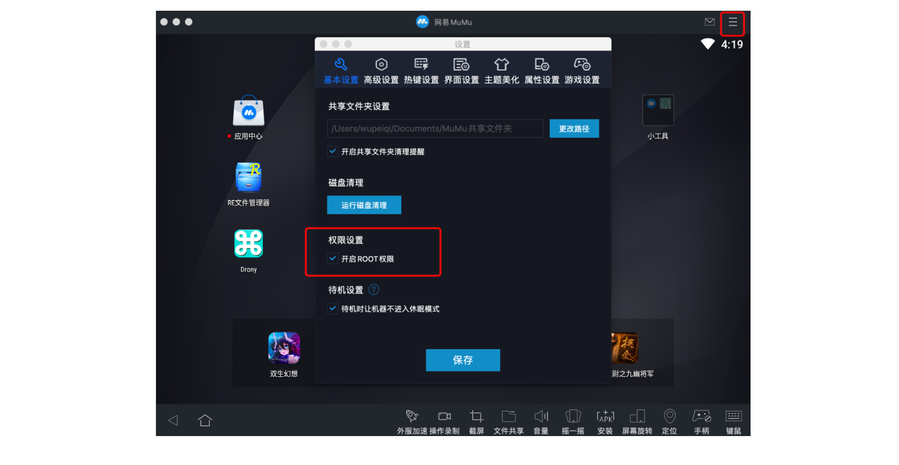
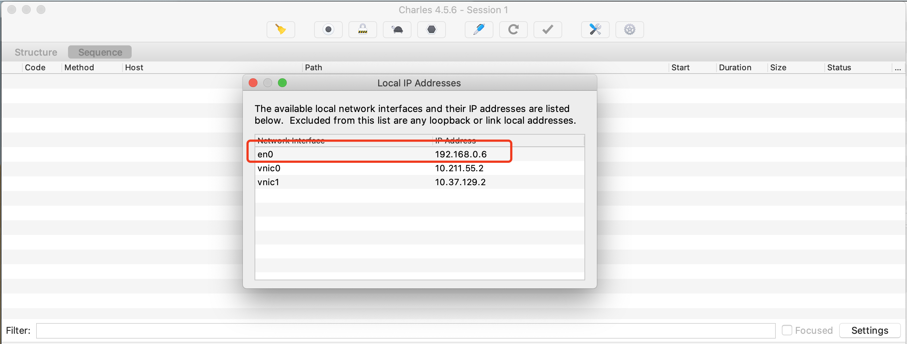
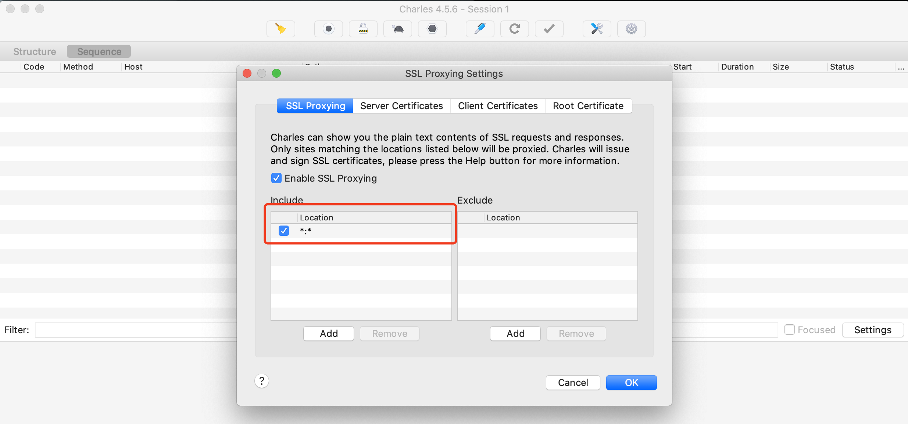
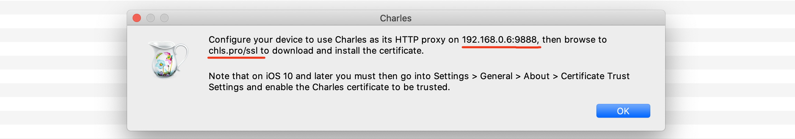
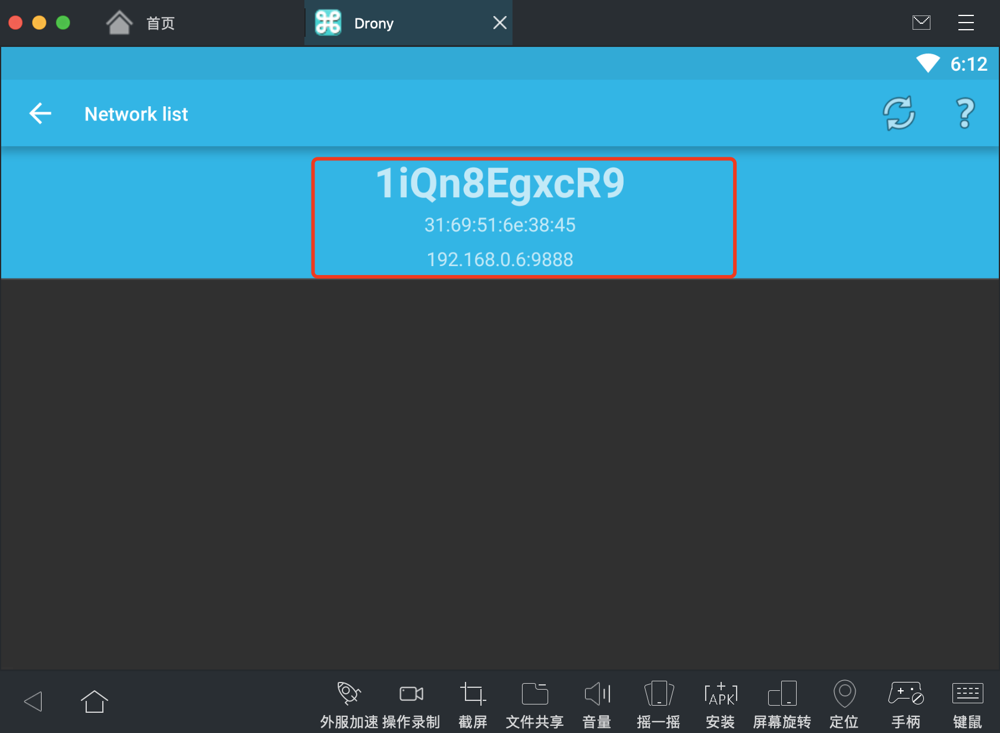
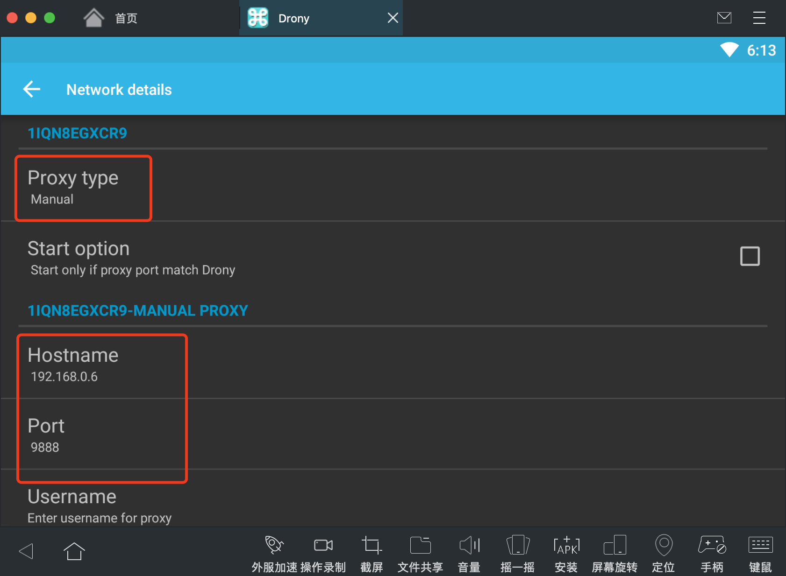
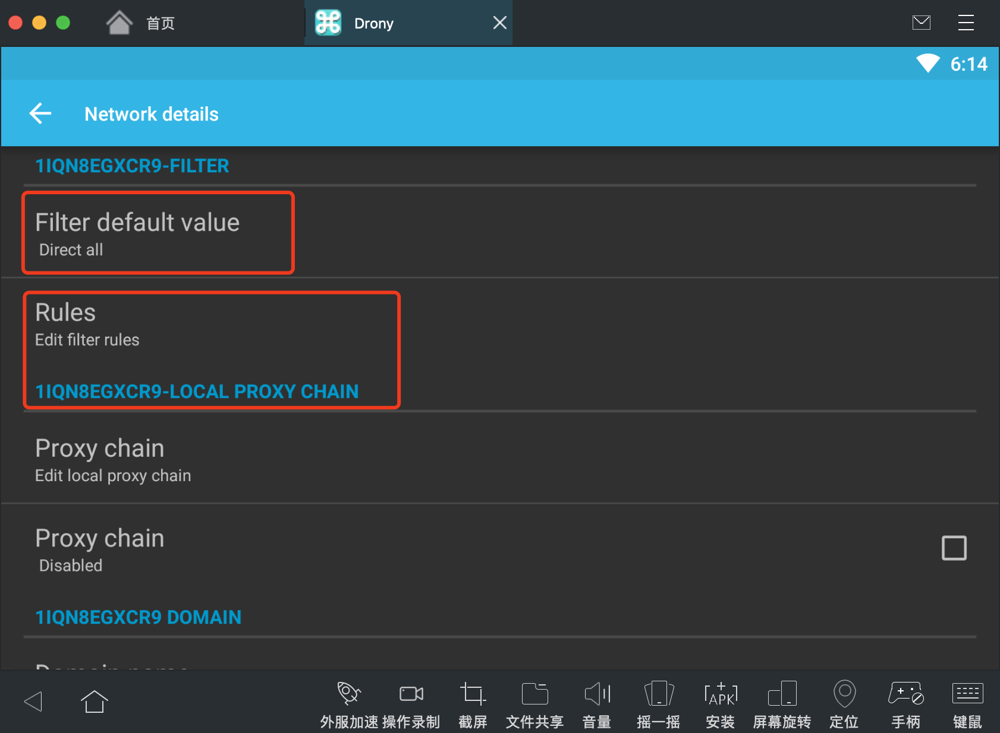
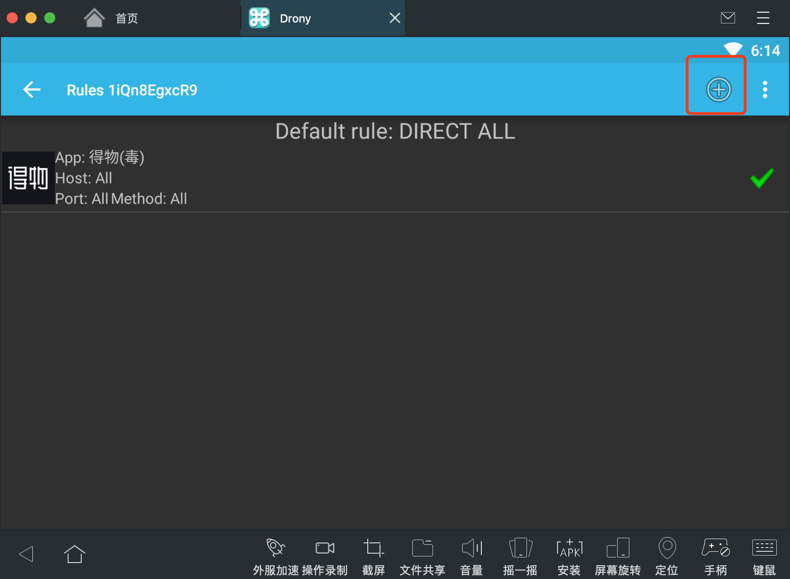
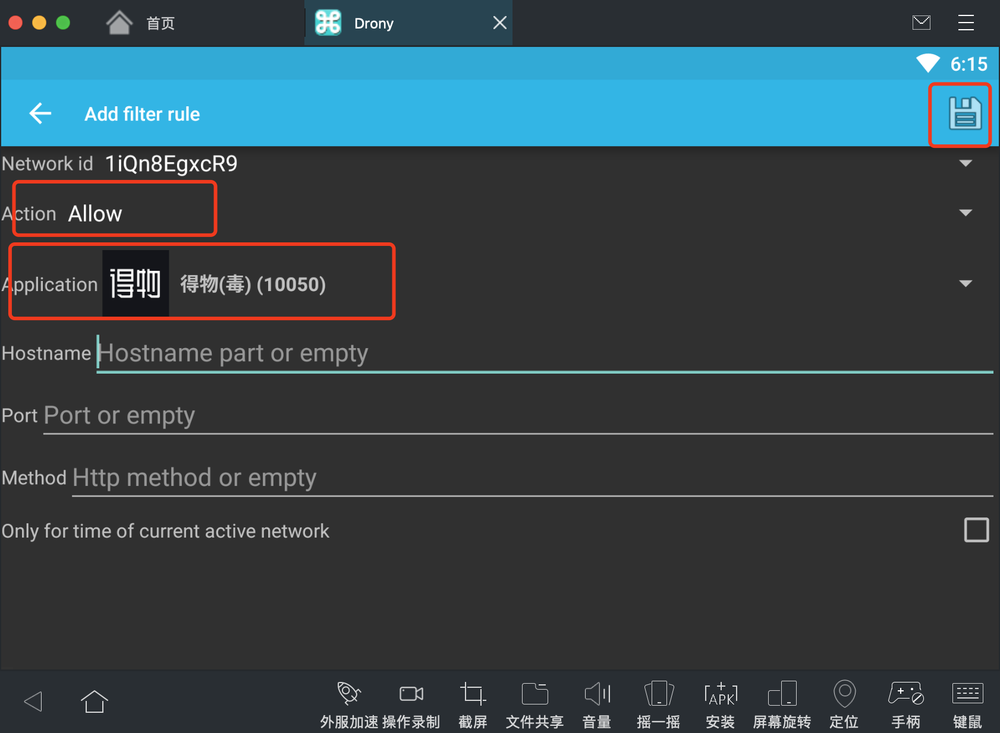
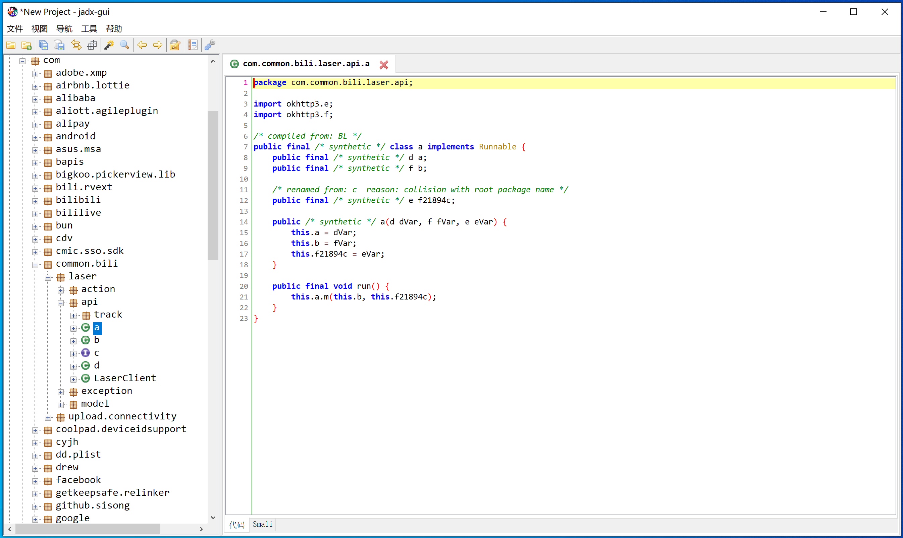

# day05 App逆向快速上手

app逆向课程：

- 环境搭建 & Java语法基础 & 安卓开发 & NDK
- 案例

平台：

- Web框架


**今日概要**：app逆向的快速上手和必备环境搭建（上）。

- 安装模拟器（网易mumu）
- 抓包工具 charles 、Drony
- 反编译工具：jeb、jadx、GDA（Java代码）


## 1.安装模式器

PC上的安卓模拟器有很多。

- windows，逍遥、夜神、网易mumu 等。
- mac，网易mumu。注意：暂不匹配mac的m1。

下载地址：https://mumu.163.com/mac/index.html


注意：安装后请开启root权限。




## 2.抓包工具 charles

### 2.1 下载并安装

- mac用户

  ```
  访问网址 https://xclient.info/s/charles.html 根据提示下载并破解。
  ```

- windows用户：

  ```
  下载地址：（ charles v4.5.6，大家也可去网上自行下载和破解 ）
  	链接: https://pan.baidu.com/s/1gedTGrFsB1SnNwTvPLoZPg 提取码: cjfe 
  	
  注册码
  	Registered Name:  https://zhile.io
  	License Key:      48891cf209c6d32bf4
  ```


### 2.2 配置

打开 【Proxy】>【Proxy Settings】设置代理IP端口：


查看本地charles的IP地址：【Help】>【Local IP Address】




模拟器连接 charles代理：填写IP和端口。


默认这样设置charles只能抓http的包，无法抓取Https包，所以需要在手机上安装证书。

设置SSL代理：【Proxy】->【SSL Proxy Settings】




手机上安装证书：





提醒：

- 在模拟器上配置charles，安装证书。
- 在安卓手机上配置charles
  - 手机 android7以下，可以用上面的方法  ----> 受信任的证书。
  - 手机不能用上面的方法（获取root权限）----> 用户级别、系统级别。


安装成功后，就可以在charles中进行抓包了。


案例：链家APP


```python
import requests

res = requests.get(
    url="https://app.api.lianjia.com/Rentplat/v2/house/list",
    params={
        "city_id": "110000",
        "condition": "shahe2%2F",
        "offset": "0",
        "limit": "30",
        "scene": "list",
        "isMyCompany": "0",
        "is_second_filter": "0",
        "request_ts": "1632724797"
    }
)

print(res.json())
```


## 3.抓包工具 Drony

有些安卓开发在OKHttp设置Proxy.NO_PROXY来屏蔽系统代理。


例如：得物app无法抓到包，无法看到有用数据。


### 3.1 安装

- Drony-102.apk ，模拟器上可以；手机提示要升级。（英文）

  ```
  链接: https://pan.baidu.com/s/1qvWuuvazhbmJ3x0YdIWvNQ 提取码: g403 
  ```

- Drony-1.3.154.apk，手机上（繁体中文）

  ```
  链接: https://pan.baidu.com/s/1b5iDxb8lmKfn2qzBxxT_kA 提取码: sa09 
  ```


### 3.2 配置
















### 3.3 成功抓到


## 4.案例：B站app播放

- 在模拟器安装B站 v6.24.0 版本

  ```
  https://www.wandoujia.com/apps/281291/history
  ```

- 运行并抓包
  


- 请求头中的4个算法，找到。

- 请求体加密2个算法，找到。【今天来搞它，我来搞，你们看。】 

  ```
  安卓开发 Java  --> bili v6240.apk   ---> 反编译   ---> Java代码（部分）
  ```

  

发现请求体发送的是密文，这是怎么回事呢？ 

```
这不是没抓到包，而是B站内部在发送数据时对请求体进行了加密，所以我们看到得就是密文了。
```

那么问题来了？如果我们要模拟B站发送这个请求，是不是就需要了解他这个请求体到底是用什么方式加密的，然后才能去伪造。


此时怎么办呢？接下来就需要一个反编译工具，将B站的apk文件反编译成安卓代码（Java代码），我们通过研究Java代码来查看他的内部算法，从而用Python来直接实现。


## 5.反编译工具

现在比较好用且方便的反编译工具：JEB、JADX、GDA（win）。（依赖JRE）


### 5.1 安装JDK

其实此处安装JRE即可，由于后续我们要学习Java开发，直接安装JDK。（JDK中包含JRE）。

```
https://www.oracle.com/java/technologies/downloads/

# 推荐：JDK8（后期工具需要）
https://www.oracle.com/java/technologies/downloads/#java8
```


### 5.2 jadx

下载地址：链接: https://pan.baidu.com/s/1urJFD5mMp7W1mlH6UAMlJA 提取码: k9p7 

免安装，直接解压并打开即可。





反编译出来之后，就需要根据   关键字、调用关系、Hook（后期讲）的方式找到相关代码。


### 5.3 jeb

下载：链接: https://pan.baidu.com/s/15JAJBLROsSG4VEsOL8QoMA 提取码: ucv0 


免安装，解压后直接打开：


### 5.4 GDA

下载：链接: https://pan.baidu.com/s/1sJdUOgiRA9G_2a8oOed12g 提取码: wwaw 

仅支持window版本。


## 6.案例：B站app播放


现在，请求包抓到了，反编译的代码也有了，接下来，就要定位到代码具体在哪里了。

那么问题来了，怎么才能定位到代码的位置呢？

- 根据关键字搜索
- 看得懂Java代码，掌握安卓开发的基础。
- 根据经验去猜测 并 验证（配合后期的Hook）


jeb3.0 版本反编译的代码（ B站v6.42版本）


jeb3.24 版本反编译代码（B站6.24版本）


分页和验证过程：

- 按照key排序进行拼接
- 将拼接后的内容进行 sha256加密（盐：9cafa6466a028bfb）
- 再拼接 sign=加密后的值
- 对最后加密的值再进行 AES加密（key=**fd6b639dbcff0c2a1b03b389ec763c4b**、iv=**77b07a672d57d64c**)

用Python代码实现。


```python
import base64
import requests
import re
from Crypto.Cipher import AES
from Crypto.Util.Padding import pad
import string
import random
import time
import hashlib

SALT = "9cafa6466a028bfb"
KEY = "fd6b639dbcff0c2a1b03b389ec763c4b"
IV = "77b07a672d57d64c"


def get_video_info(bvid):
    session = requests.Session()
    res = session.get(
        url="https://api.bilibili.com/x/player/pagelist?bvid={}&jsonp=jsonp".format(bvid),
    )
    cid = res.json()['data'][0]['cid']

    res = session.get(
        url="https://api.bilibili.com/x/web-interface/view?cid={}&bvid={}".format(cid, bvid),
    )
    res_json = res.json()
    aid = res_json['data']['aid']
    view_count = res_json['data']['stat']['view']
    # total_duration = res_json['data']['duration'] # 总时长
    duration = res_json['data']['pages'][0]['duration']  # 当前视频长度

    return aid, bvid, cid, view_count, duration


def create_random_mac(sep=":"):
    """ 随机生成mac地址 """

    def mac_same_char(mac_string):
        v0 = mac_string[0]
        index = 1
        while index < len(mac_string):
            if v0 != mac_string[index]:
                return False
            index += 1
        return True

    data_list = []
    for i in range(1, 7):
        part = "".join(random.sample("0123456789ABCDEF", 2))
        data_list.append(part)
    mac = sep.join(data_list)

    if not mac_same_char(mac) and mac != "00:90:4C:11:22:33":
        return mac

    return create_random_mac(sep)


def create_device_id(mac):
    """
    根据mac地址生成 3.device_id
    :param mac: 传入参数的格式是 00:00:00:00:00
    :return:
    """

    def gen_sn():
        return "".join(random.sample("123456789" + string.ascii_lowercase, 10))

    def base64_encrypt(data_string):
        data_bytes = bytearray(data_string.encode('utf-8'))
        data_bytes[0] = data_bytes[0] ^ (len(data_bytes) & 0xFF)
        for i in range(1, len(data_bytes)):
            data_bytes[i] = (data_bytes[i - 1] ^ data_bytes[i]) & 0xFF
        res = base64.encodebytes(bytes(data_bytes))
        return res.strip().strip(b"==").decode('utf-8')

    # 1. 生成mac地址（保证mac中的每个元素是不重复的，例如：0000000000)
    mac_str = mac

    # 2. 去除IP地址中的符号，只保留 48e1e828e02e（变小写）
    mac_str = re.sub("[^0-9A-Fa-f]", "", mac_str)
    mac_str = mac_str.lower()

    # 3. 获取手续序列号
    sn = gen_sn()

    # 4. 拼接并进行base64加密
    total_string = "{}|||{}".format(mac_str, sn)
    return base64_encrypt(total_string)


def sha_256_encrypt(data_string):
    sha = hashlib.sha256()
    sha.update(data_string.encode('utf-8'))
    sha.update(SALT.encode('utf-8'))
    return sha.hexdigest()


def aes_encrypt(data_string):
    aes = AES.new(
        key=KEY.encode('utf-8'),
        mode=AES.MODE_CBC,
        iv=IV.encode('utf-8')
    )
    raw = pad(data_string.encode('utf-8'), 16)
    return aes.encrypt(raw)


def run():
    mac_string = create_random_mac().upper()
    device_id = create_device_id(mac_string)

    aid, bvid, cid, view_count, duration = get_video_info("BV1Mb4y1X73e")

    ctime = int(time.time())
    info = {
        'aid': aid,
        'cid': cid,
        'part': 1,
        'mid': 0,
        'lv': 0,
        'ftime': ctime - random.randint(100, 1000),
        'stime': ctime,
        'did': device_id, # 设备ID
        'type': 3,
        'sub_type': 0,
        'sid': '0',
        'epid': '',
        'auto_play': 0,
        'build': 6240300,
        'mobi_app': 'android',
        'spmid': 'main.ugc-video-detail.0.0',
        'from_spmid': 'search.search-result.0.0'
    }
    # 根据key进行排序
    data = "&".join(["{}={}".format(key, info[key]) for key in sorted(info.keys())])
    # sha_256_encrypt加密
    sign = sha_256_encrypt(data).lower()
    
    data = "{}&sign={}".format(data, sign)
    
    # AES加密
    aes_string = aes_encrypt(data)
    print(aes_string)


if __name__ == '__main__':
    run()
```


## 总结

- 爬虫开发
  - js玩的6
  - Java和安卓看不懂
- 一定要来听课。


今日安装安装包汇总地址：

```
链接: https://pan.baidu.com/s/1OF6-5y3GHz1nX3oJUzkG0g 提取码: unwk 
```


