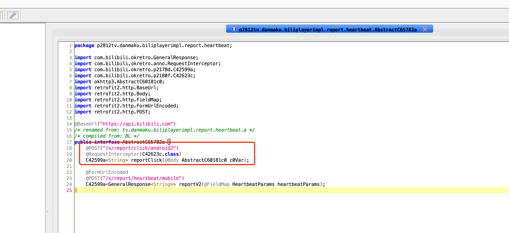
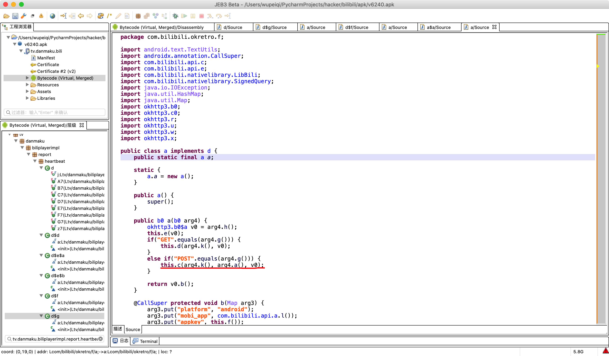
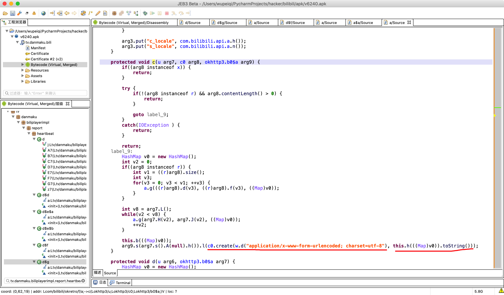
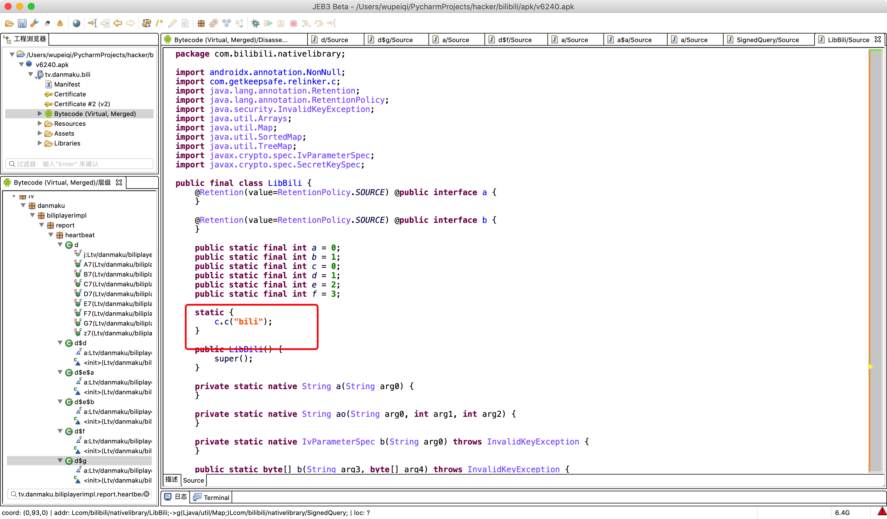
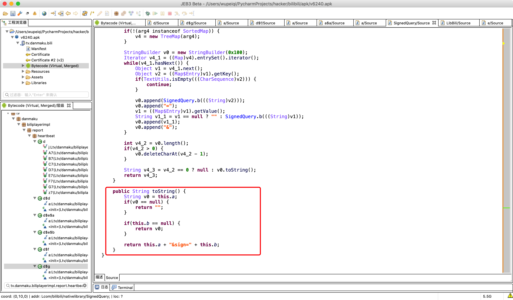
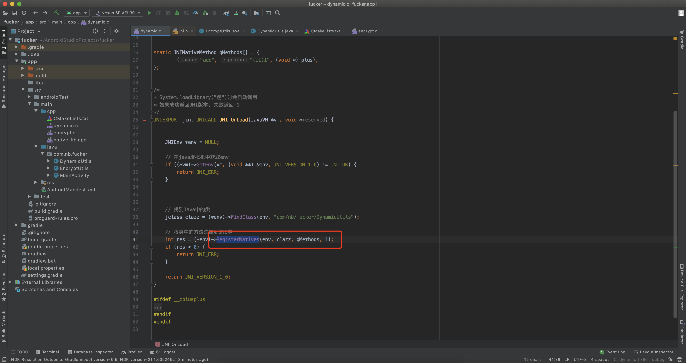
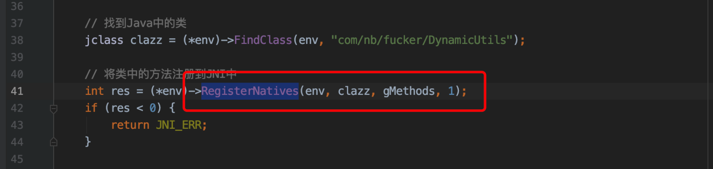
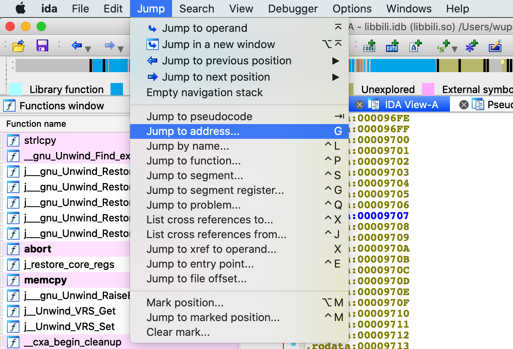
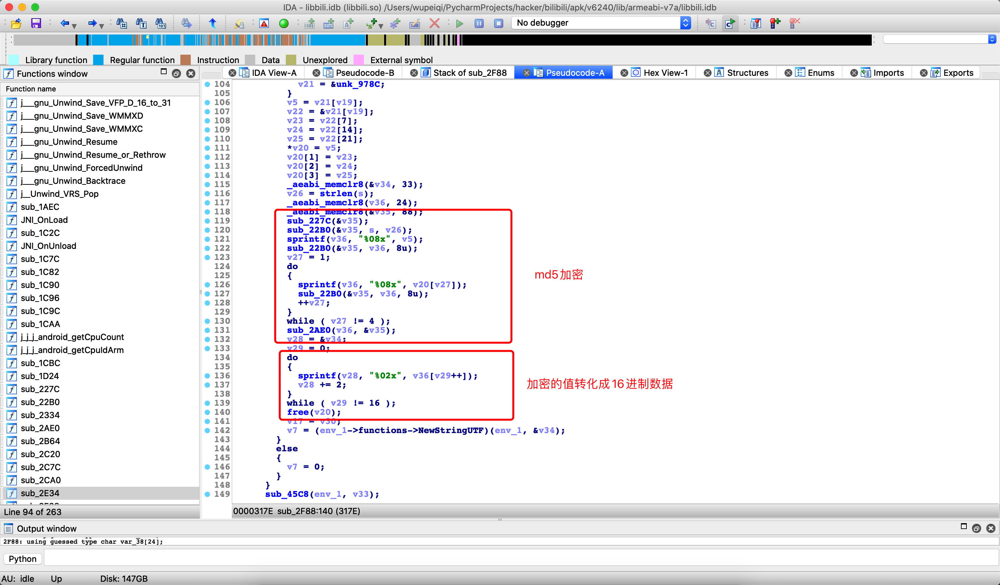

# 上节算法补充


```python
"""
arg8参数-> ebd3c8c59b86464ebdbbc1c5a6fdfcde20211031221728cd035396399a661a
生成的值->v3= 0
生成的值->v4= 60
生成的值->v0_1= 2
生成的值-> 6a


arg8参数-> ebd3c8c59b86464ebdbbc1c5a6fdfcde202110312218403c321d4a34a9ba22
生成的值->v3= 0
生成的值->v4= 60
生成的值->v0_1= 2
生成的值-> 05


arg8参数-> ebd3c8c59b86464ebdbbc1c5a6fdfcde20211031221924d1d1602203c78c79
生成的值->v3= 0
生成的值->v4= 60
生成的值->v0_1= 2
生成的值-> 4f

"""
arg8 = "ebd3c8c59b86464ebdbbc1c5a6fdfcde20211031221924d1d1602203c78c79"

v3 = 0
v4 = 60
v0_1 = 2

v5 = 0
while True:
    v6 = arg8[v3:v3 + 2]
    v5 += int(v6, base=16)
    if v3 != v4:
        v3 += v0_1
        continue
    break
data = "%02x" % (v5 % 0x100,)
print(data)
```


```python
import hashlib
import datetime
import random


def create_random_mac(sep=":"):
    """ 随机生成mac地址 """

    def mac_same_char(mac_string):
        v0 = mac_string[0]
        index = 1
        while index < len(mac_string):
            if v0 != mac_string[index]:
                return False
            index += 1
        return True

    data_list = []
    for i in range(1, 7):
        part = "".join(random.sample("0123456789ABCDEF", 2))
        data_list.append(part)
    mac = sep.join(data_list)

    if not mac_same_char(mac) and mac != "00:90:4C:11:22:33":
        return mac

    return create_random_mac(sep)


def create_buvid_by_wifi(wifi_mac):
    """
        基于wifi mac地址生成buvid （ B站app中有四种获取buvid的方式：设备ID、wifi mac地址、3.device_id、uuid ）
    """
    md5 = hashlib.md5()
    md5.update(wifi_mac.encode('utf-8'))
    v0_1 = md5.hexdigest()
    return "XY{}{}{}{}".format(v0_1[2], v0_1[12], v0_1[22], v0_1).upper()


def gen_local(buvid, phone_model, phone_band):
    """
    fp_local和fp_remote都是用这个算法来生成的，在手机初始化阶段生成 fp_local，
    :param buvid: 根据算法生成的buvid，例如："XYBA4F3B2789A879EA8AEEDBE2E4118F78303"
    :param phone_model:  手机型号modal，例如："Mate 10 Pro"
    :param phone_band:  手机品牌band，在模拟器上是空字符串（我猜是程序员想要写成 brand ）哈哈哈哈
    :return:
    """

    def misc_helper_kt(data_bytes):
        data_list = []
        v7 = len(data_bytes)
        v0 = 0
        while v0 < v7:
            v2 = data_bytes[v0]
            data_list.append("%02x" % v2)
            v0 += 1
        return ''.join(data_list)

    data_string = "{}{}{}".format(buvid, phone_model, phone_band)
    hash_object = hashlib.md5()
    hash_object.update(data_string.encode('utf-8'))
    data = hash_object.digest()

    arg1 = misc_helper_kt(data)
    arg2 = datetime.datetime.now().strftime("%Y%m%d%H%M%S")
    arg3 = misc_helper_kt(random.randbytes(8))

    return "{}{}{}".format(arg1, arg2, arg3)


def a_b(arg8):
    v3 = 0
    v4 = 60
    v0_1 = 2

    v5 = 0
    while True:
        v6 = arg8[v3:v3 + 2]
        v5 += int(v6, base=16)
        if v3 != v4:
            v3 += v0_1
            continue
        break
    data = "%02x" % (v5 % 0x100,)
    return data


wifi_mac = create_random_mac().upper()
buvid = create_buvid_by_wifi(wifi_mac)
build_model = 'Mate 10 Pro'
build_brand = "HUAWEI"

arg1 = gen_local(buvid, build_model, "")
fp_local = arg1 + a_b(arg1)
print(fp_local)
```


# day13 B站（终结）





```
tv.danmaku.biliplayerimpl.report.heartbeat.d.P7
```


## 1. N7没有关键参数

发现N7中只生成了其他参数，没有sign。


## 2.封装

没有好办法，只能逐步hook。











调用JNI中的s方法，返回的值是一个SignedQuery对象。【在JNI中会实例化并返回这个对象】。





Hook并验证。

```python
import frida
import sys

rdev = frida.get_remote_device()
session = rdev.attach("tv.danmaku.bili")

scr = """
Java.perform(function () {    
    var SignedQuery = Java.use("com.bilibili.nativelibrary.SignedQuery");

    SignedQuery.$init.implementation = function (arg1,arg2) {
        // so文件中创建好sign，然后封装到这个对象。
        send("SignedQuery构造方法");
        console.log("arg1->",arg1);
        console.log("arg2->",arg2);
        return this.$init(arg1, arg2);
    } 
});
"""

script = session.create_script(scr)


def on_message(message, data):
    print(message)


script.on("message", on_message)
script.load()
sys.stdin.read()
```


## 3. so无头绪

动态注册。


但分析几个步骤发现无头绪，找不到动态注册的那个RegisterNative函数呀。

只要找到RegisterNative函数，就能找到注册函数的对应关系。




## 4.寻找RegisterNative函数

apk是将Java代码打包后的包，解压后发现内部都是一大堆的dex文件（代码）。

安卓手机上都是有一个虚拟机，负责读取dex代码转换成机器码去执行，除此以外，也包括：垃圾回收、Java本地方法调用（JNI）、即时编译（JIT）等。

- 安卓4.2之前：DVM。
- 安卓4.2之后：DVM（默认）、ART(Android Runingtime)共存。
- 安卓5.0之后：ART。

关于两种虚拟机：

- DVM，每次运行应用的时候，实时将字节码转化为机器码，再运行程序。【基于libdvm.so库】
- ART，在安装应用的时候，就将应用的字节码转换为机器码，保存在手机里。每次运行应用的时候，无需实时转换，直接使用转换好的机器码。【基于libart.so库】


在JNI在进行动态注册时执行的 RegisterNatives 方法，就是在libart.so库中。


所以，如果想要hook RegisterNatives  方法，就必须要先找到他，所以，基于frida可以这么干。

基于frida中的模块来寻找。

```javascript
// 列举 libart.so 中的所有导出函数（成员列表）
var symbols = Module.enumerateSymbolsSync("libart.so");

// 获取 RegisterNatives函数的内存地址，并赋值给addrRegisterNatives。
var addrRegisterNatives = null;

for (var i = 0; i < symbols.length; i++) {
    var symbol = symbols[i];
    console.log(symbol.name)
    
    //_ZN3art3JNI15RegisterNativesEP7_JNIEnvP7_jclassPK15JNINativeMethodi
    // 方式1：
    if (symbol.name.indexOf("art") >= 0 &&
        symbol.name.indexOf("JNI") >= 0 &&
        symbol.name.indexOf("RegisterNatives") >= 0 &&
        symbol.name.indexOf("CheckJNI") < 0) {
        
        addrRegisterNatives = symbol.address;
        console.log("RegisterNatives is at ", symbol.address, symbol.name);
    }
    
    
    // 方式2：
    var name = "_ZN3art3JNI15RegisterNativesEP7_JNIEnvP7_jclassPK15JNINativeMethodi";
    if(symbol.name.indexOf("art") >= 0){
        if(symbol.name.indexOf(name)>=0){
            addrRegisterNatives = symbol.address;
        }
    }
}
```


## 5.Hook RegisterNavtive定位函数

找到 RegisterNatives 函数之后，就可以通过frida的拦截器来对他进行hook，以便找到注册的所有方法的对应关系。例如：




```
参数1：JNI对象；
参数2：类
参数3：动态注册的对应关系
参数4：注册的方法数量
```


```javascript
Interceptor.attach(addrRegisterNatives, {
    onEnter: function (args) {
        var env = args[0];        // jni对象
        var java_class = args[1]; // 类
        var class_name = Java.vm.tryGetEnv().getClassName(java_class);
        // 只有类名为com.bilibili.nativelibrary.LibBili，才打印输出
        var taget_class = "com.bilibili.nativelibrary.LibBili";
        
        if(class_name === taget_class){
            console.log("\n[RegisterNatives] method_count:", args[3]);
            
            // args[2] 就是动态注册的对应关系。
            // ptr是new NativePointer(s) 的缩写。(C语言中的指针)
            var methods_ptr = ptr(args[2]);
            var method_count = parseInt(args[3]);
            for (var i = 0; i < method_count; i++) {
                // Java中函数名字的
                var name_ptr = Memory.readPointer(methods_ptr.add(i * Process.pointerSize * 3));
                // 参数和返回值类型
                var sig_ptr = Memory.readPointer(methods_ptr.add(i * Process.pointerSize * 3 + Process.pointerSize));
                // C中的函数指针
                var fnPtr_ptr = Memory.readPointer(methods_ptr.add(i * Process.pointerSize * 3 + Process.pointerSize * 2));

                var name = Memory.readCString(name_ptr);
                var sig = Memory.readCString(sig_ptr);
                var find_module = Process.findModuleByAddress(fnPtr_ptr);
                var offset = ptr(fnPtr_ptr).sub(find_module.base) // fnPtr_ptr - 模块基地址
                // console.log("[RegisterNatives] java_class:", class_name);
                // console.log("name:", name, "sig:", sig, "module_name:", find_module.name, "offset:", offset);
                console.log("name:", name, "module_name:", find_module.name, "offset:", offset);
        }
        }
    }
});
```


**完整脚本：**

```javascript
function hook_RegisterNatives() {
    var symbols = Module.enumerateSymbolsSync("libart.so");
    var addrRegisterNatives = null;
    for (var i = 0; i < symbols.length; i++) {
        var symbol = symbols[i];

        // _ZN3art3JNI15RegisterNativesEP7_JNIEnvP7_jclassPK15JNINativeMethodi
        if (symbol.name.indexOf("art") >= 0 &&
            symbol.name.indexOf("JNI") >= 0 &&
            symbol.name.indexOf("RegisterNatives") >= 0 &&
            symbol.name.indexOf("CheckJNI") < 0) {
            addrRegisterNatives = symbol.address;
            console.log("RegisterNatives is at ", symbol.address, symbol.name);
        }
    }

    if (addrRegisterNatives != null) {
        Interceptor.attach(addrRegisterNatives, {
            onEnter: function (args) {
                var env = args[0];
                var java_class = args[1];
                var class_name = Java.vm.tryGetEnv().getClassName(java_class);
                //console.log(class_name);
                // 只有类名为com.bilibili.nativelibrary.LibBili，才打印输出
                var taget_class = "com.bilibili.nativelibrary.LibBili";
                if (class_name === taget_class) {
                    console.log("\n[RegisterNatives] method_count:", args[3]);
                    var methods_ptr = ptr(args[2]);
                    var method_count = parseInt(args[3]);

                    for (var i = 0; i < method_count; i++) {
                        // Java中函数名字的
                        var name_ptr = Memory.readPointer(methods_ptr.add(i * Process.pointerSize * 3));
                        // 参数和返回值类型
                        var sig_ptr = Memory.readPointer(methods_ptr.add(i * Process.pointerSize * 3 + Process.pointerSize));
                        // C中的函数指针
                        var fnPtr_ptr = Memory.readPointer(methods_ptr.add(i * Process.pointerSize * 3 + Process.pointerSize * 2));

                        var name = Memory.readCString(name_ptr); // 读取java中函数名
                        var sig = Memory.readCString(sig_ptr); // 参数和返回值类型
                        var find_module = Process.findModuleByAddress(fnPtr_ptr); // 根据C中函数指针获取模块

                        var offset = ptr(fnPtr_ptr).sub(find_module.base) // fnPtr_ptr - 模块基地址
                        // console.log("[RegisterNatives] java_class:", class_name);
                        // console.log("name:", name, "sig:", sig, "module_name:", find_module.name, "offset:", offset);
                        console.log("name:", name, "module_name:", find_module.name, "offset:", offset);

                    }
                }
            }
        });
    }
}

setImmediate(hook_RegisterNatives);
```

```
 frida -U --no-pause -f tv.danmaku.bili -l natives-1.js
```

输出：

```
RegisterNatives is at  0xac575721 _ZN3art3JNI15RegisterNativesEP7_JNIEnvP7_jclassPK15JNINativeMethodi
Spawned `tv.danmaku.bili`. Resuming main thread!                        
[Redmi 8A::tv.danmaku.bili]-> name: a module_name: libbili.so offset: 0x1c7d
name: ao module_name: libbili.so offset: 0x1c83
name: b module_name: libbili.so offset: 0x1c91

name: s module_name: libbili.so offset: 0x1c97  【这个s函数就在0x1c97地址】

name: so module_name: libbili.so offset: 0x1c9d
name: so module_name: libbili.so offset: 0x1cab
name: getCpuCount module_name: libbili.so offset: 0x1cb3
name: getCpuId module_name: libbili.so offset: 0x1cb7
```


此处得到的偏移量 `0x1c97`，就是 函数 在so文件中的位置。




## 6.分析函数

### 6.1 JNI基础

在JNI中如果想要调用Java中的成员，是使用：

示例1：

```java
// Java
package com.nb.fucker;

class Query {
    public static int getData(int v1, int v2) {
        return v1 + v2;
    }
    
    public static int getData(int v1) {
        return v1 + v2;
    }
}
```

```C
// JNI
jclass cls = (*env)->FindClass(env, "com/nb/fucker/Query");
jmethodID mid = (*env)->GetStaticMethodID(env, cls, "getData", "(II)I");
int res = (*env)->CallStaticIntMethod(env, cls, mid, 1,2);
```


示例2：

```java
// Java
package com.nb.fucker;

class Query {
    public static String getData(int v1, int v2) {
        return v1 + v2;
    }
}
```

```c
// JNI
jclass cls = (*env)->FindClass(env, "com/nb/fucker/Query");
jmethodID mid = (*env)->GetStaticMethodID(env, cls, "getData", "(II)Ljava/lang/String;");
jobject res = (*env)->CallStaticObjectMethod(env, cls, mid, 1,2);
```


示例3：

```java
// java
package com.nb.fucker;

class Query {

    public static String getData(String v1, int v2) {
        return String.valueOf(v1 + v2);
    }
}
```

```c
// JNI，C语言
jclass cls = (*env)->FindClass(env, "com/nb/fucker/Query");
jmethodID mid = (*env)->GetStaticMethodID(env, cls, "getData","(Ljava/lang/String;I)Ljava/lang/String;");

jstring arg1 = (*env)->NewStringUTF(env, "哈哈哈哈");
jobject res = (*env)->CallStaticObjectMethod(env, cls, mid, arg1, 2);
```


示例4：

```java
// java
package com.nb.fucker;

class Query {
    // 构造方法
    public Query(int arg1, int arg2, String arg3) {

    }
    // getData
    public String getData(int v1, int v2) {
        return String.valueOf(v1 + v2);
    }
}
```


```c
// JNI
jclass cls = (*env)->FindClass(env, "com/nb/fucker/Query");
jmethodID init = (*env)->GetMethodID(env, cls, "<init>", "(IILjava/lang/String;)V");

// 实例化出来的对象
jobject cls_object = (*env)->NewObject(env, cls, init, 1, 2, (*env)->NewStringUTF(env, "哈哈哈哈"));


jmethodID mid = (*env)->GetMethodID(env, cls, "getData", "(II)Ljava/lang/String;");

jstring arg1 = (*env)->NewStringUTF(env, "字符串呀");
jobject res = (*env)->CallObjectMethod(env, cls_object, mid, arg1, 2);
```


### 6.2 so分析


**示例1：**

```C
#include <stdio.h>

int main() {
    char v34[80]; // [ , , , , , , , , , , , , ]
    char *v28;
    v28 = (char *) &v34;
    
    sprintf(v28, "%02x", 1); // 01
    v28  += 2;

    sprintf(v28, "%02x", 2); // 02
    v28  += 2;

    sprintf(v28, "%02x", 4); // 04
    v28  += 2;

    sprintf(v28, "%02x", 'a'); 
    v28  += 2;

    sprintf(v28, "%02x", 'b');
    v28  += 2;

    printf(v34);
    return 0;

}
```

**示例2：**

```c
#include <stdio.h>

int main() {
    char v36[] = {1, 2, 3, 'a', 'b', 'c', 'd', 'e', 'f', 'g',};
    char v34[80];
    char *v28;
    v28 = (char *) &v34;

    int v29 = 0;
    do {
        sprintf(v28, "%02x", v36[v29++]);
        v28 += 2;
    } while (v29 != 10);

    printf(v34);
    return 0;

}
```


所以，现在关键在于 v36 到底是谁？ 因为，v34其实就是将v36 的每个字符转化成16进制并拼接起来。





如果这个是md5加密，那么这个反复在执行 `sub_22B0`  应该就是update的过程，因为一般的md5加密都是这样。

```
obj = hashlib.md5()
obj.update("xxx".encode('utf-8'))
obj.update("xxx".encode('utf-8'))
obj.update("xxx".encode('utf-8'))
obj.update("xxx".encode('utf-8'))
res = obj.hexdigist()
```


所以，可以对 `sub_22B0` 函数进行hook，一般会将明文传给update，所以这样也是可以看到加密明文的地方。


```python
import frida
import sys

rdev = frida.get_remote_device()
session = rdev.attach("tv.danmaku.bili")

scr = """
Java.perform(function () {

    var libbili = Module.findBaseAddress("libbili.so");
    var s_func = libbili.add(0x22b0 + 1);
    console.log(s_func);
    Interceptor.attach(s_func, {
        onEnter: function (args) {
            // args[0]
            // args[1]，字符串
            // args[2]，字符串长度
            console.log("执行update，长度是：",args[2]);
            // console.log(hexdump(args[1]));
            console.log(hexdump(args[1], {length: args[2].toInt32()}));
        },
        onLeave: function (args) {
            console.log("=======================结束===================");
        }
    });
});
"""
script = session.create_script(scr)


def on_message(message, data):
    # print(message, data)
    data = message['payload']
    bs = bytearray()
    for item in data[2:]:
        print(int(item,base=16))

script.on("message", on_message)
script.load()
sys.stdin.read()
```


Hook之后，获取到了这个key，就是MD5尾部添加的值，所以，这个算法就是。

```python
def get_param_sign_s(param_dict):
    ordered_string = "&".join(["{}={}".format(key, param_dict[key]) for key in sorted(param_dict.keys())])
    encrypt_string = ordered_string + "560c52ccd288fed045859ed18bffd973"
    obj = hashlib.md5(encrypt_string.encode('utf-8'))
    sign = obj.hexdigest()

    return "{}&sign={}".format(ordered_string, sign)
```


## 总结

- RegisterNatives，虚拟机来Hook。
- so中的函数
  - 导出函数  exports
  - 非导出函数
- 根据内存地址去Hook。


