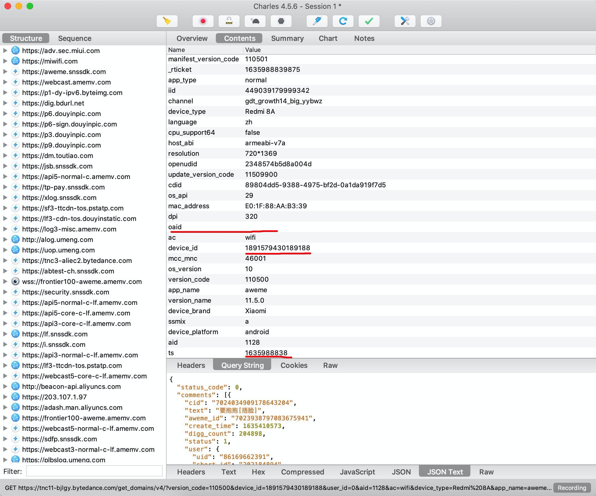
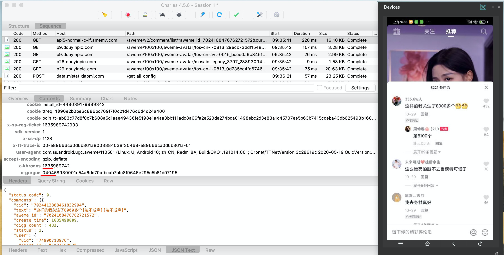
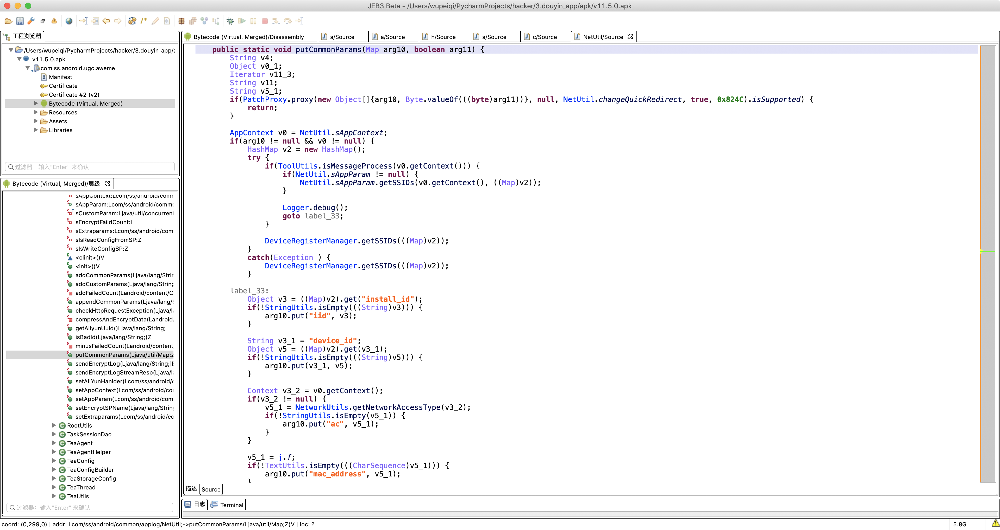
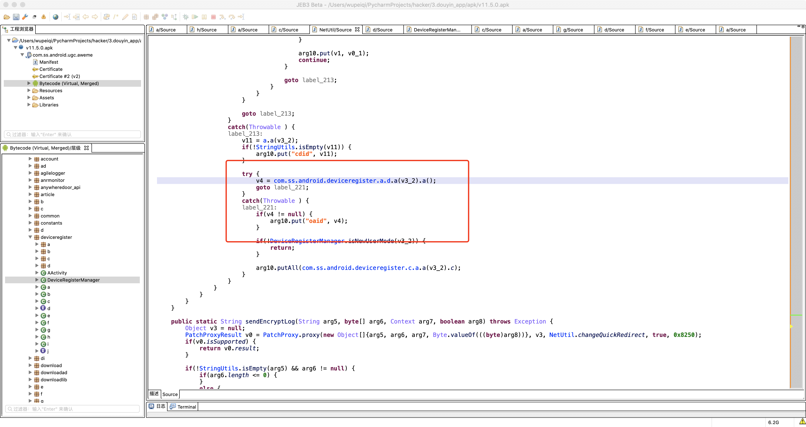
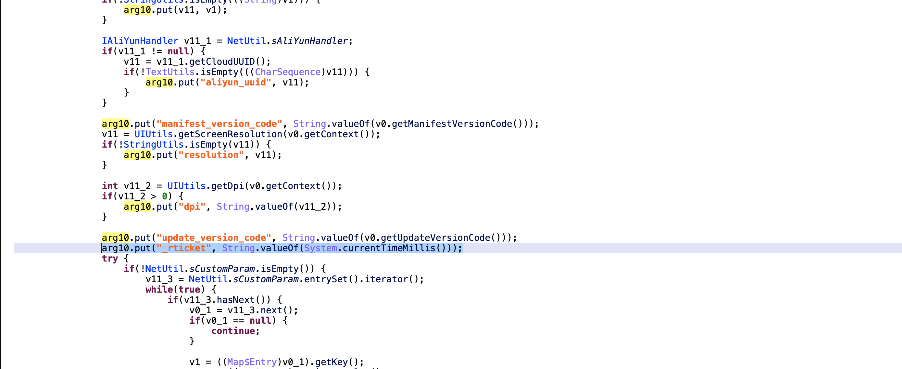
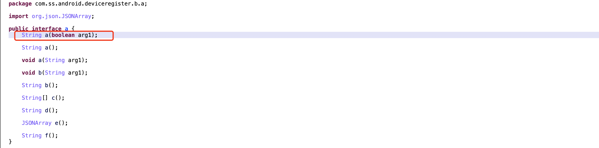

# day14 抖音app（上）

- 目标：获取评论信息

- 版本：
  - v11.5.0【83.7M】（真机）
  - v11.5.1【5.7M】


## 1.抓包


### 1.1 URL参数





### 1.2 Cookie


### 1.3 请求头




## 2.URL参数处理

### 2.1 cdid

根据关键字搜索 `cdid`。


此处看到了 `SharedPreferences`，分析一下应该是：优先去xml文件中读取，如果没有的话，就使用 UUID 生成一个新的返回（同时写入到xml文件中）。

```python
import uuid

cdid = str(uuid.uuid4())
```


接下来：

- 想要验证的话，就可以在此处进行hook【清除手机数据后，再打开】。
- 此处获取调用栈，也可以知道是谁调用的 `cdid`，根据调用栈也可以找到生成其他参数的地方。


Hook UUID

```python
import frida
import sys

rdev = frida.get_remote_device()
session = rdev.attach("com.ss.android.ugc.aweme")

scr = """
Java.perform(function () {
    var UUID = Java.use("java.util.UUID");
    UUID.randomUUID.implementation = function(){
        var res = this.randomUUID();
        console.log(res,res.toString());
        console.log(Java.use("android.util.Log").getStackTraceString(Java.use("java.lang.Throwable").$new()));
        console.log('-------------');
        return res;
    }
});
"""
script = session.create_script(scr)


def on_message(message, data):
    print(message, data)


script.on("message", on_message)
script.load()
sys.stdin.read()
```

```
4ad06c6d-6d84-49a1-a749-d8485832df61 4ad06c6d-6d84-49a1-a749-d8485832df61
529c42b5-ef56-4866-8bc1-c53d55638953 529c42b5-ef56-4866-8bc1-c53d55638953
java.lang.Throwable
	at java.util.UUID.randomUUID(Native Method)
	at com.ss.android.ugc.aweme.shortvideo.e.a.b(SourceFile:458894)
	at com.ss.android.ugc.aweme.services.AVPublishServiceImpl.lambda$tryRestorePublish$0$AVPublishServiceImpl(SourceFile:393258)
	at com.ss.android.ugc.aweme.services.AVPublishServiceImpl$$Lambda$0.call(Unknown Source:21)
	at bolts.Task$10.run(SourceFile:262164)
	at com.ss.android.ugc.aweme.bs.c.run(SourceFile:459000)
	at java.util.concurrent.ThreadPoolExecutor.runWorker(ThreadPoolExecutor.java:1167)
	at java.util.concurrent.ThreadPoolExecutor$Worker.run(ThreadPoolExecutor.java:641)
	at com.ss.android.ugc.aweme.bs.e$3$1.run(SourceFile:262193)
	at java.lang.Thread.run(Thread.java:919)

-------------
java.lang.Throwable 这个
	at java.util.UUID.randomUUID(Native Method)
	at com.ss.android.deviceregister.d.a$1.a(SourceFile:17039392)
	at com.ss.android.deviceregister.d.h.b(SourceFile:16973833)
	at com.ss.android.deviceregister.d.a.a(SourceFile:16908296)
	
	at com.ss.android.common.applog.NetUtil.putCommonParams(SourceFile:34079342)
	
	at com.ss.android.ugc.aweme.legoImp.task.CrashSdkInitTask$a.a(SourceFile:262176)
	at com.bytedance.crash.runtime.c.b(SourceFile:393225)
	at com.bytedance.crash.upload.e.run(SourceFile:393410)
	
	at android.os.Handler.handleCallback(Handler.java:883)
	at android.os.Handler.dispatchMessage(Handler.java:100)
	at android.os.Looper.loop(Looper.java:223)
	at com.bytedance.crash.runtime.q$c.onLooperPrepared(SourceFile:327712)
	at android.os.HandlerThread.run(HandlerThread.java:66)


```


```python
import frida
import sys

rdev = frida.get_remote_device()
session = rdev.attach("com.ss.android.ugc.aweme")

scr = """
Java.perform(function () {
    var cls = Java.use("com.ss.android.deviceregister.d.a");
    cls.a.implementation = function(arg4){
        var res = this.a(arg4);
        console.log("获取cdid=",res);
        console.log(Java.use("android.util.Log").getStackTraceString(Java.use("java.lang.Throwable").$new()));
        console.log('-------------');
        return res;
    }
});
"""
script = session.create_script(scr)


def on_message(message, data):
    print(message, data)


script.on("message", on_message)
script.load()
sys.stdin.read()
```


hook后的结果是：

```
获取cdid= 7236424f-bf31-4bb5-9147-fd17b10aedbf
java.lang.Throwable
	at com.ss.android.deviceregister.d.a.a(Native Method)
	at com.ss.android.common.applog.NetUtil.putCommonParams(SourceFile:34079342)
	at com.ss.android.ugc.aweme.net.interceptor.CommonParamsInterceptorTTNet.intercept(SourceFile:17170479)
	...
```

分析：在代码中应该写了拦截器，对公共参数进行处理。


### 2.2 其他参数

顺着调用栈向上找：

```
at com.ss.android.common.applog.NetUtil.putCommonParams(SourceFile:34079342)
```




所有的参数都在这里了，所以从这里就可以开始找各个参数了。


### 2.3 oaid



这个就是去读取手机上的虚拟身份ID，可以在手机上进行关闭。

【设置】-> 【搜索：虚拟】-> 【虚拟身份管理】


```
关于OAID要从获取android设备唯一标识说起。
Android设备唯一标识包含IMEI，ANDROID_ID，Mac 地址等，随着国外对隐私保护的越来越看重，这些唯一标识要么无法获取，要么就是无效值，亦或者像ANDROID_ID各个应用获取到的是不同值，但总有一些场景需要唯一标识一台设备，尤其是CPI广告（CPI广告是按照实际的安装数量结算，需要唯一标识来确保没有重复计算），所以移动安全联盟搞了这个OAID，其本质是一个设备唯一标识。
```


关闭后，再次发送请求。


### 2.4 _rticket




```java
1633395754178，毫秒级别。
```

用python实现：

```python
import time

_rticket = str( int(time.time() * 1000) )
```


### 2.5 openudid





此处去调用一个接口，那么实现这个接口的类是谁呢？

- 可以分析

  

- 可以用JADX寻找引用
  


找到类之后，就来看其中的a方法。


如果想要验证，就需要让代码走这里。怎么搞呢？

可以hook  SharedPreferences，读取 openudid时，如果为空，肯定就会重新生成了。

```python
import frida
import sys

rdev = frida.get_remote_device()
session = rdev.attach("com.ss.android.ugc.aweme")

scr = """
Java.perform(function () {
    var SharedPreferences = Java.use("android.content.SharedPreferences");
    
    var c = Java.use("com.ss.android.deviceregister.c");
    var e = Java.use("com.ss.android.deviceregister.d.e");
    var BigInteger = Java.use("java.math.BigInteger");
    
    SharedPreferences.getString.implementation = function(key,a2){
    	// 获取openudid为空
        if(key==="openudid"){
            return "";
        }
        return this.getString(a1,a2);
    }
    
    
    c.a.overload('boolean').implementation = function(a9){
    	// 调用a方法
        var res = this.a(a9);
        console.log("获取openudid，值为：",res);
        return res;
    }
    
    e.c.overload('android.content.Context').implementation = function(ctx){
        // 在a方法中确保，v0为空
        return null;
    }
    
    BigInteger.toString.overload('int').implementation = function(arg){
        var res = this.toString(arg);
        console.log(res);
        console.log(arg);
        console.log(Java.use("android.util.Log").getStackTraceString(Java.use("java.lang.Throwable").$new()));
        console.log('-------------');
        return res;
    }
});
"""
script = session.create_script(scr)


def on_message(message, data):
    print(message, data)


script.on("message", on_message)
script.load()
sys.stdin.read()
```


实现代码：

```python
import random

open_udid = "".join([hex(i)[2:] for i in random.randbytes(10)])

print(open_udid) # 长度20
```

```java
import java.math.BigInteger;
import java.security.SecureRandom;
import java.util.ArrayList;

public class Hello {

    public static void main(String[] args) {
		// 随机生成80位，10个字节
        BigInteger v4 = new BigInteger(80, new SecureRandom());
        // 让字节以16进制展示
        System.out.println(v4.toString(16));

    }
}
```


## 3. device_id和iid 问题

iid其实就是install_id。

而 device_id 和 install_id （包括cookie中的值）是发送请求 `/service/2/device_register/` 获得的返回值。


所以，要先搞定这个请求，再去搞评论。


