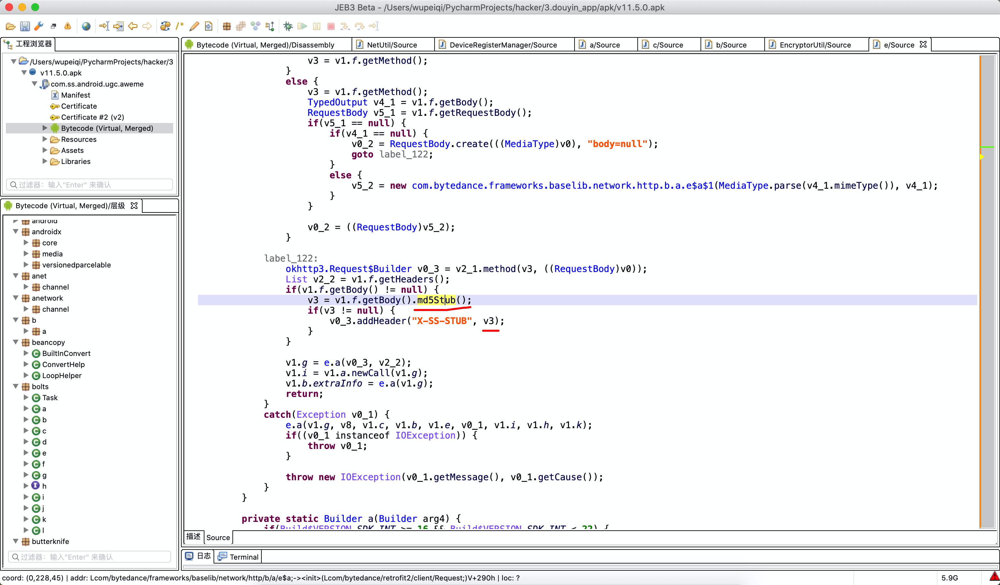
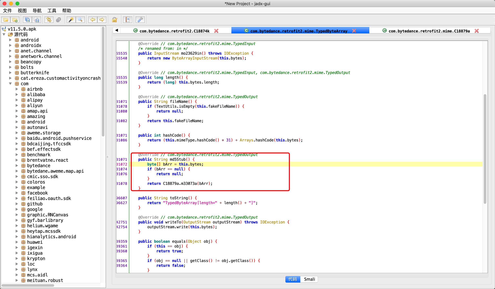
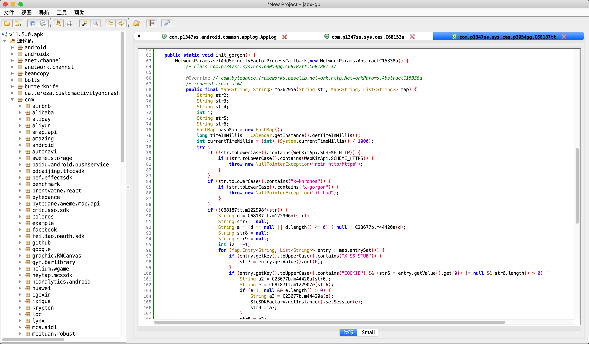
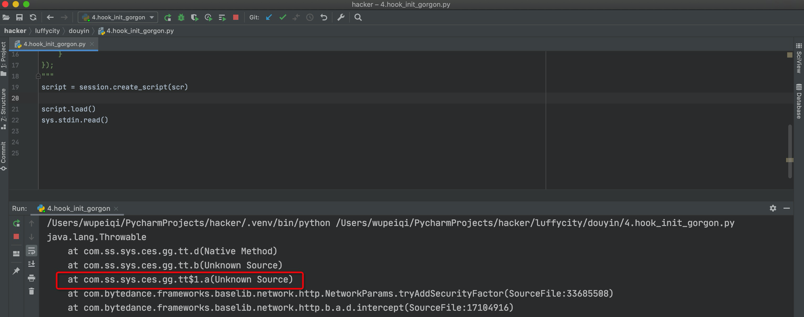
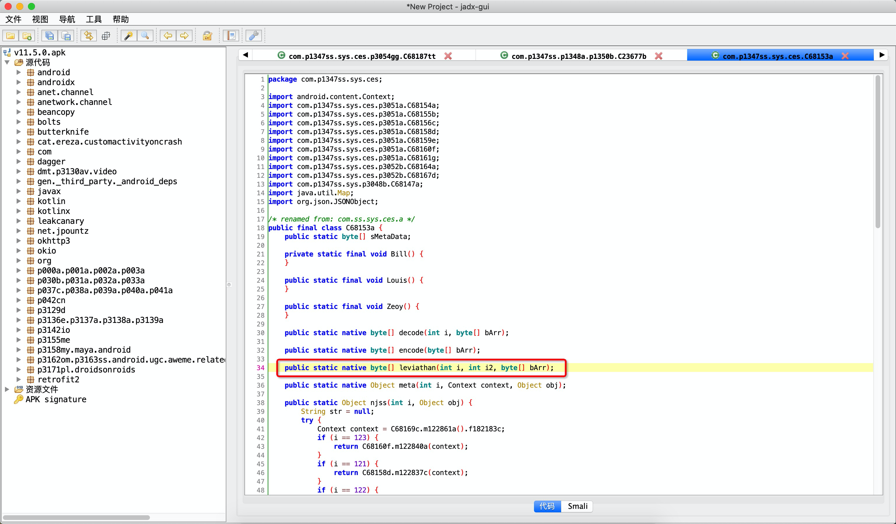

## 4.请求头（评论和注册设备）

上述 【获取评论】 和 【注册设备】 发送请求时，都要携带一些请求头。

- 获取评论**【GET请求】**
  

- 注册设备**【POST请求】**

  


### 4.1 x-ss-stub

发现在 post 请求时，会携带这个请求头，而 get 请求是没有的。

在jeb中根据关键字搜索：`x-ss-stub`


```
v1.f.getBody，应该是获取请求体，然后对请求体再进行操作（md5加密）
```







这个就是个md5加密。

所以，如果发送POST请求时， `x-ss-stub` 就是对请求体加密的值。


回顾一下，在注册设备时（POST请求）我们会发送明文或密码。

- 明文时

  ```
  明文 -> gzip压缩 ==> 请求体
  
  x-ss-stub就是对gzip压缩的数据进行md5加密。
  ```

- 密文时

  ```
  明文 -> gzip压缩 -> so加密 -> 请求体
  
  x-ss-stub就是对加密后的请求体进行md5加密。
  ```


### 4.2 x-gorgon 和 x-khronos

这个两个请求头是所有请求都会携带的。

在jadx搜索：x-gorgon





#### 4.2.1 参数是什么？


想要hook这个 `mo36295a` 方法，但是不知道他的类名叫什么，怎么hook？

> 可以先hook它里面的类，输出下调用栈，就知道了：com.ss.sys.ces.gg.tt$1.a

```python
import frida
import sys

rdev = frida.get_remote_device()
session = rdev.attach("com.ss.android.ugc.aweme")

scr = """
Java.perform(function () {
    var tt1 = Java.use("com.ss.sys.ces.gg.tt");
    tt1.d.implementation = function(str){
        console.log(Java.use("android.util.Log").getStackTraceString(Java.use("java.lang.Throwable").$new()));
        var res = this.d(str);
        return res;
    }
});
"""
script = session.create_script(scr)

script.load()
sys.stdin.read()
```





接下来，对 `mo36295a` 进行hook并获取他的参数，看看参数到底是个啥？

```python
import frida
import sys

rdev = frida.get_remote_device()
session = rdev.attach("com.ss.android.ugc.aweme")

scr = """
Java.perform(function () {
    function showMap(title,map){
        var result = "";
        var keyset = map.keySet();
        var it = keyset.iterator();
        while(it.hasNext()){
            var keystr = it.next().toString();
            var valuestr = map.get(keystr).toString();
            result += keystr;
            result += "=";
            result += valuestr;
            result += "; ";
        }
        console.log(title, result);
    }
    
    var tt1 = Java.use("com.ss.sys.ces.gg.tt$1");
    tt1.a.implementation = function(str,header){
        console.log('参数1->',str);
        showMap("参数2->",header);
        
        var res = this.a(str,header);
        showMap("结果-",res);
        
        console.log('-------------');
        return res;
    }
});
"""
script = session.create_script(scr)


def on_message(message, data):
    print(message['payload'])


script.on("message", on_message)
script.load()
sys.stdin.read()


```


此被调用时：

- 参数：str，请求的URL

  ```
  https://api3-normal-c-lf.amemv.com/aweme/v2/comment/list/?aweme_id=7014729210929466627&cursor=0&count=20&address_book_access=2&gps_access=2&forward_page_type=1&channel_id=0&city=130400&hotsoon_filtered_count=0&hotsoon_has_more=0&follower_count=0&is_familiar=0&page_source=0&manifest_version_code=110501&_rticket=1633579437171&app_type=normal&iid=1469383821240509&channel=gdt_growth14_big_yybwz&device_type=Redmi%208A&language=zh&cpu_support64=false&host_abi=armeabi-v7a&resolution=720*1369&openudid=2348574b5d8a004d&update_version_code=11509900&cdid=966d6c76-0369-4841-acd2-e06584644a2a&os_api=29&mac_address=E0%3A1F%3A88%3AAA%3AB3%3A39&dpi=320&oaid=&ac=wifi&device_id=1891579430189188&mcc_mnc=46001&os_version=10&version_code=110500&app_name=aweme&version_name=11.5.0&device_brand=Xiaomi&ssmix=a&device_platform=android&aid=1128&ts=1633579440
  ```

- 参数：map，请求头（字典类型）

  ```
  x-tt-trace-id=[00-58ec0df80d6b861a800388486c520468-58ec0df80d6b861a-01]; 
  cookie=[
  	install_id=1469383821240509; 
  	ttreq=1$9f534ee7a9db1e3bcb06024a7461a696cf931581; 	odin_tt=50121ea7cbffd9d6fea1bbbada4adf1801fefd6a58a89ad39952dcc7b66a828761cc6780ced008b18d2c5180c5026832c8d89090e8dc8011cd5e61044fdd32ab
  	]; 
  sdk-version=[1]; 
  x-ss-dp=[1128]; 
  accept-encoding=[gzip, deflate, br]; 
  x-ss-req-ticket=[1633579437166]; 
  user-agent=[com.ss.android.ugc.aweme/110501 (Linux; U; Android 10; zh_CN; Redmi 8A; Build/QKQ1.191014.001;Cronet/TTNetVersion:3c28619c 2020-05-19 QuicVersion:0144d358 2020-03-24)]; 
  ```

- 返回值

  ```
  结果- X-Khronos=1633579437; X-Gorgon=04043843000592c74a3a2bceabd7afeb8d36fc897b4e58d8238f; 
  ```


#### 4.2.2 分析变量


##### 变量d

切割当前请求的URL，获取参数部分。

```java
String d = C68187tt.m122906d(str);
```

例如：

```python
str = "https://api3-normal-c-lf.amemv.com/aweme/v2/comment/list/?aweme_id=7014729210929466627&cursor=0&count=20&address_book_access=2&gps_access=2&forward_page_type=1&channel_id=0&city=130400&hotsoon_filtered_count=0&hotsoon_has_more=0&follower_count=0&is_familiar=0&page_source=0&manifest_versio..."

# 切割后的值为：

d="aweme_id=7014729210929466627&cursor=0&count=20&address_book_access=2&gps_access=2&forward_page_type=1&channel_id=0&city=130400&hotsoon_filtered_count=0&hotsoon_has_more=0&follower_count=0&is_familiar=0&page_source=0&manifest_versio..."
```


##### 变量a

对切割后的GET参数进行md5加密。

```java
String a = (d == null || d.length() <= 0) ? null : C23677b.m44420a(d);
```


##### 变量str7

读取请求体中的 `X-SS-STUB` （请求体的md5加密值）。

- 如果有值，则 str7 = `请求体中的X-SS-STUB值`       【POST请求】
- 如果没值，则 str7 = "00000000000000000000000000000000" 【GET请求】


##### 变量str8

读取cookie，并对cookie的值进行md5加密。

```python
cookie的值="install_id=1469383821240509; ttreq=1$9f534ee7a9db1e3bcb06024a7461a696cf931581; odin_tt=50121ea7cbffd9d6fea1bbbada4adf1801fefd6a58a89ad39952dcc7b66a828761cc6780ced008b18d2c5180c5026832c8d89090e8dc8011cd5e61044fdd32ab"

# cookie是在放在请求体中的的，所有这里是去请求体中获取的。
```


##### 变量str9

读取cookie中的 sessionid。

- 如果有：`str9 = 对session_id进行md5加密`
- 如果没：`str9= "00000000000000000000000000000000"` 

注意：抓包发现cookie中没有session_id，所以str9就是 `0000...`


##### 变量i2

```
i2 = -1
```

因为hook的请求体中根本没有 `META-SHADOWMAZE`。


#### 4.2.3 加密和处理


##### 第1步：拼接

```python
a + str7 + str8 + str9

a = "GET参数md5加密"
str7 = "00000000000000000000000000000000" 或 'X-SS-STUB头'
str8 = 'cookie的md5加密'
str9 = '00000000000000000000000000000000'
```


##### 第2步：m44418a处理


```java
public static byte[] m44418a(String str) {
    // 字符串长度
    int length = str.length();
    
    // 字节数组，是总长度的 1/2
    // [x,]
    byte[] bArr = new byte[(length / 2)];
    
    for (int i = 0; i < length; i += 2) {
        // 值 = ( 第i个字符转以16进制转整形 << 4 ) + 第i+1个字符转以16进制转整形
        bArr[i / 2] = (byte) ((Character.digit(str.charAt(i), 16) << 4) + Character.digit(str.charAt(i + 1), 16));
    }
    return bArr;
}
```

```javascript
// JavaScript实现
var str = "拼接后的字符串"

var bArr = [];
for(var i=0;i<str.length;i+=2){
    var item = (parseInt(str[i],16) << 4) + parseInt(str[i+1],16);
    bArr.push(item);
}
```

```python
# Python实现
str_data = '6c2a0c5df32f1c2dcf537cb1b7c3c28a0000000000000000000000000000000054807aabff5a113a220938e77db4058d00000000000000000000000000000000'

data_list = []
for i in range(0, len(str_data), 2):
    char = int(int(str_data[i], base=16) << 4) + int(str_data[i + 1], base=16)
    data_list.append(char)
print(data_list)
```


##### 第3步：so加密

```
int currentTimeMillis = (int) (System.currentTimeMillis() / 1000);

参数1：-1    
参数2：时间戳 currentTimeMillis（X-Khronos就是这个值）
参数3：第2步处理后的字节数组

C68153a.leviathan(i2, currentTimeMillis, C23676a.m44418a(a + str7 + str8 + str9))
```





此处就可以直接使用 frida-rpc 来主动调用 leviathan方法。

```python
import frida
import time

rdev = frida.get_remote_device()
session = rdev.attach("com.ss.android.ugc.aweme")

scr = """
rpc.exports = {   
    execandleviathan: function (i2,str){
        var result;
        Java.perform(function () {
            // 先处理拼接好的数据（字节数组） m44418a方法
            var bArr = [];
            for(var i=0;i<str.length;i+=2){
                var item = (parseInt(str[i],16) << 4) + parseInt(str[i+1],16);
                bArr.push(item);
            }
            
            // 转换为java的字节数组
            var dataByteArray = Java.array('byte',bArr);
            
            // 调用leviathan方法
            var Gorgon = Java.use("com.ss.sys.ces.a");
            result = Gorgon.leviathan(-1, i2 , dataByteArray);   //leviathan为方法名
        });
        return result;
    }
}
"""
script = session.create_script(scr)
script.load()


khronos = int(time.time())
un_sign_string = '6c2a0c5df32f1c2dcf537cb1b7c3c28a0000000000000000000000000000000054807aabff5a113a220938e77db4058d00000000000000000000000000000000'

sign_byte_list = script.exports.execandleviathan(khronos, un_sign_string)

print(sign_byte_list)
```


##### 第4步：m44417a处理

处理之后的结果就是 `x-gorgon`


```python
import ctypes

def m44417a(barr):
    def int_overflow(val):
        maxint = 2147483647
        if not -maxint - 1 <= val <= maxint:
            val = (val + (maxint + 1)) % (2 * (maxint + 1)) - maxint - 1
        return val

    def unsigned_right_shift(n, i):
        # 数字小于0，则转为32位无符号uint     n>>>i
        if n < 0:
            n = ctypes.c_uint32(n).value
        # 正常位移位数是为正数，但是为了兼容js之类的，负数就右移变成左移好了
        if i < 0:
            return -int_overflow(n << abs(i))
        # print(n)
        return int_overflow(n >> i)

    char_array = "0123456789abcdef"
    result = ['' for i in range(len(barr) * 2)]
    for i in range(len(barr)):
        i2 = barr[i] & 255
        i3 = i * 2
        result[i3] = char_array[  unsigned_right_shift(i2, 4)  ]  # i2 >>> 4
        result[i3 + 1] = char_array[i2 & 15]
    return ''.join(result)

```


##### 整合代码

```python
import frida
import time

import ctypes


def m44417a(barr):
    def int_overflow(val):
        maxint = 2147483647
        if not -maxint - 1 <= val <= maxint:
            val = (val + (maxint + 1)) % (2 * (maxint + 1)) - maxint - 1
        return val

    def unsigned_right_shift(n, i):
        # 数字小于0，则转为32位无符号uint     n>>>i
        if n < 0:
            n = ctypes.c_uint32(n).value
        # 正常位移位数是为正数，但是为了兼容js之类的，负数就右移变成左移好了
        if i < 0:
            return -int_overflow(n << abs(i))
        # print(n)
        return int_overflow(n >> i)

    char_array = "0123456789abcdef"
    result = ['' for i in range(len(barr) * 2)]
    for i in range(len(barr)):
        i2 = barr[i] & 255
        i3 = i * 2
        result[i3] = char_array[unsigned_right_shift(i2, 4)]  # i2>>>4
        result[i3 + 1] = char_array[i2 & 15]
    return ''.join(result)


def get_frida_rpc_script():
    rdev = frida.get_remote_device()
    session = rdev.attach("com.ss.android.ugc.aweme")

    scr = """
    rpc.exports = {   
        execandleviathan: function (i2,str){
            var result;
            Java.perform(function () {
                // 先处理拼接好的数据（字节数组）
                var bArr = [];
                for(var i=0;i<str.length;i+=2){
                    var item = (parseInt(str[i],16) << 4) + parseInt(str[i+1],16);
                    bArr.push(item);
                }
                
                // 转换为java的字节数组
                var dataByteArray = Java.array('byte',bArr);
                
                // 调用leviathan方法
                var Gorgon = Java.use("com.ss.sys.ces.a");
                result = Gorgon.leviathan(-1, i2 , dataByteArray);   //leviathan为方法名
            });
            return result;
        }
    }
    """
    script = session.create_script(scr)
    script.load()
    return script


script = get_frida_rpc_script()

khronos = int(time.time())
un_sign_string = '6c2a0c5df32f1c2dcf537cb1b7c3c28a0000000000000000000000000000000054807aabff5a113a220938e77db4058d00000000000000000000000000000000'
sign_byte_list = script.exports.execandleviathan(khronos, un_sign_string)

gorgon = m44417a(sign_byte_list)
print(gorgon)
print(khronos)
```


请求头 `x-gorgon` 和 `x-khronos` 搞定。。。


## 注册设备代码（完整版）

```python
import frida
import time
import ctypes
import hashlib
import random
import uuid
import time
import gzip
import requests
from urllib.parse import quote_plus


def create_random_mac(sep=":"):
    """ 随机生成mac地址 """

    def mac_same_char(mac_string):
        v0 = mac_string[0]
        index = 1
        while index < len(mac_string):
            if v0 != mac_string[index]:
                return False
            index += 1
        return True

    data_list = []
    for i in range(1, 7):
        part = "".join(random.sample("0123456789ABCDEF", 2))
        data_list.append(part)
    mac = sep.join(data_list)

    if not mac_same_char(mac) and mac != "00:90:4C:11:22:33":
        return mac

    return create_random_mac(sep)


def create_cdid():
    return str(uuid.uuid4())


def create_openudid():
    return "".join([hex(i)[2:] for i in random.randbytes(10)])


def m44417a(barr):
    def int_overflow(val):
        maxint = 2147483647
        if not -maxint - 1 <= val <= maxint:
            val = (val + (maxint + 1)) % (2 * (maxint + 1)) - maxint - 1
        return val

    def unsigned_right_shift(n, i):
        # 数字小于0，则转为32位无符号uint     n>>>i
        if n < 0:
            n = ctypes.c_uint32(n).value
        # 正常位移位数是为正数，但是为了兼容js之类的，负数就右移变成左移好了
        if i < 0:
            return -int_overflow(n << abs(i))
        # print(n)
        return int_overflow(n >> i)

    char_array = "0123456789abcdef"
    result = ['' for i in range(len(barr) * 2)]
    for i in range(len(barr)):
        i2 = barr[i] & 255
        i3 = i * 2
        result[i3] = char_array[unsigned_right_shift(i2, 4)]  # i2>>>4
        result[i3 + 1] = char_array[i2 & 15]
    return ''.join(result)


def get_frida_rpc_script():
    rdev = frida.get_remote_device()
    session = rdev.attach("com.ss.android.ugc.aweme")

    scr = """
    rpc.exports = {   
        ttencrypt:function(bArr,len){
             var res;
             
             Java.perform(function () {
                var EncryptorUtil = Java.use("com.bytedance.frameworks.encryptor.EncryptorUtil");  
                
                // 将bArr转换成Java的字节数组。
                var dataByteArray = Java.array('byte',bArr);
                
                // 调用native方法，并获取返回值。
                res = EncryptorUtil.ttEncrypt(dataByteArray,len);
             });
             
             return res;
        },
        execandleviathan: function (i2,str){
            var result;
            Java.perform(function () {
                // 先处理拼接好的数据（字节数组）
                var bArr = [];
                for(var i=0;i<str.length;i+=2){
                    var item = (parseInt(str[i],16) << 4) + parseInt(str[i+1],16);
                    bArr.push(item);
                }
                
                // 转换为java的字节数组
                var dataByteArray = Java.array('byte',bArr);
                
                // 调用leviathan方法
                var Gorgon = Java.use("com.ss.sys.ces.a");
                result = Gorgon.leviathan(-1, i2 , dataByteArray);   //leviathan为方法名
            });
            return result;
        }
    }
    """
    script = session.create_script(scr)
    script.load()
    return script


def register_device_encrypt():
    """ 密文注册设备 """
    script = get_frida_rpc_script()

    # 1.生成参数
    mac_addr = create_random_mac()
    cdid = create_cdid()
    clientudid = create_cdid()
    openudid = create_openudid()
    _rticket = int(time.time() * 1000)
    ts = int(time.time())

    # 2.构造请求头和URL参数
    body_tpl = '{"magic_tag":"ss_app_log","header":{"display_name":"抖音短视频","update_version_code":1800,"manifest_version_code":180,"aid":1128,"channel":"sem_shenma_dy_and17","appkey":"57bfa27c67e58e7d920028d3","package":"com.ss.android.ugc.aweme","app_version":"1.8.0","version_code":180,"sdk_version":201,"os":"Android","os_version":"10","os_api":29,"device_model":"Redmi 8A","device_brand":"Xiaomi","device_manufacturer":"Xiaomi","cpu_abi":"armeabi-v7a","build_serial":"unknown","release_build":"024a06f_20200618","density_dpi":320,"display_density":"xhdpi","resolution":"1369x720","language":"zh","mc":"%s","timezone":8,"access":"wifi","not_request_sender":0,"carrier":"中国联通","mcc_mnc":"46001","rom":"MIUI-V12.0.3.0.QCPCNXM","rom_version":"miui_V12_V12.0.3.0.QCPCNXM","sig_hash":"aea615ab910015038f73c47e45d21466","openudid":"%s","clientudid":"%s","serial_number":"unknown","sim_serial_number":[],"region":"CN","tz_name":"Asia\/Shanghai","tz_offset":28800000,"sim_region":"cn"},"_gen_time":%s}'
    body = body_tpl % (mac_addr, openudid, clientudid, _rticket)

    param_string_tpl = "ac=wifi&channel=sem_shenma_dy_and17&aid=1128&app_name=aweme&version_code=180&version_name=1.8.0&device_platform=android&ssmix=a&device_type=Redmi+8A&device_brand=Xiaomi&language=zh&os_api=29&os_version=10&openudid={openudid}&manifest_version_code=180&resolution=720*1369&dpi=320&update_version_code=1800&_rticket={_rticket}&iid=&tt_data=a"
    param_string = param_string_tpl.format(openudid=openudid, _rticket=_rticket)

    # 3.gzip压缩
    gzip_body = gzip.compress(body.encode('utf-8'))
    java_gzip_body = bytearray(gzip_body)
    java_gzip_body[3:10] = [0, 0, 0, 0, 0, 0, 0]

    # 4.执行so请求体加密（ttencrypt）
    ttencrypt_bytes_list = script.exports.ttencrypt(list(java_gzip_body), len(java_gzip_body))

    # 5.字节中的负值的处理（java的字节有符号，python字节无符号），因为后续要进行md5加密，必须是python的字节）
    ttencrypt_to_python_bytes = bytearray([i + 256 if i < 0 else i for i in ttencrypt_bytes_list])

    # 6.对请求体md5加密，生成 x_ss_stud
    ha = hashlib.md5()
    ha.update(bytes(ttencrypt_to_python_bytes))
    x_ss_stud = ha.hexdigest().upper()

    # 7.变量a，对URL参数进行md5加密，生成 a
    ha = hashlib.md5()
    ha.update(param_string.encode('utf-8'))
    a = ha.hexdigest()

    # 8.变量str7（get请求时是000.。，post请求时是x_ss_stud ）
    str7 = x_ss_stud

    # 9.变量str8，对cookie的md5加密（抓包注册设备时cookie是空的；获取评论时cookie才有值）
    str8 = "00000000000000000000000000000000"

    # 10.变量str9，sessionid的md5（无）
    str9 = "00000000000000000000000000000000"

    # 11.拼接变量
    un_sign_string = "{}{}{}{}".format(a, str7, str8, str9)

    # 12.m44418a处理 + 执行so中的leviathan
    khronos = int(time.time())
    gorgon_byte_list = script.exports.execandleviathan(khronos, un_sign_string)

    # 13.m44417a处理
    gorgon = m44417a(gorgon_byte_list)

    # 此时已生成 khronos 和 gorgon

    # 14.发送请求注册设备请求
    res = requests.post(
        url="https://ib.snssdk.com/service/2/device_register/?{}".format(param_string),
        data=ttencrypt_to_python_bytes,
        headers={
            "x-ss-stub": x_ss_stud,
            "content-encoding": "gzip",
            "x-ss-req-ticket": str(khronos),
            "x-khronos": str(khronos),
            "x-gorgon": gorgon,
            "content-type": "application/octet-stream;tt-data=a",
            "user-agent": "okhttp/3.10.0.1"
        }
    )
    device_dict = res.json()
    cookie_dict = res.cookies.get_dict()
    print(device_dict)
    print(cookie_dict)


def register_device():
    """ 明文注册设备 """
    script = get_frida_rpc_script()

    # 1.生成参数
    mac_addr = create_random_mac()
    cdid = create_cdid()
    clientudid = create_cdid()
    openudid = create_openudid()
    _rticket = int(time.time() * 1000)
    ts = int(time.time())

    # 2.构造请求头和URL参数
    body_tpl = '{"magic_tag":"ss_app_log","header":{"display_name":"抖音短视频","update_version_code":11509900,"manifest_version_code":110501,"app_version_minor":"","aid":1128,"channel":"gdt_growth14_big_yybwz","appkey":"57bfa27c67e58e7d920028d3","package":"com.ss.android.ugc.aweme","app_version":"11.5.0","version_code":110500,"sdk_version":"2.14.0-alpha.4","sdk_target_version":29,"git_hash":"c1aa4085","os":"Android","os_version":"10","os_api":29,"device_model":"Redmi 8A","device_brand":"Xiaomi","device_manufacturer":"Xiaomi","cpu_abi":"armeabi-v7a","release_build":"b44f245_20200615_436d6cbc-aecc-11ea-bfa1-02420a000026","density_dpi":320,"display_density":"xhdpi","resolution":"1369x720","language":"zh","mc":"%s","timezone":8,"access":"wifi","not_request_sender":0,"carrier":"中国联通","mcc_mnc":"46001","rom":"MIUI-V12.0.3.0.QCPCNXM","rom_version":"miui_V12_V12.0.3.0.QCPCNXM","cdid":"%s","sig_hash":"aea615ab910015038f73c47e45d21466","openudid":"%s","clientudid":"%s","sim_serial_number":[],"region":"CN","tz_name":"Asia\/Shanghai","tz_offset":28800,"sim_region":"cn","oaid":{"req_id":"f0959dbb-1be0-4e11-b020-edde265e4aa1","hw_id_version_code":"null","take_ms":"95","is_track_limited":"null","query_times":"1","id":"","time":"1633765787228"},"oaid_may_support":true,"req_id":"8f29815c-a81e-48d0-843b-7c3d17d4f6ef","custom":{"filter_warn":0},"apk_first_install_time":1633765712501,"is_system_app":0,"sdk_flavor":"china"},"_gen_time":%d}'
    body = body_tpl % (mac_addr, cdid, openudid, clientudid, _rticket)

    # param_string_tpl = "ac=wifi&channel=sem_shenma_dy_and17&aid=1128&app_name=aweme&version_code=180&version_name=1.8.0&device_platform=android&ssmix=a&device_type=Redmi+8A&device_brand=Xiaomi&language=zh&os_api=29&os_version=10&openudid={openudid}&manifest_version_code=180&resolution=720*1369&dpi=320&update_version_code=1800&_rticket={_rticket}&iid=&tt_data=a"
    # param_string = param_string_tpl.format(openudid=openudid, _rticket=_rticket)
    param_string_tpl = "ac=wifi&mac_address={mac_addr}&channel=gdt_growth14_big_yybwz&aid=1128&app_name=aweme&version_code=110500&version_name=11.5.0&device_platform=android&ssmix=a&device_type=Redmi+8A&device_brand=Xiaomi&language=zh&os_api=29&os_version=10&openudid={openudid}&manifest_version_code=110501&resolution=720*1369&dpi=320&update_version_code=11509900&_rticket={_rticket}&mcc_mnc=46001&cpu_support64=false&host_abi=armeabi-v7a&app_type=normal&ts={ts}&cdid={cdid}&oaid&manifest_version_code=110501&_rticket={_rticket}&app_type=normal&channel=gdt_growth14_big_yybwz&device_type=Redmi%208A&language=zh&cpu_support64=false&host_abi=armeabi-v7a&resolution=720*1369&openudid=2348574b5d8a004d&update_version_code=11509900&cdid={cdid}&os_api=29&mac_address={mac_addr}&dpi=320&oaid=&ac=wifi&mcc_mnc=46001&os_version=10&version_code=110500&app_name=aweme&version_name=11.5.0&device_brand=Xiaomi&ssmix=a&device_platform=android&aid=1128&ts={ts}"
    param_string = param_string_tpl.format(
        mac_addr=quote_plus(mac_addr),
        openudid=openudid,
        _rticket=_rticket,
        ts=ts,
        cdid=cdid,
    )

    # 3.gzip压缩
    gzip_body = gzip.compress(body.encode('utf-8'))
    java_gzip_body = bytearray(gzip_body)
    java_gzip_body[3:10] = [0, 0, 0, 0, 0, 0, 0]

    # 4.执行so请求体加密（ttencrypt）
    # ttencrypt_bytes_list = script.exports.ttencrypt(list(java_gzip_body), len(java_gzip_body))

    # 5.字节中的负值的处理（java的字节有符号，python字节无符号），因为后续要进行md5加密，必须是python的字节）
    # ttencrypt_to_python_bytes = bytearray([i + 256 if i < 0 else i for i in ttencrypt_bytes_list])

    # 6.对请求体md5加密，生成 x_ss_stud
    ha = hashlib.md5()
    ha.update(bytes(java_gzip_body))
    x_ss_stud = ha.hexdigest().upper()

    # 7.变量a，对URL参数进行md5加密，生成 a
    ha = hashlib.md5()
    ha.update(param_string.encode('utf-8'))
    a = ha.hexdigest()

    # 8.变量str7（get请求时是000.。，post请求时是x_ss_stud ）
    str7 = x_ss_stud

    # 9.变量str8，对cookie的md5加密（抓包注册设备时cookie是空的；获取评论时cookie才有值）
    str8 = "00000000000000000000000000000000"

    # 10.变量str9，sessionid的md5（无）
    str9 = "00000000000000000000000000000000"

    # 11.拼接变量
    un_sign_string = "{}{}{}{}".format(a, str7, str8, str9)

    # 12.m44418a处理 + 执行so中的leviathan
    khronos = int(time.time())
    gorgon_byte_list = script.exports.execandleviathan(khronos, un_sign_string)

    # 13.m44417a处理
    gorgon = m44417a(gorgon_byte_list)

    # 此时已生成 khronos 和 gorgon

    # 14.发送请求注册设备请求

    res = requests.post(
        url="https://ib.snssdk.com/service/2/device_register/?{}".format(param_string),
        data=java_gzip_body,
        headers={
            "x-ss-stub": x_ss_stud,
            "content-encoding": "gzip",
            "x-ss-req-ticket": str(khronos),
            "x-khronos": str(khronos),
            "x-gorgon": gorgon,
            "content-type": "application/json; charset=utf-8",
            "user-agent": "okhttp/3.10.0.1"
        }
    )
    device_dict = res.json()
    cookie_dict = res.cookies.get_dict()
    print(device_dict)
    print(cookie_dict)


if __name__ == '__main__':
    register_device()
```


## 获取评论代码（完整版）

```python
import frida
import time
import ctypes
import hashlib
import random
import uuid
import time
import gzip
import requests
from urllib.parse import quote_plus
from urllib.parse import urlencode

SCRIPT = None


def md5(data_string):
    obj = hashlib.md5()
    obj.update(data_string.encode("utf-8"))
    return obj.hexdigest()


def create_random_mac(sep=":"):
    """ 随机生成mac地址 """

    def mac_same_char(mac_string):
        v0 = mac_string[0]
        index = 1
        while index < len(mac_string):
            if v0 != mac_string[index]:
                return False
            index += 1
        return True

    data_list = []
    for i in range(1, 7):
        part = "".join(random.sample("0123456789ABCDEF", 2))
        data_list.append(part)
    mac = sep.join(data_list)

    if not mac_same_char(mac) and mac != "00:90:4C:11:22:33":
        return mac

    return create_random_mac(sep)


def create_cdid():
    return str(uuid.uuid4())


def create_openudid():
    return "".join([hex(i)[2:] for i in random.randbytes(10)])


def m44417a(barr):
    def int_overflow(val):
        maxint = 2147483647
        if not -maxint - 1 <= val <= maxint:
            val = (val + (maxint + 1)) % (2 * (maxint + 1)) - maxint - 1
        return val

    def unsigned_right_shift(n, i):
        # 数字小于0，则转为32位无符号uint     n>>>i
        if n < 0:
            n = ctypes.c_uint32(n).value
        # 正常位移位数是为正数，但是为了兼容js之类的，负数就右移变成左移好了
        if i < 0:
            return -int_overflow(n << abs(i))
        # print(n)
        return int_overflow(n >> i)

    char_array = "0123456789abcdef"
    result = ['' for i in range(len(barr) * 2)]
    for i in range(len(barr)):
        i2 = barr[i] & 255
        i3 = i * 2
        result[i3] = char_array[unsigned_right_shift(i2, 4)]  # i2>>>4
        result[i3 + 1] = char_array[i2 & 15]
    return ''.join(result)


def get_frida_rpc_script():
    global SCRIPT
    if SCRIPT:
        return SCRIPT

    rdev = frida.get_remote_device()
    session = rdev.attach("com.ss.android.ugc.aweme")

    scr = """
    rpc.exports = {   
        ttencrypt:function(bArr,len){
             var res;
             
             Java.perform(function () {
                var EncryptorUtil = Java.use("com.bytedance.frameworks.encryptor.EncryptorUtil");  
                
                // 将bArr转换成Java的字节数组。
                var dataByteArray = Java.array('byte',bArr);
                
                // 调用native方法，并获取返回值。
                res = EncryptorUtil.ttEncrypt(dataByteArray,len);
             });
             
             return res;
        },
        execandleviathan: function (i2,str){
            var result;
            Java.perform(function () {
                // 先处理拼接好的数据（字节数组）
                var bArr = [];
                for(var i=0;i<str.length;i+=2){
                    var item = (parseInt(str[i],16) << 4) + parseInt(str[i+1],16);
                    bArr.push(item);
                }
                
                // 转换为java的字节数组
                var dataByteArray = Java.array('byte',bArr);
                
                // 调用leviathan方法
                var Gorgon = Java.use("com.ss.sys.ces.a");
                result = Gorgon.leviathan(-1, i2 , dataByteArray);   //leviathan为方法名
            });
            return result;
        }
    }
    """
    script = session.create_script(scr)
    script.load()
    SCRIPT = script
    return script


def get_gorgon(script, param_string, cookie_string, body=None):
    x_ss_stud = None
    if body:
        # 6.对请求体md5加密，生成 x_ss_stud
        ha = hashlib.md5()
        ha.update(bytes(body))
        x_ss_stud = ha.hexdigest().upper()

    # 7.变量a，对URL参数进行md5加密，生成 a
    ha = hashlib.md5()
    ha.update(param_string.encode('utf-8'))
    a = ha.hexdigest()

    # 8.变量str7（get请求时是000.。，post请求时是x_ss_stud ）
    if x_ss_stud:
        str7 = x_ss_stud
    else:
        str7 = '00000000000000000000000000000000'

    # 9.变量str8，对cookie的md5加密（抓包注册设备时cookie是空的；获取评论时cookie才有值）
    if cookie_string:
        str8 = md5(cookie_string)  # 00000000000000000000000000000000 也可以，说明cookie不是必须的。
    else:
        str8 = "00000000000000000000000000000000"

    # 10.变量str9，sessionid的md5（无）
    str9 = "00000000000000000000000000000000"

    # 11.拼接变量
    un_sign_string = "{}{}{}{}".format(a, str7, str8, str9)

    # 12.m44418a处理 + 执行so中的leviathan
    khronos = int(time.time())
    gorgon_byte_list = script.exports.execandleviathan(khronos, un_sign_string)

    # 13.m44417a处理
    gorgon = m44417a(gorgon_byte_list)
    return x_ss_stud, gorgon, khronos


def register_device_encrypt():
    """ 密文注册设备 """
    script = get_frida_rpc_script()

    # 1.生成参数
    mac_addr = create_random_mac()
    cdid = create_cdid()
    clientudid = create_cdid()
    openudid = create_openudid()
    _rticket = int(time.time() * 1000)
    ts = int(time.time())

    # 2.构造请求头和URL参数
    body_tpl = '{"magic_tag":"ss_app_log","header":{"display_name":"抖音短视频","update_version_code":1800,"manifest_version_code":180,"aid":1128,"channel":"sem_shenma_dy_and17","appkey":"57bfa27c67e58e7d920028d3","package":"com.ss.android.ugc.aweme","app_version":"1.8.0","version_code":180,"sdk_version":201,"os":"Android","os_version":"10","os_api":29,"device_model":"Redmi 8A","device_brand":"Xiaomi","device_manufacturer":"Xiaomi","cpu_abi":"armeabi-v7a","build_serial":"unknown","release_build":"024a06f_20200618","density_dpi":320,"display_density":"xhdpi","resolution":"1369x720","language":"zh","mc":"%s","timezone":8,"access":"wifi","not_request_sender":0,"carrier":"中国联通","mcc_mnc":"46001","rom":"MIUI-V12.0.3.0.QCPCNXM","rom_version":"miui_V12_V12.0.3.0.QCPCNXM","sig_hash":"aea615ab910015038f73c47e45d21466","openudid":"%s","clientudid":"%s","serial_number":"unknown","sim_serial_number":[],"region":"CN","tz_name":"Asia\/Shanghai","tz_offset":28800000,"sim_region":"cn"},"_gen_time":%s}'
    body = body_tpl % (mac_addr, openudid, clientudid, _rticket)

    param_string_tpl = "ac=wifi&channel=sem_shenma_dy_and17&aid=1128&app_name=aweme&version_code=180&version_name=1.8.0&device_platform=android&ssmix=a&device_type=Redmi+8A&device_brand=Xiaomi&language=zh&os_api=29&os_version=10&openudid={openudid}&manifest_version_code=180&resolution=720*1369&dpi=320&update_version_code=1800&_rticket={_rticket}&iid=&tt_data=a"
    param_string = param_string_tpl.format(openudid=openudid, _rticket=_rticket)

    # 3.gzip压缩
    gzip_body = gzip.compress(body.encode('utf-8'))
    java_gzip_body = bytearray(gzip_body)
    java_gzip_body[3:10] = [0, 0, 0, 0, 0, 0, 0]

    # 4.执行so请求体加密（ttencrypt）
    ttencrypt_bytes_list = script.exports.ttencrypt(list(java_gzip_body), len(java_gzip_body))

    # 5.字节中的负值的处理（java的字节有符号，python字节无符号），因为后续要进行md5加密，必须是python的字节）
    ttencrypt_to_python_bytes = bytearray([i + 256 if i < 0 else i for i in ttencrypt_bytes_list])

    # 6.对请求体md5加密，生成 x_ss_stud
    ha = hashlib.md5()
    ha.update(bytes(ttencrypt_to_python_bytes))
    x_ss_stud = ha.hexdigest().upper()

    # 7.变量a，对URL参数进行md5加密，生成 a
    ha = hashlib.md5()
    ha.update(param_string.encode('utf-8'))
    a = ha.hexdigest()

    # 8.变量str7（get请求时是000.。，post请求时是x_ss_stud ）
    str7 = x_ss_stud

    # 9.变量str8，对cookie的md5加密（抓包注册设备时cookie是空的；获取评论时cookie才有值）
    str8 = "00000000000000000000000000000000"

    # 10.变量str9，sessionid的md5（无）
    str9 = "00000000000000000000000000000000"

    # 11.拼接变量
    un_sign_string = "{}{}{}{}".format(a, str7, str8, str9)

    # 12.m44418a处理 + 执行so中的leviathan
    khronos = int(time.time())
    gorgon_byte_list = script.exports.execandleviathan(khronos, un_sign_string)

    # 13.m44417a处理
    gorgon = m44417a(gorgon_byte_list)

    # 此时已生成 khronos 和 gorgon

    # 14.发送请求注册设备请求
    res = requests.post(
        url="https://ib.snssdk.com/service/2/device_register/?{}".format(param_string),
        data=ttencrypt_to_python_bytes,
        headers={
            "x-ss-stub": x_ss_stud,
            "content-encoding": "gzip",
            "x-ss-req-ticket": str(khronos),
            "x-khronos": str(khronos),
            "x-gorgon": gorgon,
            "content-type": "application/octet-stream;tt-data=a",
            "user-agent": "okhttp/3.10.0.1"
        }
    )
    device_dict = res.json()
    cookie_dict = res.cookies.get_dict()

    return (
        device_dict,
        cookie_dict,
        {
            'mac_addr': mac_addr,
            'cdid': cdid,
            'clientudid': clientudid,
            'openudid': openudid
        }
    )


def register_device():
    """ 明文注册设备 """
    script = get_frida_rpc_script()

    # 1.生成参数
    mac_addr = create_random_mac()
    cdid = create_cdid()
    clientudid = create_cdid()
    openudid = create_openudid()
    _rticket = int(time.time() * 1000)
    ts = int(time.time())

    # 2.构造请求头和URL参数
    body_tpl = '{"magic_tag":"ss_app_log","header":{"display_name":"抖音短视频","update_version_code":11509900,"manifest_version_code":110501,"app_version_minor":"","aid":1128,"channel":"gdt_growth14_big_yybwz","appkey":"57bfa27c67e58e7d920028d3","package":"com.ss.android.ugc.aweme","app_version":"11.5.0","version_code":110500,"sdk_version":"2.14.0-alpha.4","sdk_target_version":29,"git_hash":"c1aa4085","os":"Android","os_version":"10","os_api":29,"device_model":"Redmi 8A","device_brand":"Xiaomi","device_manufacturer":"Xiaomi","cpu_abi":"armeabi-v7a","release_build":"b44f245_20200615_436d6cbc-aecc-11ea-bfa1-02420a000026","density_dpi":320,"display_density":"xhdpi","resolution":"1369x720","language":"zh","mc":"%s","timezone":8,"access":"wifi","not_request_sender":0,"carrier":"中国联通","mcc_mnc":"46001","rom":"MIUI-V12.0.3.0.QCPCNXM","rom_version":"miui_V12_V12.0.3.0.QCPCNXM","cdid":"%s","sig_hash":"aea615ab910015038f73c47e45d21466","openudid":"%s","clientudid":"%s","sim_serial_number":[],"region":"CN","tz_name":"Asia\/Shanghai","tz_offset":28800,"sim_region":"cn","oaid":{"req_id":"f0959dbb-1be0-4e11-b020-edde265e4aa1","hw_id_version_code":"null","take_ms":"95","is_track_limited":"null","query_times":"1","id":"","time":"1633765787228"},"oaid_may_support":true,"req_id":"8f29815c-a81e-48d0-843b-7c3d17d4f6ef","custom":{"filter_warn":0},"apk_first_install_time":1633765712501,"is_system_app":0,"sdk_flavor":"china"},"_gen_time":%d}'
    body = body_tpl % (mac_addr, cdid, openudid, clientudid, _rticket)

    # param_string_tpl = "ac=wifi&channel=sem_shenma_dy_and17&aid=1128&app_name=aweme&version_code=180&version_name=1.8.0&device_platform=android&ssmix=a&device_type=Redmi+8A&device_brand=Xiaomi&language=zh&os_api=29&os_version=10&openudid={openudid}&manifest_version_code=180&resolution=720*1369&dpi=320&update_version_code=1800&_rticket={_rticket}&iid=&tt_data=a"
    # param_string = param_string_tpl.format(openudid=openudid, _rticket=_rticket)
    param_string_tpl = "ac=wifi&mac_address={mac_addr}&channel=gdt_growth14_big_yybwz&aid=1128&app_name=aweme&version_code=110500&version_name=11.5.0&device_platform=android&ssmix=a&device_type=Redmi+8A&device_brand=Xiaomi&language=zh&os_api=29&os_version=10&openudid={openudid}&manifest_version_code=110501&resolution=720*1369&dpi=320&update_version_code=11509900&_rticket={_rticket}&mcc_mnc=46001&cpu_support64=false&host_abi=armeabi-v7a&app_type=normal&ts={ts}&cdid={cdid}&oaid&manifest_version_code=110501&_rticket={_rticket}&app_type=normal&channel=gdt_growth14_big_yybwz&device_type=Redmi%208A&language=zh&cpu_support64=false&host_abi=armeabi-v7a&resolution=720*1369&openudid=2348574b5d8a004d&update_version_code=11509900&cdid={cdid}&os_api=29&mac_address={mac_addr}&dpi=320&oaid=&ac=wifi&mcc_mnc=46001&os_version=10&version_code=110500&app_name=aweme&version_name=11.5.0&device_brand=Xiaomi&ssmix=a&device_platform=android&aid=1128&ts={ts}"
    param_string = param_string_tpl.format(
        mac_addr=quote_plus(mac_addr),
        openudid=openudid,
        _rticket=_rticket,
        ts=ts,
        cdid=cdid,
    )

    # 3.gzip压缩
    gzip_body = gzip.compress(body.encode('utf-8'))
    java_gzip_body = bytearray(gzip_body)
    java_gzip_body[3:10] = [0, 0, 0, 0, 0, 0, 0]

    # 4.执行so请求体加密（ttencrypt）
    # ttencrypt_bytes_list = script.exports.ttencrypt(list(java_gzip_body), len(java_gzip_body))

    # 5.字节中的负值的处理（java的字节有符号，python字节无符号），因为后续要进行md5加密，必须是python的字节）
    # ttencrypt_to_python_bytes = bytearray([i + 256 if i < 0 else i for i in ttencrypt_bytes_list])

    # 6.对请求体md5加密，生成 x_ss_stud
    ha = hashlib.md5()
    ha.update(bytes(java_gzip_body))
    x_ss_stud = ha.hexdigest().upper()

    # 7.变量a，对URL参数进行md5加密，生成 a
    ha = hashlib.md5()
    ha.update(param_string.encode('utf-8'))
    a = ha.hexdigest()

    # 8.变量str7（get请求时是000.。，post请求时是x_ss_stud ）
    str7 = x_ss_stud

    # 9.变量str8，对cookie的md5加密（抓包注册设备时cookie是空的；获取评论时cookie才有值）
    str8 = "00000000000000000000000000000000"

    # 10.变量str9，sessionid的md5（无）
    str9 = "00000000000000000000000000000000"

    # 11.拼接变量
    un_sign_string = "{}{}{}{}".format(a, str7, str8, str9)

    # 12.m44418a处理 + 执行so中的leviathan
    khronos = int(time.time())
    gorgon_byte_list = script.exports.execandleviathan(khronos, un_sign_string)

    # 13.m44417a处理
    gorgon = m44417a(gorgon_byte_list)

    # 此时已生成 khronos 和 gorgon

    # 14.发送请求注册设备请求

    res = requests.post(
        url="https://ib.snssdk.com/service/2/device_register/?{}".format(param_string),
        data=java_gzip_body,
        headers={
            "x-ss-stub": x_ss_stud,
            "content-encoding": "gzip",
            "x-ss-req-ticket": str(khronos),
            "x-khronos": str(khronos),
            "x-gorgon": gorgon,
            "content-type": "application/json; charset=utf-8",
            "user-agent": "okhttp/3.10.0.1"
        }
    )
    device_dict = res.json()
    cookie_dict = res.cookies.get_dict()
    print(device_dict)
    print(cookie_dict)


def get_comment_list():
    """ 获取评论 """
    script = get_frida_rpc_script()
    ctime = time.time()

    device_dict, cookie_dict, device_info_dict = register_device_encrypt()

    print(device_dict)
    print(cookie_dict)
    print(device_info_dict)

    device_id = device_dict['device_id_str']  # "1891579430189188"  # 必须 且 不能修改
    iid = device_dict['install_id_str']  # "1082357444254472"  # 必须 且 不能修改

    cdid = device_info_dict['cdid']  # "603dd68a-988a-4b04-9204-e47f0792668b"
    openudid = device_info_dict['openudid']  # "2348574b5d8a004d"
    mac_addr = device_info_dict['mac_addr']  # "E0%3A1F%3A88%3AAA%3AB3%3A39"

    # 在获取评论时，没啥用；可以删除 & 可以是空 & 可以是其他值
    ttreq = cookie_dict['ttreq']
    odin_tt = "2e00d7ebb44285f3b13eb73c3e487a05df718ef6f133a7fd9d41287cbe636389685d223452118eb257fa7a328e48a4d119cef4c410ce2c89f03956f5bd95e650"

    param_dict = {
        "aweme_id": "7015444979988319502",
        "cursor": "0",
        "count": "20",
        "address_book_access": "2",
        "gps_access": "2",
        "forward_page_type": "1",
        "channel_id": "0",
        "city": "130400",
        "hotsoon_filtered_count": "0",
        "hotsoon_has_more": "0",
        "follower_count": "0",
        "is_familiar": "0",
        "page_source": "0",
        "manifest_version_code": "110501",
        "_rticket": int(ctime * 1000),
        "app_type": "normal",
        "iid": iid,
        "channel": "gdt_growth14_big_yybwz",
        "device_type": "Redmi%208A",
        "language": "zh",
        "cpu_support64": "false",
        "host_abi": "armeabi-v7a",
        "resolution": "720*1369",
        "openudid": openudid,
        "update_version_code": "11509900",
        "cdid": cdid,
        "os_api": "29",
        "mac_address": mac_addr,
        "dpi": "320",
        "oaid": "",
        "ac": "wifi",
        "device_id": device_id,
        "mcc_mnc": "46001",
        "os_version": "10",
        "version_code": "110500",
        "app_name": "aweme",
        "version_name": "11.5.0",
        "device_brand": "Xiaomi",
        "ssmix": "a",
        "device_platform": "android",
        "aid": "1128",
        "ts": int(ctime)
    }

    param_string = urlencode(param_dict)

    cookie_string = "install_id={}; ttreq={}; odin_tt={}".format(iid, ttreq, odin_tt)

    x_ss_stud, gorgon, khronos = get_gorgon(script, param_string, cookie_string)

    res = requests.get(
        url="https://api3-normal-c-lf.amemv.com/aweme/v2/comment/list/",
        params=param_dict,
        headers={
            "user-agent": "com.ss.android.ugc.aweme/110501 (Linux; U; Android 10; zh_CN; Redmi 8A; Build/QKQ1.191014.001; Cronet/TTNetVersion:3c28619c 2020-05-19 QuicVersion:0144d358 2020-03-24)",
            "x-khronos": str(khronos),
            "x-gorgon": gorgon
        },
        cookies={
            # "install_id": iid,
            # "ttreq": "1$72ab148e01bd30ad687678eaf07afda41debf579",
            # "odin_tt": "2e00d7ebb44285f3b13eb73c3e487a05df718ef6f133a7fd9d41287cbe636389685d223452118eb257fa7a328e48a4d119cef4c410ce2c89f03956f5bd95e650"
        }
    )

    print("\n\n\n -------获取评论------- \n\n")
    print(res.text)


if __name__ == '__main__':
    get_comment_list()
```


