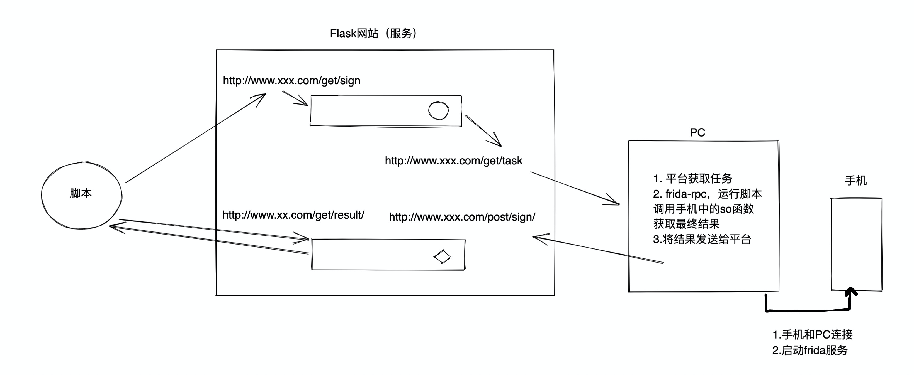
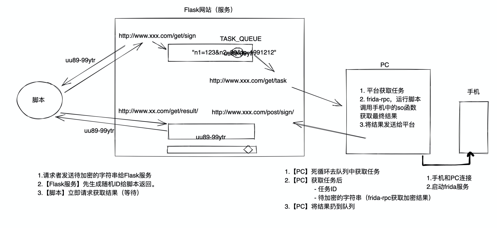

# day17 Flask服务搭建

基于Flask搭建API平台 + frida rpc【有些so无法破解】。







## 1.队列

- queue，队列。【Python内部，请求少】
- redis列表做队列。【请求多】
- kafka、rabbitMQ队列。【请求多】

```python
import queue
import threading
import uuid

q = queue.Queue()
queue_dict = {
    # "ac2d368c-9b4b-486b-842e-5fda5a9c5e2f":queue.Queue()
}


def pc():
    while True:
        # 阻塞，永远等待。
        un_encrypt_dict = q.get(block=True)
        print("PC在队列中获取到任务：", un_encrypt_dict)

        # PC应该获取数据，进行加密。
        task_id = un_encrypt_dict['uid']
        task_string = un_encrypt_dict['text']

        queue_dict[task_id].put("kdkasdfasdfa")


# PC永远在等待
pc = threading.Thread(target=pc)
pc.start()

# 脚本
while True:
    text = input("【脚本】>>>")  # n1=123&n2=99&ts=1991212
    uid = str(uuid.uuid4())

    # 将任务发送到队列
    info = {'uid': uid, 'text': text}
    queue_dict[uid] = queue.Queue()

    q.put(info)

    # 等待结果的到来(等待）
    print("【脚本】开始等待：")
    res = queue_dict[uid].get(block=True)
    print("【脚本】结果", res)
```


队列在等待时候，可以是否阻塞、超时时间：

```python
import queue

q = queue.Queue()
while True:
    try:
        # 代码队列中是否有数据，最多等待10s
        data = q.get(block=True, timeout=10)
        print(data)
    except queue.Empty as e:
        print("等待10s，队列依然没数据")
```


## 2.flask

```python
pip3.9 install flask
```


## 3.抖音示例（明文注册设备）

- PC启动frida
- service启动
- 启动PC
- 启动client调用


